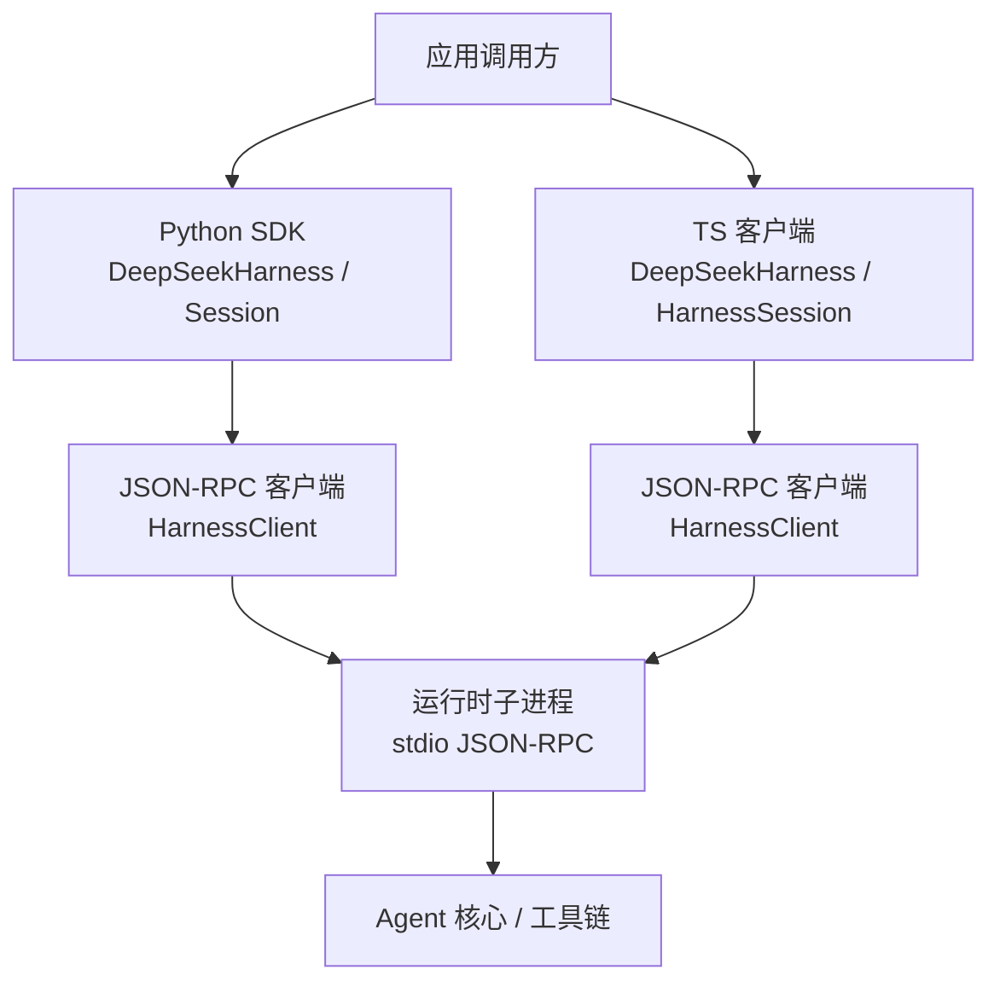
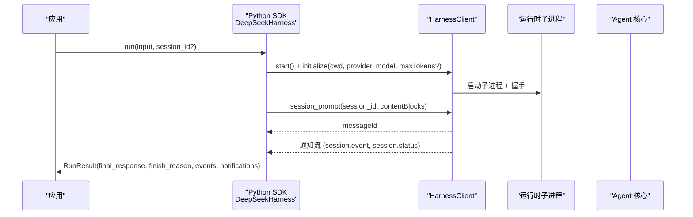
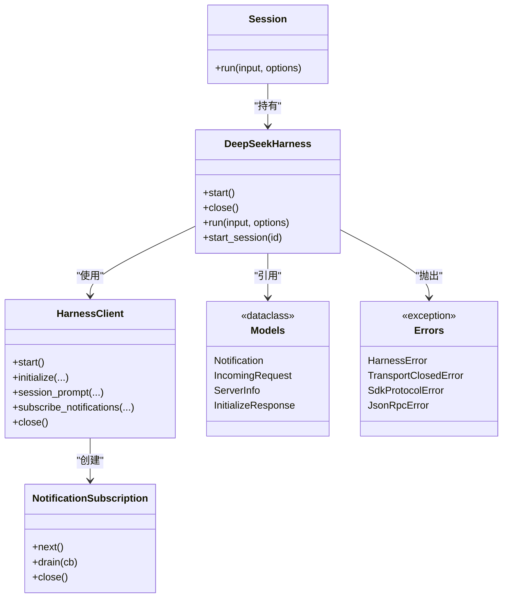

# API 参考

<cite>
**本文引用的文件**
- [python/sdk/src/deepseek_harness/__init__.py](file://python/sdk/src/deepseek_harness/__init__.py)
- [python/sdk/src/deepseek_harness/api.py](file://python/sdk/src/deepseek_harness/api.py)
- [python/sdk/src/deepseek_harness/client.py](file://python/sdk/src/deepseek_harness/client.py)
- [python/sdk/src/deepseek_harness/models.py](file://python/sdk/src/deepseek_harness/models.py)
- [python/sdk/src/deepseek_harness/errors.py](file://python/sdk/src/deepseek_harness/errors.py)
- [python/sdk/README.md](file://python/sdk/README.md)
- [packages/sdk/client/src/api.ts](file://packages/sdk/client/src/api.ts)
- [packages/api/gateway/src/index.ts](file://packages/api/gateway/src/index.ts)
- [packages/api/gateway/src/types.ts](file://packages/api/gateway/src/types.ts)
</cite>

## 目录
1. [简介](#简介)
2. [项目结构](#项目结构)
3. [核心组件](#核心组件)
4. [架构总览](#架构总览)
5. [详细组件分析](#详细组件分析)
6. [依赖关系分析](#依赖关系分析)
7. [性能考虑](#性能考虑)
8. [故障排查指南](#故障排查指南)
9. [结论](#结论)
10. [附录](#附录)

## 简介
本参考文档面向 DeepSeek Harness 的 Python SDK 与 TypeScript 客户端，系统化说明公共接口、类型定义、请求/响应格式、错误码与异常、版本兼容与迁移建议、最佳实践与性能优化，并提供完整代码示例与集成模式。Python SDK 通过 JSON-RPC over stdio 驱动本地运行时子进程；TypeScript 客户端提供等价的高层 API，便于在 Node.js 环境中复用相同语义。

## 项目结构
- Python SDK（deepseek_harness）：封装运行时子进程的启动、初始化、会话运行、通知订阅与结果聚合。
- TypeScript SDK 客户端（@deepseek-ai/dsh-sdk-client）：提供与 Python SDK 对等的 DeepSeekHarness/HarnessSession 高层 API。
- Typert Gateway（@deepseek-ai/dsh-api-gateway）：服务间远程方法调用的网关与错误分类体系。

图表来源
- [python/sdk/src/deepseek_harness/api.py:48-124](file://python/sdk/src/deepseek_harness/api.py#L48-L124)
- [python/sdk/src/deepseek_harness/client.py:37-155](file://python/sdk/src/deepseek_harness/client.py#L37-L155)
- [packages/sdk/client/src/api.ts:22-119](file://packages/sdk/client/src/api.ts#L22-L119)

章节来源
- [python/sdk/src/deepseek_harness/__init__.py:1-19](file://python/sdk/src/deepseek_harness/__init__.py#L1-L19)
- [python/sdk/README.md:1-52](file://python/sdk/README.md#L1-L52)

## 核心组件
- Python SDK
  - DeepSeekHarness：管理运行时子进程生命周期，支持上下文管理器或显式 close；提供 run/start_session。
  - Session：绑定会话 ID，发送 prompt 并等待整轮空闲，返回 RunResult。
  - HarnessClient：底层 JSON-RPC 客户端，负责启动子进程、initialize、session/prompt、通知订阅、关闭流程。
  - 数据模型：Notification、IncomingRequest、ServerInfo、InitializeResponse、RunResult。
  - 异常：HarnessError、TransportClosedError、SdkProtocolError、JsonRpcError。
- TypeScript 客户端
  - DeepSeekHarness：与 Python 端同构的高层入口，异步生命周期管理。
  - HarnessSession：按会话发送 prompt 并等待 idle，返回 RunResult。
  - 辅助函数：normalizeInput、finalResponse、validatedSessionEvent、isInboxReceipt。
- Typert Gateway
  - TypertGatewayService：基于 Cordis Services 和 Typert 注册表进行远程方法分发、参数校验、上下文解析与返回值解码。
  - TypertGatewayError：统一的基础设施错误，包含稳定 code、endpoint、field。
  - 类型契约：InvokeRemoteRequest、TypertGatewayErrorCode、TypertGateway。

章节来源
- [python/sdk/src/deepseek_harness/api.py:13-183](file://python/sdk/src/deepseek_harness/api.py#L13-L183)
- [python/sdk/src/deepseek_harness/client.py:24-155](file://python/sdk/src/deepseek_harness/client.py#L24-L155)
- [python/sdk/src/deepseek_harness/models.py:1-33](file://python/sdk/src/deepseek_harness/models.py#L1-L33)
- [python/sdk/src/deepseek_harness/errors.py:1-24](file://python/sdk/src/deepseek_harness/errors.py#L1-L24)
- [packages/sdk/client/src/api.ts:22-195](file://packages/sdk/client/src/api.ts#L22-L195)
- [packages/api/gateway/src/index.ts:90-184](file://packages/api/gateway/src/index.ts#L90-L184)
- [packages/api/gateway/src/types.ts:1-55](file://packages/api/gateway/src/types.ts#L1-L55)

## 架构总览
Python SDK 与 TS 客户端均通过 JSON-RPC over stdio 与本地运行时通信。典型调用序列如下：

图表来源
- [python/sdk/src/deepseek_harness/api.py:97-124](file://python/sdk/src/deepseek_harness/api.py#L97-L124)
- [python/sdk/src/deepseek_harness/client.py:63-155](file://python/sdk/src/deepseek_harness/client.py#L63-L155)

## 详细组件分析

### Python SDK 公共接口

#### DeepSeekHarnessConfig
- 字段
  - provider: string，默认 deepseek-official
  - model: string，默认 deepseek-v4-flash
  - max_tokens: number | undefined，可选每请求输出 token 上限
  - cwd: string | undefined，工作目录
  - runtime_cwd: string | undefined，运行时子进程工作目录
  - session_root: string | undefined，持久化根目录（注入环境变量）
  - cordis: string | undefined，Cordis 配置文件路径
  - env: dict[str, str]，子进程环境覆盖
  - runtime_bin: string | undefined，自定义运行时可执行路径
  - launch_args_override: tuple[str, ...] | undefined，启动参数覆盖
  - request_timeout_seconds: float | undefined，请求超时
  - shutdown_timeout_seconds: float，默认 1.0
  - base_url: string | undefined，注入 DEEPSEEK_BASE_URL
  - api_key: string | undefined，注入 DEEPSEEK_API_KEY

章节来源
- [python/sdk/src/deepseek_harness/api.py:13-36](file://python/sdk/src/deepseek_harness/api.py#L13-L36)

#### RunResult
- 字段
  - session_id: string
  - final_response: string，最后一个 assistant/message 文本拼接
  - finish_reason: string | None，最后一个 turn/end 的 kind
  - events: list[JsonObject]，根会话事件
  - notifications: list[Notification]，通知列表
  - session_root: string | None

章节来源
- [python/sdk/src/deepseek_harness/api.py:38-46](file://python/sdk/src/deepseek_harness/api.py#L38-L46)

#### DeepSeekHarness
- 关键方法
  - __init__(config=None, **kwargs)
  - start(): 启动子进程并 initialize
  - close(): 关闭子进程
  - start_session(session_id=None): 创建 Session
  - run(input, *, session_id=None, on_notification=None): 便捷运行
- 行为要点
  - 懒启动，跨多次调用复用子进程
  - 支持上下文管理器
  - 将配置项转换为环境变量并传递给 HarnessClient

章节来源
- [python/sdk/src/deepseek_harness/api.py:48-124](file://python/sdk/src/deepseek_harness/api.py#L48-L124)

#### Session
- 关键方法
  - run(input, *, on_notification=None): 发送 prompt，收集通知，等待 idle，返回 RunResult
- 内部逻辑
  - 规范化输入为内容块
  - 订阅会话树通知
  - 等待收件箱回执后开始收集
  - 以 session.status=idle 作为活动区间结束标志

章节来源
- [python/sdk/src/deepseek_harness/api.py:127-183](file://python/sdk/src/deepseek_harness/api.py#L127-L183)

#### HarnessClient
- 配置 HarnessConfig
  - runtime_bin, bridge_bin, launch_args_override, cwd, env, request_timeout_seconds, shutdown_timeout_seconds
- 关键方法
  - start(): 启动子进程，注入默认配置，启动读写线程
  - initialize(cwd, provider, model, max_tokens?): 握手
  - session_prompt(session_id, content_blocks, ...): 发送 prompt，返回 messageId
  - request(method, params, response_model, ...): 通用请求封装
  - subscribe_notifications(filter?): 订阅通知
  - subscribe_session_notifications(session_id): 按会话树过滤订阅
  - next_notification(), next_request(), respond(), respond_error()
  - close(): 优雅关闭，带诊断信息
- 通知订阅 NotificationSubscription
  - next(), drain(on_notification), close()

章节来源
- [python/sdk/src/deepseek_harness/client.py:24-558](file://python/sdk/src/deepseek_harness/client.py#L24-L558)

#### 数据模型
- Notification: { method: string, payload: JsonObject }
- IncomingRequest: { id: string|int, method: string, payload: JsonObject }
- ServerInfo: { name?: string, version?: string }
- InitializeResponse: { serverInfo?: ServerInfo }

章节来源
- [python/sdk/src/deepseek_harness/models.py:1-33](file://python/sdk/src/deepseek_harness/models.py#L1-L33)

#### 异常类型
- HarnessError：基础异常
- TransportClosedError：运行时子进程退出或 stdout 关闭
- SdkProtocolError：运行时数据违反协议
- JsonRpcError：JSON-RPC 错误响应，含 code、message、data

章节来源
- [python/sdk/src/deepseek_harness/errors.py:1-24](file://python/sdk/src/deepseek_harness/errors.py#L1-L24)

### TypeScript 客户端公共接口

#### DeepSeekHarness
- 构造参数：DeepSeekHarnessOptions（launch、cwd、provider、model、maxTokens）
- 方法
  - start(): Promise<void>，启动并握手
  - session(sessionId?): HarnessSession
  - run(input, options?): Promise<RunResult>
  - close(): Promise<void>
  - [Symbol.asyncDispose]()

章节来源
- [packages/sdk/client/src/api.ts:22-119](file://packages/sdk/client/src/api.ts#L22-L119)

#### HarnessSession
- 属性：harness, id
- 方法
  - run(input, options?): Promise<RunResult>
    - 发送 prompt，订阅会话树通知，等待收件箱回执与 idle
    - 返回 sessionId、finalResponse、events、notifications

章节来源
- [packages/sdk/client/src/api.ts:132-195](file://packages/sdk/client/src/api.ts#L132-L195)

#### 辅助函数
- normalizeInput(input): ContentBlock[]
- finalResponse(events): string
- validatedSessionEvent(value): SessionEvent
- isInboxReceipt(value, messageId): boolean

章节来源
- [packages/sdk/client/src/api.ts:197-247](file://packages/sdk/client/src/api.ts#L197-L247)

### Typert Gateway（服务间远程调用）

#### 类型与接口
- InvokeRemoteRequest: { namespace, method, args, signal? }
- TypertGatewayErrorCode: 稳定的失败类别集合
- TypertGateway: { invoke(request): Promise<unknown> }

章节来源
- [packages/api/gateway/src/types.ts:1-55](file://packages/api/gateway/src/types.ts#L1-L55)

#### 服务实现
- TypertGatewayService
  - 拦截 /api 路由，解析 endpoint，查找严格定义或 SRC 标记
  - 参数校验、上下文解析、调用业务方法、结果解码
  - 抛出 TypertGatewayError 表示基础设施/边界失败

章节来源
- [packages/api/gateway/src/index.ts:90-184](file://packages/api/gateway/src/index.ts#L90-L184)

#### 错误分类
- TypertGatewayError.code 包括：ambiguous-endpoint、arguments-invalid、binding-invalid、context-failed、context-not-found、context-unavailable、definition-unavailable、input-invalid、invocation-unavailable、lookup-failed、lookup-not-found、lookup-unavailable、method-unavailable、provider-mismatch、result-invalid、service-unavailable、signature-invalid

章节来源
- [packages/api/gateway/src/types.ts:18-37](file://packages/api/gateway/src/types.ts#L18-L37)
- [packages/api/gateway/src/index.ts:43-71](file://packages/api/gateway/src/index.ts#L43-L71)

## 依赖关系分析
- Python SDK 依赖关系
  - DeepSeekHarness -> HarnessClient -> 子进程 JSON-RPC
  - Session 依赖 HarnessClient 的通知订阅与会话树关系追踪
  - models 提供通用 JSON 类型与消息体
  - errors 提供结构化异常
- TypeScript 客户端依赖关系
  - DeepSeekHarness/HarnessSession 使用内部 HarnessClient 与类型验证
- Typert Gateway 依赖关系
  - 基于 Cordis Context/Services 与 Typert 注册表进行反射与分发

图表来源
- [python/sdk/src/deepseek_harness/api.py:48-183](file://python/sdk/src/deepseek_harness/api.py#L48-L183)
- [python/sdk/src/deepseek_harness/client.py:37-558](file://python/sdk/src/deepseek_harness/client.py#L37-L558)
- [python/sdk/src/deepseek_harness/models.py:1-33](file://python/sdk/src/deepseek_harness/models.py#L1-L33)
- [python/sdk/src/deepseek_harness/errors.py:1-24](file://python/sdk/src/deepseek_harness/errors.py#L1-L24)

章节来源
- [python/sdk/src/deepseek_harness/api.py:48-183](file://python/sdk/src/deepseek_harness/api.py#L48-L183)
- [python/sdk/src/deepseek_harness/client.py:37-558](file://python/sdk/src/deepseek_harness/client.py#L37-L558)
- [packages/sdk/client/src/api.ts:22-195](file://packages/sdk/client/src/api.ts#L22-L195)

## 性能考虑
- 子进程复用：DeepSeekHarness 保持子进程生命周期，避免重复启动开销。
- 超时控制：request_timeout_seconds 与 shutdown_timeout_seconds 控制请求与关闭行为。
- 通知批处理：NotificationSubscription.drain 批量消费通知，减少回调开销。
- 会话树过滤：subscribe_session_notifications 仅投递相关通知，降低无关事件处理成本。
- 标准 I/O 缓冲：子进程 stdin/stdout 采用行缓冲，确保低延迟消息传递。
- 诊断信息：关闭时收集 stderr 尾部与退出码，便于快速定位问题。

章节来源
- [python/sdk/src/deepseek_harness/client.py:63-116](file://python/sdk/src/deepseek_harness/client.py#L63-L116)
- [python/sdk/src/deepseek_harness/client.py:228-296](file://python/sdk/src/deepseek_harness/client.py#L228-L296)
- [python/sdk/src/deepseek_harness/client.py:403-422](file://python/sdk/src/deepseek_harness/client.py#L403-L422)

## 故障排查指南
- 常见异常
  - TransportClosedError：子进程退出或 stdout 关闭，检查子进程状态与 stderr 尾部。
  - SdkProtocolError：运行时数据不符合协议，检查 session.event 与 assistant/message 结构。
  - JsonRpcError：JSON-RPC 错误响应，查看 code、message、data。
- 超时与挂起
  - 若请求超时，捕获 TimeoutError 并查看诊断信息（退出码、stderr）。
- 通知丢失
  - 确认订阅了正确的会话树过滤器，且已等待收件箱回执后再收集事件。
- 关闭流程
  - 使用上下文管理器或显式 close，确保子进程被正确回收。

章节来源
- [python/sdk/src/deepseek_harness/errors.py:1-24](file://python/sdk/src/deepseek_harness/errors.py#L1-L24)
- [python/sdk/src/deepseek_harness/client.py:87-116](file://python/sdk/src/deepseek_harness/client.py#L87-L116)
- [python/sdk/src/deepseek_harness/client.py:228-296](file://python/sdk/src/deepseek_harness/client.py#L228-L296)

## 结论
本参考文档系统梳理了 DeepSeek Harness 的 Python SDK 与 TypeScript 客户端的公共接口、数据模型、错误体系与交互流程。通过子进程复用、通知过滤与超时控制等机制，提供了高效可靠的 agent 运行能力。Typert Gateway 为服务间远程调用提供了严格的类型契约与错误分类，便于构建可扩展的系统。

## 附录

### Python SDK 使用示例与集成模式
- 基本用法：使用上下文管理器启动 harness 并运行 prompt。
- 自定义配置：设置 provider、model、max_tokens、cordis 配置文件路径与环境变量。
- 会话复用：通过 start_session 获取 Session 实例，多次 run 共享同一会话。
- 通知处理：通过 on_notification 或 RunResult.notifications 观察会话事件。

章节来源
- [python/sdk/README.md:1-52](file://python/sdk/README.md#L1-L52)
- [python/sdk/src/deepseek_harness/api.py:48-124](file://python/sdk/src/deepseek_harness/api.py#L48-L124)

### TypeScript 客户端使用示例与集成模式
- 基本用法：await using 或显式 close 管理生命周期。
- 会话与运行：session().run() 或 harness.run() 直接运行。
- 通知与事件：onNotification 回调与 RunResult.events/notifications。

章节来源
- [packages/sdk/client/src/api.ts:22-195](file://packages/sdk/client/src/api.ts#L22-L195)

### 请求与响应格式
- 初始化请求：initialize({ cwd, provider, model, maxTokens? })
- Prompt 请求：session/prompt({ sessionId, contentBlocks })
- 通知类型：session.event、session.status、subagent.started/finished 等
- 结果结构：RunResult 包含 sessionId、finalResponse、finishReason、events、notifications

章节来源
- [python/sdk/src/deepseek_harness/client.py:117-155](file://python/sdk/src/deepseek_harness/client.py#L117-L155)
- [python/sdk/src/deepseek_harness/api.py:127-183](file://python/sdk/src/deepseek_harness/api.py#L127-L183)

### 错误码与异常类型
- Python SDK 异常：HarnessError、TransportClosedError、SdkProtocolError、JsonRpcError
- Typert Gateway 错误码：见 TypertGatewayErrorCode 集合
- 传输错误：TimeoutError、TransportClosedError

章节来源
- [python/sdk/src/deepseek_harness/errors.py:1-24](file://python/sdk/src/deepseek_harness/errors.py#L1-L24)
- [packages/api/gateway/src/types.ts:18-37](file://packages/api/gateway/src/types.ts#L18-L37)

### 版本兼容性与迁移指南
- Python SDK 与 TS 客户端保持语义一致：DeepSeekHarness/HarnessSession 对应 Session。
- 通知与事件结构保持稳定：assistant/message、turn/end 等关键字段。
- 迁移建议：从旧版通知监听迁移到会话树订阅，确保收件箱回执后再收集事件。

章节来源
- [packages/sdk/client/src/api.ts:132-195](file://packages/sdk/client/src/api.ts#L132-L195)
- [python/sdk/src/deepseek_harness/api.py:127-183](file://python/sdk/src/deepseek_harness/api.py#L127-L183)

### 最佳实践与性能优化建议
- 使用上下文管理器或 async with 管理生命周期。
- 合理设置 request_timeout_seconds 与 shutdown_timeout_seconds。
- 利用会话树订阅减少无关通知处理。
- 复用 DeepSeekHarness 实例以避免子进程频繁启动。
- 关注 stderr 尾部与退出码以快速定位问题。

章节来源
- [python/sdk/src/deepseek_harness/client.py:63-116](file://python/sdk/src/deepseek_harness/client.py#L63-L116)
- [python/sdk/src/deepseek_harness/client.py:403-422](file://python/sdk/src/deepseek_harness/client.py#L403-L422)