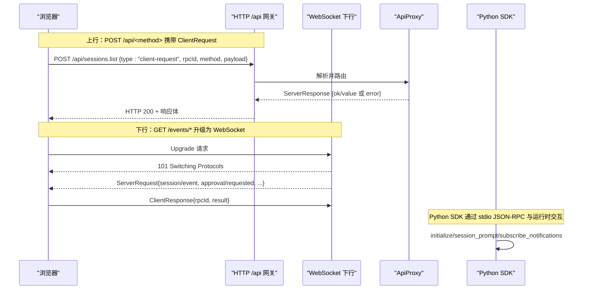
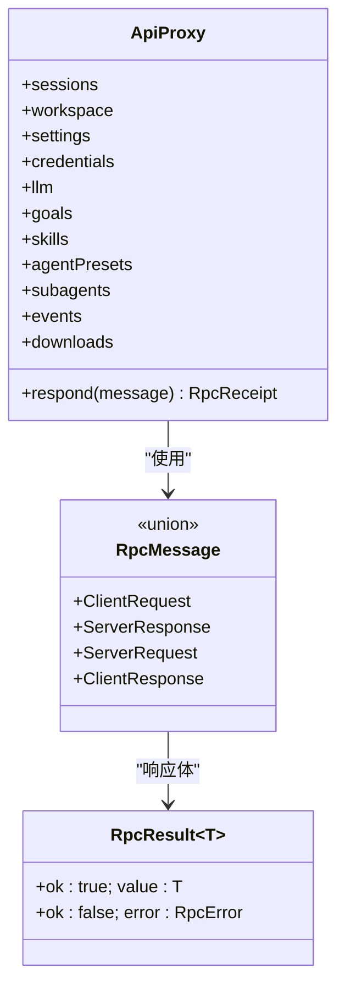
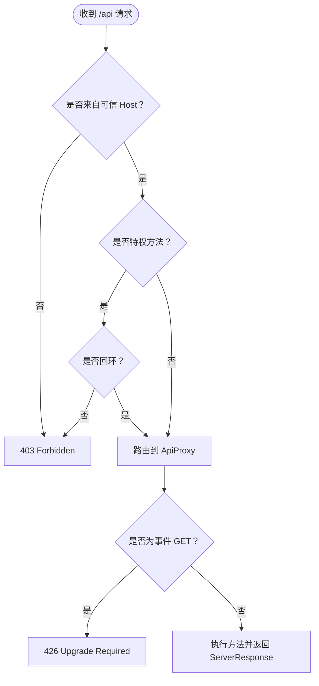
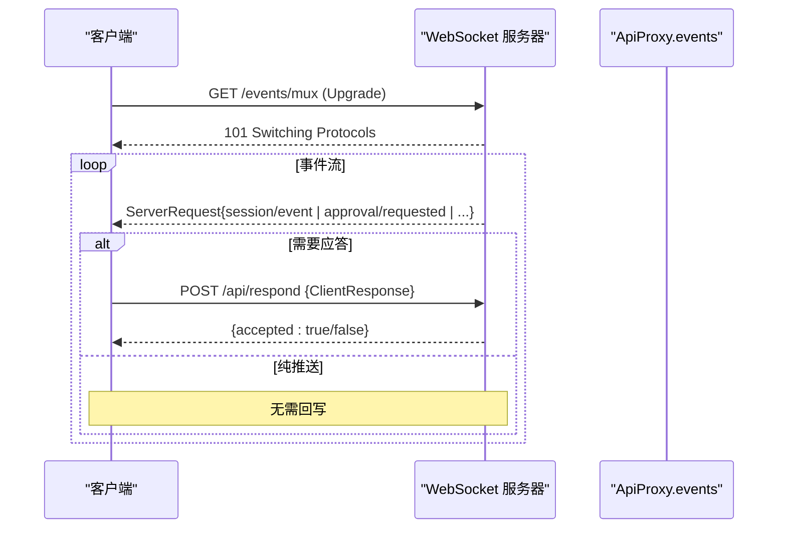
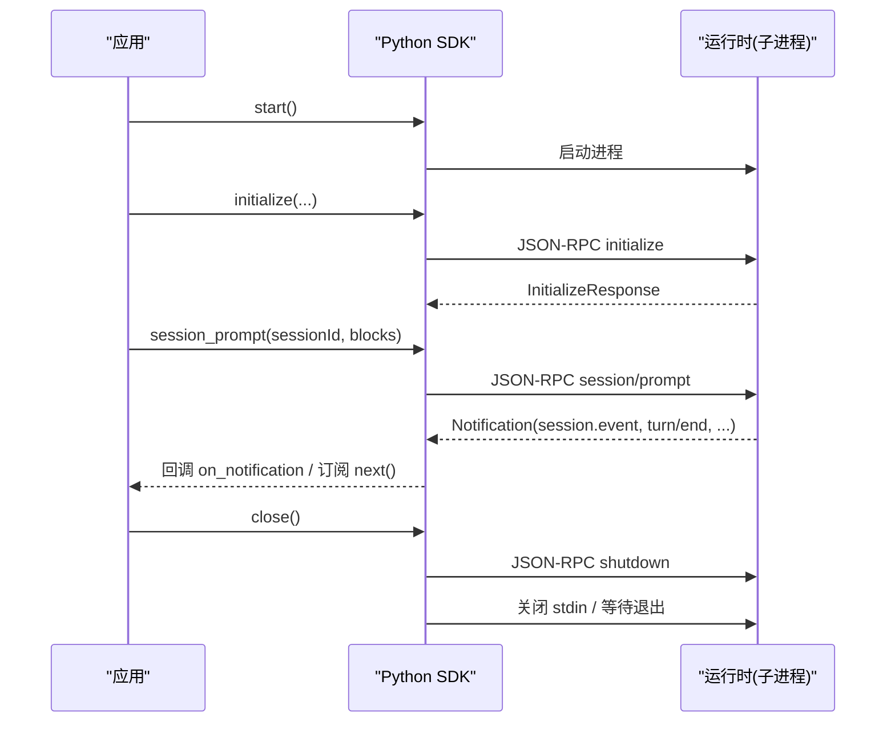
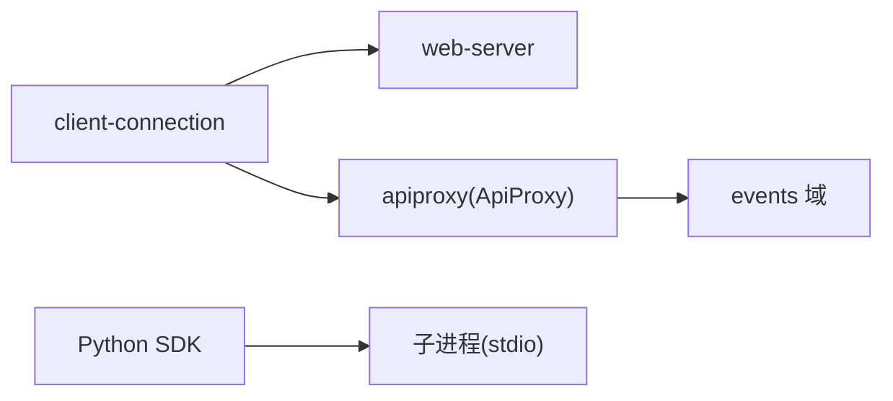

# API 参考

<cite>
**本文引用的文件**
- [packages/host/apiproxy/src/api/index.ts](file://packages/host/apiproxy/src/api/index.ts)
- [packages/host/apiproxy/src/api/rpc.ts](file://packages/host/apiproxy/src/api/rpc.ts)
- [packages/host/apiproxy/src/api/events.ts](file://packages/host/apiproxy/src/api/events.ts)
- [packages/client/connection/src/index.ts](file://packages/client/connection/src/index.ts)
- [packages/client/connection/src/api-request-trust.ts](file://packages/client/connection/src/api-request-trust.ts)
- [python/sdk/src/deepseek_harness/api.py](file://python/sdk/src/deepseek_harness/api.py)
- [python/sdk/src/deepseek_harness/client.py](file://python/sdk/src/deepseek_harness/client.py)
- [docs/subsystems/web-server.zh.md](file://docs/subsystems/web-server.zh.md)
</cite>

## 目录
1. [简介](#简介)
2. [项目结构](#项目结构)
3. [核心组件](#核心组件)
4. [架构总览](#架构总览)
5. [详细组件分析](#详细组件分析)
6. [依赖关系分析](#依赖关系分析)
7. [性能考虑](#性能考虑)
8. [故障排查指南](#故障排查指南)
9. [结论](#结论)
10. [附录](#附录)

## 简介
本参考文档面向 DeepSeek Harness 的对外与内部接口，覆盖：
- 统一 API 契约（四象限 RPC 模型）
- RESTful HTTP 端点与认证/信任边界
- WebSocket 下行事件流与升级流程
- Python SDK 的进程内 JSON-RPC 通信（IPC/stdio）
- 错误处理、速率限制、安全与版本兼容性建议
- 常见用例、客户端实现指南与性能优化技巧

## 项目结构
DeepSeek Harness 将“逻辑协议”与“物理通道”解耦：同一套四象限消息可在 HTTP POST、WebSocket 文本帧或进程内 SSE 上承载。浏览器侧通过 /api 前缀发起请求，并通过专用路径升级到 WebSocket 接收下行事件；Python SDK 通过子进程 stdio 以 JSON-RPC 方式与运行时交互。

```mermaid
graph TB
subgraph "浏览器/前端"
UI["Web 客户端"]
end
subgraph "主机服务"
WS["WebSocket 下行<br/>/events/mux, /events/host"]
HTTP["HTTP /api/* 网关"]
AP["ApiProxy 契约层"]
end
subgraph "Python SDK"
PYAPI["DeepSeekHarness / Session"]
PYCLI["HarnessClient (JSON-RPC over stdio)"]
end
UI --> |POST /api/<method><br/>四象限 ClientRequest| HTTP
UI --> |WS 升级| WS
HTTP --> AP
WS --> AP
PYAPI --> PYCLI
PYCLI < --> |"stdin/stdout JSON-RPC"| 运行时
```

图表来源
- [packages/client/connection/src/index.ts:130-195](file://packages/client/connection/src/index.ts#L130-L195)
- [packages/host/apiproxy/src/api/index.ts:21-42](file://packages/host/apiproxy/src/api/index.ts#L21-L42)
- [packages/host/apiproxy/src/api/rpc.ts:148-193](file://packages/host/apiproxy/src/api/rpc.ts#L148-L193)
- [python/sdk/src/deepseek_harness/api.py:48-124](file://python/sdk/src/deepseek_harness/api.py#L48-L124)
- [python/sdk/src/deepseek_harness/client.py:37-155](file://python/sdk/src/deepseek_harness/client.py#L37-L155)

章节来源
- [packages/host/apiproxy/src/api/index.ts:1-42](file://packages/host/apiproxy/src/api/index.ts#L1-L42)
- [packages/client/connection/src/index.ts:130-195](file://packages/client/connection/src/index.ts#L130-L195)
- [python/sdk/src/deepseek_harness/api.py:48-124](file://python/sdk/src/deepseek_harness/api.py#L48-L124)
- [python/sdk/src/deepseek_harness/client.py:37-155](file://python/sdk/src/deepseek_harness/client.py#L37-L155)

## 核心组件
- 统一 API 契约（ApiProxy）：定义领域方法集合（sessions、workspace、settings、credentials、llm、goals、skills、agentPresets、subagents、events、downloads），以及 respond 入口用于回写服务端请求。
- 四象限 RPC 消息模型：ClientRequest、ServerResponse、ServerRequest、ClientResponse，通过 type 字段区分；rpcId 由发起方生成并贯穿响应。
- 事件系统（EventsApi）：提供多路复用会话事件流（mux）和主机级事件流（host），包含审批/问答、队列快照、作业清单、投影更新等。
- 连接与安全：/api 路由受信任主机白名单保护；特权方法强制回环；GET 到事件路径返回 426 要求升级至 WebSocket。
- Python SDK：封装子进程生命周期、初始化、会话提示、通知订阅与结果聚合。

章节来源
- [packages/host/apiproxy/src/api/index.ts:21-42](file://packages/host/apiproxy/src/api/index.ts#L21-L42)
- [packages/host/apiproxy/src/api/rpc.ts:148-193](file://packages/host/apiproxy/src/api/rpc.ts#L148-L193)
- [packages/host/apiproxy/src/api/events.ts:46-156](file://packages/host/apiproxy/src/api/events.ts#L46-L156)
- [packages/client/connection/src/index.ts:130-195](file://packages/client/connection/src/index.ts#L130-L195)
- [python/sdk/src/deepseek_harness/api.py:48-124](file://python/sdk/src/deepseek_harness/api.py#L48-L124)
- [python/sdk/src/deepseek_harness/client.py:37-155](file://python/sdk/src/deepseek_harness/client.py#L37-L155)

## 架构总览
下图展示浏览器与主机之间的请求/响应与事件流，以及 Python SDK 的进程内通信。



图表来源
- [packages/host/apiproxy/src/api/rpc.ts:148-193](file://packages/host/apiproxy/src/api/rpc.ts#L148-L193)
- [packages/client/connection/src/index.ts:140-195](file://packages/client/connection/src/index.ts#L140-L195)
- [python/sdk/src/deepseek_harness/client.py:117-155](file://python/sdk/src/deepseek_harness/client.py#L117-L155)

## 详细组件分析

### 统一 API 契约（ApiProxy 与四象限 RPC）
- ApiProxy 暴露领域方法集与 respond 入口，新增领域需添加一个文件对与映射表行。
- 四象限消息：
  - ClientRequest：客户端发起，HTTP POST 负载
  - ServerResponse：对应请求的 HTTP 响应体
  - ServerRequest：服务端发起（审批/问答/事件等），WebSocket 文本帧
  - ClientResponse：客户端回写服务端请求，POST /api/respond
- 错误模型：RpcError 使用 code/details 描述业务错误；transportError 将传输异常折叠为 internal 错误。



图表来源
- [packages/host/apiproxy/src/api/index.ts:21-42](file://packages/host/apiproxy/src/api/index.ts#L21-L42)
- [packages/host/apiproxy/src/api/rpc.ts:148-193](file://packages/host/apiproxy/src/api/rpc.ts#L148-L193)

章节来源
- [packages/host/apiproxy/src/api/index.ts:21-42](file://packages/host/apiproxy/src/api/index.ts#L21-L42)
- [packages/host/apiproxy/src/api/rpc.ts:31-130](file://packages/host/apiproxy/src/api/rpc.ts#L31-L130)
- [packages/host/apiproxy/src/api/rpc.ts:148-193](file://packages/host/apiproxy/src/api/rpc.ts#L148-L193)

### RESTful API（HTTP）
- 路径与用途
  - POST /api/<method>：发送 ClientRequest，method 对应 ApiProxy 中的领域方法（如 session.list、session/prompt、workspace.* 等）。
  - POST /api/respond：回写服务端请求（ServerRequest）的 ClientResponse，携带原 rpcId。
  - GET /events/mux、GET /events/host：返回 426 并要求升级到 WebSocket。
- 认证与信任
  - 所有 /api 请求经过信任检查：Host 必须为回环或配置 trustedHosts 之一；跨站请求被拒绝。
  - 特权方法（如 settings.*、credentials.*、llm.discoverModels 等）强制回环访问。
- 请求/响应模式
  - 请求体：ClientRequest 四象限对象
  - 响应体：ServerResponse 四象限对象；HTTP 状态仅描述载体层（例如 426 升级要求）
- 速率限制
  - 代码未内置全局速率限制；可通过部署前置代理或上游策略实施。



图表来源
- [packages/client/connection/src/index.ts:140-195](file://packages/client/connection/src/index.ts#L140-L195)
- [packages/client/connection/src/api-request-trust.ts:1-28](file://packages/client/connection/src/api-request-trust.ts#L1-L28)

章节来源
- [packages/client/connection/src/index.ts:130-195](file://packages/client/connection/src/index.ts#L130-L195)
- [packages/client/connection/src/api-request-trust.ts:1-28](file://packages/client/connection/src/api-request-trust.ts#L1-L28)

### WebSocket API（下行事件流）
- 升级路径
  - GET /events/mux、GET /events/host：若未升级则返回 426 并附带 Upgrade 头。
  - 成功升级后，服务器持续推送 ServerRequest 帧（审批/问答、session/event、队列/作业快照、投影更新等）。
- 消息格式
  - 下行：ServerRequest{rpcId, method, payload}
  - 上行：ClientResponse{rpcId, result}（通过 POST /api/respond）
- 事件类型（MuxFrame/HostFrame）
  - MuxFrame：session/event、approval/requested、question/requested、session/queue、session/jobs、session/projection、stream/error 等
  - HostFrame：host/session-added/removed/status、host/agent-error、host/workspace-*、host/archived-sessions-changed、host/remote-event、stream/error
- 实时交互模式
  - 客户端维护 rpcId 关联，对可应答的 ServerRequest 通过 /api/respond 回写结果。
  - 纯推送事件无需回写。



图表来源
- [packages/host/apiproxy/src/api/events.ts:46-156](file://packages/host/apiproxy/src/api/events.ts#L46-L156)
- [packages/client/connection/src/index.ts:174-195](file://packages/client/connection/src/index.ts#L174-L195)

章节来源
- [packages/host/apiproxy/src/api/events.ts:46-156](file://packages/host/apiproxy/src/api/events.ts#L46-L156)
- [packages/client/connection/src/index.ts:174-195](file://packages/client/connection/src/index.ts#L174-L195)

### Socket API（二进制/帧）
- 本项目 WebSocket 使用文本帧承载四象限 JSON 消息，不定义自定义二进制帧。
- 如需二进制传输（如大附件），应通过现有 HTTP 下载面或分块上传机制配合业务语义完成。

章节来源
- [packages/host/apiproxy/src/api/rpc.ts:148-193](file://packages/host/apiproxy/src/api/rpc.ts#L148-L193)

### IPC/Pipe 通信（Python SDK）
- 通信方式：子进程 stdio，逐行 JSON-RPC 2.0 消息。
- 关键流程
  - 启动：HarnessClient.start() 拉起运行时进程，读取 stdout/stderr。
  - 初始化：initialize(cwd, provider, model, maxTokens)。
  - 会话提示：session_prompt(sessionId, contentBlocks) 返回 messageId。
  - 通知订阅：subscribe_session_notifications(sessionId) 过滤会话及子代理树事件。
  - 终止：shutdown 请求后关闭 stdin，等待进程退出。
- 数据流
  - 请求：{"jsonrpc":"2.0","id":uuid,"method":"...","params":{...}}
  - 响应：{"jsonrpc":"2.0","id":uuid,"result":{...}} 或 {"error":{code,message,data}}
  - 通知：{"jsonrpc":"2.0","method":"...","params":{...}}
- 进程同步
  - 关闭顺序：先发送 shutdown，再关闭 stdin，最后 terminate/kill 超时兜底。



图表来源
- [python/sdk/src/deepseek_harness/client.py:63-155](file://python/sdk/src/deepseek_harness/client.py#L63-L155)
- [python/sdk/src/deepseek_harness/client.py:228-296](file://python/sdk/src/deepseek_harness/client.py#L228-L296)
- [python/sdk/src/deepseek_harness/client.py:318-397](file://python/sdk/src/deepseek_harness/client.py#L318-L397)

章节来源
- [python/sdk/src/deepseek_harness/client.py:63-155](file://python/sdk/src/deepseek_harness/client.py#L63-L155)
- [python/sdk/src/deepseek_harness/client.py:228-296](file://python/sdk/src/deepseek_harness/client.py#L228-L296)
- [python/sdk/src/deepseek_harness/client.py:318-397](file://python/sdk/src/deepseek_harness/client.py#L318-L397)
- [python/sdk/src/deepseek_harness/api.py:48-124](file://python/sdk/src/deepseek_harness/api.py#L48-L124)

## 依赖关系分析
- 连接层依赖 WebServer 注册 /api 前缀与 WebSocket 升级路径，并在插件加载时校验 trustedHosts 与最大请求体大小。
- ApiProxy 作为契约层无 Node 依赖，可在浏览器导入；实际承载由 fetch/WebSocket/SSE 决定。
- Python SDK 依赖子进程管理、线程化 I/O、通知订阅与 JSON-RPC 编解码。



图表来源
- [packages/client/connection/src/index.ts:130-195](file://packages/client/connection/src/index.ts#L130-L195)
- [packages/host/apiproxy/src/api/index.ts:1-42](file://packages/host/apiproxy/src/api/index.ts#L1-L42)
- [python/sdk/src/deepseek_harness/client.py:63-155](file://python/sdk/src/deepseek_harness/client.py#L63-L155)

章节来源
- [packages/client/connection/src/index.ts:130-195](file://packages/client/connection/src/index.ts#L130-L195)
- [packages/host/apiproxy/src/api/index.ts:1-42](file://packages/host/apiproxy/src/api/index.ts#L1-L42)
- [python/sdk/src/deepseek_harness/client.py:63-155](file://python/sdk/src/deepseek_harness/client.py#L63-L155)

## 性能考虑
- 连接复用
  - 浏览器侧下行走 WebSocket，避免占用 HTTP/1.1 连接配额；开发环境默认明文 HTTP/1.1，生产建议前置支持 HTTP/2。
- 请求体限制
  - 最大请求体大小需满足图片附件上限（含 Base64 膨胀与信封开销），否则在插件加载阶段即报错。
- 流式事件
  - 事件流采用增量推送与快照混合（如 session/queue、session/jobs），客户端应以最新 seq 为准进行合并。
- 进程 I/O
  - Python SDK 使用独立读写线程与队列缓冲，注意合理设置请求超时与关闭超时，避免僵尸进程。

章节来源
- [packages/client/connection/src/index.ts:29-67](file://packages/client/connection/src/index.ts#L29-L67)
- [packages/host/apiproxy/src/api/events.ts:76-108](file://packages/host/apiproxy/src/api/events.ts#L76-L108)
- [python/sdk/src/deepseek_harness/client.py:228-296](file://python/sdk/src/deepseek_harness/client.py#L228-L296)

## 故障排查指南
- 403 Forbidden
  - 非可信 Host 或特权方法非回环访问。检查 trustedHosts 配置与请求 Host。
- 426 Upgrade Required
  - 对事件路径使用了 GET 但未升级 WebSocket。请改用 WebSocket 连接。
- 404 Not Found
  - apiProxy 未注入或路由未注册。检查插件加载顺序与上下文。
- 超时/关闭
  - Python SDK 在读取/写入失败或进程退出时会抛出带诊断信息的错误（包含退出码与 stderr 尾部）。
- 速率限制
  - 代码未内置；若上游 LLM 提供商返回限流，应在调用侧实现退避重试。

章节来源
- [packages/client/connection/src/index.ts:140-195](file://packages/client/connection/src/index.ts#L140-L195)
- [python/sdk/src/deepseek_harness/client.py:399-422](file://python/sdk/src/deepseek_harness/client.py#L399-L422)

## 结论
DeepSeek Harness 通过统一的四象限 RPC 契约将 HTTP、WebSocket 与进程内通信抽象一致，既保证了前后端解耦，又简化了扩展新领域的成本。结合严格的信任边界与清晰的错误模型，便于在生产环境中构建稳定、安全的集成方案。Python SDK 提供了简洁的进程内 JSON-RPC 封装，适合自动化与测试场景。

## 附录

### REST API 速查
- POST /api/<method>
  - 请求体：ClientRequest{type:"client-request", rpcId, method, payload}
  - 响应体：ServerResponse{type:"server-response", rpcId, result}
- POST /api/respond
  - 请求体：ClientResponse{type:"client-response", rpcId, result}
  - 响应体：{accepted:true/false, reason?}
- GET /events/mux、GET /events/host
  - 行为：返回 426 并要求 Upgrade: websocket

章节来源
- [packages/host/apiproxy/src/api/rpc.ts:148-193](file://packages/host/apiproxy/src/api/rpc.ts#L148-L193)
- [packages/client/connection/src/index.ts:140-195](file://packages/client/connection/src/index.ts#L140-L195)

### WebSocket 事件类型速查
- MuxFrame
  - session/event、session/subscribed、approval/requested、approval/resolved、question/requested、question/resolved、session/queue、session/jobs、session/projection、stream/error
- HostFrame
  - host/session-added、host/session-removed、host/session-status、host/agent-error、host/workspace-changed、host/workspace-removed、host/workspace-order-changed、host/archived-sessions-changed、host/remote-event、stream/error

章节来源
- [packages/host/apiproxy/src/api/events.ts:69-156](file://packages/host/apiproxy/src/api/events.ts#L69-L156)

### Python SDK 常用方法
- DeepSeekHarness
  - start/close/start_session/run
- HarnessClient
  - start/close/initialize/session_prompt/notify/next_notification/subscribe_notifications/subscribe_session_notifications/respond/respond_error

章节来源
- [python/sdk/src/deepseek_harness/api.py:48-124](file://python/sdk/src/deepseek_harness/api.py#L48-L124)
- [python/sdk/src/deepseek_harness/client.py:63-155](file://python/sdk/src/deepseek_harness/client.py#L63-L155)
- [python/sdk/src/deepseek_harness/client.py:180-227](file://python/sdk/src/deepseek_harness/client.py#L180-L227)

### 安全与版本说明
- 安全
  - 信任边界基于 Host 与 trustedHosts；特权方法强制回环；不实现应用层鉴权。
  - 浏览器同源与跨站防护由信任检查与升级策略共同保障。
- 版本
  - 事件与消息使用 schema 校验；未知字段按“宽数据+窄视图”原则处理，向后兼容未知事件类型。
  - 建议在客户端对版本号字段做容错与降级处理。

章节来源
- [packages/client/connection/src/api-request-trust.ts:1-28](file://packages/client/connection/src/api-request-trust.ts#L1-L28)
- [packages/host/apiproxy/src/api/events.ts:46-156](file://packages/host/apiproxy/src/api/events.ts#L46-L156)

### 迁移与兼容性
- 从 HTTP SSE 迁移到 WebSocket 下行：保持四象限消息不变，仅更换物理通道；GET 事件路径将返回 426 引导升级。
- 新增领域方法：在 ApiProxy 中添加字段与方法签名，并在映射表中登记，即可自动获得 HTTP/WebSocket 支持。
- Python SDK：保持 JSON-RPC 方法名与参数结构稳定；通知订阅支持会话树过滤，便于子代理场景迁移。

章节来源
- [packages/host/apiproxy/src/api/index.ts:21-42](file://packages/host/apiproxy/src/api/index.ts#L21-L42)
- [packages/client/connection/src/index.ts:140-195](file://packages/client/connection/src/index.ts#L140-L195)
- [python/sdk/src/deepseek_harness/client.py:192-205](file://python/sdk/src/deepseek_harness/client.py#L192-L205)