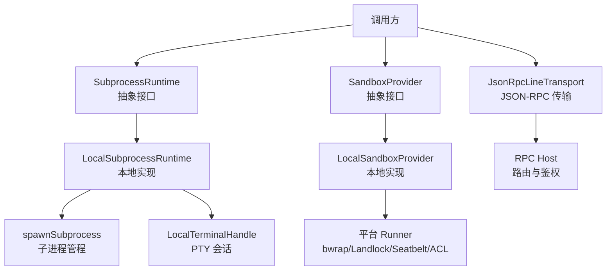
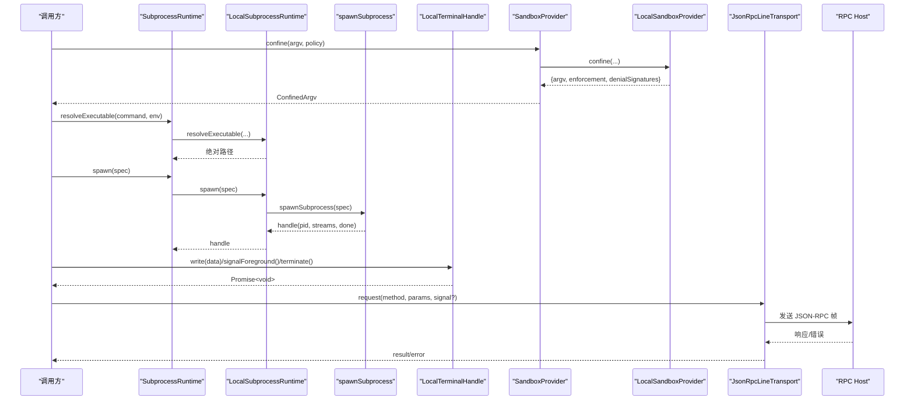
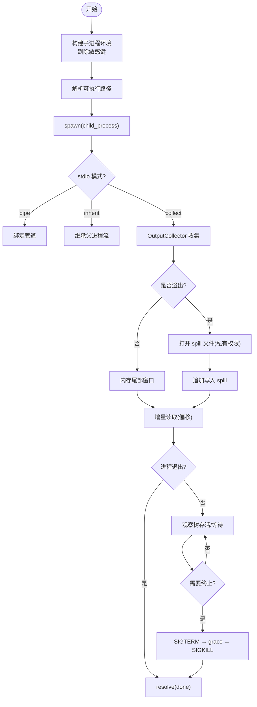
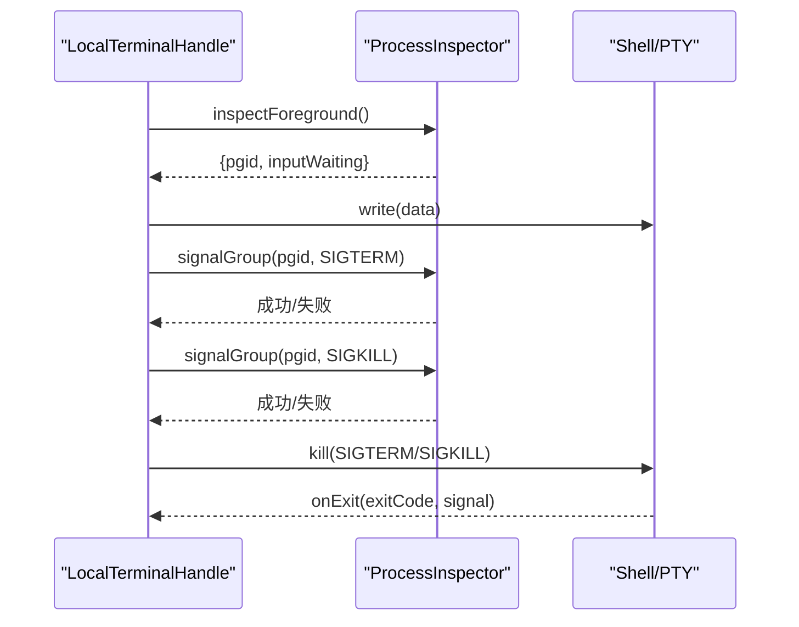
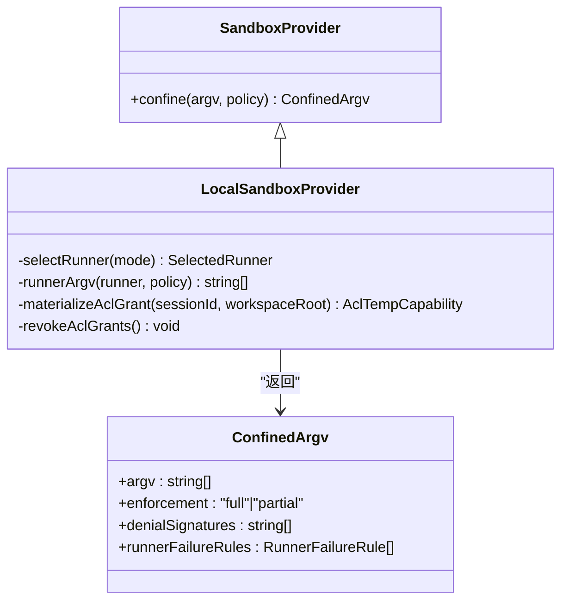
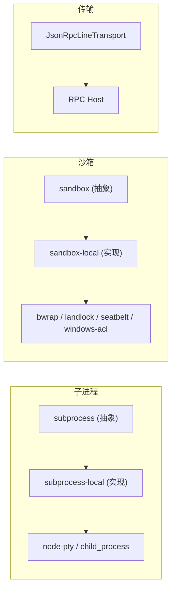

# IPC 通信 API

<cite>
**本文引用的文件**
- [packages/subprocess/subprocess/src/index.ts](file://packages/subprocess/subprocess/src/index.ts)
- [packages/subprocess/subprocess-local/src/index.ts](file://packages/subprocess/subprocess-local/src/index.ts)
- [packages/subprocess/subprocess-local/src/spawn.ts](file://packages/subprocess/subprocess-local/src/spawn.ts)
- [packages/subprocess/subprocess-local/src/terminal.ts](file://packages/subprocess/subprocess-local/src/terminal.ts)
- [packages/sandbox/sandbox/src/index.ts](file://packages/sandbox/sandbox/src/index.ts)
- [packages/sandbox/sandbox-local/src/index.ts](file://packages/sandbox/sandbox-local/src/index.ts)
- [packages/sdk/protocol/src/transport.ts](file://packages/sdk/protocol/src/transport.ts)
- [packages/client/connection/src/rpc-host.ts](file://packages/client/connection/src/rpc-host.ts)
</cite>

## 目录
1. [简介](#简介)
2. [项目结构](#项目结构)
3. [核心组件](#核心组件)
4. [架构总览](#架构总览)
5. [详细组件分析](#详细组件分析)
6. [依赖关系分析](#依赖关系分析)
7. [性能考虑](#性能考虑)
8. [故障排查指南](#故障排查指南)
9. [结论](#结论)
10. [附录](#附录)

## 简介
本文件系统化记录 DeepSeek Harness 的进程间通信（IPC）API，覆盖子进程管理、沙箱通信与原生组件交互；说明管道通信、共享内存与信号处理机制；提供跨语言通信示例与错误处理策略；并总结安全考虑、权限验证与资源隔离。

## 项目结构
- 子进程抽象与服务实现
  - 抽象服务：定义统一的子进程能力边界（执行环境解析、进程启动、终端会话、生命周期）。
  - 本地实现：基于 Node 子进程与 node-pty，提供管道 I/O、输出收集、树级信号与优雅终止。
- 沙箱能力
  - 抽象服务：定义“文件效果”策略（只读、工作区写入、危险全访问），封装平台限制与降级。
  - 本地实现：按平台选择 runner（bwrap/Landlock/Seatbelt/Windows ACL），生成受限 argv 并报告执行完整性。
- 传输层协议
  - JSON-RPC 行式传输：面向流的双向请求/响应/通知，支持超时中止与错误标准化。
  - RPC 路由与安全通道：对 HTTP 路径进行端点校验与信任域控制。



图表来源
- [packages/subprocess/subprocess/src/index.ts:74-140](file://packages/subprocess/subprocess/src/index.ts#L74-L140)
- [packages/subprocess/subprocess-local/src/index.ts:37-184](file://packages/subprocess/subprocess-local/src/index.ts#L37-L184)
- [packages/sandbox/sandbox/src/index.ts:158-176](file://packages/sandbox/sandbox/src/index.ts#L158-L176)
- [packages/sandbox/sandbox-local/src/index.ts:250-333](file://packages/sandbox/sandbox-local/src/index.ts#L250-L333)
- [packages/sdk/protocol/src/transport.ts:62-238](file://packages/sdk/protocol/src/transport.ts#L62-L238)
- [packages/client/connection/src/rpc-host.ts:200-224](file://packages/client/connection/src/rpc-host.ts#L200-L224)

章节来源
- [packages/subprocess/subprocess/src/index.ts:74-140](file://packages/subprocess/subprocess/src/index.ts#L74-L140)
- [packages/subprocess/subprocess-local/src/index.ts:37-184](file://packages/subprocess/subprocess-local/src/index.ts#L37-L184)
- [packages/sandbox/sandbox/src/index.ts:158-176](file://packages/sandbox/sandbox/src/index.ts#L158-L176)
- [packages/sandbox/sandbox-local/src/index.ts:250-333](file://packages/sandbox/sandbox-local/src/index.ts#L250-L333)
- [packages/sdk/protocol/src/transport.ts:62-238](file://packages/sdk/protocol/src/transport.ts#L62-L238)
- [packages/client/connection/src/rpc-host.ts:200-224](file://packages/client/connection/src/rpc-host.ts#L200-L224)

## 核心组件
- 子进程运行时（SubprocessRuntime）
  - 职责：解析可执行文件、启动受管进程树、分配 PTY 终端、统一生命周期与终止语义。
  - 关键约定：立即返回句柄；done 在进程关闭时解析；collect 模式为偏移读取且非消费型；终止采用 SIGTERM→grace→SIGKILL 升级；服务销毁时回收所有受管进程。
- 本地子进程实现（LocalSubprocessRuntime）
  - 职责：基于 child_process 与 node-pty 实现管道 I/O、输出收集（含溢出转 spill 文件）、树级信号、优雅退出。
  - 安全：清理敏感环境变量，避免凭据泄露；使用私有临时目录存储 spill 文件。
- 沙箱提供者（SandboxProvider）
  - 职责：将 argv 包装为受限执行形式，返回执行完整性与拒绝诊断特征。
  - 策略：read-only / workspace-write / danger-full-access；失败即关闭，不静默降级。
- 本地沙箱实现（LocalSandboxProvider）
  - 职责：按平台选择 runner（Linux bwrap/Landlock，macOS Seatbelt，Windows ACL），功能探测后缓存结果；维护写授权与临时目录生命周期。
- JSON-RPC 传输（JsonRpcLineTransport）
  - 职责：基于流的行分隔 JSON-RPC 2.0 帧，支持 request/response/notification、中止信号、错误码标准化。
- RPC 主机路由
  - 职责：校验通道与端点段，构造响应体，拒绝非法或保留通道。

章节来源
- [packages/subprocess/subprocess/src/index.ts:74-140](file://packages/subprocess/subprocess/src/index.ts#L74-L140)
- [packages/subprocess/subprocess-local/src/index.ts:37-184](file://packages/subprocess/subprocess-local/src/index.ts#L37-L184)
- [packages/sandbox/sandbox/src/index.ts:158-176](file://packages/sandbox/sandbox/src/index.ts#L158-L176)
- [packages/sandbox/sandbox-local/src/index.ts:250-333](file://packages/sandbox/sandbox-local/src/index.ts#L250-L333)
- [packages/sdk/protocol/src/transport.ts:62-238](file://packages/sdk/protocol/src/transport.ts#L62-L238)
- [packages/client/connection/src/rpc-host.ts:200-224](file://packages/client/connection/src/rpc-host.ts#L200-L224)

## 架构总览
下图展示从调用方到子进程与沙箱的端到端流程，以及 JSON-RPC 传输如何承载跨进程消息。



图表来源
- [packages/sandbox/sandbox/src/index.ts:158-176](file://packages/sandbox/sandbox/src/index.ts#L158-L176)
- [packages/sandbox/sandbox-local/src/index.ts:316-333](file://packages/sandbox/sandbox-local/src/index.ts#L316-L333)
- [packages/subprocess/subprocess/src/index.ts:118-140](file://packages/subprocess/subprocess/src/index.ts#L118-L140)
- [packages/subprocess/subprocess-local/src/index.ts:146-184](file://packages/subprocess/subprocess-local/src/index.ts#L146-L184)
- [packages/subprocess/subprocess-local/src/spawn.ts:326-543](file://packages/subprocess/subprocess-local/src/spawn.ts#L326-L543)
- [packages/subprocess/subprocess-local/src/terminal.ts:35-249](file://packages/subprocess/subprocess-local/src/terminal.ts#L35-L249)
- [packages/sdk/protocol/src/transport.ts:121-238](file://packages/sdk/protocol/src/transport.ts#L121-L238)
- [packages/client/connection/src/rpc-host.ts:200-224](file://packages/client/connection/src/rpc-host.ts#L200-L224)

## 详细组件分析

### 子进程管理与管道通信
- 进程启动与环境
  - 通过 resolveExecutable 解析绝对路径或 PATH 名称，拒绝相对路径以避免歧义。
  - 构建子进程环境时剔除敏感键（KEY/PASSWORD/SECRET/TOKEN 等）与 harness 标识前缀，防止凭据泄露。
- 管道 I/O 与输出收集
  - 支持 pipe/inherit/collect 三种 stdio 模式；collect 模式以字节为单位维护尾部窗口，超过阈值时写入 spill 文件，支持增量读取与丢失标记。
  - 输出收集器在溢出时创建私有 spill 文件（随机后缀、owner-only 权限），并在结束时密封与清理。
- 信号与终止
  - POSIX 下对负进程组号发送信号，Windows 使用 taskkill /T /F 终止整棵树。
  - 终止序列：SIGTERM → graceMs 等待 → SIGKILL；host exit 时直接 SIGKILL 并扫描后代。
  - 终端会话：识别前台进程组，禁止对 shell 根进程直接 SIGKILL，转而通过 terminate 完成会话清理。



图表来源
- [packages/subprocess/subprocess-local/src/spawn.ts:30-47](file://packages/subprocess/subprocess-local/src/spawn.ts#L30-L47)
- [packages/subprocess/subprocess-local/src/spawn.ts:104-251](file://packages/subprocess/subprocess-local/src/spawn.ts#L104-L251)
- [packages/subprocess/subprocess-local/src/spawn.ts:253-315](file://packages/subprocess/subprocess-local/src/spawn.ts#L253-L315)
- [packages/subprocess/subprocess-local/src/spawn.ts:326-543](file://packages/subprocess/subprocess-local/src/spawn.ts#L326-L543)

章节来源
- [packages/subprocess/subprocess/src/index.ts:44-66](file://packages/subprocess/subprocess/src/index.ts#L44-L66)
- [packages/subprocess/subprocess-local/src/index.ts:104-157](file://packages/subprocess/subprocess-local/src/index.ts#L104-L157)
- [packages/subprocess/subprocess-local/src/spawn.ts:30-47](file://packages/subprocess/subprocess-local/src/spawn.ts#L30-L47)
- [packages/subprocess/subprocess-local/src/spawn.ts:104-251](file://packages/subprocess/subprocess-local/src/spawn.ts#L104-L251)
- [packages/subprocess/subprocess-local/src/spawn.ts:253-315](file://packages/subprocess/subprocess-local/src/spawn.ts#L253-L315)
- [packages/subprocess/subprocess-local/src/spawn.ts:326-543](file://packages/subprocess/subprocess-local/src/spawn.ts#L326-L543)

### 终端会话与信号处理
- 前台进程组检测：通过进程检查器获取前台 pgid，判断 stdin 是否阻塞。
- 信号约束：禁止对 shell 根进程直接 SIGKILL，必须通过会话终止流程。
- 优雅关闭：先 SIGTERM 等待 grace，再 SIGKILL；多次扫描后代确保无残留。



图表来源
- [packages/subprocess/subprocess-local/src/terminal.ts:35-249](file://packages/subprocess/subprocess-local/src/terminal.ts#L35-L249)

章节来源
- [packages/subprocess/subprocess-local/src/terminal.ts:35-249](file://packages/subprocess/subprocess-local/src/terminal.ts#L35-L249)

### 沙箱通信与策略
- 策略模型：read-only、workspace-write、danger-full-access；provider 仅接受完全指定的策略，不做默认兜底。
- 平台选择：Linux 优先 bwrap（挂载配置贴近词汇表），其次 Landlock；macOS 使用 Seatbelt；Windows 使用 ACL 受限令牌。
- 执行完整性：每个 runner 声明 enforcement 级别（full/partial），并提供拒绝诊断签名与运行器失败规则。
- Windows ACL 写授权：工作区根 ACE 跨会话复用；每会话私有临时目录与 SID，提供撤销与清理。



图表来源
- [packages/sandbox/sandbox/src/index.ts:158-176](file://packages/sandbox/sandbox/src/index.ts#L158-L176)
- [packages/sandbox/sandbox-local/src/index.ts:250-333](file://packages/sandbox/sandbox-local/src/index.ts#L250-L333)
- [packages/sandbox/sandbox-local/src/index.ts:358-443](file://packages/sandbox/sandbox-local/src/index.ts#L358-L443)

章节来源
- [packages/sandbox/sandbox/src/index.ts:23-72](file://packages/sandbox/sandbox/src/index.ts#L23-L72)
- [packages/sandbox/sandbox/src/index.ts:158-176](file://packages/sandbox/sandbox/src/index.ts#L158-L176)
- [packages/sandbox/sandbox-local/src/index.ts:250-333](file://packages/sandbox/sandbox-local/src/index.ts#L250-L333)
- [packages/sandbox/sandbox-local/src/index.ts:358-443](file://packages/sandbox/sandbox-local/src/index.ts#L358-L443)

### 跨语言通信与 JSON-RPC 传输
- 行分隔 JSON-RPC 2.0：每条消息一行，包含 id/method/params/result/error。
- 请求/响应/通知：未注册方法返回 -32601，处理器异常返回 -32603；通知无处理器则丢弃。
- 中止支持：request 携带 AbortSignal，取消时移除待处理项并拒绝。
- 路由与鉴权：HTTP 路径需匹配通道与端点段模式，拒绝保留通道与非法路径。

```mermaid
sequenceDiagram
participant A as "客户端"
participant T as "JsonRpcLineTransport"
participant S as "服务端"
A->>T : request("method", params, signal?)
T->>S : {"jsonrpc" : "2.0","id" : ...,"method" : "...","params" : ...}
S-->>T : {"jsonrpc" : "2.0","id" : ...,"result" : ...}
T-->>A : 返回结果
Note over A,S : 若 method 未注册 -> -32601; 处理器抛错 -> -32603
```

图表来源
- [packages/sdk/protocol/src/transport.ts:121-238](file://packages/sdk/protocol/src/transport.ts#L121-L238)
- [packages/client/connection/src/rpc-host.ts:200-224](file://packages/client/connection/src/rpc-host.ts#L200-L224)

章节来源
- [packages/sdk/protocol/src/transport.ts:62-238](file://packages/sdk/protocol/src/transport.ts#L62-L238)
- [packages/client/connection/src/rpc-host.ts:200-224](file://packages/client/connection/src/rpc-host.ts#L200-L224)

## 依赖关系分析
- 子进程模块依赖
  - subprocess（抽象）← subprocess-local（本地实现）
  - subprocess-local 依赖 node-pty、child_process、fs、os、timers/promises
- 沙箱模块依赖
  - sandbox（抽象）← sandbox-local（本地实现）
  - sandbox-local 依赖平台工具（bwrap/landlock-run/sandbox-exec）与 windows-acl runner
- 传输层依赖
  - protocol transport 依赖 Node 流；RPC host 依赖 Web 路由与通道校验



图表来源
- [packages/subprocess/subprocess/src/index.ts:74-140](file://packages/subprocess/subprocess/src/index.ts#L74-L140)
- [packages/subprocess/subprocess-local/src/index.ts:37-184](file://packages/subprocess/subprocess-local/src/index.ts#L37-L184)
- [packages/sandbox/sandbox/src/index.ts:158-176](file://packages/sandbox/sandbox/src/index.ts#L158-L176)
- [packages/sandbox/sandbox-local/src/index.ts:250-333](file://packages/sandbox/sandbox-local/src/index.ts#L250-L333)
- [packages/sdk/protocol/src/transport.ts:62-238](file://packages/sdk/protocol/src/transport.ts#L62-L238)
- [packages/client/connection/src/rpc-host.ts:200-224](file://packages/client/connection/src/rpc-host.ts#L200-L224)

章节来源
- [packages/subprocess/subprocess/src/index.ts:74-140](file://packages/subprocess/subprocess/src/index.ts#L74-L140)
- [packages/subprocess/subprocess-local/src/index.ts:37-184](file://packages/subprocess/subprocess-local/src/index.ts#L37-L184)
- [packages/sandbox/sandbox/src/index.ts:158-176](file://packages/sandbox/sandbox/src/index.ts#L158-L176)
- [packages/sandbox/sandbox-local/src/index.ts:250-333](file://packages/sandbox/sandbox-local/src/index.ts#L250-L333)
- [packages/sdk/protocol/src/transport.ts:62-238](file://packages/sdk/protocol/src/transport.ts#L62-L238)
- [packages/client/connection/src/rpc-host.ts:200-224](file://packages/client/connection/src/rpc-host.ts#L200-L224)

## 性能考虑
- 输出收集
  - 内存尾部窗口避免大输出占用堆；spill 文件仅在溢出时启用，减少磁盘 IO。
  - spill 文件使用私有目录与 owner-only 权限，降低竞争与预测风险。
- 信号与终止
  - 使用进程组信号批量终止，减少 syscall 次数；Windows 使用 taskkill 一次性终止树。
  - graceMs 限制最大等待时间，避免长时间挂起。
- 沙箱选择
  - 首次功能探测后缓存结果，避免重复开销；单候选 runner 跳过探测。
- 传输层
  - JSON-RPC 行分隔减少缓冲复杂度；请求中止及时释放待处理映射。

[本节为通用指导，无需特定文件引用]

## 故障排查指南
- 子进程无法终止
  - 检查 treeAlive 判定逻辑与平台差异；确认 graceMs 设置合理；查看是否有 TERM 陷阱进程存活。
  - 参考：进程存活检测与信号发送路径。
- 输出缺失或截断
  - collect 模式下可能触发 spill 文件；通过 collected.stdout/stderr 的 spillPath 定位完整日志。
  - 参考：OutputCollector 的溢出与 spill 逻辑。
- 沙箱不可用
  - 当平台无可用 runner 或功能探测失败时抛出不可用错误；需安装对应工具或切换策略。
  - 参考：SandboxUnavailableError 与链式探测。
- JSON-RPC 方法未找到或处理器异常
  - 未注册方法返回 -32601；处理器抛错返回 -32603；检查路由注册与参数校验。
  - 参考：请求处理与错误响应路径。
- 权限与通道拒绝
  - RPC Host 对通道与端点进行严格校验；非法或保留通道将被拒绝。
  - 参考：endpointFromPath 与 assertChannel。

章节来源
- [packages/subprocess/subprocess-local/src/spawn.ts:380-425](file://packages/subprocess/subprocess-local/src/spawn.ts#L380-L425)
- [packages/subprocess/subprocess-local/src/spawn.ts:104-251](file://packages/subprocess/subprocess-local/src/spawn.ts#L104-L251)
- [packages/sandbox/sandbox/src/index.ts:126-144](file://packages/sandbox/sandbox/src/index.ts#L126-L144)
- [packages/sandbox/sandbox-local/src/index.ts:492-510](file://packages/sandbox/sandbox-local/src/index.ts#L492-L510)
- [packages/sdk/protocol/src/transport.ts:226-238](file://packages/sdk/protocol/src/transport.ts#L226-L238)
- [packages/client/connection/src/rpc-host.ts:200-224](file://packages/client/connection/src/rpc-host.ts#L200-L224)

## 结论
DeepSeek Harness 的 IPC 体系以“抽象服务 + 本地实现”为核心，结合严格的沙箱策略与健壮的 JSON-RPC 传输，实现了安全的子进程管理、可靠的管道通信与跨语言互操作。通过平台适配与功能探测，系统在 Linux/macOS/Windows 上均能提供一致的能力边界与错误语义。生产部署中应关注环境变量清洗、spill 文件安全、grace 超时配置与沙箱可用性，以确保稳定与安全的运行。

[本节为总结性内容，无需特定文件引用]

## 附录
- 环境变量清洗
  - 剔除敏感键与 harness 标识前缀，避免凭据泄露。
- 终止语义
  - 统一 SIGTERM→grace→SIGKILL；host exit 强制 SIGKILL。
- 沙箱策略
  - read-only/workspace-write/danger-full-access；失败即关闭。
- JSON-RPC 错误码
  - -32601 方法未找到；-32603 处理器异常。

章节来源
- [packages/subprocess/subprocess/src/index.ts:44-66](file://packages/subprocess/subprocess/src/index.ts#L44-L66)
- [packages/subprocess/subprocess-local/src/spawn.ts:439-457](file://packages/subprocess/subprocess-local/src/spawn.ts#L439-L457)
- [packages/sandbox/sandbox/src/index.ts:23-72](file://packages/sandbox/sandbox/src/index.ts#L23-L72)
- [packages/sdk/protocol/src/transport.ts:226-238](file://packages/sdk/protocol/src/transport.ts#L226-L238)