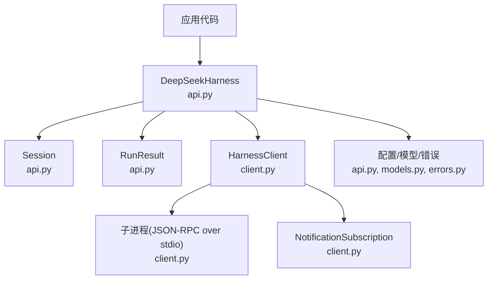
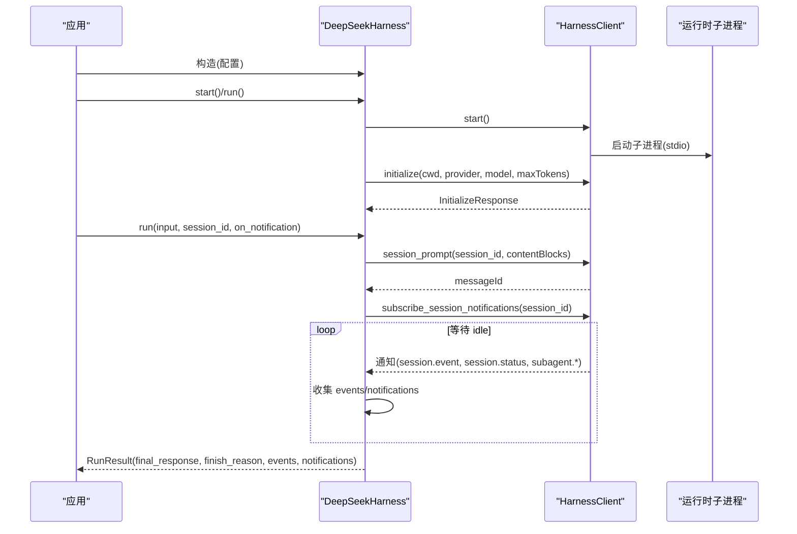
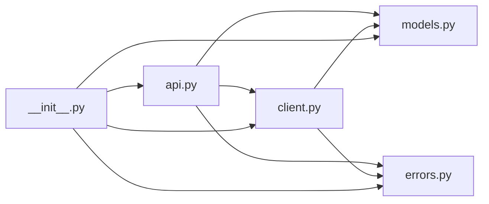

# API 接口模块

<cite>
**本文引用的文件**
- [__init__.py](file://python/sdk/src/deepseek_harness/__init__.py)
- [api.py](file://python/sdk/src/deepseek_harness/api.py)
- [client.py](file://python/sdk/src/deepseek_harness/client.py)
- [models.py](file://python/sdk/src/deepseek_harness/models.py)
- [errors.py](file://python/sdk/src/deepseek_harness/errors.py)
- [test_client.py](file://python/sdk/tests/test_client.py)
- [manual_sdk_agent_smoke.py](file://python/sdk/tests/manual_sdk_agent_smoke.py)
- [README.md](file://python/sdk/README.md)
- [python-sdk.zh.md](file://docs/user/guide/python-sdk.zh.md)
</cite>

## 目录
1. [简介](#简介)
2. [项目结构](#项目结构)
3. [核心组件](#核心组件)
4. [架构总览](#架构总览)
5. [详细组件分析](#详细组件分析)
6. [依赖关系分析](#依赖关系分析)
7. [性能与超时](#性能与超时)
8. [错误码与异常处理](#错误码与异常处理)
9. [使用示例与最佳实践](#使用示例与最佳实践)
10. [版本兼容性与迁移指南](#版本兼容性与迁移指南)
11. [结论](#结论)

## 简介
本模块提供 Python SDK，用于通过 JSON-RPC over stdio 驱动 DeepSeek Harness 运行时进程。它暴露高层的 Agent 管理、会话操作与工具调用能力，同时封装了子进程生命周期、请求/通知路由、超时与关闭等细节。典型用法包括：
- 启动并复用本地运行时进程
- 创建会话并发送提示（文本或结构化内容块）
- 订阅会话及子代理事件
- 获取最终回复、结束原因与完整事件流
- 配置模型、工作目录、会话根目录、Cordis 组合等

该 SDK 默认继承宿主环境变量（如 DEEPSEEK_API_KEY、DEEPSEEK_BASE_URL），便于直接对接真实模型端点或本地代理。

## 项目结构
Python SDK 位于 python/sdk/src/deepseek_harness，主要文件职责如下：
- __init__.py：统一导出公开 API（类、配置、结果、模型、错误）
- api.py：高层 API（DeepSeekHarness、Session、RunResult、配置）
- client.py：底层 JSON-RPC 客户端（子进程管理、消息收发、通知订阅）
- models.py：通用数据模型（Notification、IncomingRequest、InitializeResponse、ServerInfo）
- errors.py：异常体系（TransportClosedError、SdkProtocolError、JsonRpcError）

图表来源
- [api.py:13-124](file://python/sdk/src/deepseek_harness/api.py#L13-L124)
- [client.py:24-210](file://python/sdk/src/deepseek_harness/client.py#L24-L210)
- [models.py:13-33](file://python/sdk/src/deepseek_harness/models.py#L13-L33)
- [errors.py:4-24](file://python/sdk/src/deepseek_harness/errors.py#L4-L24)

章节来源
- [__init__.py:1-20](file://python/sdk/src/deepseek_harness/__init__.py#L1-L20)
- [api.py:13-124](file://python/sdk/src/deepseek_harness/api.py#L13-L124)
- [client.py:24-210](file://python/sdk/src/deepseek_harness/client.py#L24-L210)
- [models.py:13-33](file://python/sdk/src/deepseek_harness/models.py#L13-L33)
- [errors.py:4-24](file://python/sdk/src/deepseek_harness/errors.py#L4-L24)

## 核心组件
- DeepSeekHarness：高层入口，负责运行时子进程的延迟启动、初始化、会话创建与 run() 便捷调用。支持上下文管理器模式，确保资源释放。
- Session：绑定一个 session_id，封装一次“提示到空闲”的活动区间，收集事件与通知，返回 RunResult。
- RunResult：包含 session_id、final_response、finish_reason、events、notifications、session_root。
- HarnessClient：底层 JSON-RPC 客户端，管理子进程、读写消息、请求/响应匹配、通知分发、超时与关闭。
- NotificationSubscription：会话级通知订阅器，支持 next()/drain() 与自动关闭。
- 配置与模型：DeepSeekHarnessConfig、HarnessConfig、Notification、IncomingRequest、InitializeResponse、ServerInfo。
- 异常：HarnessError 基类，以及 TransportClosedError、SdkProtocolError、JsonRpcError。

章节来源
- [api.py:13-183](file://python/sdk/src/deepseek_harness/api.py#L13-L183)
- [client.py:24-210](file://python/sdk/src/deepseek_harness/client.py#L24-L210)
- [models.py:13-33](file://python/sdk/src/deepseek_harness/models.py#L13-L33)
- [errors.py:4-24](file://python/sdk/src/deepseek_harness/errors.py#L4-L24)

## 架构总览
SDK 采用“高层 API + 低层客户端 + 子进程运行时”的分层架构。高层 API 隐藏子进程与协议细节；低层客户端负责 JSON-RPC 通信、线程化读取、通知过滤与超时控制；运行时以独立进程运行，通过标准输入输出进行 JSON-RPC 交互。

图表来源
- [api.py:97-183](file://python/sdk/src/deepseek_harness/api.py#L97-L183)
- [client.py:63-155](file://python/sdk/src/deepseek_harness/client.py#L63-L155)
- [client.py:228-296](file://python/sdk/src/deepseek_harness/client.py#L228-L296)

## 详细组件分析

### DeepSeekHarness
- 作用：管理运行时子进程生命周期，提供 run() 和 start_session() 等高层方法。
- 关键行为：
  - 懒启动：首次调用 start() 时启动子进程并执行 initialize。
  - 环境注入：将 cwd、runtime_cwd、session_root、cordis、base_url、api_key 等转换为环境变量传递给子进程。
  - 会话创建：start_session() 生成或接收 session_id 并返回 Session。
  - 便捷 run()：委托给 Session.run()。
- 上下文管理：支持 with 语句，退出时 close()。

章节来源
- [api.py:13-124](file://python/sdk/src/deepseek_harness/api.py#L13-L124)

### Session
- 作用：围绕一个 session_id 组织一次活动区间，从收到收件箱回执开始，直到收到 idle 状态结束。
- 关键行为：
  - 输入标准化：字符串输入被包装为文本内容块列表。
  - 通知收集：通过订阅会话及其后代的通知，收集 session.event 与 session.status。
  - 结果构建：提取 final_response（最后一个 assistant/message 的文本拼接）、finish_reason（最后一个 turn/end 的 kind）。
- 注意：events 仅包含根会话事件；descendant 事件不会覆盖根会话的最终回复。

章节来源
- [api.py:127-183](file://python/sdk/src/deepseek_harness/api.py#L127-L183)

### RunResult
- 字段：
  - session_id：会话标识
  - final_response：最后一次提交的助手文本拼接
  - finish_reason：最后一个 turn/end 的 reason.kind，可能为 None
  - events：根会话事件列表
  - notifications：本次区间内的所有通知（含子代理生命周期）
  - session_root：会话根目录（来自配置）

章节来源
- [api.py:38-46](file://python/sdk/src/deepseek_harness/api.py#L38-L46)

### HarnessClient
- 作用：JSON-RPC 客户端，管理子进程、请求/响应、通知分发、超时与关闭。
- 关键能力：
  - start/close：启动/关闭子进程，优雅 shutdown，失败时强制终止。
  - initialize：向运行时发送初始化参数，返回服务器信息。
  - session_prompt：发送会话提示，返回 messageId。
  - request/notify：通用请求与通知。
  - subscribe_notifications/subscribe_session_notifications：订阅通知，支持过滤器与会话树传播。
  - next_request/respond/respond_error：桥接请求转发。
  - 线程化读取：reader_thread 解析 stdout 行，stderr_thread 捕获 stderr。
  - 超时与诊断：请求超时抛出 TimeoutError；关闭失败会附加 stderr 尾行与退出码。
- 会话树：记录 subagent.started/finished 的父子关系，实现跨订阅的祖先追踪。

章节来源
- [client.py:24-210](file://python/sdk/src/deepseek_harness/client.py#L24-L210)
- [client.py:228-296](file://python/sdk/src/deepseek_harness/client.py#L228-L296)
- [client.py:318-397](file://python/sdk/src/deepseek_harness/client.py#L318-L397)
- [client.py:460-504](file://python/sdk/src/deepseek_harness/client.py#L460-L504)

### NotificationSubscription
- 作用：会话级通知订阅器，支持阻塞 next() 与非阻塞 drain(on_notification)。
- 行为：
  - 自动关闭：with 上下文或显式 close() 移除订阅。
  - 错误透传：若订阅者遇到异常，next()/drain() 会抛出。

章节来源
- [client.py:507-546](file://python/sdk/src/deepseek_harness/client.py#L507-L546)

### 数据模型
- Notification：method + payload
- IncomingRequest：id + method + payload
- ServerInfo：name/version
- InitializeResponse：serverInfo

章节来源
- [models.py:13-33](file://python/sdk/src/deepseek_harness/models.py#L13-L33)

### 异常体系
- HarnessError：基类
- TransportClosedError：运行时子进程退出或 stdout 关闭
- SdkProtocolError：运行时违反 SDK 协议（例如 turn/end 缺少 reason.kind）
- JsonRpcError：运行时返回 JSON-RPC 错误响应，包含 code/message/data

章节来源
- [errors.py:4-24](file://python/sdk/src/deepseek_harness/errors.py#L4-L24)

## 依赖关系分析
- 模块耦合：
  - api.py 依赖 client.py、models.py、errors.py
  - client.py 依赖 models.py、errors.py
  - __init__.py 聚合导出以上模块
- 外部依赖：
  - pydantic：用于 InitializeResponse、ServerInfo 等模型校验
  - subprocess/threading/queue：子进程与并发读取
- 潜在循环依赖：无
- 集成点：
  - 子进程运行时通过 JSON-RPC over stdio 通信
  - 环境变量注入：DSH_CWD、DSH_SESSION_ROOT、DSH_CORDIS_CONFIG、DEEPSEEK_BASE_URL、DEEPSEEK_API_KEY

图表来源
- [api.py:1-11](file://python/sdk/src/deepseek_harness/api.py#L1-L11)
- [client.py:1-19](file://python/sdk/src/deepseek_harness/client.py#L1-L19)
- [__init__.py:1-20](file://python/sdk/src/deepseek_harness/__init__.py#L1-L20)

章节来源
- [api.py:1-11](file://python/sdk/src/deepseek_harness/api.py#L1-L11)
- [client.py:1-19](file://python/sdk/src/deepseek_harness/client.py#L1-L19)
- [__init__.py:1-20](file://python/sdk/src/deepseek_harness/__init__.py#L1-L20)

## 性能与超时
- 子进程复用：DeepSeekHarness 实例可多次调用 run()，避免重复启动开销。
- 请求超时：可通过 HarnessConfig.request_timeout_seconds 设置；超时抛出 TimeoutError，并附带运行时诊断信息（退出码、stderr 尾行）。
- 关闭超时：HarnessConfig.shutdown_timeout_seconds 控制 shutdown 等待时间；超时后强制 kill。
- 通知处理：Session.run() 在等待 idle 期间持续 drain 通知，避免阻塞主循环。
- 内存与队列：内部使用队列存储响应与通知，避免丢失；关闭时会清理并抛出运行时关闭异常。

章节来源
- [client.py:63-116](file://python/sdk/src/deepseek_harness/client.py#L63-L116)
- [client.py:228-296](file://python/sdk/src/deepseek_harness/client.py#L228-L296)
- [client.py:399-422](file://python/sdk/src/deepseek_harness/client.py#L399-L422)

## 错误码与异常处理
- JSON-RPC 错误：当运行时返回 error 对象时，客户端抛出 JsonRpcError，携带 code、message、data。
- 传输关闭：子进程退出或 stdout 关闭时抛出 TransportClosedError，并附带诊断信息。
- 协议违规：当 turn/end 事件缺少 data.reason.kind 时抛出 SdkProtocolError。
- 超时：请求未在规定时间内得到响应时抛出 TimeoutError。
- 建议：
  - 捕获 JsonRpcError 以区分运行时业务错误
  - 捕获 TransportClosedError 以处理子进程异常退出
  - 捕获 SdkProtocolError 以识别协议不一致问题
  - 合理设置 request_timeout_seconds 与 shutdown_timeout_seconds

章节来源
- [errors.py:4-24](file://python/sdk/src/deepseek_harness/errors.py#L4-L24)
- [api.py:225-242](file://python/sdk/src/deepseek_harness/api.py#L225-L242)
- [client.py:357-361](file://python/sdk/src/deepseek_harness/client.py#L357-L361)
- [client.py:268-276](file://python/sdk/src/deepseek_harness/client.py#L268-L276)

## 使用示例与最佳实践

### 基本用法：运行一次对话
- 步骤：
  - 导入 DeepSeekHarness
  - 使用 with 上下文管理生命周期
  - 调用 harness.run() 传入提示与可选 session_id
  - 读取 result.final_response、result.finish_reason、result.events、result.notifications

参考路径
- [README.md:18-27](file://python/sdk/README.md#L18-L27)
- [python-sdk.zh.md:56-79](file://docs/user/guide/python-sdk.zh.md#L56-L79)

### 自定义配置：指定 provider/model/max_tokens/cordis/session_root
- 通过 DeepSeekHarnessConfig 或关键字参数设置
- 环境变量会被注入到子进程：DEEPSEEK_BASE_URL、DEEPSEEK_API_KEY、DSH_CWD、DSH_SESSION_ROOT、DSH_CORDIS_CONFIG

参考路径
- [README.md:29-43](file://python/sdk/README.md#L29-L43)
- [api.py:13-83](file://python/sdk/src/deepseek_harness/api.py#L13-L83)

### 会话与通知：收集事件与回调
- 使用 on_notification 回调实时处理通知
- 使用 Session.run() 的返回值中的 notifications 与 events 做离线分析
- 注意：events 仅包含根会话事件；descendant 事件不会覆盖根回复

参考路径
- [api.py:132-183](file://python/sdk/src/deepseek_harness/api.py#L132-L183)
- [test_client.py:127-163](file://python/sdk/tests/test_client.py#L127-L163)

### 子代理与嵌套会话：父子关系追踪
- 运行时通过 subagent.started/finished 维护父子关系
- 订阅会话通知会自动包含后代会话的事件
- 测试覆盖了多层嵌套场景

参考路径
- [client.py:460-504](file://python/sdk/src/deepseek_harness/client.py#L460-L504)
- [test_client.py:280-339](file://python/sdk/tests/test_client.py#L280-L339)

### 端到端冒烟测试：对接 HTTP 模型端点
- 手动测试脚本演示如何启动内置运行时、设置 base_url 与 api_key、运行一次对话并验证最终回复与日志

参考路径
- [manual_sdk_agent_smoke.py:45-83](file://python/sdk/tests/manual_sdk_agent_smoke.py#L45-L83)

章节来源
- [README.md:18-43](file://python/sdk/README.md#L18-L43)
- [python-sdk.zh.md:56-81](file://docs/user/guide/python-sdk.zh.md#L56-L81)
- [test_client.py:127-339](file://python/sdk/tests/test_client.py#L127-L339)
- [manual_sdk_agent_smoke.py:45-83](file://python/sdk/tests/manual_sdk_agent_smoke.py#L45-L83)

## 版本兼容性与迁移指南
- 运行时选择：
  - 默认使用 bundled runtime（deepseek-harness-runtime-bin），无需额外安装 Node.js
  - 可通过 launch_args_override/runtime_bin/bridge_bin 指定自定义运行时
  - 当使用 bundled runtime 且未显式设置 DSH_CORDIS_CONFIG 时，SDK 自动注入默认配置
- 环境变量：
  - DEEPSEEK_BASE_URL、DEEPSEEK_API_KEY 由宿主继承并可覆盖
  - DSH_CWD、DSH_SESSION_ROOT、DSH_CORDIS_CONFIG 由 SDK 注入
- 迁移要点：
  - 若从旧版迁移，请确认 provider/model 与 Cordis 组合保持一致
  - 若自定义运行时，需确保其遵循 JSON-RPC over stdio 协议
  - 若启用子代理，需关注 subagent.* 通知与父子关系追踪

参考路径
- [client.py:424-454](file://python/sdk/src/deepseek_harness/client.py#L424-L454)
- [api.py:56-83](file://python/sdk/src/deepseek_harness/api.py#L56-L83)
- [README.md:27-49](file://python/sdk/README.md#L27-L49)

章节来源
- [client.py:424-454](file://python/sdk/src/deepseek_harness/client.py#L424-L454)
- [api.py:56-83](file://python/sdk/src/deepseek_harness/api.py#L56-L83)
- [README.md:27-49](file://python/sdk/README.md#L27-L49)

## 结论
本 SDK 提供了稳定、易用的 Python 接口来驱动 DeepSeek Harness 运行时。通过高层 API 隐藏子进程与协议细节，开发者可以专注于会话管理与事件处理。结合通知订阅与结果对象，能够灵活地实现 Agent 管理、会话操作与工具调用等核心场景。建议在工程中合理使用超时与异常处理，并结合 Cordis 组合与环境变量进行部署与配置。