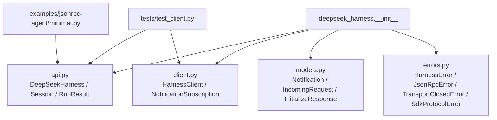
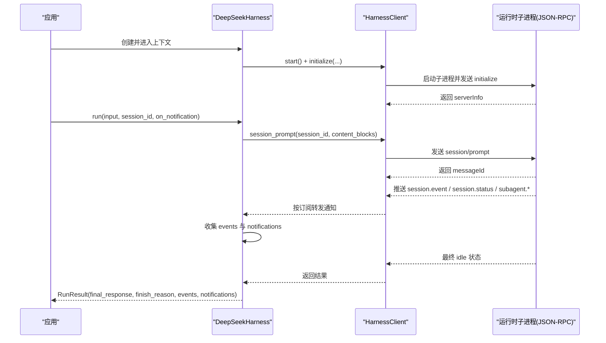
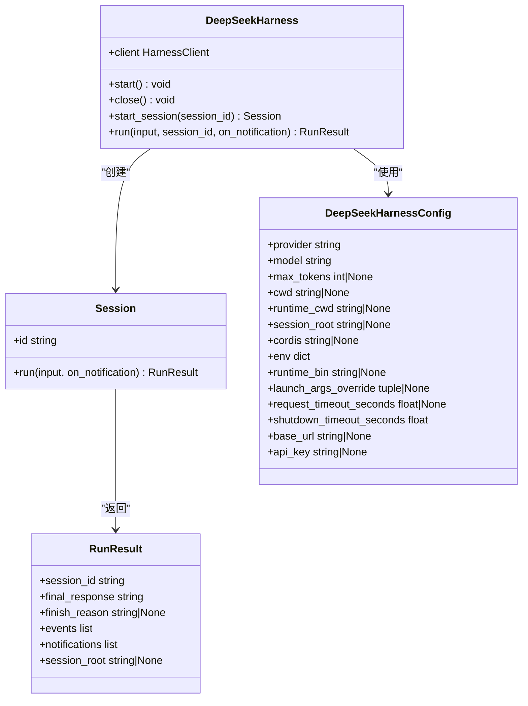
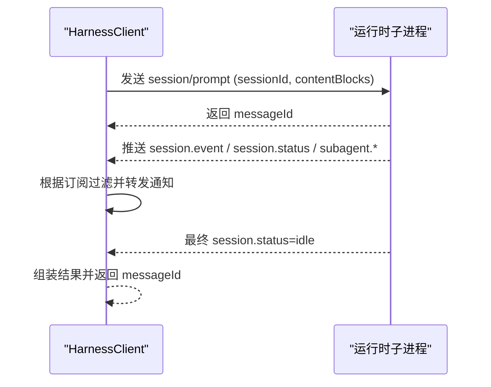
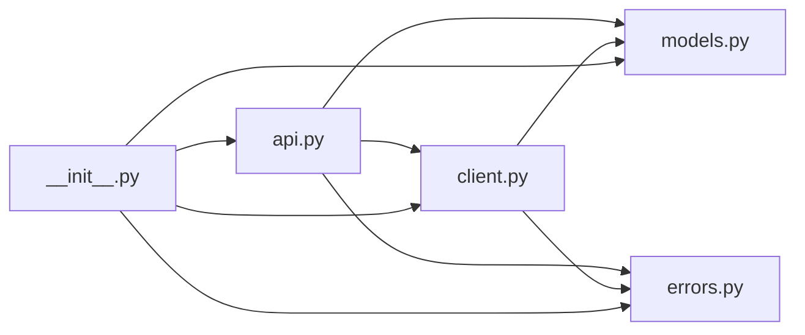

# Python SDK API

<cite>
**本文引用的文件**
- [python/sdk/src/deepseek_harness/__init__.py](file://python/sdk/src/deepseek_harness/__init__.py)
- [python/sdk/src/deepseek_harness/api.py](file://python/sdk/src/deepseek_harness/api.py)
- [python/sdk/src/deepseek_harness/client.py](file://python/sdk/src/deepseek_harness/client.py)
- [python/sdk/src/deepseek_harness/models.py](file://python/sdk/src/deepseek_harness/models.py)
- [python/sdk/src/deepseek_harness/errors.py](file://python/sdk/src/deepseek_harness/errors.py)
- [python/sdk/README.md](file://python/sdk/README.md)
- [examples/jsonrpc-agent/minimal.py](file://examples/jsonrpc-agent/minimal.py)
- [python/sdk/tests/test_client.py](file://python/sdk/tests/test_client.py)
- [python/sdk/tests/manual_sdk_agent_smoke.py](file://python/sdk/tests/manual_sdk_agent_smoke.py)
</cite>

## 目录
1. [简介](#简介)
2. [项目结构](#项目结构)
3. [核心组件](#核心组件)
4. [架构总览](#架构总览)
5. [详细组件分析](#详细组件分析)
6. [依赖关系分析](#依赖关系分析)
7. [性能与最佳实践](#性能与最佳实践)
8. [故障排查与调试](#故障排查与调试)
9. [结论](#结论)
10. [附录：配置与环境变量](#附录配置与环境变量)

## 简介
本文件为 DeepSeek Harness Python SDK 的完整 API 文档，覆盖所有模块、类、函数接口，说明参数类型、返回值与异常处理；提供同步与异步使用方式（通过事件回调实现“伪异步”）；文档化配置选项与环境变量；给出常见场景示例；解释与 Node.js 运行时的关系与兼容性；并提供错误处理、调试技巧与性能优化建议。

该 SDK 通过 JSON-RPC over stdio 启动并驱动一个本地子进程运行时（Node.js 或打包二进制），以会话为单位执行 Agent 轮次，收集事件与通知，返回最终响应与结束原因。

## 项目结构
Python SDK 位于 python/sdk 目录，核心代码在 deepseek_harness 包中，包含高层 API、低层客户端、数据模型与错误定义。测试与示例展示了典型用法。

图表来源
- [python/sdk/src/deepseek_harness/__init__.py:1-20](file://python/sdk/src/deepseek_harness/__init__.py#L1-L20)
- [python/sdk/src/deepseek_harness/api.py:1-243](file://python/sdk/src/deepseek_harness/api.py#L1-L243)
- [python/sdk/src/deepseek_harness/client.py:1-558](file://python/sdk/src/deepseek_harness/client.py#L1-L558)
- [python/sdk/src/deepseek_harness/models.py:1-33](file://python/sdk/src/deepseek_harness/models.py#L1-L33)
- [python/sdk/src/deepseek_harness/errors.py:1-24](file://python/sdk/src/deepseek_harness/errors.py#L1-L24)
- [examples/jsonrpc-agent/minimal.py:1-44](file://examples/jsonrpc-agent/minimal.py#L1-L44)
- [python/sdk/tests/test_client.py:1-800](file://python/sdk/tests/test_client.py#L1-L800)

章节来源
- [python/sdk/src/deepseek_harness/__init__.py:1-20](file://python/sdk/src/deepseek_harness/__init__.py#L1-L20)
- [python/sdk/README.md:1-52](file://python/sdk/README.md#L1-L52)

## 核心组件
- 高层 API：DeepSeekHarness、Session、RunResult、DeepSeekHarnessConfig
- 低层客户端：HarnessClient、HarnessConfig、NotificationSubscription
- 数据模型：Notification、IncomingRequest、InitializeResponse、ServerInfo、JsonObject/JsonValue
- 错误体系：HarnessError、TransportClosedError、SdkProtocolError、JsonRpcError

章节来源
- [python/sdk/src/deepseek_harness/api.py:13-183](file://python/sdk/src/deepseek_harness/api.py#L13-L183)
- [python/sdk/src/deepseek_harness/client.py:24-210](file://python/sdk/src/deepseek_harness/client.py#L24-L210)
- [python/sdk/src/deepseek_harness/models.py:8-33](file://python/sdk/src/deepseek_harness/models.py#L8-L33)
- [python/sdk/src/deepseek_harness/errors.py:4-24](file://python/sdk/src/deepseek_harness/errors.py#L4-L24)

## 架构总览
SDK 通过启动一个本地子进程运行时（Node.js 或打包二进制），使用 JSON-RPC over stdio 进行通信。高层 API 封装了会话生命周期、事件收集与结果聚合；低层客户端负责进程管理、消息路由、超时与诊断信息收集。

图表来源
- [python/sdk/src/deepseek_harness/api.py:97-183](file://python/sdk/src/deepseek_harness/api.py#L97-L183)
- [python/sdk/src/deepseek_harness/client.py:63-155](file://python/sdk/src/deepseek_harness/client.py#L63-L155)
- [python/sdk/src/deepseek_harness/client.py:228-296](file://python/sdk/src/deepseek_harness/client.py#L228-L296)

## 详细组件分析

### 高层 API：DeepSeekHarness
- 作用：封装运行时子进程的启动、初始化与会话执行；支持上下文管理器自动关闭；复用同一实例多次调用。
- 关键方法
  - __init__(config=None, **kwargs)：接受配置对象或关键字参数；内部构建 HarnessConfig 并注入环境变量。
  - start()：懒启动子进程并发送 initialize（provider/model/max_tokens/cwd）。
  - close()：发送 shutdown 并清理资源。
  - start_session(session_id=None)：创建 Session 实例，必要时先启动。
  - run(input, *, session_id=None, on_notification=None)：便捷入口，委托给 Session.run。
- 参数与类型
  - input: str | list[JsonObject]
  - session_id: str | None
  - on_notification: Callable[[Notification], None] | None
- 返回值
  - RunResult：包含 session_id、final_response、finish_reason、events、notifications、session_root。
- 异常
  - 若 turn/end 缺少 data.reason.kind，抛出 SdkProtocolError。
- 行为要点
  - 自动将 cwd/runtime_cwd 解析为绝对路径。
  - 自动注入 DEEPSEEK_BASE_URL、DEEPSEEK_API_KEY、DSH_CWD、DSH_SESSION_ROOT、DSH_CORDIS_CONFIG 等环境变量。
  - 支持 launch_args_override 与 runtime_bin 指定自定义运行时。

章节来源
- [python/sdk/src/deepseek_harness/api.py:13-124](file://python/sdk/src/deepseek_harness/api.py#L13-L124)
- [python/sdk/src/deepseek_harness/api.py:186-243](file://python/sdk/src/deepseek_harness/api.py#L186-L243)

#### 类图（高层 API）

图表来源
- [python/sdk/src/deepseek_harness/api.py:13-183](file://python/sdk/src/deepseek_harness/api.py#L13-L183)

### 低层客户端：HarnessClient
- 作用：JSON-RPC over stdio 的同步客户端；管理子进程生命周期；请求-响应与通知路由；超时控制；诊断信息收集。
- 关键方法
  - start()：启动子进程，读取 stdout/stderr，启动读写线程。
  - initialize(cwd, provider, model, max_tokens=None) -> InitializeResponse
  - session_prompt(session_id, content_blocks, *, on_notification=None, notification_subscription=None) -> str（messageId）
  - request(method, params, response_model, timeout_seconds=None, ...) -> ModelT
  - notify(method, params=None)
  - next_notification() -> Notification
  - subscribe_notifications(filter=None) -> NotificationSubscription
  - subscribe_session_notifications(session_id) -> NotificationSubscription
  - next_request() -> IncomingRequest
  - respond(request_id, result)
  - respond_error(request_id, code, message, data=None)
  - close()：优雅关闭，失败时强制终止。
- 参数与类型
  - HarnessConfig：runtime_bin、bridge_bin、launch_args_override、cwd、env、request_timeout_seconds、shutdown_timeout_seconds
  - request：method、params、response_model、timeout_seconds、on_notification、notification_filter、notification_subscription
- 返回值
  - 各方法返回对应 Pydantic 模型或原始值；session_prompt 返回 messageId。
- 异常
  - TimeoutError：请求超时。
  - TransportClosedError：运行时退出或 stdout 关闭。
  - JsonRpcError：运行时返回 JSON-RPC error。
  - TypeError：非对象响应。
- 行为要点
  - 自动注入 bundled 默认配置（当未显式指定运行时/桥接器且未设置 DSH_CORDIS_CONFIG）。
  - 维护子代理父子关系，确保订阅能正确匹配根会话及其后代。
  - 捕获 stderr 尾部用于诊断。

章节来源
- [python/sdk/src/deepseek_harness/client.py:24-210](file://python/sdk/src/deepseek_harness/client.py#L24-L210)
- [python/sdk/src/deepseek_harness/client.py:228-296](file://python/sdk/src/deepseek_harness/client.py#L228-L296)
- [python/sdk/src/deepseek_harness/client.py:424-455](file://python/sdk/src/deepseek_harness/client.py#L424-L455)

#### 序列图：session_prompt 流程

图表来源
- [python/sdk/src/deepseek_harness/client.py:138-155](file://python/sdk/src/deepseek_harness/client.py#L138-L155)
- [python/sdk/src/deepseek_harness/client.py:228-296](file://python/sdk/src/deepseek_harness/client.py#L228-L296)

### 数据模型
- Notification：{method, payload}
- IncomingRequest：{id, method, payload}
- ServerInfo：{name?, version?}
- InitializeResponse：{serverInfo?}
- JsonObject/JsonValue：通用 JSON 类型别名

章节来源
- [python/sdk/src/deepseek_harness/models.py:8-33](file://python/sdk/src/deepseek_harness/models.py#L8-L33)

### 错误体系
- HarnessError：基类
- TransportClosedError：运行时退出或 stdout 关闭
- SdkProtocolError：运行时违反协议（如 turn/end 缺少 reason.kind）
- JsonRpcError：JSON-RPC 错误响应，包含 code/message/data

章节来源
- [python/sdk/src/deepseek_harness/errors.py:4-24](file://python/sdk/src/deepseek_harness/errors.py#L4-L24)

## 依赖关系分析
- 模块耦合
  - api.py 依赖 client.py、models.py、errors.py
  - client.py 依赖 models.py、errors.py，并通过 subprocess 与外部运行时交互
  - __init__.py 统一导出公共 API
- 外部依赖
  - 运行时：Node.js 或打包二进制（由 deepseek-harness-runtime-bin 提供）
  - Pydantic：用于响应模型校验
- 潜在循环依赖：无
- 集成点
  - JSON-RPC over stdio
  - 环境变量：DEEPSEEK_BASE_URL、DEEPSEEK_API_KEY、DSH_*

图表来源
- [python/sdk/src/deepseek_harness/__init__.py:1-20](file://python/sdk/src/deepseek_harness/__init__.py#L1-L20)
- [python/sdk/src/deepseek_harness/api.py:1-20](file://python/sdk/src/deepseek_harness/api.py#L1-L20)
- [python/sdk/src/deepseek_harness/client.py:1-20](file://python/sdk/src/deepseek_harness/client.py#L1-L20)

章节来源
- [python/sdk/src/deepseek_harness/__init__.py:1-20](file://python/sdk/src/deepseek_harness/__init__.py#L1-L20)

## 性能与最佳实践
- 复用 Harness 实例：避免重复启动子进程，减少开销。
- 合理设置超时：
  - request_timeout_seconds：防止长时间阻塞。
  - shutdown_timeout_seconds：确保快速回收资源。
- 使用 on_notification 实时处理事件：避免轮询，降低延迟。
- 控制会话粒度：独立任务使用新 session_id；需要持久对话再复用。
- 限制工作空间与权限：仅授予必要文件系统访问，避免危险操作。
- 日志与诊断：利用 stderr 尾部与异常中的诊断信息定位问题。
- 批量与并发：在同一 Harness 实例内串行调用更安全；如需并发，注意通知订阅隔离。

章节来源
- [python/sdk/src/deepseek_harness/client.py:63-116](file://python/sdk/src/deepseek_harness/client.py#L63-L116)
- [python/sdk/src/deepseek_harness/client.py:228-296](file://python/sdk/src/deepseek_harness/client.py#L228-L296)
- [python/sdk/README.md:25-49](file://python/sdk/README.md#L25-L49)

## 故障排查与调试
- 常见问题
  - 运行时未找到：安装 deepseek-harness-runtime-bin 或设置 runtime_bin。
  - 请求超时：检查 request_timeout_seconds 与后端可用性；查看 stderr 尾部。
  - 传输关闭：运行时意外退出或 stdout 关闭；检查进程状态与诊断信息。
  - 协议错误：turn/end 缺少 reason.kind；检查运行时输出是否符合协议。
- 调试技巧
  - 使用 on_notification 打印事件流，确认消息顺序与内容。
  - 使用 launch_args_override 指向自定义脚本，模拟运行时行为。
  - 设置 DSH_CORDIS_CONFIG 指向自定义配置，逐步缩小问题范围。
  - 捕获异常并记录 stderr 尾部，便于复现与分析。

章节来源
- [python/sdk/src/deepseek_harness/client.py:403-422](file://python/sdk/src/deepseek_harness/client.py#L403-L422)
- [python/sdk/src/deepseek_harness/errors.py:4-24](file://python/sdk/src/deepseek_harness/errors.py#L4-L24)
- [python/sdk/tests/test_client.py:720-783](file://python/sdk/tests/test_client.py#L720-L783)

## 结论
DeepSeek Harness Python SDK 提供了简洁的高层 API 与强大的低层客户端，支持会话级 Agent 执行、事件驱动的通知机制与健壮的超时/错误处理。通过合理的配置与环境变量设置，可灵活对接不同运行时与模型端点。遵循最佳实践可有效提升稳定性与性能。

## 附录：配置与环境变量
- 配置项（DeepSeekHarnessConfig/HarnessConfig）
  - provider、model、max_tokens：选择模型与能力上限。
  - cwd、runtime_cwd：工作目录与运行时工作目录（解析为绝对路径）。
  - session_root：会话存储根目录。
  - cordis：Cordis 配置文件路径。
  - env：注入到子进程的环境变量。
  - runtime_bin、bridge_bin、launch_args_override：指定运行时或启动参数。
  - request_timeout_seconds、shutdown_timeout_seconds：超时控制。
  - base_url、api_key：覆盖模型端点与密钥。
- 环境变量
  - DEEPSEEK_BASE_URL、DEEPSEEK_API_KEY：模型端点与认证。
  - DSH_CWD、DSH_SESSION_ROOT、DSH_CORDIS_CONFIG：SDK 内部使用的路径与配置。
  - DSH_MODEL、DSH_SYSTEM_PROMPT：模型与系统提示（由组合配置决定）。

章节来源
- [python/sdk/src/deepseek_harness/api.py:13-83](file://python/sdk/src/deepseek_harness/api.py#L13-L83)
- [python/sdk/src/deepseek_harness/client.py:24-35](file://python/sdk/src/deepseek_harness/client.py#L24-L35)
- [python/sdk/README.md:5-49](file://python/sdk/README.md#L5-L49)
- [docs/user/guide/python-sdk.md:31-48](file://docs/user/guide/python-sdk.md#L31-L48)

## 常见使用场景与示例

### 基本用法（同步）
- 使用上下文管理器启动 Harness，执行一次任务，获取最终响应。
- 参考示例路径：[examples/jsonrpc-agent/minimal.py:16-39](file://examples/jsonrpc-agent/minimal.py#L16-L39)

章节来源
- [examples/jsonrpc-agent/minimal.py:16-39](file://examples/jsonrpc-agent/minimal.py#L16-L39)

### 带通知回调的会话执行
- 通过 on_notification 接收实时事件，适合进度展示与日志记录。
- 参考测试用例：[python/sdk/tests/test_client.py:127-163](file://python/sdk/tests/test_client.py#L127-L163)

章节来源
- [python/sdk/tests/test_client.py:127-163](file://python/sdk/tests/test_client.py#L127-L163)

### 自定义运行时与端到端冒烟测试
- 使用 launch_args_override 指向自定义脚本或 Node 入口，结合 Mock HTTP 服务器验证端到端流程。
- 参考冒烟测试：[python/sdk/tests/manual_sdk_agent_smoke.py:45-83](file://python/sdk/tests/manual_sdk_agent_smoke.py#L45-L83)

章节来源
- [python/sdk/tests/manual_sdk_agent_smoke.py:45-83](file://python/sdk/tests/manual_sdk_agent_smoke.py#L45-L83)

### 低层客户端直接调用
- 直接使用 HarnessClient 发送 initialize、session_prompt，并处理通知与请求。
- 参考测试用例：[python/sdk/tests/test_client.py:453-485](file://python/sdk/tests/test_client.py#L453-L485)

章节来源
- [python/sdk/tests/test_client.py:453-485](file://python/sdk/tests/test_client.py#L453-L485)

## 与 Node.js 版本的兼容性
- 运行时载体：默认使用 deepseek-harness-runtime-bin 提供的打包二进制；也可通过 launch_args_override 指定 Node.js 入口（例如 tsx 加载 TypeScript 入口）。
- 环境变量：DEEPSEEK_BASE_URL、DEEPSEEK_API_KEY 等由 SDK 注入到子进程，无需额外 Node.js 配置。
- 兼容策略：
  - 生产环境推荐使用打包二进制，避免系统 Node.js 版本差异。
  - 开发环境可通过 launch_args_override 指向 Node.js 入口，便于调试与热更新。
- 参考：
  - 运行时选择与注入逻辑：[python/sdk/src/deepseek_harness/client.py:424-455](file://python/sdk/src/deepseek_harness/client.py#L424-L455)
  - 冒烟测试中使用 Node 入口：[python/sdk/tests/manual_sdk_agent_smoke.py:63-71](file://python/sdk/tests/manual_sdk_agent_smoke.py#L63-L71)

章节来源
- [python/sdk/src/deepseek_harness/client.py:424-455](file://python/sdk/src/deepseek_harness/client.py#L424-L455)
- [python/sdk/tests/manual_sdk_agent_smoke.py:63-71](file://python/sdk/tests/manual_sdk_agent_smoke.py#L63-L71)

## 异步操作与同步操作
- 同步操作：所有 API 均为同步阻塞；适用于简单脚本与批处理。
- “伪异步”：通过 on_notification 回调在等待期间处理事件，实现非阻塞式事件驱动。
- 真正的异步：当前 SDK 未提供 asyncio 原生接口；可在应用层使用线程或进程池并行调用多个 Harness 实例。

章节来源
- [python/sdk/src/deepseek_harness/api.py:117-183](file://python/sdk/src/deepseek_harness/api.py#L117-L183)
- [python/sdk/src/deepseek_harness/client.py:228-296](file://python/sdk/src/deepseek_harness/client.py#L228-L296)

## 错误处理与调试技巧
- 捕获特定异常：
  - TransportClosedError：运行时关闭或 stdout 断开。
  - JsonRpcError：运行时返回错误码与消息。
  - SdkProtocolError：运行时违反协议（如 turn/end 缺少 reason.kind）。
- 调试步骤：
  - 启用 on_notification 打印事件流。
  - 设置较短的超时时间快速失败。
  - 使用 launch_args_override 指向最小化脚本，逐步定位问题。
  - 检查 stderr 尾部与异常中的诊断信息。

章节来源
- [python/sdk/src/deepseek_harness/errors.py:4-24](file://python/sdk/src/deepseek_harness/errors.py#L4-L24)
- [python/sdk/src/deepseek_harness/client.py:403-422](file://python/sdk/src/deepseek_harness/client.py#L403-L422)
- [python/sdk/tests/test_client.py:720-783](file://python/sdk/tests/test_client.py#L720-L783)