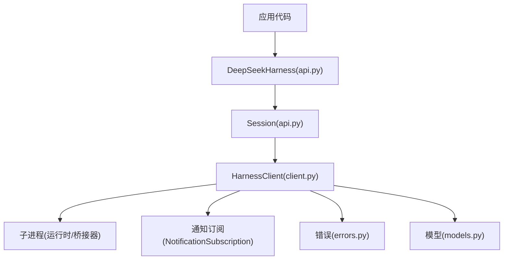
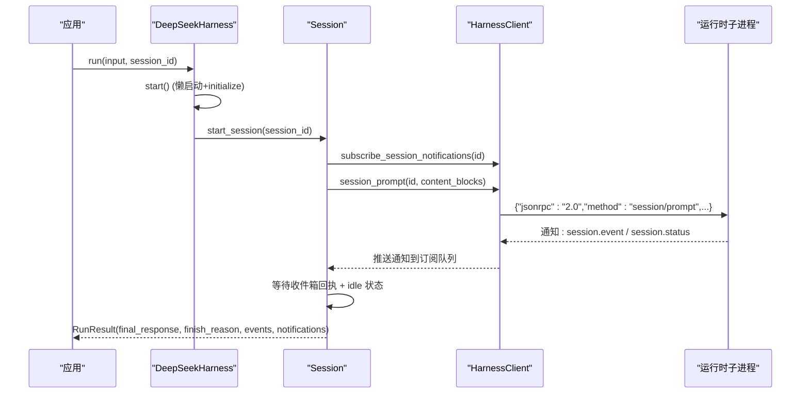
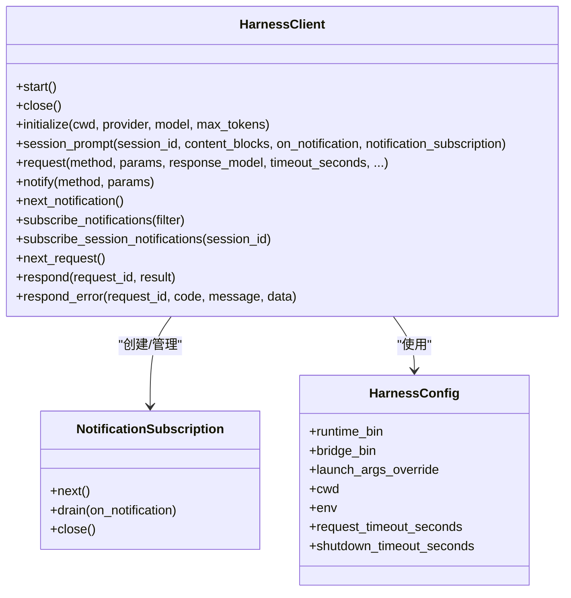
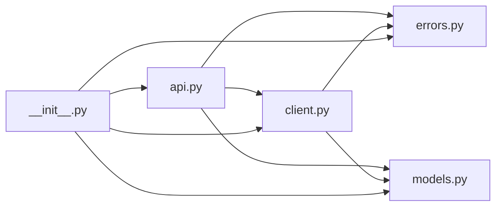

# 客户端模块

<cite>
**本文引用的文件**
- [client.py](file://python/sdk/src/deepseek_harness/client.py)
- [api.py](file://python/sdk/src/deepseek_harness/api.py)
- [models.py](file://python/sdk/src/deepseek_harness/models.py)
- [errors.py](file://python/sdk/src/deepseek_harness/errors.py)
- [__init__.py](file://python/sdk/src/deepseek_harness/__init__.py)
- [test_client.py](file://python/sdk/tests/test_client.py)
- [python-sdk.md](file://docs/user/guide/python-sdk.md)
</cite>

## 目录
1. [简介](#简介)
2. [项目结构](#项目结构)
3. [核心组件](#核心组件)
4. [架构总览](#架构总览)
5. [详细组件分析](#详细组件分析)
6. [依赖关系分析](#依赖关系分析)
7. [性能与连接池建议](#性能与连接池建议)
8. [故障排查指南](#故障排查指南)
9. [结论](#结论)
10. [附录：JSON-RPC 交互说明](#附录json-rpc-交互说明)

## 简介
本模块提供 Python SDK，用于通过 JSON-RPC over stdio 与 DeepSeek Harness 运行时进程通信。对外暴露两类接口：
- 高层 API：DeepSeekHarness、Session、RunResult，封装了启动运行时、初始化会话、发送消息、收集通知与最终响应等流程。
- 底层传输层：HarnessClient，直接管理子进程生命周期、读写 JSON-RPC 消息、请求/通知路由与超时控制。

该文档聚焦于客户端模块的 API 使用方式、错误处理机制、异步/同步调用模式、以及与 JSON-RPC 协议的交互细节。

## 项目结构
Python SDK 位于 python/sdk/src/deepseek_harness 下，主要文件职责如下：
- client.py：实现 HarnessClient（同步 JSON-RPC 客户端）、NotificationSubscription（通知订阅）以及内部消息路由、线程化 I/O、超时与关闭逻辑。
- api.py：实现 DeepSeekHarness（高层 SDK）、Session（会话）、RunResult（运行结果），并封装 session_prompt 调用与事件聚合。
- models.py：定义通用类型别名、Notification、IncomingRequest、InitializeResponse 等数据模型。
- errors.py：定义异常体系 HarnessError、TransportClosedError、SdkProtocolError、JsonRpcError。
- __init__.py：统一导出公共 API。

图表来源
- [api.py:48-124](file://python/sdk/src/deepseek_harness/api.py#L48-L124)
- [client.py:37-507](file://python/sdk/src/deepseek_harness/client.py#L37-L507)
- [errors.py:4-24](file://python/sdk/src/deepseek_harness/errors.py#L4-L24)
- [models.py:8-33](file://python/sdk/src/deepseek_harness/models.py#L8-L33)

章节来源
- [client.py:1-558](file://python/sdk/src/deepseek_harness/client.py#L1-L558)
- [api.py:1-243](file://python/sdk/src/deepseek_harness/api.py#L1-L243)
- [models.py:1-33](file://python/sdk/src/deepseek_harness/models.py#L1-L33)
- [errors.py:1-24](file://python/sdk/src/deepseek_harness/errors.py#L1-L24)
- [__init__.py:1-20](file://python/sdk/src/deepseek_harness/__init__.py#L1-L20)

## 核心组件
- DeepSeekHarnessConfig：配置运行时启动参数、工作目录、会话根目录、Cordis 配置、环境变量、API Key/Base URL、超时等。
- DeepSeekHarness：高层 SDK，负责懒启动运行时、initialize、创建 Session、执行 run 并返回 RunResult。
- Session：绑定一个 session_id，封装一次“提示输入 -> 事件流 -> 结束”的完整回合。
- RunResult：包含 final_response、finish_reason、events、notifications、session_root 等。
- HarnessConfig：底层传输配置，包括运行时二进制路径、桥接器路径、cwd、env、请求/关闭超时等。
- HarnessClient：同步 JSON-RPC 客户端，管理子进程、读写消息、请求等待、通知分发、超时与关闭。
- NotificationSubscription：按会话或自定义过滤条件订阅通知，支持 next/drain/close。
- 模型与错误：Notification、IncomingRequest、InitializeResponse；异常体系覆盖传输关闭、协议错误、JSON-RPC 错误。

章节来源
- [api.py:13-124](file://python/sdk/src/deepseek_harness/api.py#L13-L124)
- [client.py:24-507](file://python/sdk/src/deepseek_harness/client.py#L24-L507)
- [models.py:8-33](file://python/sdk/src/deepseek_harness/models.py#L8-L33)
- [errors.py:4-24](file://python/sdk/src/deepseek_harness/errors.py#L4-L24)

## 架构总览
DeepSeekHarness 作为门面，内部持有 HarnessClient。调用 run 时：
- 首次调用会启动子进程并 initialize。
- 构造 Session，调用 HarnessClient.session_prompt 发起请求。
- 通过 subscribe_session_notifications 订阅当前会话及其子代理树的通知。
- 循环读取通知，直到收到 session.status=idle 且已收到收件箱回执，表示本轮完成。
- 从事件流中提取最终回复与结束原因，组装 RunResult。

图表来源
- [api.py:117-183](file://python/sdk/src/deepseek_harness/api.py#L117-L183)
- [client.py:138-178](file://python/sdk/src/deepseek_harness/client.py#L138-L178)
- [client.py:228-296](file://python/sdk/src/deepseek_harness/client.py#L228-L296)

## 详细组件分析

### DeepSeekHarness 与 Session
- 构造函数参数：
  - provider、model、max_tokens：传递给 initialize。
  - cwd、runtime_cwd：工作目录与运行时工作目录。
  - session_root、cordis：会话日志根目录与 Cordis 配置文件路径。
  - env：注入到子进程的环境变量，如 DEEPSEEK_API_KEY、DEEPSEEK_BASE_URL。
  - runtime_bin、launch_args_override：指定运行时或桥接器可执行及启动参数。
  - request_timeout_seconds、shutdown_timeout_seconds：请求与关闭超时。
  - base_url、api_key：便捷设置 DEEPSEEK_BASE_URL 与 DEEPSEEK_API_KEY。
- 生命周期：
  - 上下文管理器或显式 close 确保子进程被正确回收。
  - start() 懒启动并 initialize。
  - run() 委托给 Session.run。
- Session.run：
  - 将字符串或内容块标准化为内容块列表。
  - 订阅会话通知，发送 session/prompt。
  - 等待收件箱回执与 idle 状态，收集事件与通知。
  - 提取 final_response 与 finish_reason，返回 RunResult。

章节来源
- [api.py:13-124](file://python/sdk/src/deepseek_harness/api.py#L13-L124)
- [api.py:127-183](file://python/sdk/src/deepseek_harness/api.py#L127-L183)
- [api.py:199-243](file://python/sdk/src/deepseek_harness/api.py#L199-L243)

### HarnessClient（同步 JSON-RPC 客户端）
- 构造函数参数：
  - HarnessConfig：runtime_bin、bridge_bin、launch_args_override、cwd、env、request_timeout_seconds、shutdown_timeout_seconds。
- 关键方法：
  - start()：启动子进程，开启读/写线程。
  - close()：发送 shutdown 请求，关闭 stdin，终止/杀死进程，清理资源。
  - initialize(cwd, provider, model, max_tokens)：发送 initialize 请求，失败时自动 close。
  - session_prompt(session_id, content_blocks, on_notification, notification_subscription)：发送 session/prompt，返回 messageId。
  - request(method, params, response_model, timeout_seconds, ...)：通用请求封装，校验响应为对象并反序列化为 Pydantic 模型。
  - notify(method, params)：发送通知（无 id）。
  - next_notification()：阻塞获取下一个全局通知或抛出异常。
  - subscribe_notifications(filter)：创建通知订阅，支持过滤函数。
  - subscribe_session_notifications(session_id)：基于会话树关系的订阅。
  - next_request()/respond()/respond_error()：处理来自运行时的入站请求与响应。
  - _request_raw()：核心请求循环，维护 waiter、临时订阅、超时与诊断信息。
  - _write_message()：写入 JSON-RPC 消息到子进程 stdin。
  - _reader_loop/_stderr_loop：后台线程读取 stdout/stderr。
  - _handle_message()：路由消息到响应等待者、通知订阅或全局通知队列。
  - _fail_waiters()：在传输关闭时向所有等待者与订阅者注入异常。
  - _default_launch_args/_inject_bundled_default_config：解析默认运行时与注入默认配置。
  - 会话树追踪：记录 subagent.started/finished 以支持父子会话关系过滤。
- 线程与锁：
  - 使用 threading.Lock 保护共享状态（responses、subscribers）。
  - 使用 queue.Queue 进行线程间通信。
  - 读/写分离线程，避免阻塞。

图表来源
- [client.py:24-507](file://python/sdk/src/deepseek_harness/client.py#L24-L507)

章节来源
- [client.py:37-507](file://python/sdk/src/deepseek_harness/client.py#L37-L507)

### 模型与错误
- 模型：
  - Notification：method + payload。
  - IncomingRequest：id + method + payload。
  - InitializeResponse：serverInfo。
- 错误：
  - HarnessError：基类。
  - TransportClosedError：子进程退出或 stdout 关闭。
  - SdkProtocolError：运行时发送不符合 SDK 协议的数据。
  - JsonRpcError：运行时返回 JSON-RPC error 响应，包含 code/message/data。

章节来源
- [models.py:8-33](file://python/sdk/src/deepseek_harness/models.py#L8-L33)
- [errors.py:4-24](file://python/sdk/src/deepseek_harness/errors.py#L4-L24)

## 依赖关系分析
- 模块内依赖：
  - api.py 依赖 client.py、errors.py、models.py。
  - client.py 依赖 errors.py、models.py。
  - __init__.py 统一导出上述模块的公共符号。
- 外部依赖：
  - pydantic：用于模型校验（InitializeResponse、ServerInfo）。
  - subprocess/threading/queue：子进程管理与线程安全队列。
  - uuid：生成唯一请求 ID。
- 运行时依赖：
  - deepseek_harness_runtime：当未指定 runtime_bin/bridge_bin 时，尝试解析内置运行时与默认配置。

图表来源
- [api.py:1-11](file://python/sdk/src/deepseek_harness/api.py#L1-L11)
- [client.py:1-19](file://python/sdk/src/deepseek_harness/client.py#L1-L19)
- [__init__.py:1-20](file://python/sdk/src/deepseek_harness/__init__.py#L1-L20)

章节来源
- [api.py:1-243](file://python/sdk/src/deepseek_harness/api.py#L1-L243)
- [client.py:1-558](file://python/sdk/src/deepseek_harness/client.py#L1-L558)
- [__init__.py:1-20](file://python/sdk/src/deepseek_harness/__init__.py#L1-L20)

## 性能与连接池建议
- 连接复用：
  - 推荐复用同一个 DeepSeekHarness 实例多次调用 run，以减少子进程启动与初始化开销。
  - 不同任务建议使用不同的 session_id，以避免状态污染；同一 session_id 可延续对话与持久 Shell 状态。
- 超时与健壮性：
  - 合理设置 request_timeout_seconds 与 shutdown_timeout_seconds，避免长时间阻塞。
  - 捕获 TimeoutError 与 TransportClosedError，必要时重试或降级。
- 通知处理：
  - 使用 subscribe_session_notifications 精确订阅目标会话，避免全局通知堆积。
  - 使用 drain 批量消费通知，减少轮询开销。
- 资源清理：
  - 始终使用上下文管理器或显式 close，确保子进程被回收。
- 连接池：
  - 当前 SDK 未内置连接池。可在应用层维护多个 HarnessClient/DeepSeekHarness 实例，按业务维度分配（如按租户或任务类型），并通过线程安全容器管理生命周期。
  - 注意每个实例都会启动一个子进程，需评估系统资源限制。

[本节为通用指导，不直接分析具体文件]

## 故障排查指南
- 常见异常：
  - TransportClosedError：子进程退出或 stdout 关闭。检查 stderr 尾部与退出码，定位运行时崩溃。
  - JsonRpcError：运行时返回 JSON-RPC error。查看 code/message/data 定位服务端错误。
  - SdkProtocolError：运行时事件不符合预期（例如 turn/end 缺少 reason.kind）。检查事件结构与 SDK 版本兼容性。
  - TimeoutError：请求超时。检查网络/代理、模型服务可用性、运行时是否卡住。
- 诊断信息：
  - HarnessClient 在关闭或超时时会附带 stderr 尾部与退出码，便于快速定位问题。
- 测试用例参考：
  - 超时、关闭超时、非 JSON 行忽略、通知过滤异常隔离、子代理树关系、多会话隔离等场景均有覆盖。

章节来源
- [errors.py:4-24](file://python/sdk/src/deepseek_harness/errors.py#L4-L24)
- [client.py:386-422](file://python/sdk/src/deepseek_harness/client.py#L386-L422)
- [test_client.py:720-783](file://python/sdk/tests/test_client.py#L720-L783)

## 结论
本 SDK 提供了从高层到低层的完整客户端能力：
- 高层 API 简化了会话生命周期与事件聚合，适合大多数应用场景。
- 底层 HarnessClient 提供细粒度控制，适用于需要自定义协议扩展或调试的场景。
- 通过合理的超时、通知订阅与资源管理，可实现稳定高效的 Agent 调用。

[本节为总结，不直接分析具体文件]

## 附录：JSON-RPC 交互说明
- 协议基础：
  - 基于 JSON-RPC 2.0，通过子进程 stdin/stdout 逐行传输 JSON 消息。
  - 请求包含 jsonrpc、id、method、params；响应包含 jsonrpc、id、result 或 error。
  - 通知不包含 id，仅包含 jsonrpc、method、params。
- 关键方法：
  - initialize：传入 cwd、provider、model、maxTokens，返回 serverInfo。
  - session/prompt：传入 sessionId、contentBlocks，返回 messageId。
  - shutdown：优雅关闭运行时。
- 事件与通知：
  - session.event：携带 event 字段，如 assistant/message、turn/end、agent/inbox/spliced 等。
  - session.status：携带 sessionId 与 status（running/idle）。
  - subagent.started/finished：携带 parentSessionId、childSessionId，用于构建会话树。
- 请求-响应时序示例（session/prompt）：
  - 客户端发送 session/prompt。
  - 运行时先推送 agent/inbox/spliced 回执（包含 inserted 消息 id）。
  - 随后推送 assistant/message、turn/end 等事件。
  - 最后推送 session.status=idle 表示本轮结束。
- 错误处理：
  - JSON-RPC 错误通过 error.code/message/data 返回，SDK 会转换为 JsonRpcError。
  - 传输层错误（子进程退出）转换为 TransportClosedError。
  - 协议不一致（如 turn/end 缺少 reason.kind）转换为 SdkProtocolError。

章节来源
- [client.py:157-178](file://python/sdk/src/deepseek_harness/client.py#L157-L178)
- [client.py:228-296](file://python/sdk/src/deepseek_harness/client.py#L228-L296)
- [client.py:343-397](file://python/sdk/src/deepseek_harness/client.py#L343-L397)
- [api.py:186-243](file://python/sdk/src/deepseek_harness/api.py#L186-L243)
- [test_client.py:15-125](file://python/sdk/tests/test_client.py#L15-L125)

## 使用示例（路径引用）
- 高层 SDK 初始化与运行：
  - 参见：[python-sdk.md:56-79](file://docs/user/guide/python-sdk.md#L56-L79)
- 低层 HarnessClient 初始化、initialize、session_prompt、通知处理：
  - 参见：[test_client.py:453-486](file://python/sdk/tests/test_client.py#L453-L486)
- 通知订阅与过滤：
  - 参见：[test_client.py:590-630](file://python/sdk/tests/test_client.py#L590-L630)
- 超时与关闭行为：
  - 参见：[test_client.py:720-783](file://python/sdk/tests/test_client.py#L720-L783)