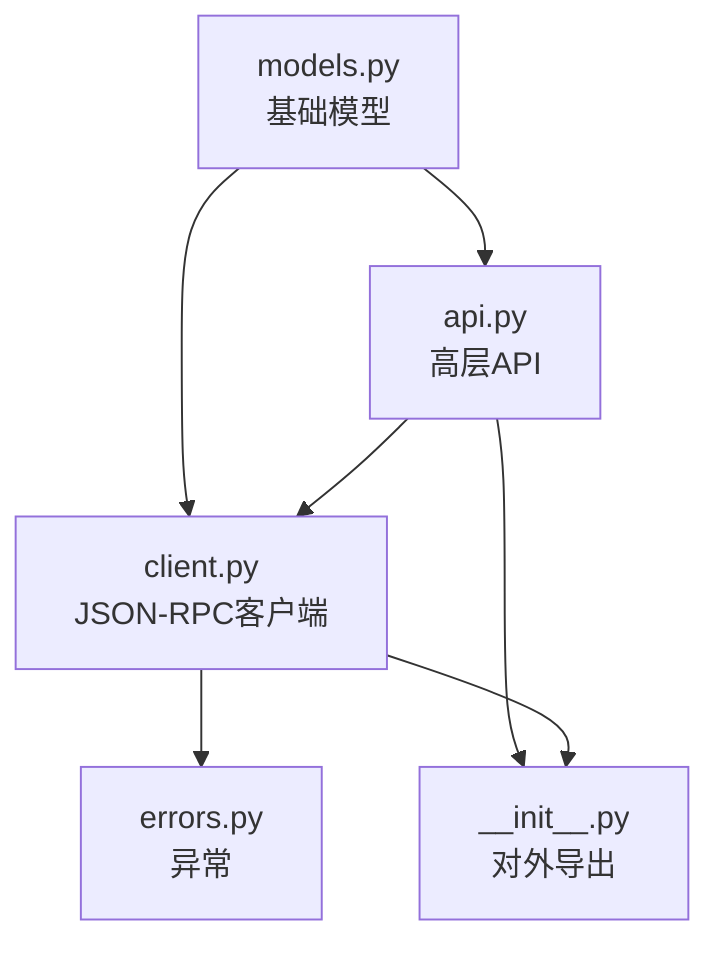
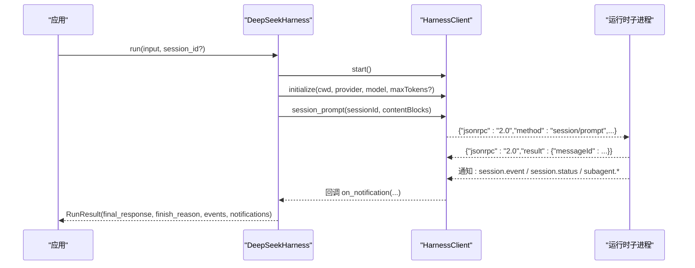
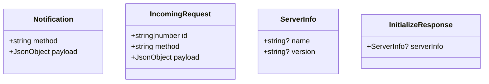
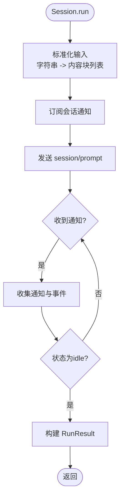
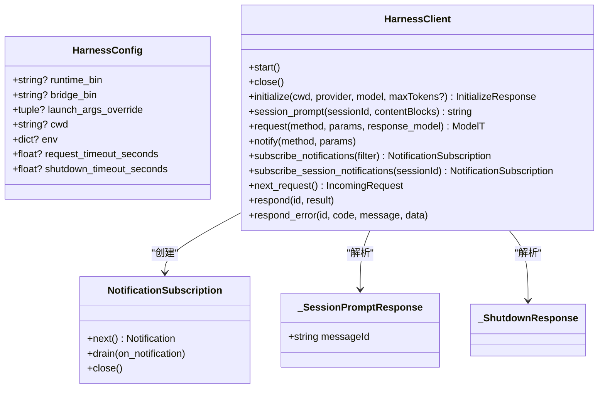
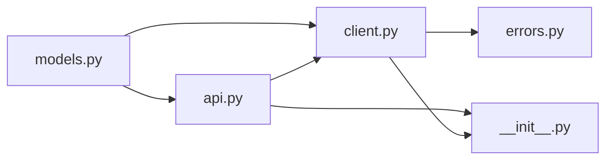

# 数据模型模块

<cite>
**本文引用的文件**
- [models.py](file://python/sdk/src/deepseek_harness/models.py)
- [api.py](file://python/sdk/src/deepseek_harness/api.py)
- [client.py](file://python/sdk/src/deepseek_harness/client.py)
- [errors.py](file://python/sdk/src/deepseek_harness/errors.py)
- [__init__.py](file://python/sdk/src/deepseek_harness/__init__.py)
- [test_client.py](file://python/sdk/tests/test_client.py)
</cite>

## 目录
1. [简介](#简介)
2. [项目结构](#项目结构)
3. [核心组件](#核心组件)
4. [架构总览](#架构总览)
5. [详细组件分析](#详细组件分析)
6. [依赖关系分析](#依赖关系分析)
7. [性能考量](#性能考量)
8. [故障排查指南](#故障排查指南)
9. [结论](#结论)
10. [附录](#附录)

## 简介
本模块为 DeepSeek Harness Python SDK 的数据模型与协议层，提供：
- 统一的 JSON 数据类型别名与基础数据结构（通知、请求、响应）
- 高层 API 的会话与运行结果模型
- 运行时子进程通信的 JSON-RPC 客户端与消息路由
- 错误类型定义与协议校验

该模块通过 Pydantic 与 dataclass 组合，既保证序列化/反序列化的严谨性，又兼顾内存与性能。

## 项目结构
SDK 数据模型相关代码集中在 python/sdk/src/deepseek_harness 下：
- models.py：通用 JSON 类型别名与基础数据类
- api.py：高层 API（配置、会话、运行结果）
- client.py：JSON-RPC 客户端、通知订阅、会话树追踪
- errors.py：异常体系
- __init__.py：对外导出符号

图表来源
- [models.py:1-33](file://python/sdk/src/deepseek_harness/models.py#L1-L33)
- [api.py:1-243](file://python/sdk/src/deepseek_harness/api.py#L1-L243)
- [client.py:1-558](file://python/sdk/src/deepseek_harness/client.py#L1-L558)
- [errors.py:1-24](file://python/sdk/src/deepseek_harness/errors.py#L1-L24)
- [__init__.py:1-20](file://python/sdk/src/deepseek_harness/__init__.py#L1-L20)

章节来源
- [models.py:1-33](file://python/sdk/src/deepseek_harness/models.py#L1-L33)
- [api.py:1-243](file://python/sdk/src/deepseek_harness/api.py#L1-L243)
- [client.py:1-558](file://python/sdk/src/deepseek_harness/client.py#L1-L558)
- [errors.py:1-24](file://python/sdk/src/deepseek_harness/errors.py#L1-L24)
- [__init__.py:1-20](file://python/sdk/src/deepseek_harness/__init__.py#L1-L20)

## 核心组件
- 基础类型与数据类
  - JsonScalar / JsonValue / JsonObject：JSON 标量、值、对象的统一类型别名
  - Notification：通知（method + payload）
  - IncomingRequest：入站请求（id + method + payload）
  - ServerInfo / InitializeResponse：初始化响应模型（Pydantic）
- 高层 API 模型
  - DeepSeekHarnessConfig：启动配置（provider、model、max_tokens、cwd、runtime_cwd、session_root、cordis、env、runtime_bin、launch_args_override、request_timeout_seconds、shutdown_timeout_seconds、base_url、api_key）
  - RunResult：运行结果（session_id、final_response、finish_reason、events、notifications、session_root）
  - Session：会话对象（run(input, on_notification) -> RunResult）
- 客户端模型
  - HarnessConfig：运行时子进程配置（runtime_bin、bridge_bin、launch_args_override、cwd、env、request_timeout_seconds、shutdown_timeout_seconds）
  - HarnessClient：JSON-RPC 客户端（initialize、session_prompt、request、notify、subscribe_*、next_request/respond/respond_error）
  - NotificationSubscription：通知订阅器（next/drain/close）
  - _SessionPromptResponse / _ShutdownResponse：内部响应模型（Pydantic）
- 错误模型
  - HarnessError / TransportClosedError / SdkProtocolError / JsonRpcError

章节来源
- [models.py:1-33](file://python/sdk/src/deepseek_harness/models.py#L1-L33)
- [api.py:13-46](file://python/sdk/src/deepseek_harness/api.py#L13-L46)
- [api.py:127-183](file://python/sdk/src/deepseek_harness/api.py#L127-L183)
- [client.py:24-35](file://python/sdk/src/deepseek_harness/client.py#L24-L35)
- [client.py:37-558](file://python/sdk/src/deepseek_harness/client.py#L37-L558)
- [errors.py:4-24](file://python/sdk/src/deepseek_harness/errors.py#L4-L24)

## 架构总览
SDK 通过 JSON-RPC over stdio 与 DeepSeek Harness 运行时子进程通信。高层 API 封装了会话生命周期与事件收集；底层客户端负责进程管理、消息收发、通知过滤与会话树维护。

图表来源
- [api.py:117-183](file://python/sdk/src/deepseek_harness/api.py#L117-L183)
- [client.py:117-155](file://python/sdk/src/deepseek_harness/client.py#L117-L155)
- [client.py:228-296](file://python/sdk/src/deepseek_harness/client.py#L228-L296)

## 详细组件分析

### 基础数据模型（models.py）
- JsonScalar / JsonValue / JsonObject
  - 用途：统一 JSON 数据的类型约束，便于在通知和事件中使用任意 JSON 结构
  - 映射：Python 原生 dict/list/str/int/float/bool/None
- Notification
  - 字段：method（字符串）、payload（JsonObject）
  - 用途：表示来自运行时的通知消息
- IncomingRequest
  - 字段：id（str|int）、method（字符串）、payload（JsonObject）
  - 用途：表示从运行时收到的带 id 的请求，供上层 respond/respond_error
- ServerInfo / InitializeResponse
  - 使用 Pydantic BaseModel 进行结构化校验
  - InitializeResponse.serverInfo 可为空

图表来源
- [models.py:13-33](file://python/sdk/src/deepseek_harness/models.py#L13-L33)

章节来源
- [models.py:1-33](file://python/sdk/src/deepseek_harness/models.py#L1-L33)

### 高层 API 模型（api.py）
- DeepSeekHarnessConfig
  - 字段与默认值：
    - provider="deepseek-official"
    - model="deepseek-v4-flash"
    - max_tokens=None
    - cwd=None
    - runtime_cwd=None
    - session_root=None
    - cordis=None
    - env={}
    - runtime_bin=None
    - launch_args_override=None
    - request_timeout_seconds=None
    - shutdown_timeout_seconds=1.0
    - base_url=None
    - api_key=None
  - 作用：控制运行时子进程的启动参数与环境变量注入
- RunResult
  - 字段：session_id、final_response、finish_reason、events、notifications、session_root
  - 语义：一次会话运行的最终文本、结束原因、事件列表、通知列表、会话根路径
- Session.run
  - 输入：input（字符串或内容块列表），on_notification（可选回调）
  - 输出：RunResult
  - 行为：标准化输入、订阅会话通知、发送 session/prompt、等待 idle 并聚合事件与通知

图表来源
- [api.py:127-183](file://python/sdk/src/deepseek_harness/api.py#L127-L183)
- [api.py:199-243](file://python/sdk/src/deepseek_harness/api.py#L199-L243)

章节来源
- [api.py:13-46](file://python/sdk/src/deepseek_harness/api.py#L13-L46)
- [api.py:117-183](file://python/sdk/src/deepseek_harness/api.py#L117-L183)
- [api.py:199-243](file://python/sdk/src/deepseek_harness/api.py#L199-L243)

### JSON-RPC 客户端模型（client.py）
- HarnessConfig
  - 字段：runtime_bin、bridge_bin、launch_args_override、cwd、env、request_timeout_seconds、shutdown_timeout_seconds
  - 作用：决定如何启动运行时子进程及通信超时策略
- HarnessClient
  - 关键方法：
    - start/close：启动/关闭子进程，处理 stderr 与线程
    - initialize：发送 initialize 请求并解析 InitializeResponse
    - session_prompt：发送 session/prompt，返回 messageId
    - request/notify：通用请求与通知
    - subscribe_notifications/subscribe_session_notifications：创建通知订阅
    - next_request/respond/respond_error：处理桥接请求
  - 内部模型：_SessionPromptResponse、_ShutdownResponse（Pydantic）
- NotificationSubscription
  - 方法：next/drain/close
  - 作用：按会话树过滤通知，支持批量消费

图表来源
- [client.py:24-35](file://python/sdk/src/deepseek_harness/client.py#L24-L35)
- [client.py:37-558](file://python/sdk/src/deepseek_harness/client.py#L37-L558)

章节来源
- [client.py:24-35](file://python/sdk/src/deepseek_harness/client.py#L24-L35)
- [client.py:37-558](file://python/sdk/src/deepseek_harness/client.py#L37-L558)

### 错误模型（errors.py）
- HarnessError：基类
- TransportClosedError：运行时子进程退出或 stdout 关闭时抛出
- SdkProtocolError：运行时发送不符合协议的数据时抛出（例如 turn/end 缺少 reason.kind）
- JsonRpcError：运行时返回 JSON-RPC 错误响应，包含 code/message/data

章节来源
- [errors.py:4-24](file://python/sdk/src/deepseek_harness/errors.py#L4-L24)

## 依赖关系分析
- models.py 被 api.py 与 client.py 引用，作为基础类型与数据类
- api.py 依赖 client.py 的 HarnessClient/HarnessConfig，以及 models.py 的 Notification/JsonObject
- client.py 依赖 models.py 的 IncomingRequest/InitializeResponse/Notification/JsonValue，以及 errors.py 的异常类型
- __init__.py 统一导出公共符号

图表来源
- [__init__.py:1-20](file://python/sdk/src/deepseek_harness/__init__.py#L1-L20)
- [api.py:1-11](file://python/sdk/src/deepseek_harness/api.py#L1-L11)
- [client.py:1-19](file://python/sdk/src/deepseek_harness/client.py#L1-L19)

章节来源
- [__init__.py:1-20](file://python/sdk/src/deepseek_harness/__init__.py#L1-L20)
- [api.py:1-11](file://python/sdk/src/deepseek_harness/api.py#L1-L11)
- [client.py:1-19](file://python/sdk/src/deepseek_harness/client.py#L1-L19)

## 性能考量
- 使用 dataclass(slots=True) 降低内存占用与实例化开销
- 使用队列与线程分离读写，避免阻塞主流程
- 通知订阅基于会话树过滤，减少无关事件处理
- 超时机制防止长时间阻塞（request_timeout_seconds、shutdown_timeout_seconds）
- 标准库 queue 与 deque 用于高效的消息缓冲

[本节为通用指导，不直接分析具体文件]

## 故障排查指南
- 运行时未启动或已退出：TransportClosedError，检查子进程状态与 stderr 尾部信息
- 协议违规：SdkProtocolError，如 turn/end 缺少 reason.kind，需确保运行时遵循协议
- JSON-RPC 错误：JsonRpcError，包含 code/message/data，定位远端错误
- 超时：TimeoutError，检查 request_timeout_seconds 与运行时启动耗时
- 通知丢失：确认订阅是否覆盖目标会话及其后代，检查 _notification_belongs_to_session_tree 逻辑

章节来源
- [errors.py:4-24](file://python/sdk/src/deepseek_harness/errors.py#L4-L24)
- [client.py:399-422](file://python/sdk/src/deepseek_harness/client.py#L399-L422)
- [api.py:225-243](file://python/sdk/src/deepseek_harness/api.py#L225-L243)

## 结论
本模块以清晰的数据模型与严格的协议校验为核心，提供了稳定高效的 Python SDK 能力。通过 Pydantic 与 dataclass 的组合，实现了可扩展、可验证且高性能的数据处理。结合会话树通知过滤与超时机制，能够可靠地驱动 DeepSeek Harness 运行时完成多轮对话与工具调用。

[本节为总结，不直接分析具体文件]

## 附录

### 模型字段定义、数据类型与约束
- JsonScalar：str | int | float | bool | None
- JsonValue：JsonScalar | dict[str, JsonValue] | list[JsonValue]
- JsonObject：dict[str, JsonValue]
- Notification：method（str）、payload（JsonObject）
- IncomingRequest：id（str|int）、method（str）、payload（JsonObject）
- ServerInfo：name（str?）、version（str?）
- InitializeResponse：serverInfo（ServerInfo?）
- DeepSeekHarnessConfig：见上文“高层 API 模型”
- RunResult：session_id（str）、final_response（str）、finish_reason（str?）、events（list[JsonObject]）、notifications（list[Notification]）、session_root（str?）
- HarnessConfig：见上文“JSON-RPC 客户端模型”
- NotificationSubscription：next/drain/close
- _SessionPromptResponse：messageId（str）
- _ShutdownResponse：空

章节来源
- [models.py:1-33](file://python/sdk/src/deepseek_harness/models.py#L1-L33)
- [api.py:13-46](file://python/sdk/src/deepseek_harness/api.py#L13-L46)
- [client.py:24-35](file://python/sdk/src/deepseek_harness/client.py#L24-L35)
- [client.py:548-553](file://python/sdk/src/deepseek_harness/client.py#L548-L553)

### 模型之间的关联与继承
- 继承：
  - JsonRpcError、TransportClosedError、SdkProtocolError 继承自 HarnessError
- 组合：
  - InitializeResponse 包含 ServerInfo
  - RunResult 包含 events（list[JsonObject]）与 notifications（list[Notification]）
  - HarnessClient 内部维护 _responses、_notifications、_notification_subscribers 等集合，协调消息路由

章节来源
- [errors.py:4-24](file://python/sdk/src/deepseek_harness/errors.py#L4-L24)
- [models.py:26-33](file://python/sdk/src/deepseek_harness/models.py#L26-L33)
- [api.py:38-46](file://python/sdk/src/deepseek_harness/api.py#L38-L46)
- [client.py:37-558](file://python/sdk/src/deepseek_harness/client.py#L37-L558)

### 数据验证规则与默认值
- Pydantic 模型（ServerInfo、InitializeResponse、_SessionPromptResponse、_ShutdownResponse）自动进行类型校验
- 默认值：
  - DeepSeekHarnessConfig.provider/model/shutdown_timeout_seconds 等具有明确默认值
  - env 默认为空字典
- 协议校验：
  - finish_reason 要求 turn/end 的 data.reason.kind 为字符串，否则抛出 SdkProtocolError

章节来源
- [api.py:13-46](file://python/sdk/src/deepseek_harness/api.py#L13-L46)
- [api.py:225-243](file://python/sdk/src/deepseek_harness/api.py#L225-L243)
- [models.py:26-33](file://python/sdk/src/deepseek_harness/models.py#L26-L33)

### 与 JSON 格式的映射关系
- JsonValue/JsonObject 直接映射到 JSON 对象与数组
- Notification/IncomingRequest 对应 JSON-RPC 通知与请求体
- InitializeResponse/_SessionPromptResponse/_ShutdownResponse 对应 JSON-RPC 响应体
- 测试中展示了 assistant/message 与 turn/end 的事件结构，用于提取 final_response 与 finish_reason

章节来源
- [test_client.py:40-87](file://python/sdk/tests/test_client.py#L40-L87)
- [test_client.py:166-199](file://python/sdk/tests/test_client.py#L166-L199)

### 模型扩展与自定义最佳实践
- 新增模型建议使用 Pydantic BaseModel 以获得强类型校验与序列化支持
- 对需要频繁实例化的轻量结构可使用 dataclass(slots=True)
- 对于运行时协议变更，优先在 models.py 中定义新模型，并在 client.py 的 request/response_model 中引用
- 通知过滤逻辑可通过 NotificationFilter 自定义，注意异常隔离与订阅清理

章节来源
- [client.py:192-205](file://python/sdk/src/deepseek_harness/client.py#L192-L205)
- [client.py:474-504](file://python/sdk/src/deepseek_harness/client.py#L474-L504)

### 序列化与反序列化示例（路径指引）
- 初始化响应反序列化：
  - 参考：[client.py:117-136](file://python/sdk/src/deepseek_harness/client.py#L117-L136)
- 会话提示响应反序列化：
  - 参考：[client.py:138-155](file://python/sdk/src/deepseek_harness/client.py#L138-L155)
- 通知与事件收集：
  - 参考：[api.py:132-183](file://python/sdk/src/deepseek_harness/api.py#L132-L183)
- 运行结果构建：
  - 参考：[api.py:176-183](file://python/sdk/src/deepseek_harness/api.py#L176-L183)

章节来源
- [client.py:117-155](file://python/sdk/src/deepseek_harness/client.py#L117-L155)
- [api.py:132-183](file://python/sdk/src/deepseek_harness/api.py#L132-L183)