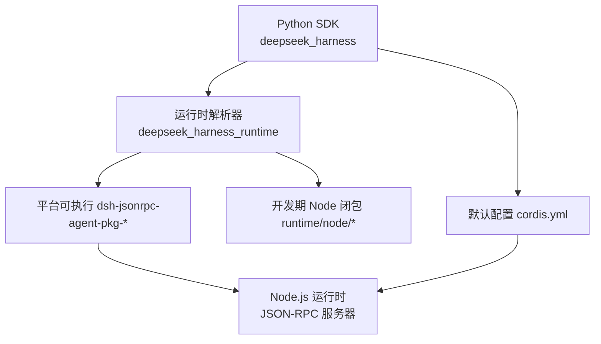
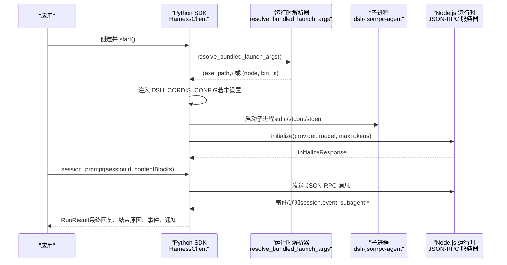
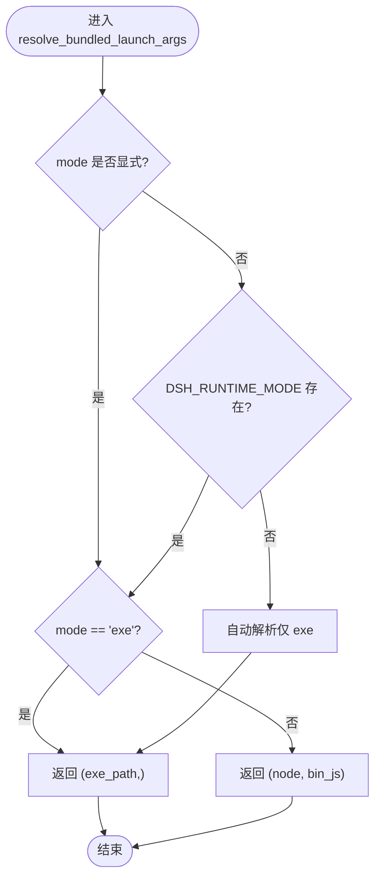
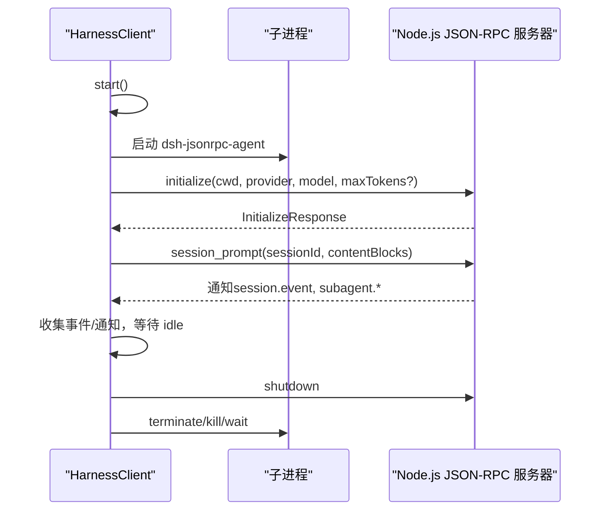
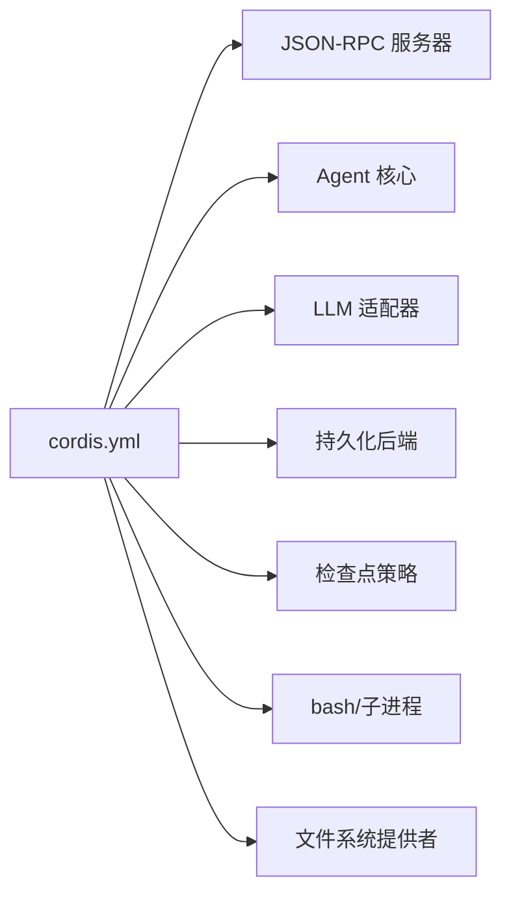
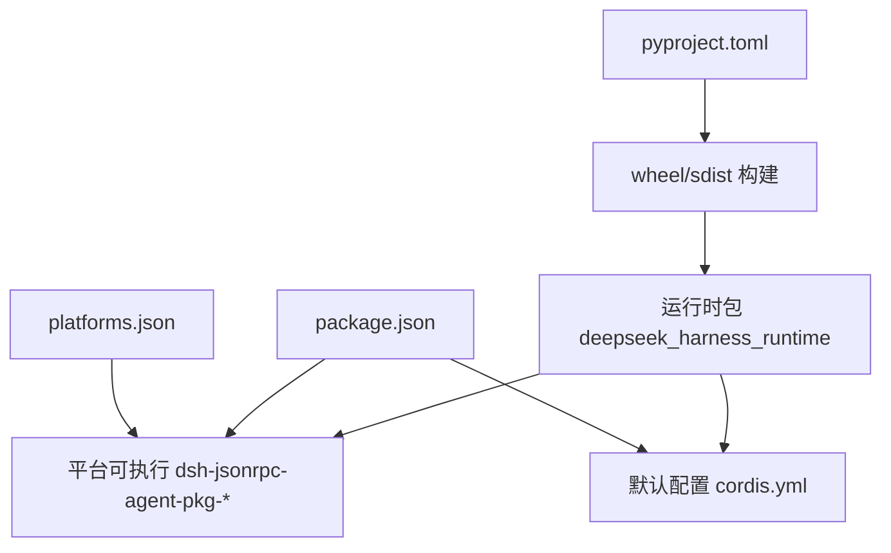

# 运行时模块

<cite>
**本文引用的文件**
- [python/sdk-runtime/src/deepseek_harness_runtime/__init__.py](file://python/sdk-runtime/src/deepseek_harness_runtime/__init__.py)
- [python/sdk-runtime/README.md](file://python/sdk-runtime/README.md)
- [python/sdk-runtime/README.zh.md](file://python/sdk-runtime/README.zh.md)
- [python/sdk-runtime/pyproject.toml](file://python/sdk-runtime/pyproject.toml)
- [python/sdk-runtime/platforms.json](file://python/sdk-runtime/platforms.json)
- [python/sdk-runtime/src/deepseek_harness_runtime/runtime/cordis.yml](file://python/sdk-runtime/src/deepseek_harness_runtime/runtime/cordis.yml)
- [python/sdk-runtime/package.json](file://python/sdk-runtime/package.json)
- [python/sdk/src/deepseek_harness/client.py](file://python/sdk/src/deepseek_harness/client.py)
- [python/sdk/src/deepseek_harness/api.py](file://python/sdk/src/deepseek_harness/api.py)
- [python/sdk/src/deepseek_harness/models.py](file://python/sdk/src/deepseek_harness/models.py)
- [python/sdk/README.md](file://python/sdk/README.md)
</cite>

## 目录
1. [简介](#简介)
2. [项目结构](#项目结构)
3. [核心组件](#核心组件)
4. [架构总览](#架构总览)
5. [详细组件分析](#详细组件分析)
6. [依赖关系分析](#依赖关系分析)
7. [性能与资源管理](#性能与资源管理)
8. [故障诊断与排错](#故障诊断与排错)
9. [部署指南](#部署指南)
10. [结论](#结论)

## 简介
本章节面向 Python SDK 的“运行时模块”，聚焦以下目标：
- 安装、配置与启动流程
- 运行环境与依赖管理
- 插件加载机制与生命周期（由 Cordis 配置驱动）
- 运行时配置选项与环境变量
- 监控与诊断能力
- 与 Node.js 运行时的通信机制（JSON-RPC over stdio）
- 性能调优与资源管理最佳实践
- 容器化与集群部署要点

该运行时以“单文件可执行”或“开发期 Node 闭包”两种载体随 wheel 分发，Python SDK 通过子进程标准输入输出与 Node.js 侧的 JSON-RPC 服务器交互。默认配置通过注入环境变量指向内置 cordis.yml，实现“零配置”体验，但运行时本身仍要求显式配置路径。

**章节来源**
- [python/sdk-runtime/README.md:1-30](file://python/sdk-runtime/README.md#L1-L30)
- [python/sdk-runtime/README.zh.md:1-30](file://python/sdk-runtime/README.zh.md#L1-L30)
- [python/sdk/README.md:1-52](file://python/sdk/README.md#L1-L52)

## 项目结构
运行时模块位于 python/sdk-runtime，核心职责是定位并启动内置的 Node.js 运行时二进制，并提供默认配置路径解析；Python SDK 位于 python/sdk，负责进程管理、JSON-RPC 通信与高层 API。

**图表来源**
- [python/sdk-runtime/src/deepseek_harness_runtime/__init__.py:46-116](file://python/sdk-runtime/src/deepseek_harness_runtime/__init__.py#L46-L116)
- [python/sdk-runtime/src/deepseek_harness_runtime/runtime/cordis.yml:1-50](file://python/sdk-runtime/src/deepseek_harness_runtime/runtime/cordis.yml#L1-L50)
- [python/sdk/src/deepseek_harness/client.py:63-84](file://python/sdk/src/deepseek_harness/client.py#L63-L84)

**章节来源**
- [python/sdk-runtime/pyproject.toml:1-32](file://python/sdk-runtime/pyproject.toml#L1-L32)
- [python/sdk-runtime/platforms.json:1-15](file://python/sdk-runtime/platforms.json#L1-L15)
- [python/sdk-runtime/package.json:1-118](file://python/sdk-runtime/package.json#L1-L118)

## 核心组件
- 运行时解析器（deepseek_harness_runtime）
  - 提供 bundled_package_dir、bundled_default_config_path、bundled_runtime_path、resolve_bundled_launch_args 等接口，用于定位已安装包根、默认配置路径、平台可执行路径以及启动参数。
  - 支持两种模式：生产 exe 模式（自动选择）与开发 node 模式（需显式选择）。
  - macOS 下会校验伴随 spawn-helper 是否存在。
- Python SDK 客户端（HarnessClient）
  - 通过 subprocess 启动运行时，维护 stdin/stdout/stderr 管道，实现 JSON-RPC 请求/响应与通知订阅。
  - 在启动时注入默认配置路径到环境变量，除非显式覆盖。
- 高层 API（DeepSeekHarness / Session）
  - 封装会话生命周期、初始化、消息发送与结果聚合。
  - 将 provider/model/max_tokens 等参数传递至运行时进行初始化。

**章节来源**
- [python/sdk-runtime/src/deepseek_harness_runtime/__init__.py:46-116](file://python/sdk-runtime/src/deepseek_harness_runtime/__init__.py#L46-L116)
- [python/sdk/src/deepseek_harness/client.py:63-116](file://python/sdk/src/deepseek_harness/client.py#L63-L116)
- [python/sdk/src/deepseek_harness/api.py:48-124](file://python/sdk/src/deepseek_harness/api.py#L48-L124)

## 架构总览
下图展示了从 Python SDK 调用到 Node.js 运行时执行的端到端流程，包括默认配置注入、进程启动、JSON-RPC 握手与会话处理。

**图表来源**
- [python/sdk/src/deepseek_harness/client.py:63-116](file://python/sdk/src/deepseek_harness/client.py#L63-L116)
- [python/sdk/src/deepseek_harness/client.py:117-155](file://python/sdk/src/deepseek_harness/client.py#L117-L155)
- [python/sdk/src/deepseek_harness/client.py:228-296](file://python/sdk/src/deepseek_harness/client.py#L228-L296)
- [python/sdk/src/deepseek_harness/api.py:97-124](file://python/sdk/src/deepseek_harness/api.py#L97-L124)
- [python/sdk-runtime/src/deepseek_harness_runtime/__init__.py:96-116](file://python/sdk-runtime/src/deepseek_harness_runtime/__init__.py#L96-L116)

## 详细组件分析

### 运行时解析器（deepseek_harness_runtime）
- 功能要点
  - 平台标签映射：linux/darwin → linux/macos；x86_64/amd64 → x64；arm64/aarch64 → arm64。
  - 自动模式仅选择生产 exe；开发 node 模式必须显式指定。
  - macOS 需要附带 spawn-helper，否则启动失败。
  - 默认配置路径来自包内 runtime/cordis.yml。
- 关键接口
  - bundled_package_dir：返回已安装包数据根。
  - bundled_default_config_path：返回检入的默认配置路径。
  - bundled_runtime_path：返回平台可执行路径（macOS 校验伴随文件）。
  - resolve_bundled_launch_args：返回启动 argv，模式优先级：显式参数 > 环境变量 > 自动。

**图表来源**
- [python/sdk-runtime/src/deepseek_harness_runtime/__init__.py:96-116](file://python/sdk-runtime/src/deepseek_harness_runtime/__init__.py#L96-L116)
- [python/sdk-runtime/src/deepseek_harness_runtime/__init__.py:119-154](file://python/sdk-runtime/src/deepseek_harness_runtime/__init__.py#L119-L154)

**章节来源**
- [python/sdk-runtime/src/deepseek_harness_runtime/__init__.py:46-116](file://python/sdk-runtime/src/deepseek_harness_runtime/__init__.py#L46-L116)
- [python/sdk-runtime/platforms.json:1-15](file://python/sdk-runtime/platforms.json#L1-L15)

### Python SDK 客户端（HarnessClient）
- 功能要点
  - 启动子进程：使用 resolve_bundled_launch_args 获取 argv，或通过配置覆盖。
  - 注入默认配置：当使用内置运行时且未设置 DSH_CORDIS_CONFIG 时，注入包内默认 cordis.yml。
  - JSON-RPC 通信：读写 stdin/stdout，维护请求等待队列与通知订阅。
  - 关闭流程：先发送 shutdown，再终止进程并回收线程。
- 关键方法
  - start/close：进程生命周期管理。
  - initialize/session_prompt/request/notify：JSON-RPC 方法与通知。
  - _runtime_diagnostics：收集退出码与 stderr 尾部用于诊断。

**图表来源**
- [python/sdk/src/deepseek_harness/client.py:63-116](file://python/sdk/src/deepseek_harness/client.py#L63-L116)
- [python/sdk/src/deepseek_harness/client.py:117-155](file://python/sdk/src/deepseek_harness/client.py#L117-L155)
- [python/sdk/src/deepseek_harness/client.py:228-296](file://python/sdk/src/deepseek_harness/client.py#L228-L296)
- [python/sdk/src/deepseek_harness/client.py:403-422](file://python/sdk/src/deepseek_harness/client.py#L403-L422)

**章节来源**
- [python/sdk/src/deepseek_harness/client.py:63-116](file://python/sdk/src/deepseek_harness/client.py#L63-L116)
- [python/sdk/src/deepseek_harness/client.py:228-296](file://python/sdk/src/deepseek_harness/client.py#L228-L296)
- [python/sdk/src/deepseek_harness/client.py:403-422](file://python/sdk/src/deepseek_harness/client.py#L403-L422)

### 高层 API（DeepSeekHarness / Session）
- 功能要点
  - 封装会话生命周期，自动初始化并维护进程。
  - 将 provider/model/max_tokens 传入运行时 initialize。
  - 聚合事件与通知，提取最终回复与结束原因。
- 关键行为
  - start：首次调用时启动进程并 initialize。
  - run：发送 prompt，等待 idle 状态，返回 RunResult。

**章节来源**
- [python/sdk/src/deepseek_harness/api.py:48-124](file://python/sdk/src/deepseek_harness/api.py#L48-L124)
- [python/sdk/src/deepseek_harness/api.py:127-183](file://python/sdk/src/deepseek_harness/api.py#L127-L183)
- [python/sdk/src/deepseek_harness/models.py:13-33](file://python/sdk/src/deepseek_harness/models.py#L13-L33)

### 插件加载机制与生命周期（Cordis 配置）
- 默认配置包含：
  - JSON-RPC 服务器入口（@deepseek-ai/dsh-sdk-jsonrpc-server）
  - Agent 核心（@deepseek-ai/dsh-agent-spine-demo）
  - DeepSeek LLM 适配器（@deepseek-ai/dsh-llm-deepseek）
  - JSONL 持久化（@deepseek-ai/dsh-session-persistence-jsonl）
  - 检查点策略（@deepseek-ai/dsh-session-checkpoint-policy）
  - 本地 bash 与子进程（@deepseek-ai/dsh-bash-local、@deepseek-ai/dsh-subprocess-local）
  - 本地文件系统提供者（@deepseek-ai/dsh-fs-local）
- 插件集合由 package.json 声明，构建产物为单文件可执行或开发期 node_modules 树。
- 生命周期由 Cordis 框架管理：按配置条目顺序加载，按需初始化，随进程生命周期销毁。

**图表来源**
- [python/sdk-runtime/src/deepseek_harness_runtime/runtime/cordis.yml:1-50](file://python/sdk-runtime/src/deepseek_harness_runtime/runtime/cordis.yml#L1-L50)
- [python/sdk-runtime/package.json:1-118](file://python/sdk-runtime/package.json#L1-L118)

**章节来源**
- [python/sdk-runtime/src/deepseek_harness_runtime/runtime/cordis.yml:1-50](file://python/sdk-runtime/src/deepseek_harness_runtime/runtime/cordis.yml#L1-L50)
- [python/sdk-runtime/package.json:1-118](file://python/sdk-runtime/package.json#L1-L118)

## 依赖关系分析
- 运行时载体
  - 生产：单文件可执行 dsh-jsonrpc-agent-pkg-<platform>-<arch>，无需系统 Node。
  - 开发：完整 node_modules 闭包，需系统 Node >= 22.19。
- 平台与标签
  - platforms.json 定义固定标签与可执行文件名映射。
  - pyproject.toml 指定构建系统与产物包含规则。
- 插件清单
  - package.json 声明所有工作区依赖，作为可执行与开发闭包的统一来源。

**图表来源**
- [python/sdk-runtime/pyproject.toml:1-32](file://python/sdk-runtime/pyproject.toml#L1-L32)
- [python/sdk-runtime/platforms.json:1-15](file://python/sdk-runtime/platforms.json#L1-L15)
- [python/sdk-runtime/package.json:1-118](file://python/sdk-runtime/package.json#L1-L118)

**章节来源**
- [python/sdk-runtime/pyproject.toml:1-32](file://python/sdk-runtime/pyproject.toml#L1-L32)
- [python/sdk-runtime/platforms.json:1-15](file://python/sdk-runtime/platforms.json#L1-L15)
- [python/sdk-runtime/package.json:1-118](file://python/sdk-runtime/package.json#L1-L118)

## 性能与资源管理
- 进程复用
  - HarnessClient 保持子进程存活，跨调用复用，减少启动开销。
- 超时控制
  - request_timeout_seconds：限制单次 JSON-RPC 请求等待时间。
  - shutdown_timeout_seconds：控制优雅关闭与强制终止的超时。
- 资源清理
  - close 流程先发送 shutdown，再尝试 terminate/kill，确保进程回收。
- 日志与诊断
  - stderr 尾部被缓存，异常时附加到错误信息中，便于定位问题。
- 建议
  - 合理设置 max_tokens 以避免过长生成导致内存与延迟压力。
  - 在生产环境优先使用 exe 模式，避免系统 Node 依赖带来的不一致性。
  - 对高并发场景，考虑多实例并行与连接池策略（外部编排）。

[本节为通用指导，不直接分析具体文件]

## 故障诊断与排错
- 常见错误
  - 缺少运行时可执行：抛出 FileNotFoundError，提示构建或安装对应平台 wheel。
  - macOS 缺少 spawn-helper：同样抛出 FileNotFoundError。
  - 开发 node 模式缺少闭包或系统 Node：提示运行构建脚本或安装 Node。
  - 运行时关闭或写入失败：抛出 TransportClosedError，附带退出码与 stderr 尾部。
- 诊断步骤
  - 检查 DSH_RUNTIME_MODE 与 DSH_CORDIS_CONFIG 是否正确设置。
  - 查看 HarnessClient._runtime_diagnostics 输出的退出码与 stderr 尾部。
  - 确认 platform 与 arch 是否在 platforms.json 支持范围内。
  - 验证 cordis.yml 中是否包含 JSON-RPC 服务器入口。

**章节来源**
- [python/sdk-runtime/src/deepseek_harness_runtime/__init__.py:70-93](file://python/sdk-runtime/src/deepseek_harness_runtime/__init__.py#L70-L93)
- [python/sdk-runtime/src/deepseek_harness_runtime/__init__.py:131-154](file://python/sdk-runtime/src/deepseek_harness_runtime/__init__.py#L131-L154)
- [python/sdk/src/deepseek_harness/client.py:403-422](file://python/sdk/src/deepseek_harness/client.py#L403-L422)

## 部署指南
- 安装与运行
  - 安装 deepseek-harness-sdk，会自动安装匹配的 deepseek-harness-runtime-bin 平台 wheel。
  - 默认使用内置运行时与默认配置，无需额外参数。
- 环境变量
  - DSH_RUNTIME_MODE：选择 exe 或 node 模式（仅开发）。
  - DSH_CORDIS_CONFIG：显式指定 Cordis 配置文件路径（SDK 会在未设置时注入默认配置）。
  - DEEPSEEK_API_KEY、DEEPSEEK_BASE_URL：模型凭据与端点。
  - DSH_SESSION_ROOT、DSH_CWD：会话存储与工作目录。
- 容器化
  - 基于官方镜像或精简基础镜像，复制 wheel 包并安装。
  - 确保平台标签匹配（manylinux_2_28_x86_64、aarch64、macosx_14_0_arm64）。
  - 挂载卷暴露 DSH_SESSION_ROOT 与 DSH_CWD，便于持久化与文件访问。
- 集群部署
  - 每个 Pod/任务启动一个 HarnessClient 实例，复用其内部子进程。
  - 通过负载均衡分发请求，避免单进程过载。
  - 使用健康检查与优雅关闭，确保会话完整性。

**章节来源**
- [python/sdk/README.md:1-52](file://python/sdk/README.md#L1-L52)
- [python/sdk-runtime/README.md:1-30](file://python/sdk-runtime/README.md#L1-L30)
- [python/sdk-runtime/README.zh.md:1-30](file://python/sdk-runtime/README.zh.md#L1-L30)
- [python/sdk-runtime/src/deepseek_harness_runtime/runtime/cordis.yml:1-50](file://python/sdk-runtime/src/deepseek_harness_runtime/runtime/cordis.yml#L1-L50)

## 结论
Python SDK 运行时模块通过“解析器 + 默认配置 + JSON-RPC 通信”的组合，提供了开箱即用的 Agent 运行能力。其设计强调：
- 明确的配置边界：运行时始终要求显式配置，SDK 层负责注入默认配置。
- 稳定的载体选择：生产 exe 与开发 node 分离，避免误用源码构建。
- 完善的诊断与清理：捕获 stderr、超时与退出码，保障可观测性与资源释放。
- 可扩展的插件体系：通过 Cordis 配置与 package.json 统一管理插件集合。

遵循本文的安装、配置、监控与部署建议，可在本地、容器与集群环境中稳定高效地运行 DeepSeek Harness Python SDK。

[本节为总结，不直接分析具体文件]