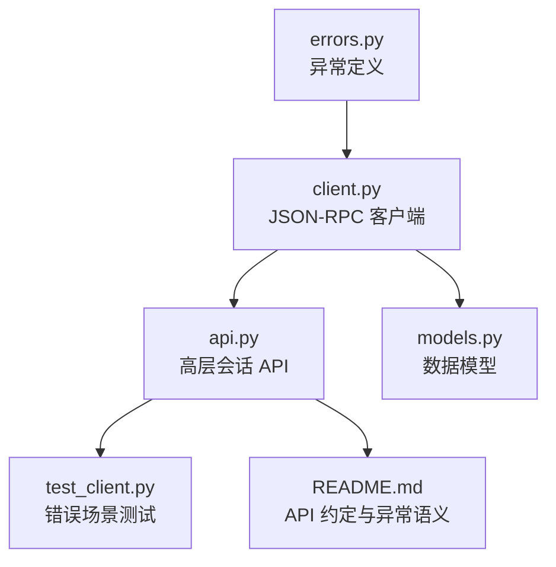
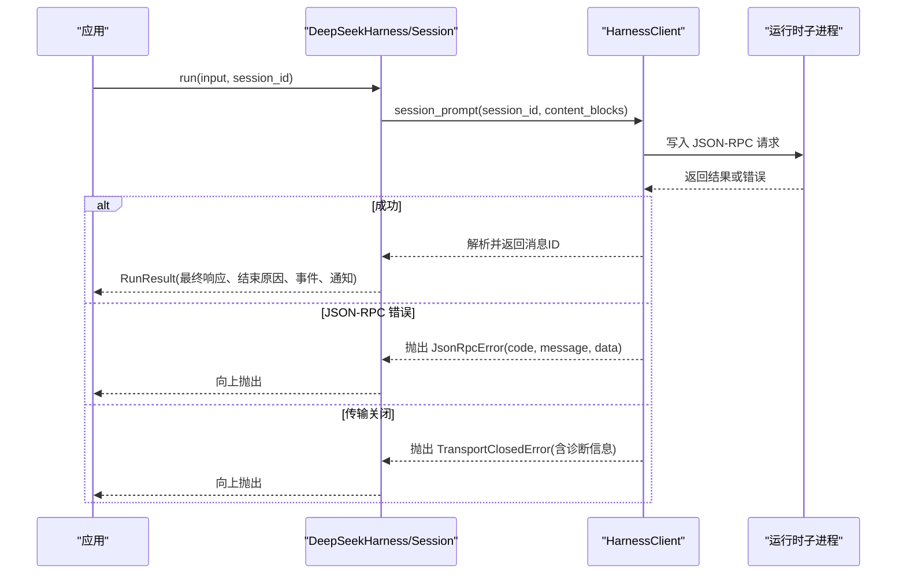
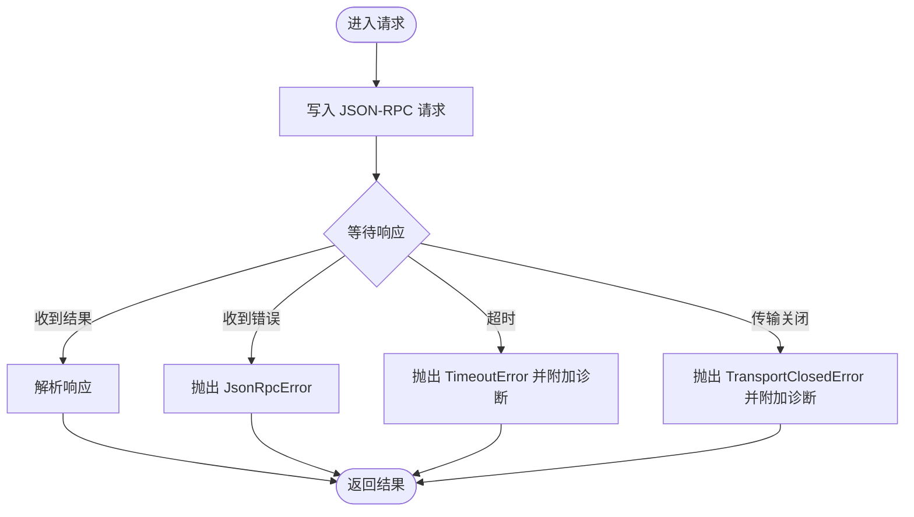
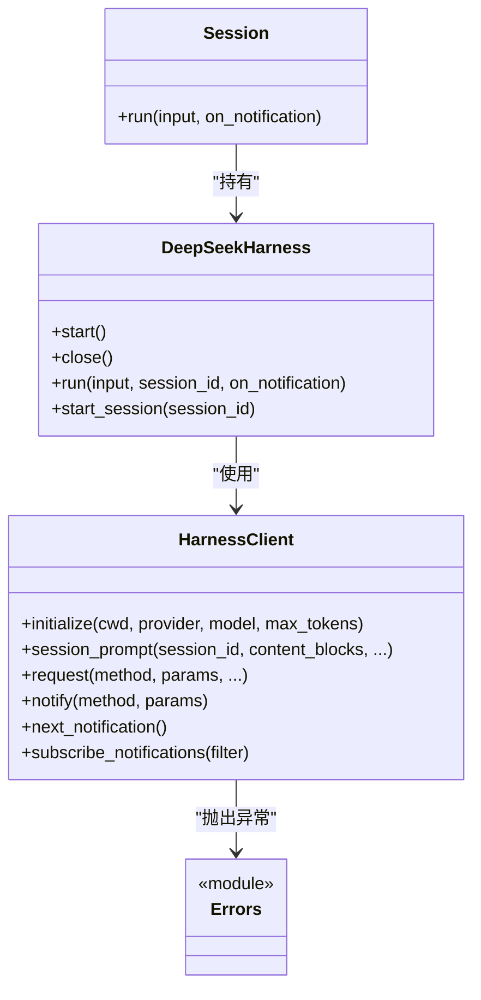
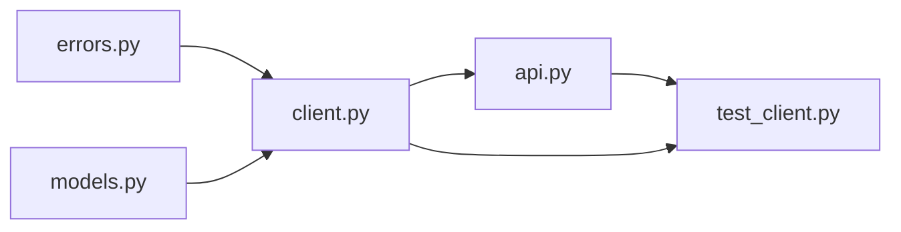

# 错误处理模块

<cite>
**本文引用的文件**
- [errors.py](file://python/sdk/src/deepseek_harness/errors.py)
- [client.py](file://python/sdk/src/deepseek_harness/client.py)
- [api.py](file://python/sdk/src/deepseek_harness/api.py)
- [models.py](file://python/sdk/src/deepseek_harness/models.py)
- [test_client.py](file://python/sdk/tests/test_client.py)
- [README.md](file://python/sdk/README.md)
</cite>

## 目录
1. [简介](#简介)
2. [项目结构](#项目结构)
3. [核心组件](#核心组件)
4. [架构总览](#架构总览)
5. [详细组件分析](#详细组件分析)
6. [依赖关系分析](#依赖关系分析)
7. [性能与可靠性考虑](#性能与可靠性考虑)
8. [故障排查指南](#故障排查指南)
9. [结论](#结论)
10. [附录：异常分类与捕获示例](#附录：异常分类与捕获示例)

## 简介
本模块为 DeepSeek Harness Python SDK 的错误处理体系，围绕运行时子进程通信、JSON-RPC 协议以及高层会话语义进行统一抽象。它定义了清晰的异常层次，将底层传输失败、协议违规、业务逻辑错误等区分开来，并提供诊断信息收集（如退出码、stderr 尾部）以辅助定位问题。同时，SDK 在请求超时、关闭流程、通知订阅等方面提供了可恢复的边界条件处理，便于上层实现重试与降级策略。

## 项目结构
Python SDK 的错误处理主要分布在以下文件中：
- errors.py：定义基础异常与具体异常类型
- client.py：低层 JSON-RPC 客户端，负责子进程启动、读写、消息路由、超时与诊断信息收集
- api.py：高层 API（DeepSeekHarness、Session），封装会话生命周期、事件聚合与协议校验
- models.py：通用数据模型（Notification、IncomingRequest、InitializeResponse 等）
- test_client.py：覆盖多种错误场景的测试用例，体现异常触发与行为预期
- README.md：说明高层 API 的行为约定与异常语义

**图表来源**
- [errors.py:4-23](file://python/sdk/src/deepseek_harness/errors.py#L4-L23)
- [client.py:37-558](file://python/sdk/src/deepseek_harness/client.py#L37-L558)
- [api.py:48-243](file://python/sdk/src/deepseek_harness/api.py#L48-L243)
- [models.py:13-33](file://python/sdk/src/deepseek_harness/models.py#L13-L33)
- [test_client.py:166-200](file://python/sdk/tests/test_client.py#L166-L200)
- [README.md:45-47](file://python/sdk/README.md#L45-L47)

**章节来源**
- [errors.py:4-23](file://python/sdk/src/deepseek_harness/errors.py#L4-L23)
- [client.py:37-558](file://python/sdk/src/deepseek_harness/client.py#L37-L558)
- [api.py:48-243](file://python/sdk/src/deepseek_harness/api.py#L48-L243)
- [models.py:13-33](file://python/sdk/src/deepseek_harness/models.py#L13-L33)
- [test_client.py:166-200](file://python/sdk/tests/test_client.py#L166-L200)
- [README.md:45-47](file://python/sdk/README.md#L45-L47)

## 核心组件
- 异常层次
  - HarnessError：所有 SDK 与运行时失败的基类
  - TransportClosedError：运行时子进程退出或 stdout 关闭导致的传输中断
  - SdkProtocolError：运行时发送的数据不符合 SDK 协议约定
  - JsonRpcError：运行时返回 JSON-RPC 错误响应，包含 code、message、data
- 客户端与高层 API
  - HarnessClient：管理子进程生命周期、请求/通知路由、超时控制、诊断信息收集
  - DeepSeekHarness / Session：封装会话运行、事件聚合、协议校验（如 turn/end 必须包含 reason.kind）
- 数据模型
  - Notification、IncomingRequest、InitializeResponse 等用于结构化消息与响应

**章节来源**
- [errors.py:4-23](file://python/sdk/src/deepseek_harness/errors.py#L4-L23)
- [client.py:37-558](file://python/sdk/src/deepseek_harness/client.py#L37-L558)
- [api.py:48-243](file://python/sdk/src/deepseek_harness/api.py#L48-L243)
- [models.py:13-33](file://python/sdk/src/deepseek_harness/models.py#L13-L33)

## 架构总览
下图展示了从高层 API 到低层客户端再到运行时子进程的调用链，以及错误在各层的传播路径。

**图表来源**
- [api.py:117-183](file://python/sdk/src/deepseek_harness/api.py#L117-L183)
- [client.py:138-178](file://python/sdk/src/deepseek_harness/client.py#L138-L178)
- [client.py:228-296](file://python/sdk/src/deepseek_harness/client.py#L228-L296)
- [client.py:343-362](file://python/sdk/src/deepseek_harness/client.py#L343-L362)
- [client.py:399-422](file://python/sdk/src/deepseek_harness/client.py#L399-L422)

## 详细组件分析

### 异常层次与触发条件
- HarnessError
  - 用途：作为所有 SDK 异常的基类，便于统一捕获与分类
  - 触发：由具体子类决定
- TransportClosedError
  - 触发条件：
    - 子进程已退出或 stdout 关闭
    - 写入 stdin 失败（例如管道断开）
  - 错误信息格式：包含“运行时关闭”的原因，并在诊断信息中附加退出码与 stderr 尾部
  - 相关实现位置：
    - 读取线程结束时注入诊断并抛出
    - 写入失败时包装为运行时关闭错误
- SdkProtocolError
  - 触发条件：
    - 运行时返回的数据不符合 SDK 协议约定（例如 turn/end 缺少 reason.kind）
  - 错误信息格式：描述具体的协议违规点
  - 相关实现位置：
    - 高层 API 对 turn/end 事件的 reason.kind 进行校验
- JsonRpcError
  - 触发条件：
    - 运行时返回 JSON-RPC 错误响应（error 字段存在）
  - 错误信息格式：
    - code：整数或 None
    - message：字符串
    - data：任意对象或 None
  - 相关实现位置：
    - 消息处理中将 error 字段转换为 JsonRpcError 并放入等待队列

**章节来源**
- [errors.py:4-23](file://python/sdk/src/deepseek_harness/errors.py#L4-L23)
- [client.py:318-335](file://python/sdk/src/deepseek_harness/client.py#L318-L335)
- [client.py:298-309](file://python/sdk/src/deepseek_harness/client.py#L298-L309)
- [client.py:343-362](file://python/sdk/src/deepseek_harness/client.py#L343-L362)
- [api.py:225-242](file://python/sdk/src/deepseek_harness/api.py#L225-L242)

### 客户端错误流与诊断信息
- 请求超时
  - 当请求超过配置的 request_timeout_seconds，会抛出 TimeoutError，并附带诊断信息（包括 stderr 尾部）
  - 相关实现位置：
    - _request_raw 中的超时判断与诊断拼接
- 关闭流程
  - close() 尝试优雅关闭（shutdown 请求），若失败则终止进程并清理资源
  - 关闭过程中会将运行时关闭错误注入到所有等待者与订阅者
  - 相关实现位置：
    - close() 中的 shutdown 请求、进程终止、资源清理
- 诊断信息收集
  - _runtime_diagnostics() 收集退出码与 stderr 尾部，用于增强错误可读性
  - 相关实现位置：
    - _runtime_diagnostics() 的实现

**图表来源**
- [client.py:228-296](file://python/sdk/src/deepseek_harness/client.py#L228-L296)
- [client.py:343-362](file://python/sdk/src/deepseek_harness/client.py#L343-L362)
- [client.py:399-422](file://python/sdk/src/deepseek_harness/client.py#L399-L422)

**章节来源**
- [client.py:228-296](file://python/sdk/src/deepseek_harness/client.py#L228-L296)
- [client.py:318-335](file://python/sdk/src/deepseek_harness/client.py#L318-L335)
- [client.py:399-422](file://python/sdk/src/deepseek_harness/client.py#L399-L422)

### 高层 API 的协议校验与错误分类
- Session.run()
  - 收集通知与事件，直到收到根会话的 idle 状态
  - 提取 final_response 与 finish_reason
  - 若 turn/end 事件缺少 reason.kind，抛出 SdkProtocolError
- DeepSeekHarness
  - 管理配置与环境变量注入（provider、model、max_tokens、base_url、api_key 等）
  - 通过 HarnessClient 执行 initialize 与 session/prompt
  - 提供上下文管理器模式确保资源释放

**图表来源**
- [api.py:48-183](file://python/sdk/src/deepseek_harness/api.py#L48-L183)
- [client.py:37-214](file://python/sdk/src/deepseek_harness/client.py#L37-L214)
- [errors.py:4-23](file://python/sdk/src/deepseek_harness/errors.py#L4-L23)

**章节来源**
- [api.py:48-183](file://python/sdk/src/deepseek_harness/api.py#L48-L183)
- [api.py:225-242](file://python/sdk/src/deepseek_harness/api.py#L225-L242)
- [client.py:37-214](file://python/sdk/src/deepseek_harness/client.py#L37-L214)
- [errors.py:4-23](file://python/sdk/src/deepseek_harness/errors.py#L4-L23)

### 错误日志记录与调试信息收集最佳实践
- 利用 TransportClosedError 的诊断信息
  - 包含退出码与 stderr 尾部，有助于快速定位运行时崩溃或初始化失败
- 捕获 TimeoutError
  - 超时错误会附带诊断信息，建议记录完整错误字符串以便后续分析
- 捕获 JsonRpcError
  - 记录 code、message、data，便于与服务端协作定位问题
- 捕获 SdkProtocolError
  - 记录协议违规的具体位置，帮助修复运行时或上游数据生成逻辑
- 使用上下文管理器
  - 确保无论是否发生异常，都能正确关闭子进程与清理资源

**章节来源**
- [client.py:399-422](file://python/sdk/src/deepseek_harness/client.py#L399-L422)
- [client.py:228-296](file://python/sdk/src/deepseek_harness/client.py#L228-L296)
- [client.py:87-116](file://python/sdk/src/deepseek_harness/client.py#L87-L116)
- [api.py:225-242](file://python/sdk/src/deepseek_harness/api.py#L225-L242)

### 与底层错误的映射关系
- 子进程退出或 stdout 关闭 → TransportClosedError
- JSON-RPC 错误响应 → JsonRpcError
- 协议违规（如 turn/end 缺少 reason.kind）→ SdkProtocolError
- 请求超时 → TimeoutError（非 SDK 自定义异常，但携带诊断信息）
- 写入失败 → 包装为 TransportClosedError

**章节来源**
- [client.py:318-335](file://python/sdk/src/deepseek_harness/client.py#L318-L335)
- [client.py:298-309](file://python/sdk/src/deepseek_harness/client.py#L298-L309)
- [client.py:343-362](file://python/sdk/src/deepseek_harness/client.py#L343-L362)
- [api.py:225-242](file://python/sdk/src/deepseek_harness/api.py#L225-L242)

## 依赖关系分析
- errors.py 被 client.py 与 api.py 引用，作为异常定义中心
- client.py 依赖 errors.py 与 models.py，实现 JSON-RPC 客户端
- api.py 依赖 client.py 与 errors.py，实现高层会话 API
- test_client.py 覆盖多种错误场景，验证异常行为与诊断信息

**图表来源**
- [errors.py:4-23](file://python/sdk/src/deepseek_harness/errors.py#L4-L23)
- [client.py:17-18](file://python/sdk/src/deepseek_harness/client.py#L17-L18)
- [api.py:8-10](file://python/sdk/src/deepseek_harness/api.py#L8-L10)
- [test_client.py:12](file://python/sdk/tests/test_client.py#L12)

**章节来源**
- [errors.py:4-23](file://python/sdk/src/deepseek_harness/errors.py#L4-L23)
- [client.py:17-18](file://python/sdk/src/deepseek_harness/client.py#L17-L18)
- [api.py:8-10](file://python/sdk/src/deepseek_harness/api.py#L8-L10)
- [test_client.py:12](file://python/sdk/tests/test_client.py#L12)

## 性能与可靠性考虑
- 超时控制
  - 通过 request_timeout_seconds 限制单次请求等待时间，避免阻塞
  - 超时错误包含诊断信息，便于快速定位
- 关闭与资源清理
  - close() 尝试优雅关闭，必要时强制终止进程，确保资源释放
  - 关闭失败不影响主流程，但会记录错误并继续清理
- 通知订阅与过滤
  - 支持按会话树过滤通知，减少无关事件处理开销
  - 过滤器异常会被捕获并注入对应订阅队列，避免影响其他订阅
- 诊断信息
  - 收集 stderr 尾部与退出码，提升错误可观测性

**章节来源**
- [client.py:228-296](file://python/sdk/src/deepseek_harness/client.py#L228-L296)
- [client.py:87-116](file://python/sdk/src/deepseek_harness/client.py#L87-L116)
- [client.py:363-397](file://python/sdk/src/deepseek_harness/client.py#L363-L397)
- [client.py:399-422](file://python/sdk/src/deepseek_harness/client.py#L399-L422)

## 故障排查指南
- 常见问题与定位
  - 运行时未启动或立即退出：检查 TransportClosedError 的诊断信息（退出码、stderr 尾部）
  - JSON-RPC 错误：记录 JsonRpcError 的 code、message、data，与服务端核对
  - 协议违规：捕获 SdkProtocolError，检查 turn/end 事件是否包含 reason.kind
  - 请求超时：记录 TimeoutError 的诊断信息，检查服务端响应时间与负载
- 调试步骤
  - 启用上下文管理器确保资源释放
  - 捕获并记录所有异常类型，保留完整堆栈与诊断信息
  - 使用测试脚本模拟运行时行为，复现问题并验证修复

**章节来源**
- [client.py:318-335](file://python/sdk/src/deepseek_harness/client.py#L318-L335)
- [client.py:343-362](file://python/sdk/src/deepseek_harness/client.py#L343-L362)
- [api.py:225-242](file://python/sdk/src/deepseek_harness/api.py#L225-L242)
- [test_client.py:720-746](file://python/sdk/tests/test_client.py#L720-L746)

## 结论
该错误处理模块通过清晰的异常层次、严格的协议校验与丰富的诊断信息，为 Python SDK 提供了可靠的错误分类与定位能力。结合超时控制、资源清理与通知订阅机制，开发者可以构建健壮的上层应用，实现有效的错误恢复与重试策略。

## 附录：异常分类与捕获示例
- 异常分类
  - 传输层错误：TransportClosedError
  - 协议层错误：SdkProtocolError
  - 服务层错误：JsonRpcError
  - 超时错误：TimeoutError（标准异常，携带诊断信息）
- 捕获示例（参考路径）
  - 捕获 SdkProtocolError：[test_client.py:166-200](file://python/sdk/tests/test_client.py#L166-L200)
  - 捕获 TimeoutError：[test_client.py:720-746](file://python/sdk/tests/test_client.py#L720-L746)
  - 捕获 JsonRpcError：[client.py:343-362](file://python/sdk/src/deepseek_harness/client.py#L343-L362)
  - 捕获 TransportClosedError：[client.py:318-335](file://python/sdk/src/deepseek_harness/client.py#L318-L335)

**章节来源**
- [test_client.py:166-200](file://python/sdk/tests/test_client.py#L166-L200)
- [test_client.py:720-746](file://python/sdk/tests/test_client.py#L720-L746)
- [client.py:318-335](file://python/sdk/src/deepseek_harness/client.py#L318-L335)
- [client.py:343-362](file://python/sdk/src/deepseek_harness/client.py#L343-L362)