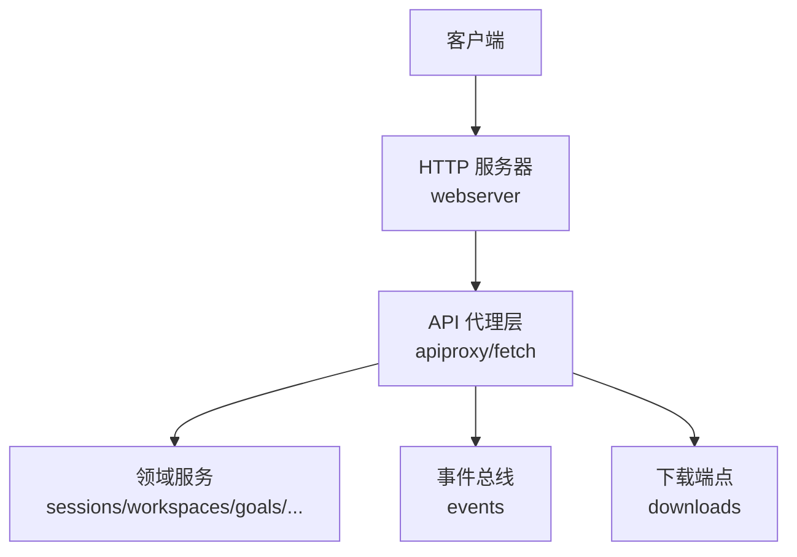
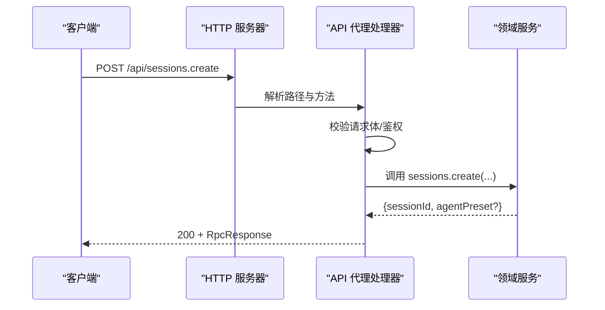
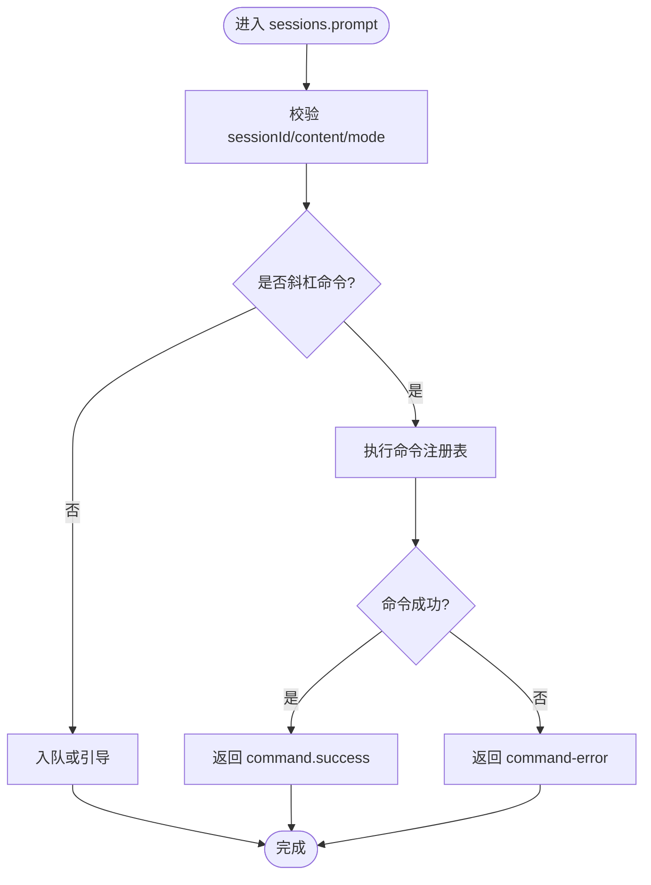
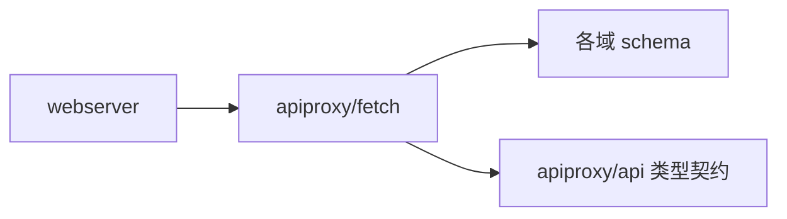

# REST API

<cite>
**本文引用的文件**
- [packages/host/apiproxy/src/api/index.ts](file://packages/host/apiproxy/src/api/index.ts)
- [packages/host/apiproxy/src/api/sessions.ts](file://packages/host/apiproxy/src/api/sessions.ts)
- [packages/host/apiproxy/src/api/goals.ts](file://packages/host/apiproxy/src/api/goals.ts)
- [packages/host/apiproxy/src/api/workspace.ts](file://packages/host/apiproxy/src/api/workspace.ts)
- [packages/host/apiproxy/src/api/agent-presets.ts](file://packages/host/apiproxy/src/api/agent-presets.ts)
- [packages/host/apiproxy/src/api/settings.ts](file://packages/host/apiproxy/src/api/settings.ts)
- [packages/host/apiproxy/src/api/credentials.ts](file://packages/host/apiproxy/src/api/credentials.ts)
- [packages/host/apiproxy/src/api/llm.ts](file://packages/host/apiproxy/src/api/llm.ts)
- [packages/host/apiproxy/src/api/downloads.ts](file://packages/host/apiproxy/src/api/downloads.ts)
- [packages/host/apiproxy/src/api/events.ts](file://packages/host/apiproxy/src/api/events.ts)
- [packages/host/apiproxy/src/api/rpc.ts](file://packages/host/apiproxy/src/api/rpc.ts)
- [packages/host/apiproxy/src/fetch/handler.ts](file://packages/host/apiproxy/src/fetch/handler.ts)
- [packages/host/webserver/src/index.ts](file://packages/host/webserver/src/index.ts)
- [packages/client/connection/tests/node-half.host.spec.ts](file://packages/client/connection/tests/node-half.host.spec.ts)
- [packages/host/apiproxy/tests/client-handler.spec.ts](file://packages/host/apiproxy/tests/client-handler.spec.ts)
</cite>

## 目录
1. [简介](#简介)
2. [项目结构](#项目结构)
3. [核心组件](#核心组件)
4. [架构总览](#架构总览)
5. [详细组件分析](#详细组件分析)
6. [依赖关系分析](#依赖关系分析)
7. [性能与可靠性](#性能与可靠性)
8. [故障排查指南](#故障排查指南)
9. [结论](#结论)
10. [附录：OpenAPI 规范与 curl 示例](#附录openapi-规范与-curl-示例)

## 简介
本文件为 DeepSeek Harness 的 REST/RPC 接口文档，聚焦 Host 暴露的统一 API 代理层（apiproxy）。该层将“会话、工作区、目标、设置、凭据、LLM 模型目录、事件流、下载”等能力以统一的 RPC 消息模型对外提供，并通过 HTTP 通道承载。客户端通过 POST /api/<domain>.<method> 调用方法；服务器请求（如审批）通过 POST /api/respond 回传结果。所有域方法的请求/响应载荷由 TypeScript 接口定义，保证跨端契约一致。

## 项目结构
- apiproxy/api：领域方法与数据类型的权威契约（浏览器可导入，零 Node 依赖）。
- apiproxy/fetch：HTTP 路由与校验、鉴权、错误映射到 HTTP 状态码。
- webserver：通用 HTTP 服务器，支持精确匹配与前缀匹配路由、WebSocket 升级。
- client/connection：客户端连接与权限围栏（特权方法仅回环可达）。

**图示来源**
- [packages/host/webserver/src/index.ts:65-101](file://packages/host/webserver/src/index.ts#L65-L101)
- [packages/host/apiproxy/src/fetch/handler.ts:40-72](file://packages/host/apiproxy/src/fetch/handler.ts#L40-L72)

**章节来源**
- [packages/host/webserver/src/index.ts:65-101](file://packages/host/webserver/src/index.ts#L65-L101)
- [packages/host/apiproxy/src/api/index.ts:1-99](file://packages/host/apiproxy/src/api/index.ts#L1-L99)

## 核心组件
- 统一 API 根接口 ApiProxy：聚合 sessions、subagents、host、workspace、skills、agentPresets、events、goals、settings、credentials、llm、downloads 以及 respond 入口。
- 消息模型：RpcRequest/RpcResponse、ClientRequest/ServerRequest/ClientResponse/ServerResponse、RpcReceipt。
- 安全策略：
  - 特权方法限制为回环（loopback），即使配置了可信主机也不放行。
  - 未知方法返回 404，非 JSON 请求体返回 400，实现抛错返回 500。
- 路由注册：webserver 支持 exact/prefix 两种模式，按最长前缀与精确优先规则分发。

**章节来源**
- [packages/host/apiproxy/src/api/index.ts:21-42](file://packages/host/apiproxy/src/api/index.ts#L21-L42)
- [packages/host/apiproxy/src/api/rpc.ts](file://packages/host/apiproxy/src/api/rpc.ts)
- [packages/client/connection/tests/node-half.host.spec.ts:164-188](file://packages/client/connection/tests/node-half.host.spec.ts#L164-L188)
- [packages/host/apiproxy/tests/client-handler.spec.ts:333-344](file://packages/host/apiproxy/tests/client-handler.spec.ts#L333-L344)
- [packages/host/webserver/src/index.ts:88-101](file://packages/host/webserver/src/index.ts#L88-L101)

## 架构总览
下图展示一次典型调用的端到端流程：客户端发起 POST /api/<domain>.<method>，经 webserver 路由到 apiproxy 处理器，进行参数校验、权限检查后调用对应领域方法，最后以 RpcResponse 形式返回。

**图示来源**
- [packages/host/webserver/src/index.ts:65-101](file://packages/host/webserver/src/index.ts#L65-L101)
- [packages/host/apiproxy/src/fetch/handler.ts:40-72](file://packages/host/apiproxy/src/fetch/handler.ts#L40-L72)

## 详细组件分析

### 会话管理（sessions）
- 列表与搜索：列出持久化会话（按更新时间倒序），支持内容搜索并返回片段与是否还有更多。
- 创建：支持 workspaceId/cwd/sessionId/agentPreset；幂等创建与冲突处理。
- 历史：分页读取原始事件与视图投影，尾部页携带进行中消息与投影基线。
- 模型目录：查询会话可用的模型分组与当前选择。
- 发送消息：支持 queue/steer 模式，文本与临时图片；斜杠命令走命令注册表。
- 附件：按会话日志引用校验后读取图片数据。
- 队列编辑：编辑/移除/严格引导待处理项。
- 取消：停止活跃轮次，保留待处理入队任务。

**图示来源**
- [packages/host/apiproxy/src/api/sessions.ts:315-353](file://packages/host/apiproxy/src/api/sessions.ts#L315-L353)

**章节来源**
- [packages/host/apiproxy/src/api/sessions.ts:231-374](file://packages/host/apiproxy/src/api/sessions.ts#L231-L374)

### 目标管理（goals）
- 创建/编辑/暂停/恢复/完成/清除：对普通会话的目标进行 CAS 保护变更，读侧通过 session/projection 获取最新值。

**章节来源**
- [packages/host/apiproxy/src/api/goals.ts:1-55](file://packages/host/apiproxy/src/api/goals.ts#L1-L55)

### 工作区（workspace）
- 列表：包含归档会话集合。
- 创建/重命名/删除：基于已存在目录注册工作区，支持顺序调整与会话归属移动。
- 归档会话：从分组中隐藏但保留日志与位置。

**章节来源**
- [packages/host/apiproxy/src/api/workspace.ts:1-110](file://packages/host/apiproxy/src/api/workspace.ts#L1-L110)

### Agent 预设（agentPresets）
- list：列出部署提供的预设清单及是否可编辑。
- select：在空白会话中选择不同预设重建 Agent。
- read/copy/openDocument/remove：只读查看、复制本地预设、打开目录编辑、删除本地预设。

**章节来源**
- [packages/host/apiproxy/src/api/agent-presets.ts:1-117](file://packages/host/apiproxy/src/api/agent-presets.ts#L1-L117)

### 设置（settings）
- describe：描述所有命名空间（脱敏值+Schema），含 hasDocument 能力。
- openDocument：准备本地文档并交由系统打开（仅限回环）。

**章节来源**
- [packages/host/apiproxy/src/api/settings.ts:52-75](file://packages/host/apiproxy/src/api/settings.ts#L52-L75)

### 凭据（credentials）
- 描述/设置/移除凭据：受信任主机与回环策略约束。

**章节来源**
- [packages/host/apiproxy/src/api/credentials.ts](file://packages/host/apiproxy/src/api/credentials.ts)

### LLM 模型目录（llm）
- providers：列出可配置提供者及其状态。
- models：主机级模型目录（分组与失败信息）。
- discoverModels：探测草稿配置的模型能力（不写入）。

**章节来源**
- [packages/host/apiproxy/src/api/llm.ts:1-90](file://packages/host/apiproxy/src/api/llm.ts#L1-L90)

### 事件流（events）
- 通过 mux 帧推送工具调用、结果、宿主事件等，供客户端构建 UI 与回放。

**章节来源**
- [packages/host/apiproxy/src/api/events.ts](file://packages/host/apiproxy/src/api/events.ts)

### 下载（downloads）
- 提供 GET 下载端点（无信封），用于宿主侧资源下载。

**章节来源**
- [packages/host/apiproxy/src/api/downloads.ts](file://packages/host/apiproxy/src/api/downloads.ts)

### 认证、权限与安全
- 回环限制：特权方法（如 host.*、settings.*、credentials.*、llm.discoverModels、agentPreset.* 等）仅在 loopback 可达，即使配置 trustedHosts 也拒绝。
- 路由优先级：精确匹配优先于前缀匹配，最长前缀优先。
- 错误映射：未知方法→404；非 JSON→400；实现异常→500。

**章节来源**
- [packages/client/connection/tests/node-half.host.spec.ts:164-188](file://packages/client/connection/tests/node-half.host.spec.ts#L164-L188)
- [packages/host/webserver/src/index.ts:88-101](file://packages/host/webserver/src/index.ts#L88-L101)
- [packages/host/apiproxy/tests/client-handler.spec.ts:333-344](file://packages/host/apiproxy/tests/client-handler.spec.ts#L333-L344)

## 依赖关系分析
- apiproxy/api 为纯类型契约，被 fetch 处理器与客户端共享。
- fetch 处理器依赖各域的 schema 校验与路由映射。
- webserver 提供底层 HTTP 路由能力，apiproxy 在其上注册 /api/* 路由。

**图示来源**
- [packages/host/webserver/src/index.ts:65-101](file://packages/host/webserver/src/index.ts#L65-L101)
- [packages/host/apiproxy/src/fetch/handler.ts:40-72](file://packages/host/apiproxy/src/fetch/handler.ts#L40-L72)
- [packages/host/apiproxy/src/api/index.ts:1-99](file://packages/host/apiproxy/src/api/index.ts#L1-L99)

**章节来源**
- [packages/host/apiproxy/src/fetch/handler.ts:40-72](file://packages/host/apiproxy/src/fetch/handler.ts#L40-L72)
- [packages/host/webserver/src/index.ts:65-101](file://packages/host/webserver/src/index.ts#L65-L101)

## 性能与可靠性
- 历史分页：按消息边界对齐，避免截断；尾部页携带投影基线以减少冷启动开销。
- 模型目录：分组独立失败不影响可用分组；会话内 models 与全局 llm.models 分离。
- 错误稳定：HTTP 状态与 RPC 错误码映射清晰，便于客户端重试与降级。

[本节为通用指导，无需特定文件来源]

## 故障排查指南
- 404：请求的方法不存在或路径未注册。
- 400：请求体不是合法 JSON。
- 403：访问了受限方法（非回环）或未授权。
- 500：服务端实现抛出异常。
- 常见定位步骤：
  - 确认 URL 格式为 /api/<domain>.<method>。
  - 检查 Content-Type 是否为 application/json。
  - 确认调用方来源是否满足回环要求（针对特权方法）。
  - 查看服务端日志中的 transport failure 堆栈。

**章节来源**
- [packages/host/apiproxy/tests/client-handler.spec.ts:333-344](file://packages/host/apiproxy/tests/client-handler.spec.ts#L333-L344)
- [packages/client/connection/tests/node-half.host.spec.ts:164-188](file://packages/client/connection/tests/node-half.host.spec.ts#L164-L188)

## 结论
DeepSeek Harness 通过 apiproxy 提供统一、强类型、可验证的 RESTful RPC 接口，覆盖会话、工作区、目标、设置、凭据、模型目录、事件与下载等核心能力。结合 webserver 的路由机制与严格的权限控制，既保证了安全性，又提供了良好的可扩展性。建议客户端严格遵循请求/响应契约，利用投影与分页优化体验，并在错误分支做稳健重试与降级。

[本节为总结，无需特定文件来源]

## 附录：OpenAPI 规范与 curl 示例

说明
- 协议：HTTP + JSON。
- 基础路径：/api
- 方法命名：POST /api/<domain>.<method>
- 请求体：RpcRequest

- 响应体：RpcResponse<T>
- 服务器请求应答：POST /api/respond（携带 ClientResponse）

通用字段
- RpcRequest
  - rpcId: string
  - method: string（形如 "sessions.create"）
  - payload: object
- RpcResponse
  - ok: boolean
  - value?: any
  - error?: { code: string; message: string }

端点一览（节选）
- sessions.list
  - 方法：POST /api/sessions.list
  - 请求：{ cursor?: string }
  - 响应：{ items: SessionSummary[] }
- sessions.search
  - 方法：POST /api/sessions.search
  - 请求：{ query: string }
  - 响应：{ items: SessionSearchItem[], hasMore: boolean }
- sessions.create
  - 方法：POST /api/sessions.create
  - 请求：{ workspaceId?, cwd?, sessionId?, agentPreset? }
  - 响应：{ sessionId, agentPreset? }
- sessions.history
  - 方法：POST /api/sessions.history
  - 请求：{ sessionId, beforeSeq?, maxMessages? }
  - 响应：{ events: HistoryEntry[], hasMore: boolean, projections? }
- sessions.prompt
  - 方法：POST /api/sessions.prompt
  - 请求：{ sessionId, mode: "queue"|"steer", content: PromptContentPart[], clientTimeZone? }
  - 响应：{ accepted: true, command? }
- sessions.attachment
  - 方法：POST /api/sessions.attachment
  - 请求：{ sessionId, attachmentId }
  - 响应：{ attachment, data }
- sessions.updateQueue
  - 方法：POST /api/sessions.updateQueue
  - 请求：{ sessionId, itemId, action }
  - 响应：{ accepted: true }
- sessions.cancel
  - 方法：POST /api/sessions.cancel
  - 请求：{ sessionId }
  - 响应：{ accepted: true }
- goals.create/edit/pause/resume/complete/clear
  - 方法：POST /api/goals.<verb>
  - 请求：见 goals.ts
  - 响应：CAS ref 或 cleared:true
- workspace.list/create/rename/delete/insertBefore/insertSessionBefore/archiveSession
  - 方法：POST /api/workspace.<verb>
  - 请求/响应：见 workspace.ts
- agentPresets.list/select/read/copy/openDocument/remove
  - 方法：POST /api/agentPresets.<verb>
  - 请求/响应：见 agent-presets.ts
- settings.describe/openDocument
  - 方法：POST /api/settings.<verb>
  - 请求/响应：见 settings.ts
- credentials.describe/set/unset
  - 方法：POST /api/credentials.<verb>
  - 请求/响应：见 credentials.ts
- llm.providers/models/discoverModels
  - 方法：POST /api/llm.<verb>
  - 请求/响应：见 llm.ts
- downloads
  - 方法：GET /api/downloads/*（无信封）
  - 响应：二进制或文本

curl 示例
- 创建会话
  - curl -X POST http://localhost:PORT/api/sessions.create \
      -H "Content-Type: application/json" \
      -d '{"rpcId":"r1","method":"sessions.create","payload":{}}'
- 发送提示
  - curl -X POST http://localhost:PORT/api/sessions.prompt \
      -H "Content-Type: application/json" \
      -d '{"rpcId":"r2","method":"sessions.prompt","payload":{"sessionId":"<id>","mode":"queue","content":[{"type":"text","text":"你好"}]}}'
- 读取历史
  - curl -X POST http://localhost:PORT/api/sessions.history \
      -H "Content-Type: application/json" \
      -d '{"rpcId":"r3","method":"sessions.history","payload":{"sessionId":"<id>"}}'
- 列举工作区
  - curl -X POST http://localhost:PORT/api/workspace.list \
      -H "Content-Type: application/json" \
      -d '{"rpcId":"r4","method":"workspace.list","payload":{}}'
- 列举模型提供者
  - curl -X POST http://localhost:PORT/api/llm.providers \
      -H "Content-Type: application/json" \
      -d '{"rpcId":"r5","method":"llm.providers","payload":{}}'

注意
- 端口 PORT 由 webserver 监听端口决定（若配置为 0 则为操作系统分配）。
- 特权方法需从回环地址调用，否则返回 403。
- 服务器请求（如审批）通过 POST /api/respond 回传 ClientResponse。

**章节来源**
- [packages/host/apiproxy/src/api/index.ts:21-42](file://packages/host/apiproxy/src/api/index.ts#L21-L42)
- [packages/host/apiproxy/src/api/sessions.ts:231-374](file://packages/host/apiproxy/src/api/sessions.ts#L231-L374)
- [packages/host/apiproxy/src/api/goals.ts:1-55](file://packages/host/apiproxy/src/api/goals.ts#L1-L55)
- [packages/host/apiproxy/src/api/workspace.ts:1-110](file://packages/host/apiproxy/src/api/workspace.ts#L1-L110)
- [packages/host/apiproxy/src/api/agent-presets.ts:1-117](file://packages/host/apiproxy/src/api/agent-presets.ts#L1-L117)
- [packages/host/apiproxy/src/api/settings.ts:52-75](file://packages/host/apiproxy/src/api/settings.ts#L52-L75)
- [packages/host/apiproxy/src/api/llm.ts:1-90](file://packages/host/apiproxy/src/api/llm.ts#L1-L90)
- [packages/host/apiproxy/src/api/downloads.ts](file://packages/host/apiproxy/src/api/downloads.ts)
- [packages/host/webserver/src/index.ts:65-101](file://packages/host/webserver/src/index.ts#L65-L101)