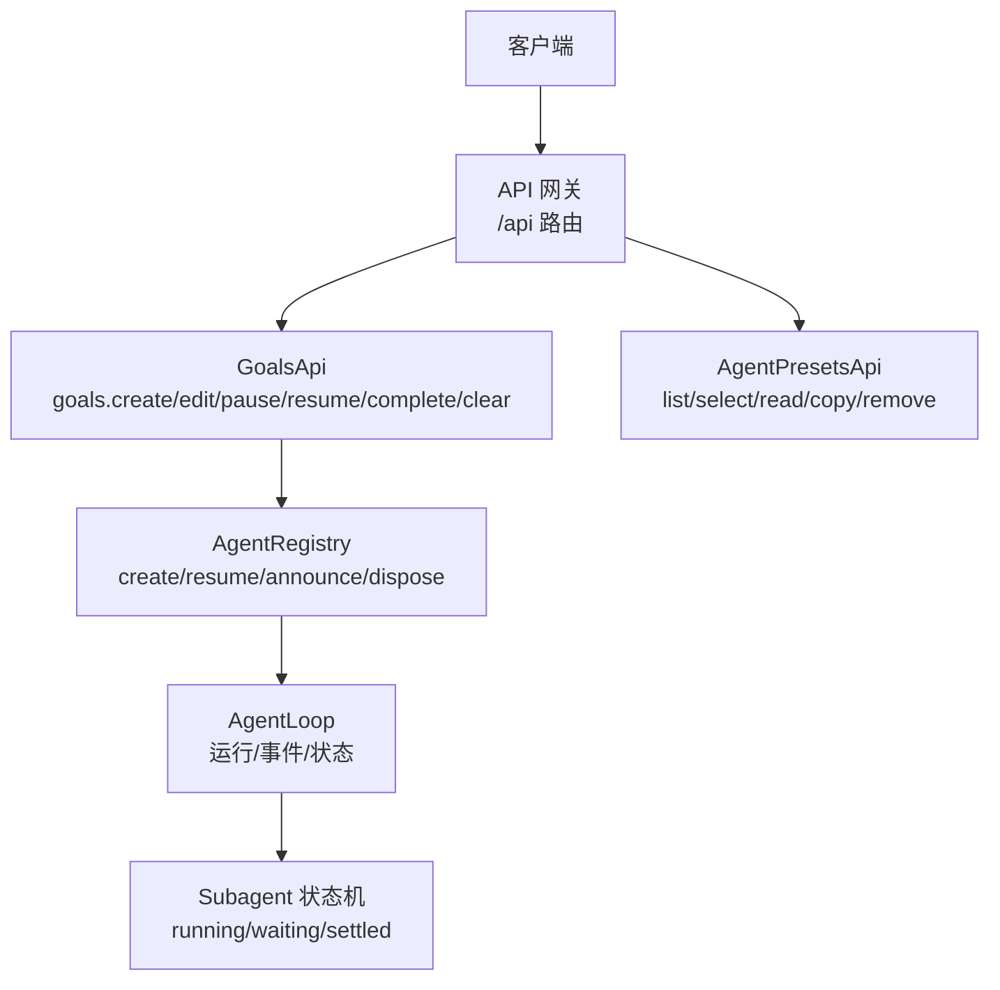
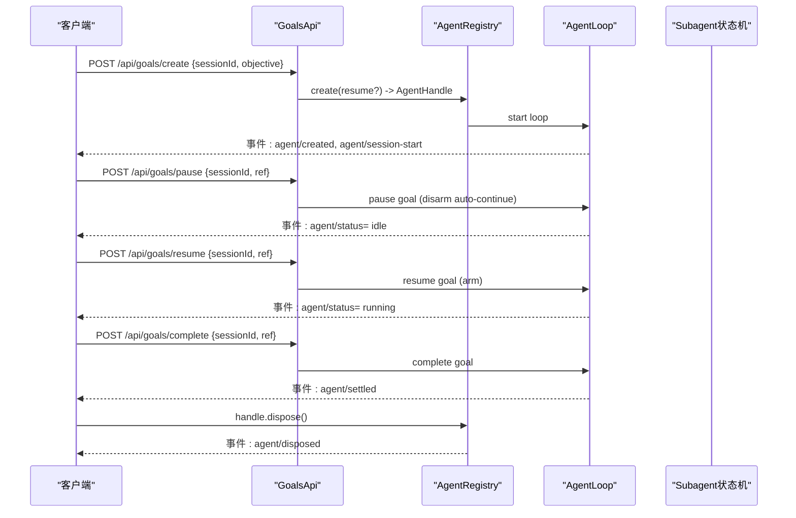
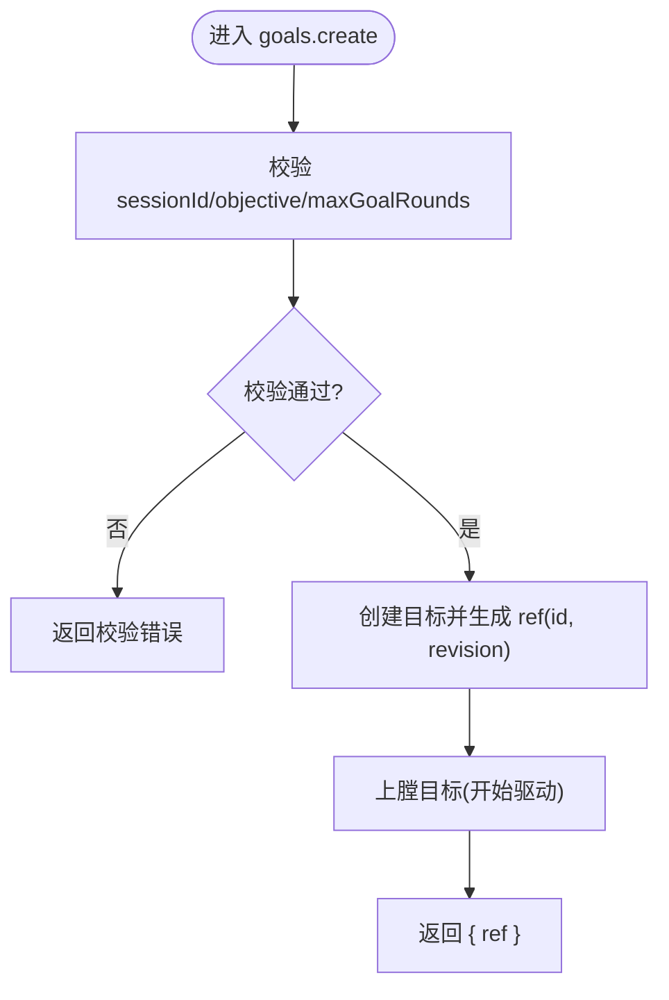
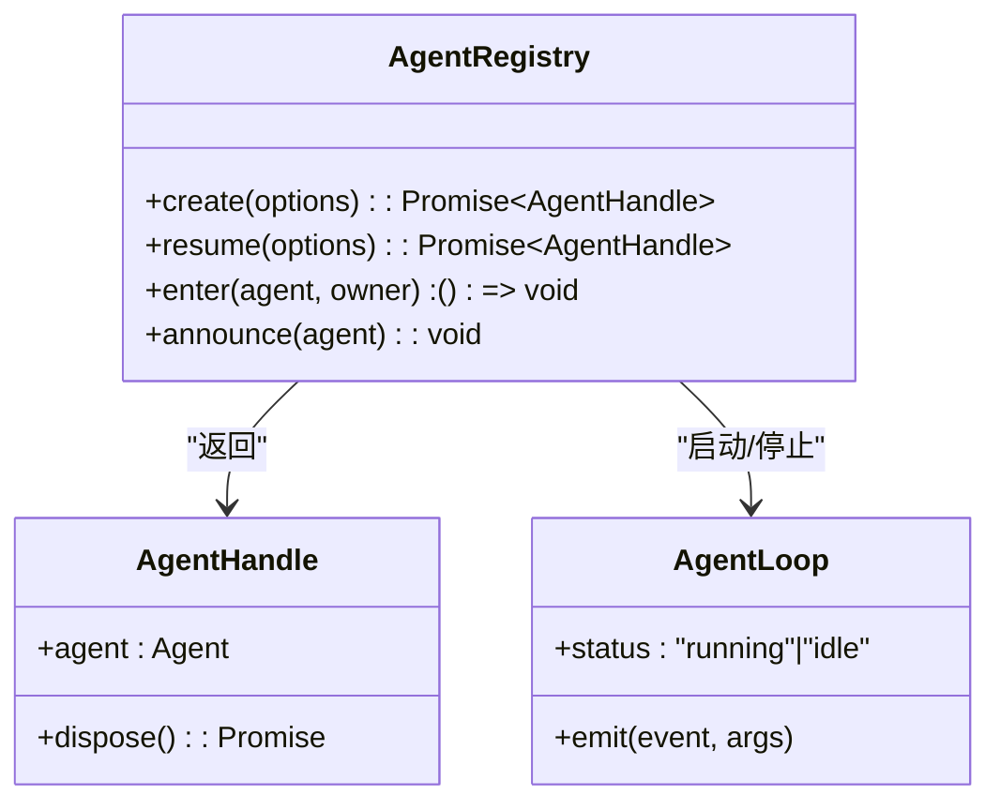
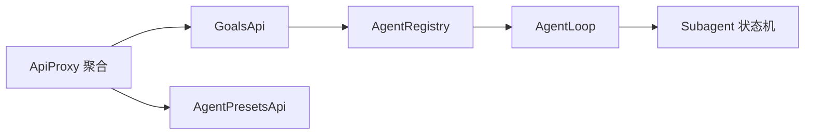

# Agent 管理 API

<cite>
**本文引用的文件**
- [packages/host/apiproxy/src/api/index.ts](file://packages/host/apiproxy/src/api/index.ts)
- [packages/host/apiproxy/src/api/goals.ts](file://packages/host/apiproxy/src/api/goals.ts)
- [packages/host/apiproxy/src/api/goals.schema.ts](file://packages/host/apiproxy/src/api/goals.schema.ts)
- [packages/host/apiproxy/src/api/agent-presets.schema.ts](file://packages/host/apiproxy/src/api/agent-presets.schema.ts)
- [packages/core/agent/src/index.ts](file://packages/core/agent/src/index.ts)
- [packages/core/agent-loop/src/index.ts](file://packages/core/agent-loop/src/index.ts)
- [packages/subagent/subagent/src/continuation.ts](file://packages/subagent/subagent/src/continuation.ts)
- [packages/client/connection/tests/node-half.host.spec.ts](file://packages/client/connection/tests/node-half.host.spec.ts)
- [packages/api/remotes/tests/built-lib.e2e.ts](file://packages/api/remotes/tests/built-lib.e2e.ts)
</cite>

## 目录
1. [简介](#简介)
2. [项目结构](#项目结构)
3. [核心组件](#核心组件)
4. [架构总览](#架构总览)
5. [详细组件分析](#详细组件分析)
6. [依赖关系分析](#依赖关系分析)
7. [性能考虑](#性能考虑)
8. [故障排查指南](#故障排查指南)
9. [结论](#结论)
10. [附录](#附录)

## 简介
本文件面向“Agent 管理”的 RESTful API，聚焦与 Agent 生命周期相关的端点：创建、启动、停止、销毁等。文档覆盖 HTTP 方法、URL 路径、请求参数与响应数据结构；说明配置参数的校验规则与默认值；提供成功与错误场景的请求/响应示例；并描述 Agent 状态转换与事件通知机制，以及权限控制与访问限制。

## 项目结构
- 统一 API 契约位于 apiproxy 层，按领域拆分（如 goals、agent-presets、sessions 等），并通过 barrel 导出统一的 ApiProxy 接口。
- 目标（Goal）域用于驱动 Agent 的目标级生命周期操作（创建、编辑、暂停、恢复、完成、清除）。
- Agent 注册表与句柄在 core/agent 中定义，负责创建、注册、发布、注销与销毁。
- Agent 循环与可观察状态在 core/agent-loop 中实现，负责运行态与事件广播。
- 子 Agent 的驻留状态由 subagent 模块维护，用于对外暴露“活跃/等待/空闲”等状态。

图表来源
- [packages/host/apiproxy/src/api/index.ts:21-42](file://packages/host/apiproxy/src/api/index.ts#L21-L42)
- [packages/host/apiproxy/src/api/goals.ts:25-54](file://packages/host/apiproxy/src/api/goals.ts#L25-L54)
- [packages/core/agent/src/index.ts:158-175](file://packages/core/agent/src/index.ts#L158-L175)
- [packages/subagent/subagent/src/continuation.ts:861-874](file://packages/subagent/subagent/src/continuation.ts#L861-L874)

章节来源
- [packages/host/apiproxy/src/api/index.ts:1-99](file://packages/host/apiproxy/src/api/index.ts#L1-L99)

## 核心组件
- GoalsApi：提供目标级生命周期操作，所有变更通过 CAS 引用（id + revision）进行一致性控制。
- AgentRegistry：负责 Agent 的创建、注册、发布、注销与销毁；返回拥有 dispose 能力的 AgentHandle。
- AgentLoop：驱动 Agent 执行，维护运行态与事件流（如 agent/status、agent/settled、agent/disposed）。
- Subagent 状态机：根据 Agent.status 与子项集合计算驻留状态（running/waiting/settled）。

章节来源
- [packages/host/apiproxy/src/api/goals.ts:25-54](file://packages/host/apiproxy/src/api/goals.ts#L25-L54)
- [packages/core/agent/src/index.ts:158-175](file://packages/core/agent/src/index.ts#L158-L175)
- [packages/core/agent/src/index.ts:482-576](file://packages/core/agent/src/index.ts#L482-L576)
- [packages/subagent/subagent/src/continuation.ts:861-874](file://packages/subagent/subagent/src/continuation.ts#L861-L874)

## 架构总览
- 客户端通过 /api 路由调用 GoalsApi 的方法，例如 goals/create、goals/pause、goals/resume、goals/complete、goals/clear。
- Goals 层解析请求并定位对应 Session 的 Agent，应用 CAS 守卫的动词，更新目标状态。
- Agent 的生命周期由 AgentRegistry 管理：create/resume 构建并发布 Agent，dispose 停止并清理。
- AgentLoop 负责运行与事件广播，外部通过事件订阅感知状态变化。

图表来源
- [packages/host/apiproxy/src/api/goals.ts:25-54](file://packages/host/apiproxy/src/api/goals.ts#L25-L54)
- [packages/core/agent/src/index.ts:158-175](file://packages/core/agent/src/index.ts#L158-L175)
- [packages/core/agent/src/index.ts:549-576](file://packages/core/agent/src/index.ts#L549-L576)
- [packages/subagent/subagent/src/continuation.ts:861-874](file://packages/subagent/subagent/src/continuation.ts#L861-L874)

## 详细组件分析

### GoalsApi：目标级生命周期端点
- 端点与方法
  - POST /api/goals/create
    - 请求体：{ sessionId, objective, maxGoalRounds? }
    - 响应：{ ok: true, value: { ref: { id, revision } } }
    - 行为：为目标创建并“上膛”，开始或继续目标驱动的 Agent 工作。
  - POST /api/goals/edit
    - 请求体：{ sessionId, ref, objective?, maxGoalRounds? }
    - 响应：{ ok: true, value: { ref: { id, revision } } }
    - 行为：在不改变阶段的前提下修改目标文本或轮次上限。
  - POST /api/goals/pause
    - 请求体：{ sessionId, ref }
    - 响应：{ ok: true, value: { ref: { id, revision } } }
    - 行为：暂停活跃目标，解除自动继续。
  - POST /api/goals/resume
    - 请求体：{ sessionId, ref }
    - 响应：{ ok: true, value: { ref: { id, revision } } }
    - 行为：恢复已停止的目标并重新上膛。
  - POST /api/goals/complete
    - 请求体：{ sessionId, ref }
    - 响应：{ ok: true, value: { ref: { id, revision } } }
    - 行为：标记当前非完成目标为完成并解除上膛。
  - POST /api/goals/clear
    - 请求体：{ sessionId, ref }
    - 响应：{ ok: true, value: { cleared: true } }
    - 行为：清除当前目标，保留墓碑与历史。

- 参数校验与默认值
  - sessionId：字符串，必填。
  - objective：字符串，长度≥1，必填于 create。
  - maxGoalRounds：正整数，可选；edit 时至少需提供 objective 或 maxGoalRounds 之一。
  - ref：包含 id 与 revision（正整数），用于 CAS 一致性。

- 成功示例
  - 创建目标
    - 请求：POST /api/goals/create
      - 主体：{ sessionId: "s1", objective: "编写单元测试" }
    - 响应：{ ok: true, value: { ref: { id: "g1", revision: 1 } } }
  - 暂停目标
    - 请求：POST /api/goals/pause
      - 主体：{ sessionId: "s1", ref: { id: "g1", revision: 1 } }
    - 响应：{ ok: true, value: { ref: { id: "g1", revision: 2 } } }

- 错误处理
  - 未授权/跨域：当 Host 不匹配时返回 403 forbidden。
  - 未知端点：返回 404。
  - 会话/目标不存在或版本冲突：由服务端以 RPC 错误形式返回（客户端需检查 ok=false 分支）。

- 权限与访问限制
  - 基于 Host 白名单的访问控制：仅允许受信任主机调用 /api 路由。
  - 目标变更采用 CAS（ref.id + ref.revision）防止并发覆盖。

图表来源
- [packages/host/apiproxy/src/api/goals.schema.ts:20-28](file://packages/host/apiproxy/src/api/goals.schema.ts#L20-L28)
- [packages/host/apiproxy/src/api/goals.schema.ts:30-41](file://packages/host/apiproxy/src/api/goals.schema.ts#L30-L41)
- [packages/host/apiproxy/src/api/goals.schema.ts:43-68](file://packages/host/apiproxy/src/api/goals.schema.ts#L43-L68)
- [packages/host/apiproxy/src/api/goals.schema.ts:70-79](file://packages/host/apiproxy/src/api/goals.schema.ts#L70-L79)

章节来源
- [packages/host/apiproxy/src/api/goals.ts:25-54](file://packages/host/apiproxy/src/api/goals.ts#L25-L54)
- [packages/host/apiproxy/src/api/goals.schema.ts:1-80](file://packages/host/apiproxy/src/api/goals.schema.ts#L1-L80)
- [packages/client/connection/tests/node-half.host.spec.ts:300-325](file://packages/client/connection/tests/node-half.host.spec.ts#L300-L325)

### Agent 注册与句柄：创建、启动、停止、销毁
- 创建与启动
  - 通过 AgentRegistry.create/resume 创建 Agent 并启动循环；成功后返回 AgentHandle。
  - 发布顺序：session/created → agent/created → agent/session-start → 启动循环。
- 停止与销毁
  - 调用 AgentHandle.dispose()：停止循环、等待退出、注销 Agent、移除 session、释放作用域。
  - 非所有者可通过 Agent.cancel() 中止当前与排队工作，或通过 keepInbox 中止本轮但保留待办。
- 状态与事件
  - Agent.status：'running' | 'idle'。
  - 事件：agent/created、agent/status、agent/settled、agent/disposed。
  - 配置驱动启动失败会发出 agent-loop/config-start-failed 事件。

图表来源
- [packages/core/agent/src/index.ts:158-175](file://packages/core/agent/src/index.ts#L158-L175)
- [packages/core/agent/src/index.ts:482-576](file://packages/core/agent/src/index.ts#L482-L576)
- [packages/core/agent-loop/src/index.ts:384-404](file://packages/core/agent-loop/src/index.ts#L384-L404)

章节来源
- [packages/core/agent/src/index.ts:158-175](file://packages/core/agent/src/index.ts#L158-L175)
- [packages/core/agent/src/index.ts:482-576](file://packages/core/agent/src/index.ts#L482-L576)
- [packages/core/agent-loop/src/index.ts:384-404](file://packages/core/agent-loop/src/index.ts#L384-L404)

### 子 Agent 状态与驻留
- 驻留状态推导：
  - running：存在活跃准入、开启的轮次或已接受但未排空的收件箱任务。
  - waiting：存在拥有的子项。
  - settled：既无活动也无子项。
- 该状态用于对外展示 Agent 是否“真正空闲”。

章节来源
- [packages/subagent/subagent/src/continuation.ts:861-874](file://packages/subagent/subagent/src/continuation.ts#L861-L874)

### Agent 预设：选择与读取
- 常用端点
  - agentPreset.list：列出可用预设及作者能力。
  - agentPreset.select：为会话选择预设。
  - agentPreset.read：读取预设内容与元信息。
  - agentPreset.copy：复制预设。
  - agentPreset.remove：删除用户预设。
- 字段与校验
  - 预设条目包含 id、trust(system/user)、isDefault、name、description、broken。
  - select 需要 sessionId 与有效的 agentPreset 名称。

章节来源
- [packages/host/apiproxy/src/api/agent-presets.schema.ts:12-89](file://packages/host/apiproxy/src/api/agent-presets.schema.ts#L12-L89)

## 依赖关系分析
- API 契约聚合：ApiProxy 将各域 API 组合为统一入口。
- Goals 到 Agent 的依赖：Goals 层通过会话定位 Agent 并应用变更。
- Agent 到循环：Registry 创建后交由 Loop 驱动，事件由 Loop 广播。
- 子 Agent 状态：Subagent 模块根据 Agent 与子项集合计算驻留状态。

图表来源
- [packages/host/apiproxy/src/api/index.ts:21-42](file://packages/host/apiproxy/src/api/index.ts#L21-L42)
- [packages/host/apiproxy/src/api/goals.ts:25-54](file://packages/host/apiproxy/src/api/goals.ts#L25-L54)
- [packages/core/agent/src/index.ts:158-175](file://packages/core/agent/src/index.ts#L158-L175)
- [packages/subagent/subagent/src/continuation.ts:861-874](file://packages/subagent/subagent/src/continuation.ts#L861-L874)

章节来源
- [packages/host/apiproxy/src/api/index.ts:1-99](file://packages/host/apiproxy/src/api/index.ts#L1-L99)

## 性能考虑
- 使用 CAS（ref.id + ref.revision）避免并发写冲突，减少重试开销。
- 事件广播异步化：创建/销毁事件监听器中的异常被捕获并记录，避免阻塞主流程。
- 子 Agent 驻留状态合并了 Agent.status 与子项集合，避免频繁查询带来的额外负载。

[本节为通用指导，无需特定文件引用]

## 故障排查指南
- 常见错误
  - 403 forbidden：Host 不在白名单内，拒绝访问 /api。
  - 404：请求的端点未注册或已被撤销。
  - 校验失败：缺少必要字段或类型不符（如 objective 为空、maxGoalRounds 非正整数）。
  - 版本冲突：ref.revision 与当前不一致，需先读取最新 ref 再提交。
- 诊断建议
  - 订阅 agent/status、agent/settled、agent/disposed 事件，确认 Agent 生命周期。
  - 关注 agent-loop/config-start-failed 事件，排查配置驱动的启动失败。
  - 对并发写入，确保每次提交前获取最新的 ref。

章节来源
- [packages/client/connection/tests/node-half.host.spec.ts:300-325](file://packages/client/connection/tests/node-half.host.spec.ts#L300-L325)
- [packages/core/agent-loop/src/index.ts:384-404](file://packages/core/agent-loop/src/index.ts#L384-L404)

## 结论
- 通过 GoalsApi 提供的目标级生命周期端点，可以安全地创建、编辑、暂停、恢复、完成与清除 Agent 的工作目标。
- AgentRegistry 与 AgentLoop 共同保证 Agent 的创建、运行、停止与销毁过程一致且可观测。
- 子 Agent 状态机提供了更贴近实际的“驻留”语义，便于上层判断 Agent 是否真正空闲。
- 权限控制基于 Host 白名单，数据一致性通过 CAS 保障。

[本节为总结性内容，无需特定文件引用]

## 附录

### 端点清单与示例
- POST /api/goals/create
  - 请求体：{ sessionId, objective, maxGoalRounds? }
  - 响应：{ ok: true, value: { ref: { id, revision } } }
- POST /api/goals/pause
  - 请求体：{ sessionId, ref }
  - 响应：{ ok: true, value: { ref: { id, revision } } }
- POST /api/goals/resume
  - 请求体：{ sessionId, ref }
  - 响应：{ ok: true, value: { ref: { id, revision } } }
- POST /api/goals/complete
  - 请求体：{ sessionId, ref }
  - 响应：{ ok: true, value: { ref: { id, revision } } }
- POST /api/goals/clear
  - 请求体：{ sessionId, ref }
  - 响应：{ ok: true, value: { cleared: true } }

章节来源
- [packages/host/apiproxy/src/api/goals.schema.ts:20-79](file://packages/host/apiproxy/src/api/goals.schema.ts#L20-L79)

### 事件与状态
- 事件
  - agent/created：Agent 已注册并发布。
  - agent/status：Agent 活动状态变化（running/idle）。
  - agent/settled：一次排空链的终态轮次结束。
  - agent/disposed：Agent 已注销并清理。
  - agent-loop/config-start-failed：配置驱动的启动失败。
- 状态
  - Agent.status：'running' | 'idle'。
  - 子 Agent 驻留：'running' | 'waiting' | 'settled'。

章节来源
- [packages/core/agent/src/index.ts:549-576](file://packages/core/agent/src/index.ts#L549-L576)
- [packages/core/agent-loop/src/index.ts:384-404](file://packages/core/agent-loop/src/index.ts#L384-L404)
- [packages/subagent/subagent/src/continuation.ts:861-874](file://packages/subagent/subagent/src/continuation.ts#L861-L874)

### 权限与访问限制
- Host 白名单：仅受信任主机可调用 /api 路由；否则返回 403。
- 端点可用性：未注册的端点返回 404。
- 数据一致性：所有目标变更通过 ref.id + ref.revision 进行 CAS 保护。

章节来源
- [packages/client/connection/tests/node-half.host.spec.ts:300-325](file://packages/client/connection/tests/node-half.host.spec.ts#L300-L325)
- [packages/api/remotes/tests/built-lib.e2e.ts:101-108](file://packages/api/remotes/tests/built-lib.e2e.ts#L101-L108)