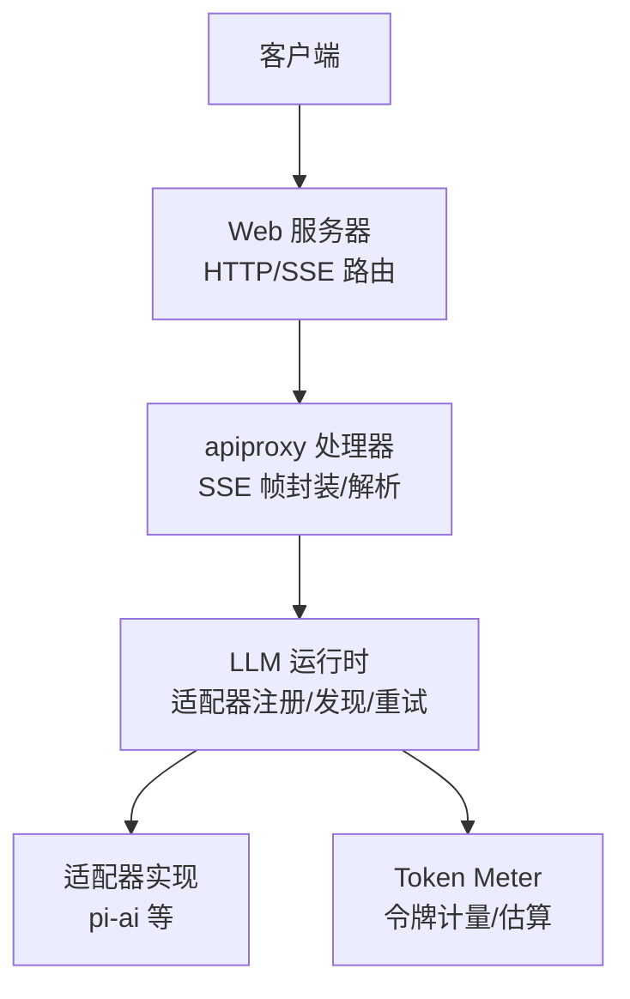
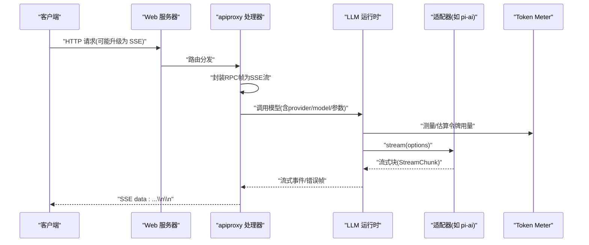
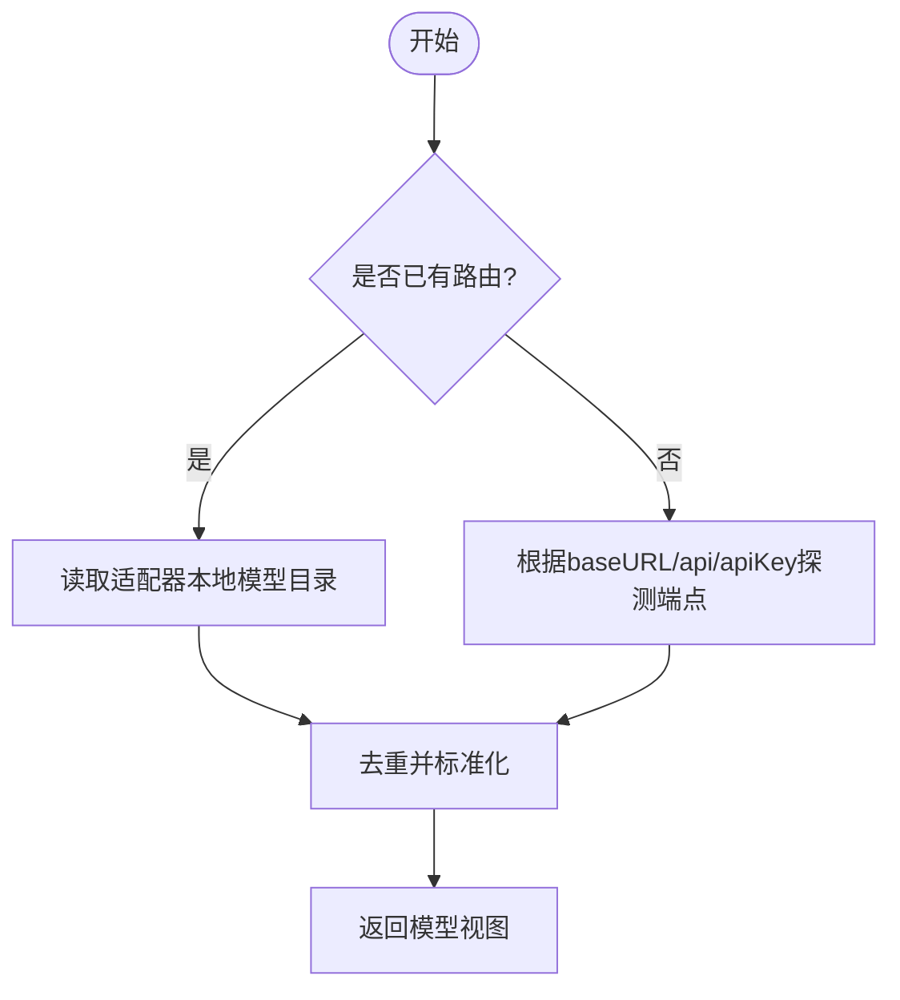
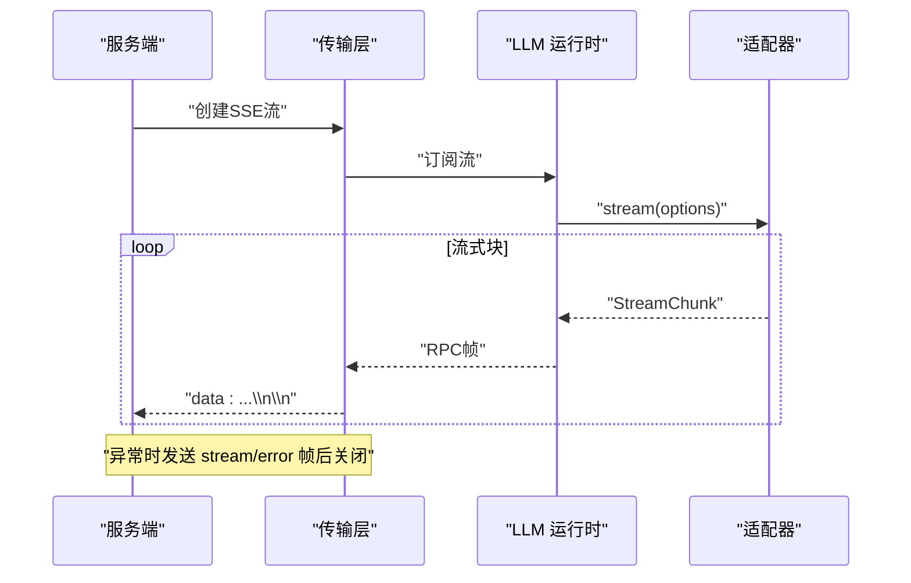
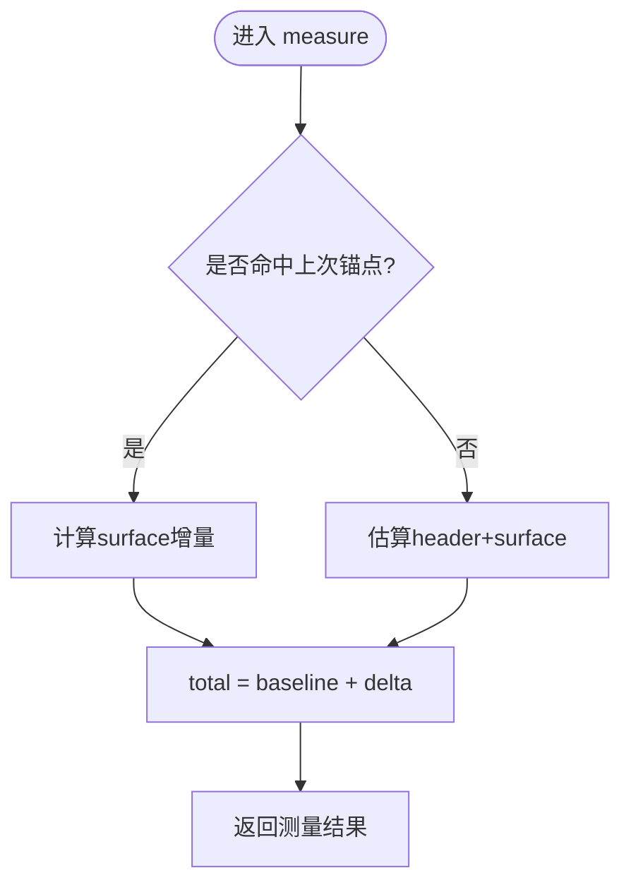
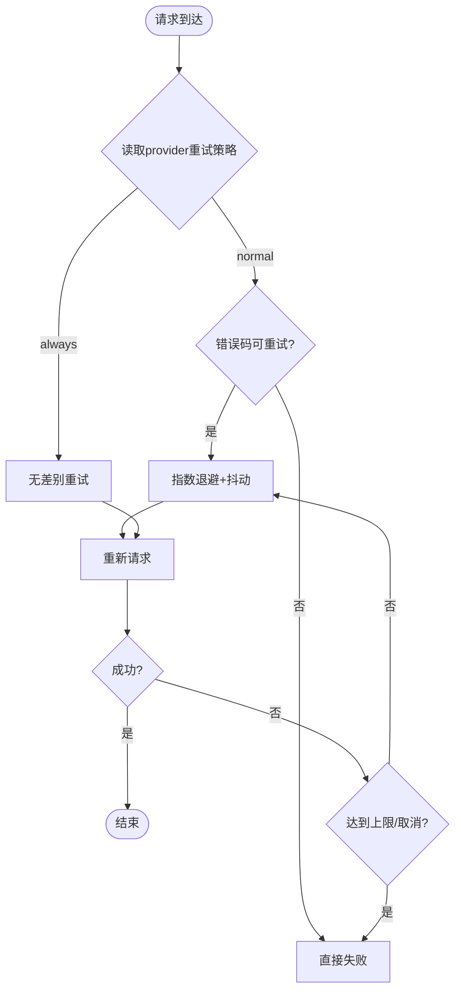
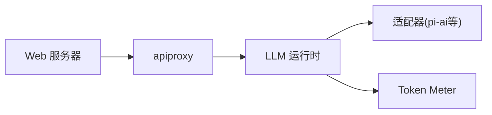

# LLM 集成 API

<cite>
**本文引用的文件**
- [packages/host/apiproxy/src/api/llm.ts](file://packages/host/apiproxy/src/api/llm.ts)
- [packages/llm/llm/src/index.ts](file://packages/llm/llm/src/index.ts)
- [packages/llm/llm/src/retry-policy.ts](file://packages/llm/llm/src/retry-policy.ts)
- [packages/llm/token-meter/src/index.ts](file://packages/llm/token-meter/src/index.ts)
- [packages/llm/token-meter/src/estimate.ts](file://packages/llm/token-meter/src/estimate.ts)
- [packages/host/webserver/src/index.ts](file://packages/host/webserver/src/index.ts)
- [packages/host/apiproxy/src/fetch/handler.ts](file://packages/host/apiproxy/src/fetch/handler.ts)
- [packages/host/apiproxy/src/fetch/client.ts](file://packages/host/apiproxy/src/fetch/client.ts)
- [packages/llm/llm-pi-ai/src/config.ts](file://packages/llm/llm-pi-ai/src/config.ts)
- [packages/core/agent-default-model/src/index.ts](file://packages/core/agent-default-model/src/index.ts)
</cite>

## 目录
1. [简介](#简介)
2. [项目结构](#项目结构)
3. [核心组件](#核心组件)
4. [架构总览](#架构总览)
5. [详细组件分析](#详细组件分析)
6. [依赖关系分析](#依赖关系分析)
7. [性能与成本](#性能与成本)
8. [故障排查](#故障排查)
9. [结论](#结论)
10. [附录：请求与响应示例](#附录请求与响应示例)

## 简介
本文件面向需要集成大语言模型（LLM）的开发者，系统化文档化本仓库中的“LLM 集成相关 RESTful/SSE 接口”与周边能力。内容覆盖：
- 模型提供商配置、连接管理与路由发现
- 文本生成、代码生成、多模态输入等调用方式
- 流式响应处理、令牌计数与成本控制
- 模型切换、负载均衡与故障转移策略
- 性能调优、缓存策略与监控告警

说明：
- 本仓库通过宿主 Web 服务暴露 HTTP 路由，并通过 apiproxy 以 SSE 协议承载 RPC 帧；LLM 能力由 llm 运行时与适配器提供。
- 本文所有接口行为均基于源码实现进行归纳，不引入未实现的假设。

## 项目结构
围绕 LLM 集成的关键模块与职责：
- 宿主 Web 服务：注册 HTTP 路由与升级通道，统一入口
- apiproxy：将 RPC 方法映射到 HTTP/SSE 传输层，负责流式帧解析与发送
- LLM 运行时：抽象适配器、注册表、模型发现、重试策略、准备与执行流
- Token Meter：会话级令牌计量、估算与压力度量
- pi-ai 适配器配置：模型清单、默认上下文窗口、最大输出、传输模式、超时与重试等



图表来源
- [packages/host/webserver/src/index.ts:24-101](file://packages/host/webserver/src/index.ts#L24-L101)
- [packages/host/apiproxy/src/fetch/handler.ts:199-221](file://packages/host/apiproxy/src/fetch/handler.ts#L199-L221)
- [packages/host/apiproxy/src/fetch/client.ts:362-408](file://packages/host/apiproxy/src/fetch/client.ts#L362-L408)
- [packages/llm/llm/src/index.ts:284-800](file://packages/llm/llm/src/index.ts#L284-L800)
- [packages/llm/token-meter/src/index.ts:74-157](file://packages/llm/token-meter/src/index.ts#L74-L157)

章节来源
- [packages/host/webserver/src/index.ts:24-101](file://packages/host/webserver/src/index.ts#L24-L101)
- [packages/host/apiproxy/src/fetch/handler.ts:199-221](file://packages/host/apiproxy/src/fetch/handler.ts#L199-L221)
- [packages/host/apiproxy/src/fetch/client.ts:362-408](file://packages/host/apiproxy/src/fetch/client.ts#L362-L408)
- [packages/llm/llm/src/index.ts:284-800](file://packages/llm/llm/src/index.ts#L284-L800)
- [packages/llm/token-meter/src/index.ts:74-157](file://packages/llm/token-meter/src/index.ts#L74-L157)

## 核心组件
- LLM 运行时（LlmRuntime）
  - 适配器注册与替换、可配置提供者目录、模型发现、模型元信息解析、调用准备与流式执行、重试策略注入
- apiproxy 传输层
  - 将 RPC 方法映射为 HTTP/SSE 帧；服务端封装流为 SSE，客户端按 '\n\n' 分帧解析并容错
- Web 服务器
  - 精确匹配与前缀匹配的路由表，支持升级通道与回退处理
- Token Meter
  - 会话回放感知，估算与聚合令牌用量，提供表面压力度量
- pi-ai 适配器配置
  - 模型清单、默认上下文窗口、最大输出、传输模式（sse/websocket）、超时、重试策略等

章节来源
- [packages/llm/llm/src/index.ts:174-233](file://packages/llm/llm/src/index.ts#L174-L233)
- [packages/llm/llm/src/index.ts:284-800](file://packages/llm/llm/src/index.ts#L284-L800)
- [packages/host/apiproxy/src/fetch/handler.ts:199-221](file://packages/host/apiproxy/src/fetch/handler.ts#L199-L221)
- [packages/host/apiproxy/src/fetch/client.ts:362-408](file://packages/host/apiproxy/src/fetch/client.ts#L362-L408)
- [packages/host/webserver/src/index.ts:24-101](file://packages/host/webserver/src/index.ts#L24-L101)
- [packages/llm/token-meter/src/index.ts:74-157](file://packages/llm/token-meter/src/index.ts#L74-L157)
- [packages/llm/llm-pi-ai/src/config.ts:229-257](file://packages/llm/llm-pi-ai/src/config.ts#L229-L257)

## 架构总览
下图展示从 HTTP 请求到 LLM 流式响应的端到端流程，包括 SSE 帧封装、LLM 运行时拦截、适配器调用与令牌计量。



图表来源
- [packages/host/webserver/src/index.ts:24-101](file://packages/host/webserver/src/index.ts#L24-L101)
- [packages/host/apiproxy/src/fetch/handler.ts:199-221](file://packages/host/apiproxy/src/fetch/handler.ts#L199-L221)
- [packages/host/apiproxy/src/fetch/client.ts:362-408](file://packages/host/apiproxy/src/fetch/client.ts#L362-L408)
- [packages/llm/llm/src/index.ts:284-800](file://packages/llm/llm/src/index.ts#L284-L800)
- [packages/llm/token-meter/src/index.ts:74-157](file://packages/llm/token-meter/src/index.ts#L74-L157)

## 详细组件分析

### 模型提供商配置与发现
- 可配置提供者目录
  - 通过运行时注册“可配置提供者”，声明 provider、displayName、settingsNs、settingsPath 等，供配置界面合并显示
- 模型发现接口
  - 对外暴露 discoverModels 方法，允许对“草稿配置”的端点进行探测，返回其宣称的模型列表（id/name/contextWindow/maxTokens）
  - 若已存在对应路由，优先走适配器本地注册表，避免网络调用；否则通过 baseURL/api/apiKey 发起探测
- 适配器侧配置
  - pi-ai 适配器支持 models、modelOverrides、defaultContextWindow、defaultMaxTokens、defaultInput、transport、timeoutMs、retryPolicy 等



图表来源
- [packages/host/apiproxy/src/api/llm.ts:51-77](file://packages/host/apiproxy/src/api/llm.ts#L51-L77)
- [packages/llm/llm/src/index.ts:494-559](file://packages/llm/llm/src/index.ts#L494-L559)
- [packages/llm/llm-pi-ai/src/config.ts:229-257](file://packages/llm/llm-pi-ai/src/config.ts#L229-L257)

章节来源
- [packages/host/apiproxy/src/api/llm.ts:14-77](file://packages/host/apiproxy/src/api/llm.ts#L14-L77)
- [packages/llm/llm/src/index.ts:494-559](file://packages/llm/llm/src/index.ts#L494-L559)
- [packages/llm/llm-pi-ai/src/config.ts:229-257](file://packages/llm/llm-pi-ai/src/config.ts#L229-L257)

### 连接管理与流式响应
- 传输层
  - 服务端将 RPC 帧序列化为 SSE，使用 '\n\n' 作为帧边界；客户端按相同规则解析，遇到畸形帧跳过并继续
  - 首次响应头就绪即触发 onOpen，随后逐帧推送
- 适配器流
  - LlmAdapter.stream 是唯一必须实现的方法，返回流式块；运行时负责将其包装为统一的流式事件
- 取消与错误
  - 流式过程遵循 signal 取消；中间失败会发出 stream/error 帧后关闭



图表来源
- [packages/host/apiproxy/src/fetch/handler.ts:199-221](file://packages/host/apiproxy/src/fetch/handler.ts#L199-L221)
- [packages/host/apiproxy/src/fetch/client.ts:362-408](file://packages/host/apiproxy/src/fetch/client.ts#L362-L408)
- [packages/llm/llm/src/index.ts:227-233](file://packages/llm/llm/src/index.ts#L227-L233)

章节来源
- [packages/host/apiproxy/src/fetch/handler.ts:199-221](file://packages/host/apiproxy/src/fetch/handler.ts#L199-L221)
- [packages/host/apiproxy/src/fetch/client.ts:362-408](file://packages/host/apiproxy/src/fetch/client.ts#L362-L408)
- [packages/llm/llm/src/index.ts:227-233](file://packages/llm/llm/src/index.ts#L227-L233)

### 文本生成、代码生成与多模态输入
- 多模态能力
  - 模型元信息包含 inputModalities，用于描述支持的输入类型（如文本、图像等），在能力检查阶段决定是否接受图像等输入
- 推理努力与默认参数
  - 模型可声明 reasoning efforts 及默认 effort；调用前会校验并补齐默认值
- 默认模型选择
  - 可通过默认模型配置指定 provider 与 model，便于上层无需每次显式传入

```mermaid
classDiagram
class LlmResolvedModelInfo {
+string provider
+string id
+string name
+string description?
+ModelModality[] inputModalities?
+number defaultMaxTokens?
+{contextWindow : number}? context
+{efforts[], defaultEffort?} reasoning
}
class LlmCallConfig {
+string provider
+string model
+number maxTokens?
+string reasoningEffort?
}
LlmCallConfig --> LlmResolvedModelInfo : "解析/校验/补齐默认"
```

图表来源
- [packages/llm/llm/src/index.ts:619-718](file://packages/llm/llm/src/index.ts#L619-L718)
- [packages/core/agent-default-model/src/index.ts:40-70](file://packages/core/agent-default-model/src/index.ts#L40-L70)

章节来源
- [packages/llm/llm/src/index.ts:619-718](file://packages/llm/llm/src/index.ts#L619-L718)
- [packages/core/agent-default-model/src/index.ts:40-70](file://packages/core/agent-default-model/src/index.ts#L40-L70)

### 令牌计数与成本控制
- 估算与计量
  - TokenMeter 提供 estimateMessage 估算单条消息的令牌数；measure 结合会话回放与最近一次成功调用的 usage，给出保守的 baseline 与 surfaceDeltaTokens
  - 估算采用固定密度启发式（字符/令牌比、块开销、角色字段开销）
- 成本控制建议
  - 设置合理的 maxTokens 与默认上下文窗口
  - 利用 inputModalities 限制不必要的多模态输入
  - 结合 retryPolicy 控制重试带来的额外消耗



图表来源
- [packages/llm/token-meter/src/index.ts:100-157](file://packages/llm/token-meter/src/index.ts#L100-L157)
- [packages/llm/token-meter/src/estimate.ts:1-19](file://packages/llm/token-meter/src/estimate.ts#L1-L19)

章节来源
- [packages/llm/token-meter/src/index.ts:100-157](file://packages/llm/token-meter/src/index.ts#L100-L157)
- [packages/llm/token-meter/src/estimate.ts:1-19](file://packages/llm/token-meter/src/estimate.ts#L1-L19)

### 模型切换、负载均衡与故障转移
- 模型切换
  - 通过 prepareCall/resolveCallConfig 完成能力校验与默认补齐；可在上游动态选择不同 provider/model
- 负载均衡
  - 当前实现未内置跨提供者的自动负载均衡；可通过外部调度器轮询多个 provider 实例
- 故障转移与重试
  - 每个 provider 可声明 retryPolicy（normal/always），支持指数退避与抖动；normal 模式仅对可重试错误码重试，always 模式对所有失败重试直至成功或取消
  - 适配器注册支持原子替换，便于热更新路由集合



图表来源
- [packages/llm/llm/src/retry-policy.ts:14-191](file://packages/llm/llm/src/retry-policy.ts#L14-L191)
- [packages/llm/llm/src/index.ts:338-413](file://packages/llm/llm/src/index.ts#L338-L413)

章节来源
- [packages/llm/llm/src/retry-policy.ts:14-191](file://packages/llm/llm/src/retry-policy.ts#L14-L191)
- [packages/llm/llm/src/index.ts:338-413](file://packages/llm/llm/src/index.ts#L338-L413)

## 依赖关系分析
- Web 服务器提供路由注册与回退处理，apiproxy 在其之上实现 RPC/SSE 桥接
- LLM 运行时集中管理适配器、目录、发现与重试策略，向上暴露统一接口
- Token Meter 通过会话事件回放与估算，为上层提供令牌计量与压力指标
- pi-ai 适配器配置驱动具体模型清单与传输细节



图表来源
- [packages/host/webserver/src/index.ts:24-101](file://packages/host/webserver/src/index.ts#L24-L101)
- [packages/host/apiproxy/src/fetch/handler.ts:199-221](file://packages/host/apiproxy/src/fetch/handler.ts#L199-L221)
- [packages/llm/llm/src/index.ts:284-800](file://packages/llm/llm/src/index.ts#L284-L800)
- [packages/llm/token-meter/src/index.ts:74-157](file://packages/llm/token-meter/src/index.ts#L74-L157)

章节来源
- [packages/host/webserver/src/index.ts:24-101](file://packages/host/webserver/src/index.ts#L24-L101)
- [packages/host/apiproxy/src/fetch/handler.ts:199-221](file://packages/host/apiproxy/src/fetch/handler.ts#L199-L221)
- [packages/llm/llm/src/index.ts:284-800](file://packages/llm/llm/src/index.ts#L284-L800)
- [packages/llm/token-meter/src/index.ts:74-157](file://packages/llm/token-meter/src/index.ts#L74-L157)

## 性能与成本
- 流式传输
  - 使用 SSE 帧与 '\n\n' 分界，客户端对畸形帧容错，保证长连接稳定性
- 令牌估算
  - 采用固定密度启发式，避免昂贵 tokenization；在可用 provider usage 时回退为更精确的 baseline
- 重试与退避
  - 指数退避与抖动降低突发流量冲击；normal 模式限定可重试错误码，减少无效重试
- 传输与超时
  - 可配置 transport（sse/websocket/websocket-cached/auto）、timeoutMs、websocketConnectTimeoutMs、streamIdleTimeoutMs，按需优化延迟与资源占用
- 缓存策略
  - 会话投影缓存支持阈值与定时刷写，保障持久化与一致性

章节来源
- [packages/host/apiproxy/src/fetch/client.ts:362-408](file://packages/host/apiproxy/src/fetch/client.ts#L362-L408)
- [packages/llm/token-meter/src/index.ts:100-157](file://packages/llm/token-meter/src/index.ts#L100-L157)
- [packages/llm/llm/src/retry-policy.ts:14-191](file://packages/llm/llm/src/retry-policy.ts#L14-L191)
- [packages/llm/llm-pi-ai/src/config.ts:229-257](file://packages/llm/llm-pi-ai/src/config.ts#L229-L257)

## 故障排查
- 常见错误码
  - 认证/凭据：INVALID_CREDENTIAL_CODE
  - 空响应：EMPTY_RESPONSE_CODE
  - 其他：RATE_LIMIT、SERVER、TIMEOUT、TRANSPORT（可配置为可重试）
- 诊断要点
  - 检查 API Key 是否为空白或不可携带字符
  - 确认 provider 与 model 是否存在且具备所需 inputModalities
  - 观察重试策略与退避是否合理
  - 关注 SSE 流中 stream/error 帧的错误码与消息

章节来源
- [packages/llm/llm/src/index.ts:69-117](file://packages/llm/llm/src/index.ts#L69-L117)
- [packages/llm/llm/src/retry-policy.ts:14-191](file://packages/llm/llm/src/retry-policy.ts#L14-L191)
- [packages/host/apiproxy/src/fetch/handler.ts:199-221](file://packages/host/apiproxy/src/fetch/handler.ts#L199-L221)

## 结论
本仓库提供了完整的 LLM 集成基础设施：通过 Web 服务器与 apiproxy 暴露稳定的 HTTP/SSE 接口，LLM 运行时统一管理适配器、模型发现与重试策略，Token Meter 提供令牌计量与压力度量。结合 pi-ai 适配器的丰富配置项，可实现文本、代码与多模态的统一接入，并支持灵活的模型切换与故障恢复。

## 附录：请求与响应示例
以下为典型调用流程的示意性示例（以文字描述为主，避免粘贴具体代码片段）。

- 文本生成（流式）
  - 请求：POST /api/...（由上层定义），携带 provider、model、messages、maxTokens、reasoningEffort 等
  - 响应：SSE 流，逐帧推送 assistant/chunk；结束时推送 assistant/message 汇总
  - 参考路径
    - [packages/host/apiproxy/src/fetch/handler.ts:199-221](file://packages/host/apiproxy/src/fetch/handler.ts#L199-L221)
    - [packages/host/apiproxy/src/fetch/client.ts:362-408](file://packages/host/apiproxy/src/fetch/client.ts#L362-L408)
    - [packages/llm/llm/src/index.ts:227-233](file://packages/llm/llm/src/index.ts#L227-L233)

- 代码生成（带工具调用）
  - 请求：同上，messages 中包含 tool-call/tool-result 等结构化内容
  - 响应：流式 chunk 与工具调用结果逐步返回
  - 参考路径
    - [packages/llm/token-meter/tests/token-meter.spec.ts:125-146](file://packages/llm/token-meter/tests/token-meter.spec.ts#L125-L146)

- 多模态输入（文本+图像）
  - 请求：messages 中包含图像内容块；需确保模型 inputModalities 支持图像
  - 响应：流式文本与可能的工具调用结果
  - 参考路径
    - [packages/llm/llm/src/index.ts:619-718](file://packages/llm/llm/src/index.ts#L619-L718)

- 模型发现（新增提供商）
  - 请求：discoverModels(settingsNs, provider?, baseURL?, api?, apiKey?)
  - 响应：models[]（id/name/contextWindow/maxTokens）
  - 参考路径
    - [packages/host/apiproxy/src/api/llm.ts:51-77](file://packages/host/apiproxy/src/api/llm.ts#L51-L77)
    - [packages/llm/llm/src/index.ts:494-559](file://packages/llm/llm/src/index.ts#L494-L559)

- 令牌计量与成本控制
  - 估算：estimateMessage(message)
  - 会话度量：measure(session, requestHeader?)
  - 参考路径
    - [packages/llm/token-meter/src/index.ts:100-157](file://packages/llm/token-meter/src/index.ts#L100-L157)
    - [packages/llm/token-meter/src/estimate.ts:1-19](file://packages/llm/token-meter/src/estimate.ts#L1-L19)