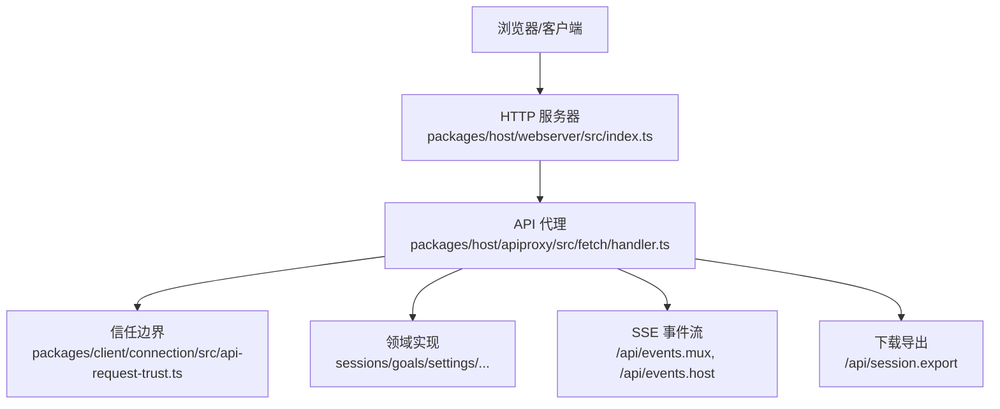
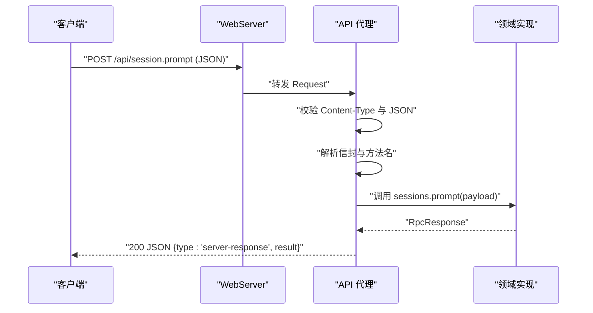
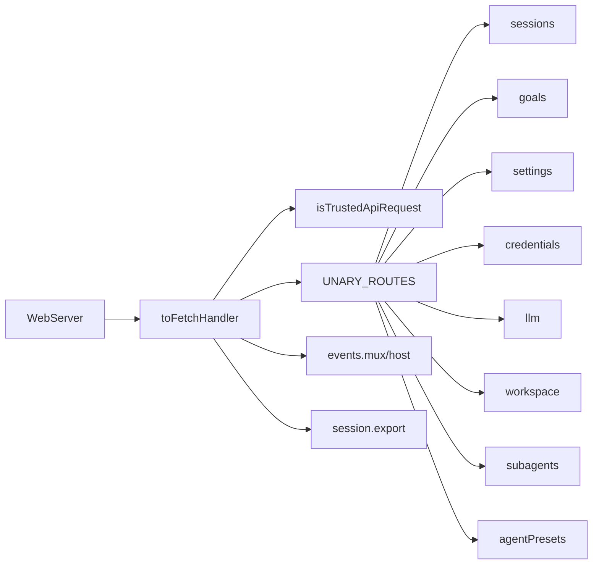

# RESTful API

<cite>
**本文引用的文件**
- [packages/host/webserver/src/index.ts](file://packages/host/webserver/src/index.ts)
- [packages/host/apiproxy/src/fetch/handler.ts](file://packages/host/apiproxy/src/fetch/handler.ts)
- [packages/client/connection/src/api-request-trust.ts](file://packages/client/connection/src/api-request-trust.ts)
- [packages/host/apiproxy/src/api/agent-presets.ts](file://packages/host/apiproxy/src/api/agent-presets.ts)
- [packages/host/apiproxy/src/api/approvals.ts](file://packages/host/apiproxy/src/api/approvals.ts)
- [packages/host/apiproxy/src/api/sessions.schema.ts](file://packages/host/apiproxy/src/api/sessions.schema.ts)
- [packages/host/apiproxy/src/api/goals.schema.ts](file://packages/host/apiproxy/src/api/goals.schema.ts)
- [packages/host/apiproxy/src/api/settings.schema.ts](file://packages/host/apiproxy/src/api/settings.schema.ts)
- [packages/host/apiproxy/src/api/credentials.schema.ts](file://packages/host/apiproxy/src/api/credentials.schema.ts)
- [packages/host/apiproxy/src/api/downloads.schema.ts](file://packages/host/apiproxy/src/api/downloads.schema.ts)
- [packages/host/apiproxy/src/api/subagents.schema.ts](file://packages/host/apiproxy/src/api/subagents.schema.ts)
- [packages/host/apiproxy/src/api/workspace.schema.ts](file://packages/host/apiproxy/src/api/workspace.schema.ts)
- [packages/host/apiproxy/src/api/llm.schema.ts](file://packages/host/apiproxy/src/api/llm.schema.ts)
- [packages/host/apiproxy/src/api/host.schema.ts](file://packages/host/apiproxy/src/api/host.schema.ts)
- [packages/host/apiproxy/src/api/skills.schema.ts](file://packages/host/apiproxy/src/api/skills.schema.ts)
- [packages/host/apiproxy/src/api/jobs.schema.ts](file://packages/host/apiproxy/src/api/jobs.schema.ts)
- [packages/host/apiproxy/src/api/events.schema.ts](file://packages/host/apiproxy/src/api/events.schema.ts)
- [packages/host/apiproxy/src/api/questions.schema.ts](file://packages/host/apiproxy/src/api/questions.schema.ts)
- [packages/host/apiproxy/src/api/downloads.ts](file://packages/host/apiproxy/src/api/downloads.ts)
- [packages/host/apiproxy/src/api/events.ts](file://packages/host/apiproxy/src/api/events.ts)
- [packages/host/apiproxy/src/api/index.ts](file://packages/host/apiproxy/src/api/index.ts)
</cite>

## 目录
1. [简介](#简介)
2. [项目结构](#项目结构)
3. [核心组件](#核心组件)
4. [架构总览](#架构总览)
5. [详细端点文档](#详细端点文档)
6. [依赖关系分析](#依赖关系分析)
7. [性能与速率限制](#性能与速率限制)
8. [故障排查指南](#故障排查指南)
9. [结论](#结论)
10. [附录：客户端集成与最佳实践](#附录客户端集成与最佳实践)

## 简介
本仓库提供面向浏览器的 HTTP 服务器与统一的 /api RPC 桥接层。所有业务功能通过 POST /api/<method> 暴露，方法名以“域.动作”形式组织（如 session.list、session.prompt）。同时提供若干只读 GET/HEAD 通道（事件流、会话导出等）。认证与授权基于 Host 头可信白名单与“特权方法仅本地回环”策略；不实现应用级 Token 鉴权。错误处理采用“载体状态码 + 业务错误体”的双层约定。

## 项目结构
- HTTP 服务器：提供路由注册、升级连接（WebSocket/SSE）与回退处理器。
- API 代理：将 WHATWG Request/Response 映射到宿主 ApiProxy，统一解析请求体、校验载荷、分发到具体领域方法。
- 信任边界：对每个 /api 请求执行 Host 可信检查与跨站标记拒绝，敏感方法强制本地回环。
- 领域契约：各 schema 文件定义请求/响应结构，handler 中按方法名分派。

图表来源
- [packages/host/webserver/src/index.ts:147-214](file://packages/host/webserver/src/index.ts#L147-L214)
- [packages/host/apiproxy/src/fetch/handler.ts:243-318](file://packages/host/apiproxy/src/fetch/handler.ts#L243-L318)
- [packages/client/connection/src/api-request-trust.ts:96-123](file://packages/client/connection/src/api-request-trust.ts#L96-L123)

章节来源
- [packages/host/webserver/src/index.ts:59-214](file://packages/host/webserver/src/index.ts#L59-L214)
- [packages/host/apiproxy/src/fetch/handler.ts:1-321](file://packages/host/apiproxy/src/fetch/handler.ts#L1-L321)

## 核心组件
- WebServer：监听端口、匹配精确/前缀路由、处理升级连接、异常兜底返回 400。
- toFetchHandler：将 ApiProxy 暴露为 fetch 函数，统一处理 /api 请求、SSE 流、导出下载。
- 信任检查：Host 头校验、同源/跨站标记判断、trustedHosts 白名单。
- 领域方法：通过 UNARY_ROUTES 表将路径段映射到具体方法并调用实现。

章节来源
- [packages/host/webserver/src/index.ts:147-214](file://packages/host/webserver/src/index.ts#L147-L214)
- [packages/host/apiproxy/src/fetch/handler.ts:90-143](file://packages/host/apiproxy/src/fetch/handler.ts#L90-L143)
- [packages/client/connection/src/api-request-trust.ts:96-123](file://packages/client/connection/src/api-request-trust.ts#L96-L123)

## 架构总览
- 所有写操作统一为 POST /api/<method>，请求体为 JSON 信封 { type:"client-request", rpcId, method, payload }。
- 读/流式接口使用 GET/HEAD：
  - SSE 事件流：GET /api/events.mux、GET /api/events.host
  - 会话日志导出：GET/HEAD /api/session.export?sessionId=...
- 审批回调：POST /api/respond，携带 client-response 信封。
- 安全边界：
  - 非 application/json 的 POST 一律 415。
  - 未知路径或非 POST 返回 404。
  - 特权方法（如 host.*、settings.*、credentials.*、agentPreset.*、llm.discoverModels）仅允许本地回环访问，否则 403。
  - Host 头必须为回环或 trustedHosts 配置项之一；若携带 sec-fetch-site=cross-site 则拒绝。

图表来源
- [packages/host/apiproxy/src/fetch/handler.ts:273-318](file://packages/host/apiproxy/src/fetch/handler.ts#L273-L318)
- [packages/host/apiproxy/src/fetch/handler.ts:178-192](file://packages/host/apiproxy/src/fetch/handler.ts#L178-L192)

## 详细端点文档

### 通用约定
- 基础路径：/api
- 写操作：POST /api/<method>，Content-Type 必须为 application/json
- 请求体信封：
  - type: "client-request"
  - rpcId: string
  - method: "<domain>.<action>"
  - payload: 由对应 schema 校验
- 成功响应：
  - 200 OK
  - 内容类型：application/json
  - 体：{ type:"server-response", rpcId, result:{ ok:true, value:... } }
- 业务错误：
  - 200 OK
  - 体：{ type:"server-response", rpcId, result:{ ok:false, error:{ code, message, details } } }
- 载体错误：
  - 400：请求体不是合法 JSON
  - 404：未知路径或非 POST（除 SSE/导出）
  - 415：Content-Type 不是 application/json
  - 403：权限不足（如特权方法非本地回环）
  - 500：处理器内部异常

章节来源
- [packages/host/apiproxy/src/fetch/handler.ts:273-318](file://packages/host/apiproxy/src/fetch/handler.ts#L273-L318)
- [packages/host/apiproxy/src/fetch/handler.ts:157-192](file://packages/host/apiproxy/src/fetch/handler.ts#L157-L192)

### 会话管理（session.*）
- 端点：POST /api/session.*
- 方法列表（示例）：
  - session.list：列出会话摘要（updatedAt 倒序）
  - session.search：搜索可见会话的消息片段（最多 20 条，hasMore 指示是否需细化查询）
  - session.create：创建新会话
  - session.history：获取会话历史
  - session.models：列出可用模型
  - session.selectModel：选择当前会话模型
  - session.rename：重命名会话
  - session.fork：复制会话
  - session.prompt：发送提示并启动一轮对话
  - session.attachment：上传附件
  - session.updateQueue：更新队列
  - session.cancel：取消运行中的任务
- 请求体：遵循 sessions.schema.ts 中对应方法的 schema
- 响应：标准 RpcResponse 信封

章节来源
- [packages/host/apiproxy/src/fetch/handler.ts:90-103](file://packages/host/apiproxy/src/fetch/handler.ts#L90-L103)
- [packages/host/apiproxy/src/api/sessions.schema.ts](file://packages/host/apiproxy/src/api/sessions.schema.ts)

### 子智能体（subagent.*）
- 端点：POST /api/subagent.*
- 方法列表：
  - subagent.list：列出子智能体
  - subagent.history：获取子智能体历史
  - subagent.prompt：向子智能体发送提示
  - subagent.interrupt：中断子智能体
- 请求体：遵循 subagents.schema.ts
- 响应：标准 RpcResponse 信封

章节来源
- [packages/host/apiproxy/src/fetch/handler.ts:104-106](file://packages/host/apiproxy/src/fetch/handler.ts#L104-L106)
- [packages/host/apiproxy/src/api/subagents.schema.ts](file://packages/host/apiproxy/src/api/subagents.schema.ts)

### 主机能力（host.*）
- 端点：POST /api/host.*
- 方法列表：
  - host.describe：描述宿主环境
  - host.pickDirectory：选择目录（特权，仅本地回环）
  - host.listDirectory：列出目录（特权，仅本地回环）
  - host.createDirectory：创建目录（特权，仅本地回环）
  - host.openPath：打开路径（特权，仅本地回环）
- 请求体：遵循 host.schema.ts
- 响应：标准 RpcResponse 信封

章节来源
- [packages/host/apiproxy/src/fetch/handler.ts:107-111](file://packages/host/apiproxy/src/fetch/handler.ts#L107-L111)
- [packages/host/apiproxy/src/api/host.schema.ts](file://packages/host/apiproxy/src/api/host.schema.ts)

### 工作区（workspace.*）
- 端点：POST /api/workspace.*
- 方法列表：
  - workspace.list：列出工作区
  - workspace.create：创建工作区
  - workspace.rename：重命名
  - workspace.delete：删除
  - workspace.insertBefore：插入节点
  - workspace.insertSessionBefore：插入会话
  - workspace.archiveSession：归档会话
- 请求体：遵循 workspace.schema.ts
- 响应：标准 RpcResponse 信封

章节来源
- [packages/host/apiproxy/src/fetch/handler.ts:112-118](file://packages/host/apiproxy/src/fetch/handler.ts#L112-L118)
- [packages/host/apiproxy/src/api/workspace.schema.ts](file://packages/host/apiproxy/src/api/workspace.schema.ts)

### 技能（skill.*）
- 端点：POST /api/skill.list
- 请求体：遵循 skills.schema.ts
- 响应：标准 RpcResponse 信封

章节来源
- [packages/host/apiproxy/src/fetch/handler.ts:119](file://packages/host/apiproxy/src/fetch/handler.ts#L119)
- [packages/host/apiproxy/src/api/skills.schema.ts](file://packages/host/apiproxy/src/api/skills.schema.ts)

### 智能体预设（agentPreset.*）
- 端点：POST /api/agentPreset.*
- 方法列表：
  - agentPreset.list：列出部署提供的预设（含 trust、isDefault、broken 原因）
  - agentPreset.select：为空会话选择预设（会话开始后锁定）
  - agentPreset.read：读取预设组成文本（特权，仅本地回环）
  - agentPreset.copy：复制预设（特权，仅本地回环）
  - agentPreset.openDocument：打开本地预设目录（特权，仅本地回环）
  - agentPreset.remove：删除本地预设（特权，仅本地回环）
- 请求体：遵循 agent-presets.schema.ts
- 响应：标准 RpcResponse 信封

章节来源
- [packages/host/apiproxy/src/fetch/handler.ts:120-125](file://packages/host/apiproxy/src/fetch/handler.ts#L120-L125)
- [packages/host/apiproxy/src/api/agent-presets.ts:1-117](file://packages/host/apiproxy/src/api/agent-presets.ts#L1-L117)
- [packages/host/apiproxy/src/api/agent-presets.schema.ts](file://packages/host/apiproxy/src/api/agent-presets.schema.ts)

### 目标（goal.*）
- 端点：POST /api/goal.*
- 方法列表：
  - goal.create、goal.edit、goal.pause、goal.resume、goal.complete、goal.clear
- 请求体：遵循 goals.schema.ts
- 响应：标准 RpcResponse 信封

章节来源
- [packages/host/apiproxy/src/fetch/handler.ts:126-131](file://packages/host/apiproxy/src/fetch/handler.ts#L126-L131)
- [packages/host/apiproxy/src/api/goals.schema.ts](file://packages/host/apiproxy/src/api/goals.schema.ts)

### 设置（settings.*）
- 端点：POST /api/settings.*
- 方法列表：
  - settings.describe、settings.openDocument（特权）、settings.update、settings.replace、settings.mutate
- 请求体：遵循 settings.schema.ts
- 响应：标准 RpcResponse 信封

章节来源
- [packages/host/apiproxy/src/fetch/handler.ts:132-136](file://packages/host/apiproxy/src/fetch/handler.ts#L132-L136)
- [packages/host/apiproxy/src/api/settings.schema.ts](file://packages/host/apiproxy/src/api/settings.schema.ts)

### 凭据（credentials.*）
- 端点：POST /api/credentials.*
- 方法列表：
  - credentials.describe、credentials.set、credentials.unset
- 请求体：遵循 credentials.schema.ts
- 响应：标准 RpcResponse 信封

章节来源
- [packages/host/apiproxy/src/fetch/handler.ts:137-139](file://packages/host/apiproxy/src/fetch/handler.ts#L137-L139)
- [packages/host/apiproxy/src/api/credentials.schema.ts](file://packages/host/apiproxy/src/api/credentials.schema.ts)

### LLM 能力（llm.*）
- 端点：POST /api/llm.*
- 方法列表：
  - llm.providers：列出提供商
  - llm.models：列出模型
  - llm.discoverModels（特权，仅本地回环）
- 请求体：遵循 llm.schema.ts
- 响应：标准 RpcResponse 信封

章节来源
- [packages/host/apiproxy/src/fetch/handler.ts:140-142](file://packages/host/apiproxy/src/fetch/handler.ts#L140-L142)
- [packages/host/apiproxy/src/api/llm.schema.ts](file://packages/host/apiproxy/src/api/llm.schema.ts)

### 作业（jobs.*）
- 端点：POST /api/jobs.*
- 请求体：遵循 jobs.schema.ts
- 响应：标准 RpcResponse 信封

章节来源
- [packages/host/apiproxy/src/api/jobs.schema.ts](file://packages/host/apiproxy/src/api/jobs.schema.ts)

### 问题（questions.*）
- 端点：POST /api/questions.*
- 请求体：遵循 questions.schema.ts
- 响应：标准 RpcResponse 信封

章节来源
- [packages/host/apiproxy/src/api/questions.schema.ts](file://packages/host/apiproxy/src/api/questions.schema.ts)

### 事件流（SSE）
- 端点：
  - GET /api/events.mux
  - GET /api/events.host
- 行为：
  - 返回 text/event-stream，首帧为注释行表示连接建立
  - 服务端持续推送 MuxFrame/HostFrame
  - 客户端可通过 AbortSignal 取消
- 响应：SSE 流，无 JSON 信封

章节来源
- [packages/host/apiproxy/src/fetch/handler.ts:252-259](file://packages/host/apiproxy/src/fetch/handler.ts#L252-L259)
- [packages/host/apiproxy/src/fetch/handler.ts:199-236](file://packages/host/apiproxy/src/fetch/handler.ts#L199-L236)
- [packages/host/apiproxy/src/api/events.schema.ts](file://packages/host/apiproxy/src/api/events.schema.ts)

### 会话导出（下载）
- 端点：GET/HEAD /api/session.export?sessionId=...
- 行为：
  - 校验 sessionId 参数
  - GET：返回二进制流
  - HEAD：仅返回状态码与头部
- 响应：根据实现返回相应内容与类型

章节来源
- [packages/host/apiproxy/src/fetch/handler.ts:260-271](file://packages/host/apiproxy/src/fetch/handler.ts#L260-L271)
- [packages/host/apiproxy/src/api/downloads.schema.ts](file://packages/host/apiproxy/src/api/downloads.schema.ts)
- [packages/host/apiproxy/src/api/downloads.ts](file://packages/host/apiproxy/src/api/downloads.ts)

### 审批回调
- 端点：POST /api/respond
- 行为：
  - 接收 client-response 信封，用于回答之前 server-request 的审批
  - 返回 { accepted: boolean, reason?: string }
- 注意：该端点不走 UNARY_ROUTES 表，直接解析并交由 api.respond

章节来源
- [packages/host/apiproxy/src/fetch/handler.ts:296-300](file://packages/host/apiproxy/src/fetch/handler.ts#L296-L300)
- [packages/host/apiproxy/src/api/approvals.ts:1-22](file://packages/host/apiproxy/src/api/approvals.ts#L1-L22)

## 依赖关系分析
- WebServer 负责监听与路由分发，APIServer（toFetchHandler）在 /api 下统一承载所有 RPC。
- 信任检查在连接层进行，确保只有本地回环或受信任主机可访问 /api。
- 领域方法通过 schema 强约束请求体，避免运行时解析错误扩散。
- SSE 与下载走独立分支，避免被 JSON 信封逻辑干扰。

图表来源
- [packages/host/webserver/src/index.ts:147-214](file://packages/host/webserver/src/index.ts#L147-L214)
- [packages/host/apiproxy/src/fetch/handler.ts:90-143](file://packages/host/apiproxy/src/fetch/handler.ts#L90-L143)
- [packages/client/connection/src/api-request-trust.ts:96-123](file://packages/client/connection/src/api-request-trust.ts#L96-L123)

章节来源
- [packages/host/webserver/src/index.ts:147-214](file://packages/host/webserver/src/index.ts#L147-L214)
- [packages/host/apiproxy/src/fetch/handler.ts:90-143](file://packages/host/apiproxy/src/fetch/handler.ts#L90-L143)
- [packages/client/connection/src/api-request-trust.ts:96-123](file://packages/client/connection/src/api-request-trust.ts#L96-L123)

## 性能与速率限制
- 速率限制：代码库未实现应用级速率限制；建议在上层网关或反向代理处实施。
- 流式传输：SSE 流支持客户端取消，避免无效资源占用。
- 大请求体：当检测到过大请求时，会尽早销毁输入流以避免内存压力。
- 错误隔离：单请求异常不会导致进程退出，统一记录并返回 400。

章节来源
- [packages/host/webserver/src/index.ts:166-179](file://packages/host/webserver/src/index.ts#L166-L179)
- [packages/client/connection/tests/http-bridge.host.spec.ts:1-24](file://packages/client/connection/tests/http-bridge.host.spec.ts#L1-L24)

## 故障排查指南
- 404：路径不存在或使用了非 POST（除 SSE/导出）。检查 URL 与方法。
- 415：Content-Type 不是 application/json。确保写请求设置正确的媒体类型。
- 400：请求体不是合法 JSON。检查 JSON 格式与大小。
- 403：访问了特权方法但来源非本地回环。确认调用方来源或使用本地回环。
- 500：处理器内部异常。查看服务端日志定位具体实现错误。
- SSE 断开：客户端取消或网络异常。重新建立连接并订阅。

章节来源
- [packages/host/apiproxy/src/fetch/handler.ts:273-318](file://packages/host/apiproxy/src/fetch/handler.ts#L273-L318)
- [packages/host/apiproxy/src/fetch/handler.ts:157-192](file://packages/host/apiproxy/src/fetch/handler.ts#L157-L192)

## 结论
本 API 通过统一的 /api 桥接层暴露所有业务功能，结合严格的信任边界与特权方法限制，确保本地安全与可扩展性。读写分离、SSE 流与导出下载满足常见交互场景。建议在部署侧增加速率限制与审计日志，以满足生产要求。

## 附录：客户端集成与最佳实践
- 认证机制
  - 无需 Token；依赖 Host 头可信白名单与本地回环策略。
  - 远程部署需配置 trustedHosts，且确保绑定地址与防火墙策略正确。
- 授权控制
  - 普通方法可在受信任主机上调用。
  - 特权方法（host.*、settings.*、credentials.*、agentPreset.*、llm.discoverModels）仅限本地回环。
- 请求规范
  - 写操作：POST /api/<method>，Content-Type: application/json，信封包含 type/rpcId/method/payload。
  - 读/流：GET/HEAD 特定路径（SSE、导出）。
- 错误处理
  - 区分载体错误（4xx/5xx）与业务错误（200 + result.ok=false）。
  - 对 SSE 流，捕获 stream/error 帧并做重试或降级。
- 速率限制与安全
  - 在网关层实施限流、IP 白名单、请求大小限制。
  - 禁止跨站请求（sec-fetch-site=cross-site 会被拒绝）。
- 客户端示例（概念流程）
  - 发起会话提示：
    - 构造信封并 POST /api/session.prompt
    - 处理 200 成功或业务错误
    - 如需长轮询，订阅 /api/events.mux 获取后续事件
  - 导出会话日志：
    - GET /api/session.export?sessionId=...
    - 保存二进制流为文件

[本节为概念性指导，不直接分析具体文件]