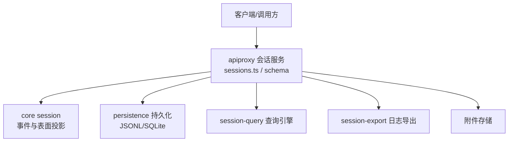
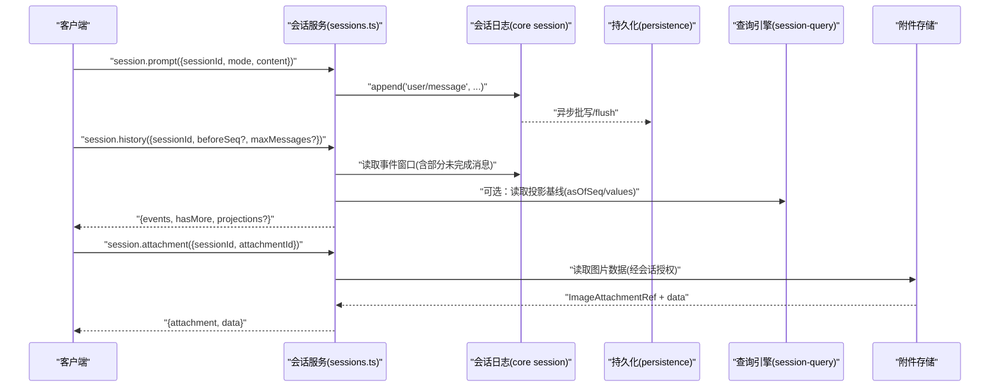
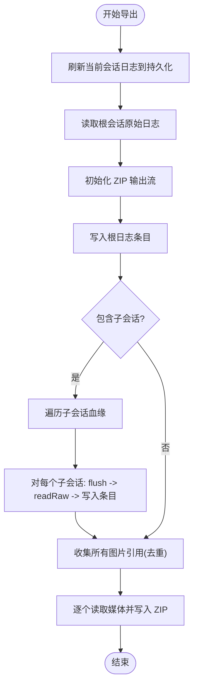
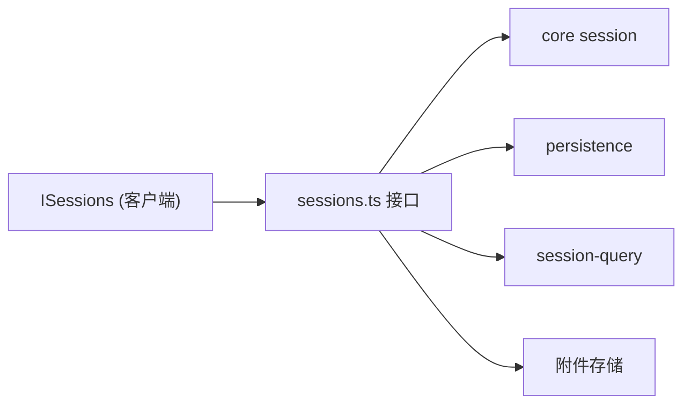

# 会话操作 API

<cite>
**本文引用的文件**
- [packages/host/apiproxy/src/api/sessions.ts](file://packages/host/apiproxy/src/api/sessions.ts)
- [packages/host/apiproxy/src/api/sessions.schema.ts](file://packages/host/apiproxy/src/api/sessions.schema.ts)
- [packages/host/apiproxy/src/api/session-search.ts](file://packages/host/apiproxy/src/api/session-search.ts)
- [packages/client/runtime/src/client/contract/sessions.ts](file://packages/client/runtime/src/client/contract/sessions.ts)
- [packages/host/apiproxy/src/session-export.ts](file://packages/host/apiproxy/src/session-export.ts)
- [docs/subsystems/session.md](file://docs/subsystems/session.md)
- [docs/subsystems/persistence.md](file://docs/subsystems/persistence.md)
- [docs/subsystems/session-query.md](file://docs/subsystems/session-query.md)
</cite>

## 目录
1. [简介](#简介)
2. [项目结构](#项目结构)
3. [核心组件](#核心组件)
4. [架构总览](#架构总览)
5. [详细组件分析](#详细组件分析)
6. [依赖关系分析](#依赖关系分析)
7. [性能考量](#性能考量)
8. [故障排查指南](#故障排查指南)
9. [结论](#结论)
10. [附录](#附录)

## 简介
本文件面向“会话操作”的 RESTful/RPC 接口，覆盖会话的创建、查询、更新、删除（以列表与搜索为主）、消息发送与接收、历史分页、模型选择、队列编辑、取消执行、附件读取与会话导出等能力。文档同时说明会话状态管理、持久化与恢复机制、权限控制、并发访问处理、错误处理策略，以及性能优化建议与最佳实践。

## 项目结构
- 会话域契约与 RPC 方法定义位于 apiproxy 的 sessions.ts；请求/响应 Zod 校验在 sessions.schema.ts。
- 客户端侧对外暴露 ISessions 接口，屏蔽传输细节，提供 open/search/fork 等能力。
- 会话事件模型、表面投影、派生历史与生命周期由 core session 子系统定义。
- 持久化抽象与后端实现由 persistence 子系统提供，支持 JSONL 与 SQLite。
- 会话查询引擎提供跨会话全文检索、过滤、血缘追踪与窗口读取。
- 会话日志导出通过 session-export.ts 流式生成 ZIP，包含子会话与媒体资源。

图表来源
- [packages/host/apiproxy/src/api/sessions.ts:231-373](file://packages/host/apiproxy/src/api/sessions.ts#L231-L373)
- [packages/host/apiproxy/src/api/sessions.schema.ts:101-353](file://packages/host/apiproxy/src/api/sessions.schema.ts#L101-L353)
- [docs/subsystems/session.md:1-125](file://docs/subsystems/session.md#L1-L125)
- [docs/subsystems/persistence.md:1-386](file://docs/subsystems/persistence.md#L1-L386)
- [docs/subsystems/session-query.md:1-496](file://docs/subsystems/session-query.md#L1-L496)
- [packages/host/apiproxy/src/session-export.ts:1-458](file://packages/host/apiproxy/src/session-export.ts#L1-L458)

章节来源
- [packages/host/apiproxy/src/api/sessions.ts:231-373](file://packages/host/apiproxy/src/api/sessions.ts#L231-L373)
- [packages/host/apiproxy/src/api/sessions.schema.ts:101-353](file://packages/host/apiproxy/src/api/sessions.schema.ts#L101-L353)
- [docs/subsystems/session.md:1-125](file://docs/subsystems/session.md#L1-L125)
- [docs/subsystems/persistence.md:1-386](file://docs/subsystems/persistence.md#L1-L386)
- [docs/subsystems/session-query.md:1-496](file://docs/subsystems/session-query.md#L1-L496)
- [packages/host/apiproxy/src/session-export.ts:1-458](file://packages/host/apiproxy/src/session-export.ts#L1-L458)

## 核心组件
- 会话服务接口（RPC）：list、search、create、history、models、selectModel、rename、fork、prompt、attachment、updateQueue、cancel。
- 数据契约与校验：Zod schema 严格约束各端点请求/响应字段、枚举与范围。
- 会话事件与表面：append-only 事件日志、surface 投影、派生消息历史。
- 持久化：flush 检查点、冷/热恢复、崩溃修复、raw artifact 直读。
- 查询引擎：跨会话/单会话全文检索、过滤、血缘、窗口读取。
- 导出：ZIP 流式打包根会话、子会话与媒体引用，背压与取消。

章节来源
- [packages/host/apiproxy/src/api/sessions.ts:231-373](file://packages/host/apiproxy/src/api/sessions.ts#L231-L373)
- [packages/host/apiproxy/src/api/sessions.schema.ts:101-353](file://packages/host/apiproxy/src/api/sessions.schema.ts#L101-L353)
- [docs/subsystems/session.md:194-518](file://docs/subsystems/session.md#L194-L518)
- [docs/subsystems/persistence.md:9-386](file://docs/subsystems/persistence.md#L9-L386)
- [docs/subsystems/session-query.md:103-496](file://docs/subsystems/session-query.md#L103-L496)
- [packages/host/apiproxy/src/session-export.ts:1-458](file://packages/host/apiproxy/src/session-export.ts#L1-L458)

## 架构总览
下图展示一次“发送提示并获取历史”的典型流程：客户端调用 prompt 进入队列或引导模式，服务端将用户消息写入会话事件日志，随后 history 按页返回事件及可选视图信息；若启用投影，尾部页携带最新投影基线。

图表来源
- [packages/host/apiproxy/src/api/sessions.ts:315-373](file://packages/host/apiproxy/src/api/sessions.ts#L315-L373)
- [packages/host/apiproxy/src/api/sessions.schema.ts:287-327](file://packages/host/apiproxy/src/api/sessions.schema.ts#L287-L327)
- [docs/subsystems/session.md:194-518](file://docs/subsystems/session.md#L194-L518)
- [docs/subsystems/persistence.md:9-386](file://docs/subsystems/persistence.md#L9-L386)
- [docs/subsystems/session-query.md:143-218](file://docs/subsystems/session-query.md#L143-L218)

## 详细组件分析

### 会话列表与搜索
- 列表 list：返回持久化会话摘要（updatedAt 降序），v1 暂不实现 cursor。
- 搜索 search：在当前用户可见范围内搜索消息内容，最多返回 20 条结果，无游标；hasMore 指示是否需缩小查询。
- 摘要字段：sessionId、updatedAt、running、blank、parentSessionId、origin、cwd、agentPreset、projections（可选）。

请求/响应要点
- 列表请求：{ cursor?: string }
- 列表响应：{ items: SessionSummary[] }
- 搜索请求：{ query: string }（长度限制、禁止 NUL）
- 搜索响应：{ items: SessionSearchItem[], hasMore: boolean }

示例（示意）
- 请求：POST session.list { cursor: "" }
- 响应：{ items: [{ sessionId: "...", updatedAt: 171..., running: false, blank: true }] }
- 请求：POST session.search { query: "错误处理" }
- 响应：{ items: [{ sessionId: "...", snippet: "..." }], hasMore: false }

章节来源
- [packages/host/apiproxy/src/api/sessions.ts:231-244](file://packages/host/apiproxy/src/api/sessions.ts#L231-L244)
- [packages/host/apiproxy/src/api/sessions.schema.ts:64-99](file://packages/host/apiproxy/src/api/sessions.schema.ts#L64-L99)
- [packages/host/apiproxy/src/api/session-search.ts:1-23](file://packages/host/apiproxy/src/api/session-search.ts#L1-L23)

### 会话创建与分叉
- 创建 create：可指定 workspaceId 或 cwd（二选一），支持预分配 sessionId；失败时返回冲突或工作区附加失败。
- 分叉 fork：从源会话的已完成轮次前缀分叉，atSeq 锚定边界；继承 cwd、最近模型目标与 parentSessionId。

请求/响应要点
- 创建请求：{ workspaceId?, cwd?, sessionId?, agentPreset? }
- 创建响应：{ sessionId, agentPreset? }
- 分叉请求：{ sessionId, atSeq? }
- 分叉响应：{ sessionId }

示例（示意）
- 请求：POST session.create { workspaceId: "w1", sessionId: "s1" }
- 响应：{ sessionId: "s1", agentPreset: "standard" }
- 请求：POST session.fork { sessionId: "s1", atSeq: 42 }
- 响应：{ sessionId: "s2" }

章节来源
- [packages/host/apiproxy/src/api/sessions.ts:246-338](file://packages/host/apiproxy/src/api/sessions.ts#L246-L338)
- [packages/host/apiproxy/src/api/sessions.schema.ts:101-139](file://packages/host/apiproxy/src/api/sessions.schema.ts#L101-L139)

### 历史分页与投影
- 历史 history：按消息边界分页，beforeSeq 向后翻页，maxMessages 限制消息数；尾部页携带未完成的增量 chunk 与可选投影基线。
- 投影基线：asOfSeq 表示值反映到的最后事件 seq；values 为已注册投影单元的当前值快照。

请求/响应要点
- 历史请求：{ sessionId, beforeSeq?, maxMessages? }
- 历史响应：{ events: HistoryEntry[], hasMore: boolean, projections?: { asOfSeq, values } }

示例（示意）
- 请求：POST session.history { sessionId: "s1", beforeSeq: 100, maxMessages: 50 }
- 响应：{ events: [...], hasMore: true, projections: { asOfSeq: 99, values: {...} } }

章节来源
- [packages/host/apiproxy/src/api/sessions.ts:264-283](file://packages/host/apiproxy/src/api/sessions.ts#L264-L283)
- [packages/host/apiproxy/src/api/sessions.schema.ts:141-242](file://packages/host/apiproxy/src/api/sessions.schema.ts#L141-L242)
- [docs/subsystems/session.md:194-357](file://docs/subsystems/session.md#L194-L357)

### 模型目录与选择
- 模型 models：读取会话的模型目录快照（provider/group/model/reasoning）。
- 选择 selectModel：设置会话的精确模型路由与推理强度（如提供）。

请求/响应要点
- 模型请求：{ sessionId }
- 模型响应：{ current, routable, groups, failures }
- 选择请求：{ sessionId, provider, model, reasoningEffort? }
- 选择响应：{ selected }

示例（示意）
- 请求：POST session.models { sessionId: "s1" }
- 响应：{ current: { provider: "openai", model: "gpt-4o" }, routable: true, groups: [...], failures: [] }
- 请求：POST session.selectModel { sessionId: "s1", provider: "openai", model: "gpt-4o", reasoningEffort: "high" }
- 响应：{ selected: { provider: "openai", model: "gpt-4o", reasoningEffort: "high" } }

章节来源
- [packages/host/apiproxy/src/api/sessions.ts:285-302](file://packages/host/apiproxy/src/api/sessions.ts#L285-L302)
- [packages/host/apiproxy/src/api/sessions.schema.ts:148-268](file://packages/host/apiproxy/src/api/sessions.schema.ts#L148-L268)

### 重命名与会话标题
- 重命名 rename：追加 user/title 事件以固定标题；返回标准化后的标题与事件 seq。

请求/响应要点
- 重命名请求：{ sessionId, title: string }
- 重命名响应：{ title: string, seq: number }

示例（示意）
- 请求：POST session.rename { sessionId: "s1", title: "数据分析任务" }
- 响应：{ title: "数据分析任务", seq: 123 }

章节来源
- [packages/host/apiproxy/src/api/sessions.ts:304-313](file://packages/host/apiproxy/src/api/sessions.ts#L304-L313)
- [packages/host/apiproxy/src/api/sessions.schema.ts:118-128](file://packages/host/apiproxy/src/api/sessions.schema.ts#L118-L128)

### 消息发送、队列编辑与取消
- 提示 prompt：发送文本与临时图片；mode=queue 入队，mode=steer 引导；首个以“/”开头的纯文本块作为斜杠命令执行。
- 队列编辑 updateQueue：编辑、移除或严格引导待处理队列项。
- 取消 cancel：停止当前活跃轮次，保留待处理收件箱工作。

请求/响应要点
- 提示请求：{ sessionId, mode: 'queue'|'steer', content: PromptContentPart[], clientTimeZone? }
- 提示响应：{ accepted: true, command?: { kind: 'success', text? } }
- 队列编辑请求：{ sessionId, itemId, action: { edit|remove|steer } }
- 队列编辑响应：{ accepted: true }
- 取消请求：{ sessionId }
- 取消响应：{ accepted: true }

示例（示意）
- 请求：POST session.prompt { sessionId: "s1", mode: "queue", content: [{ type: "text", text: "请分析数据" }] }
- 响应：{ accepted: true }
- 请求：POST session.updateQueue { sessionId: "s1", itemId: "m1", action: { kind: "edit", content: [...] } }
- 响应：{ accepted: true }
- 请求：POST session.cancel { sessionId: "s1" }
- 响应：{ accepted: true }

章节来源
- [packages/host/apiproxy/src/api/sessions.ts:315-371](file://packages/host/apiproxy/src/api/sessions.ts#L315-L371)
- [packages/host/apiproxy/src/api/sessions.schema.ts:270-353](file://packages/host/apiproxy/src/api/sessions.schema.ts#L270-L353)

### 附件读取
- 附件 attachment：在证明该会话日志引用了附件 id 后，读取一张持久化图片。

请求/响应要点
- 附件请求：{ sessionId, attachmentId }
- 附件响应：{ attachment: ImageAttachmentRef, data: string }

示例（示意）
- 请求：POST session.attachment { sessionId: "s1", attachmentId: "att_abc" }
- 响应：{ attachment: { attachmentId: "att_abc", mediaType: "image/png", bytes: 12345, width: 800, height: 600 }, data: "base64..." }

章节来源
- [packages/host/apiproxy/src/api/sessions.ts:355-357](file://packages/host/apiproxy/src/api/sessions.ts#L355-L357)
- [packages/host/apiproxy/src/api/sessions.schema.ts:304-327](file://packages/host/apiproxy/src/api/sessions.schema.ts#L304-L327)

### 会话导出（ZIP 流）
- 导出功能：流式生成 ZIP，包含根会话原始日志、所有子会话日志与所有被引用的媒体对象；使用 fflate 压缩，具备背压与取消。
- 路径规则：根日志 session.jsonl；子会话 subagents/<id>/<filename>；媒体 media/<attachmentId>.ext。

图表来源
- [packages/host/apiproxy/src/session-export.ts:65-266](file://packages/host/apiproxy/src/session-export.ts#L65-L266)
- [packages/host/apiproxy/src/session-export.ts:388-458](file://packages/host/apiproxy/src/session-export.ts#L388-L458)

章节来源
- [packages/host/apiproxy/src/session-export.ts:1-458](file://packages/host/apiproxy/src/session-export.ts#L1-L458)

## 依赖关系分析
- 会话服务依赖 core session 的事件日志与表面投影，用于历史与派生历史。
- 依赖 persistence 进行持久化、冷/热恢复与 raw artifact 读取。
- 依赖 session-query 进行全文检索、过滤、血缘与窗口读取。
- 依赖附件存储进行图片读取与导出。
- 客户端通过 ISessions 统一访问会话能力，屏蔽传输细节。

图表来源
- [packages/host/apiproxy/src/api/sessions.ts:231-373](file://packages/host/apiproxy/src/api/sessions.ts#L231-L373)
- [packages/client/runtime/src/client/contract/sessions.ts:25-130](file://packages/client/runtime/src/client/contract/sessions.ts#L25-L130)
- [docs/subsystems/session.md:194-518](file://docs/subsystems/session.md#L194-L518)
- [docs/subsystems/persistence.md:9-386](file://docs/subsystems/persistence.md#L9-L386)
- [docs/subsystems/session-query.md:103-496](file://docs/subsystems/session-query.md#L103-L496)

章节来源
- [packages/host/apiproxy/src/api/sessions.ts:231-373](file://packages/host/apiproxy/src/api/sessions.ts#L231-L373)
- [packages/client/runtime/src/client/contract/sessions.ts:25-130](file://packages/client/runtime/src/client/contract/sessions.ts#L25-L130)
- [docs/subsystems/session.md:194-518](file://docs/subsystems/session.md#L194-L518)
- [docs/subsystems/persistence.md:9-386](file://docs/subsystems/persistence.md#L9-L386)
- [docs/subsystems/session-query.md:103-496](file://docs/subsystems/session-query.md#L103-L496)

## 性能考量
- 历史分页：按消息边界切分，避免截断消息；使用 beforeSeq 与 maxMessages 控制负载。
- 投影基线：仅在尾部页返回，减少冗余；asOfSeq 便于客户端合并更新。
- 持久化批写：后台批量写入，显式 flush 作为检查点，避免阻塞主循环。
- 导出 ZIP：流式压缩与背压控制，限制内存占用；取消传播至生产者与消费者。
- 搜索限制：搜索结果上限与片段长度限制，防止过大响应。

章节来源
- [packages/host/apiproxy/src/api/sessions.ts:264-283](file://packages/host/apiproxy/src/api/sessions.ts#L264-L283)
- [packages/host/apiproxy/src/api/session-search.ts:1-23](file://packages/host/apiproxy/src/api/session-search.ts#L1-L23)
- [docs/subsystems/persistence.md:9-386](file://docs/subsystems/persistence.md#L9-L386)
- [packages/host/apiproxy/src/session-export.ts:268-458](file://packages/host/apiproxy/src/session-export.ts#L268-L458)

## 故障排查指南
- 参数校验失败：Zod schema 会拒绝非法字段、越界数值、NUL 字符等；检查请求体是否符合 schema。
- 会话不存在/不可用：列表/历史/模型等操作可能因会话不存在或代理忙而失败；确认会话存在且未被占用。
- 模型目录失败：提供商查找失败会记录 failures；检查提供商可用性与配置。
- 附件读取失败：确保会话日志确实引用了附件 id；检查附件存储可用性。
- 导出中断：取消信号会终止压缩与读取；检查网络与客户端取消行为。
- 持久化异常：flush 失败会报告错误；检查后端健康与磁盘空间。

章节来源
- [packages/host/apiproxy/src/api/sessions.schema.ts:64-353](file://packages/host/apiproxy/src/api/sessions.schema.ts#L64-L353)
- [docs/subsystems/persistence.md:9-386](file://docs/subsystems/persistence.md#L9-L386)
- [packages/host/apiproxy/src/session-export.ts:388-458](file://packages/host/apiproxy/src/session-export.ts#L388-L458)

## 结论
本 API 围绕会话的全生命周期提供完整能力：创建、查询、历史分页、消息发送与队列管理、模型选择、附件读取与导出。结合事件溯源、持久化与查询引擎，系统在保证一致性的同时具备良好的可扩展性与性能表现。建议在生产中合理使用分页与投影、显式 flush、搜索限制与导出背压，以获得稳定高效的体验。

## 附录

### 端点清单与示例（示意）
- 列表
  - POST session.list
  - 请求：{ cursor?: string }
  - 响应：{ items: SessionSummary[] }
- 搜索
  - POST session.search
  - 请求：{ query: string }
  - 响应：{ items: SessionSearchItem[], hasMore: boolean }
- 创建
  - POST session.create
  - 请求：{ workspaceId?, cwd?, sessionId?, agentPreset? }
  - 响应：{ sessionId, agentPreset? }
- 历史
  - POST session.history
  - 请求：{ sessionId, beforeSeq?, maxMessages? }
  - 响应：{ events: HistoryEntry[], hasMore: boolean, projections? }
- 模型
  - POST session.models
  - 请求：{ sessionId }
  - 响应：{ current, routable, groups, failures }
- 选择模型
  - POST session.selectModel
  - 请求：{ sessionId, provider, model, reasoningEffort? }
  - 响应：{ selected }
- 重命名
  - POST session.rename
  - 请求：{ sessionId, title: string }
  - 响应：{ title: string, seq: number }
- 提示
  - POST session.prompt
  - 请求：{ sessionId, mode: 'queue'|'steer', content: PromptContentPart[], clientTimeZone? }
  - 响应：{ accepted: true, command? }
- 附件
  - POST session.attachment
  - 请求：{ sessionId, attachmentId }
  - 响应：{ attachment: ImageAttachmentRef, data: string }
- 队列编辑
  - POST session.updateQueue
  - 请求：{ sessionId, itemId, action: { edit|remove|steer } }
  - 响应：{ accepted: true }
- 取消
  - POST session.cancel
  - 请求：{ sessionId }
  - 响应：{ accepted: true }

章节来源
- [packages/host/apiproxy/src/api/sessions.ts:231-373](file://packages/host/apiproxy/src/api/sessions.ts#L231-L373)
- [packages/host/apiproxy/src/api/sessions.schema.ts:64-353](file://packages/host/apiproxy/src/api/sessions.schema.ts#L64-L353)