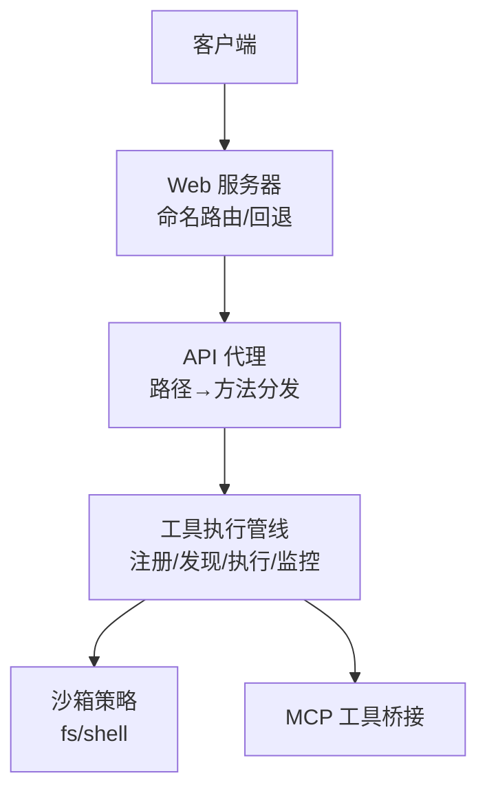
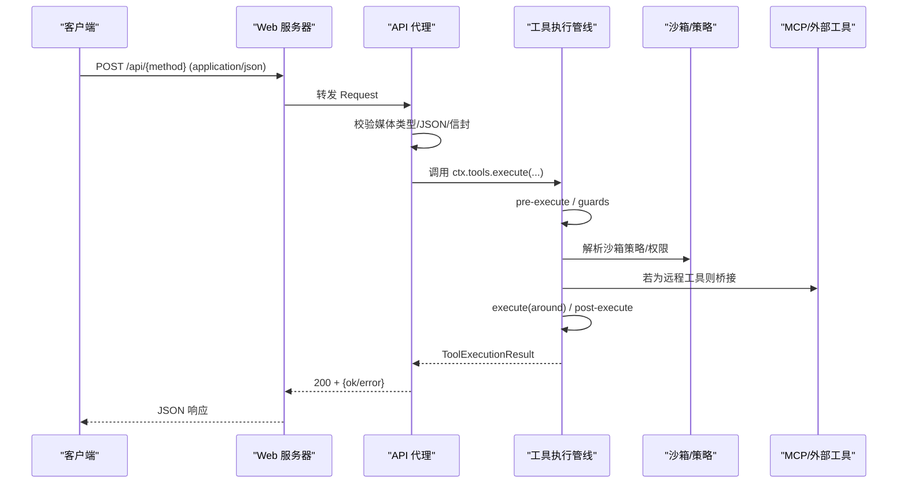
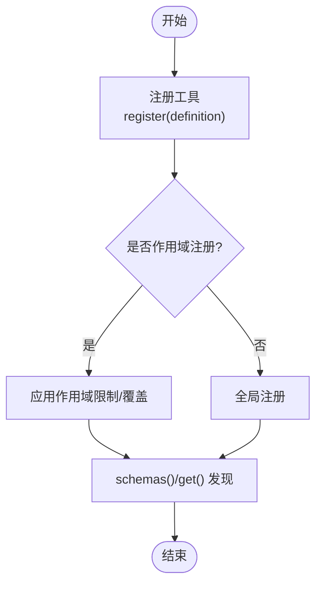
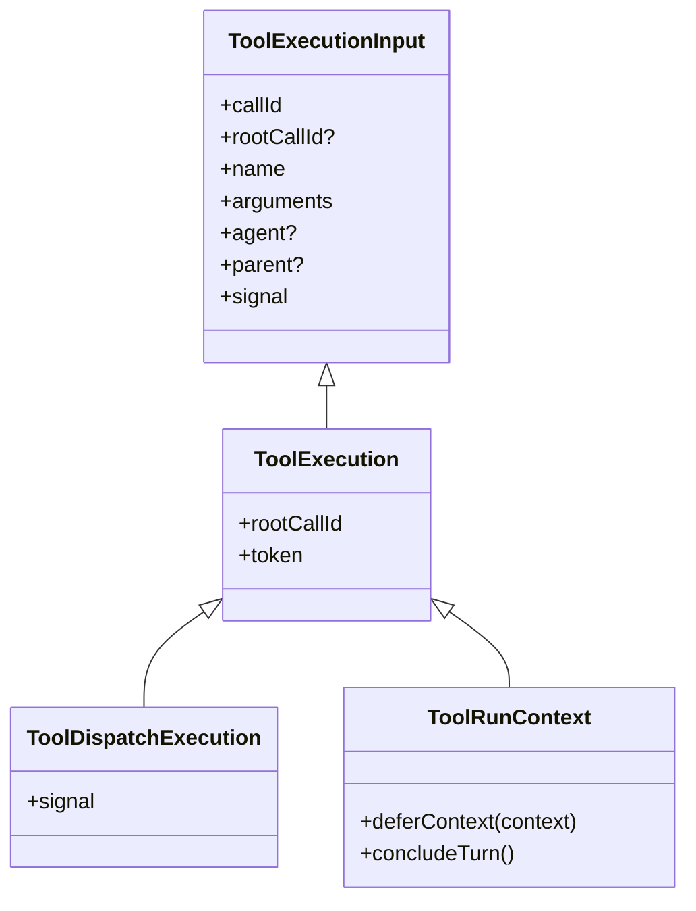
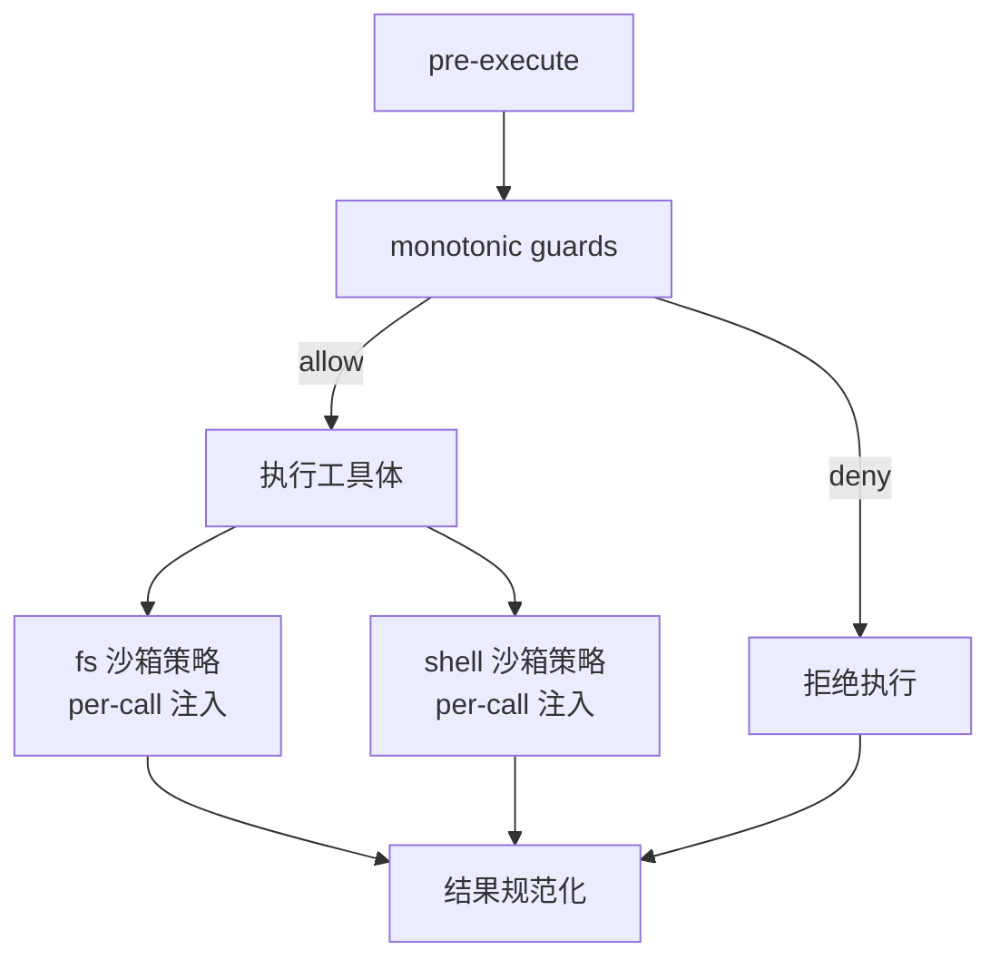
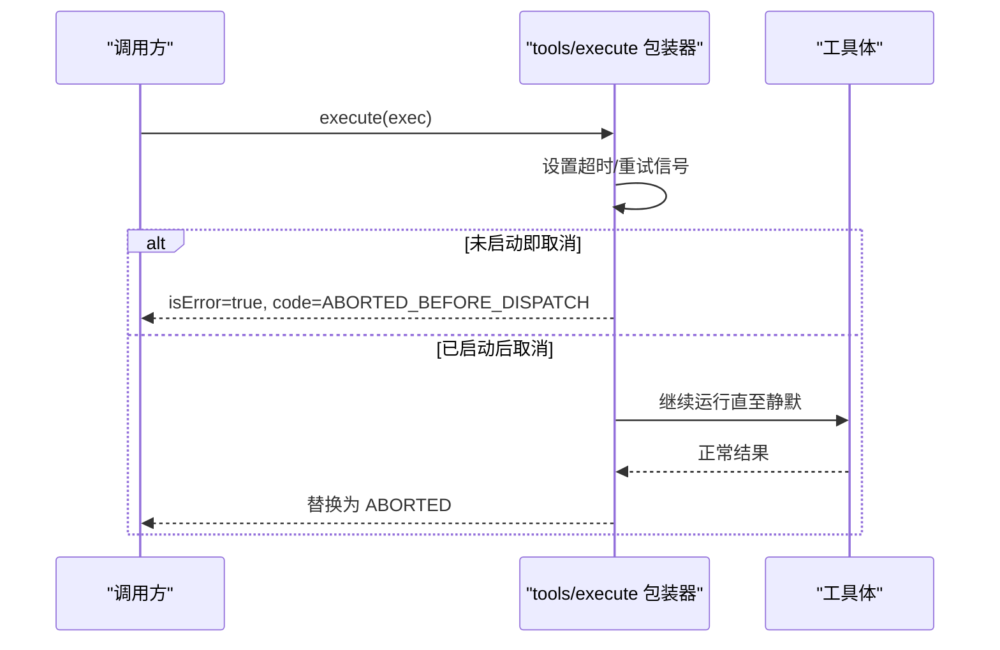
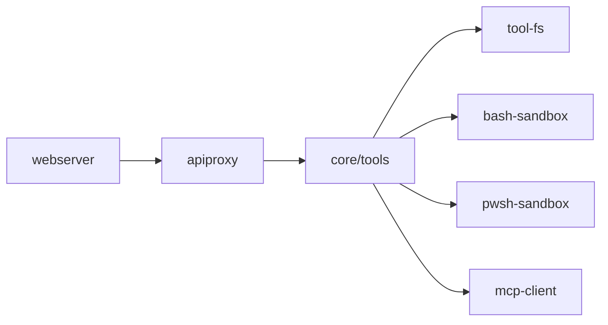

# 工具执行 API

<cite>
**本文引用的文件**
- [packages/host/apiproxy/src/fetch/handler.ts](file://packages/host/apiproxy/src/fetch/handler.ts)
- [packages/core/tools/src/index.ts](file://packages/core/tools/src/index.ts)
- [docs/subsystems/tools.md](file://docs/subsystems/tools.md)
- [docs/tool-execution-pipeline.md](file://docs/tool-execution-pipeline.md)
- [packages/host/webserver/src/index.ts](file://packages/host/webserver/src/index.ts)
- [docs/subsystems/web-server.md](file://docs/subsystems/web-server.md)
- [packages/shell/bash-sandbox/src/index.ts](file://packages/shell/bash-sandbox/src/index.ts)
- [packages/shell/pwsh-sandbox/src/index.ts](file://packages/shell/pwsh-sandbox/src/index.ts)
- [packages/fs/tool-fs/src/sandbox.ts](file://packages/fs/tool-fs/src/sandbox.ts)
- [packages/mcp/mcp-client/src/tools.ts](file://packages/mcp/mcp-client/src/tools.ts)
- [packages/core/tools/tests/tools.spec.ts](file://packages/core/tools/tests/tools.spec.ts)
</cite>

## 目录
1. [简介](#简介)
2. [项目结构](#项目结构)
3. [核心组件](#核心组件)
4. [架构总览](#架构总览)
5. [详细组件分析](#详细组件分析)
6. [依赖关系分析](#依赖关系分析)
7. [性能与可观测性](#性能与可观测性)
8. [故障排查指南](#故障排查指南)
9. [结论](#结论)
10. [附录：API 参考与示例](#附录api-参考与示例)

## 简介
本文件面向“工具执行”的 RESTful API 与内部执行管线，覆盖工具的注册、发现、调用与执行监控。文档说明参数校验、执行上下文传递、结果返回机制；并给出沙箱隔离、资源限制与安全控制要点。同时提供同步调用、异步执行（SSE）与流式响应的请求/响应示例，以及权限控制、错误重试、超时处理、性能监控、日志记录与故障排查指南。

## 项目结构
- HTTP 入口与路由
  - Web 服务器提供命名路由注册与单一回退处理器，所有 /api/* 请求由 API 代理统一解析为方法名并分发到具体实现。
  - API 代理将路径映射为 RPC 方法，对非 JSON 或非法路径进行载体层错误处理，业务错误以 200 + 结构化错误返回。
- 工具执行管线
  - 工具注册、参数 Schema 校验、预执行水线（pre-execute）、单调守卫（guards）、环绕调度（execute）、后置处理（post-execute）、最终内容收尾（finalizeContent）、结果事件（result）。
- 沙箱与权限
  - 文件系统沙箱策略按调用会话解析，支持模式提升与拒绝标记；Shell 沙箱在 resolve 阶段注入每调用策略。
- 外部工具桥接
  - MCP 客户端拉取远程工具列表并构建本地 ToolDefinition，供工具注册表统一调度。

**图示来源**
- [packages/host/webserver/src/index.ts:24-101](file://packages/host/webserver/src/index.ts#L24-L101)
- [packages/host/apiproxy/src/fetch/handler.ts:90-143](file://packages/host/apiproxy/src/fetch/handler.ts#L90-L143)
- [packages/core/tools/src/index.ts:142-197](file://packages/core/tools/src/index.ts#L142-L197)

**章节来源**
- [packages/host/webserver/src/index.ts:24-101](file://packages/host/webserver/src/index.ts#L24-L101)
- [docs/subsystems/web-server.md:1-25](file://docs/subsystems/web-server.md#L1-L25)
- [packages/host/apiproxy/src/fetch/handler.ts:1-321](file://packages/host/apiproxy/src/fetch/handler.ts#L1-L321)

## 核心组件
- 工具定义与注册
  - ToolDefinition 包含模型可见的 schema、输出契约、execute 执行函数、可选 finalizeContent、timeoutMs、isConcurrencySafe、presentCall/presentResult。
  - schemas() 仅暴露模型可见字段，不泄露执行回调。
- 执行管线与水线
  - pre-execute：允许/拒绝/询问（审批），支持作用域过滤。
  - guards：单调守卫，只能拒绝不能放行。
  - execute：围绕调度的水线，用于超时、重试、指标等。
  - post-execute：接受/替换/阻断/附加上下文。
  - finalizeContent：最后的内容不变量检查。
  - result：不可变、冻结的最终结果观察点。
- 执行上下文
  - ToolExecutionInput → ToolExecution（加入 token/rootCallId）→ ToolDispatchExecution（signal 可变视图）。
  - ToolRunContext 提供 deferContext/concludeTurn。
- 结果类型
  - ToolExecutionSuccess/ToolExecutionFailure 联合，携带 content、error、meta、additionalContexts、concludesTurn 等。

**章节来源**
- [docs/subsystems/tools.md:9-94](file://docs/subsystems/tools.md#L9-L94)
- [docs/subsystems/tools.md:170-404](file://docs/subsystems/tools.md#L170-L404)
- [packages/core/tools/src/index.ts:372-394](file://packages/core/tools/src/index.ts#L372-L394)
- [packages/core/tools/src/index.ts:703-729](file://packages/core/tools/src/index.ts#L703-L729)

## 架构总览
工具执行从 HTTP 入口进入，经 API 代理解析为方法调用，再进入工具执行管线。管线内完成参数校验、权限与沙箱策略、超时/重试包装、工具体执行、结果规范化与呈现、最终结果事件。

**图示来源**
- [packages/host/apiproxy/src/fetch/handler.ts:243-318](file://packages/host/apiproxy/src/fetch/handler.ts#L243-L318)
- [packages/core/tools/src/index.ts:142-197](file://packages/core/tools/src/index.ts#L142-L197)
- [packages/mcp/mcp-client/src/tools.ts:126-155](file://packages/mcp/mcp-client/src/tools.ts#L126-L155)

## 详细组件分析

### 工具注册与发现
- 注册
  - 通过 ctx.tools.register(definition) 注册工具，支持全局与作用域注册；重复名称会失败。
  - 可通过 restrict(filter) 对全局工具进行 allow/deny 过滤。
- 发现
  - schemas(scope?) 返回当前作用域可见的工具模型可见 schema 列表，不包含执行回调。
  - get(name, scope?) 获取某工具的定义（可见性受作用域与限制影响）。
- 外部工具
  - MCP 客户端通过 listTools 分页拉取，构造 ToolDefinition 并注册到本地注册表，统一纳入执行管线。

**图示来源**
- [docs/subsystems/tools.md:478-570](file://docs/subsystems/tools.md#L478-L570)
- [packages/mcp/mcp-client/src/tools.ts:126-155](file://packages/mcp/mcp-client/src/tools.ts#L126-L155)

**章节来源**
- [docs/subsystems/tools.md:478-570](file://docs/subsystems/tools.md#L478-L570)
- [packages/mcp/mcp-client/src/tools.ts:126-155](file://packages/mcp/mcp-client/src/tools.ts#L126-L155)

### 参数验证与执行上下文
- 参数验证
  - 使用 defineTool 声明 parameters/output，运行时基于 JSON Schema 严格校验；非法参数返回 INVALID_ARGS。
  - 输出值在成功时也会被 schema 校验并冻结。
- 执行上下文
  - ToolExecutionInput 传入 callId/name/arguments/signal 等，管线赋予 rootCallId/token。
  - ToolDispatchExecution 暴露可变 signal 给 around 包装器；工具体收到 ToolRunContext，支持 deferContext/concludeTurn。

**图示来源**
- [docs/subsystems/tools.md:170-241](file://docs/subsystems/tools.md#L170-L241)
- [packages/core/tools/src/index.ts:372-394](file://packages/core/tools/src/index.ts#L372-L394)

**章节来源**
- [docs/subsystems/tools.md:98-151](file://docs/subsystems/tools.md#L98-L151)
- [docs/subsystems/tools.md:170-241](file://docs/subsystems/tools.md#L170-L241)
- [packages/core/tools/src/index.ts:372-394](file://packages/core/tools/src/index.ts#L372-L394)

### 权限控制与沙箱隔离
- 权限
  - pre-execute 水线支持 allow/deny/ask；缺失审批能力时 ask 转为 deny。
  - guards 为单调守卫，只能拒绝不能放行。
- 沙箱
  - fs 沙箱控制器根据默认模式与策略服务决定可提升的模式集合；resolve 阶段注入 per-call 策略。
  - Shell 沙箱在 resolve 中注入 sandboxPolicy，保留进程级事实直到结算。

**图示来源**
- [packages/fs/tool-fs/src/sandbox.ts:26-50](file://packages/fs/tool-fs/src/sandbox.ts#L26-L50)
- [packages/shell/bash-sandbox/src/index.ts:51-86](file://packages/shell/bash-sandbox/src/index.ts#L51-L86)
- [packages/shell/pwsh-sandbox/src/index.ts:59-94](file://packages/shell/pwsh-sandbox/src/index.ts#L59-L94)

**章节来源**
- [docs/subsystems/tools.md:170-404](file://docs/subsystems/tools.md#L170-L404)
- [packages/fs/tool-fs/src/sandbox.ts:26-50](file://packages/fs/tool-fs/src/sandbox.ts#L26-L50)
- [packages/shell/bash-sandbox/src/index.ts:51-86](file://packages/shell/bash-sandbox/src/index.ts#L51-L86)
- [packages/shell/pwsh-sandbox/src/index.ts:59-94](file://packages/shell/pwsh-sandbox/src/index.ts#L59-L94)

### 超时、重试与取消
- 超时
  - 工具可声明 timeoutMs；由 tools/execute 包装器实施协作式超时（通过 AbortSignal）。
- 重试
  - 可在 tools/execute 水线中实现重试逻辑，注意信号融合与恢复。
- 取消
  - 调用方通过 signal 传递取消；未启动时返回 ABORTED_BEFORE_DISPATCH，已启动成功被取消时返回 ABORTED。

**图示来源**
- [docs/subsystems/tools.md:54-74](file://docs/subsystems/tools.md#L54-L74)
- [docs/subsystems/tools.md:152-163](file://docs/subsystems/tools.md#L152-L163)

**章节来源**
- [docs/subsystems/tools.md:54-74](file://docs/subsystems/tools.md#L54-L74)
- [docs/subsystems/tools.md:152-163](file://docs/subsystems/tools.md#L152-L163)

### 结果返回与 UI 呈现
- 结果
  - 成功：value（执行本地）、content（模型可见）、meta、additionalContexts、concludesTurn。
  - 失败：error（message/info）、content（错误文本）、meta。
- 呈现
  - presentCall/presentResult 提供 UI 卡片意图；UI 侧渲染 pending/completed 状态。
  - finalizeContent 做最后一次内容不变量检查。

**章节来源**
- [docs/subsystems/tools.md:14-94](file://docs/subsystems/tools.md#L14-L94)
- [docs/subsystems/tools.md:327-404](file://docs/subsystems/tools.md#L327-L404)

### 流式与 SSE 通道
- API 代理暴露 GET /api/events.mux 与 /api/events.host 两个 SSE 端点，服务端发送 comment 行保持连接活跃，逐帧推送数据；异常时发送 stream/error 帧并关闭。
- 这些通道可用于订阅会话事件、主机事件等，适合长连接场景。

**章节来源**
- [packages/host/apiproxy/src/fetch/handler.ts:194-236](file://packages/host/apiproxy/src/fetch/handler.ts#L194-L236)
- [packages/host/apiproxy/src/fetch/handler.ts:252-271](file://packages/host/apiproxy/src/fetch/handler.ts#L252-L271)

## 依赖关系分析
- HTTP 层
  - webserver 提供路由注册与回退；apiproxy 负责路径→方法分发与信封校验。
- 工具层
  - core/tools 提供注册、Schema 校验、执行水线与结果规范。
- 沙箱与策略
  - tool-fs 与 shell-* 在 resolve 阶段注入 per-call 策略，确保每次调用边界清晰。
- 外部集成
  - mcp-client 将远程工具转换为本地 ToolDefinition 并入注册表。

**图示来源**
- [packages/host/webserver/src/index.ts:24-101](file://packages/host/webserver/src/index.ts#L24-L101)
- [packages/host/apiproxy/src/fetch/handler.ts:90-143](file://packages/host/apiproxy/src/fetch/handler.ts#L90-L143)
- [packages/core/tools/src/index.ts:142-197](file://packages/core/tools/src/index.ts#L142-L197)
- [packages/fs/tool-fs/src/sandbox.ts:26-50](file://packages/fs/tool-fs/src/sandbox.ts#L26-L50)
- [packages/shell/bash-sandbox/src/index.ts:51-86](file://packages/shell/bash-sandbox/src/index.ts#L51-L86)
- [packages/shell/pwsh-sandbox/src/index.ts:59-94](file://packages/shell/pwsh-sandbox/src/index.ts#L59-L94)
- [packages/mcp/mcp-client/src/tools.ts:126-155](file://packages/mcp/mcp-client/src/tools.ts#L126-L155)

**章节来源**
- [packages/host/webserver/src/index.ts:24-101](file://packages/host/webserver/src/index.ts#L24-L101)
- [packages/host/apiproxy/src/fetch/handler.ts:90-143](file://packages/host/apiproxy/src/fetch/handler.ts#L90-L143)
- [packages/core/tools/src/index.ts:142-197](file://packages/core/tools/src/index.ts#L142-L197)
- [packages/fs/tool-fs/src/sandbox.ts:26-50](file://packages/fs/tool-fs/src/sandbox.ts#L26-L50)
- [packages/shell/bash-sandbox/src/index.ts:51-86](file://packages/shell/bash-sandbox/src/index.ts#L51-L86)
- [packages/shell/pwsh-sandbox/src/index.ts:59-94](file://packages/shell/pwsh-sandbox/src/index.ts#L59-L94)
- [packages/mcp/mcp-client/src/tools.ts:126-155](file://packages/mcp/mcp-client/src/tools.ts#L126-L155)

## 性能与可观测性
- 并行与独占
  - isConcurrencySafe(args) 可声明调用可并行；否则走独占模式形成屏障。
- 指标与埋点
  - tools/execute 水线适合插入耗时统计、重试计数等指标。
- 日志
  - tool/call 在执行前记录；tool/result 记录最终结果；run_code 子调用通过 tools/code-dispatch-log 可调整持久化副本内容。
- 流式
  - SSE 通道支持实时事件推送，便于前端实时更新。

**章节来源**
- [docs/subsystems/tools.md:54-74](file://docs/subsystems/tools.md#L54-L74)
- [docs/subsystems/tools.md:152-197](file://docs/subsystems/tools.md#L152-L197)
- [docs/tool-execution-pipeline.md:1-63](file://docs/tool-execution-pipeline.md#L1-L63)
- [packages/host/apiproxy/src/fetch/handler.ts:194-236](file://packages/host/apiproxy/src/fetch/handler.ts#L194-L236)

## 故障排查指南
- 常见错误分类
  - 未知工具：UNKNOWN_TOOL
  - 参数无效：INVALID_ARGS
  - 输出无效：INVALID_TOOL_OUTPUT
  - 审批拒绝：DENIED
  - 取消：ABORTED / ABORTED_BEFORE_DISPATCH
- 定位步骤
  - 检查 schemas() 是否包含目标工具；确认作用域与限制。
  - 检查 pre-execute/guards 是否拒绝；查看审批流程是否可用。
  - 检查沙箱策略是否导致部分拒绝（partial/full）。
  - 检查超时与取消信号是否正确传播。
  - 查看 tool/call 与 tool/result 事件，确认输入与输出。
- 测试参考
  - 参数缺失、抛出 HarnessError、未知工具等用例可作为对照。

**章节来源**
- [packages/core/tools/tests/tools.spec.ts:630-664](file://packages/core/tools/tests/tools.spec.ts#L630-L664)
- [packages/core/tools/tests/tools.spec.ts:1904-1933](file://packages/core/tools/tests/tools.spec.ts#L1904-L1933)
- [packages/core/tools/tests/tools.spec.ts:2615-2647](file://packages/core/tools/tests/tools.spec.ts#L2615-L2647)

## 结论
本系统通过统一的工具注册与执行管线，结合严格的参数校验、可扩展的水线机制、沙箱策略与权限控制，提供了安全、可控且可观测的工具执行能力。HTTP 层采用强约束的 API 代理，配合 SSE 通道满足同步与流式需求。通过 isConcurrencySafe、timeoutMs、重试包装与丰富的事件日志，可实现高性能与高可靠性的工具编排。

## 附录：API 参考与示例

### HTTP 入口与路由
- 基础规则
  - 仅接受 application/json 的 POST 请求至 /api/*；其他方法或路径返回 404/415/400。
  - 业务错误统一返回 200 + ServerResponse 结构；载体层错误使用 4xx。
- SSE 通道
  - GET /api/events.mux、GET /api/events.host：SSE 流，首行发送注释行保持连接。
- 下载导出
  - GET/HEAD /api/session.export：查询参数需通过 schema 校验。

**章节来源**
- [packages/host/apiproxy/src/fetch/handler.ts:243-318](file://packages/host/apiproxy/src/fetch/handler.ts#L243-L318)
- [packages/host/apiproxy/src/fetch/handler.ts:194-236](file://packages/host/apiproxy/src/fetch/handler.ts#L194-L236)

### 工具执行接口（内部）
- 入口
  - ctx.tools.execute(exec: ToolExecutionInput): Promise<ToolExecutionResult>
- 关键行为
  - 参数先校验再进入 pre-execute/guards/execute/post-execute 水线。
  - 成功结果会被 schema 校验并冻结；失败结果携带结构化 error。
  - 取消在未启动时返回 ABORTED_BEFORE_DISPATCH，已启动成功被取消返回 ABORTED。

**章节来源**
- [docs/subsystems/tools.md:555-570](file://docs/subsystems/tools.md#L555-L570)
- [docs/subsystems/tools.md:170-404](file://docs/subsystems/tools.md#L170-L404)

### 请求/响应示例（概念性）
- 同步调用
  - 请求：POST /api/{method}，Content-Type: application/json，Body 为信封格式 {rpcId, method, payload}。
  - 响应：200，Body 为 {type:"server-response", rpcId, result:{ok:true/false, error?}}。
- 异步执行（SSE）
  - 请求：GET /api/events.mux 或 /api/events.host。
  - 响应：text/event-stream，首行注释行，后续 data: {...} 帧推送。
- 流式响应
  - 通过 SSE 持续推送事件；异常时发送 stream/error 帧并关闭。

**章节来源**
- [packages/host/apiproxy/src/fetch/handler.ts:243-318](file://packages/host/apiproxy/src/fetch/handler.ts#L243-L318)
- [packages/host/apiproxy/src/fetch/handler.ts:194-236](file://packages/host/apiproxy/src/fetch/handler.ts#L194-L236)

### 沙箱与环境隔离
- 文件系统
  - FsSandboxController 根据默认模式与策略服务决定可提升模式；resolve 阶段注入 per-call 策略。
- Shell
  - bash-sandbox/pwsh-sandbox 在 resolve 中注入 sandboxPolicy，保留进程事实直到结算。
- 执行模式
  - full/partial 表示强制完整性；partial 时需消费者自行判断风险。

**章节来源**
- [packages/fs/tool-fs/src/sandbox.ts:26-50](file://packages/fs/tool-fs/src/sandbox.ts#L26-L50)
- [packages/shell/bash-sandbox/src/index.ts:51-86](file://packages/shell/bash-sandbox/src/index.ts#L51-L86)
- [packages/shell/pwsh-sandbox/src/index.ts:59-94](file://packages/shell/pwsh-sandbox/src/index.ts#L59-L94)

### 错误与重试
- 错误分类
  - UNKNOWN_TOOL、INVALID_ARGS、INVALID_TOOL_OUTPUT、DENIED、ABORTED、ABORTED_BEFORE_DISPATCH。
- 重试建议
  - 在 tools/execute 水线中实现幂等重试；注意信号融合与资源释放。
- 超时
  - 工具声明 timeoutMs；包装器协作式中断；工具体需监听 signal 并尽快静默。

**章节来源**
- [packages/core/tools/tests/tools.spec.ts:630-664](file://packages/core/tools/tests/tools.spec.ts#L630-L664)
- [packages/core/tools/tests/tools.spec.ts:2615-2647](file://packages/core/tools/tests/tools.spec.ts#L2615-L2647)
- [docs/subsystems/tools.md:54-74](file://docs/subsystems/tools.md#L54-L74)

### 监控与日志
- 事件
  - tool/call：执行前记录。
  - tool/result：最终结果记录。
  - tools/code-dispatch-log：可调整 run_code 子调用的持久化内容副本。
- 指标
  - 在 tools/execute 水线中收集耗时、重试次数、错误码分布等。

**章节来源**
- [docs/tool-execution-pipeline.md:1-63](file://docs/tool-execution-pipeline.md#L1-L63)
- [docs/subsystems/tools.md:152-197](file://docs/subsystems/tools.md#L152-L197)