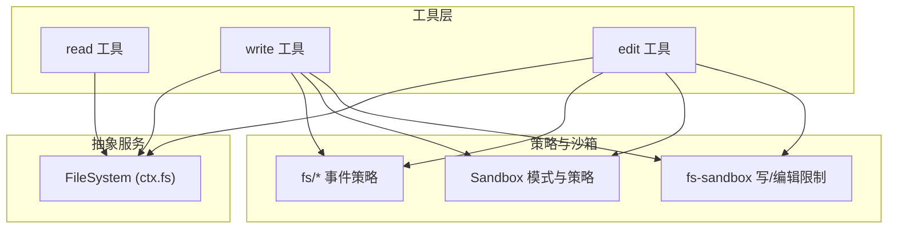
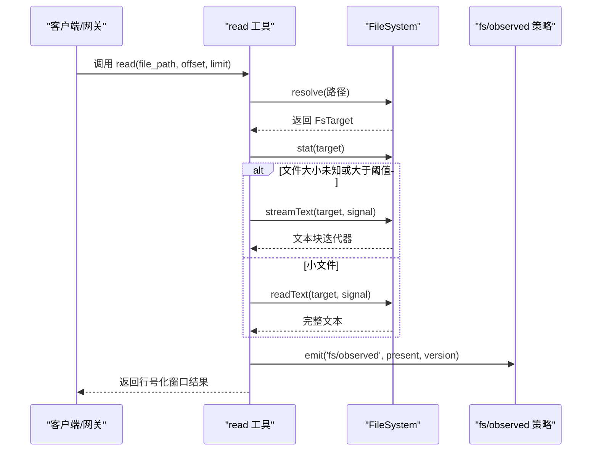
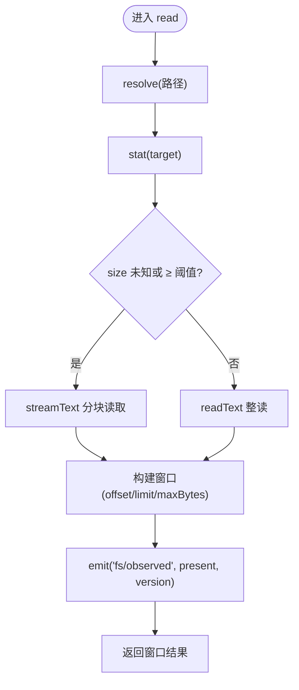
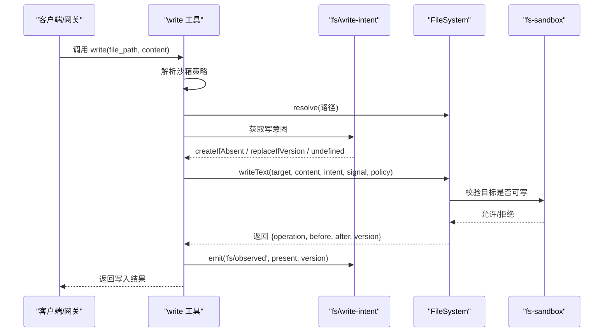
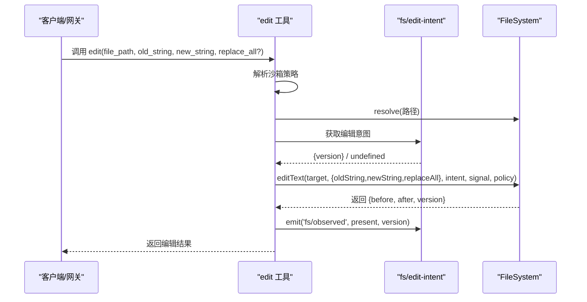
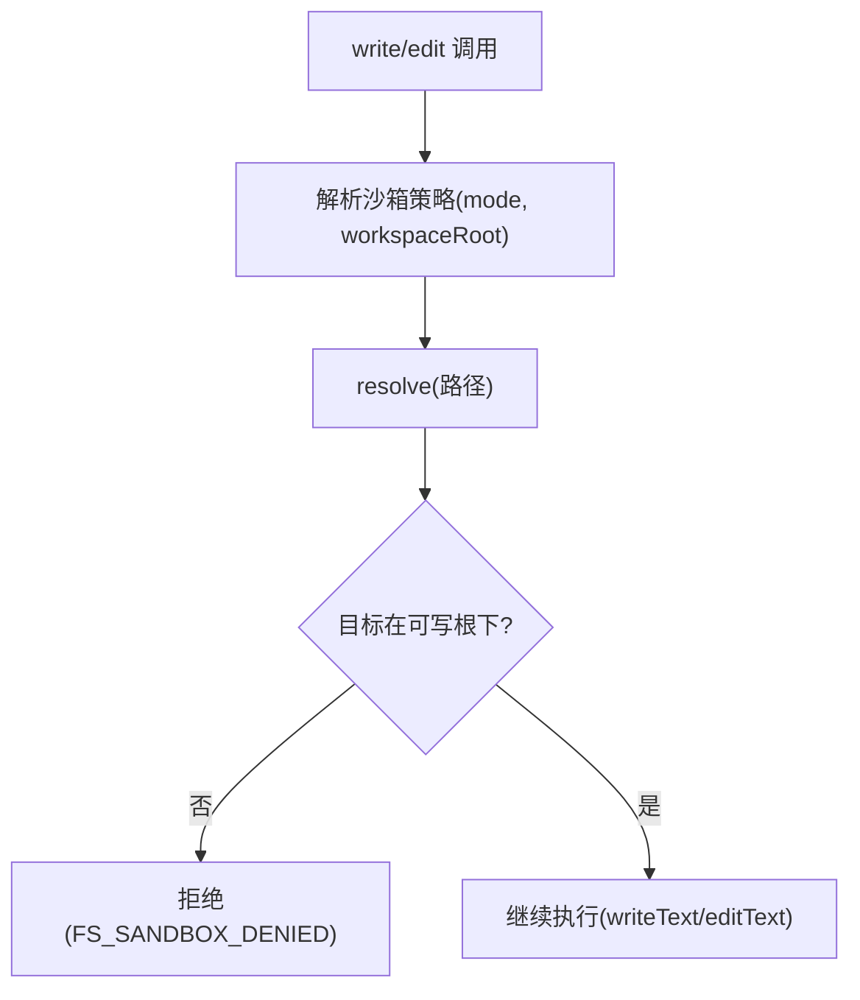
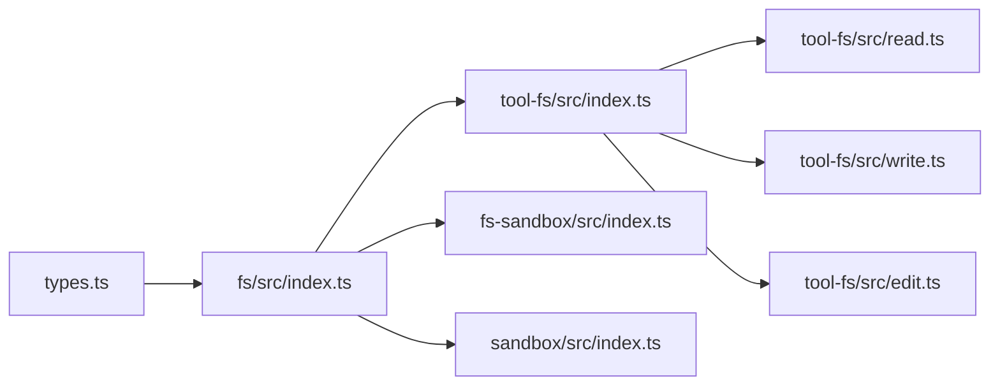

# 文件系统 API

<cite>
**本文引用的文件**
- [packages/fs/fs/src/index.ts](file://packages/fs/fs/src/index.ts)
- [packages/fs/fs/src/types.ts](file://packages/fs/fs/src/types.ts)
- [packages/fs/tool-fs/src/index.ts](file://packages/fs/tool-fs/src/index.ts)
- [packages/fs/tool-fs/src/read.ts](file://packages/fs/tool-fs/src/read.ts)
- [packages/fs/tool-fs/src/write.ts](file://packages/fs/tool-fs/src/write.ts)
- [packages/fs/tool-fs/src/edit.ts](file://packages/fs/tool-fs/src/edit.ts)
- [packages/fs/fs-sandbox/src/index.ts](file://packages/fs/fs-sandbox/src/index.ts)
- [packages/fs/fs-sandbox/src/containment.ts](file://packages/fs/fs-sandbox/src/containment.ts)
- [packages/sandbox/sandbox/src/index.ts](file://packages/sandbox/sandbox/src/index.ts)
- [packages/sandbox/sandbox/src/roots.ts](file://packages/sandbox/sandbox/src/roots.ts)
- [docs/subsystems/filesystem.md](file://docs/subsystems/filesystem.md)
- [docs/subsystems/sandbox.md](file://docs/subsystems/sandbox.md)
- [packages/fs/tool-fs/tests/tools.spec.ts](file://packages/fs/tool-fs/tests/tools.spec.ts)
</cite>

## 目录
1. [简介](#简介)
2. [项目结构](#项目结构)
3. [核心组件](#核心组件)
4. [架构总览](#架构总览)
5. [详细组件分析](#详细组件分析)
6. [依赖关系分析](#依赖关系分析)
7. [性能考量](#性能考量)
8. [故障排查指南](#故障排查指南)
9. [结论](#结论)
10. [附录：API 参考与示例](#附录api-参考与示例)

## 简介
本文件面向“文件系统操作相关的 RESTful API”的文档化需求，基于仓库中的文件系统能力（dsh-fs、tool-fs、fs-sandbox、sandbox）进行系统化说明。内容覆盖：
- 读取、写入、编辑（可视为文本替换）、删除（通过空内容写入或上层工具组合）、移动/重命名（由后端实现提供）等基础操作
- 目录浏览、文件搜索（结合 glob/grep 等工具链）与批量操作（通过循环调用工具）
- 沙箱环境下的访问限制、权限控制与路径验证
- 大文件处理、流式传输与错误处理
- 版本控制（基于 FsVersion 的新鲜度令牌）、备份恢复与数据迁移思路
- 安全考虑、性能优化与最佳实践

注意：本仓库以“工具层 + 抽象文件系统服务 + 策略/沙箱”的方式组织文件系统能力；对外暴露的“RESTful API”通常由网关/代理将 HTTP 请求映射到这些工具与服务。本文档在描述接口时，既给出工具级契约，也说明如何映射为 REST 风格。

## 项目结构
文件系统能力由多个包协作组成：
- 抽象服务定义：FileSystem（ctx.fs），统一读写、元数据、列表、原子写/编辑等能力
- 模型侧工具：tool-fs 注册 read/write/edit/read_image 等工具，负责参数校验、窗口化读取、渲染与观测事件
- 沙箱与策略：sandbox 提供进程级隔离模式与执行策略；fs-sandbox 对写/编辑做工作区边界限制
- 类型与错误：types 定义目标、版本、观察、错误码等

图表来源
- [packages/fs/tool-fs/src/index.ts:54-79](file://packages/fs/tool-fs/src/index.ts#L54-L79)
- [packages/fs/fs/src/index.ts:86-249](file://packages/fs/fs/src/index.ts#L86-L249)
- [packages/fs/fs-sandbox/src/index.ts:136-147](file://packages/fs/fs-sandbox/src/index.ts#L136-L147)
- [docs/subsystems/sandbox.md:9-65](file://docs/subsystems/sandbox.md#L9-L65)

章节来源
- [packages/fs/tool-fs/src/index.ts:54-79](file://packages/fs/tool-fs/src/index.ts#L54-L79)
- [packages/fs/fs/src/index.ts:86-249](file://packages/fs/fs/src/index.ts#L86-L249)
- [docs/subsystems/filesystem.md:11-279](file://docs/subsystems/filesystem.md#L11-L279)

## 核心组件
- FileSystem（抽象服务）：提供 resolve、processPath、fileUrl、contains、stat、lstat、readText、streamText、readBytes、listDir、writeText、editText 等方法，并暴露 fs/* 事件用于策略拦截
- tool-fs：注册 read/write/edit/read_image 工具，负责参数校验、窗口化读取、结果渲染、观测记录
- fs-sandbox：在写/编辑时对目标是否位于可写根下进行校验，拒绝越界写入
- sandbox：提供进程级隔离模式（只读、工作区可写、危险全开放）与每调用策略解析

章节来源
- [packages/fs/fs/src/index.ts:86-249](file://packages/fs/fs/src/index.ts#L86-L249)
- [packages/fs/tool-fs/src/index.ts:24-79](file://packages/fs/tool-fs/src/index.ts#L24-L79)
- [packages/fs/fs-sandbox/src/index.ts:136-147](file://packages/fs/fs-sandbox/src/index.ts#L136-L147)
- [docs/subsystems/sandbox.md:9-65](file://docs/subsystems/sandbox.md#L9-L65)

## 架构总览
下图展示一次“读取”从工具到服务的调用序列，以及大文件时的流式分支。

图表来源
- [packages/fs/tool-fs/src/read.ts:69-163](file://packages/fs/tool-fs/src/read.ts#L69-L163)
- [packages/fs/fs/src/index.ts:107-187](file://packages/fs/fs/src/index.ts#L107-L187)
- [docs/subsystems/filesystem.md:222-238](file://docs/subsystems/filesystem.md#L222-L238)

## 详细组件分析

### 读取（read）
- 功能：按偏移和行数窗口化读取 UTF-8 文本，支持流式读取大文件
- 关键行为：
  - 先 stat 获取类型与大小，决定 readText 或 streamText
  - 输出包含 path、offset、lines（带行号）、totalLines，可能标记 truncatedByBytes
  - 成功后发出 fs/observed 记录“存在且版本已知”，供后续写/编辑新鲜度校验使用
- 配置：readLimit、readMaxLineLength、readMaxBytes、readStreamMinSize

图表来源
- [packages/fs/tool-fs/src/read.ts:69-163](file://packages/fs/tool-fs/src/read.ts#L69-L163)
- [packages/fs/fs/src/index.ts:170-187](file://packages/fs/fs/src/index.ts#L170-L187)

章节来源
- [packages/fs/tool-fs/src/read.ts:69-163](file://packages/fs/tool-fs/src/read.ts#L69-L163)
- [packages/fs/fs/src/index.ts:170-187](file://packages/fs/fs/src/index.ts#L170-L187)
- [docs/subsystems/filesystem.md:222-238](file://docs/subsystems/filesystem.md#L222-L238)

### 写入（write）
- 功能：创建或完全替换 UTF-8 文本文件
- 关键行为：
  - 解析 per-call 沙箱策略，resolve 路径
  - 通过 waterfall 获取写意图（createIfAbsent 或 replaceIfVersion），无策略则无条件覆盖
  - 调用 writeText 完成原子写入，返回 before/after/version
  - 发出 fs/observed 记录新版本
- 沙箱限制：fs-sandbox 会校验目标是否在可写根下，否则拒绝

图表来源
- [packages/fs/tool-fs/src/write.ts:62-129](file://packages/fs/tool-fs/src/write.ts#L62-L129)
- [packages/fs/fs-sandbox/src/index.ts:136-147](file://packages/fs/fs-sandbox/src/index.ts#L136-L147)
- [packages/fs/fs/src/index.ts:210-228](file://packages/fs/fs/src/index.ts#L210-L228)

章节来源
- [packages/fs/tool-fs/src/write.ts:62-129](file://packages/fs/tool-fs/src/write.ts#L62-L129)
- [packages/fs/fs-sandbox/src/index.ts:136-147](file://packages/fs/fs-sandbox/src/index.ts#L136-L147)
- [packages/fs/fs/src/index.ts:210-228](file://packages/fs/fs/src/index.ts#L210-L228)

### 编辑（edit）
- 功能：对现有文本进行字面量替换（单处或全部）
- 关键行为：
  - 解析 per-call 沙箱策略，resolve 路径
  - 通过 waterfall 获取编辑意图（{version} 或 undefined），无策略则无条件编辑
  - 调用 editText 完成原子替换，返回 before/after/version
  - 发出 fs/observed 记录新版本
- 错误语义：未观察到目标或版本不匹配会返回 FS_NOT_OBSERVED / FS_STALE_VERSION

图表来源
- [packages/fs/tool-fs/src/edit.ts:76-146](file://packages/fs/tool-fs/src/edit.ts#L76-L146)
- [packages/fs/fs/src/index.ts:230-249](file://packages/fs/fs/src/index.ts#L230-L249)

章节来源
- [packages/fs/tool-fs/src/edit.ts:76-146](file://packages/fs/tool-fs/src/edit.ts#L76-L146)
- [packages/fs/fs/src/index.ts:230-249](file://packages/fs/fs/src/index.ts#L230-L249)

### 目录浏览与搜索
- 目录浏览：通过 listDir 返回子项名称、类型、目标与可选 size/version，不读取内容
- 搜索：可通过 shell/grep 工具配合文件系统能力实现；文件系统本身不直接提供全文检索
- 建议：在 REST 层提供 /files/list?path=... 与 /files/search?query=...&path=... 两个端点，分别映射到 listDir 与 grep 流程

章节来源
- [packages/fs/fs/src/index.ts:201-208](file://packages/fs/fs/src/index.ts#L201-L208)
- [docs/subsystems/filesystem.md:93-112](file://docs/subsystems/filesystem.md#L93-L112)

### 删除与移动/重命名
- 删除：可通过 write 写入空内容实现“清空”，或通过上层工具组合删除（如 shell rm）
- 移动/重命名：由具体后端实现（本地/远程）提供；REST 层可封装为 move/rename 端点，内部调用后端的相应方法
- 注意：若需跨卷/跨设备移动，应确保原子性与一致性

章节来源
- [packages/fs/fs/src/index.ts:210-249](file://packages/fs/fs/src/index.ts#L210-L249)

### 沙箱与权限控制
- 模式：read-only、workspace-write、danger-full-access
- 策略：每调用解析，携带 workspaceRoot 与 sessionId（可选）
- 写/编辑限制：fs-sandbox 校验目标是否位于可写根下，否则返回 FS_SANDBOX_DENIED
- 路径规范化：canonicalPath 解析真实路径，避免别名导致的绕过

图表来源
- [docs/subsystems/sandbox.md:9-65](file://docs/subsystems/sandbox.md#L9-L65)
- [packages/fs/fs-sandbox/src/index.ts:136-147](file://packages/fs/fs-sandbox/src/index.ts#L136-L147)
- [packages/sandbox/sandbox/src/roots.ts:20-41](file://packages/sandbox/sandbox/src/roots.ts#L20-L41)

章节来源
- [docs/subsystems/sandbox.md:9-65](file://docs/subsystems/sandbox.md#L9-L65)
- [packages/fs/fs-sandbox/src/index.ts:136-147](file://packages/fs/fs-sandbox/src/index.ts#L136-L147)
- [packages/sandbox/sandbox/src/roots.ts:20-41](file://packages/sandbox/sandbox/src/roots.ts#L20-L41)

### 版本控制、备份恢复与数据迁移
- 版本控制：FsVersion 作为新鲜度令牌，write/edit 返回新版本的 token；策略层据此判断 stale
- 备份恢复：可对工作区目录进行快照/归档；恢复时通过 write 重建文件树
- 数据迁移：借助 listDir + readBytes/streamText 导出，再在新环境用 write 导入；注意编码与换行归一化

章节来源
- [packages/fs/fs/src/types.ts:28-45](file://packages/fs/fs/src/types.ts#L28-L45)
- [packages/fs/fs/src/index.ts:210-249](file://packages/fs/fs/src/index.ts#L210-L249)
- [docs/subsystems/filesystem.md:114-179](file://docs/subsystems/filesystem.md#L114-L179)

## 依赖关系分析
- tool-fs 依赖 FileSystem 抽象与 fs/* 事件；fs-sandbox 在写/编辑路径上增加边界检查；sandbox 提供模式与策略
- 类型与错误集中在 types，保证跨层一致的错误码与数据结构

图表来源
- [packages/fs/fs/src/types.ts:1-204](file://packages/fs/fs/src/types.ts#L1-L204)
- [packages/fs/fs/src/index.ts:86-249](file://packages/fs/fs/src/index.ts#L86-L249)
- [packages/fs/tool-fs/src/index.ts:54-79](file://packages/fs/tool-fs/src/index.ts#L54-L79)
- [packages/fs/fs-sandbox/src/index.ts:136-147](file://packages/fs/fs-sandbox/src/index.ts#L136-L147)
- [packages/sandbox/sandbox/src/index.ts:158-213](file://packages/sandbox/sandbox/src/index.ts#L158-L213)

章节来源
- [packages/fs/fs/src/types.ts:1-204](file://packages/fs/fs/src/types.ts#L1-L204)
- [packages/fs/fs/src/index.ts:86-249](file://packages/fs/fs/src/index.ts#L86-L249)
- [packages/fs/tool-fs/src/index.ts:54-79](file://packages/fs/tool-fs/src/index.ts#L54-L79)

## 性能考量
- 大文件读取：当 size 未知或超过阈值时自动走 streamText，避免内存膨胀
- 字节上限：read 支持 maxBytes，超出时截断并标记 truncatedByBytes
- 取消与中止：所有 I/O 接受 AbortSignal，可在超时或用户取消时尽早退出
- 批处理：批量操作建议分页/并发控制，避免一次性加载过多内容

章节来源
- [packages/fs/tool-fs/src/read.ts:15-33](file://packages/fs/tool-fs/src/read.ts#L15-L33)
- [packages/fs/tool-fs/src/read.ts:142-151](file://packages/fs/tool-fs/src/read.ts#L142-L151)
- [packages/fs/fs/src/index.ts:170-199](file://packages/fs/fs/src/index.ts#L170-L199)

## 故障排查指南
常见错误码与含义：
- FS_NOT_FOUND：目标不存在
- FS_NOT_DIRECTORY：期望目录但非目录
- FS_NOT_TEXT：非文本文件
- FS_NOT_REGULAR_FILE：非普通文件
- FS_TOO_LARGE：超过最大字节限制
- FS_PERMISSION_DENIED：权限不足
- FS_SANDBOX_DENIED：沙箱策略拒绝
- FS_IO_ERROR：I/O 异常
- FS_STALE_VERSION：版本陈旧
- FS_NOT_OBSERVED：未观察到目标（策略要求先读）
- FS_AMBIGUOUS_EDIT：编辑匹配不唯一
- FS_EDIT_NOT_FOUND：编辑目标不存在
- FS_ABORTED：操作被中止

定位步骤：
- 检查工具返回的 error.code 与 message
- 确认沙箱模式与 workspaceRoot 是否正确
- 对于 FS_STALE_VERSION/FS_NOT_OBSERVED，先执行 read 再写/编辑
- 对于 FS_TOO_LARGE，调整 maxBytes 或改用流式处理

章节来源
- [packages/fs/fs/src/types.ts:170-204](file://packages/fs/fs/src/types.ts#L170-L204)
- [packages/fs/tool-fs/tests/tools.spec.ts:277-301](file://packages/fs/tool-fs/tests/tools.spec.ts#L277-L301)

## 结论
本文件系统能力以“抽象服务 + 工具 + 策略/沙箱”的分层设计，提供了稳定、可扩展的文件操作接口。通过 FsVersion 与 fs/* 事件实现了细粒度的新鲜度控制与策略扩展；通过沙箱模式与工作区边界保障安全性；通过流式读取与字节上限保障性能。REST 层可将上述工具与服务映射为标准的 CRUD 与搜索/批量接口，满足大多数业务场景。

## 附录：API 参考与示例

### REST 映射建议
- GET /files/read
  - 查询参数：file_path, offset, limit
  - 响应：{ path, offset, lines[], totalLines, truncatedByBytes? }
- POST /files/write
  - 请求体：{ file_path, content, sandbox_permissions?, justification? }
  - 响应：{ path, operation, before, after }
- POST /files/edit
  - 请求体：{ file_path, old_string, new_string, replace_all?, sandbox_permissions?, justification? }
  - 响应：{ path, before, after }
- GET /files/list
  - 查询参数：path
  - 响应：entries[]（name, type, target, version?, size?）
- GET /files/search
  - 查询参数：query, path
  - 行为：调用 grep 等工具并结合文件系统能力

### 请求/响应示例（节选）
- 读取示例
  - 请求：GET /files/read?file_path=src/main.js&offset=1&limit=100
  - 响应：{ path:"src/main.js", offset:1, lines:[{number:1,text:"..."},...], totalLines:1234 }
- 写入示例
  - 请求：POST /files/write { file_path:"src/main.js", content:"..." }
  - 响应：{ path:"src/main.js", operation:"update", before:"...", after:"..." }
- 编辑示例
  - 请求：POST /files/edit { file_path:"src/main.js", old_string:"A", new_string:"B", replace_all:false }
  - 响应：{ path:"src/main.js", before:"...", after:"..." }
- 目录浏览示例
  - 请求：GET /files/list?path=src
  - 响应：{ entries:[{name:"main.js",type:"file",target:{...},size:1234}] }

### 大文件与流式传输
- 当 size 未知或超过阈值时，服务端采用流式读取，避免内存峰值
- 客户端应支持分块消费与进度反馈

### 错误处理示例
- FS_NOT_FOUND：检查路径是否存在
- FS_SANDBOX_DENIED：检查沙箱模式与 workspaceRoot
- FS_STALE_VERSION：重新读取最新内容后再编辑
- FS_TOO_LARGE：调大 maxBytes 或改用流式

章节来源
- [packages/fs/tool-fs/src/read.ts:69-163](file://packages/fs/tool-fs/src/read.ts#L69-L163)
- [packages/fs/tool-fs/src/write.ts:62-129](file://packages/fs/tool-fs/src/write.ts#L62-L129)
- [packages/fs/tool-fs/src/edit.ts:76-146](file://packages/fs/tool-fs/src/edit.ts#L76-L146)
- [packages/fs/fs/src/index.ts:201-249](file://packages/fs/fs/src/index.ts#L201-L249)
- [docs/subsystems/filesystem.md:288-426](file://docs/subsystems/filesystem.md#L288-L426)
- [docs/subsystems/sandbox.md:9-65](file://docs/subsystems/sandbox.md#L9-L65)