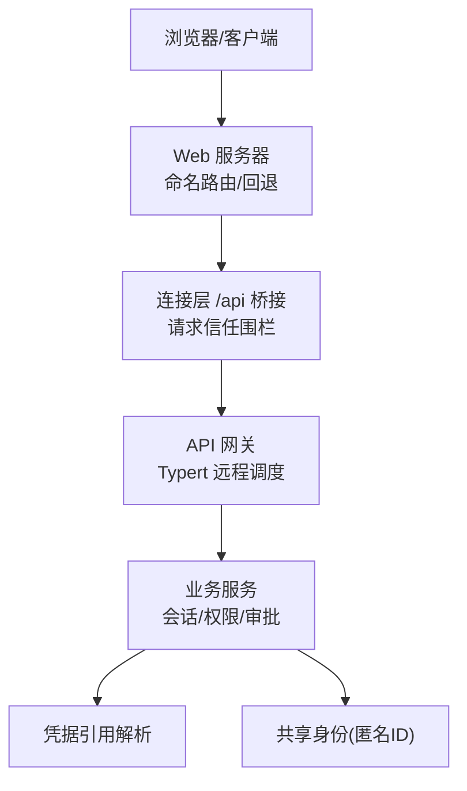
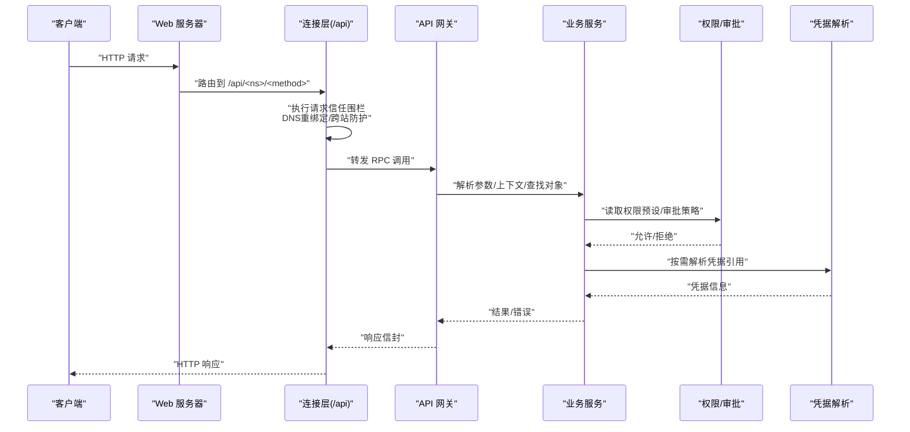
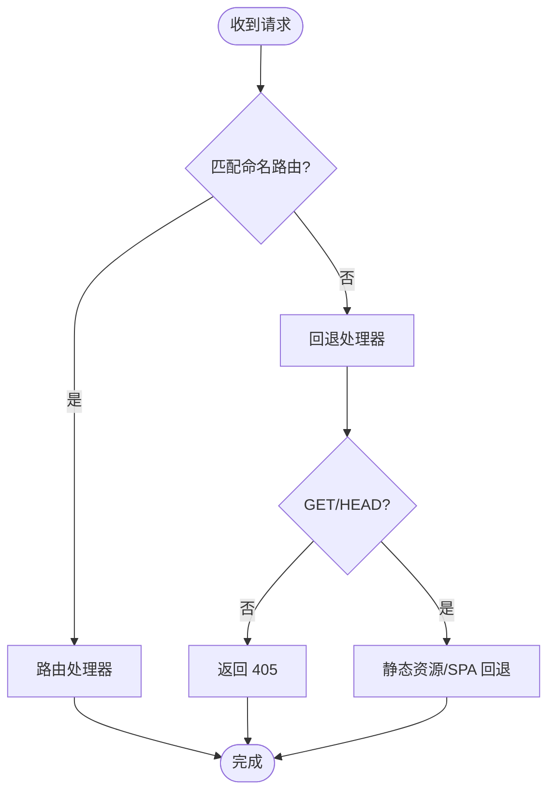
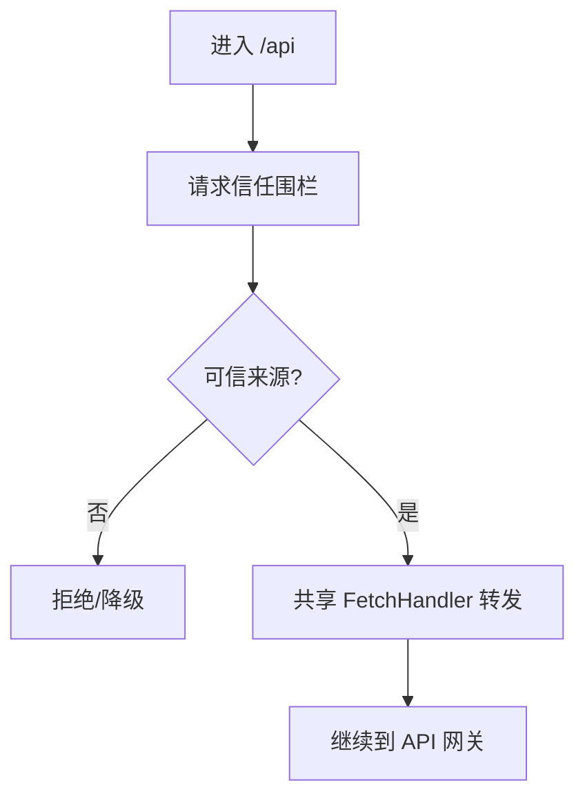
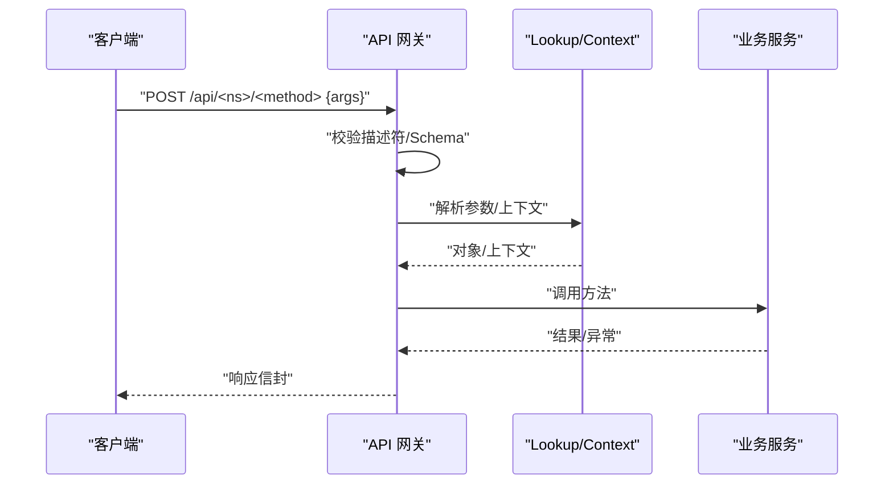
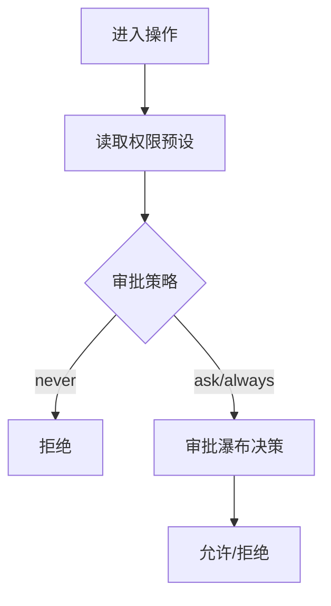
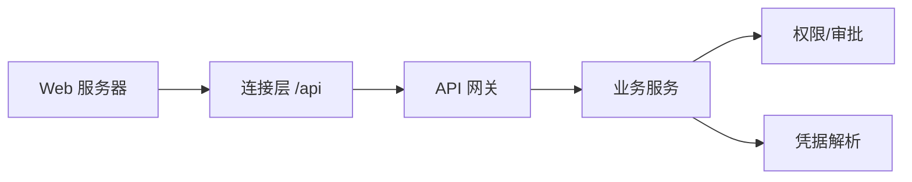

# 认证授权 API

<cite>
**本文引用的文件**
- [packages/client/connection/src/index.ts](file://packages/client/connection/src/index.ts)
- [packages/client/connection/src/api-request-trust.ts](file://packages/client/connection/src/api-request-trust.ts)
- [packages/host/webserver/src/index.ts](file://packages/host/webserver/src/index.ts)
- [docs/subsystems/web-server.md](file://docs/subsystems/web-server.md)
- [docs/api-gateway.md](file://docs/api-gateway.md)
- [packages/credentials/README.md](file://packages/credentials/README.md)
- [packages/identity/README.md](file://packages/identity/README.md)
- [packages/interaction/permission-presets/src/index.ts](file://packages/interaction/permission-presets/src/index.ts)
- [packages/interaction/user-approval/src/index.ts](file://packages/interaction/user-approval/src/index.ts)
</cite>

## 目录
1. [简介](#简介)
2. [项目结构](#项目结构)
3. [核心组件](#核心组件)
4. [架构总览](#架构总览)
5. [详细组件分析](#详细组件分析)
6. [依赖关系分析](#依赖关系分析)
7. [性能与安全考量](#性能与安全考量)
8. [故障排查指南](#故障排查指南)
9. [结论](#结论)
10. [附录：API 参考与示例](#附录api-参考与示例)

## 简介
本文件面向“认证授权”相关能力，聚焦于通过 HTTP 网关暴露的 RESTful 风格接口、请求信任边界、会话与权限策略、以及凭据引用机制。需要特别说明的是：该仓库并未提供传统意义上的“用户名/密码登录、注册、JWT 签发/刷新”等用户态身份认证端点；其安全模型以“进程内连接 + 浏览器信任围栏 + 会话/权限策略 + 凭据引用”为核心，对外仅暴露受控的 /api 桥接通道，由上游部署或宿主环境负责真正的身份鉴别与会话绑定。

## 项目结构
围绕认证与访问控制的关键路径如下：
- Web 服务器：提供命名路由、升级路由与回退处理器，承载前端静态资源与 /api 桥接。
- 连接层（Connection）：在浏览器传输前缀下挂载 API 网关入口，统一执行请求信任检查与转发。
- API 网关（Typert Gateway）：基于严格描述符进行方法级调度与参数校验，将业务服务暴露为远程调用。
- 权限与审批：会话级权限预设与审批策略，决定操作是否放行。
- 凭据引用：配置中只保存引用，运行时按操作解析真实凭据。
- 共享身份：匿名关联标识用于遥测与跨产品追踪，不表示已认证账户。

图表来源
- [packages/host/webserver/src/index.ts:65-101](file://packages/host/webserver/src/index.ts#L65-L101)
- [packages/client/connection/src/index.ts:121-145](file://packages/client/connection/src/index.ts#L121-L145)
- [docs/api-gateway.md:119-128](file://docs/api-gateway.md#L119-L128)

章节来源
- [docs/subsystems/web-server.md:1-48](file://docs/subsystems/web-server.md#L1-L48)
- [packages/host/webserver/src/index.ts:65-101](file://packages/host/webserver/src/index.ts#L65-L101)
- [packages/client/connection/src/index.ts:121-145](file://packages/client/connection/src/index.ts#L121-L145)
- [docs/api-gateway.md:119-128](file://docs/api-gateway.md#L119-L128)

## 核心组件
- Web 服务器（ctx.webServer）
  - 职责：监听端口、注册命名路由/升级路由、声明回退处理器、注入 index.html 变换。
  - 关键点：非 GET/HEAD 请求在 SPA 回退场景返回 405；未知扩展名以 octet-stream 返回；错误请求记录警告并返回 400。
- 连接层（/api 桥接）
  - 职责：在浏览器传输前缀下挂载 API 网关入口；对每个 /api 请求执行“浏览器信任围栏”，必要时强制环回；创建共享 FetchHandler 并转发到网关。
  - 关键点：trustedHosts 白名单、最大请求体大小限制、DNS 重绑定与跨站防护。
- API 网关（Typert Gateway）
  - 职责：基于严格描述符进行方法级调度、参数校验、对象/上下文解析、返回值校验；未声明端点回退到现有 API Proxy。
  - 关键点：Remote/@RemoteScope 暴露的方法才可见；lookup/Context 解析失败会拒绝；取消信号支持。
- 权限与审批
  - 职责：会话级权限预设（如只读、受限、完全访问）、沙箱模式、审批策略（never/ask/always）。
  - 关键点：首次会话时填充缺失的权限事实；'never' 策略直接拒绝。
- 凭据引用
  - 职责：配置中仅保存引用，不在配置中存放密钥；消费方在操作边界解析引用。
- 共享身份
  - 职责：提供跨产品域的匿名关联 ID，不表示已认证账户。

章节来源
- [docs/subsystems/web-server.md:29-48](file://docs/subsystems/web-server.md#L29-L48)
- [packages/client/connection/src/index.ts:121-145](file://packages/client/connection/src/index.ts#L121-L145)
- [docs/api-gateway.md:80-128](file://docs/api-gateway.md#L80-L128)
- [packages/interaction/permission-presets/src/index.ts:394-433](file://packages/interaction/permission-presets/src/index.ts#L394-L433)
- [packages/interaction/user-approval/src/index.ts:298-322](file://packages/interaction/user-approval/src/index.ts#L298-L322)
- [packages/credentials/README.md:1-15](file://packages/credentials/README.md#L1-L15)
- [packages/identity/README.md:1-10](file://packages/identity/README.md#L1-L10)

## 架构总览
下图展示了从浏览器到业务服务的完整链路，以及认证/授权在何处生效。

图表来源
- [packages/client/connection/src/index.ts:121-145](file://packages/client/connection/src/index.ts#L121-L145)
- [docs/api-gateway.md:119-128](file://docs/api-gateway.md#L119-L128)
- [packages/interaction/permission-presets/src/index.ts:394-433](file://packages/interaction/permission-presets/src/index.ts#L394-L433)
- [packages/interaction/user-approval/src/index.ts:298-322](file://packages/interaction/user-approval/src/index.ts#L298-L322)
- [packages/credentials/README.md:1-15](file://packages/credentials/README.md#L1-L15)

## 详细组件分析

### Web 服务器（HTTP 载体）
- 路由匹配顺序：精确表 → 最长前缀 → 回退处理器。
- 回退处理器：SPA 场景下，非 GET/HEAD 返回 405；遍历超出 dist 根目录返回 403；未知扩展名以二进制流返回。
- 错误处理：请求处理抛错记录警告并返回 400，或销毁套接字。

图表来源
- [docs/subsystems/web-server.md:9-28](file://docs/subsystems/web-server.md#L9-L28)
- [packages/host/webserver/src/index.ts:65-101](file://packages/host/webserver/src/index.ts#L65-L101)

章节来源
- [docs/subsystems/web-server.md:9-48](file://docs/subsystems/web-server.md#L9-L48)
- [packages/host/webserver/src/index.ts:65-101](file://packages/host/webserver/src/index.ts#L65-L101)

### 连接层与请求信任围栏（/api）
- 所有 /api 请求先经过“浏览器信任围栏”，防御 DNS 重绑定与跨站请求。
- 特权方法使用空信任列表，强制走环回地址。
- 可配置 trustedHosts 白名单与最大请求体大小。

图表来源
- [packages/client/connection/src/api-request-trust.ts:1-28](file://packages/client/connection/src/api-request-trust.ts#L1-L28)
- [packages/client/connection/src/index.ts:121-145](file://packages/client/connection/src/index.ts#L121-L145)

章节来源
- [packages/client/connection/src/api-request-trust.ts:1-28](file://packages/client/connection/src/api-request-trust.ts#L1-L28)
- [packages/client/connection/src/index.ts:121-145](file://packages/client/connection/src/index.ts#L121-L145)

### API 网关（Typert Remote）
- 仅暴露标记为 @Remote/@RemoteScope 的方法；未声明端点回退到现有 API Proxy。
- 每次调用都重新解析描述符与服务实例，确保最新状态。
- 参数与返回值经严格 Schema 校验；lookup/Context 解析失败即拒绝。
- 支持取消信号 AbortSignal。

图表来源
- [docs/api-gateway.md:119-128](file://docs/api-gateway.md#L119-L128)

章节来源
- [docs/api-gateway.md:80-128](file://docs/api-gateway.md#L80-L128)

### 权限与审批（会话级）
- 权限预设：默认/继承/自定义，首次会话填充缺失的权限事实。
- 审批策略：'never' 直接拒绝；其他策略通过瀑布式决策链。
- 沙箱模式：限制执行环境。

图表来源
- [packages/interaction/permission-presets/src/index.ts:394-433](file://packages/interaction/permission-presets/src/index.ts#L394-L433)
- [packages/interaction/user-approval/src/index.ts:298-322](file://packages/interaction/user-approval/src/index.ts#L298-L322)

章节来源
- [packages/interaction/permission-presets/src/index.ts:394-433](file://packages/interaction/permission-presets/src/index.ts#L394-L433)
- [packages/interaction/user-approval/src/index.ts:298-322](file://packages/interaction/user-approval/src/index.ts#L298-L322)

### 凭据引用与共享身份
- 凭据引用：配置中仅保存引用，消费方在操作边界解析；避免在配置中存放密钥。
- 共享身份：提供匿名关联 ID，用于遥测与跨产品追踪，不代表已认证账户。

章节来源
- [packages/credentials/README.md:1-15](file://packages/credentials/README.md#L1-L15)
- [packages/identity/README.md:1-10](file://packages/identity/README.md#L1-L10)

## 依赖关系分析
- Web 服务器为最底层 HTTP 载体，向上暴露命名路由与回退。
- 连接层在 Web 服务器之上，统一拦截 /api 并执行信任围栏。
- API 网关位于连接层之上，负责方法级调度与数据协议。
- 业务服务依赖权限/审批与凭据解析，形成“调用前鉴权、调用中授权、调用后审计”的闭环。

图表来源
- [docs/subsystems/web-server.md:9-48](file://docs/subsystems/web-server.md#L9-L48)
- [packages/client/connection/src/index.ts:121-145](file://packages/client/connection/src/index.ts#L121-L145)
- [docs/api-gateway.md:119-128](file://docs/api-gateway.md#L119-L128)

章节来源
- [docs/subsystems/web-server.md:9-48](file://docs/subsystems/web-server.md#L9-L48)
- [packages/client/connection/src/index.ts:121-145](file://packages/client/connection/src/index.ts#L121-L145)
- [docs/api-gateway.md:119-128](file://docs/api-gateway.md#L119-L128)

## 性能与安全考量
- 性能
  - 路由匹配为 O(1)/O(logn) 级别（精确表+前缀表），开销低。
  - API 网关每次调用重新解析描述符与服务实例，保证一致性但带来一定开销；适合高频短生命周期调用。
  - 连接层支持取消信号，避免无效计算。
- 安全
  - 请求信任围栏抵御 DNS 重绑定与跨站请求；特权方法强制环回。
  - 最大请求体大小限制防止超大负载攻击。
  - 权限预设与审批策略实现细粒度访问控制。
  - 凭据引用避免在配置中明文存储密钥。
  - 共享身份仅用于匿名追踪，不泄露敏感信息。

[本节为通用指导，无需特定文件来源]

## 故障排查指南
- 405 错误：在非 GET/HEAD 且命中 SPA 回退时出现，确认路由是否正确。
- 400 错误：请求处理抛错（如 URL 编码非法、客户端中断）时返回。
- 信任围栏失败：检查 trustedHosts 配置与请求来源；特权方法需来自环回。
- 网关未找到端点：确认业务包是否通过 @Remote/@RemoteScope 暴露方法，且已正确生成并挂载。
- 权限被拒：检查会话权限预设与审批策略；'never' 策略会直接拒绝。
- 凭据解析失败：确认凭据引用是否存在且可解析。

章节来源
- [docs/subsystems/web-server.md:41-48](file://docs/subsystems/web-server.md#L41-L48)
- [packages/client/connection/src/index.ts:121-145](file://packages/client/connection/src/index.ts#L121-L145)
- [docs/api-gateway.md:119-128](file://docs/api-gateway.md#L119-L128)
- [packages/interaction/user-approval/src/index.ts:298-322](file://packages/interaction/user-approval/src/index.ts#L298-L322)

## 结论
该仓库采用“进程内连接 + 浏览器信任围栏 + 会话/权限策略 + 凭据引用”的安全模型，而非传统的用户名/密码登录与 JWT 会话管理。认证由部署侧或宿主环境承担，授权通过会话级权限预设与审批策略实现，API 网关提供严格的方法级调度与校验。若需引入多因素认证、单点登录或第三方集成，应在连接层之前（宿主页签/代理/网关）实现，并通过 trustedHosts、环回策略与权限策略进行约束。

[本节为总结性内容，无需特定文件来源]

## 附录：API 参考与示例

### 端点与调用约定
- 基础路径：/api
- 调用方式：POST /api/<namespace>/<method>
- 载荷：{ args }
- 说明：由 API 网关根据严格描述符调度；未声明端点回退到现有 API Proxy。

章节来源
- [docs/api-gateway.md:119-128](file://docs/api-gateway.md#L119-L128)

### 典型流程示例（概念性）
- 登录流程（概念）
  - 外部身份提供者完成认证后，宿主环境建立连接并设置会话上下文。
  - 后续 /api 请求携带会话上下文，经由连接层信任围栏与网关调度。
- 权限验证（概念）
  - 网关解析参数与上下文后，业务服务读取权限预设与审批策略决定是否放行。
- 错误处理（概念）
  - 信任围栏失败：拒绝请求。
  - 网关校验失败：返回结构化错误。
  - 权限拒绝：返回权限相关错误。

[本节为概念性示例，不映射具体代码文件]

### 安全最佳实践
- 仅在环回或可信主机上暴露 /api；必要时启用 TLS 与反向代理。
- 最小化 trustedHosts 白名单；特权方法强制环回。
- 合理配置最大请求体大小，避免资源耗尽。
- 使用权限预设与审批策略限制高风险操作。
- 使用凭据引用，避免在配置中存放密钥。
- 定期审计日志与遥测数据，关注异常行为。

[本节为通用指导，无需特定文件来源]