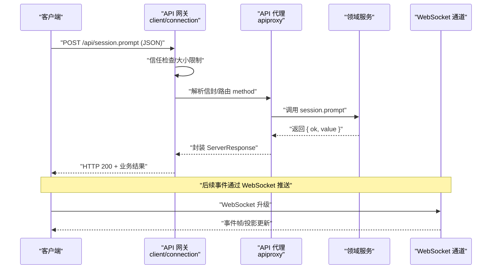
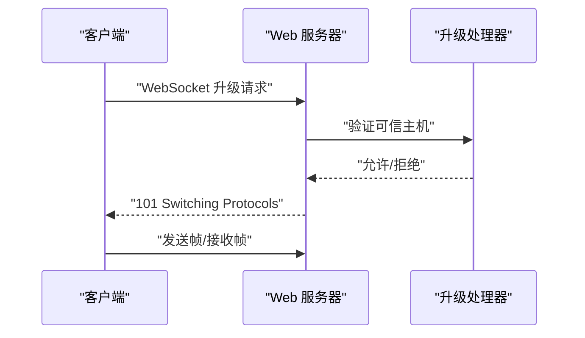
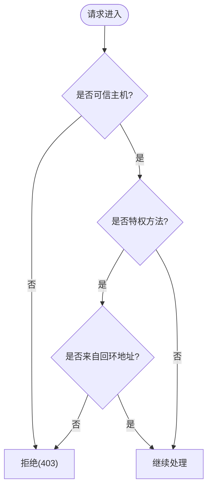
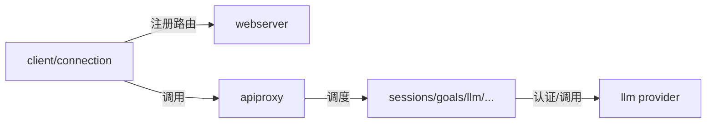

# Web API

<cite>
**本文引用的文件**
- [packages/host/apiproxy/src/api/index.ts](file://packages/host/apiproxy/src/api/index.ts)
- [packages/host/apiproxy/src/api/rpc-map.ts](file://packages/host/apiproxy/src/api/rpc-map.ts)
- [packages/host/apiproxy/src/api/sessions.ts](file://packages/host/apiproxy/src/api/sessions.ts)
- [packages/host/apiproxy/src/api/goals.ts](file://packages/host/apiproxy/src/api/goals.ts)
- [packages/host/apiproxy/src/api/llm.ts](file://packages/host/apiproxy/src/api/llm.ts)
- [packages/host/apiproxy/src/api/agent-presets.ts](file://packages/host/apiproxy/src/api/agent-presets.ts)
- [packages/host/apiproxy/src/api/approvals.ts](file://packages/host/apiproxy/src/api/approvals.ts)
- [packages/host/apiproxy/src/fetch/handler.ts](file://packages/host/apiproxy/src/fetch/handler.ts)
- [packages/client/connection/src/index.ts](file://packages/client/connection/src/index.ts)
- [packages/client/connection/src/client/web-api-client.ts](file://packages/client/connection/src/client/web-api-client.ts)
- [packages/host/webserver/src/index.ts](file://packages/host/webserver/src/index.ts)
- [packages/host/webserver/tests/webserver.spec.ts](file://packages/host/webserver/tests/webserver.spec.ts)
- [packages/client/connection/tests/node-half.host.spec.ts](file://packages/client/connection/tests/node-half.host.spec.ts)
- [packages/host/apiproxy/tests/fetch-carrier.spec.ts](file://packages/host/apiproxy/tests/fetch-carrier.spec.ts)
- [packages/llm/llm-pi-ai/src/provider.ts](file://packages/llm/llm-pi-ai/src/provider.ts)
</cite>

## 目录
1. [简介](#简介)
2. [项目结构](#项目结构)
3. [核心组件](#核心组件)
4. [架构总览](#架构总览)
5. [详细组件分析](#详细组件分析)
6. [依赖关系分析](#依赖关系分析)
7. [性能与速率限制](#性能与速率限制)
8. [故障排查指南](#故障排查指南)
9. [结论](#结论)
10. [附录：客户端集成与SDK使用](#附录客户端集成与sdk使用)

## 简介
本文件为 DeepSeek Harness 的 Web API 完整文档，覆盖 RESTful 端点、WebSocket 接口、认证与授权、错误码与状态码、速率限制与安全考虑、客户端集成与 SDK 使用方法，以及 API 版本管理与迁移策略。API 以“统一 RPC 方法映射”为核心，HTTP POST /api/<method> 承载请求体（四象限消息模型），WebSocket 用于事件流与双向通信；所有业务错误通过统一的响应体表达，HTTP 状态仅表示传输层结果。

## 项目结构
- 协议契约集中在 apiproxy 包中，定义域接口、RPC 方法映射、请求/响应载体与错误类型。
- HTTP 网关由 webserver 提供路由注册能力，client/connection 将 API 挂载到浏览器可访问的前缀，并实现信任边界与特权方法限制。
- WebSocket 通道通过 upgrade 机制暴露，供事件流和长连接场景使用。
- LLM 适配器通过 provider 配置支持 API Key 等认证方式。

```mermaid
graph TB
Client["客户端"] --> |HTTP POST /api/*| Gateway["API 网关<br/>client/connection"]
Gateway --> |信任检查/权限| Proxy["API 代理<br/>apiproxy"]
Proxy --> |RPC 调度| Domain["领域服务<br/>sessions/goals/llm/..."]
Client <--|WebSocket 升级| WS["WebSocket 通道<br/>webserver + connection"]
Domain --> Provider["LLM 适配器<br/>provider"]
```

图表来源
- [packages/client/connection/src/index.ts:121-145](file://packages/client/connection/src/index.ts#L121-L145)
- [packages/host/apiproxy/src/api/index.ts:1-99](file://packages/host/apiproxy/src/api/index.ts#L1-L99)
- [packages/host/webserver/src/index.ts:24-101](file://packages/host/webserver/src/index.ts#L24-L101)

章节来源
- [packages/host/apiproxy/src/api/index.ts:1-99](file://packages/host/apiproxy/src/api/index.ts#L1-L99)
- [packages/host/webserver/src/index.ts:24-101](file://packages/host/webserver/src/index.ts#L24-L101)

## 核心组件
- 统一 RPC 方法映射：所有客户端请求通过 POST /api/<method> 发送，method 来自 RpcMethodMap，如 session.list、session.prompt、goal.create、llm.providers 等。
- 请求/响应载体：采用四象限消息模型（ClientRequest/ClientResponse/ServerRequest/ServerResponse）与 RpcReceipt 回执。
- 信任与授权：请求经 trustedHosts 白名单校验；部分“特权方法”强制回环地址（loopback-only）。
- WebSocket 通道：提供事件流与双向通信，路径包括 MUX_EVENTS_PATH、HOST_EVENTS_PATH 等。
- 下载通道：downloads 为 Host-only 的 GET 下载表面，不走 RPC 信封。

章节来源
- [packages/host/apiproxy/src/api/rpc-map.ts:1-85](file://packages/host/apiproxy/src/api/rpc-map.ts#L1-L85)
- [packages/host/apiproxy/src/api/index.ts:21-42](file://packages/host/apiproxy/src/api/index.ts#L21-L42)
- [packages/client/connection/src/index.ts:121-145](file://packages/client/connection/src/index.ts#L121-L145)
- [packages/client/connection/src/index.ts:178-196](file://packages/client/connection/src/index.ts#L178-L196)

## 架构总览
下图展示从客户端发起 HTTP 请求到后端处理、再到 WebSocket 事件推送的整体流程。



图表来源
- [packages/client/connection/src/index.ts:121-145](file://packages/client/connection/src/index.ts#L121-L145)
- [packages/host/apiproxy/src/api/rpc-map.ts:24-77](file://packages/host/apiproxy/src/api/rpc-map.ts#L24-L77)
- [packages/client/connection/src/index.ts:178-196](file://packages/client/connection/src/index.ts#L178-L196)

## 详细组件分析

### HTTP REST 端点规范
- 基础路径：/api
- 方法：POST
- URL 模式：/api/<method>，其中 <method> 取自 RpcMethodMap 键，例如：
  - session.list、session.search、session.create、session.history、session.models、session.selectModel、session.rename、session.fork、session.prompt、session.attachment、session.updateQueue、session.cancel
  - subagent.list、subagent.history、subagent.prompt、subagent.interrupt
  - host.describe、host.pickDirectory、host.listDirectory、host.createDirectory、host.openPath
  - workspace.list、workspace.create、workspace.rename、workspace.delete、workspace.insertBefore、workspace.insertSessionBefore、workspace.archiveSession
  - skill.list
  - agentPreset.list、agentPreset.select、agentPreset.read、agentPreset.copy、agentPreset.openDocument、agentPreset.remove
  - goal.create、goal.edit、goal.pause、goal.resume、goal.complete、goal.clear
  - settings.describe、settings.openDocument、settings.update、settings.replace、settings.mutate
  - credentials.describe、credentials.set、credentials.unset
  - llm.providers、llm.models、llm.discoverModels
- 请求头：
  - Content-Type: application/json
  - 其他头部由具体业务决定（如鉴权相关）
- 请求体：
  - 标准信封格式包含 type、rpcId、method、payload 等字段；method 与 URL 中的 method 一致。
- 响应体：
  - 成功：HTTP 200 + 业务结果（{ ok: true, value: ... }）
  - 失败：HTTP 200 + 业务错误（{ ok: false, error: { code, message, details? } }）
  - 传输层错误：404（未知路径/非 POST）、415（非 JSON 媒体类型）、400（非 JSON 请求体）、500（处理器崩溃）
- 特殊通道：
  - downloads：GET 下载表面，不走 RPC 信封（Host-only）

章节来源
- [packages/host/apiproxy/src/api/rpc-map.ts:24-77](file://packages/host/apiproxy/src/api/rpc-map.ts#L24-L77)
- [packages/host/apiproxy/src/fetch/handler.ts:1-7](file://packages/host/apiproxy/src/fetch/handler.ts#L1-L7)
- [packages/host/apiproxy/tests/fetch-carrier.spec.ts:587-599](file://packages/host/apiproxy/tests/fetch-carrier.spec.ts#L587-L599)

### WebSocket 接口
- 用途：事件流、双向通信（如会话事件、宿主事件、工具调用事件等）
- 路径：MUX_EVENTS_PATH、HOST_EVENTS_PATH 等（由连接层注册）
- 升级流程：
  - 客户端发起 WebSocket 升级请求
  - 网关进行可信主机检查，拒绝不可信来源
  - 建立连接后按帧协议收发数据
- 客户端读取：
  - 基于 WebSocket 的异步生成器，解析服务端帧并转换为 RPC 信封



图表来源
- [packages/client/connection/src/index.ts:178-196](file://packages/client/connection/src/index.ts#L178-L196)
- [packages/client/connection/src/client/web-api-client.ts:34-91](file://packages/client/connection/src/client/web-api-client.ts#L34-L91)

章节来源
- [packages/client/connection/src/index.ts:178-196](file://packages/client/connection/src/index.ts#L178-L196)
- [packages/client/connection/src/client/web-api-client.ts:34-91](file://packages/client/connection/src/client/web-api-client.ts#L34-L91)

### 认证与授权
- 信任边界：
  - 所有 /api/* 请求先经过 trustedHosts 白名单校验，防止 DNS 重绑定与跨站攻击。
  - 特权方法（如 host.pickDirectory、settings.*、credentials.*、llm.discoverModels、agentPreset.* 等）强制 loopback-only，即使声明了可信主机也会被拒绝。
- API Key 认证：
  - 对于 LLM 适配器路由，可通过凭证解析出 apiKey，交由协议层决定如何携带（如 Authorization 头或请求体字段）。
- 下载通道：
  - downloads 为 Host-only 的 GET 表面，不经过 RPC 信封，需结合部署侧安全策略控制访问。



图表来源
- [packages/client/connection/src/index.ts:121-145](file://packages/client/connection/src/index.ts#L121-L145)
- [packages/client/connection/tests/node-half.host.spec.ts:164-192](file://packages/client/connection/tests/node-half.host.spec.ts#L164-L192)
- [packages/llm/llm-pi-ai/src/provider.ts:65-85](file://packages/llm/llm-pi-ai/src/provider.ts#L65-L85)

章节来源
- [packages/client/connection/src/index.ts:121-145](file://packages/client/connection/src/index.ts#L121-L145)
- [packages/client/connection/tests/node-half.host.spec.ts:164-192](file://packages/client/connection/tests/node-half.host.spec.ts#L164-L192)
- [packages/llm/llm-pi-ai/src/provider.ts:65-85](file://packages/llm/llm-pi-ai/src/provider.ts#L65-L85)

### 数据模型与端点详情

#### 会话管理（sessions）
- 主要方法：list、search、create、history、models、selectModel、rename、fork、prompt、attachment、updateQueue、cancel
- 关键模型：
  - SessionSummary：会话摘要（id、更新时间、运行状态、是否空白、父会话、工作目录、预设等）
  - HistoryEntry：历史条目（原始事件 + 视图）
  - PromptContentPart：文本/图片内容块
  - ModelSelection/ModelProviderGroup/ModelCatalogModel：模型目录与选择
- 行为要点：
  - create 支持预分配 sessionId；重复 id 且 cwd 相同返回同一会话，否则冲突。
  - history 分页对齐消息边界，尾部页携带进行中片段与投影基线。
  - prompt 支持队列/引导两种模式；命令式提示词走命令注册表。

章节来源
- [packages/host/apiproxy/src/api/sessions.ts:231-374](file://packages/host/apiproxy/src/api/sessions.ts#L231-L374)

#### 目标管理（goals）
- 方法：create、edit、pause、resume、complete、clear
- 模型：GoalId、GoalRef（比较并设置标识）
- 行为要点：
  - 所有变更通过 CAS 保护；读侧通过会话投影获取最新值。

章节来源
- [packages/host/apiproxy/src/api/goals.ts:1-55](file://packages/host/apiproxy/src/api/goals.ts#L1-L55)

#### 大模型适配（llm）
- 方法：providers、models、discoverModels
- 模型：ConfigurableProviderView、DiscoveredModelView
- 行为要点：
  - providers 合并可配置提供者目录与实时路由注册；
  - models 返回宿主级模型目录；
  - discoverModels 对草稿配置进行探测，不持久化。

章节来源
- [packages/host/apiproxy/src/api/llm.ts:1-90](file://packages/host/apiproxy/src/api/llm.ts#L1-L90)

#### 代理预设（agentPresets）
- 方法：list、select、read、copy、openDocument、remove
- 模型：AgentPresetEntry（id、trust、isDefault、name、description、broken）
- 行为要点：
  - list 返回根优先级顺序；authorable/hasDocument 指示写入与打开能力；
  - select 仅在会话空白时允许切换；
  - copy/openDocument/remove 仅限本地 authored 预设。

章节来源
- [packages/host/apiproxy/src/api/agent-presets.ts:1-117](file://packages/host/apiproxy/src/api/agent-presets.ts#L1-L117)

#### 审批（approvals）
- 说明：审批请求为 server-request（稳定 rpcId），客户端通过 POST /api/respond 以 RpcReceipt 回执回复；最终结果在已解析帧中到达。
- 模型：ApprovalResponsePayload（sessionId、approvalId、outcome）

章节来源
- [packages/host/apiproxy/src/api/approvals.ts:1-22](file://packages/host/apiproxy/src/api/approvals.ts#L1-L22)

### 错误码与状态码
- HTTP 状态（传输层）：
  - 404：未知路径或非 POST 的非流式方法
  - 415：非 JSON 媒体类型
  - 400：非 JSON 请求体
  - 500：处理器崩溃
- 业务错误（HTTP 200 内）：
  - 统一通过 { ok: false, error: { code, message, details? } } 表达
  - 常见代码示例：AUTH、RATE_LIMIT、QUOTA、SERVER、TIMEOUT、TRANSPORT、UNKNOWN_COMMAND、AGENT_BUSY、SESSION_QUERY_ABORTED 等
- 速率限制与配额：
  - RATE_LIMIT/QUOTA 通常来自上游提供商；客户端应依据重试策略与退避处理

章节来源
- [packages/host/apiproxy/tests/fetch-carrier.spec.ts:587-599](file://packages/host/apiproxy/tests/fetch-carrier.spec.ts#L587-L599)
- [packages/llm/llm-pi-ai/tests/convert.spec.ts:703-721](file://packages/llm/llm-pi-ai/tests/convert.spec.ts#L703-L721)

### 速率限制与安全考虑
- 速率限制：
  - 由上游 LLM 提供商触发（如 429），客户端应实现指数退避与重试上限
- 安全：
  - trustedHosts 白名单防 DNS 重绑定与跨站
  - 特权方法强制 loopback-only
  - 最大请求体大小限制（maxRequestBodyBytes）
  - WebSocket 升级前进行可信性检查

章节来源
- [packages/client/connection/src/index.ts:121-145](file://packages/client/connection/src/index.ts#L121-L145)
- [packages/client/connection/tests/node-half.host.spec.ts:164-192](file://packages/client/connection/tests/node-half.host.spec.ts#L164-L192)

## 依赖关系分析
- client/connection 依赖 webserver 的路由注册能力，并在应用启动时挂载 /api 前缀与 WebSocket 升级路径。
- apiproxy 提供纯类型契约与 RPC 方法映射，被连接层与宿主侧共同消费。
- LLM 适配器通过 provider 注入认证信息（如 apiKey），由会话与模型目录查询使用。



图表来源
- [packages/client/connection/src/index.ts:121-145](file://packages/client/connection/src/index.ts#L121-L145)
- [packages/host/webserver/src/index.ts:24-101](file://packages/host/webserver/src/index.ts#L24-L101)
- [packages/host/apiproxy/src/api/rpc-map.ts:24-77](file://packages/host/apiproxy/src/api/rpc-map.ts#L24-L77)
- [packages/llm/llm-pi-ai/src/provider.ts:65-85](file://packages/llm/llm-pi-ai/src/provider.ts#L65-L85)

章节来源
- [packages/client/connection/src/index.ts:121-145](file://packages/client/connection/src/index.ts#L121-L145)
- [packages/host/webserver/src/index.ts:24-101](file://packages/host/webserver/src/index.ts#L24-L101)
- [packages/host/apiproxy/src/api/rpc-map.ts:24-77](file://packages/host/apiproxy/src/api/rpc-map.ts#L24-L77)
- [packages/llm/llm-pi-ai/src/provider.ts:65-85](file://packages/llm/llm-pi-ai/src/provider.ts#L65-L85)

## 性能与速率限制
- 请求体大小限制：通过 maxRequestBodyBytes 控制，避免过大负载影响性能与内存。
- 历史分页：history 对齐消息边界，减少碎片化读取；尾部页携带投影基线，提升渲染效率。
- 模型目录缓存：providers/models 返回分组与失败项，客户端可缓存并增量刷新。
- 速率限制：遇到 RATE_LIMIT/QUOTA 时实施指数退避与重试上限，避免雪崩。

[本节为通用指导，无需特定文件引用]

## 故障排查指南
- 404 未知路径或非 POST：检查 URL 与方法是否正确，确认 method 存在于 RpcMethodMap。
- 415 非 JSON 媒体类型：确保 Content-Type 为 application/json。
- 400 非 JSON 请求体：检查请求体是否为合法 JSON。
- 403 禁止访问：检查 trustedHosts 配置与特权方法的 loopback 限制。
- 业务错误：查看响应体中的 code 与 message，定位上游提供商错误或内部异常。
- WebSocket 断开：检查升级前的可信性检查与网络状况。

章节来源
- [packages/host/apiproxy/tests/fetch-carrier.spec.ts:587-599](file://packages/host/apiproxy/tests/fetch-carrier.spec.ts#L587-L599)
- [packages/client/connection/tests/node-half.host.spec.ts:164-192](file://packages/client/connection/tests/node-half.host.spec.ts#L164-L192)

## 结论
本 API 以统一 RPC 方法映射为核心，结合 HTTP 与 WebSocket 双通道，提供会话、目标、模型、设置、凭据等能力的稳定接口。通过严格的信任边界与特权方法限制，保障安全性；通过分页、投影与缓存优化性能。建议客户端遵循错误码与速率限制策略，合理实现重试与降级。

[本节为总结，无需特定文件引用]

## 附录：客户端集成与SDK使用

### 客户端集成步骤
- 初始化连接：
  - 配置 trustedHosts 与 maxRequestBodyBytes
  - 挂载 /api 前缀与 WebSocket 升级路径
- 发起请求：
  - 构造标准信封（type、rpcId、method、payload）
  - POST 到 /api/<method>，Content-Type: application/json
- 订阅事件：
  - 建立 WebSocket 连接至 MUX_EVENTS_PATH/HOST_EVENTS_PATH
  - 解析帧并转换为 RPC 信封，处理业务逻辑

章节来源
- [packages/client/connection/src/index.ts:121-145](file://packages/client/connection/src/index.ts#L121-L145)
- [packages/client/connection/src/index.ts:178-196](file://packages/client/connection/src/index.ts#L178-L196)
- [packages/client/connection/src/client/web-api-client.ts:34-91](file://packages/client/connection/src/client/web-api-client.ts#L34-L91)

### SDK 使用方法
- 使用提供的 SDK 封装简化请求与事件处理
- 关注错误码与速率限制，实现重试与退避
- 利用投影与分页优化 UI 渲染

[本节为通用指导，无需特定文件引用]

### API 版本管理与迁移策略
- 版本策略：
  - 通过 RpcMethodMap 集中管理方法名，新增方法不影响现有调用
  - 响应体扩展保持向后兼容，避免破坏性变更
- 迁移策略：
  - 逐步迁移旧方法到新命名空间或新路径
  - 保留兼容层直至客户端全面升级
  - 发布通知与弃用警告，提供自动迁移脚本

[本节为通用指导，无需特定文件引用]