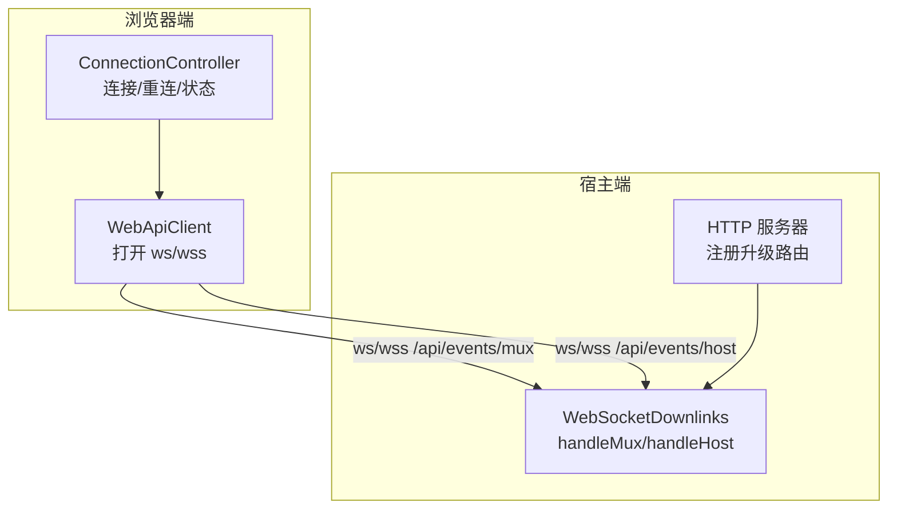
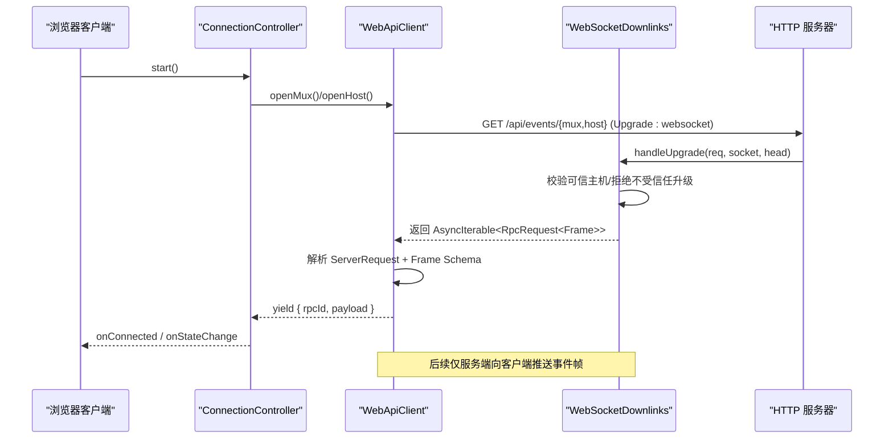
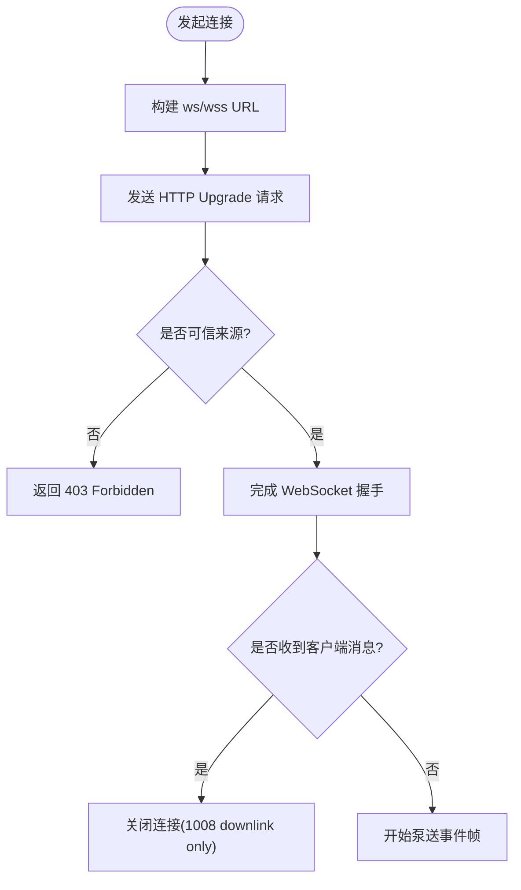
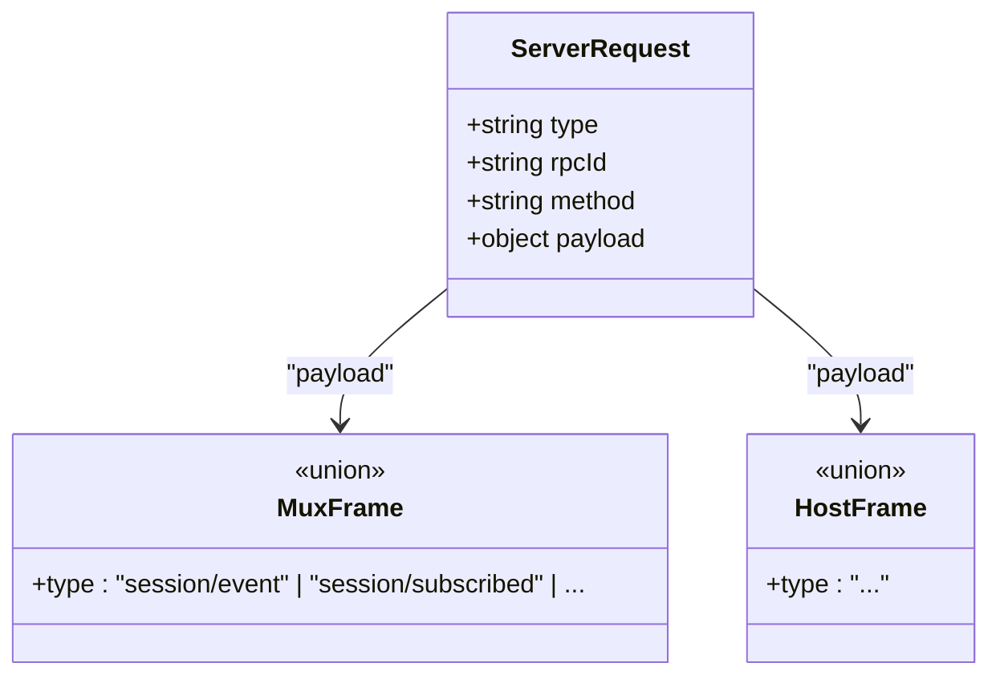
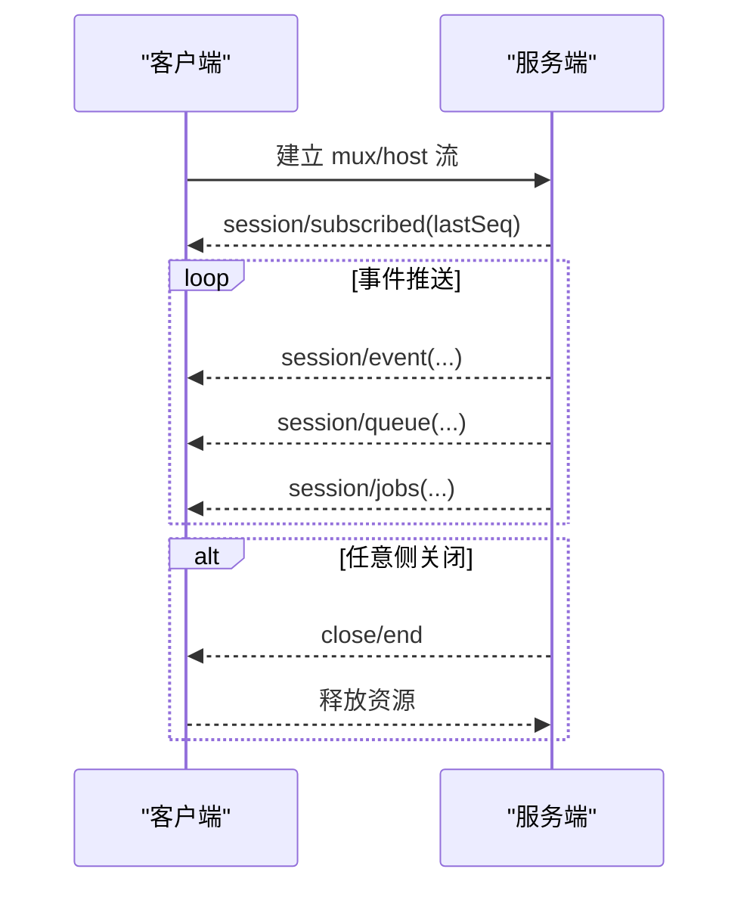
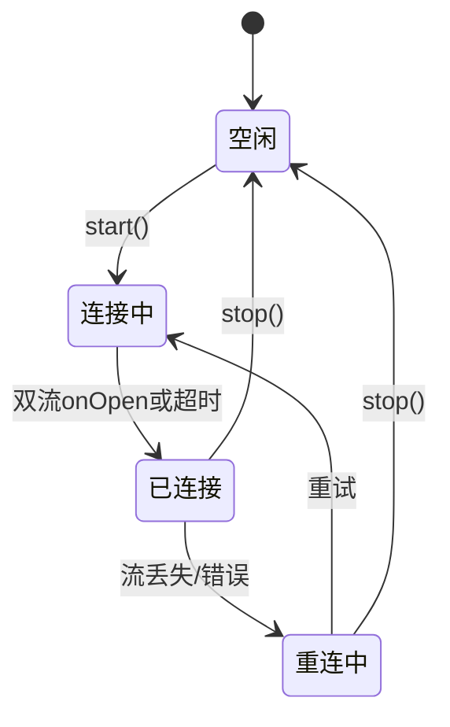
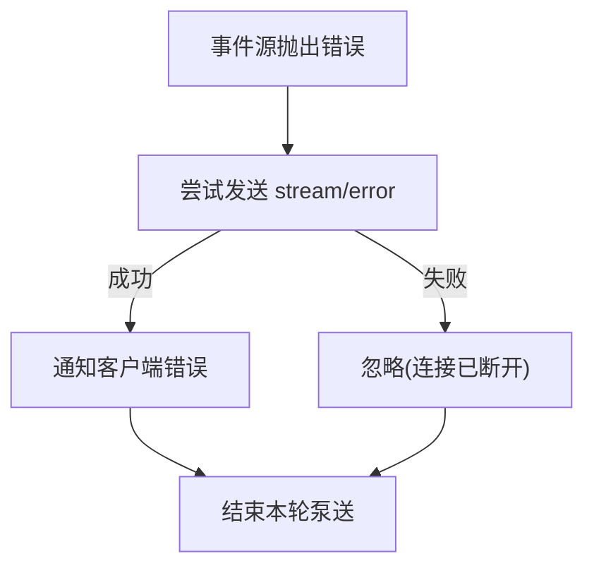
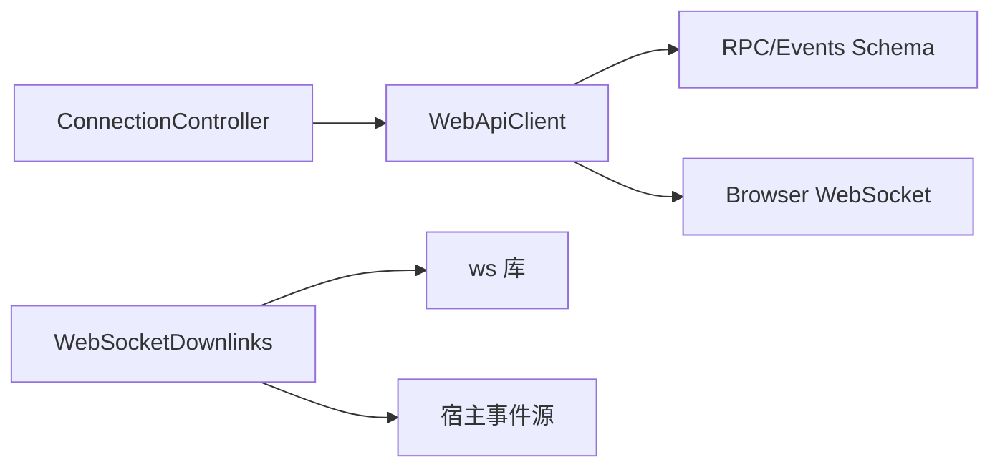

# WebSocket API

<cite>
**本文引用的文件**
- [websocket-downlink.ts](file://packages/client/connection/src/websocket-downlink.ts)
- [web-api-client.ts](file://packages/client/connection/src/client/web-api-client.ts)
- [index.ts](file://packages/client/connection/src/index.ts)
- [connection.ts](file://packages/client/connection/src/client/connection.ts)
- [rpc-schemas.spec.ts](file://packages/host/apiproxy/tests/rpc-schemas.spec.ts)
- [events.schema.ts](file://packages/host/apiproxy/src/api/events.schema.ts)
- [node-half.host.spec.ts](file://packages/client/connection/tests/node-half.host.spec.ts)
- [websocket-downlink.host.spec.ts](file://packages/client/connection/tests/websocket-downlink.host.spec.ts)
- [webserver.spec.ts](file://packages/host/webserver/tests/webserver.spec.ts)
</cite>

## 目录
1. [简介](#简介)
2. [项目结构](#项目结构)
3. [核心组件](#核心组件)
4. [架构总览](#架构总览)
5. [详细组件分析](#详细组件分析)
6. [依赖关系分析](#依赖关系分析)
7. [性能考虑](#性能考虑)
8. [故障排查指南](#故障排查指南)
9. [结论](#结论)
10. [附录](#附录)

## 简介
本文件面向使用 Harness 的客户端与宿主端开发者，系统化文档化基于 WebSocket 的事件流 API。内容涵盖：
- 连接建立过程、握手协议与参数
- 事件类型、消息格式与数据传输协议
- 实时通信模式：流式响应、事件订阅与广播
- 连接管理、重连策略与错误处理
- 安全考虑：身份验证与访问控制
- 客户端实现示例与调试方法

## 项目结构
WebSocket 能力由“浏览器端连接层”和“宿主端承载层”共同实现：
- 浏览器端通过 WebApiClient 打开两个只下行（downlink-only）的 WebSocket 通道，分别用于多路复用事件流与宿主事件流。
- 宿主端通过 WebSocketDownlinks 接收 HTTP Upgrade 请求，完成握手后泵送事件帧到客户端。
- 连接控制器 ConnectionController 负责生命周期、重试与状态同步。

**图表来源**
- [web-api-client.ts:18-32](file://packages/client/connection/src/client/web-api-client.ts#L18-L32)
- [websocket-downlink.ts:64-82](file://packages/client/connection/src/websocket-downlink.ts#L64-L82)
- [index.ts:181-194](file://packages/client/connection/src/index.ts#L181-L194)

**章节来源**
- [web-api-client.ts:1-92](file://packages/client/connection/src/client/web-api-client.ts#L1-L92)
- [websocket-downlink.ts:1-154](file://packages/client/connection/src/websocket-downlink.ts#L1-L154)
- [index.ts:121-196](file://packages/client/connection/src/index.ts#L121-L196)

## 核心组件
- WebApiClient：浏览器端 API 载体，将 RPC 调用走 HTTP，事件流走 WebSocket；维护每个流的解析与投递。
- WebSocketDownlinks：宿主端 WebSocket 承载，负责 Upgrade、校验、帧泵送与关闭。
- ConnectionController：连接控制器，负责启动/停止、指数退避重连、超时保护与状态机。
- 路由与安全：在 index.ts 中注册升级路由并执行可信主机检查，拒绝不受信任的 Upgrade。

**章节来源**
- [web-api-client.ts:12-92](file://packages/client/connection/src/client/web-api-client.ts#L12-L92)
- [websocket-downlink.ts:46-154](file://packages/client/connection/src/websocket-downlink.ts#L46-L154)
- [connection.ts:54-95](file://packages/client/connection/src/client/connection.ts#L54-L95)
- [index.ts:181-194](file://packages/client/connection/src/index.ts#L181-L194)

## 架构总览
下图展示一次完整的连接建立与事件推送流程，包括握手、鉴权、帧封装与投递。

**图表来源**
- [web-api-client.ts:34-90](file://packages/client/connection/src/client/web-api-client.ts#L34-L90)
- [websocket-downlink.ts:99-137](file://packages/client/connection/src/websocket-downlink.ts#L99-L137)
- [index.ts:181-194](file://packages/client/connection/src/index.ts#L181-L194)

## 详细组件分析

### 连接建立与握手协议
- 路径与协议
  - 多路复用事件流：/api/events/mux，协议 ws/wss
  - 宿主事件流：/api/events/host，协议 ws/wss
- 握手要点
  - 客户端构造 URL，自动将 https 映射为 wss，http 映射为 ws
  - 服务端通过 HTTP 服务器的 Upgrade 机制接管连接
  - 在协议协商前，若来源不可信则直接返回 403 Forbidden
  - 首次收到客户端消息即关闭连接（downlink only），禁止上行流量

**图表来源**
- [web-api-client.ts:34-42](file://packages/client/connection/src/client/web-api-client.ts#L34-L42)
- [websocket-downlink.ts:105-115](file://packages/client/connection/src/websocket-downlink.ts#L105-L115)
- [websocket-downlink.ts:144-153](file://packages/client/connection/src/websocket-downlink.ts#L144-L153)

**章节来源**
- [web-api-client.ts:34-90](file://packages/client/connection/src/client/web-api-client.ts#L34-L90)
- [websocket-downlink.ts:99-153](file://packages/client/connection/src/websocket-downlink.ts#L99-L153)
- [node-half.host.spec.ts:128-162](file://packages/client/connection/tests/node-half.host.spec.ts#L128-L162)

### 事件类型、消息格式与传输协议
- 传输层
  - 每条消息为 JSON 字符串，包裹在统一的 ServerRequest 信封中，包含 type、rpcId、method、payload
  - 客户端对 envelope 进行 schema 校验，再对 payload 按具体 frame schema 校验
- 事件帧（部分示例）
  - session/event：会话事件推送
  - session/subscribed：订阅确认，携带 lastSeq
  - approval/requested、approval/resolved：审批事件
  - question/requested、question/resolved：问答交互
  - session/queue、session/projection、session/jobs：队列、投影与任务列表
- 错误帧
  - stream/error：当源迭代器抛出异常时，服务端会发送统一错误帧

**图表来源**
- [rpc-schemas.spec.ts:103-114](file://packages/host/apiproxy/tests/rpc-schemas.spec.ts#L103-L114)
- [rpc-schemas.spec.ts:439-458](file://packages/host/apiproxy/tests/rpc-schemas.spec.ts#L439-L458)
- [events.schema.ts](file://packages/host/apiproxy/src/api/events.schema.ts)

**章节来源**
- [web-api-client.ts:51-63](file://packages/client/connection/src/client/web-api-client.ts#L51-L63)
- [rpc-schemas.spec.ts:103-114](file://packages/host/apiproxy/tests/rpc-schemas.spec.ts#L103-L114)
- [rpc-schemas.spec.ts:439-458](file://packages/host/apiproxy/tests/rpc-schemas.spec.ts#L439-L458)

### 实时通信模式
- 流式响应
  - 服务端以异步迭代器产生帧，逐条通过 WebSocket 推送
  - 客户端以生成器消费，遇到 end 或信号中止即退出
- 事件订阅
  - 客户端通过 openMux/openHost 获取流，订阅对应事件类型
  - 首次订阅会收到 session/subscribed，携带 lastSeq 以便断线续传
- 广播机制
  - 同一事件可被多个消费者监听；单个监听器抛错不会影响其他监听器

**图表来源**
- [websocket-downlink.ts:118-137](file://packages/client/connection/src/websocket-downlink.ts#L118-L137)
- [web-api-client.ts:74-82](file://packages/client/connection/src/client/web-api-client.ts#L74-L82)

**章节来源**
- [websocket-downlink.ts:118-137](file://packages/client/connection/src/websocket-downlink.ts#L118-L137)
- [web-api-client.ts:74-82](file://packages/client/connection/src/client/web-api-client.ts#L74-L82)

### 连接管理与重连策略
- 连接控制器
  - 启动后同时打开两条流，等待双方 onOpen 或超时保护
  - 失败时按指数退避重试，支持最大延迟与抖动
  - 提供状态回调（connected/reconnecting）与去抖
- 生命周期
  - stop 会中止当前代次的所有流，避免悬挂
  - 关闭时确保清理所有资源

**图表来源**
- [connection.ts:54-95](file://packages/client/connection/src/client/connection.ts#L54-L95)
- [connection.client.spec.ts:215-248](file://packages/client/connection/tests/connection.client.spec.ts#L215-L248)

**章节来源**
- [connection.ts:54-95](file://packages/client/connection/src/client/connection.ts#L54-L95)
- [connection.client.spec.ts:1-248](file://packages/client/connection/tests/connection.client.spec.ts#L1-L248)

### 错误处理方案
- 网络层
  - 发送失败或连接丢失时，服务端尝试发送 stream/error 帧
  - 客户端捕获二进制帧等非法数据并丢弃，记录错误日志
- 业务层
  - 监听器抛错被隔离，不影响其他监听器
  - 连接控制器在状态变化时输出告警，便于定位问题

**图表来源**
- [websocket-downlink.ts:118-137](file://packages/client/connection/src/websocket-downlink.ts#L118-L137)
- [web-api-client.ts:51-63](file://packages/client/connection/src/client/web-api-client.ts#L51-L63)

**章节来源**
- [websocket-downlink.ts:118-137](file://packages/client/connection/src/websocket-downlink.ts#L118-L137)
- [web-api-client.ts:51-63](file://packages/client/connection/src/client/web-api-client.ts#L51-L63)

### 安全考虑：身份验证与访问控制
- 可信主机白名单
  - 在注册升级路由前校验来源，非受信来源直接拒绝
- 特权方法限制
  - 某些敏感方法强制回环地址访问，即使配置了可信主机也拒绝远程调用
- 升级前防护
  - 未通过协议协商前的任何上游消息将被拒绝并关闭连接

**章节来源**
- [index.ts:181-194](file://packages/client/connection/src/index.ts#L181-L194)
- [node-half.host.spec.ts:128-192](file://packages/client/connection/tests/node-half.host.spec.ts#L128-L192)
- [websocket-downlink.ts:144-153](file://packages/client/connection/src/websocket-downlink.ts#L144-L153)

### 客户端实现示例与调试方法
- 基本步骤
  - 创建 ConnectionController，传入 ApiClient 与回调
  - 调用 start() 进入连接循环
  - 监听 onConnected/onStateChange 处理 UI 状态
  - 在 onConnected 中订阅所需事件类型
- 调试建议
  - 观察控制台错误日志（如 malformed frame）
  - 使用浏览器开发者工具查看 WebSocket 帧
  - 通过测试用例中的行为模拟异常场景（发送失败、关闭提前等）

**章节来源**
- [connection.ts:54-95](file://packages/client/connection/src/client/connection.ts#L54-L95)
- [websocket-downlink.host.spec.ts:233-308](file://packages/client/connection/tests/websocket-downlink.host.spec.ts#L233-L308)

## 依赖关系分析
- 模块耦合
  - WebApiClient 依赖事件帧 schema 与 RPC schema 进行解析
  - WebSocketDownlinks 依赖 ws 库与宿主 API 的事件源
  - ConnectionController 依赖 ApiClient 抽象，屏蔽平台差异
- 外部依赖
  - ws 库用于 Node 端 WebSocket 服务
  - fetch/WebSocket 用于浏览器端传输

**图表来源**
- [web-api-client.ts:3-7](file://packages/client/connection/src/client/web-api-client.ts#L3-L7)
- [websocket-downlink.ts:3-10](file://packages/client/connection/src/websocket-downlink.ts#L3-L10)
- [connection.ts:54-95](file://packages/client/connection/src/client/connection.ts#L54-L95)

**章节来源**
- [web-api-client.ts:1-92](file://packages/client/connection/src/client/web-api-client.ts#L1-L92)
- [websocket-downlink.ts:1-154](file://packages/client/connection/src/websocket-downlink.ts#L1-L154)
- [connection.ts:54-95](file://packages/client/connection/src/client/connection.ts#L54-L95)

## 性能考虑
- 低开销推送
  - 服务端以异步迭代器按需推送，避免阻塞
  - 客户端使用生成器拉取，减少内存占用
- 背压与缓冲
  - 客户端内部使用 inbox 队列与唤醒机制，避免事件堆积导致主线程卡顿
- 重连优化
  - 指数退避加随机抖动，降低雪崩风险
  - 超时保护避免长时间挂起

[本节为通用指导，不直接分析具体文件]

## 故障排查指南
- 常见问题
  - 403 Forbidden：来源不在可信主机白名单或使用了不受信任的 Upgrade
  - 1008 downlink only：客户端误向上行发送消息
  - malformed frame：JSON 或 schema 校验失败
- 定位方法
  - 检查浏览器控制台与网络面板的 WebSocket 帧
  - 核对服务端日志中的错误信息
  - 参考测试用例复现边界情况（发送失败、提前关闭等）

**章节来源**
- [node-half.host.spec.ts:128-162](file://packages/client/connection/tests/node-half.host.spec.ts#L128-L162)
- [websocket-downlink.ts:105-115](file://packages/client/connection/src/websocket-downlink.ts#L105-L115)
- [web-api-client.ts:51-63](file://packages/client/connection/src/client/web-api-client.ts#L51-L63)

## 结论
该 WebSocket API 采用“HTTP 上行 + 只下行 WebSocket 事件流”的设计，结合严格的来源校验与 schema 校验，提供了稳定、可扩展的实时通信能力。连接控制器实现了健壮的重连与状态管理，适合构建高可用的前端体验。

[本节为总结性内容，不直接分析具体文件]

## 附录
- 相关测试与规范
  - 事件帧 schema 与 RPC 信封的兼容性测试
  - 升级路由与重复注册的保护
  - 连接生命周期与重连行为的单元测试

**章节来源**
- [rpc-schemas.spec.ts:103-114](file://packages/host/apiproxy/tests/rpc-schemas.spec.ts#L103-L114)
- [rpc-schemas.spec.ts:439-458](file://packages/host/apiproxy/tests/rpc-schemas.spec.ts#L439-L458)
- [webserver.spec.ts:155-170](file://packages/host/webserver/tests/webserver.spec.ts#L155-L170)