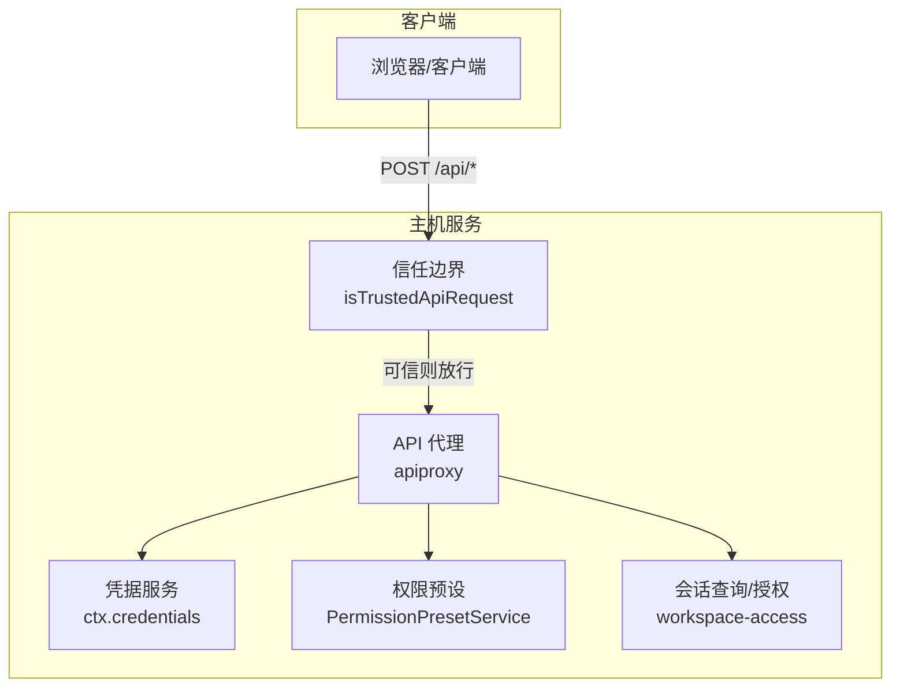
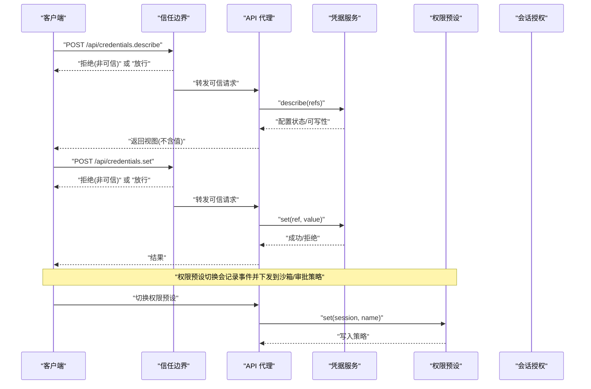
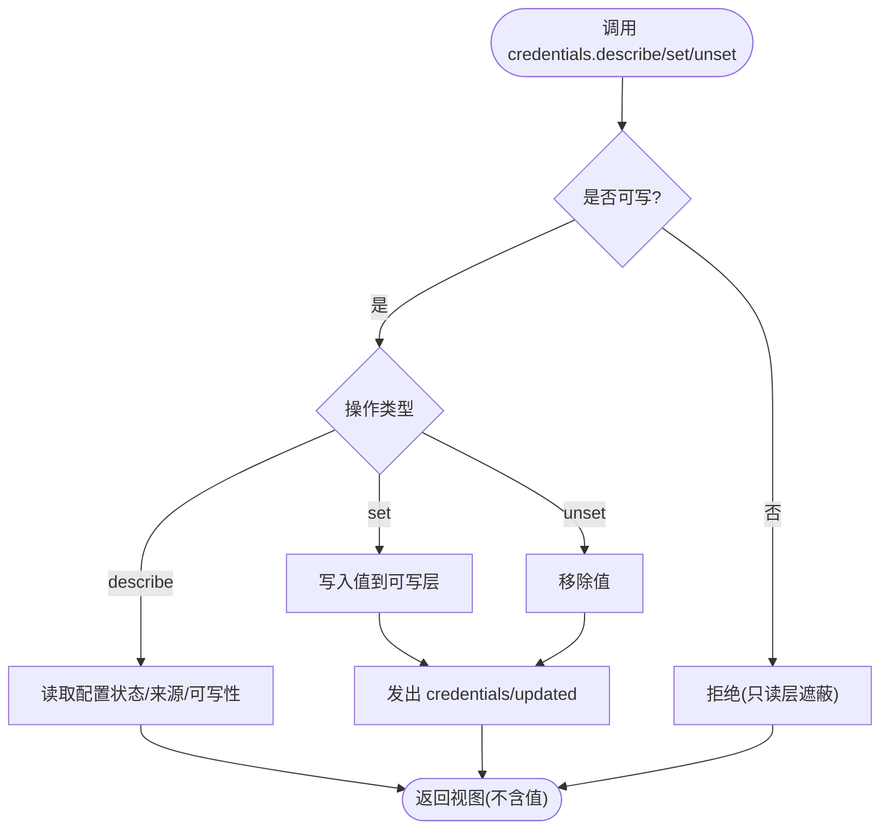
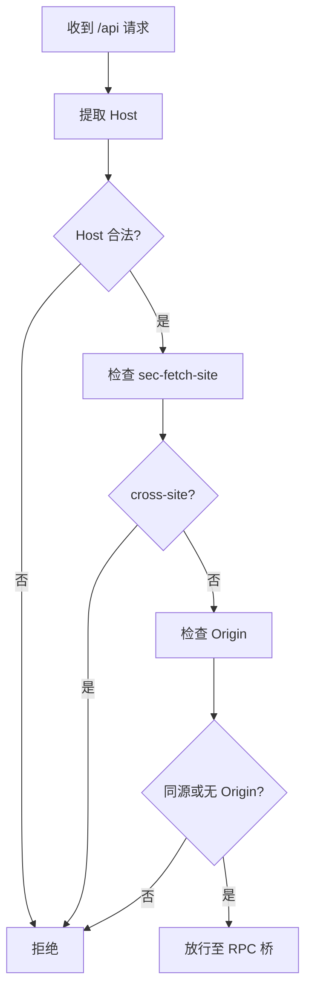
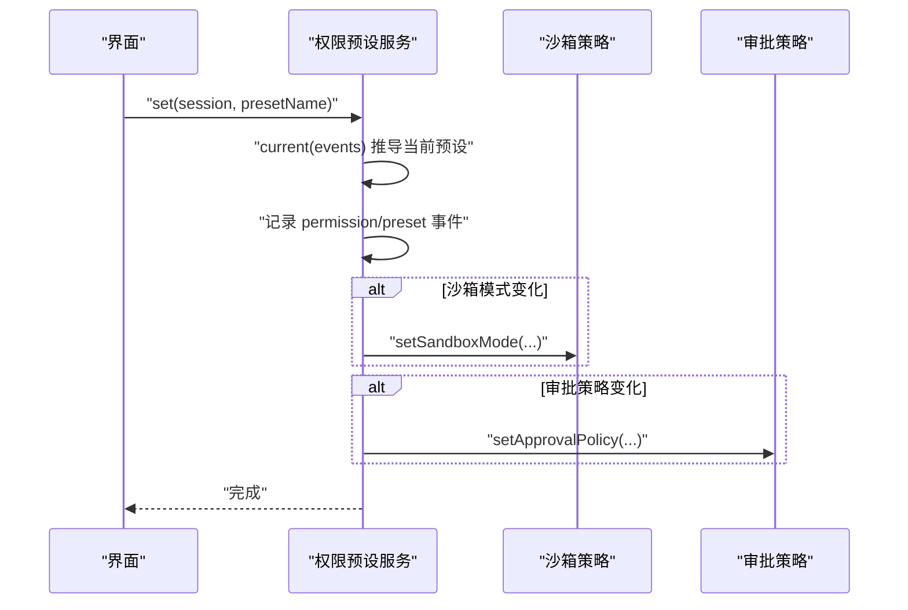
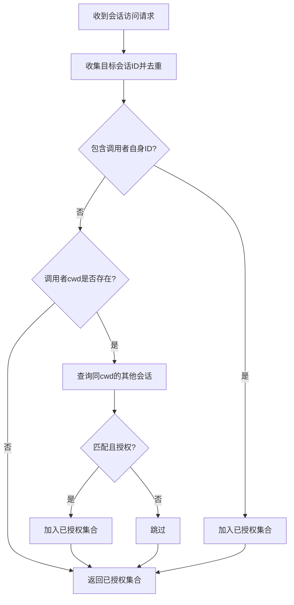
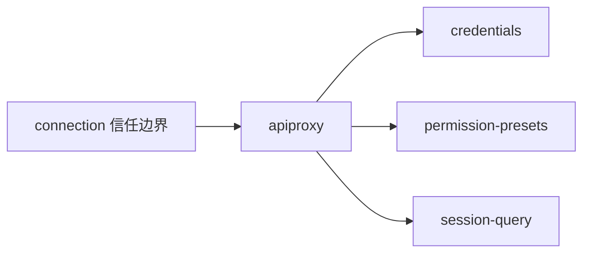

# 认证与授权

<cite>
**本文引用的文件**
- [packages/credentials/credentials/src/index.ts](file://packages/credentials/credentials/src/index.ts)
- [packages/credentials/credentials/tests/credentials.spec.ts](file://packages/credentials/credentials/tests/credentials.spec.ts)
- [packages/host/apiproxy/src/api/credentials.ts](file://packages/host/apiproxy/src/api/credentials.ts)
- [packages/host/apiproxy/src/api-proxy.ts](file://packages/host/apiproxy/src/api-proxy.ts)
- [packages/client/connection/src/api-request-trust.ts](file://packages/client/connection/src/api-request-trust.ts)
- [packages/client/connection/tests/node-half.host.spec.ts](file://packages/client/connection/tests/node-half.host.spec.ts)
- [packages/session-query/tool-session-query/src/workspace-access.ts](file://packages/session-query/tool-session-query/src/workspace-access.ts)
- [docs/subsystems/credentials.md](file://docs/subsystems/credentials.md)
- [docs/subsystems/permission-presets.md](file://docs/subsystems/permission-presets.md)
- [packages/interaction/permission-presets/src/index.ts](file://packages/interaction/permission-presets/src/index.ts)
- [docs/api-gateway.md](file://docs/api-gateway.md)
</cite>

## 目录
1. [简介](#简介)
2. [项目结构](#项目结构)
3. [核心组件](#核心组件)
4. [架构总览](#架构总览)
5. [详细组件分析](#详细组件分析)
6. [依赖关系分析](#依赖关系分析)
7. [性能考虑](#性能考虑)
8. [故障排查指南](#故障排查指南)
9. [结论](#结论)
10. [附录](#附录)

## 简介
本文件系统化梳理本仓库的认证与授权机制，覆盖以下方面：
- 支持的认证方式：API Key（通过凭据系统注入）、浏览器信任边界（Host/Origin/Fetch-Metadata）；未实现 JWT/OAuth 等通用令牌协议。
- 令牌生成、验证与刷新：以“凭据引用”为核心，按操作逐次解析，支持热更新；无集中式签发器或刷新流程。
- 权限模型与角色：基于“权限预设”组合沙箱模式与审批策略；会话级访问控制基于调用者上下文（如工作目录）。
- 配置与使用示例：通过设置与凭据接口描述/写入凭据；Web 端受限方法强制回环访问。
- 安全最佳实践与攻击防护：DNS 重绑定、跨站请求、混淆代理等防御；最小权限与只读优先。
- 会话管理与超时：通过 AbortSignal 进行请求级取消；凭据与权限变更在下次操作生效。

## 项目结构
认证与授权相关代码主要分布在以下位置：
- 凭据抽象与提供者：packages/credentials
- Web API 桥接与凭据 RPC：packages/host/apiproxy
- 浏览器信任边界：packages/client/connection
- 会话访问控制：packages/session-query
- 权限预设与策略：packages/interaction/permission-presets
- API 网关与连接层：docs/api-gateway.md

图表来源
- [packages/client/connection/src/api-request-trust.ts:1-123](file://packages/client/connection/src/api-request-trust.ts#L1-L123)
- [packages/host/apiproxy/src/api-proxy.ts:3321-3368](file://packages/host/apiproxy/src/api-proxy.ts#L3321-L3368)
- [packages/interaction/permission-presets/src/index.ts:394-433](file://packages/interaction/permission-presets/src/index.ts#L394-L433)
- [packages/session-query/tool-session-query/src/workspace-access.ts:90-133](file://packages/session-query/tool-session-query/src/workspace-access.ts#L90-L133)

章节来源
- [docs/api-gateway.md:1-165](file://docs/api-gateway.md#L1-L165)

## 核心组件
- 凭据抽象（CredentialProvider）：提供 resolve/describe/set/unset，空值视为未配置，按操作解析以实现热更新。
- 凭据 RPC（CredentialsApi）：对外暴露 describe/set/unset，读取面不携带值，仅 set 传输敏感值。
- 浏览器信任边界（isTrustedApiRequest）：校验 Host、Origin、sec-fetch-site，抵御 DNS 重绑定与跨站请求。
- 权限预设（PermissionPresetService）：将沙箱模式与审批策略打包为预设，持久化用户选择并下发到各策略。
- 会话访问控制：基于调用者上下文（如 cwd）对目标会话进行授权判定。

章节来源
- [docs/subsystems/credentials.md:1-134](file://docs/subsystems/credentials.md#L1-L134)
- [packages/host/apiproxy/src/api/credentials.ts:1-45](file://packages/host/apiproxy/src/api/credentials.ts#L1-L45)
- [packages/client/connection/src/api-request-trust.ts:1-123](file://packages/client/connection/src/api-request-trust.ts#L1-L123)
- [docs/subsystems/permission-presets.md:1-132](file://docs/subsystems/permission-presets.md#L1-L132)
- [packages/session-query/tool-session-query/src/workspace-access.ts:90-133](file://packages/session-query/tool-session-query/src/workspace-access.ts#L90-L133)

## 架构总览
整体调用链从浏览器/客户端发起 /api 请求开始，经过信任边界检查后进入 API 代理，再路由到具体领域服务（凭据、权限、会话查询等）。

图表来源
- [packages/client/connection/src/api-request-trust.ts:90-123](file://packages/client/connection/src/api-request-trust.ts#L90-L123)
- [packages/host/apiproxy/src/api-proxy.ts:3321-3368](file://packages/host/apiproxy/src/api-proxy.ts#L3321-L3368)
- [packages/interaction/permission-presets/src/index.ts:394-433](file://packages/interaction/permission-presets/src/index.ts#L394-L433)

## 详细组件分析

### 凭据系统（API Key 注入）
- 设计要点
  - 引用类型：凭证以 POSIX 风格环境变量名作为引用，防止混用字符串。
  - 逐操作解析：每次调用重新解析，确保旋转密钥立即生效。
  - 空值语义：空存储值等同于未配置，避免误认为已配置。
  - 只读视图：describe 不暴露值，仅返回 configured/source/writable。
- 典型流程
  - 描述凭据：批量查询多个引用的配置状态与可写性。
  - 写入凭据：仅在可写层写入，若被只读层（如进程环境）遮蔽则拒绝。
  - 移除凭据：幂等，不存在时静默成功。
- 测试要点
  - 空值视为未配置。
  - set/unset 触发更新事件。
  - 服务随 fiber 卸载。

图表来源
- [packages/credentials/credentials/src/index.ts:60-102](file://packages/credentials/credentials/src/index.ts#L60-L102)
- [packages/host/apiproxy/src/api/credentials.ts:12-44](file://packages/host/apiproxy/src/api/credentials.ts#L12-L44)
- [packages/credentials/credentials/tests/credentials.spec.ts:29-71](file://packages/credentials/credentials/tests/credentials.spec.ts#L29-L71)

章节来源
- [docs/subsystems/credentials.md:1-134](file://docs/subsystems/credentials.md#L1-L134)
- [packages/host/apiproxy/src/api/credentials.ts:1-45](file://packages/host/apiproxy/src/api/credentials.ts#L1-L45)
- [packages/credentials/credentials/tests/credentials.spec.ts:1-72](file://packages/credentials/credentials/tests/credentials.spec.ts#L1-L72)

### 浏览器信任边界（防混淆代理与跨站）
- 关键规则
  - Host 必须为回环地址或部署声明的可信主机。
  - sec-fetch-site=cross-site 一律拒绝。
  - 若存在 Origin，必须与 Host 同源；null 源拒绝。
- 作用范围
  - 所有 /api 请求在进入 RPC 桥之前统一检查。
  - 特权方法（如凭据写入、设置、模型发现等）即使来自可信主机也限制为回环访问。

图表来源
- [packages/client/connection/src/api-request-trust.ts:90-123](file://packages/client/connection/src/api-request-trust.ts#L90-L123)
- [packages/client/connection/tests/node-half.host.spec.ts:164-193](file://packages/client/connection/tests/node-half.host.spec.ts#L164-L193)

章节来源
- [packages/client/connection/src/api-request-trust.ts:1-123](file://packages/client/connection/src/api-request-trust.ts#L1-L123)
- [packages/client/connection/tests/node-half.host.spec.ts:164-193](file://packages/client/connection/tests/node-half.host.spec.ts#L164-L193)

### 权限预设与审批策略
- 预设表：将沙箱模式与审批策略打包为命名预设，默认包含“工作区写入+询问”和“危险全量访问+从不”。
- 当前预设推导：基于会话事件折叠出实际生效的沙箱与审批策略，优先保留用户上次选择。
- 切换流程：记录日志型事件 permission/preset，随后通过各自 setter 写入策略，仅当值变化时才写入。
- 初始固定：新会话若无显式选择，则根据默认预设填充缺失的策略事实。

图表来源
- [docs/subsystems/permission-presets.md:46-68](file://docs/subsystems/permission-presets.md#L46-L68)
- [packages/interaction/permission-presets/src/index.ts:394-433](file://packages/interaction/permission-presets/src/index.ts#L394-L433)

章节来源
- [docs/subsystems/permission-presets.md:1-132](file://docs/subsystems/permission-presets.md#L1-L132)
- [packages/interaction/permission-presets/src/index.ts:394-433](file://packages/interaction/permission-presets/src/index.ts#L394-L433)

### 会话访问控制（基于调用者上下文）
- 授权规则：允许访问自身会话；对其他会话需满足调用者 cwd 与目标 header.cwd 一致。
- 批量授权：去重后过滤出调用者可访问的会话 ID 集合。
- 失败处理：不匹配的目标抛出未授权错误。

图表来源
- [packages/session-query/tool-session-query/src/workspace-access.ts:90-133](file://packages/session-query/tool-session-query/src/workspace-access.ts#L90-L133)

章节来源
- [packages/session-query/tool-session-query/src/workspace-access.ts:90-133](file://packages/session-query/tool-session-query/src/workspace-access.ts#L90-L133)

### API 网关与连接层（认证集成点）
- 职责划分：业务服务通过 @Remote/@RemoteScope 暴露方法；网关负责调度、参数校验、返回值校验；连接层负责 RPC 载体、信任边界、取消与响应信封。
- 认证集成：/api 请求先经连接层信任检查，再交由网关或 API 代理处理；未声明的方法走 API 代理路径。

章节来源
- [docs/api-gateway.md:1-165](file://docs/api-gateway.md#L1-L165)

## 依赖关系分析
- 低耦合高内聚
  - 凭据抽象与提供者解耦，RPC 仅暴露视图与写入口。
  - 信任边界独立于业务逻辑，仅关注请求头与可信主机列表。
  - 权限预设与策略分离，预设仅做编排与持久化。
- 直接依赖
  - apiproxy 依赖 credentials 与 permission presets。
  - session-query 依赖调用者上下文进行授权。
  - connection 提供统一的信任边界与 RPC 通道。
- 外部依赖
  - 无 JWT/OAuth 等第三方认证库的直接依赖；认证主要通过凭据注入与网络信任边界实现。

图表来源
- [packages/client/connection/src/api-request-trust.ts:90-123](file://packages/client/connection/src/api-request-trust.ts#L90-L123)
- [packages/host/apiproxy/src/api-proxy.ts:3321-3368](file://packages/host/apiproxy/src/api-proxy.ts#L3321-L3368)
- [packages/interaction/permission-presets/src/index.ts:394-433](file://packages/interaction/permission-presets/src/index.ts#L394-L433)
- [packages/session-query/tool-session-query/src/workspace-access.ts:90-133](file://packages/session-query/tool-session-query/src/workspace-access.ts#L90-L133)

## 性能考虑
- 凭据解析：按操作解析而非缓存，保证热更新但增加少量开销；适合高频小粒度调用。
- 权限预设：仅在值变化时写入策略，减少不必要的事件风暴。
- 会话授权：批量去重后再查询，降低重复 IO。
- 信任边界：轻量头部检查，避免昂贵计算。

## 故障排查指南
- 凭据未生效
  - 检查 describe 返回的 configured/source/writable；确认未被只读层遮蔽。
  - 确认 set 成功后 observe credentials/updated 事件。
- 凭据写入被拒
  - 可能因进程环境变量遮蔽；改用 unset 或调整部署配置。
- 浏览器请求被拒
  - 检查 Host 是否为回环或可信主机；确认 sec-fetch-site 与 Origin 符合预期。
- 权限预设未生效
  - 查看 current(events) 推导结果；确认 permission/preset 事件已记录。
- 会话访问被拒
  - 核对调用者 cwd 与目标 header.cwd 是否一致；确认目标会话不在受保护范围。

章节来源
- [packages/credentials/credentials/tests/credentials.spec.ts:29-71](file://packages/credentials/credentials/tests/credentials.spec.ts#L29-L71)
- [packages/client/connection/tests/node-half.host.spec.ts:164-193](file://packages/client/connection/tests/node-half.host.spec.ts#L164-L193)
- [packages/session-query/tool-session-query/src/workspace-access.ts:90-133](file://packages/session-query/tool-session-query/src/workspace-access.ts#L90-L133)

## 结论
本仓库采用“凭据引用 + 逐操作解析”的轻量认证方案，结合严格的浏览器信任边界与基于预设的权限模型，实现了最小权限与安全可控的执行环境。未引入 JWT/OAuth，而是通过凭据注入与网络层信任检查达成同等目标。建议在生产中遵循最小权限、只读优先、回环优先的原则，并结合部署策略限定可信主机。

## 附录

### 支持的认证方式与说明
- API Key（凭据注入）
  - 通过 ctx.credentials 管理引用与值；LLM 适配器在每次请求时解析，支持热更新。
  - 参考：[凭据文档:1-134](file://docs/subsystems/credentials.md#L1-L134)、[凭据 RPC:1-45](file://packages/host/apiproxy/src/api/credentials.ts#L1-L45)。
- 浏览器信任边界
  - 通过 isTrustedApiRequest 校验 Host/Origin/sec-fetch-site，抵御 DNS 重绑定与跨站请求。
  - 参考：[信任边界实现:1-123](file://packages/client/connection/src/api-request-trust.ts#L1-L123)。
- JWT Token / OAuth
  - 未在仓库中发现相关实现；如需扩展，可在 API 网关或连接层前接入鉴权中间件。

### 令牌生成、验证与刷新流程
- 生成：由外部系统或用户通过凭据写入接口设置值（set）。
- 验证：消费者在每次操作时通过 resolve 获取最新值。
- 刷新：无需集中刷新；修改后立即在下一次操作生效。
- 参考：[凭据抽象:60-102](file://packages/credentials/credentials/src/index.ts#L60-L102)、[凭据测试:29-71](file://packages/credentials/credentials/tests/credentials.spec.ts#L29-L71)。

### 权限模型与角色定义
- 角色：未显式定义“角色”，以“权限预设”组合沙箱与审批策略表达不同能力集。
- 预设：内置 workspace-write + ask、danger-full-access + never；可自定义。
- 参考：[权限预设文档:1-132](file://docs/subsystems/permission-presets.md#L1-L132)、[预设服务:394-433](file://packages/interaction/permission-presets/src/index.ts#L394-L433)。

### 配置与使用示例（路径指引）
- 描述凭据：调用 credentials.describe，传入引用数组，返回配置视图。
  - 参考：[凭据 RPC 接口:22-44](file://packages/host/apiproxy/src/api/credentials.ts#L22-L44)、[代理实现:3321-3335](file://packages/host/apiproxy/src/api-proxy.ts#L3321-L3335)。
- 写入凭据：调用 credentials.set，传入引用与值；注意只读遮蔽。
  - 参考：[代理实现:3337-3351](file://packages/host/apiproxy/src/api-proxy.ts#L3337-L3351)。
- 切换权限预设：调用 PermissionPresetService.set，记录事件并下发策略。
  - 参考：[预设服务:394-433](file://packages/interaction/permission-presets/src/index.ts#L394-L433)。

### 安全最佳实践与常见攻击防护
- 最小权限：优先使用只读预设，按需提升。
- 回环优先：特权方法仅限回环访问，避免远程调用。
- 信任边界：严格校验 Host/Origin/sec-fetch-site，拒绝 cross-site。
- 凭据安全：避免在日志中输出值；使用引用而非明文配置。
- 参考：[信任边界:1-123](file://packages/client/connection/src/api-request-trust.ts#L1-L123)、[凭据文档:1-134](file://docs/subsystems/credentials.md#L1-L134)。

### 会话管理与超时处理
- 会话访问控制：基于调用者 cwd 与目标 header.cwd 一致性判断。
  - 参考：[会话授权:90-133](file://packages/session-query/tool-session-query/src/workspace-access.ts#L90-L133)。
- 超时与取消：通过 AbortSignal 在网关/连接层传播取消信号，避免资源泄漏。
  - 参考：[API 网关:119-128](file://docs/api-gateway.md#L119-L128)。