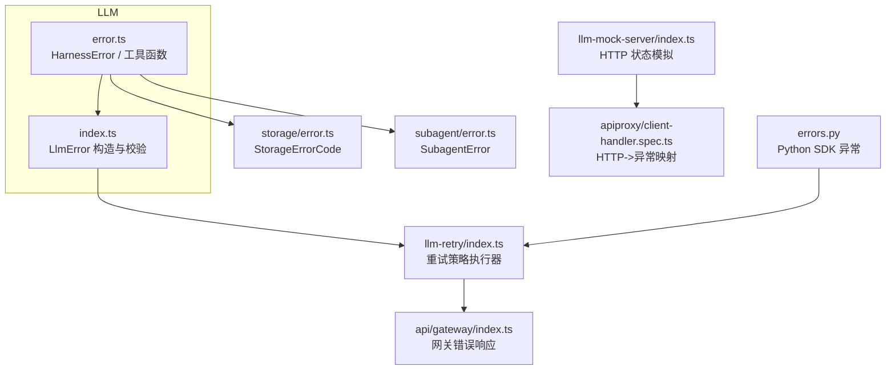
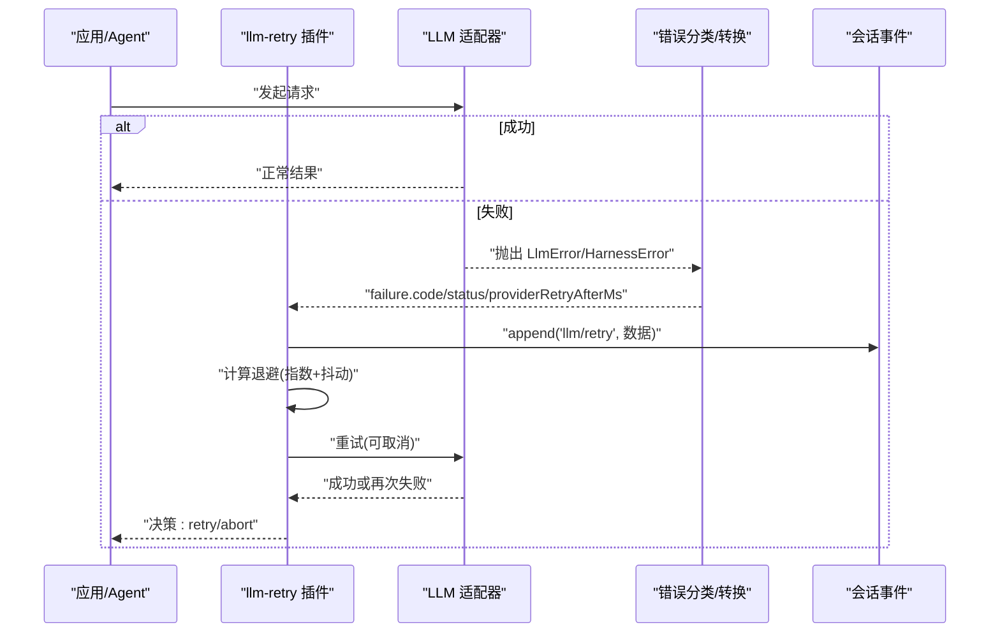
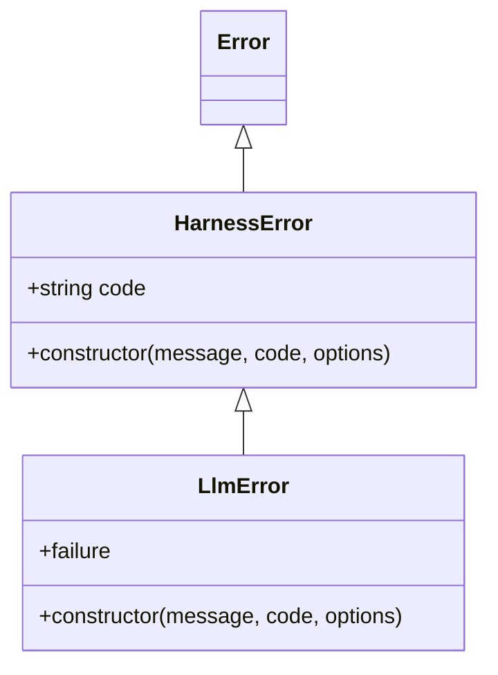
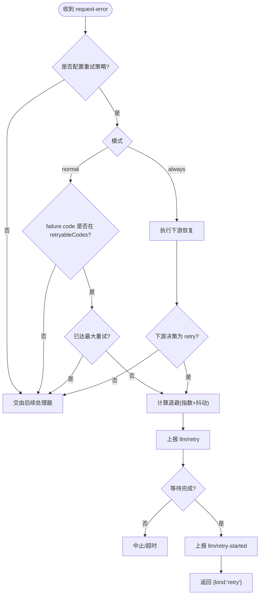
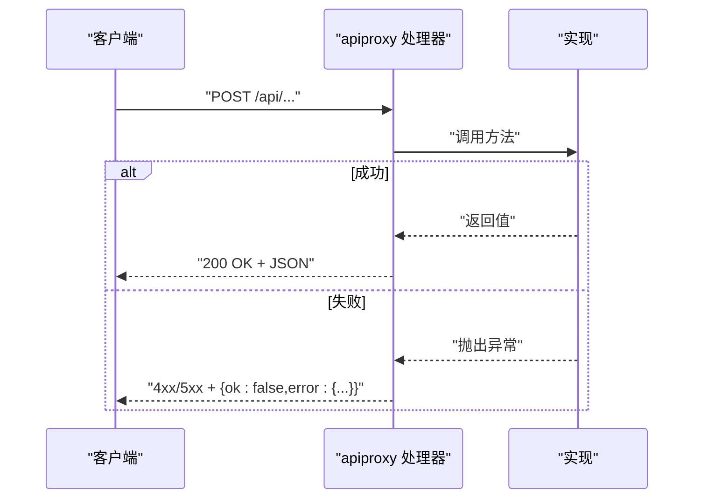
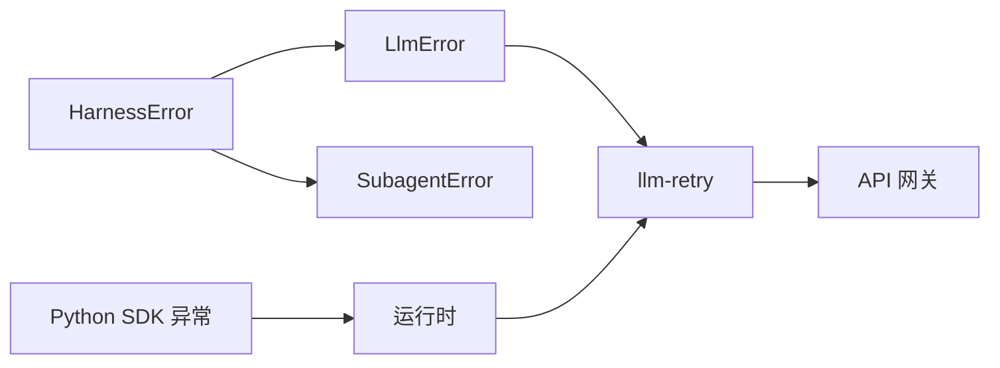

# 错误处理

<cite>
**本文引用的文件**
- [packages/llm/llm/src/error.ts](file://packages/llm/llm/src/error.ts)
- [packages/llm/llm/src/index.ts](file://packages/llm/llm/src/index.ts)
- [packages/llm/llm-retry/src/index.ts](file://packages/llm/llm-retry/src/index.ts)
- [packages/storage/storage/src/error.ts](file://packages/storage/storage/src/error.ts)
- [packages/subagent/subagent/src/error.ts](file://packages/subagent/subagent/src/error.ts)
- [python/sdk/src/deepseek_harness/errors.py](file://python/sdk/src/deepseek_harness/errors.py)
- [packages/schedule/schedule/src/tools.ts](file://packages/schedule/schedule/src/tools.ts)
- [packages/test-support/llm-mock-server/src/index.ts](file://packages/test-support/llm-mock-server/src/index.ts)
- [packages/host/apiproxy/tests/client-handler.spec.ts](file://packages/host/apiproxy/tests/client-handler.spec.ts)
- [packages/api/gateway/src/index.ts](file://packages/api/gateway/src/index.ts)
- [packages/api/gateway/src/client/index.ts](file://packages/api/gateway/src/client/index.ts)
</cite>

## 目录
1. [简介](#简介)
2. [项目结构](#项目结构)
3. [核心组件](#核心组件)
4. [架构总览](#架构总览)
5. [详细组件分析](#详细组件分析)
6. [依赖关系分析](#依赖关系分析)
7. [性能考量](#性能考量)
8. [故障排查指南](#故障排查指南)
9. [结论](#结论)
10. [附录](#附录)

## 简介
本文件系统化梳理 deepseek-harness 的错误处理体系，覆盖：
- 统一错误基类与稳定错误码（code）的设计
- LLM 适配器失败、存储、子代理等域的错误模型
- HTTP/JSON-RPC 错误响应格式与状态码映射
- 常见错误的诊断方法与解决建议
- 错误日志记录与监控事件
- 客户端错误处理最佳实践
- 重试机制与降级策略

## 项目结构
错误处理贯穿多个包：
- LLM 层提供统一的 HarnessError/LlmError 与失败分类工具
- 重试插件在 agent 循环的请求错误扩展点实施退避与重试
- 存储、子代理等子系统定义各自稳定的错误码集合
- Python SDK 暴露运行时/传输层异常类型
- API 网关与测试服务器演示 HTTP 状态码与错误体

图表来源
- [packages/llm/llm/src/error.ts:1-164](file://packages/llm/llm/src/error.ts#L1-L164)
- [packages/llm/llm/src/index.ts:87-117](file://packages/llm/llm/src/index.ts#L87-L117)
- [packages/llm/llm-retry/src/index.ts:99-227](file://packages/llm/llm-retry/src/index.ts#L99-L227)
- [packages/storage/storage/src/error.ts:1-36](file://packages/storage/storage/src/error.ts#L1-L36)
- [packages/subagent/subagent/src/error.ts:1-16](file://packages/subagent/subagent/src/error.ts#L1-L16)
- [python/sdk/src/deepseek_harness/errors.py:1-24](file://python/sdk/src/deepseek_harness/errors.py#L1-L24)
- [packages/api/gateway/src/index.ts:475-475](file://packages/api/gateway/src/index.ts#L475-L475)
- [packages/test-support/llm-mock-server/src/index.ts:500-539](file://packages/test-support/llm-mock-server/src/index.ts#L500-L539)
- [packages/host/apiproxy/tests/client-handler.spec.ts:333-344](file://packages/host/apiproxy/tests/client-handler.spec.ts#L333-L344)

章节来源
- [packages/llm/llm/src/error.ts:1-164](file://packages/llm/llm/src/error.ts#L1-L164)
- [packages/llm/llm/src/index.ts:87-117](file://packages/llm/llm/src/index.ts#L87-L117)
- [packages/llm/llm-retry/src/index.ts:99-227](file://packages/llm/llm-retry/src/index.ts#L99-L227)
- [packages/storage/storage/src/error.ts:1-36](file://packages/storage/storage/src/error.ts#L1-L36)
- [packages/subagent/subagent/src/error.ts:1-16](file://packages/subagent/subagent/src/error.ts#L1-L16)
- [python/sdk/src/deepseek_harness/errors.py:1-24](file://python/sdk/src/deepseek_harness/errors.py#L1-L24)
- [packages/test-support/llm-mock-server/src/index.ts:500-539](file://packages/test-support/llm-mock-server/src/index.ts#L500-L539)
- [packages/host/apiproxy/tests/client-handler.spec.ts:333-344](file://packages/host/apiproxy/tests/client-handler.spec.ts#L333-L344)
- [packages/api/gateway/src/index.ts:475-475](file://packages/api/gateway/src/index.ts#L475-L475)

## 核心组件
- 统一错误基类与工具
  - HarnessError：携带稳定 code、message 与 cause 链；name 默认子类名
  - LlmError：在 HarnessError 之上增加 failure 快照（含 status、providerRetryAfterMs、requestId），并严格校验参数
  - 工具函数：isContextWindowExceededError、isQuotaExceededError、errorChain、isHarnessError
- 领域错误
  - StorageError：存储域错误码枚举（如 backend-not-found、closed 等）
  - SubagentError：子代理域错误，继承 HarnessError
- Python SDK 异常
  - HarnessError、TransportClosedError、SdkProtocolError、JsonRpcError
- 重试策略
  - llm-retry：基于 provider 配置的重试模式（normal/always）、指数退避、抖动、可取消等待、事件上报
- HTTP/JSON-RPC 错误
  - 网关返回 { ok, error: { code, message, details } }
  - 测试服务器模拟多种 HTTP 状态码（429/500/503 等）
  - apiproxy 将载体失败映射为 HTTP 状态码，并在客户端抛出传输失败

章节来源
- [packages/llm/llm/src/error.ts:1-164](file://packages/llm/llm/src/error.ts#L1-L164)
- [packages/llm/llm/src/index.ts:87-117](file://packages/llm/llm/src/index.ts#L87-L117)
- [packages/storage/storage/src/error.ts:1-36](file://packages/storage/storage/src/error.ts#L1-L36)
- [packages/subagent/subagent/src/error.ts:1-16](file://packages/subagent/subagent/src/error.ts#L1-L16)
- [python/sdk/src/deepseek_harness/errors.py:1-24](file://python/sdk/src/deepseek_harness/errors.py#L1-L24)
- [packages/llm/llm-retry/src/index.ts:99-227](file://packages/llm/llm-retry/src/index.ts#L99-L227)
- [packages/api/gateway/src/index.ts:475-475](file://packages/api/gateway/src/index.ts#L475-L475)
- [packages/test-support/llm-mock-server/src/index.ts:500-539](file://packages/test-support/llm-mock-server/src/index.ts#L500-L539)
- [packages/host/apiproxy/tests/client-handler.spec.ts:333-344](file://packages/host/apiproxy/tests/client-handler.spec.ts#L333-L344)

## 架构总览
下图展示一次 LLM 请求从调用到错误处理的完整链路，包括重试与事件上报。

图表来源
- [packages/llm/llm-retry/src/index.ts:111-208](file://packages/llm/llm-retry/src/index.ts#L111-L208)
- [packages/llm/llm/src/index.ts:87-117](file://packages/llm/llm/src/index.ts#L87-L117)
- [packages/llm/llm/src/error.ts:1-164](file://packages/llm/llm/src/error.ts#L1-L164)

## 详细组件分析

### LLM 错误模型与分类
- 基类与常量
  - HarnessError：稳定 code 用于路由，message 用于人类可读信息，支持 cause 链
  - 常量：CONTEXT_WINDOW_EXCEEDED_CODE、QUOTA_EXCEEDED_CODE、EMPTY_RESPONSE_CODE、INVALID_CREDENTIAL_CODE
- LlmError
  - 构造时校验 message/code/status/providerRetryAfterMs/requestId
  - 冻结 failure 快照，包含 message、code、status、providerRetryAfterMs、requestId
- 分类工具
  - isContextWindowExceededError：识别上下文窗口超限
  - isQuotaExceededError：识别配额耗尽（非瞬时限流）
  - errorChain：渲染完整 cause 链与 AggregateError 成员
  - isHarnessError：跨边界安全类型收窄

图表来源
- [packages/llm/llm/src/error.ts:1-164](file://packages/llm/llm/src/error.ts#L1-L164)
- [packages/llm/llm/src/index.ts:87-117](file://packages/llm/llm/src/index.ts#L87-L117)

章节来源
- [packages/llm/llm/src/error.ts:1-164](file://packages/llm/llm/src/error.ts#L1-L164)
- [packages/llm/llm/src/index.ts:87-117](file://packages/llm/llm/src/index.ts#L87-L117)

### 存储域错误
- StorageError：固定 code 枚举（backend-not-found、form-not-mounted、duplicate-backend、duplicate-mount、version-mismatch、malformed-medium、closed）
- 使用方式：以 code 作为稳定分支依据，message 用于诊断

章节来源
- [packages/storage/storage/src/error.ts:1-36](file://packages/storage/storage/src/error.ts#L1-L36)

### 子代理域错误
- SubagentError：继承 HarnessError，name 固定为 SubagentError
- 适用于子代理服务与提供者操作的统一错误表达

章节来源
- [packages/subagent/subagent/src/error.ts:1-16](file://packages/subagent/subagent/src/error.ts#L1-L16)

### Python SDK 错误
- 异常层次：
  - HarnessError：基础异常
  - TransportClosedError：运行时子进程退出或 stdout 关闭
  - SdkProtocolError：运行时发送了协议外数据
  - JsonRpcError：运行时返回 JSON-RPC 错误响应（含 code/message/data）

章节来源
- [python/sdk/src/deepseek_harness/errors.py:1-24](file://python/sdk/src/deepseek_harness/errors.py#L1-L24)

### 重试机制与降级策略
- 触发点：agent/request-error 事件
- 策略模式
  - normal：按 maxRetries 限制次数，仅对 retryableCodes 匹配的错误重试
  - always：始终尝试下游恢复，忽略下游恢复失败并记录警告
- 退避算法
  - 指数退避 + 随机抖动，上限受 maxDelayMs 约束
  - 若 provider 提供 providerRetryAfterMs，优先采用（不超过策略上限）
- 可取消性
  - 使用 AbortSignal 组合信号，确保生命周期中止时立即停止等待
- 事件上报
  - 每次退避前上报 llm/retry，开始重试上报 llm/retry-started

图表来源
- [packages/llm/llm-retry/src/index.ts:111-208](file://packages/llm/llm-retry/src/index.ts#L111-L208)
- [packages/llm/llm-retry/src/index.ts:156-208](file://packages/llm/llm-retry/src/index.ts#L156-L208)

章节来源
- [packages/llm/llm-retry/src/index.ts:99-227](file://packages/llm/llm-retry/src/index.ts#L99-L227)

### HTTP/JSON-RPC 错误响应与状态码
- 网关错误响应
  - 统一格式：{ ok: false, error: { code, message, details } }
  - 示例：cancelled 场景返回 code 为 cancelled
- 测试服务器模拟
  - 429 rate_limit、500 server_error、503 service_unavailable、auth_error 等
- apiproxy 映射
  - 未知方法 -> 404
  - 非 JSON 请求体 -> 400
  - 实现崩溃 -> 500，并在客户端抛出“transport failure”

图表来源
- [packages/host/apiproxy/tests/client-handler.spec.ts:333-344](file://packages/host/apiproxy/tests/client-handler.spec.ts#L333-L344)
- [packages/api/gateway/src/index.ts:475-475](file://packages/api/gateway/src/index.ts#L475-L475)
- [packages/test-support/llm-mock-server/src/index.ts:500-539](file://packages/test-support/llm-mock-server/src/index.ts#L500-L539)

章节来源
- [packages/host/apiproxy/tests/client-handler.spec.ts:333-344](file://packages/host/apiproxy/tests/client-handler.spec.ts#L333-L344)
- [packages/api/gateway/src/index.ts:475-475](file://packages/api/gateway/src/index.ts#L475-L475)
- [packages/test-support/llm-mock-server/src/index.ts:500-539](file://packages/test-support/llm-mock-server/src/index.ts#L500-L539)

### 调度任务错误（示例）
- schedule 工具定义了基础错误 schema 与持久化不确定错误（persistence_uncertain），包含 operation/id 等字段，便于上层区分错误来源与操作类型

章节来源
- [packages/schedule/schedule/src/tools.ts:89-115](file://packages/schedule/schedule/src/tools.ts#L89-L115)

## 依赖关系分析
- LLM 错误基类被多模块复用：
  - LlmError 继承自 HarnessError
  - SubagentError 继承自 HarnessError
- 重试插件依赖 LLM 的 failure 结构与事件总线
- Python SDK 异常与 Node.js 侧通过运行时通信桥接
- 网关与 apiproxy 将内部错误转换为 HTTP 语义，供外部消费

图表来源
- [packages/llm/llm/src/error.ts:1-164](file://packages/llm/llm/src/error.ts#L1-L164)
- [packages/llm/llm/src/index.ts:87-117](file://packages/llm/llm/src/index.ts#L87-L117)
- [packages/subagent/subagent/src/error.ts:1-16](file://packages/subagent/subagent/src/error.ts#L1-L16)
- [packages/llm/llm-retry/src/index.ts:99-227](file://packages/llm/llm-retry/src/index.ts#L99-L227)
- [python/sdk/src/deepseek_harness/errors.py:1-24](file://python/sdk/src/deepseek_harness/errors.py#L1-L24)

章节来源
- [packages/llm/llm/src/error.ts:1-164](file://packages/llm/llm/src/error.ts#L1-L164)
- [packages/llm/llm/src/index.ts:87-117](file://packages/llm/llm/src/index.ts#L87-L117)
- [packages/subagent/subagent/src/error.ts:1-16](file://packages/subagent/subagent/src/error.ts#L1-L16)
- [packages/llm/llm-retry/src/index.ts:99-227](file://packages/llm/llm-retry/src/index.ts#L99-L227)
- [python/sdk/src/deepseek_harness/errors.py:1-24](file://python/sdk/src/deepseek_harness/errors.py#L1-L24)

## 性能考量
- 重试退避上限与抖动避免雪崩
- 可取消等待降低无效资源占用
- 事件上报频率控制（每次退避/开始重试才上报）
- 错误链渲染仅在诊断面使用，避免在生产路径中产生额外开销

[本节为通用指导，不直接分析具体文件]

## 故障排查指南
- 快速定位
  - 优先根据 stable code 判断错误类别（如 QUOTA、RATE_LIMIT、SERVER、TIMEOUT、TRANSPORT 等）
  - 使用 errorChain 打印完整 cause 链，定位最内层根因
- 常见错误与建议
  - 上下文窗口超限：检查输入长度或启用压缩/截断策略
  - 配额耗尽：联系账户管理或调整计费计划
  - 速率限制：遵循 providerRetryAfterMs 或增大退避间隔
  - 认证失败：校验密钥/权限配置
  - 服务端错误/不可用：观察是否瞬时，结合重试策略决定是否继续
  - 存储后端未找到/已关闭：检查挂载与版本兼容性
  - 子代理错误：查看子代理日志与错误码
- 日志与监控
  - 关注 llm/retry 与 llm/retry-started 事件，统计重试次数与延迟分布
  - 网关错误响应中的 code/message/details 用于告警与看板
- 客户端最佳实践
  - 对 4xx 通常不重试（除非幂等且明确可重试）
  - 对 5xx 可结合业务容忍度进行有限重试
  - 解析 { ok, error } 结构，按 code 分支处理
  - 捕获 transport failure 并提示用户或降级

章节来源
- [packages/llm/llm/src/error.ts:1-164](file://packages/llm/llm/src/error.ts#L1-L164)
- [packages/llm/llm-retry/src/index.ts:111-208](file://packages/llm/llm-retry/src/index.ts#L111-L208)
- [packages/api/gateway/src/index.ts:475-475](file://packages/api/gateway/src/index.ts#L475-L475)
- [packages/host/apiproxy/tests/client-handler.spec.ts:333-344](file://packages/host/apiproxy/tests/client-handler.spec.ts#L333-L344)

## 结论
本项目通过统一的错误基类与稳定 code 实现了跨边界的错误可路由与可观测性；LLM 层提供了丰富的分类工具；重试插件实现了可控的退避与事件上报；网关与 apiproxy 将内部错误映射为标准 HTTP 语义。遵循本文档的实践，可在复杂系统中获得一致的错误处理体验与良好的可维护性。

[本节为总结，不直接分析具体文件]

## 附录

### 错误码与状态码速查
- LLM 相关
  - CONTEXT_WINDOW_EXCEEDED：上下文窗口超限
  - QUOTA：配额耗尽
  - EMPTY_RESPONSE：空响应（无内容块）
  - INVALID_CREDENTIAL：凭证无效
  - RATE_LIMIT：速率限制
  - SERVER：服务端错误
  - TIMEOUT：超时
  - TRANSPORT：传输错误
  - AUTH：认证失败
- 存储域
  - backend-not-found、form-not-mounted、duplicate-backend、duplicate-mount、version-mismatch、malformed-medium、closed
- 调度任务
  - invalid_prompt、invalid_selector、invalid_rule、invalid_time_zone、not_future、time_out_of_range、frequency_too_high、corrupt_schedule_log、internal_error、persistence_uncertain
- HTTP 状态码（示例）
  - 400：请求体非 JSON
  - 404：未知方法
  - 429：速率限制
  - 500：服务端错误
  - 503：服务不可用

章节来源
- [packages/llm/llm/src/error.ts:24-48](file://packages/llm/llm/src/error.ts#L24-L48)
- [packages/storage/storage/src/error.ts:6-15](file://packages/storage/storage/src/error.ts#L6-L15)
- [packages/schedule/schedule/src/tools.ts:89-115](file://packages/schedule/schedule/src/tools.ts#L89-L115)
- [packages/test-support/llm-mock-server/src/index.ts:500-539](file://packages/test-support/llm-mock-server/src/index.ts#L500-L539)
- [packages/host/apiproxy/tests/client-handler.spec.ts:333-344](file://packages/host/apiproxy/tests/client-handler.spec.ts#L333-L344)

### 标准错误响应格式
- HTTP/JSON-RPC 网关
  - 成功：{ ok: true, value: ... }
  - 失败：{ ok: false, error: { code, message, details } }
- LLM 失败快照（failure）
  - 字段：message、code、status（可选）、providerRetryAfterMs（可选）、requestId（可选）

章节来源
- [packages/api/gateway/src/index.ts:475-475](file://packages/api/gateway/src/index.ts#L475-L475)
- [packages/llm/llm/src/index.ts:87-117](file://packages/llm/llm/src/index.ts#L87-L117)