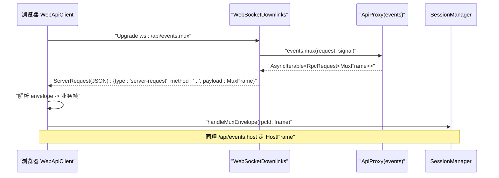
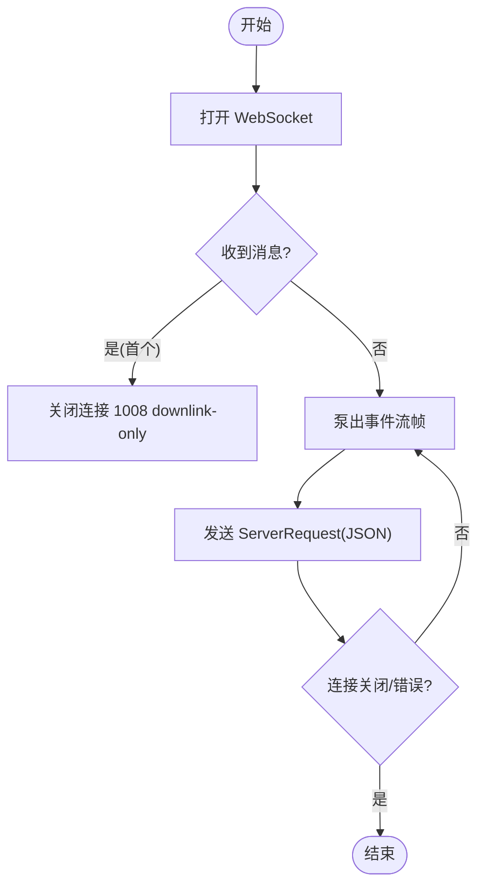
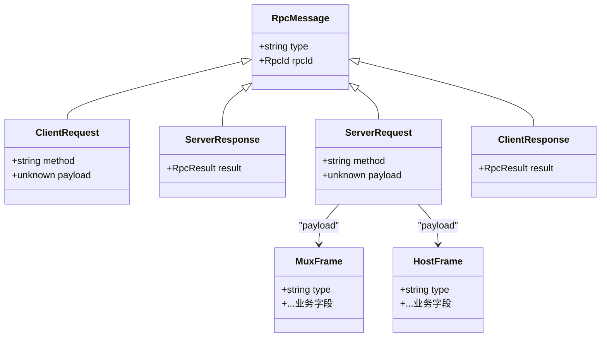
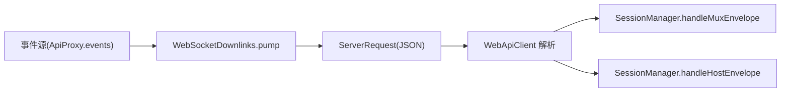
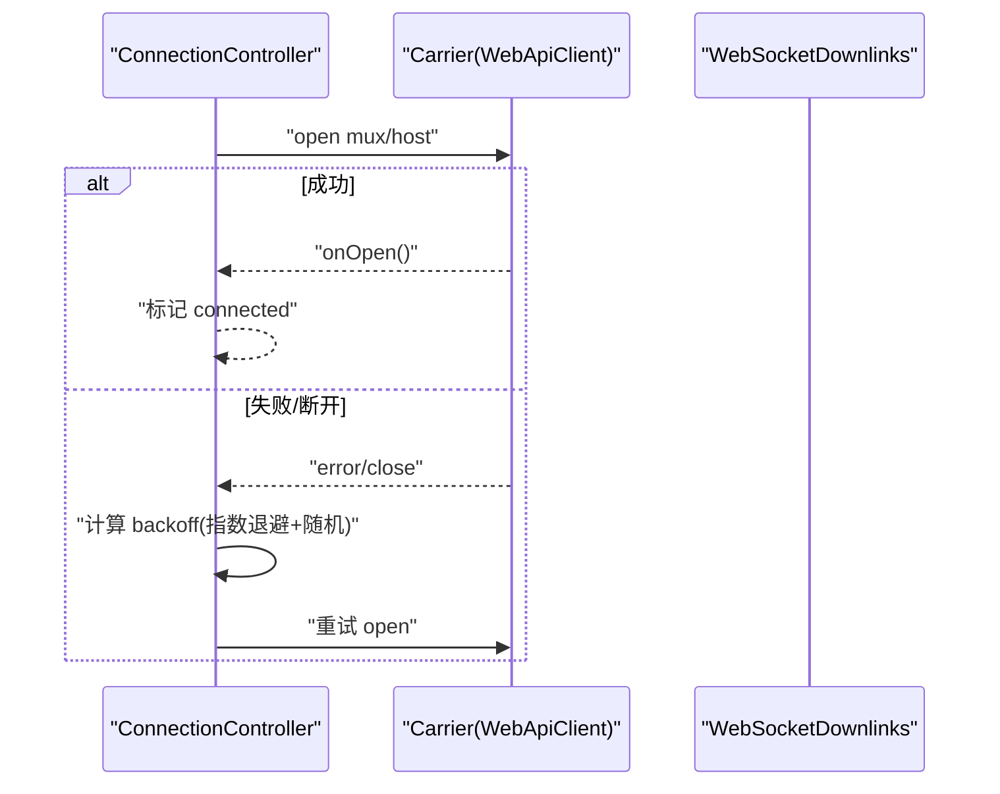
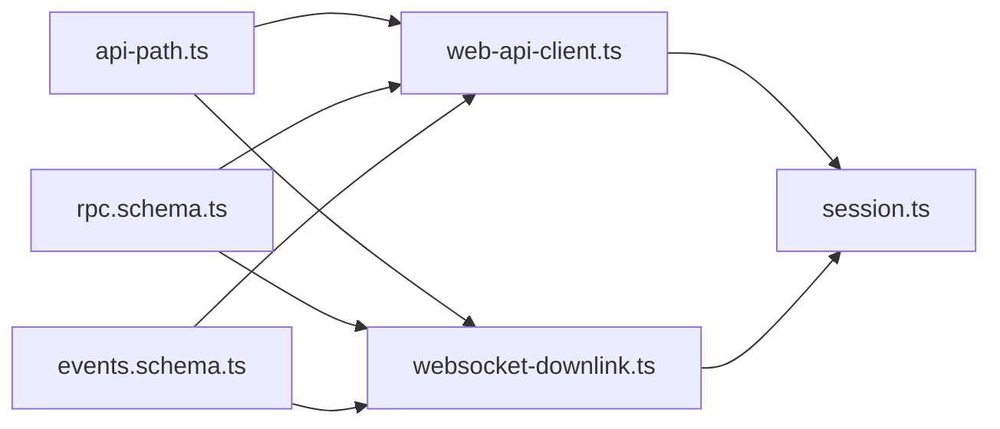
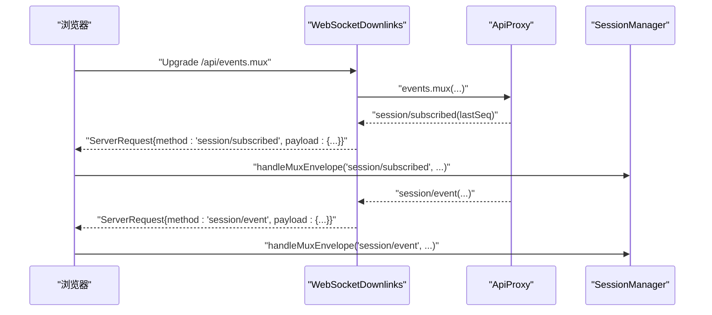

# WebSocket API

<cite>
**本文引用的文件**
- [packages/client/connection/src/websocket-downlink.ts](file://packages/client/connection/src/websocket-downlink.ts)
- [packages/client/connection/src/client/web-api-client.ts](file://packages/client/connection/src/client/web-api-client.ts)
- [packages/client/connection/src/api-path.ts](file://packages/client/connection/src/api-path.ts)
- [packages/host/apiproxy/src/api/rpc.schema.ts](file://packages/host/apiproxy/src/api/rpc.schema.ts)
- [packages/host/apiproxy/src/api/events.schema.ts](file://packages/host/apiproxy/src/api/events.schema.ts)
- [packages/host/apiproxy/src/api/rpc.ts](file://packages/host/apiproxy/src/api/rpc.ts)
- [packages/client/runtime/src/client/sessions/session.ts](file://packages/client/runtime/src/client/sessions/session.ts)
- [packages/client/connection/tests/websocket-downlink.host.spec.ts](file://packages/client/connection/tests/websocket-downlink.host.spec.ts)
- [packages/client/connection/tests/client-apply.client.spec.ts](file://packages/client/connection/tests/client-apply.client.spec.ts)
- [packages/host/apiproxy/tests/fetch-carrier.spec.ts](file://packages/host/apiproxy/tests/fetch-carrier.spec.ts)
- [packages/host/apiproxy/tests/client-handler.spec.ts](file://packages/host/apiproxy/tests/client-handler.spec.ts)
- [packages/host/apiproxy/src/api-proxy.ts](file://packages/host/apiproxy/src/api-proxy.ts)
- [packages/client/connection/src/client/connection.ts](file://packages/client/connection/src/client/connection.ts)
- [packages/mcp/mcp-client/src/connection.ts](file://packages/mcp/mcp-client/src/connection.ts)
</cite>

## 目录
1. [简介](#简介)
2. [项目结构](#项目结构)
3. [核心组件](#核心组件)
4. [架构总览](#架构总览)
5. [详细组件分析](#详细组件分析)
6. [依赖关系分析](#依赖关系分析)
7. [性能考虑](#性能考虑)
8. [故障排查指南](#故障排查指南)
9. [结论](#结论)
10. [附录：消息格式与客户端示例](#附录消息格式与客户端示例)

## 简介
本文件面向 DeepSeek Harness 的 WebSocket 实时通信能力，聚焦浏览器端通过 WebSocket 接收两条下行事件流（mux 与 host），以及 HTTP 上行 RPC 的双向通信模式。文档涵盖连接建立、消息协议、事件类型、状态同步、错误恢复、重连策略、心跳/保活（由上层连接控制器管理）、批量处理与订阅机制，并提供完整的消息格式规范与客户端实现要点。

## 项目结构
WebSocket 相关代码主要分布在以下模块：
- 服务端承载层：将 Host 侧的事件流以 WebSocket 帧推送给浏览器
- 浏览器客户端层：为每条事件流维护一个 WebSocket 连接，解析并投递到会话层
- 协议与模式：统一的四象限 RPC 消息模型与事件帧模式定义

```mermaid
graph TB
subgraph "浏览器"
C["WebApiClient<br/>每个事件流一个 WebSocket"]
S["SessionManager<br/>分发 Mux/Host 帧"]
end
subgraph "服务器"
W["WebSocketDownlinks<br/>升级 mux / host 路径"]
A["ApiProxy<br/>提供 events.mux / events.host"]
end
C --> |ws: /api/events.mux| W
C --> |ws: /api/events.host| W
W --> A
A --> |事件流| W
W --> |ServerRequest(JSON)| C
C --> |RPC POST /api/*| A
```

图表来源
- [packages/client/connection/src/client/web-api-client.ts:18-32](file://packages/client/connection/src/client/web-api-client.ts#L18-L32)
- [packages/client/connection/src/websocket-downlink.ts:64-82](file://packages/client/connection/src/websocket-downlink.ts#L64-L82)
- [packages/client/connection/src/api-path.ts:7-14](file://packages/client/connection/src/api-path.ts#L7-L14)

章节来源
- [packages/client/connection/src/api-path.ts:7-14](file://packages/client/connection/src/api-path.ts#L7-L14)
- [packages/client/connection/src/client/web-api-client.ts:1-92](file://packages/client/connection/src/client/web-api-client.ts#L1-L92)
- [packages/client/connection/src/websocket-downlink.ts:1-154](file://packages/client/connection/src/websocket-downlink.ts#L1-L154)

## 核心组件
- WebSocketDownlinks（服务端）：负责 HTTP Upgrade 到 WebSocket，分别处理 /api/events.mux 与 /api/events.host 两个路径；将 Host 侧 ApiProxy 的事件流泵入 socket；禁止上游消息（downlink-only）。
- WebApiClient（浏览器）：基于 fetch 进行上行 RPC；为 mux 与 host 各打开一个 WebSocket；对收到的 ServerRequest 进行两层校验（通用 RPC 模式 + 业务帧模式），并投递到 onEnvelope。
- 协议模式：统一四象限 RPC（ClientRequest/ServerResponse/ServerRequest/ClientResponse）与两类事件帧（MuxFrame/HostFrame）。
- 会话层分发：SessionManager 根据 frame.type 路由到具体处理逻辑（如 session/event、session/subscribed、approval/requested 等）。

章节来源
- [packages/client/connection/src/websocket-downlink.ts:46-137](file://packages/client/connection/src/websocket-downlink.ts#L46-L137)
- [packages/client/connection/src/client/web-api-client.ts:12-92](file://packages/client/connection/src/client/web-api-client.ts#L12-L92)
- [packages/host/apiproxy/src/api/rpc.ts:148-186](file://packages/host/apiproxy/src/api/rpc.ts#L148-L186)
- [packages/host/apiproxy/src/api/events.schema.ts:42-93](file://packages/host/apiproxy/src/api/events.schema.ts#L42-L93)
- [packages/client/runtime/src/client/sessions/session.ts:462-494](file://packages/client/runtime/src/client/sessions/session.ts#L462-L494)

## 架构总览
WebSocket 作为“仅下行”的物理载体，复用同一套 RPC 信封与事件帧模式。浏览器端为每条事件流维持独立连接，服务端在收到 Upgrade 请求后绑定对应事件流，直到任意一端关闭。



图表来源
- [packages/client/connection/src/client/web-api-client.ts:34-90](file://packages/client/connection/src/client/web-api-client.ts#L34-L90)
- [packages/client/connection/src/websocket-downlink.ts:64-137](file://packages/client/connection/src/websocket-downlink.ts#L64-L137)
- [packages/client/runtime/src/client/sessions/session.ts:462-494](file://packages/client/runtime/src/client/sessions/session.ts#L462-L494)

## 详细组件分析

### 连接建立与生命周期
- 浏览器端：
  - 为 mux 与 host 分别构造 URL，自动将 https 映射为 wss，http 映射为 ws。
  - 监听 open/message/close，使用 AbortSignal 控制生命周期；异常帧被丢弃并记录日志。
- 服务端：
  - 在 upgrade 回调中区分路径，调用 handleMux/handleHost，创建 pump 任务。
  - 首次收到任何消息即拒绝（downlink-only），随后只允许单向推送。
  - 关闭时终止所有 socket，等待所有 pump 完成。



图表来源
- [packages/client/connection/src/websocket-downlink.ts:105-116](file://packages/client/connection/src/websocket-downlink.ts#L105-L116)
- [packages/client/connection/src/client/web-api-client.ts:34-90](file://packages/client/connection/src/client/web-api-client.ts#L34-L90)

章节来源
- [packages/client/connection/src/client/web-api-client.ts:18-90](file://packages/client/connection/src/client/web-api-client.ts#L18-L90)
- [packages/client/connection/src/websocket-downlink.ts:58-137](file://packages/client/connection/src/websocket-downlink.ts#L58-L137)

### 消息协议与帧模式
- 物理层：JSON 字符串，字段遵循 ServerRequest 模式（type/method/rpcId/payload）。
- 业务层：payload 为 MuxFrame 或 HostFrame，按 type 分派。
- 错误帧：stream/error 用于流级错误上报。
- 响应通道：上行仍走 HTTP POST /api/<method>，返回 ServerResponse；可应答的帧（如 approval/requested）通过 rpcId 回发 ClientResponse。



图表来源
- [packages/host/apiproxy/src/api/rpc.ts:148-186](file://packages/host/apiproxy/src/api/rpc.ts#L148-L186)
- [packages/host/apiproxy/src/api/events.schema.ts:42-93](file://packages/host/apiproxy/src/api/events.schema.ts#L42-L93)
- [packages/host/apiproxy/src/api/rpc.schema.ts:98-141](file://packages/host/apiproxy/src/api/rpc.schema.ts#L98-L141)

章节来源
- [packages/host/apiproxy/src/api/rpc.ts:148-186](file://packages/host/apiproxy/src/api/rpc.ts#L148-L186)
- [packages/host/apiproxy/src/api/events.schema.ts:42-93](file://packages/host/apiproxy/src/api/events.schema.ts#L42-L93)
- [packages/host/apiproxy/src/api/rpc.schema.ts:98-141](file://packages/host/apiproxy/src/api/rpc.schema.ts#L98-L141)

### 事件类型与订阅/广播
- MuxFrame（会话主事件流）：
  - session/event：新事件到达
  - session/subscribed：基线确认（含 lastSeq）
  - session/queue：消息队列快照
  - session/jobs：任务视图
  - session/projection：投影键值更新
  - approval/requested、approval/resolved：审批交互
  - question/requested、question/resolved：用户问答
  - stream/error：流级错误
- HostFrame（主机级事件）：
  - host/session-added/removed/status
  - host/agent-error
  - host/workspace-* 系列
  - host/archived-sessions-changed
  - host/remote-event：跨域转发事件
  - stream/error



图表来源
- [packages/host/apiproxy/src/api/events.schema.ts:42-93](file://packages/host/apiproxy/src/api/events.schema.ts#L42-L93)
- [packages/client/runtime/src/client/sessions/session.ts:462-494](file://packages/client/runtime/src/client/sessions/session.ts#L462-L494)

章节来源
- [packages/host/apiproxy/src/api/events.schema.ts:42-93](file://packages/host/apiproxy/src/api/events.schema.ts#L42-L93)
- [packages/client/runtime/src/client/sessions/session.ts:462-494](file://packages/client/runtime/src/client/sessions/session.ts#L462-L494)

### 双向消息流与状态同步
- 上行：HTTP POST /api/<method>，携带 ClientRequest，返回 ServerResponse。
- 下行：WebSocket 推送 ServerRequest，payload 为 MuxFrame/HostFrame。
- 状态同步：
  - session/subscribed 提供 lastSeq，用于对齐历史与增量。
  - session/queue 提供队列快照，覆盖式替换本地镜像。
  - session/projection 提供键值投影，seq 单调递增。
- 可应答帧：approval/requested 等会附带稳定 rpcId，客户端通过 POST /api/respond 回发 ClientResponse。

章节来源
- [packages/host/apiproxy/src/api-proxy.ts:479-482](file://packages/host/apiproxy/src/api-proxy.ts#L479-L482)
- [packages/client/runtime/src/client/sessions/session.ts:462-494](file://packages/client/runtime/src/client/sessions/session.ts#L462-L494)

### 错误恢复与重连策略
- 单连接内错误：
  - 服务端遇到发送失败或迭代器异常，会尝试发送 stream/error 帧，然后关闭连接。
  - 客户端收到二进制帧或非法 JSON 会丢弃并记录错误。
- 连接级重连：
  - 连接控制器 ConnectionController 维护 generation/attempt，指数退避+抖动，直至达到上限或主动停止。
  - 支持超时保护：若 carrier 未触发 onOpen，仍可通过超时判定进入 connected 状态，避免卡死。
- 其他参考：MCP 客户端也实现了指数退避重连策略，可作为参考实现。



图表来源
- [packages/client/connection/src/client/connection.ts:54-95](file://packages/client/connection/src/client/connection.ts#L54-L95)
- [packages/client/connection/src/websocket-downlink.ts:118-137](file://packages/client/connection/src/websocket-downlink.ts#L118-L137)
- [packages/mcp/mcp-client/src/connection.ts:214-225](file://packages/mcp/mcp-client/src/connection.ts#L214-L225)

章节来源
- [packages/client/connection/src/client/connection.ts:54-95](file://packages/client/connection/src/client/connection.ts#L54-L95)
- [packages/client/connection/src/websocket-downlink.ts:118-137](file://packages/client/connection/src/websocket-downlink.ts#L118-L137)
- [packages/mcp/mcp-client/src/connection.ts:214-225](file://packages/mcp/mcp-client/src/connection.ts#L214-L225)

### 批量处理
- 队列快照：session/queue 以 items 数组形式批量下发，客户端直接替换本地镜像。
- 问题批处理：question/requested 中的 questions 为非空数组，确保批量交互。
- 任务视图：session/jobs 批量下发任务视图。

章节来源
- [packages/host/apiproxy/src/api/events.schema.ts:42-67](file://packages/host/apiproxy/src/api/events.schema.ts#L42-L67)

## 依赖关系分析
- 路径常量集中管理：MUX_EVENTS_PATH/HOST_EVENTS_PATH 由 api-path.ts 提供，两端共享。
- 协议模式解耦：rpc.schema.ts 与 events.schema.ts 定义消息与事件帧模式，供两端校验。
- 运行时分发：SessionManager 依据 frame.type 路由到具体处理逻辑。
- 测试验证：host 与 client 侧测试覆盖了路径选择、帧解析、错误丢弃、关闭行为等。



图表来源
- [packages/client/connection/src/api-path.ts:7-14](file://packages/client/connection/src/api-path.ts#L7-L14)
- [packages/host/apiproxy/src/api/rpc.schema.ts:98-141](file://packages/host/apiproxy/src/api/rpc.schema.ts#L98-L141)
- [packages/host/apiproxy/src/api/events.schema.ts:42-93](file://packages/host/apiproxy/src/api/events.schema.ts#L42-L93)
- [packages/client/connection/src/client/web-api-client.ts:18-90](file://packages/client/connection/src/client/web-api-client.ts#L18-L90)
- [packages/client/connection/src/websocket-downlink.ts:64-137](file://packages/client/connection/src/websocket-downlink.ts#L64-L137)
- [packages/client/runtime/src/client/sessions/session.ts:462-494](file://packages/client/runtime/src/client/sessions/session.ts#L462-L494)

章节来源
- [packages/client/connection/src/api-path.ts:7-14](file://packages/client/connection/src/api-path.ts#L7-L14)
- [packages/host/apiproxy/src/api/rpc.schema.ts:98-141](file://packages/host/apiproxy/src/api/rpc.schema.ts#L98-L141)
- [packages/host/apiproxy/src/api/events.schema.ts:42-93](file://packages/host/apiproxy/src/api/events.schema.ts#L42-L93)
- [packages/client/runtime/src/client/sessions/session.ts:462-494](file://packages/client/runtime/src/client/sessions/session.ts#L462-L494)

## 性能考虑
- 连接数优化：每个页面维护两条长连接（mux/host），绕过浏览器 HTTP/1.1 连接池限制，提升并发度。
- 传输效率：仅下行使用 WebSocket，上行仍用 HTTP，减少握手开销；帧为紧凑 JSON。
- 背压与取消：客户端 generator 在消费端提前退出时会停止读取，服务端相应关闭流。
- 重连退避：指数退避+随机抖动，避免雪崩。
- 批量下发：队列/任务/问题等采用批量帧，降低往返次数。

[本节为通用指导，不直接分析具体文件]

## 故障排查指南
- 常见错误与定位：
  - 二进制帧或非法 JSON：客户端会丢弃并记录错误，检查服务端是否误发非 JSON。
  - 流发送失败：服务端捕获异常后尝试发送 stream/error 并关闭连接，检查网络与远端状态。
  - 路径错误：确保 Upgrade 路径为 /api/events.mux 或 /api/events.host。
  - 重连风暴：检查 ConnectionController 配置（backoffBaseMs/backoffFactor/backoffMaxMs）与 onOpen 超时。
- 建议调试步骤：
  - 抓包确认帧结构与顺序（先 subscribed，再 queue/projection 等）。
  - 观察 session/subscribed.lastSeq 与后续事件 seq 的一致性。
  - 检查 approval/question 的 rpcId 是否在 respond 中正确回传。

章节来源
- [packages/client/connection/src/client/web-api-client.ts:51-63](file://packages/client/connection/src/client/web-api-client.ts#L51-L63)
- [packages/client/connection/src/websocket-downlink.ts:118-137](file://packages/client/connection/src/websocket-downlink.ts#L118-L137)
- [packages/client/connection/tests/websocket-downlink.host.spec.ts:233-272](file://packages/client/connection/tests/websocket-downlink.host.spec.ts#L233-L272)
- [packages/client/connection/tests/client-apply.client.spec.ts:220-243](file://packages/client/connection/tests/client-apply.client.spec.ts#L220-L243)

## 结论
DeepSeek Harness 的 WebSocket API 以“仅下行”的两条事件流为核心，复用统一的 RPC 信封与事件帧模式，结合 HTTP 上行 RPC 形成完整的双向通信。通过严格的模式校验、明确的错误帧、稳定的基线与批量快照，以及健壮的重连与超时保护，系统在保证可靠性的同时兼顾了性能与可维护性。

[本节为总结性内容，不直接分析具体文件]

## 附录：消息格式与客户端示例

### 路径与基础约定
- 路径前缀：/api
- 事件流路径：
  - /api/events.mux（会话主事件流）
  - /api/events.host（主机级事件流）
- 协议：
  - 上行：HTTP POST /api/<method>，请求体为 ClientRequest，响应体为 ServerResponse
  - 下行：WebSocket 推送 ServerRequest(JSON)，payload 为 MuxFrame/HostFrame

章节来源
- [packages/client/connection/src/api-path.ts:7-14](file://packages/client/connection/src/api-path.ts#L7-L14)
- [packages/host/apiproxy/src/api/rpc.ts:148-186](file://packages/host/apiproxy/src/api/rpc.ts#L148-L186)

### 帧类型速查
- MuxFrame：session/event、session/subscribed、session/queue、session/jobs、session/projection、approval/requested、approval/resolved、question/requested、question/resolved、stream/error
- HostFrame：host/session-added、host/session-removed、host/session-status、host/agent-error、host/workspace-changed、host/workspace-removed、host/workspace-order-changed、host/archived-sessions-changed、host/remote-event、stream/error

章节来源
- [packages/host/apiproxy/src/api/events.schema.ts:42-93](file://packages/host/apiproxy/src/api/events.schema.ts#L42-L93)

### 客户端实现要点（浏览器）
- 为 mux 与 host 分别建立 WebSocket，URL 自动从 origin 推导 ws/wss。
- 对每个 message 事件：
  - 解析为 ServerRequest，再解析 payload 为对应 Frame。
  - 调用 onEnvelope 上报 envelope，交由上层分发。
- 使用 AbortController 管理生命周期，异常帧丢弃并记录日志。
- 上行 RPC 使用 fetch 调用 /api/<method>。

章节来源
- [packages/client/connection/src/client/web-api-client.ts:18-90](file://packages/client/connection/src/client/web-api-client.ts#L18-L90)

### 服务端实现要点（Node）
- 注册 /api/events.mux 与 /api/events.host 的 Upgrade 处理。
- 对首个消息立即拒绝（downlink-only），之后仅推送。
- 泵出事件流，异常时发送 stream/error 并关闭连接。
- 关闭时终止所有 socket，等待泵任务完成。

章节来源
- [packages/client/connection/src/websocket-downlink.ts:64-137](file://packages/client/connection/src/websocket-downlink.ts#L64-L137)

### 端到端序列示例


图表来源
- [packages/host/apiproxy/tests/client-handler.spec.ts:445-464](file://packages/host/apiproxy/tests/client-handler.spec.ts#L445-L464)
- [packages/host/apiproxy/tests/fetch-carrier.spec.ts:649-673](file://packages/host/apiproxy/tests/fetch-carrier.spec.ts#L649-L673)
- [packages/client/runtime/src/client/sessions/session.ts:462-494](file://packages/client/runtime/src/client/sessions/session.ts#L462-L494)