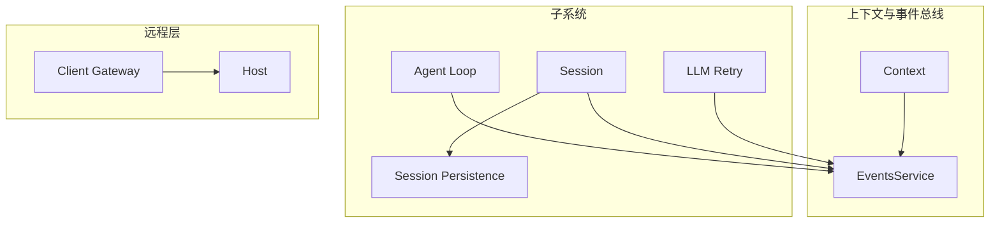
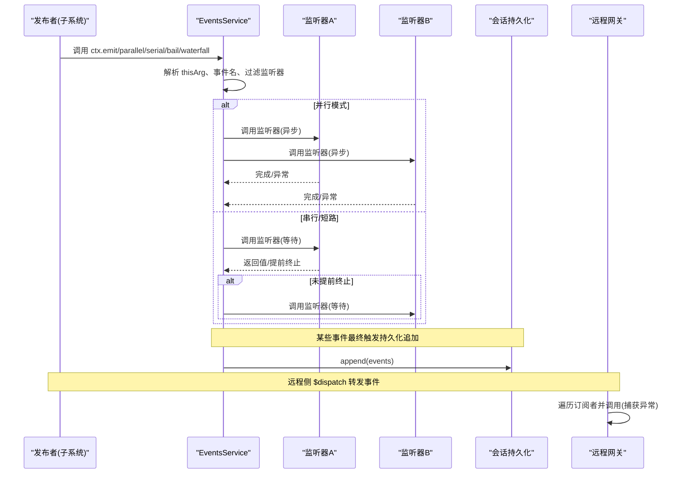
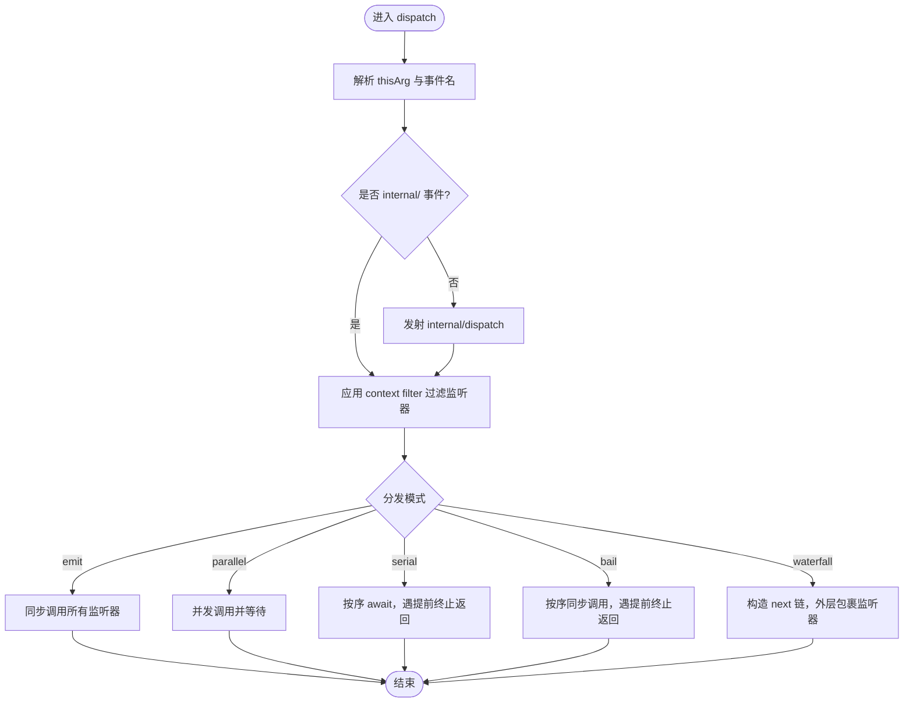
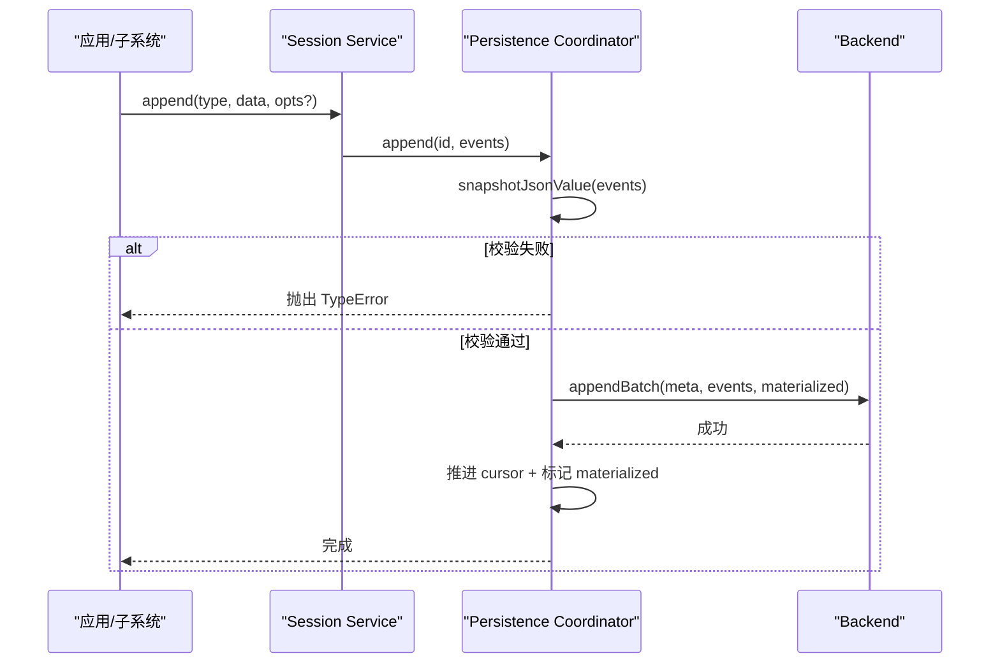
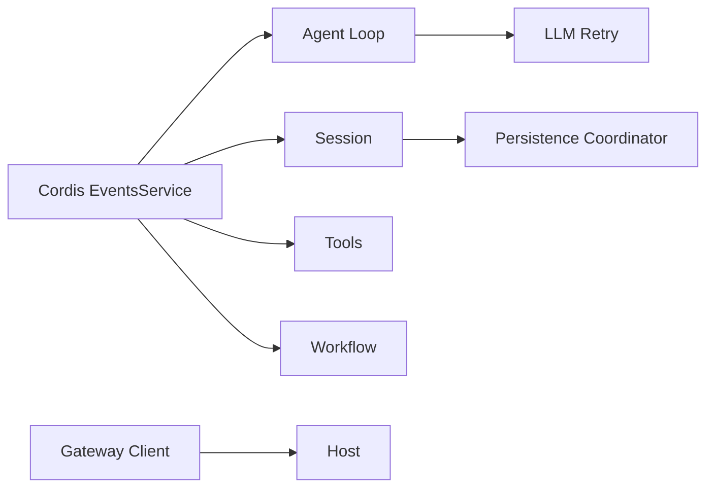

# 事件 API

<cite>
**本文引用的文件**
- [events.ts](file://vendor/cordis/src/events.ts)
- [04-events.md](file://docs/cordis-tutorial/04-events.md)
- [events.zh.md](file://docs/cordis-api/events.zh.md)
- [event-producer-consumer.md](file://docs/event-producer-consumer.md)
- [coordinator.ts](file://packages/session/session-persistence/src/coordinator.ts)
- [index.ts](file://packages/core/session/src/index.ts)
- [surface.ts](file://packages/core/session/src/surface.ts)
- [client/index.ts](file://packages/api/gateway/src/client/index.ts)
- [2026-08-10-remote-event-delivery.md](file://.agents/notes/implemented/architecture/2026-08-10-remote-event-delivery.md)
- [index.ts](file://packages/llm/llm-retry/src/index.ts)
- [retry-policy.ts](file://packages/llm/llm/src/retry-policy.ts)
</cite>

## 目录
1. [简介](#简介)
2. [项目结构](#项目结构)
3. [核心组件](#核心组件)
4. [架构总览](#架构总览)
5. [详细组件分析](#详细组件分析)
6. [依赖关系分析](#依赖关系分析)
7. [性能与内存管理](#性能与内存管理)
8. [故障排查指南](#故障排查指南)
9. [结论](#结论)
10. [附录：完整示例与最佳实践](#附录完整示例与最佳实践)

## 简介
本文件为 Harness 事件系统的完整 API 文档，覆盖事件的发布、订阅、处理机制；事件类型、数据结构与生命周期；监听器的注册与注销；事件驱动架构的设计模式与最佳实践；事件序列化与持久化；错误处理与重试策略；以及性能优化建议。内容基于仓库中的 Cordis 事件服务、会话持久化、远程事件转发与重试策略等实现进行系统化整理。

## 项目结构
事件系统由以下关键部分组成：
- 事件总线与分发模式：在 Context 上提供 emit、parallel、serial、bail、waterfall 等方法，支持并发、串行、短路和中间件式拦截。
- 事件声明与类型：通过模块扩展 Events 接口声明事件名与监听器签名，确保类型安全。
- 事件生产者与消费者矩阵：跨包的事件声明、派发与监听关系由生成文档维护。
- 事件持久化：会话事件以追加日志形式持久化，包含严格的 JSON 可序列化校验与序列号连续性约束。
- 远程事件转发：客户端到宿主的事件转发具备隔离的错误捕获与丢弃无订阅者事件的能力。
- 重试策略：针对 LLM 请求错误提供可配置的重试与退避策略，并通过 waterfall 事件链集成。



图表来源
- [events.ts:131-319](file://vendor/cordis/src/events.ts#L131-L319)
- [coordinator.ts:669-710](file://packages/session/session-persistence/src/coordinator.ts#L669-L710)
- [client/index.ts:135-156](file://packages/api/gateway/src/client/index.ts#L135-L156)

章节来源
- [events.ts:1-353](file://vendor/cordis/src/events.ts#L1-L353)
- [04-events.md:1-145](file://docs/cordis-tutorial/04-events.md#L1-L145)
- [event-producer-consumer.md:1-77](file://docs/event-producer-consumer.md#L1-L77)

## 核心组件
- 事件分发模式（DispatchMode）
  - emit：同步广播，不等待返回值或 Promise。
  - parallel：并发执行所有监听器并统一等待完成。
  - serial：按序等待监听器，首个“提前终止”值会停止后续。
  - bail：同步版本的 serial。
  - waterfall：将最后一个参数视为 next 续接回调，形成中间件式调用链。
- 监听器注册与注销
  - ctx.on(name, listener, options?)：在当前 fiber 下注册监听器，返回资源释放函数；支持 prepend 与 global 选项。
  - ctx.once(name, listener, options?)：首次触发后自动注销。
- 事件过滤与诊断
  - internal/dispatch 暴露事件分发的元信息（模式、名称、参数、thisArg）。
  - 支持通过 context filter 控制监听器可见性。
- 内置框架事件
  - internal/plugin、internal/status、internal/config、internal/service、internal/update、internal/get、internal/set、internal/listener、internal/dispatch。

章节来源
- [events.ts:24-32](file://vendor/cordis/src/events.ts#L24-L32)
- [events.ts:111-117](file://vendor/cordis/src/events.ts#L111-L117)
- [events.ts:131-319](file://vendor/cordis/src/events.ts#L131-L319)
- [events.ts:321-353](file://vendor/cordis/src/events.ts#L321-L353)
- [04-events.md:80-92](file://docs/cordis-tutorial/04-events.md#L80-L92)

## 架构总览
事件系统围绕 Context 上的 EventsService 构建，各子系统通过声明 Events 接口来定义事件契约，并以不同分发模式进行发布与消费。会话事件在持久化层被严格校验并追加到日志中；远程事件通过网关在客户端与宿主之间转发，具备错误隔离与无订阅者丢弃能力；LLM 请求错误通过 waterfall 事件链接入重试策略。



图表来源
- [events.ts:165-243](file://vendor/cordis/src/events.ts#L165-L243)
- [coordinator.ts:669-710](file://packages/session/session-persistence/src/coordinator.ts#L669-L710)
- [client/index.ts:135-156](file://packages/api/gateway/src/client/index.ts#L135-L156)

## 详细组件分析

### 事件总线与分发模式（EventsService）
- 分发流程
  - dispatch(type, args)：提取 thisArg 与事件名，发射 internal/dispatch（非 internal/ 开头），根据 this 的 filter 过滤监听器并绑定 this。
  - emit：同步调用所有监听器，忽略返回值与 Promise。
  - parallel：Promise.allSettled 等待所有监听器，聚合异常为 AggregateError。
  - serial：按序 await，遇到 isBailed 结果即返回。
  - bail：同步版本，遇到 isBailed 结果即返回。
  - waterfall：将最后一个参数作为 next，依次包装监听器，不调用 next 即否决后续。
- 监听器注册
  - on：在当前 fiber 下注册，支持 prepend/global；内部通过 internal/listener 钩子允许替换注册行为。
  - once：首次调用后自动注销。
- 生命周期
  - 监听器随 fiber 生命周期自动清理；若 fiber 已失效则抛出 INACTIVE_EFFECT。



图表来源
- [events.ts:165-243](file://vendor/cordis/src/events.ts#L165-L243)
- [events.ts:288-318](file://vendor/cordis/src/events.ts#L288-L318)

章节来源
- [events.ts:131-319](file://vendor/cordis/src/events.ts#L131-L319)

### 事件声明与类型
- 通过模块扩展 Events 接口声明事件名与监听器签名，使 ctx.emit/on 具备完整类型提示。
- 教程示例展示了如何声明自定义事件并在插件中发布与订阅。

章节来源
- [04-events.md:11-44](file://docs/cordis-tutorial/04-events.md#L11-L44)
- [04-events.md:98-127](file://docs/cordis-tutorial/04-events.md#L98-L127)

### 事件生产者与消费者矩阵
- 该矩阵列出每个事件的声明位置、派发方式、派发包与监听包，便于理解跨包耦合关系。
- 包含大量 harness 自有事件，如 agent/*、session/*、tools/*、workflow/* 等。

章节来源
- [event-producer-consumer.md:8-66](file://docs/event-producer-consumer.md#L8-L66)

### 事件持久化与序列化
- 追加写入
  - append(id, events)：对事件批次进行一次性深拷贝与 JSON 可序列化校验，拒绝非 JSON 值（BigInt、函数、Symbol、undefined、Infinity、循环引用等）。
  - appendCore：校验事件类型与 seq 连续性，调用后端追加，成功后推进游标并标记 materialized。
- 表面操作（Surface）
  - surfaceOp 用于对展示层的替换/追加等操作，需满足特定合法性与窗口范围约束。
- 读取与检查
  - readFrom/load/inspect 提供从指定序列读取、加载会话与只读检查能力，保证一致性。



图表来源
- [coordinator.ts:669-710](file://packages/session/session-persistence/src/coordinator.ts#L669-L710)
- [index.ts:589-611](file://packages/core/session/src/index.ts#L589-L611)
- [surface.ts:184-208](file://packages/core/session/src/surface.ts#L184-L208)

章节来源
- [coordinator.ts:669-710](file://packages/session/session-persistence/src/coordinator.ts#L669-L710)
- [index.ts:589-611](file://packages/core/session/src/index.ts#L589-L611)
- [surface.ts:184-208](file://packages/core/session/src/surface.ts#L184-L208)

### 远程事件转发
- 客户端通过 $dispatch(event, args) 向宿主转发事件。
- 转发时按订阅顺序逐个调用监听器，捕获同步异常与异步拒绝，避免未处理拒绝泄漏。
- 若无订阅者则直接丢弃，减少无效开销。

章节来源
- [client/index.ts:130-156](file://packages/api/gateway/src/client/index.ts#L130-L156)
- [2026-08-10-remote-event-delivery.md:167-177](file://.agents/notes/implemented/architecture/2026-08-10-remote-event-delivery.md#L167-L177)

### 错误处理与重试策略
- 事件监听器异常隔离
  - 客户端转发层捕获监听器抛出的异常与 Promise 拒绝，记录错误但不中断其他监听器。
- LLM 请求错误重试
  - 通过 waterfall 事件链（agent/request-error）接入重试策略，支持 always 模式与可重试代码集合。
  - 退避策略包含初始延迟、最大延迟与抖动比例，并进行参数校验。
  - 使用 AbortSignal 支持取消与生命周期管理。

```mermaid
sequenceDiagram
participant Loop as "Agent Loop"
participant Retry as "LLM Retry"
participant Provider as "Provider"
participant Bus as "EventsService"
Loop->>Bus : ctx.waterfall("agent/request-error", payload, next)
Bus->>Retry : 调用监听器(next)
Retry->>Provider : 发起请求
Provider-->>Retry : 失败(含 code)
alt 符合可重试条件
Retry->>Retry : 计算退避(delay, jitter)
Retry->>Provider : 重试
Provider-->>Retry : 成功/失败
else 不可重试
Retry-->>Bus : 继续下游
end
```

图表来源
- [index.ts:156-179](file://packages/llm/llm-retry/src/index.ts#L156-L179)
- [retry-policy.ts:123-156](file://packages/llm/llm/src/retry-policy.ts#L123-L156)

章节来源
- [client/index.ts:135-156](file://packages/api/gateway/src/client/index.ts#L135-L156)
- [index.ts:156-179](file://packages/llm/llm-retry/src/index.ts#L156-L179)
- [retry-policy.ts:123-156](file://packages/llm/llm/src/retry-policy.ts#L123-L156)

## 依赖关系分析
- 低耦合高内聚
  - 事件总线与具体业务解耦，业务仅依赖 Events 接口与分发方法。
- 跨包依赖
  - 事件矩阵显示大量子系统相互依赖，但通过明确的事件契约降低耦合度。
- 外部依赖
  - 持久化后端通过 coordinator 抽象，屏蔽具体存储实现差异。
  - 远程网关依赖客户端与服务端约定，保障事件转发的一致性。



图表来源
- [event-producer-consumer.md:8-66](file://docs/event-producer-consumer.md#L8-L66)
- [coordinator.ts:669-710](file://packages/session/session-persistence/src/coordinator.ts#L669-L710)

章节来源
- [event-producer-consumer.md:8-66](file://docs/event-producer-consumer.md#L8-L66)

## 性能与内存管理
- 并发与阻塞
  - 优先使用 parallel 提高吞吐；谨慎使用 serial/bail 以避免长尾阻塞。
  - waterfall 适合拦截与转换，注意必须调用 next() 以免意外短路。
- 监听器数量与顺序
  - 合理使用 prepend 控制优先级；避免过多监听器导致分发开销增大。
- 事件数据大小
  - 大对象应尽量避免在事件中传递；必要时传递引用或 ID，由接收方按需获取。
- 持久化批处理
  - 批量追加减少 I/O 次数；确保事件数据轻量且可序列化。
- 内存管理
  - 监听器随 fiber 生命周期自动释放；避免在监听器中持有强引用导致泄漏。
  - 远程事件转发层捕获异常，防止未处理拒绝造成进程不稳定。

[本节为通用指导，无需特定文件来源]

## 故障排查指南
- 事件未被触发
  - 检查事件名是否正确、是否在正确的上下文中注册监听器。
  - 确认分发模式是否符合预期（例如 waterfall 必须调用 next）。
- 监听器异常
  - 客户端转发层会记录异常；检查监听器内部逻辑与异步处理。
- 持久化失败
  - 检查事件数据是否可 JSON 序列化；确认 seq 连续性与事件类型支持。
- 重试未生效
  - 检查 provider 配置与可重试代码集合；确认信号未提前中止。

章节来源
- [client/index.ts:135-156](file://packages/api/gateway/src/client/index.ts#L135-L156)
- [coordinator.ts:669-710](file://packages/session/session-persistence/src/coordinator.ts#L669-L710)
- [index.ts:156-179](file://packages/llm/llm-retry/src/index.ts#L156-L179)

## 结论
Harness 事件系统以 Context 上的 EventsService 为核心，提供多种分发模式以满足不同场景需求；通过 Events 接口实现类型安全的声明与使用；结合会话持久化与远程转发，构建了稳定可靠的事件驱动架构；配合重试策略与错误隔离，提升了系统的健壮性与可维护性。遵循本文的最佳实践与性能建议，可在复杂系统中高效地组织事件流。

[本节为总结，无需特定文件来源]

## 附录：完整示例与最佳实践
- 声明与使用事件
  - 参考教程中的自定义事件声明与发布订阅示例。
- 选择分发模式
  - 观察型任务使用 emit；需要并发完成的副作用使用 parallel；需要短路决策使用 serial/bail；需要拦截与转换使用 waterfall。
- 监听器注册与注销
  - 使用 ctx.on 注册，返回的 disposer 可用于显式注销；ctx.once 适用于一次性监听。
- 事件数据设计
  - 保持事件数据轻量、可序列化；避免传递闭包、Symbol、BigInt 等不可序列化值。
- 错误处理
  - 在监听器中捕获异常并记录；对于异步监听器，确保拒绝被捕获或传播到上层。
- 重试策略
  - 为易错的外部调用配置合理的重试与退避；结合 AbortSignal 支持取消。
- 性能优化
  - 批量事件、限制监听器数量、避免在大对象间频繁复制。

章节来源
- [04-events.md:11-44](file://docs/cordis-tutorial/04-events.md#L11-L44)
- [04-events.md:80-139](file://docs/cordis-tutorial/04-events.md#L80-L139)
- [events.zh.md:10-187](file://docs/cordis-api/events.zh.md#L10-L187)