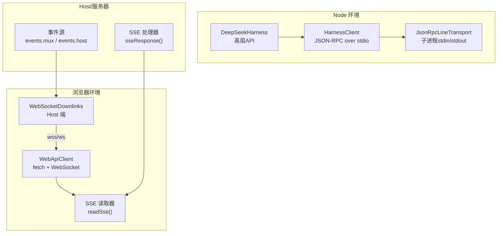
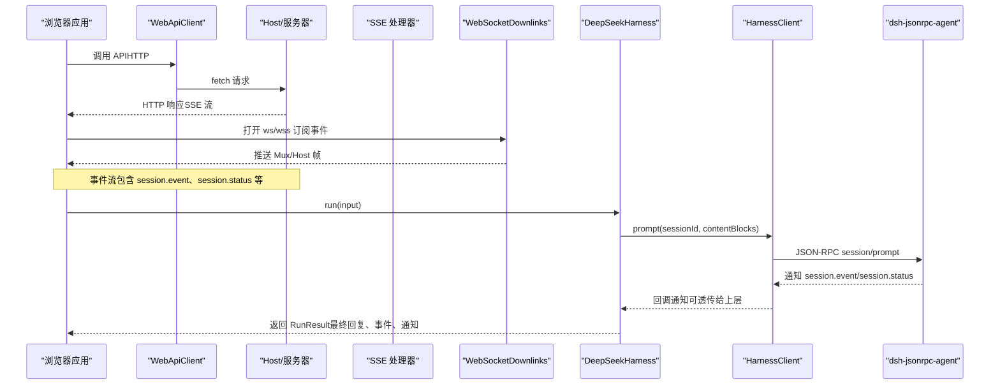
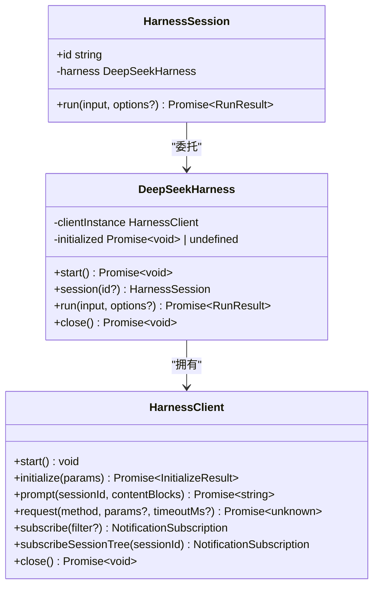
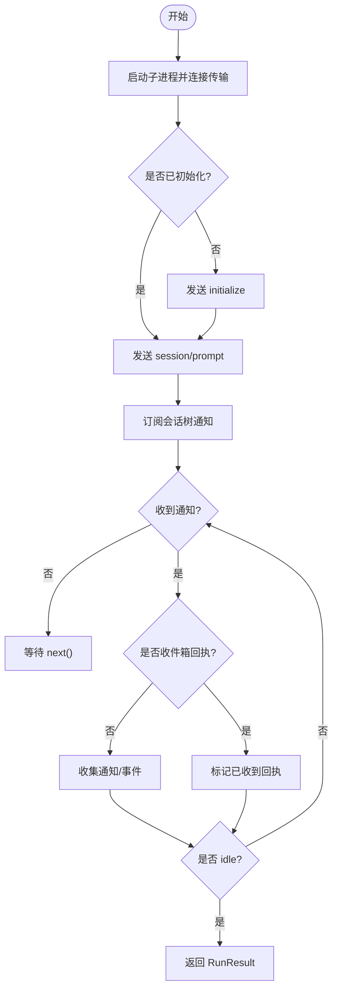
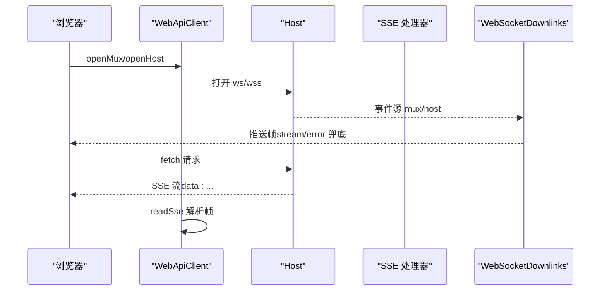
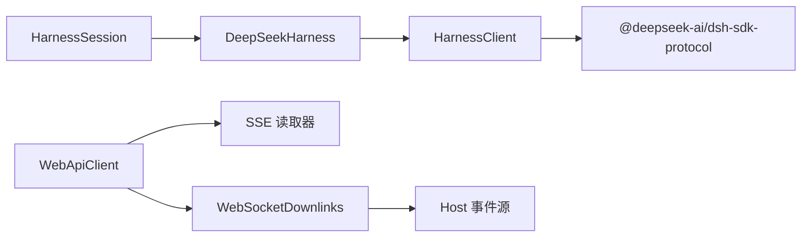

# JavaScript SDK

<cite>
**本文引用的文件**
- [packages/sdk/client/src/index.ts](file://packages/sdk/client/src/index.ts)
- [packages/sdk/client/src/api.ts](file://packages/sdk/client/src/api.ts)
- [packages/sdk/client/src/client.ts](file://packages/sdk/client/src/client.ts)
- [packages/sdk/client/src/types.ts](file://packages/sdk/client/src/types.ts)
- [packages/sdk/protocol/src/types.ts](file://packages/sdk/protocol/src/types.ts)
- [packages/client/connection/src/client/web-api-client.ts](file://packages/client/connection/src/client/web-api-client.ts)
- [packages/client/connection/src/websocket-downlink.ts](file://packages/client/connection/src/websocket-downlink.ts)
- [packages/host/apiproxy/src/fetch/handler.ts](file://packages/host/apiproxy/src/fetch/handler.ts)
- [packages/host/apiproxy/src/fetch/client.ts](file://packages/host/apiproxy/src/fetch/client.ts)
- [packages/client/connection/src/http-bridge.ts](file://packages/client/connection/src/http-bridge.ts)
- [packages/client/connection/tests/client-apply.client.spec.ts](file://packages/client/connection/tests/client-apply.client.spec.ts)
- [packages/sdk/client/tests/sdk-client.spec.ts](file://packages/sdk/client/tests/sdk-client.spec.ts)
</cite>

## 目录
1. [简介](#简介)
2. [项目结构](#项目结构)
3. [核心组件](#核心组件)
4. [架构总览](#架构总览)
5. [详细组件分析](#详细组件分析)
6. [依赖关系分析](#依赖关系分析)
7. [性能与流式处理](#性能与流式处理)
8. [故障排查指南](#故障排查指南)
9. [结论](#结论)
10. [附录：集成示例与最佳实践](#附录集成示例与最佳实践)

## 简介
本文件为 DeepSeek Harness JavaScript SDK 的完整技术文档，聚焦于连接建立、WebSocket 通信、会话管理与消息格式；覆盖客户端初始化、认证配置（通过运行时参数）、事件监听与错误处理；并提供浏览器环境与 Node.js 环境的集成要点。SDK 同时支持异步操作、Promise 处理与流式响应，帮助在 Web 应用中以最小成本接入 Agent 会话能力。

## 项目结构
仓库将“进程内 JSON-RPC 客户端”和“浏览器/Host 连接层”解耦：
- SDK 客户端（Node）：通过子进程 stdio 运行 dsh-jsonrpc-agent 运行时，提供高层 API（DeepSeekHarness/HarnessSession）与低层 JSON-RPC 客户端（HarnessClient）。
- 浏览器连接层：WebApiClient 使用 fetch 进行请求，使用 WebSocket 订阅事件流；Host 端通过 WebSocketDownlinks 将事件推送到浏览器。
- Host SSE 桥接：服务端将事件流以 Server-Sent Events 形式输出，供浏览器侧解析。

图表来源
- [packages/sdk/client/src/api.ts:22-119](file://packages/sdk/client/src/api.ts#L22-L119)
- [packages/sdk/client/src/client.ts:184-333](file://packages/sdk/client/src/client.ts#L184-L333)
- [packages/client/connection/src/client/web-api-client.ts:13-91](file://packages/client/connection/src/client/web-api-client.ts#L13-L91)
- [packages/client/connection/src/websocket-downlink.ts:51-137](file://packages/client/connection/src/websocket-downlink.ts#L51-L137)
- [packages/host/apiproxy/src/fetch/handler.ts:199-221](file://packages/host/apiproxy/src/fetch/handler.ts#L199-L221)
- [packages/host/apiproxy/src/fetch/client.ts:362-389](file://packages/host/apiproxy/src/fetch/client.ts#L362-L389)

章节来源
- [packages/sdk/client/src/index.ts:1-30](file://packages/sdk/client/src/index.ts#L1-L30)
- [packages/sdk/client/src/api.ts:22-119](file://packages/sdk/client/src/api.ts#L22-L119)
- [packages/sdk/client/src/client.ts:184-333](file://packages/sdk/client/src/client.ts#L184-L333)
- [packages/client/connection/src/client/web-api-client.ts:13-91](file://packages/client/connection/src/client/web-api-client.ts#L13-L91)
- [packages/client/connection/src/websocket-downlink.ts:51-137](file://packages/client/connection/src/websocket-downlink.ts#L51-L137)
- [packages/host/apiproxy/src/fetch/handler.ts:199-221](file://packages/host/apiproxy/src/fetch/handler.ts#L199-L221)
- [packages/host/apiproxy/src/fetch/client.ts:362-389](file://packages/host/apiproxy/src/fetch/client.ts#L362-L389)

## 核心组件
- DeepSeekHarness：拥有并复用单个运行时子进程，负责启动、握手、会话创建与关闭。
- HarnessSession：封装一次“提交提示词到空闲”的完整活动区间，收集事件与通知。
- HarnessClient：底层 JSON-RPC 客户端，管理子进程生命周期、请求超时、通知分发与订阅。
- WebApiClient：浏览器端 API 载体，统一用 fetch 做请求，用 WebSocket 订阅事件流。
- WebSocketDownlinks：Host 端将事件流通过 WebSocket 推送给浏览器。
- SSE 处理器：Host 端将事件流以 SSE 形式输出，浏览器侧按行解析。

章节来源
- [packages/sdk/client/src/api.ts:22-195](file://packages/sdk/client/src/api.ts#L22-L195)
- [packages/sdk/client/src/client.ts:184-458](file://packages/sdk/client/src/client.ts#L184-L458)
- [packages/client/connection/src/client/web-api-client.ts:13-91](file://packages/client/connection/src/client/web-api-client.ts#L13-L91)
- [packages/client/connection/src/websocket-downlink.ts:51-137](file://packages/client/connection/src/websocket-downlink.ts#L51-L137)
- [packages/host/apiproxy/src/fetch/handler.ts:199-221](file://packages/host/apiproxy/src/fetch/handler.ts#L199-L221)

## 架构总览
下图展示从浏览器发起请求到 Host 返回事件流的端到端流程，以及 Node 环境下通过子进程驱动 Agent 的流程。

图表来源
- [packages/client/connection/src/client/web-api-client.ts:13-91](file://packages/client/connection/src/client/web-api-client.ts#L13-L91)
- [packages/host/apiproxy/src/fetch/handler.ts:199-221](file://packages/host/apiproxy/src/fetch/handler.ts#L199-L221)
- [packages/client/connection/src/websocket-downlink.ts:51-137](file://packages/client/connection/src/websocket-downlink.ts#L51-L137)
- [packages/sdk/client/src/api.ts:146-195](file://packages/sdk/client/src/api.ts#L146-L195)
- [packages/sdk/client/src/client.ts:283-333](file://packages/sdk/client/src/client.ts#L283-L333)

## 详细组件分析

### DeepSeekHarness 与 HarnessSession
- 职责
  - DeepSeekHarness：启动子进程、执行 initialize 握手、维护 provider/model/cwd/maxTokens 等会话路由信息；对外暴露 run()/session()/close()。
  - HarnessSession：提交提示词，订阅会话树通知，等待首次收件箱回执与最终 idle 状态，聚合事件与通知，返回 RunResult。
- 关键行为
  - 懒启动：首次调用 start() 才拉起子进程并握手；失败时自动重建客户端实例。
  - 会话树订阅：subscribeSessionTree 基于 subagent.started/finished 构建父子关系，仅向根会话收集 typed events。
  - 结果提取：finalResponse 从最后一条 assistant/message 中提取文本内容。
- 复杂度
  - 通知过滤与父子关系追踪为 O(n) 线性扫描（n 为通知数量），内存占用与事件量成正比。

图表来源
- [packages/sdk/client/src/api.ts:22-195](file://packages/sdk/client/src/api.ts#L22-L195)
- [packages/sdk/client/src/client.ts:184-458](file://packages/sdk/client/src/client.ts#L184-L458)

章节来源
- [packages/sdk/client/src/api.ts:22-195](file://packages/sdk/client/src/api.ts#L22-L195)
- [packages/sdk/client/src/types.ts:22-71](file://packages/sdk/client/src/types.ts#L22-L71)

### HarnessClient：子进程 JSON-RPC 客户端
- 职责
  - 管理子进程生命周期（spawn、EOF→SIGTERM→SIGKILL 清理）。
  - 发送 JSON-RPC 请求（initialize、session/prompt、shutdown），支持 per-call 超时。
  - 接收并分发通知（session.event、session.status、subagent.*），维护订阅队列与 waiters。
- 错误模型
  - TransportClosedError：子进程退出或不可用。
  - RequestTimeoutError：请求超时。
  - SdkProtocolError：协议不合规（如 initialize 返回值缺失 serverInfo）。
- 通知订阅
  - subscribe/filter：按方法名与参数过滤。
  - subscribeSessionTree：基于 subagent.started/finished 维护父子关系，仅投递目标会话及其后代的通知。

图表来源
- [packages/sdk/client/src/client.ts:203-333](file://packages/sdk/client/src/client.ts#L203-L333)
- [packages/sdk/client/src/api.ts:146-195](file://packages/sdk/client/src/api.ts#L146-L195)

章节来源
- [packages/sdk/client/src/client.ts:184-458](file://packages/sdk/client/src/client.ts#L184-L458)

### 浏览器连接层：WebApiClient 与 SSE/WebSocket
- WebApiClient
  - 使用 fetch 发起请求；通过 WebSocket 订阅事件流（mux/host）。
  - readWebSocket：将 WebSocket message 解析为 ServerRequest，再按 schema 校验后 yield RpcRequest。
- Host 端 WebSocketDownlinks
  - 接受 ws/wss 升级，拒绝上行消息（downlink only）。
  - pump 循环将事件帧写入 socket，异常时发送 stream/error 帧。
- SSE 处理器
  - sseResponse：将事件流包装为 SSE，首行发送注释表示通道就绪，逐条 data: 帧推送 fullFrame。
- 浏览器 SSE 读取器
  - readSse：按 '\n\n' 分帧，解析 ServerRequest 与 payload，跳过损坏帧，保证流健壮性。

图表来源
- [packages/client/connection/src/client/web-api-client.ts:13-91](file://packages/client/connection/src/client/web-api-client.ts#L13-L91)
- [packages/client/connection/src/websocket-downlink.ts:51-137](file://packages/client/connection/src/websocket-downlink.ts#L51-L137)
- [packages/host/apiproxy/src/fetch/handler.ts:199-221](file://packages/host/apiproxy/src/fetch/handler.ts#L199-L221)
- [packages/host/apiproxy/src/fetch/client.ts:362-389](file://packages/host/apiproxy/src/fetch/client.ts#L362-L389)

章节来源
- [packages/client/connection/src/client/web-api-client.ts:13-91](file://packages/client/connection/src/client/web-api-client.ts#L13-L91)
- [packages/client/connection/src/websocket-downlink.ts:51-137](file://packages/client/connection/src/websocket-downlink.ts#L51-L137)
- [packages/host/apiproxy/src/fetch/handler.ts:199-221](file://packages/host/apiproxy/src/fetch/handler.ts#L199-L221)
- [packages/host/apiproxy/src/fetch/client.ts:362-389](file://packages/host/apiproxy/src/fetch/client.ts#L362-L389)

### 消息格式与协议
- 进程内 JSON-RPC（Node）
  - 请求：initialize、session/prompt、shutdown。
  - 通知：session.event、session.status、subagent.started、subagent.finished。
- 浏览器事件流
  - SSE：ServerRequest envelope + frame-schema 校验。
  - WebSocket：MuxFrame/HostFrame，downlink-only（禁止上行）。

章节来源
- [packages/sdk/protocol/src/types.ts:15-105](file://packages/sdk/protocol/src/types.ts#L15-L105)
- [packages/host/apiproxy/src/fetch/client.ts:362-389](file://packages/host/apiproxy/src/fetch/client.ts#L362-L389)
- [packages/client/connection/src/websocket-downlink.ts:14-44](file://packages/client/connection/src/websocket-downlink.ts#L14-L44)

## 依赖关系分析
- 模块耦合
  - DeepSeekHarness 依赖 HarnessClient；HarnessSession 委托 HarnessClient。
  - WebApiClient 依赖 Host 提供的 events.mux/events.host 路径与 SSE 接口。
  - WebSocketDownlinks 依赖 Host 的事件源，将帧转换为 WebSocket 消息。
- 外部依赖
  - Node 子进程（child_process）用于运行 dsh-jsonrpc-agent。
  - WebSocket/SSE 用于浏览器与 Host 的双向/单向事件通道。

图表来源
- [packages/sdk/client/src/api.ts:22-119](file://packages/sdk/client/src/api.ts#L22-L119)
- [packages/sdk/client/src/client.ts:184-333](file://packages/sdk/client/src/client.ts#L184-L333)
- [packages/client/connection/src/client/web-api-client.ts:13-91](file://packages/client/connection/src/client/web-api-client.ts#L13-L91)
- [packages/client/connection/src/websocket-downlink.ts:51-137](file://packages/client/connection/src/websocket-downlink.ts#L51-L137)

章节来源
- [packages/sdk/client/src/api.ts:22-119](file://packages/sdk/client/src/api.ts#L22-L119)
- [packages/sdk/client/src/client.ts:184-333](file://packages/sdk/client/src/client.ts#L184-L333)
- [packages/client/connection/src/client/web-api-client.ts:13-91](file://packages/client/connection/src/client/web-api-client.ts#L13-L91)
- [packages/client/connection/src/websocket-downlink.ts:51-137](file://packages/client/connection/src/websocket-downlink.ts#L51-L137)

## 性能与流式处理
- 流式事件
  - 浏览器侧通过 SSE/WebSocket 持续接收事件，避免轮询；readSse 按 '\n\n' 分帧，具备容错（丢弃损坏帧）。
- 背压与资源释放
  - SSE 桥接对响应体进行 backpressure 控制；WebSocketDownlinks 在异常时发送 stream/error 并关闭连接。
- 超时与取消
  - HarnessClient 支持 per-call 超时，使用 AbortController 实现放弃请求；Host 侧通过 AbortSignal 传播取消。
- 内存与缓冲
  - stderr 尾部限制防止无限增长；SSE 与 ZIP 导出采用分块策略控制内存峰值。

章节来源
- [packages/host/apiproxy/src/fetch/handler.ts:199-221](file://packages/host/apiproxy/src/fetch/handler.ts#L199-L221)
- [packages/client/connection/src/websocket-downlink.ts:118-137](file://packages/client/connection/src/websocket-downlink.ts#L118-L137)
- [packages/client/connection/src/http-bridge.ts:32-84](file://packages/client/connection/src/http-bridge.ts#L32-L84)
- [packages/host/apiproxy/src/fetch/client.ts:362-389](file://packages/host/apiproxy/src/fetch/client.ts#L362-L389)
- [packages/sdk/client/src/client.ts:301-333](file://packages/sdk/client/src/client.ts#L301-L333)

## 故障排查指南
- 常见错误类型
  - TransportClosedError：子进程退出或管道关闭；错误消息包含 exit code 与 stderr 尾部。
  - RequestTimeoutError：请求超过 requestTimeoutMs；建议检查后端负载或调整超时。
  - SdkProtocolError：协议不合规（如 initialize 返回值缺少 serverInfo）；检查运行时版本与配置。
- 诊断步骤
  - 查看 stderr 尾部：TransportClosedError 会附带最近若干行日志。
  - 检查握手参数：cwd/provider/model/maxTokens 是否正确传递。
  - 确认事件流：浏览器侧应能收到 SSE 注释行与后续 data 帧；WebSocket 应仅下行。
- 恢复策略
  - HarnessClient.close() 触发 shutdown 请求与 EOF→SIGTERM→SIGKILL 清理；确保调用 close 或 await using。
  - 浏览器侧在页面卸载或任务取消时关闭 WebSocket 与中止 fetch。

章节来源
- [packages/sdk/client/src/client.ts:38-65](file://packages/sdk/client/src/client.ts#L38-L65)
- [packages/sdk/client/src/client.ts:301-333](file://packages/sdk/client/src/client.ts#L301-L333)
- [packages/sdk/client/src/client.ts:380-401](file://packages/sdk/client/src/client.ts#L380-L401)
- [packages/client/connection/src/websocket-downlink.ts:140-153](file://packages/client/connection/src/websocket-downlink.ts#L140-L153)

## 结论
DeepSeek Harness JavaScript SDK 提供了跨 Node 与浏览器的统一体验：Node 侧通过子进程驱动 Agent，浏览器侧通过 SSE/WebSocket 获取实时事件。其设计强调健壮性（协议校验、错误分类、流容错）、可观测性（通知与事件）与可维护性（清晰的职责边界与生命周期管理）。在生产环境中，建议合理设置超时、妥善管理订阅与连接、并在异常路径中记录 stderr 与事件上下文以便快速定位问题。

## 附录：集成示例与最佳实践

### Node.js 环境集成要点
- 初始化与运行
  - 使用 DeepSeekHarness 传入 launch（command/args/env/cwd/timeouts），调用 start() 完成握手。
  - 使用 harness.run(input) 或 harness.session(id).run(input) 提交提示词并等待空闲。
- 事件与通知
  - 通过 onNotification 回调观察 session.event 与 session.status；或使用 subscribeSessionTree 获取会话树通知。
- 资源清理
  - 使用 harness.close() 或 await using 确保子进程被正确回收。

参考路径
- [packages/sdk/client/src/api.ts:22-119](file://packages/sdk/client/src/api.ts#L22-L119)
- [packages/sdk/client/src/api.ts:146-195](file://packages/sdk/client/src/api.ts#L146-L195)
- [packages/sdk/client/src/types.ts:22-71](file://packages/sdk/client/src/types.ts#L22-L71)
- [packages/sdk/client/tests/sdk-client.spec.ts:115-171](file://packages/sdk/client/tests/sdk-client.spec.ts#L115-L171)

### 浏览器环境集成要点
- 连接建立
  - 使用 WebApiClient 发起 HTTP 请求；通过 openMux/openHost 打开 ws/wss 订阅事件流。
  - SSE 读取器按 '\n\n' 分帧解析，遇到损坏帧则跳过，保证流稳定。
- 认证配置
  - 认证通常由 Host 网关处理；SDK 侧通过 initialize 参数（provider/model/cwd/maxTokens）选择路由。
- 事件监听与错误处理
  - 监听 session.event 获取助手消息片段；监听 session.status 判断空闲。
  - 捕获 stream/error 帧与 fetch 错误，必要时重连 WebSocket。

参考路径
- [packages/client/connection/src/client/web-api-client.ts:13-91](file://packages/client/connection/src/client/web-api-client.ts#L13-L91)
- [packages/host/apiproxy/src/fetch/handler.ts:199-221](file://packages/host/apiproxy/src/fetch/handler.ts#L199-L221)
- [packages/host/apiproxy/src/fetch/client.ts:362-389](file://packages/host/apiproxy/src/fetch/client.ts#L362-L389)
- [packages/client/connection/tests/client-apply.client.spec.ts:66-85](file://packages/client/connection/tests/client-apply.client.spec.ts#L66-L85)

### 异步操作、Promise 与流式响应
- 异步模式
  - 所有 I/O 均为 Promise；run() 返回 RunResult 包含 finalResponse、events、notifications。
- 流式响应
  - 浏览器侧通过 SSE/WebSocket 持续接收事件；Node 侧通过 subscribeSessionTree 订阅通知。
- 取消与超时
  - 使用 AbortController 取消请求；HarnessClient.request 支持 per-call 超时。

参考路径
- [packages/sdk/client/src/client.ts:301-333](file://packages/sdk/client/src/client.ts#L301-L333)
- [packages/host/apiproxy/src/fetch/client.ts:362-389](file://packages/host/apiproxy/src/fetch/client.ts#L362-L389)
- [packages/client/connection/src/websocket-downlink.ts:118-137](file://packages/client/connection/src/websocket-downlink.ts#L118-L137)