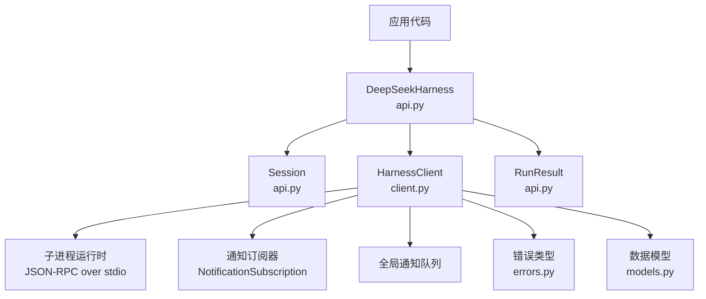
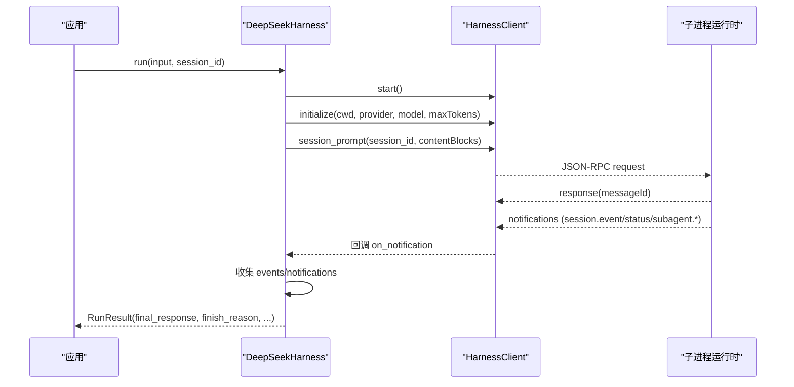
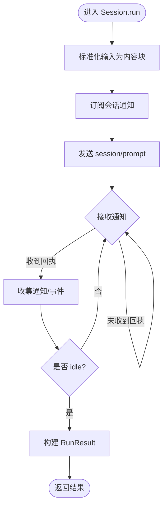
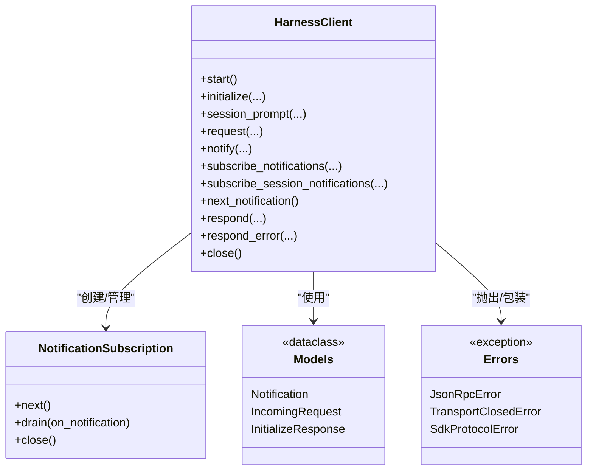
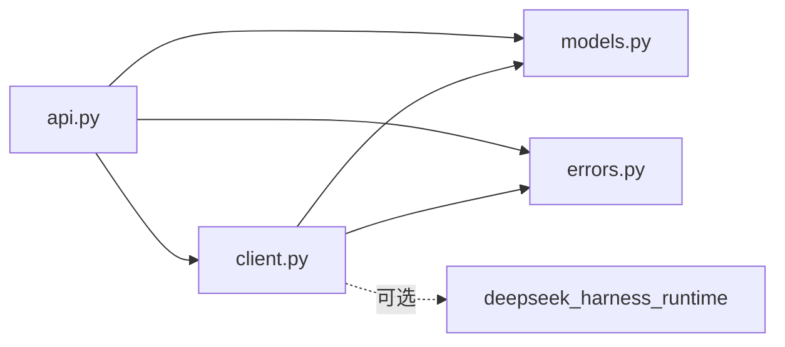

# Python SDK

<cite>
**本文引用的文件**
- [python/sdk/src/deepseek_harness/__init__.py](file://python/sdk/src/deepseek_harness/__init__.py)
- [python/sdk/src/deepseek_harness/api.py](file://python/sdk/src/deepseek_harness/api.py)
- [python/sdk/src/deepseek_harness/client.py](file://python/sdk/src/deepseek_harness/client.py)
- [python/sdk/src/deepseek_harness/models.py](file://python/sdk/src/deepseek_harness/models.py)
- [python/sdk/src/deepseek_harness/errors.py](file://python/sdk/src/deepseek_harness/errors.py)
- [python/sdk/README.md](file://python/sdk/README.md)
- [docs/user/guide/python-sdk.md](file://docs/user/guide/python-sdk.md)
- [examples/jsonrpc-agent/minimal.py](file://examples/jsonrpc-agent/minimal.py)
- [python/sdk/tests/test_client.py](file://python/sdk/tests/test_client.py)
</cite>

## 目录
1. [简介](#简介)
2. [项目结构](#项目结构)
3. [核心组件](#核心组件)
4. [架构总览](#架构总览)
5. [详细组件分析](#详细组件分析)
6. [依赖关系分析](#依赖关系分析)
7. [性能与并发特性](#性能与并发特性)
8. [故障排查指南](#故障排查指南)
9. [结论](#结论)
10. [附录：快速上手与最佳实践](#附录快速上手与最佳实践)

## 简介
本文件为 DeepSeek Harness Python SDK 的详细技术文档，聚焦于 DeepSeekHarness 与 Session 类的使用方法，涵盖配置选项、会话管理、消息传递、事件处理、异步通信模式（基于子进程 JSON-RPC stdio）、错误处理机制与性能优化。文档提供完整的代码示例路径，说明如何启动运行时、创建会话、发送消息和处理响应，并给出认证配置、环境变量设置与资源管理的最佳实践。

## 项目结构
Python SDK 位于 python/sdk 目录，核心模块包括：
- api.py：对外暴露的同步高层 API（DeepSeekHarness、Session、RunResult、配置）
- client.py：底层 JSON-RPC 客户端，负责子进程生命周期、请求/通知路由、超时与关闭
- models.py：通用数据模型（Notification、IncomingRequest、InitializeResponse 等）
- errors.py：异常类型定义
- __init__.py：统一导出公共接口

图表来源
- [python/sdk/src/deepseek_harness/api.py:13-124](file://python/sdk/src/deepseek_harness/api.py#L13-L124)
- [python/sdk/src/deepseek_harness/client.py:24-210](file://python/sdk/src/deepseek_harness/client.py#L24-L210)
- [python/sdk/src/deepseek_harness/models.py:13-33](file://python/sdk/src/deepseek_harness/models.py#L13-L33)
- [python/sdk/src/deepseek_harness/errors.py:4-24](file://python/sdk/src/deepseek_harness/errors.py#L4-L24)

章节来源
- [python/sdk/src/deepseek_harness/__init__.py:1-20](file://python/sdk/src/deepseek_harness/__init__.py#L1-L20)
- [python/sdk/src/deepseek_harness/api.py:13-124](file://python/sdk/src/deepseek_harness/api.py#L13-L124)
- [python/sdk/src/deepseek_harness/client.py:24-210](file://python/sdk/src/deepseek_harness/client.py#L24-L210)

## 核心组件
- DeepSeekHarness：高层同步入口，封装运行时启动、初始化、会话创建与单次任务执行；支持上下文管理器自动释放资源。
- Session：会话级对象，封装一次 prompt 到 idle 的活动区间，收集事件与通知，返回 RunResult。
- HarnessClient：低层 JSON-RPC 客户端，通过子进程 stdin/stdout 通信，维护请求等待、通知分发、超时与关闭流程。
- NotificationSubscription：通知订阅句柄，支持按会话树过滤、批量 drain、安全关闭。
- RunResult：单次 run 的结果，包含 final_response、finish_reason、events、notifications、session_root。
- 配置对象：DeepSeekHarnessConfig、HarnessConfig，控制 provider/model/max_tokens/cwd/runtime_cwd/session_root/cordis/env/runtime_bin/launch_args_override/request_timeout_seconds/shutdown_timeout_seconds/base_url/api_key 等。

章节来源
- [python/sdk/src/deepseek_harness/api.py:13-124](file://python/sdk/src/deepseek_harness/api.py#L13-L124)
- [python/sdk/src/deepseek_harness/client.py:24-210](file://python/sdk/src/deepseek_harness/client.py#L24-L210)
- [python/sdk/src/deepseek_harness/models.py:13-33](file://python/sdk/src/deepseek_harness/models.py#L13-L33)

## 架构总览
SDK 采用“进程内同步 API + 子进程异步 JSON-RPC”的混合模式：
- 调用方使用同步 API（DeepSeekHarness.run / Session.run），内部通过 HarnessClient 发起 JSON-RPC 请求。
- 子进程运行时在后台以独立进程运行，通过 stdin/stdout 进行 JSON-RPC 通信。
- 通知（session.event、session.status、subagent.*）通过专用线程读取并分发到订阅者或全局队列。
- 超时、关闭、错误均通过异常与诊断信息反馈给调用方。

图表来源
- [python/sdk/src/deepseek_harness/api.py:97-183](file://python/sdk/src/deepseek_harness/api.py#L97-L183)
- [python/sdk/src/deepseek_harness/client.py:117-156](file://python/sdk/src/deepseek_harness/client.py#L117-L156)
- [python/sdk/src/deepseek_harness/client.py:228-296](file://python/sdk/src/deepseek_harness/client.py#L228-L296)

## 详细组件分析

### DeepSeekHarness 与 Session
- 启动与初始化：start() 会启动子进程并发送 initialize 请求，注入 cwd/provider/model/maxTokens。
- 会话创建：start_session() 生成或复用 session_id，返回 Session 实例。
- 单次运行：run() 委托给 Session.run()，内部：
  - 将输入标准化为内容块列表
  - 建立会话通知订阅
  - 发送 session/prompt
  - 循环消费通知，直到收到目标会话的 idle 状态
  - 从事件中提取最终回复与结束原因
- 资源管理：作为上下文管理器，__enter__/__exit__ 确保 close() 被调用，释放子进程。

图表来源
- [python/sdk/src/deepseek_harness/api.py:127-183](file://python/sdk/src/deepseek_harness/api.py#L127-L183)
- [python/sdk/src/deepseek_harness/api.py:199-242](file://python/sdk/src/deepseek_harness/api.py#L199-L242)

章节来源
- [python/sdk/src/deepseek_harness/api.py:48-183](file://python/sdk/src/deepseek_harness/api.py#L48-L183)

### HarnessClient：JSON-RPC 客户端与通知路由
- 子进程管理：start() 启动子进程，注入默认配置（当使用捆绑运行时且未显式设置 cordis 时），启动读取与 stderr 线程。
- 请求/响应：request()/session_prompt() 发送 JSON-RPC 请求，维护请求 ID 到等待队列的映射，支持超时与通知并行处理。
- 通知系统：_handle_message() 解析消息，区分请求、响应、通知；对通知按订阅过滤器分发，未匹配的通知放入全局队列。
- 会话树追踪：记录 subagent.started/finished 的父子关系，使 subscribe_session_notifications 能正确捕获子会话事件。
- 关闭流程：close() 发送 shutdown，尝试优雅终止，必要时 kill，清理线程与等待队列。

图表来源
- [python/sdk/src/deepseek_harness/client.py:37-210](file://python/sdk/src/deepseek_harness/client.py#L37-L210)
- [python/sdk/src/deepseek_harness/models.py:13-33](file://python/sdk/src/deepseek_harness/models.py#L13-L33)
- [python/sdk/src/deepseek_harness/errors.py:4-24](file://python/sdk/src/deepseek_harness/errors.py#L4-L24)

章节来源
- [python/sdk/src/deepseek_harness/client.py:63-116](file://python/sdk/src/deepseek_harness/client.py#L63-L116)
- [python/sdk/src/deepseek_harness/client.py:117-210](file://python/sdk/src/deepseek_harness/client.py#L117-L210)
- [python/sdk/src/deepseek_harness/client.py:228-296](file://python/sdk/src/deepseek_harness/client.py#L228-L296)
- [python/sdk/src/deepseek_harness/client.py:318-397](file://python/sdk/src/deepseek_harness/client.py#L318-L397)
- [python/sdk/src/deepseek_harness/client.py:424-504](file://python/sdk/src/deepseek_harness/client.py#L424-L504)

### 数据模型与错误
- Notification：表示一条通知（method + payload）。
- IncomingRequest：表示来自运行时的请求（id/method/payload）。
- InitializeResponse：initialize 响应，包含服务器信息。
- 错误类型：
  - HarnessError：基类
  - TransportClosedError：子进程退出或 stdout 关闭
  - SdkProtocolError：运行时协议违规（如 turn/end 缺少 reason.kind）
  - JsonRpcError：JSON-RPC 错误响应（code/message/data）

章节来源
- [python/sdk/src/deepseek_harness/models.py:13-33](file://python/sdk/src/deepseek_harness/models.py#L13-L33)
- [python/sdk/src/deepseek_harness/errors.py:4-24](file://python/sdk/src/deepseek_harness/errors.py#L4-L24)

## 依赖关系分析
- 模块耦合：
  - api.py 依赖 client.py、models.py、errors.py
  - client.py 依赖 models.py、errors.py
  - __init__.py 聚合导出公共接口
- 外部依赖：
  - pydantic 用于模型校验（InitializeResponse 等）
  - subprocess/threading/queue 用于子进程与并发
  - deepseek_harness_runtime（可选）用于捆绑运行时解析与默认配置注入

图表来源
- [python/sdk/src/deepseek_harness/api.py:1-11](file://python/sdk/src/deepseek_harness/api.py#L1-L11)
- [python/sdk/src/deepseek_harness/client.py:1-19](file://python/sdk/src/deepseek_harness/client.py#L1-L19)
- [python/sdk/src/deepseek_harness/client.py:424-454](file://python/sdk/src/deepseek_harness/client.py#L424-L454)

章节来源
- [python/sdk/src/deepseek_harness/__init__.py:1-20](file://python/sdk/src/deepseek_harness/__init__.py#L1-L20)
- [python/sdk/src/deepseek_harness/client.py:424-454](file://python/sdk/src/deepseek_harness/client.py#L424-L454)

## 性能与并发特性
- 子进程复用：DeepSeekHarness 保持同一子进程实例，多次 run 复用连接，减少启动开销。
- 并发读取：独立的 reader 与 stderr 线程，避免阻塞主线程。
- 通知分流：按会话树过滤，避免无关通知干扰；未匹配通知暂存全局队列，供后续订阅消费。
- 超时控制：
  - request_timeout_seconds：请求等待超时，超时后附带运行时诊断信息（退出码、stderr 尾部）。
  - shutdown_timeout_seconds：优雅关闭超时，失败则强制 kill。
- 内存与队列：使用 queue.Queue 限制大小，避免无限增长；stderr_lines 保留最近若干行便于诊断。
- 建议：
  - 合理设置 request_timeout_seconds，避免长时间阻塞。
  - 使用上下文管理器确保 close() 被调用，防止子进程泄漏。
  - 在高并发场景下，尽量复用 HarnessClient/DeepSeekHarness 实例。

章节来源
- [python/sdk/src/deepseek_harness/client.py:63-116](file://python/sdk/src/deepseek_harness/client.py#L63-L116)
- [python/sdk/src/deepseek_harness/client.py:228-296](file://python/sdk/src/deepseek_harness/client.py#L228-L296)
- [python/sdk/src/deepseek_harness/client.py:318-422](file://python/sdk/src/deepseek_harness/client.py#L318-L422)

## 故障排查指南
- 常见异常与定位：
  - TransportClosedError：子进程已退出或 stdout 关闭，检查运行时日志与退出码。
  - JsonRpcError：运行时返回错误响应，查看 code/message/data。
  - SdkProtocolError：运行时协议违规（例如 turn/end 缺少 reason.kind），需修复运行时输出。
  - TimeoutError：请求超时，检查 request_timeout_seconds 与运行时负载。
- 诊断信息：
  - 关闭或传输失败时，错误消息包含运行时退出码与 stderr 尾部，便于定位问题。
- 调试技巧：
  - 使用 launch_args_override 指向自定义脚本，模拟运行时行为。
  - 通过 on_notification 回调观察 session.event/session.status/subagent.* 的顺序与内容。
  - 使用 session_root 保存 JSONL 会话日志，回放与分析。

章节来源
- [python/sdk/src/deepseek_harness/errors.py:4-24](file://python/sdk/src/deepseek_harness/errors.py#L4-L24)
- [python/sdk/src/deepseek_harness/client.py:399-422](file://python/sdk/src/deepseek_harness/client.py#L399-L422)
- [python/sdk/tests/test_client.py:720-783](file://python/sdk/tests/test_client.py#L720-L783)

## 结论
DeepSeek Harness Python SDK 提供了简洁的同步高层 API 与强大的底层 JSON-RPC 客户端，适用于需要与 DeepSeek Harness 运行时交互的应用程序。通过合理的配置、会话管理与事件处理，开发者可以稳定地驱动 agent 完成复杂任务。结合超时控制、错误处理与资源管理最佳实践，可在生产环境中获得良好的可靠性与性能。

## 附录：快速上手与最佳实践

### 安装与运行
- 安装 SDK：pip install deepseek-harness-sdk
- 最小示例：参考 examples/jsonrpc-agent/minimal.py，传入 workspace、session-root、session-id 与 prompt。

章节来源
- [python/sdk/README.md:10-43](file://python/sdk/README.md#L10-L43)
- [examples/jsonrpc-agent/minimal.py:16-39](file://examples/jsonrpc-agent/minimal.py#L16-L39)

### 配置选项与环境变量
- DeepSeekHarnessConfig/HarnessConfig 关键参数：
  - provider/model/max_tokens：选择模型与输出上限
  - cwd/runtime_cwd：工作目录与运行时目录（解析为绝对路径）
  - session_root：会话持久化根目录
  - cordis：Cordis 配置文件路径
  - env：向子进程注入的环境变量
  - runtime_bin/bridge_bin/launch_args_override：指定运行时可执行文件或覆盖启动参数
  - base_url/api_key：通过环境变量 DEEPSEEK_BASE_URL/DEEPSEEK_API_KEY 传递给运行时
  - request_timeout_seconds/shutdown_timeout_seconds：请求与关闭超时
- 环境变量：
  - DEEPSEEK_API_KEY、DEEPSEEK_BASE_URL：认证与端点
  - DSH_CWD、DSH_SESSION_ROOT、DSH_CORDIS_CONFIG：由 SDK 注入或用户设置

章节来源
- [python/sdk/src/deepseek_harness/api.py:13-83](file://python/sdk/src/deepseek_harness/api.py#L13-L83)
- [python/sdk/src/deepseek_harness/client.py:63-86](file://python/sdk/src/deepseek_harness/client.py#L63-L86)
- [docs/user/guide/python-sdk.md:31-48](file://docs/user/guide/python-sdk.md#L31-L48)

### 会话管理与消息传递
- 创建会话：harness.start_session(session_id)
- 发送消息：session.run(input, on_notification=...)
- 通知处理：on_notification 回调或 result.notifications
- 事件提取：result.events 仅包含根会话事件；final_response 为最后 assistant 文本；finish_reason 为最后一个 turn/end 的 kind

章节来源
- [python/sdk/src/deepseek_harness/api.py:113-183](file://python/sdk/src/deepseek_harness/api.py#L113-L183)
- [python/sdk/src/deepseek_harness/api.py:199-242](file://python/sdk/src/deepseek_harness/api.py#L199-L242)

### 异步通信模式
- 同步 API 背后是异步子进程通信：
  - 请求发送后立即返回 messageId（低层 session_prompt）
  - 通知通过专用线程读取并分发
  - 调用方通过 on_notification 或订阅器实时处理
- 适合流式处理与长任务监控

章节来源
- [python/sdk/src/deepseek_harness/client.py:138-156](file://python/sdk/src/deepseek_harness/client.py#L138-L156)
- [python/sdk/src/deepseek_harness/client.py:228-296](file://python/sdk/src/deepseek_harness/client.py#L228-L296)

### 错误处理机制
- 协议错误：SdkProtocolError（如 turn/end 缺少 reason.kind）
- JSON-RPC 错误：JsonRpcError（含 code/message/data）
- 传输错误：TransportClosedError（子进程退出/关闭）
- 超时：TimeoutError（请求或关闭超时）

章节来源
- [python/sdk/src/deepseek_harness/errors.py:4-24](file://python/sdk/src/deepseek_harness/errors.py#L4-L24)
- [python/sdk/src/deepseek_harness/client.py:228-296](file://python/sdk/src/deepseek_harness/client.py#L228-L296)
- [python/sdk/tests/test_client.py:166-199](file://python/sdk/tests/test_client.py#L166-L199)

### 资源管理最佳实践
- 始终使用上下文管理器或显式 close() 释放子进程
- 合理设置超时，避免长时间阻塞
- 复用 HarnessClient/DeepSeekHarness 实例以减少启动开销
- 使用 session_root 保存会话日志以便回放与审计
- 谨慎设置 cwd/runtime_cwd，确保权限与安全边界

章节来源
- [python/sdk/src/deepseek_harness/api.py:86-111](file://python/sdk/src/deepseek_harness/api.py#L86-L111)
- [python/sdk/src/deepseek_harness/client.py:87-116](file://python/sdk/src/deepseek_harness/client.py#L87-L116)
- [python/sdk/README.md:25-49](file://python/sdk/README.md#L25-L49)