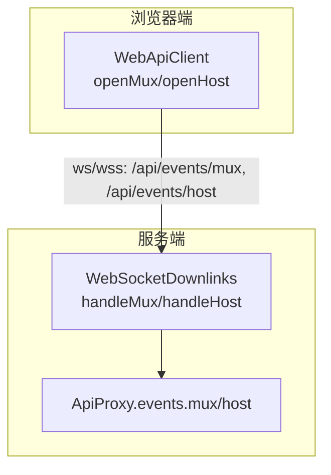
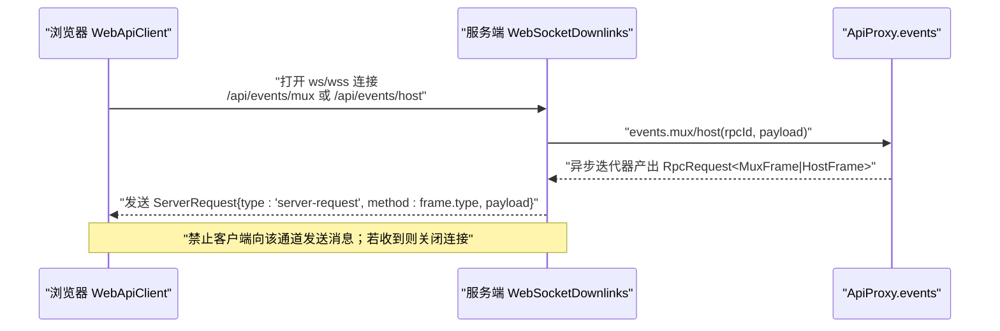
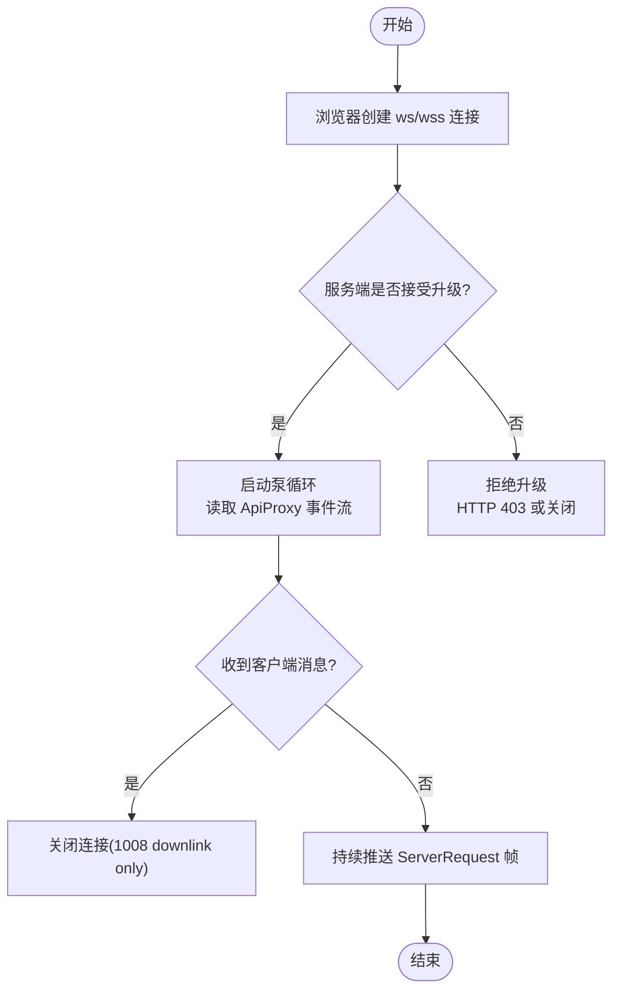
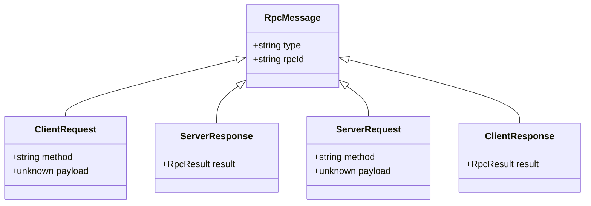
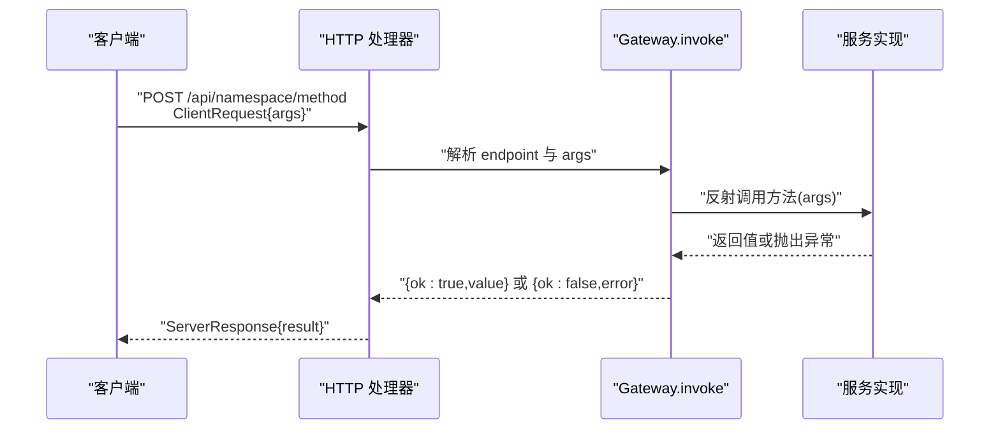
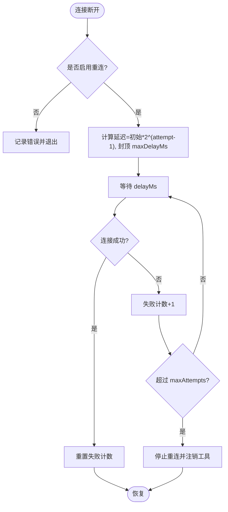
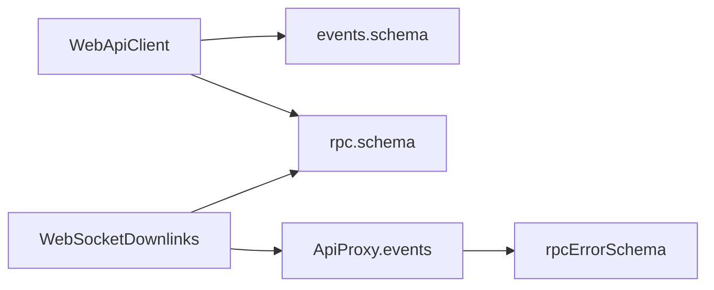

# WebSocket 协议

<cite>
**本文引用的文件**
- [packages/host/apiproxy/src/api/rpc.ts](file://packages/host/apiproxy/src/api/rpc.ts)
- [packages/host/apiproxy/src/api/rpc.schema.ts](file://packages/host/apiproxy/src/api/rpc.schema.ts)
- [packages/host/apiproxy/src/api/events.schema.ts](file://packages/host/apiproxy/src/api/events.schema.ts)
- [packages/client/connection/src/websocket-downlink.ts](file://packages/client/connection/src/websocket-downlink.ts)
- [packages/client/connection/src/client/web-api-client.ts](file://packages/client/connection/src/client/web-api-client.ts)
- [packages/mcp/mcp-client/src/connection.ts](file://packages/mcp/mcp-client/src/connection.ts)
</cite>

## 目录
1. [简介](#简介)
2. [项目结构](#项目结构)
3. [核心组件](#核心组件)
4. [架构总览](#架构总览)
5. [详细组件分析](#详细组件分析)
6. [依赖关系分析](#依赖关系分析)
7. [性能与可靠性](#性能与可靠性)
8. [故障排查指南](#故障排查指南)
9. [结论](#结论)
10. [附录：RPC 方法与事件类型](#附录rpc-方法与事件类型)

## 简介
本文件为 DeepSeek Harness 中基于 WebSocket 的通信协议技术文档。内容覆盖连接建立流程、认证机制、消息格式与事件类型、RPC 方法规范、错误码定义、重连策略与超时处理，以及握手、心跳与安全验证的实现细节，并附带完整的消息序列图与交互流程图。

## 项目结构
WebSocket 相关实现主要分布在以下模块：
- 协议与消息模型：在 apiproxy 的 api 层定义四象限 RPC 消息、错误体与事件帧模式。
- 服务端下行链路：在 client/connection 中以 WebSocketDownlinks 提供两条只下行的事件流（mux 与 host）。
- 浏览器客户端：在 web-api-client 中通过原生 WebSocket 订阅事件流，并将上行请求走 HTTP fetch。
- 重连与恢复：在 mcp-client 中实现指数退避的重连策略，供需要长连接的子系统参考。

**图表来源**
- [packages/client/connection/src/client/web-api-client.ts:18-32](file://packages/client/connection/src/client/web-api-client.ts#L18-L32)
- [packages/client/connection/src/websocket-downlink.ts:64-82](file://packages/client/connection/src/websocket-downlink.ts#L64-L82)

**章节来源**
- [packages/client/connection/src/client/web-api-client.ts:1-92](file://packages/client/connection/src/client/web-api-client.ts#L1-L92)
- [packages/client/connection/src/websocket-downlink.ts:1-154](file://packages/client/connection/src/websocket-downlink.ts#L1-L154)

## 核心组件
- 四象限 RPC 消息与错误模型：client-request/server-response/server-request/client-response，统一以 rpcId 关联，result 采用 ok/value 或 ok/error 分支。
- 事件帧模式：muxFrameSchema 与 hostFrameSchema 定义了事件流的帧类型集合，包含 session/event、approval/requested、question/requested、stream/error 等。
- 下行链路：WebSocketDownlinks 负责升级 HTTP 到 WebSocket，仅允许下行推送；任何来自客户端的上行消息将被拒绝。
- 浏览器客户端：WebApiClient 将上行调用走 HTTP，下行事件通过 ws/wss 订阅 mux/host 两个通道。
- 重连策略：mcp-client 的连接管理器实现了可配置的指数退避重连，支持最大尝试次数与稳定窗口重置。

**章节来源**
- [packages/host/apiproxy/src/api/rpc.ts:148-194](file://packages/host/apiproxy/src/api/rpc.ts#L148-L194)
- [packages/host/apiproxy/src/api/rpc.schema.ts:98-141](file://packages/host/apiproxy/src/api/rpc.schema.ts#L98-L141)
- [packages/host/apiproxy/src/api/events.schema.ts:42-94](file://packages/host/apiproxy/src/api/events.schema.ts#L42-L94)
- [packages/client/connection/src/websocket-downlink.ts:46-138](file://packages/client/connection/src/websocket-downlink.ts#L46-L138)
- [packages/client/connection/src/client/web-api-client.ts:18-92](file://packages/client/connection/src/client/web-api-client.ts#L18-L92)
- [packages/mcp/mcp-client/src/connection.ts:27-90](file://packages/mcp/mcp-client/src/connection.ts#L27-L90)

## 架构总览
下图展示了浏览器端与服务端的交互：HTTP 用于请求/响应，WebSocket 用于服务器到浏览器的单向事件流。

**图表来源**
- [packages/client/connection/src/client/web-api-client.ts:18-32](file://packages/client/connection/src/client/web-api-client.ts#L18-L32)
- [packages/client/connection/src/websocket-downlink.ts:64-82](file://packages/client/connection/src/websocket-downlink.ts#L64-L82)
- [packages/client/connection/src/websocket-downlink.ts:109-111](file://packages/client/connection/src/websocket-downlink.ts#L109-L111)

## 详细组件分析

### 连接建立与握手
- 浏览器侧通过 WebApiClient.openMux/openHost 构造 ws/wss URL 并创建 WebSocket 连接，路径分别为 /api/events/mux 与 /api/events/host。
- 服务端通过 WebSocketDownlinks.handleMux/handleHost 接受升级请求，绑定 close/error/message 事件，并在首次收到客户端消息时立即关闭连接（状态码 1008，原因“downlink only”），确保下行通道单向性。
- 握手阶段无额外鉴权参数；安全由上层 HTTP 网关/反向代理控制。

**图表来源**
- [packages/client/connection/src/client/web-api-client.ts:34-92](file://packages/client/connection/src/client/web-api-client.ts#L34-L92)
- [packages/client/connection/src/websocket-downlink.ts:99-138](file://packages/client/connection/src/websocket-downlink.ts#L99-L138)

**章节来源**
- [packages/client/connection/src/client/web-api-client.ts:18-92](file://packages/client/connection/src/client/web-api-client.ts#L18-L92)
- [packages/client/connection/src/websocket-downlink.ts:99-138](file://packages/client/connection/src/websocket-downlink.ts#L99-L138)

### 认证机制
- 当前 WebSocket 通道本身不携带认证信息；认证由上游 HTTP 层（如网关、反向代理）完成。
- 若未通过前置校验，可使用 rejectWebSocketUpgrade 直接返回 HTTP 403。

**章节来源**
- [packages/client/connection/src/websocket-downlink.ts:140-153](file://packages/client/connection/src/websocket-downlink.ts#L140-L153)

### 消息格式与事件类型
- 四象限 RPC 消息：
  - ClientRequest/ServerResponse：HTTP POST /api/<method> 的请求与响应。
  - ServerRequest/ClientResponse：服务器发起的事件/问答等，客户端通过 POST /api/respond 回答。
- 事件帧（ServerRequest.payload）：
  - Mux 通道：session/event、session/subscribed、approval/requested、approval/resolved、question/requested、question/resolved、session/queue、session/jobs、session/projection、stream/error。
  - Host 通道：host/session-added、host/session-removed、host/session-status、host/agent-error、host/workspace-changed、host/workspace-removed、host/workspace-order-changed、host/archived-sessions-changed、host/remote-event、stream/error。
- 所有帧均包裹在 ServerRequest.full form 中，使用 rpcId 标识一次推送。

**图表来源**
- [packages/host/apiproxy/src/api/rpc.ts:148-194](file://packages/host/apiproxy/src/api/rpc.ts#L148-L194)
- [packages/host/apiproxy/src/api/rpc.schema.ts:98-141](file://packages/host/apiproxy/src/api/rpc.schema.ts#L98-L141)

**章节来源**
- [packages/host/apiproxy/src/api/rpc.ts:148-194](file://packages/host/apiproxy/src/api/rpc.ts#L148-L194)
- [packages/host/apiproxy/src/api/events.schema.ts:42-94](file://packages/host/apiproxy/src/api/events.schema.ts#L42-L94)

### RPC 方法与参数/返回值
- 方法命名空间与具体方法通过字符串 endpoint（如 namespace/method）标识。
- 请求体为 ClientRequest，payload 中的 args 字段承载业务参数；响应为 ServerResponse，result 为 {ok:true,value} 或 {ok:false,error}。
- 服务端对未知或非法 endpoint 会返回 bad-request 等错误；对已声明但不可调用的方法返回 method-unavailable。

**图表来源**
- [packages/api/gateway/src/index.ts:162-222](file://packages/api/gateway/src/index.ts#L162-L222)

**章节来源**
- [packages/api/gateway/src/index.ts:162-222](file://packages/api/gateway/src/index.ts#L162-L222)

### 错误码定义
- 错误体遵循 rpcErrorSchema，按 code 区分，每个 code 对应 details 结构。
- 常见错误包括 bad-request、cancelled、session-not-found、model-unavailable、settings-rejected、internal 等。
- 传输异常会被折叠为 internal 错误。

**章节来源**
- [packages/host/apiproxy/src/api/rpc.ts:31-130](file://packages/host/apiproxy/src/api/rpc.ts#L31-L130)
- [packages/host/apiproxy/src/api/rpc.schema.ts:33-79](file://packages/host/apiproxy/src/api/rpc.schema.ts#L33-L79)

### 重连策略与超时处理
- MCP 客户端提供可配置的重连策略：initialDelayMs、maxDelayMs、maxAttempts，默认启用，失败后指数退避，达到上限后停止并重试需外部触发。
- 连接断开后进入 scheduleReconnect，根据失败次数计算延迟，超过 maxDelayMs 封顶；稳定运行一段时间后重置失败计数。
- 对于生命周期管理，存在关闭超时（如 GENERATION_CLOSE_TIMEOUT_MS）防止挂起。

**图表来源**
- [packages/mcp/mcp-client/src/connection.ts:65-90](file://packages/mcp/mcp-client/src/connection.ts#L65-L90)
- [packages/mcp/mcp-client/src/connection.ts:192-225](file://packages/mcp/mcp-client/src/connection.ts#L192-L225)

**章节来源**
- [packages/mcp/mcp-client/src/connection.ts:27-90](file://packages/mcp/mcp-client/src/connection.ts#L27-L90)
- [packages/mcp/mcp-client/src/connection.ts:192-225](file://packages/mcp/mcp-client/src/connection.ts#L192-L225)

### 心跳检测
- 当前 WebSocket 下行通道未实现显式心跳；保持活跃由底层 TCP/WebSocket 栈保障。
- 若需应用层心跳，可在事件流中引入周期性 keepalive 帧或在网关层配置空闲超时。

[本节为通用建议，不涉及具体代码]

### 安全验证
- 下行通道禁止客户端发送消息，违反即关闭连接。
- 可通过 rejectWebSocketUpgrade 在未通过前置校验时拒绝升级。
- 建议在网关层实施 TLS、访问控制与速率限制。

**章节来源**
- [packages/client/connection/src/websocket-downlink.ts:109-111](file://packages/client/connection/src/websocket-downlink.ts#L109-L111)
- [packages/client/connection/src/websocket-downlink.ts:140-153](file://packages/client/connection/src/websocket-downlink.ts#L140-L153)

## 依赖关系分析
- WebApiClient 依赖 events.schema 中的 frame 模式进行二次解析，依赖 rpc.schema 的全量消息模式。
- WebSocketDownlinks 依赖 ApiProxy.events 提供的异步迭代器，将业务事件转换为 ServerRequest 帧并通过 ws.send 推送。
- 错误处理集中在 rpcErrorSchema 与 transportError 折叠逻辑中，保证跨通道一致的错误语义。

**图表来源**
- [packages/client/connection/src/client/web-api-client.ts:1-92](file://packages/client/connection/src/client/web-api-client.ts#L1-L92)
- [packages/client/connection/src/websocket-downlink.ts:1-154](file://packages/client/connection/src/websocket-downlink.ts#L1-L154)
- [packages/host/apiproxy/src/api/events.schema.ts:1-94](file://packages/host/apiproxy/src/api/events.schema.ts#L1-L94)
- [packages/host/apiproxy/src/api/rpc.schema.ts:1-141](file://packages/host/apiproxy/src/api/rpc.schema.ts#L1-L141)

**章节来源**
- [packages/client/connection/src/client/web-api-client.ts:1-92](file://packages/client/connection/src/client/web-api-client.ts#L1-L92)
- [packages/client/connection/src/websocket-downlink.ts:1-154](file://packages/client/connection/src/websocket-downlink.ts#L1-L154)
- [packages/host/apiproxy/src/api/events.schema.ts:1-94](file://packages/host/apiproxy/src/api/events.schema.ts#L1-L94)
- [packages/host/apiproxy/src/api/rpc.schema.ts:1-141](file://packages/host/apiproxy/src/api/rpc.schema.ts#L1-L141)

## 性能与可靠性
- 下行通道为单向流，避免双向竞争，降低拥塞风险。
- 事件帧采用 JSON 文本传输，便于调试与跨语言兼容；二进制帧会被丢弃。
- 重连策略具备指数退避与上限控制，避免雪崩；稳定窗口重置减少误判。
- 建议在网关层启用连接池与并发限制，保护后端资源。

[本节为通用指导，不涉及具体代码]

## 故障排查指南
- 连接被拒绝：检查上游网关是否放行 ws/wss 升级；确认路径为 /api/events/mux 或 /api/events/host。
- 客户端消息导致断开：下行通道禁止上行消息，请改用 HTTP 调用。
- 事件解析失败：确认事件帧符合 muxFrameSchema 或 hostFrameSchema；关注 stream/error 帧中的错误码与详情。
- 重连风暴：检查 reconnection 配置是否合理，确保 initialDelayMs ≤ maxDelayMs，maxAttempts 适当。

**章节来源**
- [packages/client/connection/src/websocket-downlink.ts:109-111](file://packages/client/connection/src/websocket-downlink.ts#L109-L111)
- [packages/host/apiproxy/src/api/events.schema.ts:42-94](file://packages/host/apiproxy/src/api/events.schema.ts#L42-L94)
- [packages/mcp/mcp-client/src/connection.ts:65-90](file://packages/mcp/mcp-client/src/connection.ts#L65-L90)

## 结论
本仓库的 WebSocket 协议以四象限 RPC 为核心，结合严格的消息模式与错误体系，提供稳定的服务器到浏览器事件通道。通过单向下行设计、严格的帧校验与可配置重连策略，兼顾了可靠性与可维护性。建议在网关层完善认证与限流，并根据业务需求引入心跳与监控。

## 附录：RPC 方法与事件类型
- RPC 方法：通过 endpoint 字符串标识（namespace/method），请求体为 ClientRequest，响应体为 ServerResponse。
- 事件类型（Mux 通道）：session/event、session/subscribed、approval/requested、approval/resolved、question/requested、question/resolved、session/queue、session/jobs、session/projection、stream/error。
- 事件类型（Host 通道）：host/session-added、host/session-removed、host/session-status、host/agent-error、host/workspace-changed、host/workspace-removed、host/workspace-order-changed、host/archived-sessions-changed、host/remote-event、stream/error。

**章节来源**
- [packages/host/apiproxy/src/api/events.schema.ts:42-94](file://packages/host/apiproxy/src/api/events.schema.ts#L42-L94)
- [packages/host/apiproxy/src/api/rpc.ts:148-194](file://packages/host/apiproxy/src/api/rpc.ts#L148-L194)