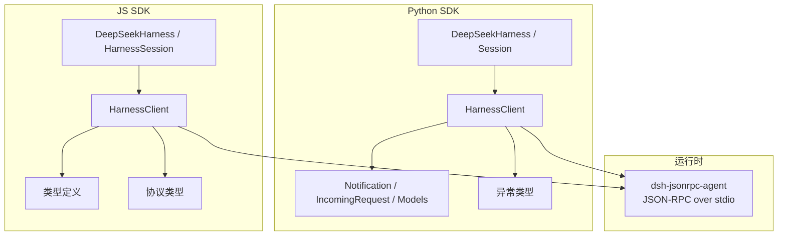
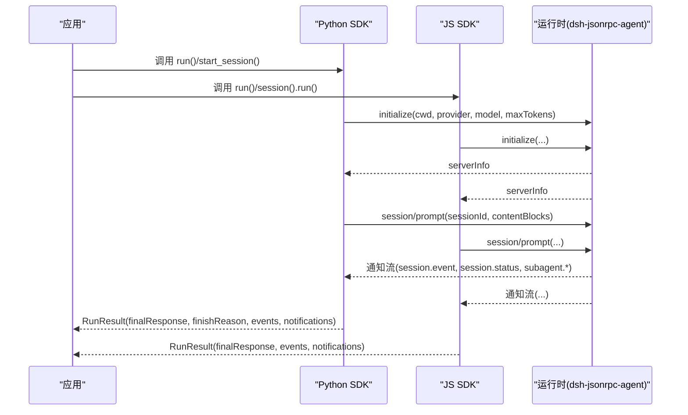
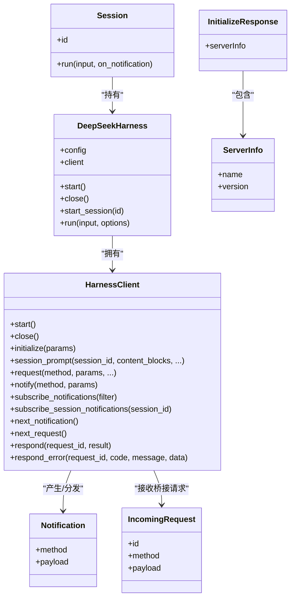
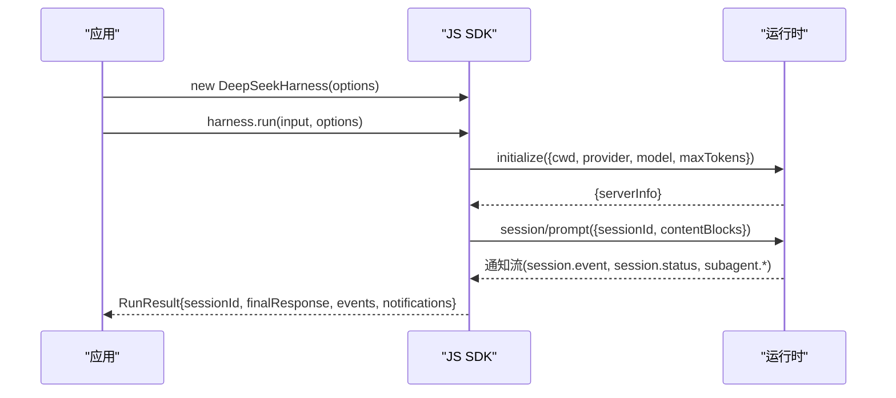
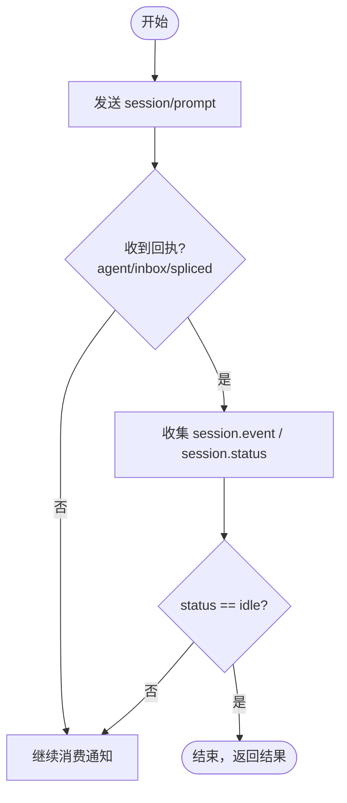
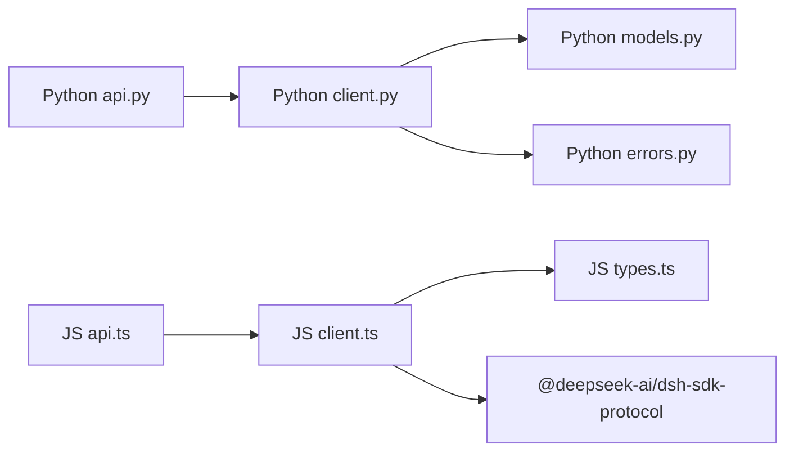

# 客户端 API

<cite>
**本文引用的文件**
- [python/sdk/src/deepseek_harness/__init__.py](file://python/sdk/src/deepseek_harness/__init__.py)
- [python/sdk/src/deepseek_harness/api.py](file://python/sdk/src/deepseek_harness/api.py)
- [python/sdk/src/deepseek_harness/client.py](file://python/sdk/src/deepseek_harness/client.py)
- [python/sdk/src/deepseek_harness/models.py](file://python/sdk/src/deepseek_harness/models.py)
- [python/sdk/src/deepseek_harness/errors.py](file://python/sdk/src/deepseek_harness/errors.py)
- [packages/sdk/client/src/index.ts](file://packages/sdk/client/src/index.ts)
- [packages/sdk/client/src/api.ts](file://packages/sdk/client/src/api.ts)
- [packages/sdk/client/src/client.ts](file://packages/sdk/client/src/client.ts)
- [packages/sdk/client/src/types.ts](file://packages/sdk/client/src/types.ts)
- [packages/sdk/protocol/src/types.ts](file://packages/sdk/protocol/src/types.ts)
- [python/sdk/tests/test_client.py](file://python/sdk/tests/test_client.py)
- [packages/sdk/client/tests/sdk-client.spec.ts](file://packages/sdk/client/tests/sdk-client.spec.ts)
</cite>

## 目录
1. [简介](#简介)
2. [项目结构](#项目结构)
3. [核心组件](#核心组件)
4. [架构总览](#架构总览)
5. [详细组件分析](#详细组件分析)
6. [依赖关系分析](#依赖关系分析)
7. [性能与可靠性](#性能与可靠性)
8. [故障排查指南](#故障排查指南)
9. [结论](#结论)
10. [附录：接口规范与示例路径](#附录接口规范与示例路径)

## 简介
本文件为 DeepSeek Harness 客户端 API 的完整文档，覆盖 Python SDK 与 JavaScript（TypeScript）SDK 的接口规范、连接建立、认证配置、会话管理、消息传递、异步通信模式、错误处理、重试机制与性能优化。同时说明进程内 JSON-RPC over stdio 的传输模型、通知订阅、事件处理以及如何在现有应用中集成。

## 项目结构
仓库包含两套对等的客户端实现：
- Python SDK：位于 python/sdk，提供同步阻塞式 API，通过子进程启动运行时并基于标准输入输出进行 JSON-RPC 通信。
- JavaScript SDK：位于 packages/sdk/client，提供异步 API，同样以子进程方式驱动运行时，使用行分隔 JSON-RPC 传输。

图表来源
- [python/sdk/src/deepseek_harness/api.py:1-243](file://python/sdk/src/deepseek_harness/api.py#L1-L243)
- [python/sdk/src/deepseek_harness/client.py:1-558](file://python/sdk/src/deepseek_harness/client.py#L1-L558)
- [packages/sdk/client/src/api.ts:1-247](file://packages/sdk/client/src/api.ts#L1-L247)
- [packages/sdk/client/src/client.ts:1-474](file://packages/sdk/client/src/client.ts#L1-L474)
- [packages/sdk/protocol/src/types.ts:1-106](file://packages/sdk/protocol/src/types.ts#L1-L106)

章节来源
- [python/sdk/src/deepseek_harness/__init__.py:1-20](file://python/sdk/src/deepseek_harness/__init__.py#L1-L20)
- [packages/sdk/client/src/index.ts:1-30](file://packages/sdk/client/src/index.ts#L1-L30)

## 核心组件
- Python SDK
  - DeepSeekHarness：高层封装，负责生命周期、初始化参数注入、会话创建与单轮运行。
  - Session：绑定会话 ID，收集通知与事件，等待会话空闲结束一轮。
  - HarnessClient：底层 JSON-RPC 客户端，管理子进程、读写线程、请求-响应、通知分发与订阅。
  - 数据模型：Notification、IncomingRequest、InitializeResponse 等。
  - 异常：TransportClosedError、SdkProtocolError、JsonRpcError。
- JavaScript SDK
  - DeepSeekHarness：高层封装，懒启动子进程，维护 initialize 握手缓存，支持失败后重建客户端并重试。
  - HarnessSession：会话级 run，收集 session.event 事件，等待 idle 结束。
  - HarnessClient：底层 JSON-RPC 客户端，管理子进程、传输层、通知订阅、超时控制与优雅关闭。
  - 类型：HarnessClientOptions、DeepSeekHarnessOptions、RunResult、HarnessNotification 等。
  - 协议类型：initialize、session/prompt、shutdown 及通知映射。

章节来源
- [python/sdk/src/deepseek_harness/api.py:13-184](file://python/sdk/src/deepseek_harness/api.py#L13-L184)
- [python/sdk/src/deepseek_harness/client.py:24-558](file://python/sdk/src/deepseek_harness/client.py#L24-L558)
- [python/sdk/src/deepseek_harness/models.py:1-33](file://python/sdk/src/deepseek_harness/models.py#L1-L33)
- [python/sdk/src/deepseek_harness/errors.py:1-24](file://python/sdk/src/deepseek_harness/errors.py#L1-L24)
- [packages/sdk/client/src/api.ts:22-195](file://packages/sdk/client/src/api.ts#L22-L195)
- [packages/sdk/client/src/client.ts:184-458](file://packages/sdk/client/src/client.ts#L184-L458)
- [packages/sdk/client/src/types.ts:1-75](file://packages/sdk/client/src/types.ts#L1-L75)
- [packages/sdk/protocol/src/types.ts:15-106](file://packages/sdk/protocol/src/types.ts#L15-L106)

## 架构总览
两端 SDK 均遵循相同的运行时协议：通过子进程启动 dsh-jsonrpc-agent，使用 JSON-RPC over stdio 进行通信。客户端负责：
- 启动与关闭子进程
- 发送 initialize 握手（cwd、provider、model、maxTokens）
- 发送 session/prompt 提交用户消息
- 订阅通知（session.event、session.status、subagent.started/finished）
- 解析最终响应与结束原因

图表来源
- [python/sdk/src/deepseek_harness/api.py:97-184](file://python/sdk/src/deepseek_harness/api.py#L97-L184)
- [python/sdk/src/deepseek_harness/client.py:117-184](file://python/sdk/src/deepseek_harness/client.py#L117-L184)
- [packages/sdk/client/src/api.ts:62-195](file://packages/sdk/client/src/api.ts#L62-L195)
- [packages/sdk/client/src/client.ts:268-333](file://packages/sdk/client/src/client.ts#L268-L333)
- [packages/sdk/protocol/src/types.ts:15-106](file://packages/sdk/protocol/src/types.ts#L15-L106)

## 详细组件分析

### Python SDK 组件
- DeepSeekHarness
  - 职责：构造环境（DSH_CWD、DSH_SESSION_ROOT、DSH_CORDIS_CONFIG、DEEPSEEK_BASE_URL、DEEPSEEK_API_KEY），启动子进程，执行 initialize，提供 start_session/run。
  - 关键行为：上下文管理器；懒启动；将 cwd/provider/model/maxTokens 传入 initialize。
- Session
  - 职责：收集 session.event 事件，等待 agent/inbox/spliced 回执与 session.status=idle 结束。
  - 输出：RunResult（final_response、finish_reason、events、notifications）。
- HarnessClient
  - 职责：子进程管理、读写线程、请求-响应队列、通知订阅与过滤、会话树关系记录（subagent.*）、关闭流程（shutdown + terminate/kill）。
  - 关键方法：start/close/initialize/session_prompt/request/notify/subscribe_notifications/subscribe_session_notifications/next_notification/next_request/respond/respond_error。
- 数据模型与异常
  - Notification、IncomingRequest、ServerInfo、InitializeResponse。
  - TransportClosedError、SdkProtocolError、JsonRpcError。

图表来源
- [python/sdk/src/deepseek_harness/api.py:13-184](file://python/sdk/src/deepseek_harness/api.py#L13-L184)
- [python/sdk/src/deepseek_harness/client.py:24-558](file://python/sdk/src/deepseek_harness/client.py#L24-L558)
- [python/sdk/src/deepseek_harness/models.py:13-33](file://python/sdk/src/deepseek_harness/models.py#L13-L33)

章节来源
- [python/sdk/src/deepseek_harness/api.py:13-184](file://python/sdk/src/deepseek_harness/api.py#L13-L184)
- [python/sdk/src/deepseek_harness/client.py:24-558](file://python/sdk/src/deepseek_harness/client.py#L24-L558)
- [python/sdk/src/deepseek_harness/models.py:1-33](file://python/sdk/src/deepseek_harness/models.py#L1-L33)
- [python/sdk/src/deepseek_harness/errors.py:1-24](file://python/sdk/src/deepseek_harness/errors.py#L1-L24)

### JavaScript SDK 组件
- DeepSeekHarness
  - 职责：构造 launch 选项与工作目录，懒启动子进程，执行一次 initialize，失败时重建客户端并重试；提供 run/session/close。
- HarnessSession
  - 职责：收集 session.event 事件，等待 agent/inbox/spliced 回执与 session.status=idle 结束；返回 RunResult。
- HarnessClient
  - 职责：子进程管理、行分隔 JSON-RPC 传输、通知订阅（含过滤）、会话树关系维护、请求超时控制、优雅关闭（EOF → SIGTERM → SIGKILL）。
  - 关键方法：start/initialize/prompt/request/subscribe/subscribeSessionTree/close。
- 类型与协议
  - HarnessClientOptions、DeepSeekHarnessOptions、RunResult、HarnessNotification。
  - 协议：initialize、session/prompt、shutdown 及通知映射。

图表来源
- [packages/sdk/client/src/api.ts:22-195](file://packages/sdk/client/src/api.ts#L22-L195)
- [packages/sdk/client/src/client.ts:268-333](file://packages/sdk/client/src/client.ts#L268-L333)
- [packages/sdk/protocol/src/types.ts:15-106](file://packages/sdk/protocol/src/types.ts#L15-L106)

章节来源
- [packages/sdk/client/src/api.ts:22-195](file://packages/sdk/client/src/api.ts#L22-L195)
- [packages/sdk/client/src/client.ts:184-458](file://packages/sdk/client/src/client.ts#L184-L458)
- [packages/sdk/client/src/types.ts:1-75](file://packages/sdk/client/src/types.ts#L1-L75)
- [packages/sdk/protocol/src/types.ts:15-106](file://packages/sdk/protocol/src/types.ts#L15-L106)

### 连接建立与认证配置
- 连接建立
  - Python：HarnessClient.start 启动子进程，读取 stdout/stderr，建立读写线程；initialize 完成握手。
  - JS：HarnessClient.start 使用 child_process.spawn 启动子进程，构建 JsonRpcLineTransport，注册通知回调。
- 认证配置
  - Python：DeepSeekHarnessConfig 支持 base_url、api_key，分别注入 DEEPSEEK_BASE_URL、DEEPSEEK_API_KEY；也支持 DSH_CWD、DSH_SESSION_ROOT、DSH_CORDIS_CONFIG。
  - JS：通过 HarnessClientOptions.env 完全控制子进程环境变量；DeepSeekHarnessOptions.cwd/provider/model/maxTokens 在 initialize 中传递。

章节来源
- [python/sdk/src/deepseek_harness/api.py:56-107](file://python/sdk/src/deepseek_harness/api.py#L56-L107)
- [python/sdk/src/deepseek_harness/client.py:63-136](file://python/sdk/src/deepseek_harness/client.py#L63-L136)
- [packages/sdk/client/src/api.ts:32-80](file://packages/sdk/client/src/api.ts#L32-L80)
- [packages/sdk/client/src/client.ts:203-260](file://packages/sdk/client/src/client.ts#L203-L260)
- [packages/sdk/protocol/src/types.ts:15-31](file://packages/sdk/protocol/src/types.ts#L15-L31)

### 会话管理与消息传递
- 会话创建
  - Python：DeepSeekHarness.start_session 生成或复用 sessionId；Session.run 收集事件直到 idle。
  - JS：DeepSeekHarness.session 创建 HarnessSession；run 收集事件直到 idle。
- 消息传递
  - Python：session_prompt 发送 session/prompt，返回 messageId；通过 subscribe_session_notifications 订阅该会话及其后代的通知。
  - JS：prompt 发送 session/prompt，返回 messageId；subscribeSessionTree 订阅会话树通知。
- 事件与状态
  - 双方均等待 agent/inbox/spliced 回执确认入队，再持续消费 session.event 与 session.status，直到 idle 结束。

图表来源
- [python/sdk/src/deepseek_harness/api.py:132-184](file://python/sdk/src/deepseek_harness/api.py#L132-L184)
- [packages/sdk/client/src/api.ts:146-195](file://packages/sdk/client/src/api.ts#L146-L195)

章节来源
- [python/sdk/src/deepseek_harness/api.py:113-184](file://python/sdk/src/deepseek_harness/api.py#L113-L184)
- [packages/sdk/client/src/api.ts:88-195](file://packages/sdk/client/src/api.ts#L88-L195)

### 异步通信模式、错误处理与重试
- 异步通信
  - Python：基于线程与队列的阻塞式 API；on_notification 可回调；subscribe_notifications 支持过滤。
  - JS：基于 Promise 与 AsyncIterable 的异步 API；subscribe 返回可迭代的订阅句柄；支持 tryNext 非阻塞读取。
- 错误处理
  - Python：TransportClosedError（子进程退出/管道关闭）、JsonRpcError（服务端错误响应）、SdkProtocolError（协议不匹配）。
  - JS：TransportClosedError、RequestTimeoutError、JsonRpcResponseError、SdkProtocolError。
- 重试机制
  - JS：DeepSeekHarness.start 失败后会释放旧客户端并创建新实例，后续调用可重试；close 后不再重试。
  - Python：initialize 失败会触发 close；上层需自行重试或重建 HarnessClient。

章节来源
- [python/sdk/src/deepseek_harness/client.py:228-296](file://python/sdk/src/deepseek_harness/client.py#L228-L296)
- [python/sdk/src/deepseek_harness/errors.py:1-24](file://python/sdk/src/deepseek_harness/errors.py#L1-L24)
- [packages/sdk/client/src/client.ts:301-333](file://packages/sdk/client/src/client.ts#L301-L333)
- [packages/sdk/client/src/api.ts:62-80](file://packages/sdk/client/src/api.ts#L62-L80)

### WebSocket 连接管理说明
- 当前 Python 与 JS SDK 均通过子进程 JSON-RPC over stdio 通信，不涉及 WebSocket。
- 若需在浏览器或远程场景使用，应通过 HTTP/WebSocket 网关将请求转发到本地或远端运行时；SDK 本身不直接管理 WebSocket 连接。

[本节为概念性说明，不直接分析具体文件]

## 依赖关系分析
- Python SDK 内部依赖
  - api.py 依赖 client.py、models.py、errors.py。
  - client.py 依赖 models.py、errors.py，并通过 subprocess 管理运行时。
- JS SDK 内部依赖
  - api.ts 依赖 client.ts、types.ts。
  - client.ts 依赖 @deepseek-ai/dsh-sdk-protocol 的类型与传输抽象。
- 外部依赖
  - Python：pydantic 用于模型校验；subprocess 用于子进程管理。
  - JS：node:child_process、@deepseek-ai/dsh-llm、@deepseek-ai/dsh-session、@deepseek-ai/dsh-subagent。

图表来源
- [python/sdk/src/deepseek_harness/api.py:1-243](file://python/sdk/src/deepseek_harness/api.py#L1-L243)
- [python/sdk/src/deepseek_harness/client.py:1-558](file://python/sdk/src/deepseek_harness/client.py#L1-L558)
- [packages/sdk/client/src/api.ts:1-247](file://packages/sdk/client/src/api.ts#L1-L247)
- [packages/sdk/client/src/client.ts:1-474](file://packages/sdk/client/src/client.ts#L1-L474)
- [packages/sdk/protocol/src/types.ts:1-106](file://packages/sdk/protocol/src/types.ts#L1-L106)

章节来源
- [python/sdk/src/deepseek_harness/__init__.py:1-20](file://python/sdk/src/deepseek_harness/__init__.py#L1-L20)
- [packages/sdk/client/src/index.ts:1-30](file://packages/sdk/client/src/index.ts#L1-L30)

## 性能与可靠性
- 性能优化建议
  - 合理设置 requestTimeoutMs/request_timeout_seconds，避免长轮询阻塞。
  - 使用会话树订阅减少无关通知处理开销。
  - 批量事件处理：在 on_notification 中尽量轻量处理，避免阻塞通知分发。
  - 复用 HarnessClient/DeepSeekHarness 实例以减少子进程启动成本。
- 可靠性保障
  - 优雅关闭：先发送 shutdown，再 EOF/SIGTERM/SIGKILL 阶梯终止。
  - 诊断信息：TransportClosedError 携带 exit code 与 stderr tail，便于定位问题。
  - 协议校验：对 initialize/result/event 的结构进行严格校验，防止畸形数据导致崩溃。

[本节提供通用指导，不直接分析具体文件]

## 故障排查指南
- 常见问题
  - 子进程无法启动：检查 command/bin 是否存在、权限与环境变量。
  - 初始化失败：查看 initialize 返回是否包含 serverInfo；否则抛出 SdkProtocolError。
  - 请求超时：调整 requestTimeoutMs/request_timeout_seconds；检查服务端是否卡住。
  - 运行时意外退出：捕获 TransportClosedError，查看错误消息中的 exit code 与 stderr tail。
- 调试技巧
  - 启用 on_notification 观察 session.event 与 session.status 序列。
  - 使用 subscribeSessionTree/subscribe_session_notifications 聚焦目标会话。
  - 在测试中使用 fake runtime 模拟各种边界情况（如 hang、malformed、early exit）。

章节来源
- [python/sdk/tests/test_client.py:720-783](file://python/sdk/tests/test_client.py#L720-L783)
- [packages/sdk/client/tests/sdk-client.spec.ts:246-351](file://packages/sdk/client/tests/sdk-client.spec.ts#L246-L351)

## 结论
Python 与 JavaScript SDK 提供了对等的高层与底层 API，统一通过子进程 JSON-RPC over stdio 与 DeepSeek Harness 运行时交互。两者均支持会话管理、通知订阅、事件收集与优雅关闭，并在错误处理与诊断方面提供一致体验。推荐在生产环境中合理配置超时、环境变量与会话范围，以获得稳定高效的集成效果。

[本节为总结性内容，不直接分析具体文件]

## 附录：接口规范与示例路径

### 协议与方法
- 请求
  - initialize：参数 cwd、provider、model、maxTokens；返回 serverInfo。
  - session/prompt：参数 sessionId、contentBlocks；返回 messageId。
  - shutdown：无参；返回空对象。
- 通知
  - session.event：sessionId、event（SessionEvent）。
  - session.status：sessionId、status（idle/running）。
  - subagent.started：parentSessionId、childSessionId。
  - subagent.finished：provider、agentId、parentSessionId、childSessionId、status、stopReason、lastAssistantMessage。

章节来源
- [packages/sdk/protocol/src/types.ts:15-106](file://packages/sdk/protocol/src/types.ts#L15-L106)

### Python SDK 示例路径
- 高层 API 使用与通知回调
  - [python/sdk/src/deepseek_harness/api.py:97-184](file://python/sdk/src/deepseek_harness/api.py#L97-L184)
- 低层客户端与子进程管理
  - [python/sdk/src/deepseek_harness/client.py:63-184](file://python/sdk/src/deepseek_harness/client.py#L63-L184)
- 端到端测试用例（含环境变量注入、子代理树、超时与关闭）
  - [python/sdk/tests/test_client.py:15-125](file://python/sdk/tests/test_client.py#L15-L125)
  - [python/sdk/tests/test_client.py:127-163](file://python/sdk/tests/test_client.py#L127-L163)
  - [python/sdk/tests/test_client.py:240-339](file://python/sdk/tests/test_client.py#L240-L339)
  - [python/sdk/tests/test_client.py:720-783](file://python/sdk/tests/test_client.py#L720-L783)

### JavaScript SDK 示例路径
- 高层 API 使用与事件收集
  - [packages/sdk/client/src/api.ts:62-195](file://packages/sdk/client/src/api.ts#L62-L195)
- 低层客户端与超时、关闭、订阅
  - [packages/sdk/client/src/client.ts:203-458](file://packages/sdk/client/src/client.ts#L203-L458)
- 端到端测试用例（含重试、错误、stderr tail、SIGTERM/SIGKILL）
  - [packages/sdk/client/tests/sdk-client.spec.ts:115-171](file://packages/sdk/client/tests/sdk-client.spec.ts#L115-L171)
  - [packages/sdk/client/tests/sdk-client.spec.ts:199-242](file://packages/sdk/client/tests/sdk-client.spec.ts#L199-L242)
  - [packages/sdk/client/tests/sdk-client.spec.ts:246-351](file://packages/sdk/client/tests/sdk-client.spec.ts#L246-L351)
  - [packages/sdk/client/tests/sdk-client.spec.ts:353-475](file://packages/sdk/client/tests/sdk-client.spec.ts#L353-L475)