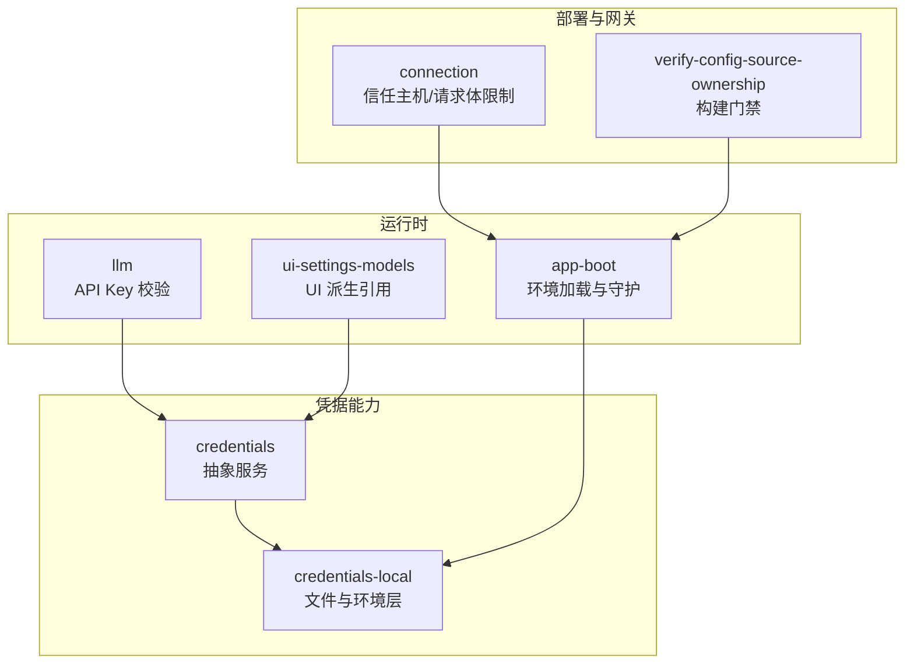
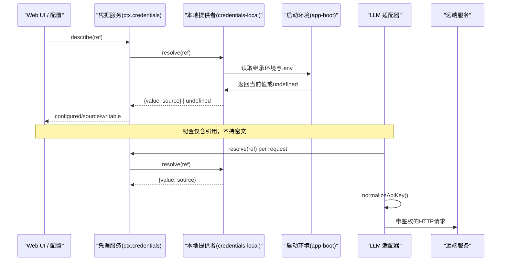
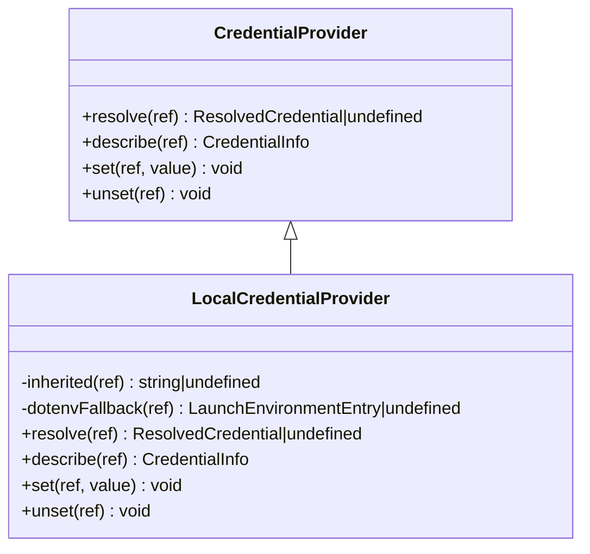
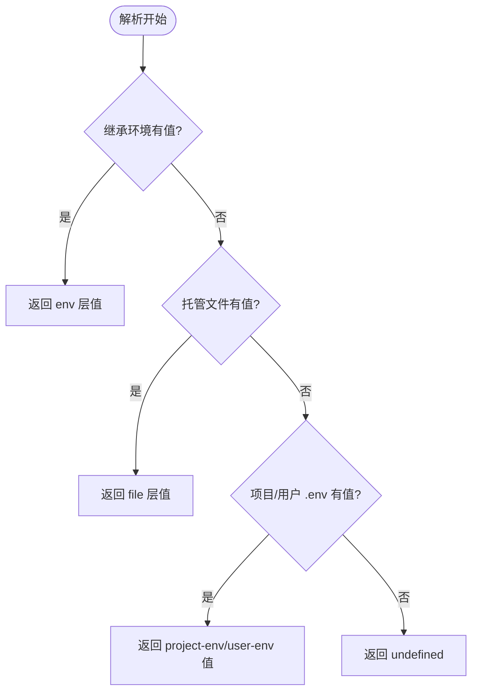
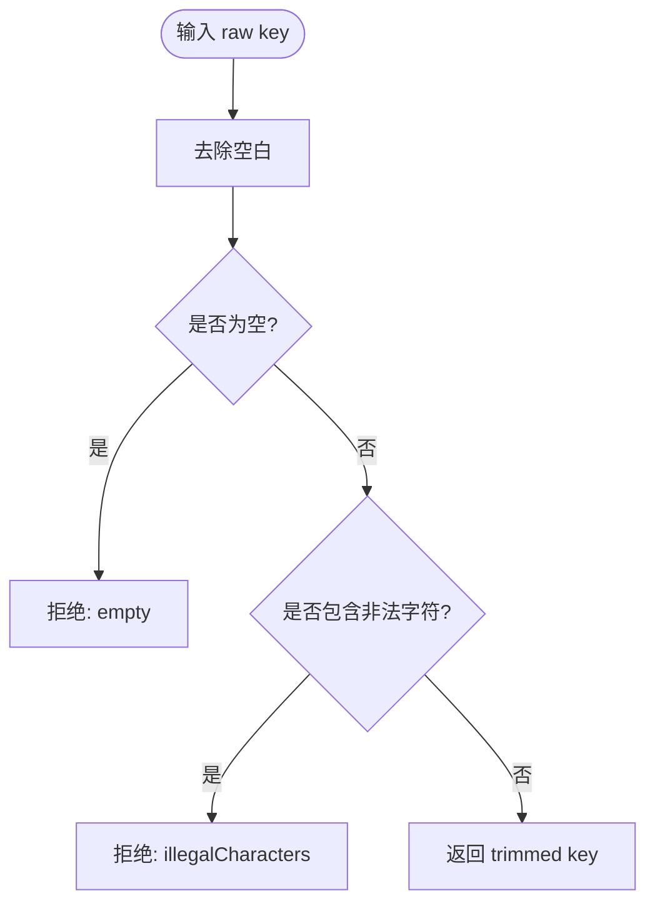
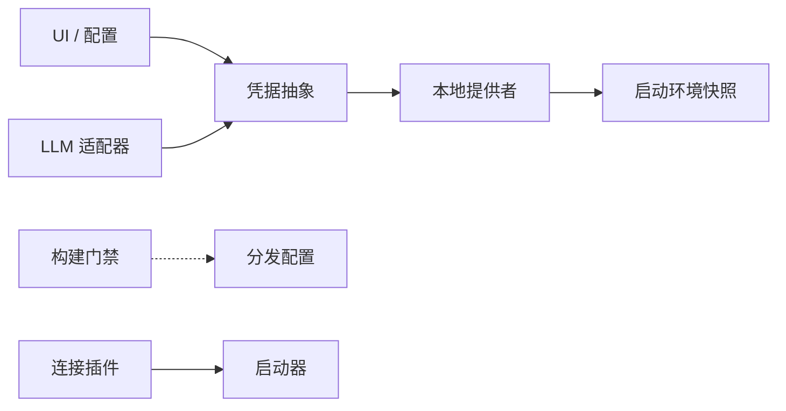

# 认证与配置

<cite>
**本文引用的文件**
- [packages/credentials/credentials/src/index.ts](file://packages/credentials/credentials/src/index.ts)
- [packages/credentials/credentials/src/types.ts](file://packages/credentials/credentials/src/types.ts)
- [packages/credentials/credentials-local/src/index.ts](file://packages/credentials/credentials-local/src/index.ts)
- [packages/llm/llm/src/api-key.ts](file://packages/llm/llm/src/api-key.ts)
- [packages/llm/llm/src/index.ts](file://packages/llm/llm/src/index.ts)
- [packages/client/ui-settings-models/src/client/store.ts](file://packages/client/ui-settings-models/src/client/store.ts)
- [packages/boot/app-boot/src/index.ts](file://packages/boot/app-boot/src/index.ts)
- [scripts/verify-config-source-ownership.ts](file://scripts/verify-config-source-ownership.ts)
- [docs/subsystems/credentials.md](file://docs/subsystems/credentials.md)
- [packages/client/connection/src/index.ts](file://packages/client/connection/src/index.ts)
</cite>

## 目录
1. [简介](#简介)
2. [项目结构](#项目结构)
3. [核心组件](#核心组件)
4. [架构总览](#架构总览)
5. [详细组件分析](#详细组件分析)
6. [依赖关系分析](#依赖关系分析)
7. [性能考虑](#性能考虑)
8. [故障排除指南](#故障排除指南)
9. [结论](#结论)
10. [附录](#附录)

## 简介
本指南面向需要在不同部署模式下正确配置客户端认证的读者，覆盖 API Key 配置、Base URL 设置与环境变量管理；说明本地运行、远程服务与容器化部署的认证方式；提供安全最佳实践、密钥管理与配置验证方法；并给出常见配置场景与排错建议。

## 项目结构
本项目将“凭据引用”与“凭据值来源”解耦：配置中只保存引用（如环境变量名），实际值由凭据提供者按分层策略解析。关键路径包括：
- 凭据抽象与服务定义：`credentials`
- 本地文件与环境层实现：`credentials-local`
- LLM 适配器对 API Key 的格式校验与断言：`llm`
- Web UI 派生凭据引用与错误消息：`client/ui-settings-models`
- 启动期环境加载与受保护变量清单：`boot/app-boot`
- 构建时门禁，禁止在分发配置中内联敏感项：`scripts/verify-config-source-ownership`
- 连接与信任主机白名单：`client/connection`

**图表来源**
- [packages/credentials/credentials/src/index.ts:1-99](file://packages/credentials/credentials/src/index.ts#L1-L99)
- [packages/credentials/credentials-local/src/index.ts:1-497](file://packages/credentials/credentials-local/src/index.ts#L1-L497)
- [packages/boot/app-boot/src/index.ts:71-198](file://packages/boot/app-boot/src/index.ts#L71-L198)
- [packages/llm/llm/src/api-key.ts:1-42](file://packages/llm/llm/src/api-key.ts#L1-L42)
- [packages/client/ui-settings-models/src/client/store.ts:51-71](file://packages/client/ui-settings-models/src/client/store.ts#L51-L71)
- [packages/client/connection/src/index.ts:46-67](file://packages/client/connection/src/index.ts#L46-L67)
- [scripts/verify-config-source-ownership.ts:1-56](file://scripts/verify-config-source-ownership.ts#L1-L56)

**章节来源**
- [packages/credentials/credentials/src/index.ts:1-99](file://packages/credentials/credentials/src/index.ts#L1-L99)
- [packages/credentials/credentials-local/src/index.ts:1-497](file://packages/credentials/credentials-local/src/index.ts#L1-L497)
- [packages/boot/app-boot/src/index.ts:71-198](file://packages/boot/app-boot/src/index.ts#L71-L198)
- [packages/llm/llm/src/api-key.ts:1-42](file://packages/llm/llm/src/api-key.ts#L1-L42)
- [packages/client/ui-settings-models/src/client/store.ts:51-71](file://packages/client/ui-settings-models/src/client/store.ts#L51-L71)
- [packages/client/connection/src/index.ts:46-67](file://packages/client/connection/src/index.ts#L46-L67)
- [scripts/verify-config-source-ownership.ts:1-56](file://scripts/verify-config-source-ownership.ts#L1-L56)

## 核心组件
- 凭据抽象服务：通过 `ctx.credentials` 暴露统一接口，支持解析、描述、写入与删除；空值视为未配置，避免误判。
- 本地凭据提供者：以 `$DSH_HOME/.credentials.yaml` 为可写存储，叠加进程继承环境与 `.env` 回退；支持热重载与权限检查。
- API Key 校验：对传入键进行空白去除与字符集校验，拒绝非法字符，防止透传到上游导致模糊 401。
- UI 引用派生：根据 provider 路由推导标准环境变量名，便于在 Models 页面持久化。
- 启动环境加载：读取项目与用户 `.env`，阻止危险变量从文件注入，生成不可变快照供后续消费。
- 构建门禁：扫描分发配置，禁止使用 `!!js` 内联环境变量或端点，确保配置所有权归属部署层。
- 连接信任：非环回部署需声明可信主机，限制 `/api` 请求体大小，降低横向越权风险。

**章节来源**
- [docs/subsystems/credentials.md:1-134](file://docs/subsystems/credentials.md#L1-L134)
- [packages/credentials/credentials-local/src/index.ts:1-497](file://packages/credentials/credentials-local/src/index.ts#L1-L497)
- [packages/llm/llm/src/api-key.ts:1-42](file://packages/llm/llm/src/api-key.ts#L1-L42)
- [packages/client/ui-settings-models/src/client/store.ts:51-71](file://packages/client/ui-settings-models/src/client/store.ts#L51-L71)
- [packages/boot/app-boot/src/index.ts:71-198](file://packages/boot/app-boot/src/index.ts#L71-L198)
- [scripts/verify-config-source-ownership.ts:1-56](file://scripts/verify-config-source-ownership.ts#L1-L56)
- [packages/client/connection/src/index.ts:46-67](file://packages/client/connection/src/index.ts#L46-L67)

## 架构总览
下图展示了从配置到请求的关键数据流：UI 或配置文件仅持有“引用”，运行时按优先级解析出真实值，LLM 适配器在发送前做格式校验，最终携带到远端服务。

**图表来源**
- [packages/credentials/credentials/src/index.ts:1-99](file://packages/credentials/credentials/src/index.ts#L1-L99)
- [packages/credentials/credentials-local/src/index.ts:249-317](file://packages/credentials/credentials-local/src/index.ts#L249-L317)
- [packages/boot/app-boot/src/index.ts:177-198](file://packages/boot/app-boot/src/index.ts#L177-L198)
- [packages/llm/llm/src/api-key.ts:25-42](file://packages/llm/llm/src/api-key.ts#L25-L42)

## 详细组件分析

### 凭据抽象与服务契约
- 引用类型：POSIX 风格的环境变量名，构造时校验合法性。
- 解析语义：每次操作重新解析，不跨操作缓存，保证变更即时生效。
- 描述语义：不暴露值，仅报告是否已配置、来源与可写性。
- 事件：当可写源发生提交式变更时发出更新事件，用于界面刷新。

**图表来源**
- [packages/credentials/credentials/src/index.ts:1-99](file://packages/credentials/credentials/src/index.ts#L1-L99)
- [packages/credentials/credentials-local/src/index.ts:207-342](file://packages/credentials/credentials-local/src/index.ts#L207-L342)

**章节来源**
- [packages/credentials/credentials/src/index.ts:1-99](file://packages/credentials/credentials/src/index.ts#L1-L99)
- [packages/credentials/credentials/src/types.ts:1-32](file://packages/credentials/credentials/src/types.ts#L1-L32)
- [docs/subsystems/credentials.md:1-134](file://docs/subsystems/credentials.md#L1-L134)

### 本地凭据提供者与分层解析
- 优先级：进程继承环境 > 托管文件 `.credentials.yaml` > 项目 `.env` > 用户 `.env`。
- 安全：文件必须仅所有者可读；写入采用原子写入与文件锁；外部编辑热重载。
- 可写性：继承环境为只读，其他层可通过 UI 或 API 替换。

**图表来源**
- [packages/credentials/credentials-local/src/index.ts:249-317](file://packages/credentials/credentials-local/src/index.ts#L249-L317)

**章节来源**
- [packages/credentials/credentials-local/src/index.ts:1-497](file://packages/credentials/credentials-local/src/index.ts#L1-L497)

### API Key 校验与断言
- 规范化：去除首尾空白，仅允许可打印 ASCII 字符集合。
- 失败诊断：明确区分空值与非法字符，避免将密钥泄露到日志或消息。
- 适配器集成：在发起请求前调用断言，确保头字段合法。

**图表来源**
- [packages/llm/llm/src/api-key.ts:1-42](file://packages/llm/llm/src/api-key.ts#L1-L42)
- [packages/llm/llm/src/index.ts:119-143](file://packages/llm/llm/src/index.ts#L119-L143)

**章节来源**
- [packages/llm/llm/src/api-key.ts:1-42](file://packages/llm/llm/src/api-key.ts#L1-L42)
- [packages/llm/llm/src/index.ts:119-143](file://packages/llm/llm/src/index.ts#L119-L143)

### Web UI 与引用派生
- 依据 provider 路由推导标准环境变量名，便于在 Models 页面持久化。
- 错误消息统一封装，兼容传输失败与宿主拒绝等未知拒绝值。

**章节来源**
- [packages/client/ui-settings-models/src/client/store.ts:51-71](file://packages/client/ui-settings-models/src/client/store.ts#L51-L71)

### 启动期环境加载与安全边界
- 加载顺序：继承环境 > 项目 `.env` > 用户 `.env`，且不会覆盖更高优先级值。
- 安全清单：禁止从文件注入系统级、网络与引导相关变量，强制通过 shell 导出。
- 快照：创建不可变快照供后续模块消费，避免运行时污染。

**章节来源**
- [packages/boot/app-boot/src/index.ts:71-198](file://packages/boot/app-boot/src/index.ts#L71-L198)

### 构建门禁：配置所有权
- 规则：禁止在分发的 Cordis 配置中使用 `!!js` 内联环境变量或端点。
- 目的：确保配置中的敏感项与端点由部署层显式注入，避免仓库内残留。

**章节来源**
- [scripts/verify-config-source-ownership.ts:1-56](file://scripts/verify-config-source-ownership.ts#L1-L56)

### 连接与信任主机
- 非环回部署必须声明可信主机列表，拒绝不符合 Host 的 `/api` 请求。
- 限制请求体大小，防止滥用。

**章节来源**
- [packages/client/connection/src/index.ts:46-67](file://packages/client/connection/src/index.ts#L46-L67)

## 依赖关系分析
- 低耦合：凭据抽象与实现分离，UI 与 LLM 仅依赖抽象。
- 启动期约束：`app-boot` 提供的快照被 `credentials-local` 消费，形成稳定的环境视图。
- 安全门禁：构建脚本独立于运行时，扫描分发配置，保障配置所有权。

**图表来源**
- [packages/credentials/credentials/src/index.ts:1-99](file://packages/credentials/credentials/src/index.ts#L1-L99)
- [packages/credentials/credentials-local/src/index.ts:249-317](file://packages/credentials/credentials-local/src/index.ts#L249-L317)
- [packages/boot/app-boot/src/index.ts:177-198](file://packages/boot/app-boot/src/index.ts#L177-L198)
- [scripts/verify-config-source-ownership.ts:1-56](file://scripts/verify-config-source-ownership.ts#L1-L56)
- [packages/client/connection/src/index.ts:46-67](file://packages/client/connection/src/index.ts#L46-L67)

**章节来源**
- [packages/credentials/credentials/src/index.ts:1-99](file://packages/credentials/credentials/src/index.ts#L1-L99)
- [packages/credentials/credentials-local/src/index.ts:249-317](file://packages/credentials/credentials-local/src/index.ts#L249-L317)
- [packages/boot/app-boot/src/index.ts:177-198](file://packages/boot/app-boot/src/index.ts#L177-L198)
- [scripts/verify-config-source-ownership.ts:1-56](file://scripts/verify-config-source-ownership.ts#L1-L56)
- [packages/client/connection/src/index.ts:46-67](file://packages/client/connection/src/index.ts#L46-L67)

## 性能考虑
- 每操作解析：凭据在每次操作开始时解析，避免缓存导致的延迟生效问题。
- 热重载：托管凭据文件变更通过监听与去抖快速生效，无需重启。
- 最小化 I/O：仅在必要时读写文件，并使用原子写入与文件锁减少竞争。
- 请求前校验：在 LLM 适配器侧尽早拒绝非法 Key，避免无效网络往返。

[本节为通用指导，不直接分析具体文件]

## 故障排除指南
- 无法解析到密钥
  - 确认引用是否正确，检查继承环境、托管文件与 `.env` 层级。
  - 若来自继承环境，则为只读，需在启动 shell 中调整。
- 启动时报“受保护变量来自文件”
  - 将系统/网络/引导相关变量改为在 shell 中 export，不要放入 `.env`。
- 构建时报“配置所有权违规”
  - 移除分发配置中的 `!!js` 内联环境变量或端点，交由部署层注入。
- 请求报 401/403
  - 检查 API Key 是否通过规范化校验；确认 Base URL 与信任主机配置正确。
- 容器化部署
  - 通过 `-e` 注入继承环境变量，或使用编排平台注入；托管文件需具备正确权限。
- 远程服务
  - 确保 `/api` 的 Host 在白名单中；限制请求体大小以避免滥用。

**章节来源**
- [packages/credentials/credentials-local/src/index.ts:249-331](file://packages/credentials/credentials-local/src/index.ts#L249-L331)
- [packages/boot/app-boot/src/index.ts:92-164](file://packages/boot/app-boot/src/index.ts#L92-L164)
- [scripts/verify-config-source-ownership.ts:22-42](file://scripts/verify-config-source-ownership.ts#L22-L42)
- [packages/llm/llm/src/api-key.ts:25-42](file://packages/llm/llm/src/api-key.ts#L25-L42)
- [packages/client/connection/src/index.ts:46-67](file://packages/client/connection/src/index.ts#L46-L67)

## 结论
通过将“配置引用”与“凭据值来源”解耦，并在启动期建立严格的环境边界，项目在本地、远程与容器化部署中都能以一致、安全的方式完成认证与配置。配合构建门禁与连接信任策略，可有效降低密钥泄露与越权访问风险。

[本节为总结，不直接分析具体文件]

## 附录

### 不同部署模式的认证方式速查
- 本地开发
  - 在 shell 中 export 继承环境变量，或通过 Models 页面写入托管凭据文件。
  - 如需覆盖，优先使用继承环境（只读）或托管文件（可写）。
- 远程服务
  - 通过环境变量注入密钥；确保 Base URL 与信任主机配置正确。
  - 限制 `/api` 请求体大小，避免滥用。
- 容器化部署
  - 使用编排平台注入环境变量；托管文件需具备仅所有者可读权限。
  - 启动时禁止从文件注入受保护变量。

[本节为概念性内容，不直接分析具体文件]

### 常见配置场景与参考路径
- 设置 API Key
  - 通过 UI 或 CLI 写入托管凭据文件；或在 shell 中 export 环境变量。
  - 参考：凭据服务与本地提供者实现。
- 设置 Base URL
  - 通过部署层注入环境变量或配置补丁；避免在分发配置中内联。
  - 参考：启动环境加载与构建门禁。
- 切换 Provider
  - 在 Models 页面选择 provider 并配置对应引用；UI 会派生标准环境变量名。
  - 参考：UI 引用派生逻辑。

**章节来源**
- [packages/credentials/credentials/src/index.ts:1-99](file://packages/credentials/credentials/src/index.ts#L1-L99)
- [packages/credentials/credentials-local/src/index.ts:249-331](file://packages/credentials/credentials-local/src/index.ts#L249-L331)
- [packages/boot/app-boot/src/index.ts:177-198](file://packages/boot/app-boot/src/index.ts#L177-L198)
- [scripts/verify-config-source-ownership.ts:22-42](file://scripts/verify-config-source-ownership.ts#L22-L42)
- [packages/client/ui-settings-models/src/client/store.ts:51-71](file://packages/client/ui-settings-models/src/client/store.ts#L51-L71)