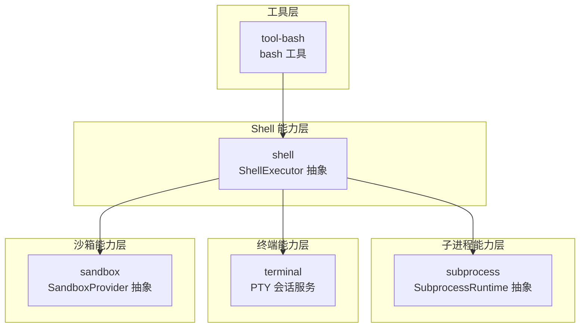
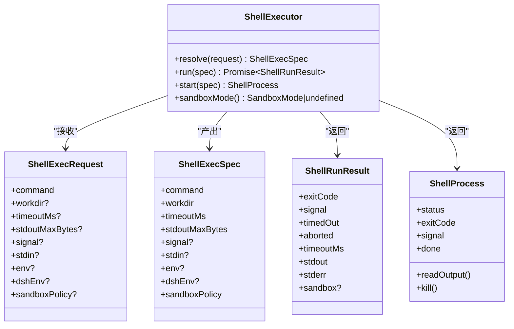
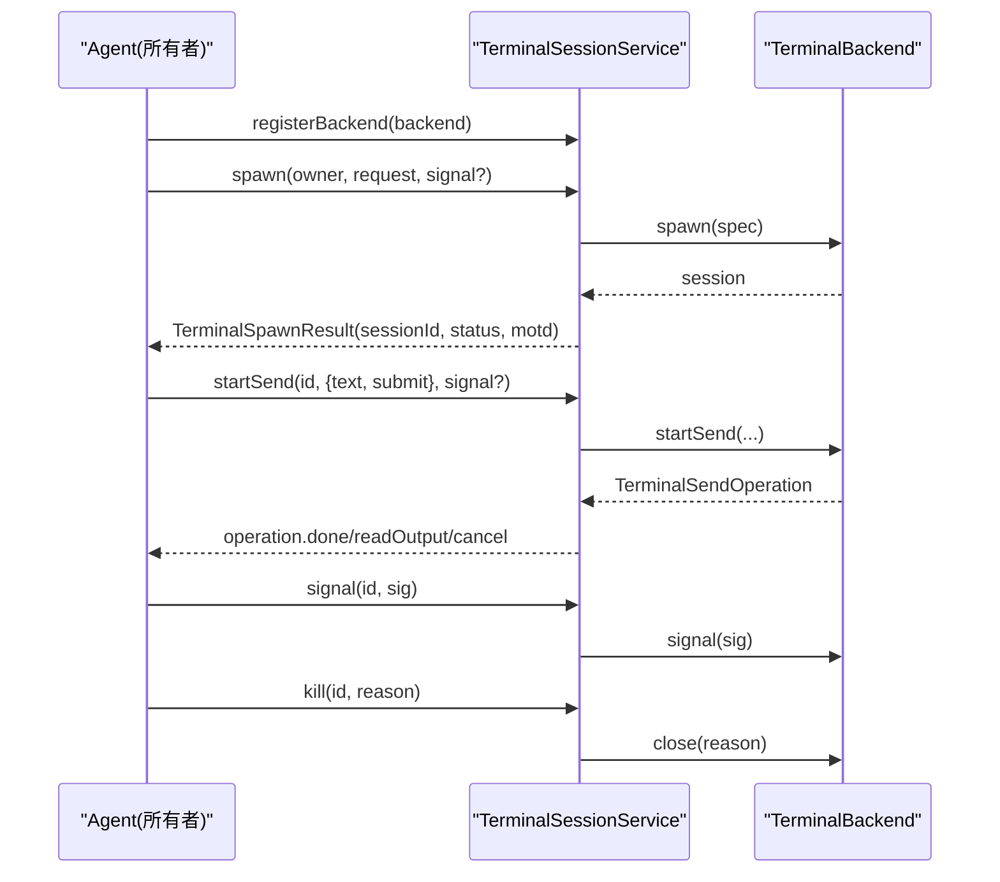
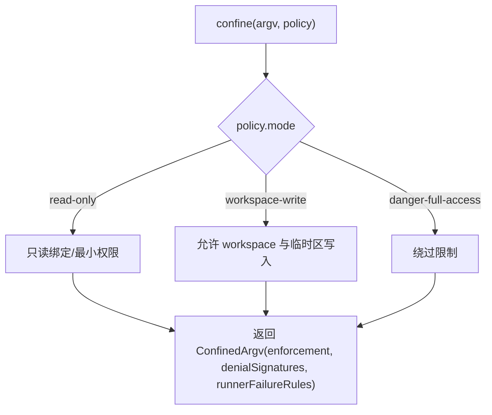
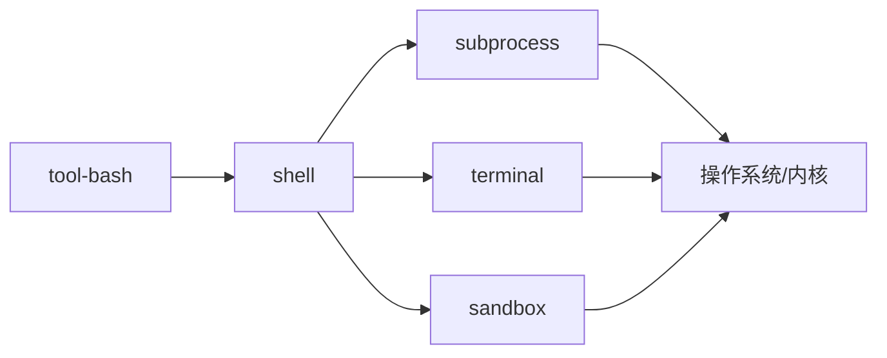

# Shell 命令工具

<cite>
**本文引用的文件**
- [packages/shell/shell/src/index.ts](file://packages/shell/shell/src/index.ts)
- [packages/shell/shell/src/types.ts](file://packages/shell/shell/src/types.ts)
- [packages/subprocess/subprocess/src/index.ts](file://packages/subprocess/subprocess/src/index.ts)
- [packages/subprocess/subprocess/src/types.ts](file://packages/subprocess/subprocess/src/types.ts)
- [packages/terminal/terminal/src/index.ts](file://packages/terminal/terminal/src/index.ts)
- [packages/terminal/terminal/src/types.ts](file://packages/terminal/terminal/src/types.ts)
- [packages/sandbox/sandbox/src/index.ts](file://packages/sandbox/sandbox/src/index.ts)
- [packages/shell/tool-bash/src/index.ts](file://packages/shell/tool-bash/src/index.ts)
</cite>

## 目录
1. [简介](#简介)
2. [项目结构](#项目结构)
3. [核心组件](#核心组件)
4. [架构总览](#架构总览)
5. [详细组件分析](#详细组件分析)
6. [依赖关系分析](#依赖关系分析)
7. [性能考虑](#性能考虑)
8. [故障排查指南](#故障排查指南)
9. [结论](#结论)
10. [附录：常用命令与示例](#附录：常用命令与示例)

## 简介
本文件面向“Shell 命令工具”的 API 与实现，覆盖命令行执行接口、参数传递与输出处理；进程管理、超时控制与资源限制；交互式命令、管道与重定向支持；错误处理、信号处理与进程监控；安全沙箱配置与执行环境隔离；多平台兼容性与编码处理；并提供常见命令使用示例与性能调优建议。

## 项目结构
该能力由多个服务化“能力接缝（capability seam）”组成，形成分层抽象：
- shell：定义 ShellExecutor 抽象与服务注册，统一前台/后台执行语义
- subprocess：定义 SubprocessRuntime 抽象，负责可执行解析、子进程树管理与终端原语
- terminal：PTY 会话注册中心，提供会话生命周期、发送、读取、信号与清理
- sandbox：进程隔离策略与后端选择，提供 confine 包装 argv
- tool-bash：模型侧工具入口，封装 bash 调用、参数校验、沙箱升级审批、前后端呈现



图表来源
- [packages/shell/shell/src/index.ts:65-101](file://packages/shell/shell/src/index.ts#L65-L101)
- [packages/subprocess/subprocess/src/index.ts:102-140](file://packages/subprocess/subprocess/src/index.ts#L102-L140)
- [packages/terminal/terminal/src/index.ts:105-171](file://packages/terminal/terminal/src/index.ts#L105-L171)
- [packages/sandbox/sandbox/src/index.ts:158-176](file://packages/sandbox/sandbox/src/index.ts#L158-L176)
- [packages/shell/tool-bash/src/index.ts:190-395](file://packages/shell/tool-bash/src/index.ts#L190-L395)

章节来源
- [packages/shell/shell/src/index.ts:65-101](file://packages/shell/shell/src/index.ts#L65-L101)
- [packages/subprocess/subprocess/src/index.ts:102-140](file://packages/subprocess/subprocess/src/index.ts#L102-L140)
- [packages/terminal/terminal/src/index.ts:105-171](file://packages/terminal/terminal/src/index.ts#L105-L171)
- [packages/sandbox/sandbox/src/index.ts:158-176](file://packages/sandbox/sandbox/src/index.ts#L158-L176)
- [packages/shell/tool-bash/src/index.ts:190-395](file://packages/shell/tool-bash/src/index.ts#L190-L395)

## 核心组件
- ShellExecutor（shell）
  - 职责：定义 resolve/run/start 三件套，约定前台结果语义、后台句柄语义、增量输出与销毁边界
  - 关键类型：ShellExecRequest/ShellExecSpec/ShellRunResult/ShellProcess/ShellSandboxInfo
- SubprocessRuntime（subprocess）
  - 职责：可执行解析 spawn、收集式/原始流式 stdio、grace 终止升级、终端原语 spawnTerminal
  - 关键类型：SubprocessSpawnSpec/SubprocessHandle/SubprocessTerminalHandle/CollectedOutput
- TerminalSessionService（terminal）
  - 职责：PTY 后端注册、会话创建与发布、发送/读取/信号/关闭、所有者清理
  - 关键类型：TerminalBackend/TerminalSendOperation/TerminalReadResult/TerminalSignal
- SandboxProvider（sandbox）
  - 职责：根据 policy 返回受控 argv 与执行完整性、拒绝规则与失败诊断
  - 关键类型：SandboxPolicy/ConfinedArgv/SandboxEnforcement
- tool-bash（工具）
  - 职责：参数校验、工作目录解析、沙箱策略解析与升级审批、前台/后台执行、结果呈现

章节来源
- [packages/shell/shell/src/types.ts:32-183](file://packages/shell/shell/src/types.ts#L32-L183)
- [packages/subprocess/subprocess/src/types.ts:75-265](file://packages/subprocess/subprocess/src/types.ts#L75-L265)
- [packages/terminal/terminal/src/types.ts:43-178](file://packages/terminal/terminal/src/types.ts#L43-L178)
- [packages/sandbox/sandbox/src/index.ts:23-176](file://packages/sandbox/sandbox/src/index.ts#L23-L176)
- [packages/shell/tool-bash/src/index.ts:33-395](file://packages/shell/tool-bash/src/index.ts#L33-L395)

## 架构总览
下图展示一次前台 bash 执行的端到端流程：工具层构造请求并调用 shell 抽象，shell 通过 subprocess 启动子进程或终端，必要时经 sandbox 包装 argv，最终产出结构化结果。

```mermaid
sequenceDiagram
participant Tool as "tool-bash"
participant Shell as "ShellExecutor"
participant Proc as "SubprocessRuntime"
participant Term as "TerminalSessionService"
participant Sand as "SandboxProvider"
Tool->>Shell : resolve(request)
alt 需要沙箱
Shell->>Sand : confine(argv, policy)
Sand-->>Shell : ConfinedArgv
end
opt 前台交互
Shell->>Term : spawn(owner, request)
Term-->>Shell : TerminalSpawnResult
else 普通子进程
Shell->>Proc : spawn(spec)
Proc-->>Shell : SubprocessHandle
end
Shell-->>Tool : ShellRunResult / ShellProcess
```

图表来源
- [packages/shell/tool-bash/src/index.ts:330-390](file://packages/shell/tool-bash/src/index.ts#L330-L390)
- [packages/shell/shell/src/index.ts:85-100](file://packages/shell/shell/src/index.ts#L85-L100)
- [packages/subprocess/subprocess/src/index.ts:118-140](file://packages/subprocess/subprocess/src/index.ts#L118-L140)
- [packages/terminal/terminal/src/index.ts:154-224](file://packages/terminal/terminal/src/index.ts#L154-L224)
- [packages/sandbox/sandbox/src/index.ts:164-176](file://packages/sandbox/sandbox/src/index.ts#L164-L176)

## 详细组件分析

### ShellExecutor（shell）
- 设计要点
  - resolve：填充默认值与上限，产出 ShellExecSpec
  - run：前台执行，非零退出/超时/中止均返回结果而非抛错
  - start：后台执行，立即返回句柄；done 在进程关闭时 settle，永不 reject
  - 增量输出：readOutput 不重复返回历史；丢失数据时报告 spill 路径
  - 生命周期：composition 销毁时停止并等待后台进程；subprocess 服务销毁才真正终结
- 关键类型
  - ShellExecRequest/ShellExecSpec：command、workdir、timeoutMs、stdin、env、dshEnv、sandboxPolicy
  - ShellRunResult：exitCode、signal、timedOut、aborted、timeoutMs、stdout/stderr、sandbox
  - ShellProcess：status、exitCode、signal、done、readOutput、kill



图表来源
- [packages/shell/shell/src/index.ts:65-101](file://packages/shell/shell/src/index.ts#L65-L101)
- [packages/shell/shell/src/types.ts:32-183](file://packages/shell/shell/src/types.ts#L32-L183)

章节来源
- [packages/shell/shell/src/index.ts:65-101](file://packages/shell/shell/src/index.ts#L65-L101)
- [packages/shell/shell/src/types.ts:32-183](file://packages/shell/shell/src/types.ts#L32-L183)

### SubprocessRuntime（subprocess）
- 设计要点
  - resolveExecutable：在 provider 的执行世界中解析可执行名或绝对路径
  - spawn：无默认值的完全指定 spec，返回 handle；collect 模式支持 offset 读取与 spill 恢复
  - terminate：SIGTERM→grace→SIGKILL 升级，跨平台进程树范围终止
  - spawnTerminal：唯一非管道进程原语，拥有终端分配、文本传输、前台组、信号与会话清理
  - 环境变量清洗：scrubbedParentEnv 移除敏感键与 DSH_* 前缀，显式 env 后合并
- 关键类型
  - SubprocessSpawnSpec：argv、cwd、stdio、graceMs、signal、env
  - SubprocessHandle：pid、stdin/stdout/stderr、collected、done、terminate、waitForExit
  - SubprocessTerminalHandle：pid、output、done、write、inspectForeground、signalForeground、terminate

```mermaid
flowchart TD
Start(["spawn(spec)"]) --> CheckStdin{"stdin 模式?"}
CheckStdin --> |ignore| StdoutCheck{"stdout/stderr 模式?"}
CheckStdin --> |pipe| PipeIn["暴露 stdin 写入"]
CheckStdin --> |{data}| WriteClose["写入数据并关闭"]
PipeIn --> StdoutCheck
WriteClose --> StdoutCheck
StdoutCheck --> |pipe| RawOut["暴露原始可读流"]
StdoutCheck --> |inherit| Inherit["透传到父进程"]
StdoutCheck --> |collect| Collect["有界内存+spill 文件"]
Collect --> Handle["返回 SubprocessHandle"]
RawOut --> Handle
Inherit --> Handle
Handle --> Terminate{"调用 terminate?"}
Terminate --> |是| Escalate["SIGTERM → grace → SIGKILL"]
Terminate --> |否| Wait["等待 done/waitForExit"]
```

图表来源
- [packages/subprocess/subprocess/src/types.ts:75-194](file://packages/subprocess/subprocess/src/types.ts#L75-L194)
- [packages/subprocess/subprocess/src/index.ts:60-66](file://packages/subprocess/subprocess/src/index.ts#L60-L66)

章节来源
- [packages/subprocess/subprocess/src/index.ts:60-66](file://packages/subprocess/subprocess/src/index.ts#L60-L66)
- [packages/subprocess/subprocess/src/types.ts:75-194](file://packages/subprocess/subprocess/src/types.ts#L75-L194)

### TerminalSessionService（terminal）
- 设计要点
  - registerBackend：按 type 注册 PTY 后端，禁止重复
  - spawn：创建并发布 owner-scoped 会话，支持名称保留与取消
  - startSend：独占发送操作，阻塞直到就绪/超时/取消/退出
  - read：向后滚动读取保留文本
  - signal：向已验证的前台进程组发送信号
  - kill/close：幂等关闭并等待后端清理完成
  - 所有者清理：当 Agent 失效时自动中止未发布 spawn 并关闭所有会话
- 关键类型
  - TerminalBackend/TerminalSendOperation/TerminalReadResult/TerminalSignal
  - TerminalSessionSnapshot/TerminalSpawnResult



图表来源
- [packages/terminal/terminal/src/index.ts:125-301](file://packages/terminal/terminal/src/index.ts#L125-L301)
- [packages/terminal/terminal/src/types.ts:147-178](file://packages/terminal/terminal/src/types.ts#L147-L178)

章节来源
- [packages/terminal/terminal/src/index.ts:125-301](file://packages/terminal/terminal/src/index.ts#L125-L301)
- [packages/terminal/terminal/src/types.ts:147-178](file://packages/terminal/terminal/src/types.ts#L147-L178)

### SandboxProvider（sandbox）
- 设计要点
  - confine：将 argv 包装为受控执行序列，返回 enforcement 完整度与 denial 方言
  - 策略：mode/workspaceRoot/sessionId 决定文件访问权限；partial/full 表示约束强度
  - 失败识别：runnerFailureRules 用于区分“运行器失败”和“策略拒绝”
  - 不可用错误：SANDBOX_UNAVAILABLE 明确提示缺少可用后端
- 关键类型
  - SandboxExecutionPolicy/SandboxPolicy/ConfinedArgv/RunnerFailureRule



图表来源
- [packages/sandbox/sandbox/src/index.ts:23-176](file://packages/sandbox/sandbox/src/index.ts#L23-L176)

章节来源
- [packages/sandbox/sandbox/src/index.ts:23-176](file://packages/sandbox/sandbox/src/index.ts#L23-L176)

### tool-bash（工具）
- 设计要点
  - 参数校验：command/description 非空；timeoutMs 正数；sandbox_permissions 与 justification 配对
  - 工作目录：相对路径基于会话工作区解析；优先采用策略 workspaceRoot 一致身份
  - 沙箱升级：先审批再执行；仅允许一次重试；拒绝即终局
  - 前台/后台：前台以终端卡片呈现并解析退出标记；后台返回 jobId，交由 jobs 管理
  - 结果规范化：canonicalBashResult 剥离服务类型，输出稳定 JSON 结构
- 关键行为
  - presentCall/presentResult：UI 呈现差异（终端 vs 通用卡片）
  - 系统提示：提醒检查退出码与失败原因

```mermaid
sequenceDiagram
participant Model as "模型/调用方"
participant Tool as "tool-bash"
participant Shell as "ShellExecutor"
participant Jobs as "jobs(后台)"
Model->>Tool : bash({command, description, timeoutMs?, workdir?, run_in_background?, sandbox_permissions?, justification?})
Tool->>Tool : validateBashArgs()
alt 需要升级
Tool->>Tool : approveEscalation(mode, justification)
end
Tool->>Shell : resolve(request)
opt 后台
Tool->>Jobs : start({label, run})
Jobs->>Shell : start(spec)
Shell-->>Jobs : ShellProcess
Jobs-->>Model : {kind : "background", jobId}
else 前台
Shell-->>Tool : ShellRunResult
Tool-->>Model : {kind : "foreground", ...}
end
```

图表来源
- [packages/shell/tool-bash/src/index.ts:55-93](file://packages/shell/tool-bash/src/index.ts#L55-L93)
- [packages/shell/tool-bash/src/index.ts:190-395](file://packages/shell/tool-bash/src/index.ts#L190-L395)

章节来源
- [packages/shell/tool-bash/src/index.ts:55-93](file://packages/shell/tool-bash/src/index.ts#L55-L93)
- [packages/shell/tool-bash/src/index.ts:190-395](file://packages/shell/tool-bash/src/index.ts#L190-L395)

## 依赖关系分析
- 耦合与内聚
  - tool-bash 强依赖 shell 抽象与 sandbox 策略；对 jobs/terminals 按需注入
  - shell 抽象解耦于具体实现，依赖 subprocess 与 terminal 能力
  - subprocess 与 terminal 各自独立，分别管理进程与 PTY 生命周期
- 外部依赖
  - Cordis 服务框架：服务注册、作用域与销毁
  - Node.js 流与信号：Readable/Writable、AbortSignal、进程信号
  - 平台相关：Windows ACL、macOS seatbelt、Linux Landlock/bwrap（由 sandbox 后端实现）



图表来源
- [packages/shell/tool-bash/src/index.ts:190-395](file://packages/shell/tool-bash/src/index.ts#L190-L395)
- [packages/shell/shell/src/index.ts:65-101](file://packages/shell/shell/src/index.ts#L65-L101)
- [packages/subprocess/subprocess/src/index.ts:102-140](file://packages/subprocess/subprocess/src/index.ts#L102-L140)
- [packages/terminal/terminal/src/index.ts:105-171](file://packages/terminal/terminal/src/index.ts#L105-L171)
- [packages/sandbox/sandbox/src/index.ts:158-176](file://packages/sandbox/sandbox/src/index.ts#L158-L176)

章节来源
- [packages/shell/tool-bash/src/index.ts:190-395](file://packages/shell/tool-bash/src/index.ts#L190-L395)
- [packages/shell/shell/src/index.ts:65-101](file://packages/shell/shell/src/index.ts#L65-L101)
- [packages/subprocess/subprocess/src/index.ts:102-140](file://packages/subprocess/subprocess/src/index.ts#L102-L140)
- [packages/terminal/terminal/src/index.ts:105-171](file://packages/terminal/terminal/src/index.ts#L105-L171)
- [packages/sandbox/sandbox/src/index.ts:158-176](file://packages/sandbox/sandbox/src/index.ts#L158-L176)

## 性能考虑
- 输出收集与溢出
  - 使用 collect 模式的 maxBytes 控制内存占用；开启 spill 以恢复完整流
  - 增量读取避免重复消费；lossy=true 时从 spill 恢复缺失部分
- 超时与中止
  - 前台 run 的 timeoutMs 与 AbortSignal 融合为单一“首个原因”分类（timedOut 与 aborted 互斥）
  - 后台 start 不应用 executor 超时，需由 jobs 或上层调度控制
- 进程树终止
  - terminate 使用 graceMs 缓冲，确保优雅关闭；跨平台保证整棵树被终止
- I/O 模式选择
  - 管道模式适合协议解码；继承模式便于诊断；收集模式适合日志/输出归档
- 终端会话
  - 合理设置 rows/cols 减少重绘；使用 read 分页获取滚动回退，避免全量拉取

[本节为通用指导，无需特定文件引用]

## 故障排查指南
- 沙箱不可用
  - 现象：抛出 SANDBOX_UNAVAILABLE，提示安装 bubblewrap/Landlock/seatbelt/ACL 受限令牌
  - 处理：确认后端可用性；或在确知风险下切换到 danger-full-access
- 运行器失败 vs 策略拒绝
  - 现象：stderr 包含信息行或致命签名；exit code 非零
  - 处理：依据 RunnerFailureRule 判断是否命令未执行；否则视为策略拒绝，调整 policy 或命令
- 终端会话异常
  - 现象：DUPLICATE_BACKEND/DUPLICATE_NAME/NO_SESSION/FOREIGN_SESSION/SEND_ACTIVE/SERVICE_DISPOSING
  - 处理：检查后端注册、名称冲突、所有权、发送并发与服务销毁状态
- 进程无法退出
  - 现象：waitForExit 长时间挂起
  - 处理：增大 graceMs；检查是否有子进程继承描述符；确认 terminate 已被调用
- 环境变量泄露
  - 现象：敏感键出现在子进程环境
  - 处理：避免直接传入；通过 spec.env 显式放行；确认 scrubbedParentEnv 已生效

章节来源
- [packages/sandbox/sandbox/src/index.ts:118-144](file://packages/sandbox/sandbox/src/index.ts#L118-L144)
- [packages/sandbox/sandbox/src/index.ts:74-116](file://packages/sandbox/sandbox/src/index.ts#L74-L116)
- [packages/terminal/terminal/src/index.ts:54-71](file://packages/terminal/terminal/src/index.ts#L54-L71)
- [packages/terminal/terminal/src/index.ts:125-301](file://packages/terminal/terminal/src/index.ts#L125-L301)
- [packages/subprocess/subprocess/src/types.ts:82-104](file://packages/subprocess/subprocess/src/types.ts#L82-L104)
- [packages/subprocess/subprocess/src/index.ts:60-66](file://packages/subprocess/subprocess/src/index.ts#L60-L66)

## 结论
该 Shell 命令工具通过清晰的能力接缝将“工具—Shell—子进程—终端—沙箱”分层解耦，提供稳定的前台/后台执行语义、增量输出、进程树管理与交互式终端能力。配合沙箱策略与环境清洗，可在多平台上安全可控地执行命令。遵循本文档的接口约定与最佳实践，可实现高可靠、可观测、易扩展的命令执行体系。

[本节为总结性内容，无需特定文件引用]

## 附录：常用命令与示例
以下示例聚焦“如何使用”，不包含代码片段，仅给出调用思路与预期结果字段。

- 前台执行
  - 输入：command="ls -la"，description="列出当前目录详情"
  - 输出：kind="foreground"，含 exitCode/signal/timedOut/aborted/timeoutMs/stdout/stderr/sandbox
  - 说明：非零退出会标注 [exit code: N]；长输出尾部保留，完整流可通过 spillPath 获取
- 后台执行
  - 输入：run_in_background=true，command="npm install"，description="安装依赖"
  - 输出：kind="background"，jobId=...
  - 后续：通过 jobs 查询输出与终止任务
- 交互式终端
  - 通过 terminal 能力 spawn 一个 PTY 会话，使用 startSend 发送命令并轮询 readOutput
  - 使用 signal 发送 SIGINT/SIGTERM 中断前台进程组
- 管道与重定向
  - 在 command 中使用 shell 语法进行管道与重定向（如 echo "a" | grep a > out.txt）
  - 若需精确控制流，使用 subprocess 的 pipe/inherited/collect 模式组合
- 超时与中止
  - 前台：设置 timeoutMs；或传入 AbortSignal 触发中止（timedOut 与 aborted 二选一）
  - 后台：由 jobs 或上层调度控制生命周期
- 沙箱与升级
  - 首次运行可能因策略拒绝；在工具中附带 sandbox_permissions 与 justification 申请更宽权限
  - 升级仅允许一次重试；被拒后应停止尝试
- 多平台与编码
  - 子进程输出为 UTF-8 文本；终端输出为字节流，注意编码一致性
  - Windows 使用 ACL 受限令牌；macOS 使用 seatbelt；Linux 使用 Landlock/bwrap

[本节为概念性说明，无需特定文件引用]