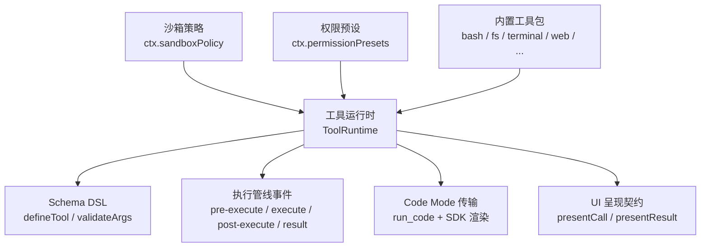
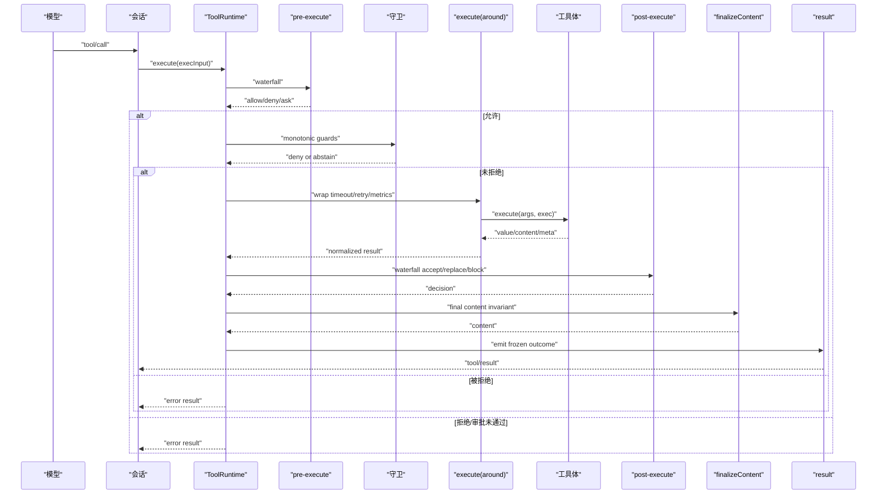
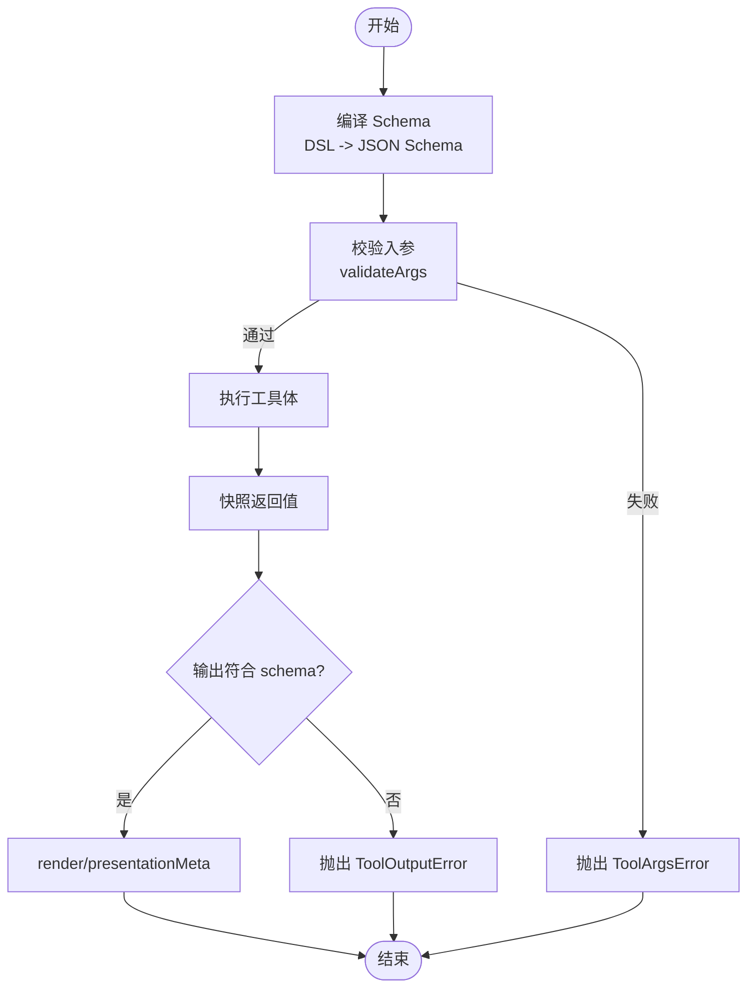
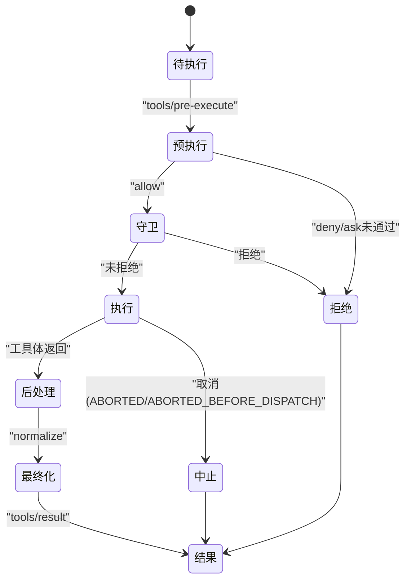
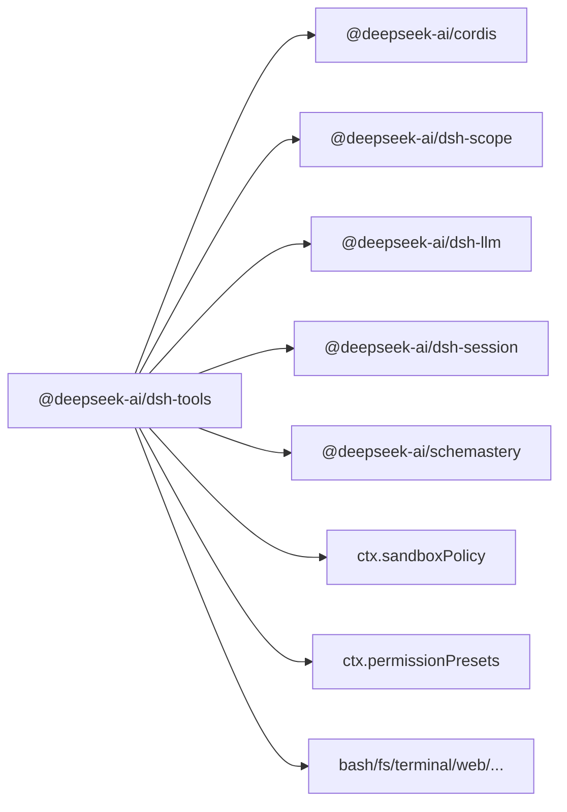

# 工具 API

<cite>
**本文引用的文件**
- [packages/core/tools/src/index.ts](file://packages/core/tools/src/index.ts)
- [packages/core/tools/src/schema.ts](file://packages/core/tools/src/schema.ts)
- [packages/core/tools/src/presentation.ts](file://packages/core/tools/src/presentation.ts)
- [packages/core/tools/src/code-mode.ts](file://packages/core/tools/src/code-mode.ts)
- [docs/subsystems/tools.md](file://docs/subsystems/tools.md)
- [docs/tool-catalog.md](file://docs/tool-catalog.md)
- [docs/tool-execution-pipeline.md](file://docs/tool-execution-pipeline.md)
- [docs/subsystems/sandbox.md](file://docs/subsystems/sandbox.md)
- [docs/subsystems/permission-presets.md](file://docs/subsystems/permission-presets.md)
</cite>

## 目录
1. [简介](#简介)
2. [项目结构](#项目结构)
3. [核心组件](#核心组件)
4. [架构总览](#架构总览)
5. [详细组件分析](#详细组件分析)
6. [依赖关系分析](#依赖关系分析)
7. [性能考量](#性能考量)
8. [故障排查指南](#故障排查指南)
9. [结论](#结论)
10. [附录](#附录)

## 简介
本文件为“工具系统”的完整 API 文档，覆盖工具的注册、发现与执行接口；工具定义格式、参数验证与执行流程；内置工具清单与使用示例；权限控制与沙箱机制；自定义工具开发指南；工具链组合与工作流编排；执行生命周期与错误处理；以及性能监控与调试方法。内容基于仓库中的核心实现与子系统文档整理而成。

## 项目结构
工具系统的核心位于 packages/core/tools，提供工具注册表、执行管线、类型化 Schema DSL、UI 呈现契约与 Code Mode 传输。配套文档在 docs/subsystems 与 docs/tool-catalog.md 中给出完整的模型可见工具清单与执行流程图。

图表来源
- [packages/core/tools/src/index.ts:787-800](file://packages/core/tools/src/index.ts#L787-L800)
- [docs/subsystems/tools.md:470-574](file://docs/subsystems/tools.md#L470-L574)

章节来源
- [packages/core/tools/src/index.ts:787-800](file://packages/core/tools/src/index.ts#L787-L800)
- [docs/subsystems/tools.md:470-574](file://docs/subsystems/tools.md#L470-L574)

## 核心组件
- 工具定义与注册
  - ToolDefinition：包含模型可见的 ToolSchema（name/description/parameters）以及宿主侧的执行与输出声明（output.execute、output.render、可选 finalizeContent、timeoutMs、isConcurrencySafe、presentCall/presentResult）。
  - defineTool：将作者友好的 ValueSchemaSpec 编译为 JSON Schema，校验参数并推断类型，绑定 execute/render/presentationMeta。
  - ToolRuntime.register：全局或作用域内注册工具；重复名称在同一层会失败；保留名 run_code 不可覆盖。
- 工具发现
  - ToolRuntime.schemas(scope)：按允许字段投影生成模型可见的工具列表，不包含执行回调等宿主字段。
  - ToolRuntime.get(name, scope)：按作用域解析可见的定义。
- 执行管线
  - pre-execute：可允许、拒绝或请求审批（ask），缺失审批能力时 ask 转为拒绝。
  - 单调守卫（guards）：仅能拒绝，不能恢复允许。
  - execute：around-dispatch 包装器（超时、重试、指标）。
  - post-execute：接受、替换 content/value、附加上下文或阻断为错误。
  - finalizeContent：定义级最后的内容不变式检查。
  - result：冻结的最终结果通知。
- 参数与输出校验
  - valueSchemaSpecToJsonSchema / parameterSchemaSpecToJsonSchema：编译作者 DSL 到受支持的 JSON Schema 子集。
  - validateArgs：对入参进行严格校验，不匹配抛出 ToolArgsError。
  - output.schema：对成功返回值进行快照与校验，非法值抛出 ToolOutputError。
- UI 呈现
  - presentCall/presentResult：返回 card-tagged 意图（generic/terminal/diff/search/read/web），供 UI 渲染待执行与已完成卡片。

章节来源
- [packages/core/tools/src/index.ts:211-288](file://packages/core/tools/src/index.ts#L211-L288)
- [packages/core/tools/src/index.ts:470-574](file://packages/core/tools/src/index.ts#L470-L574)
- [packages/core/tools/src/schema.ts:1-200](file://packages/core/tools/src/schema.ts#L1-L200)
- [docs/subsystems/tools.md:9-151](file://docs/subsystems/tools.md#L9-L151)

## 架构总览
工具执行从模型消息进入，经过会话事件记录、UI 待执行卡片、预执行策略、守卫、around 包装、工具体、后处理、最终内容修正、结果通知与 UI 完成卡片。Code Mode 通过 run_code 作为保留传输，内部子调用仍走同一管线并携带父令牌以关联日志。

图表来源
- [docs/tool-execution-pipeline.md:8-60](file://docs/tool-execution-pipeline.md#L8-L60)
- [packages/core/tools/src/index.ts:137-208](file://packages/core/tools/src/index.ts#L137-L208)

章节来源
- [docs/tool-execution-pipeline.md:1-63](file://docs/tool-execution-pipeline.md#L1-L63)
- [packages/core/tools/src/index.ts:137-208](file://packages/core/tools/src/index.ts#L137-L208)

## 详细组件分析

### 工具定义与 Schema DSL
- 作者 DSL：ValueSchemaSpec 支持 string/number/integer/boolean/null/array/object/json/oneOf；object 必须显式声明 additionalProperties；参数根为隐式 open object，required 标注于属性上。
- 编译与推断：parameterSchemaSpecToJsonSchema 与 valueSchemaSpecToJsonSchema 将 DSL 编译为受支持的 JSON Schema 子集；InferValue/InferArgs 提供类型推断（最多 16 层容器深度）。
- 校验：validateArgs 对入参进行严格校验；output.schema 对返回值进行快照与校验；非法值/投影失败统一归并为结构化错误。

图表来源
- [packages/core/tools/src/schema.ts:1-200](file://packages/core/tools/src/schema.ts#L1-L200)
- [docs/subsystems/tools.md:98-151](file://docs/subsystems/tools.md#L98-L151)

章节来源
- [packages/core/tools/src/schema.ts:1-200](file://packages/core/tools/src/schema.ts#L1-L200)
- [docs/subsystems/tools.md:98-151](file://docs/subsystems/tools.md#L98-L151)

### 工具注册与发现
- 注册：ToolRuntime.register(definition) 支持全局与作用域注册；作用域注册可遮蔽全局同名工具；重复名称在同一层失败；保留名 run_code 不可覆盖。
- 限制：ToolRuntime.restrict(filter) 对继承的全局工具进行 allow/deny 过滤；作用域自身注册不受限。
- 发现：ToolRuntime.schemas(scope) 生成模型可见的工具列表；ToolRuntime.get(name, scope) 解析可见定义。

章节来源
- [packages/core/tools/src/index.ts:478-574](file://packages/core/tools/src/index.ts#L478-L574)
- [docs/subsystems/tools.md:478-574](file://docs/subsystems/tools.md#L478-L574)

### 执行生命周期与事件
- 事件水线：
  - tools/pre-execute：允许/拒绝/请求审批。
  - 单调守卫：仅能拒绝，顺序不可逆。
  - tools/execute：around-dispatch，可注入超时、重试、指标。
  - tools/post-execute：接受/替换 content/value、附加上下文或阻断为错误。
  - finalizeContent：定义级最后的内容不变式。
  - tools/result：冻结的最终结果通知。
- 取消与中止：
  - ABORTED_BEFORE_DISPATCH：在工具体启动前取消。
  - ABORTED：工具体已启动后被取消。
- 并发模式：executionMode 根据 isConcurrencySafe 分类为 parallel/exclusive，用于调度屏障与并行池。

图表来源
- [packages/core/tools/src/index.ts:137-208](file://packages/core/tools/src/index.ts#L137-L208)
- [docs/tool-execution-pipeline.md:8-60](file://docs/tool-execution-pipeline.md#L8-L60)

章节来源
- [packages/core/tools/src/index.ts:137-208](file://packages/core/tools/src/index.ts#L137-L208)
- [docs/tool-execution-pipeline.md:1-63](file://docs/tool-execution-pipeline.md#L1-L63)

### Code Mode 与工具链组合
- run_code：保留传输，仅在 code/both 模式下可见；程序通过 SDK 调用其他工具，子调用仍走原生并发与策略管线，并携带父令牌以关联日志。
- SDK 渲染：根据运行时语言（TypeScript/Python）生成 SDK 片段，注入系统提示，使模型知道如何调用工具。
- 工作流编排：workflow、ralph、subagent 等工具通过 ctx.workflowEngine/ctx.subagents 编排任务；工具间通过标准事件与上下文传递协作。

章节来源
- [docs/tool-catalog.md:117-148](file://docs/tool-catalog.md#L117-L148)
- [packages/core/tools/src/index.ts:60-63](file://packages/core/tools/src/index.ts#L60-L63)
- [docs/tool-catalog.md:16-41](file://docs/tool-catalog.md#L16-L41)

### 权限控制与沙箱机制
- 沙箱模式：read-only/workspace-write/danger-full-access；后端实现 Linux bwrap/Landlock、macOS Seatbelt、Windows ACL 受限令牌。
- 策略服务：ctx.sandboxPolicy.resolve() 解析每调用策略（含 workspaceRoot、sessionId），provider 选择与回退由服务负责。
- 权限预设：ctx.permissionPresets 将沙箱模式与审批策略打包为预设，客户端提供一键切换；当前有效预设可能为 derived custom。
- 工具层集成：bash/pwsh/终端等工具在执行前解析策略并 confine argv；文件操作通过 fs/* 事件门控。

章节来源
- [docs/subsystems/sandbox.md:9-157](file://docs/subsystems/sandbox.md#L9-L157)
- [docs/subsystems/permission-presets.md:9-68](file://docs/subsystems/permission-presets.md#L9-L68)
- [docs/tool-catalog.md:16-41](file://docs/tool-catalog.md#L16-L41)

### 内置工具清单与使用示例
以下为 shipped 工具包及其模型可见名称、关键依赖与影响范围（节选）：
- dsh-tool-ask-user：ask_user_question，需 ctx.tools、ctx.userQuestions，暂停调用直至用户回答。
- dsh-tools：run_code，需 ctx.codeRuntime，Code Mode 下唯一直接可见工具，SDK 子调用走原生管线。
- dsh-plan-mode：exit_plan_mode，计划模式交互。
- dsh-tool-bash / dsh-tool-pwsh：bash/pwsh，命令执行，支持后台运行并通过 job_* 管理。
- dsh-tool-fs：edit/read/read_image/write，文件系统读写与图像读取。
- dsh-tool-fs-search：glob/grep，文件搜索与内容检索。
- dsh-tool-terminal：terminal_*，持久终端会话控制。
- dsh-tool-goal：create/get/update goal，目标管理。
- dsh-schedule：schedule_create/delete/list，定时任务。
- dsh-tool-lsp：lsp，语言服务器查询。
- dsh-tool-workflow / ralph：工作流与结构化子任务编排。
- dsh-tool-web：web_fetch/web_search，网络检索。
- dsh-tool-subagent*：subagent、control、report，子代理生命周期与控制。
- dsh-tool-jobs：job_kill/list/output，后台作业管理。
- dsh-tool-todo：todo_write，任务清单。

使用示例请参考各工具包的 schema 与描述（见工具目录页），例如 bash 的 command/workdir/timeoutMs/run_in_background；fs 的 edit/read/write 参数；terminal 的 open/close/send/read 等。

章节来源
- [docs/tool-catalog.md:16-41](file://docs/tool-catalog.md#L16-L41)
- [docs/tool-catalog.md:176-263](file://docs/tool-catalog.md#L176-L263)
- [docs/tool-catalog.md:599-774](file://docs/tool-catalog.md#L599-L774)

### 自定义工具开发指南
- 步骤概览
  1) 定义 Schema：使用 defineTool 的 parameters 与 output.schema 声明输入输出。
  2) 实现 execute：返回符合 output.schema 的 lossless JSON；遵守 exec.signal 取消语义。
  3) 可选 finalizeContent：保证最终内容不变式（如大小上限、敏感信息脱敏）。
  4) 可选 presentCall/presentResult：提供 UI 待执行/已完成卡片。
  5) 注册工具：ToolRuntime.register；如需作用域遮蔽则通过 agent.ctx 注册。
  6) 权限与沙箱：必要时结合 ctx.sandboxPolicy 与审批策略。
  7) 测试与发布：使用 testing 夹具与单元测试验证 Schema 与执行路径。
- 并发与超时
  - isConcurrencySafe：若返回 true，可与兄弟调用重叠执行；否则形成独占屏障。
  - timeoutMs：声明超时预算，配合 around 包装器执行超时控制。
- 错误处理
  - 参数错误：ToolArgsError（INVALID_ARGS）。
  - 输出错误：ToolOutputError（INVALID_TOOL_OUTPUT）。
  - 未知工具：ToolNotFoundError（UNKNOWN_TOOL）。
  - 取消：ABORTED_BEFORE_DISPATCH / ABORTED。

章节来源
- [packages/core/tools/src/schema.ts:1-200](file://packages/core/tools/src/schema.ts#L1-L200)
- [packages/core/tools/src/index.ts:211-288](file://packages/core/tools/src/index.ts#L211-L288)
- [packages/core/tools/src/index.ts:468-522](file://packages/core/tools/src/index.ts#L468-L522)

### 工具链组合与工作流编排
- 组合方式
  - 通过 workflow/ralph 等工具编排多步任务；子任务通过 ctx.subagents 或 ctx.workflowEngine 管理。
  - 工具间通过标准事件（如 todo/write、fs/observed、hook/invoked）与 deferContext 传递上下文。
- 执行约束
  - 并发安全：isConcurrencySafe 决定是否可以与兄弟调用重叠。
  - 独占屏障：exclusive 模式确保串行执行，避免竞争条件。
- 结果传播
  - post-execute 可附加 additionalContexts 给下一轮请求；concludesTurn 标记本轮终止。

章节来源
- [docs/tool-catalog.md:16-41](file://docs/tool-catalog.md#L16-L41)
- [packages/core/tools/src/index.ts:404-421](file://packages/core/tools/src/index.ts#L404-L421)

### 性能监控与调试
- 指标与埋点
  - tools/execute：适合注入耗时统计、重试计数、采样率控制。
  - tools/result：适合收集最终结果分布、错误码统计。
- 调试手段
  - tools/code-dispatch-log：在 Code Mode 下替换持久化日志副本（不影响程序值与模型可见结果）。
  - 冻结结果：tools/result 接收深冻结的最终结果，便于回放与审计。
- 并发与超时
  - executionMode：观察 parallel/exclusive 分布，调整 isConcurrencySafe 以提升吞吐。
  - timeoutMs：合理设置超时预算，避免长尾阻塞。

章节来源
- [packages/core/tools/src/index.ts:137-208](file://packages/core/tools/src/index.ts#L137-L208)
- [docs/tool-execution-pipeline.md:8-60](file://docs/tool-execution-pipeline.md#L8-L60)

## 依赖关系分析
- 核心依赖
  - @deepseek-ai/cordis：Context/Service 扩展与事件总线。
  - @deepseek-ai/dsh-scope：作用域与分层注册。
  - @deepseek-ai/dsh-llm：CallId、ContentBlock、HarnessError 等基础类型。
  - @deepseek-ai/dsh-session：JsonValue、UserMessage 等会话类型。
  - schemastery：JSON Schema 校验与编译。
- 子系统依赖
  - sandbox：进程沙箱封装与策略服务。
  - permission-presets：权限预设服务。
  - shell/fs/terminal/web 等：具体工具实现。

图表来源
- [packages/core/tools/src/index.ts:7-28](file://packages/core/tools/src/index.ts#L7-L28)
- [docs/subsystems/sandbox.md:9-157](file://docs/subsystems/sandbox.md#L9-L157)
- [docs/subsystems/permission-presets.md:9-68](file://docs/subsystems/permission-presets.md#L9-L68)

章节来源
- [packages/core/tools/src/index.ts:7-28](file://packages/core/tools/src/index.ts#L7-L28)
- [docs/subsystems/sandbox.md:9-157](file://docs/subsystems/sandbox.md#L9-L157)
- [docs/subsystems/permission-presets.md:9-68](file://docs/subsystems/permission-presets.md#L9-L68)

## 性能考量
- 并发优化
  - 谨慎声明 isConcurrencySafe，仅对无副作用且共享状态线程安全的工具启用。
  - 使用 exclusive 模式保护写操作或需要顺序性的任务。
- 超时与取消
  - 合理设置 timeoutMs，并在工具体内监听 exec.signal 及时退出。
  - 注意 ABORTED 与 ABORTED_BEFORE_DISPATCH 的区别，区分是否已启动。
- 结果大小控制
  - 在 finalizeContent 中对大文本进行截断或落盘，避免内存压力。
- 观测与度量
  - 在 tools/execute 与 tools/result 中采集耗时、错误率、重试次数等指标。

[本节为通用指导，无需特定文件引用]

## 故障排查指南
- 常见错误
  - UNKNOWN_TOOL：调用未注册或不可见的工具；检查 schemas(scope) 与 restrict 配置。
  - INVALID_ARGS：参数不符合 Schema；检查 defineTool 的 parameters 与传入值。
  - INVALID_TOOL_OUTPUT：返回值不符合 output.schema；检查 execute 返回值与 render/presentationMeta。
  - ABORTED_BEFORE_DISPATCH / ABORTED：取消时机不同；检查上游取消信号与工具体取消逻辑。
- 定位步骤
  1) 查看 tool/call 与 tool/result 事件，确认执行身份与结果。
  2) 在 tools/execute 中注入日志，确认 around 包装器行为。
  3) 在 tools/post-execute 中捕获替换/阻断决策。
  4) 在 Code Mode 下使用 tools/code-dispatch-log 检查持久化日志副本。
- 权限与沙箱
  - 若出现文件访问拒绝，检查沙箱模式与后端 enforcement 完整性。
  - 审批流程被拒绝或未响应时，确认 approval 服务可用性与策略。

章节来源
- [packages/core/tools/src/index.ts:468-522](file://packages/core/tools/src/index.ts#L468-L522)
- [docs/tool-execution-pipeline.md:8-60](file://docs/tool-execution-pipeline.md#L8-L60)
- [docs/subsystems/sandbox.md:152-157](file://docs/subsystems/sandbox.md#L152-L157)

## 结论
工具系统提供了统一的注册、发现与执行框架，结合类型化 Schema、严格的参数与输出校验、可扩展的水线事件、完善的权限与沙箱机制，以及丰富的内置工具与工作流编排能力。通过合理的并发策略、超时控制与观测埋点，可在保证安全与稳定性的同时获得良好的性能与可维护性。

[本节为总结，无需特定文件引用]

## 附录
- 参考实现与文档
  - 工具子系统文档：docs/subsystems/tools.md
  - 执行流水线图：docs/tool-execution-pipeline.md
  - 工具目录：docs/tool-catalog.md
  - 沙箱与权限：docs/subsystems/sandbox.md、docs/subsystems/permission-presets.md
- 常用接口速查
  - ToolRuntime.execute、schemas、get、register、restrict、guard、executionMode
  - defineTool、validateArgs、valueSchemaSpecToJsonSchema、parameterSchemaSpecToJsonSchema
  - tools/pre-execute、tools/execute、tools/post-execute、tools/result、tools/change、tools/code-dispatch-log

[本节为索引，无需特定文件引用]