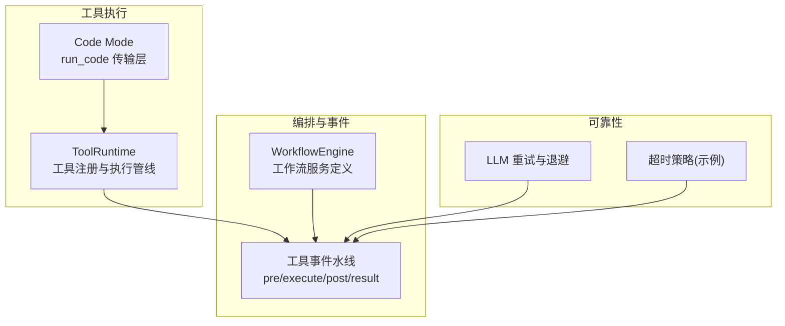
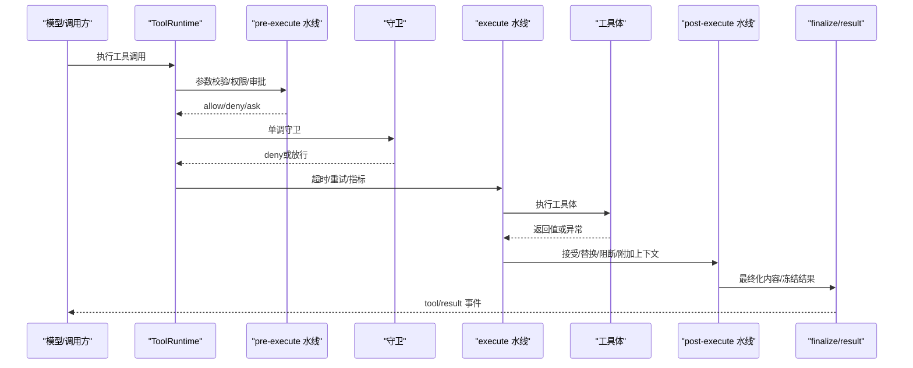
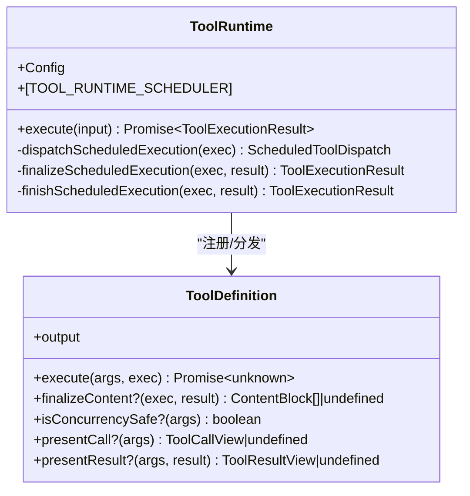
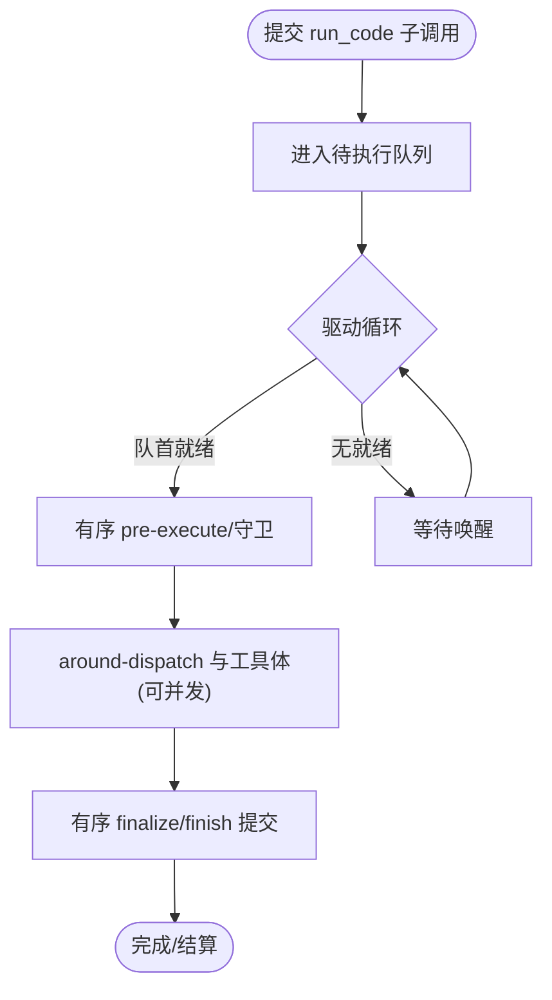
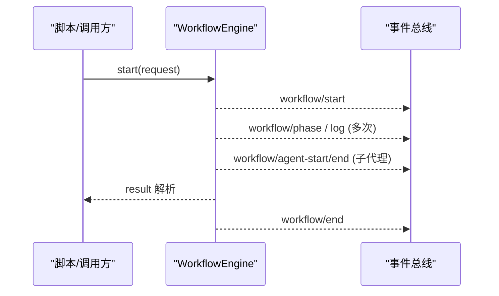
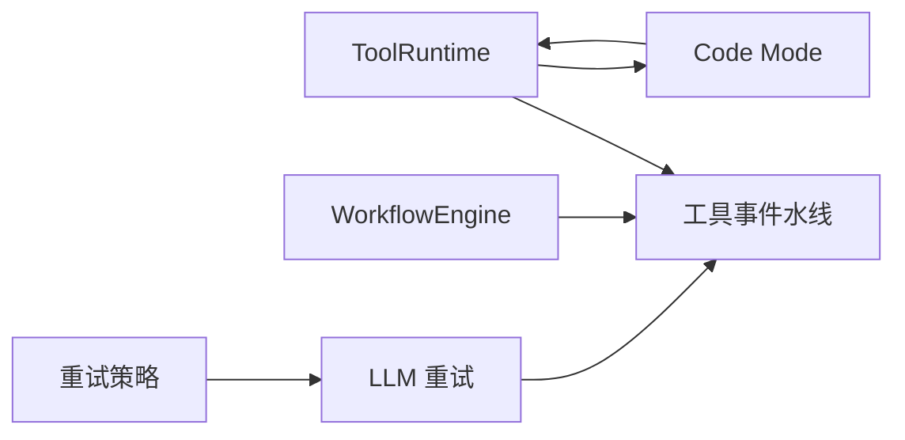
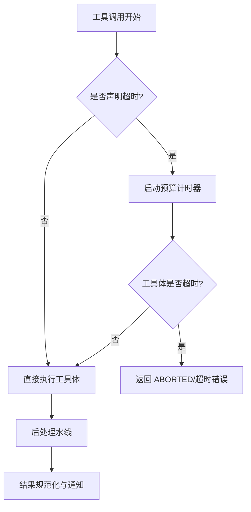
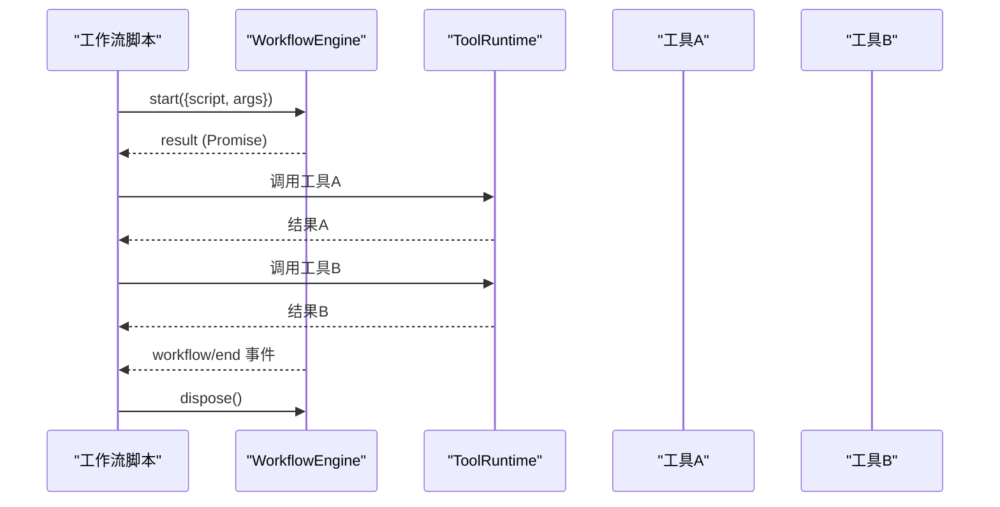

# 工具执行引擎

<cite>
**本文引用的文件**
- [packages/core/tools/src/index.ts](file://packages/core/tools/src/index.ts)
- [packages/core/tools/src/code-mode.ts](file://packages/core/tools/src/code-mode.ts)
- [docs/tool-execution-pipeline.md](file://docs/tool-execution-pipeline.md)
- [packages/workflow/workflow/src/index.ts](file://packages/workflow/workflow/src/index.ts)
- [packages/llm/llm-retry/src/index.ts](file://packages/llm/llm-retry/src/index.ts)
- [packages/llm/llm/src/retry-policy.ts](file://packages/llm/llm/src/retry-policy.ts)
- [packages/guard/timeout-policy/tests/timeout-policy.spec.ts](file://packages/guard/timeout-policy/tests/timeout-policy.spec.ts)
</cite>

## 目录
1. [简介](#简介)
2. [项目结构](#项目结构)
3. [核心组件](#核心组件)
4. [架构总览](#架构总览)
5. [详细组件分析](#详细组件分析)
6. [依赖关系分析](#依赖关系分析)
7. [性能与并发](#性能与并发)
8. [故障处理、重试与熔断](#故障处理重试与熔断)
9. [监控、审计与合规](#监控审计与合规)
10. [工作流编排与工具链组合](#工作流编排与工具链组合)
11. [排错指南](#排错指南)
12. [结论](#结论)

## 简介
本文件面向“工具执行引擎”的 API 与实现，覆盖工具调度、参数校验、执行流程、执行上下文与环境注入、并行执行与任务队列、负载均衡策略、执行监控与调试、错误处理与重试、熔断保护、日志记录与审计追踪、以及工作流编排与工具链组合的高级用法。文档以仓库中的实际代码为依据，提供可追溯的源码路径与图示，帮助读者从高层到细节逐步理解系统。

## 项目结构
与工具执行引擎直接相关的核心位于：
- 工具注册与执行管线：packages/core/tools
- Code Mode 传输层（run_code）：packages/core/tools/src/code-mode.ts
- 工作流引擎抽象：packages/workflow/workflow
- LLM 请求重试与退避策略：packages/llm/llm-retry、packages/llm/llm
- 超时策略测试用例（体现工具调用预算）：packages/guard/timeout-policy/tests

**图表来源**
- [packages/core/tools/src/index.ts:787-800](file://packages/core/tools/src/index.ts#L787-L800)
- [packages/core/tools/src/code-mode.ts:1-200](file://packages/core/tools/src/code-mode.ts#L1-L200)
- [packages/workflow/workflow/src/index.ts:157-168](file://packages/workflow/workflow/src/index.ts#L157-L168)
- [packages/llm/llm-retry/src/index.ts:99-109](file://packages/llm/llm-retry/src/index.ts#L99-L109)
- [packages/guard/timeout-policy/tests/timeout-policy.spec.ts:48-70](file://packages/guard/timeout-policy/tests/timeout-policy.spec.ts#L48-L70)

**章节来源**
- [packages/core/tools/src/index.ts:787-800](file://packages/core/tools/src/index.ts#L787-L800)
- [packages/core/tools/src/code-mode.ts:1-200](file://packages/core/tools/src/code-mode.ts#L1-L200)
- [packages/workflow/workflow/src/index.ts:157-168](file://packages/workflow/workflow/src/index.ts#L157-L168)

## 核心组件
- ToolRuntime：工具注册表与执行管线，负责参数校验、预执行水线、守卫、around-dispatch、后处理、结果规范化与通知。
- Code Mode run_code：将模型侧程序调用桥接到工具执行管线，支持子调用并发上限控制与有序提交。
- WorkflowEngine：工作流服务抽象，提供脚本解析与执行生命周期事件，用于编排多步骤任务。
- LLM 重试与退避：为外部请求提供可配置的重试策略与退避算法，支持“正常模式”和“始终重试模式”。
- 超时策略：通过 tools/execute 监听器对单次工具调用施加预算限制，保障循环卫生。

**章节来源**
- [packages/core/tools/src/index.ts:787-800](file://packages/core/tools/src/index.ts#L787-L800)
- [packages/core/tools/src/code-mode.ts:1-200](file://packages/core/tools/src/code-mode.ts#L1-L200)
- [packages/workflow/workflow/src/index.ts:157-168](file://packages/workflow/workflow/src/index.ts#L157-L168)
- [packages/llm/llm/src/retry-policy.ts:145-191](file://packages/llm/llm/src/retry-policy.ts#L145-L191)
- [packages/guard/timeout-policy/tests/timeout-policy.spec.ts:48-70](file://packages/guard/timeout-policy/tests/timeout-policy.spec.ts#L48-L70)

## 架构总览
工具执行引擎围绕“水线 + 守卫 + 调度”的三段式架构构建：
- 预执行水线（tools/pre-execute）：权限、沙箱、审批等前置检查。
- 守卫（monotonic guards）：不可逆拒绝判定，保护执行身份。
- Around-dispatch（tools/execute）：超时、重试、指标采集等横切关注点。
- 工具体执行：工具实现 execute()。
- 后处理水线（tools/post-execute）：接受、替换、阻断、附加上下文。
- 最终化与通知：finalizeContent、tools/result 冻结并广播最终结果。

**图表来源**
- [docs/tool-execution-pipeline.md:9-58](file://docs/tool-execution-pipeline.md#L9-L58)
- [packages/core/tools/src/index.ts:142-208](file://packages/core/tools/src/index.ts#L142-L208)

**章节来源**
- [docs/tool-execution-pipeline.md:9-58](file://docs/tool-execution-pipeline.md#L9-L58)
- [packages/core/tools/src/index.ts:142-208](file://packages/core/tools/src/index.ts#L142-L208)

## 详细组件分析

### ToolRuntime：工具注册与执行管线
- 能力
  - 工具注册与可见性过滤（按作用域）。
  - 参数 JSON Schema 校验与丢失性快照。
  - 三阶段水线：pre-execute / execute / post-execute。
  - 单调守卫：只允许拒绝，不改变已通过的许可。
  - 结果规范化与冻结：确保持久化与回放一致性。
  - 事件通知：tools/result、tools/change 等。
- 关键类型
  - ToolExecutionInput/ToolExecution/ToolDispatchExecution：描述一次调用的输入、身份与信号。
  - ToolExecutionResult：成功/失败的可区分联合类型。
  - ToolDefinition：工具定义，包含输出声明、execute、可选 finalizeContent、isConcurrencySafe、presentCall/presentResult。
- 调度接口
  - TOOL_RUNTIME_SCHEDULER：prepare/dispatch/finalize/finish，供上层并行调度器复用。

**图表来源**
- [packages/core/tools/src/index.ts:787-800](file://packages/core/tools/src/index.ts#L787-L800)
- [packages/core/tools/src/index.ts:221-288](file://packages/core/tools/src/index.ts#L221-L288)
- [packages/core/tools/src/index.ts:451-466](file://packages/core/tools/src/index.ts#L451-L466)

**章节来源**
- [packages/core/tools/src/index.ts:221-288](file://packages/core/tools/src/index.ts#L221-L288)
- [packages/core/tools/src/index.ts:451-466](file://packages/core/tools/src/index.ts#L451-L466)
- [packages/core/tools/src/index.ts:787-800](file://packages/core/tools/src/index.ts#L787-L800)

### Code Mode：run_code 传输与子调用调度
- 角色
  - 暴露 run_code 工具，使模型侧程序可通过 SDK 调用工具。
  - 子调用遵循原生并发契约：仅当工具声明 isConcurrencySafe 时可重叠；exclusive 调用形成屏障。
  - 维护提交队列与驱动循环，保证有序 pre-execute 与 finish 阶段，while 允许 around-dispatch/body 并发。
- 并发上限
  - maxParallelSubCalls：默认 10，限制 run_code 程序的并发子调用数。
- 日志与呈现
  - 每个子调用在持久日志中记录 tool/code-dispatch，支持内容替换钩子（tools/code-dispatch-log）。

**图表来源**
- [packages/core/tools/src/code-mode.ts:389-417](file://packages/core/tools/src/code-mode.ts#L389-L417)
- [packages/core/tools/src/index.ts:774-781](file://packages/core/tools/src/index.ts#L774-L781)

**章节来源**
- [packages/core/tools/src/code-mode.ts:389-417](file://packages/core/tools/src/code-mode.ts#L389-L417)
- [packages/core/tools/src/index.ts:774-781](file://packages/core/tools/src/index.ts#L774-L781)

### 工作流引擎：编排与生命周期事件
- 能力
  - 解析并执行工作流脚本，返回可取消、可处置的运行句柄。
  - 发布 workflow/start、workflow/phase、workflow/log、workflow/agent-start/end、workflow/end 等事件。
  - 错误分类：致命错误（如脚本解析、元数据无效、资源上限等）与非致命子项失败。
- 使用方式
  - 通过 ctx.workflowEngine.start(request) 启动运行，result 在脚本结束时解析。
  - 可 cancel/dispose 控制生命周期。

**图表来源**
- [packages/workflow/workflow/src/index.ts:157-168](file://packages/workflow/workflow/src/index.ts#L157-L168)
- [packages/workflow/workflow/src/index.ts:31-90](file://packages/workflow/workflow/src/index.ts#L31-L90)

**章节来源**
- [packages/workflow/workflow/src/index.ts:31-90](file://packages/workflow/workflow/src/index.ts#L31-L90)
- [packages/workflow/workflow/src/index.ts:157-168](file://packages/workflow/workflow/src/index.ts#L157-L168)

## 依赖关系分析
- ToolRuntime 依赖
  - 上下文与服务：Context、Service、Scope、SystemPrompt。
  - 工具定义与呈现：ToolDefinition、ToolCallView/ToolResultView。
  - 事件水线：tools/pre-execute、tools/execute、tools/post-execute、tools/result、tools/change。
  - Code Mode：createRunCodeTool、RUN_CODE_NAME。
- Code Mode 依赖
  - ToolRuntimeScheduler：复用 prepare/dispatch/finalize/finish。
  - 会话快照：snapshotJsonValue，确保日志与结果的无损序列化。
- 工作流引擎
  - 事件发射：emitWorkflowEvent 封装 listener 容错。
- 重试与退避
  - llm-retry：安装 provider-routed 恢复逻辑，跟踪活跃操作，支持可取消延迟。
  - retry-policy：验证与解析退避参数（initialDelayMs、maxDelayMs、jitterRatio），支持 normal/always 模式。

**图表来源**
- [packages/core/tools/src/index.ts:142-208](file://packages/core/tools/src/index.ts#L142-L208)
- [packages/core/tools/src/code-mode.ts:1-200](file://packages/core/tools/src/code-mode.ts#L1-L200)
- [packages/workflow/workflow/src/index.ts:171-186](file://packages/workflow/workflow/src/index.ts#L171-L186)
- [packages/llm/llm-retry/src/index.ts:99-109](file://packages/llm/llm-retry/src/index.ts#L99-L109)
- [packages/llm/llm/src/retry-policy.ts:145-191](file://packages/llm/llm/src/retry-policy.ts#L145-L191)

**章节来源**
- [packages/core/tools/src/index.ts:142-208](file://packages/core/tools/src/index.ts#L142-L208)
- [packages/core/tools/src/code-mode.ts:1-200](file://packages/core/tools/src/code-mode.ts#L1-L200)
- [packages/workflow/workflow/src/index.ts:171-186](file://packages/workflow/workflow/src/index.ts#L171-L186)
- [packages/llm/llm-retry/src/index.ts:99-109](file://packages/llm/llm-retry/src/index.ts#L99-L109)
- [packages/llm/llm/src/retry-policy.ts:145-191](file://packages/llm/llm/src/retry-policy.ts#L145-L191)

## 性能与并发
- 并行执行
  - 工具级：isConcurrencySafe 标记允许重叠执行；否则视为独占，形成顺序屏障。
  - Code Mode：maxParallelSubCalls 限制程序内并发子调用数量，默认 10。
- 任务队列与驱动
  - 提交队列与驱动循环保证有序 pre-execute 与 finish，避免竞争条件。
  - 驱动在空队列时休眠，收到唤醒信号后继续处理。
- 负载均衡策略
  - 基于工具声明的并发安全性的静态分类；结合调度器的池大小与独占屏障，实现近似公平与可控的吞吐。
- 性能建议
  - 合理设置 maxParallelSubCalls 以匹配后端能力。
  - 谨慎标记 isConcurrencySafe，仅在无共享可变状态且幂等/可重入时启用。
  - 利用 tools/execute 添加指标埋点，观察热点工具与瓶颈。

**章节来源**
- [packages/core/tools/src/index.ts:774-781](file://packages/core/tools/src/index.ts#L774-L781)
- [packages/core/tools/src/code-mode.ts:389-417](file://packages/core/tools/src/code-mode.ts#L389-L417)

## 故障处理、重试与熔断
- 工具错误
  - 未知工具：抛出 UNKNOWN_TOOL 错误，便于上游路由重试或降级。
  - 输出校验失败：INVALID_TOOL_OUTPUT，携带违规信息。
  - 取消：ABORTED/ABORTED_BEFORE_DISPATCH，区分是否在工具体内部被取消。
- 重试机制
  - LLM 请求层：支持 normal（按可重试码与最大次数）与 always（始终重试）两种模式；退避参数包括 initialDelayMs、maxDelayMs、jitterRatio。
  - 可取消延迟：cancellableDelay 支持 AbortSignal，避免阻塞取消。
- 熔断保护
  - 当前未内置通用熔断器；可通过 tools/execute 包装实现“快速失败/限流/熔断”策略，并结合事件与指标进行观测。
- 超时策略
  - 通过 tools/execute 监听器为工具调用设置预算；若工具未声明 timeoutMs，则不干预；若声明，则在超时后中止并返回相应错误。

**图表来源**
- [packages/guard/timeout-policy/tests/timeout-policy.spec.ts:48-70](file://packages/guard/timeout-policy/tests/timeout-policy.spec.ts#L48-L70)
- [packages/core/tools/src/index.ts:468-472](file://packages/core/tools/src/index.ts#L468-L472)
- [packages/llm/llm-retry/src/index.ts:78-109](file://packages/llm/llm-retry/src/index.ts#L78-L109)
- [packages/llm/llm/src/retry-policy.ts:145-191](file://packages/llm/llm/src/retry-policy.ts#L145-L191)

**章节来源**
- [packages/core/tools/src/index.ts:468-472](file://packages/core/tools/src/index.ts#L468-L472)
- [packages/guard/timeout-policy/tests/timeout-policy.spec.ts:48-70](file://packages/guard/timeout-policy/tests/timeout-policy.spec.ts#L48-L70)
- [packages/llm/llm-retry/src/index.ts:78-109](file://packages/llm/llm-retry/src/index.ts#L78-L109)
- [packages/llm/llm/src/retry-policy.ts:145-191](file://packages/llm/llm/src/retry-policy.ts#L145-L191)

## 监控、审计与合规
- 执行监控
  - 工具事件水线：tools/pre-execute、tools/execute、tools/post-execute、tools/result 提供全链路观测点。
  - Code Mode：tool/code-dispatch 记录子调用，支持内容替换以脱敏或摘要。
- 审计追踪
  - 结果冻结与无损快照：确保回放一致性与合规审计。
  - 工作流事件：workflow/* 事件提供脚本执行的生命周期审计。
- 合规性报告
  - 通过 tools/post-execute 附加 additionalContexts，将合规提示或审计标签随结果传递。
  - 可在监听器中对敏感信息进行脱敏或摘要，再写入持久日志。

**章节来源**
- [packages/core/tools/src/index.ts:142-208](file://packages/core/tools/src/index.ts#L142-L208)
- [docs/tool-execution-pipeline.md:9-58](file://docs/tool-execution-pipeline.md#L9-L58)
- [packages/workflow/workflow/src/index.ts:31-90](file://packages/workflow/workflow/src/index.ts#L31-L90)

## 工作流编排与工具链组合
- 工作流脚本
  - 通过 WorkflowEngine.start 启动，result 在脚本结束时解析；支持 cancel/dispose。
  - 事件 workflow/phase/log/agent-start/end/end 用于进度与结果追踪。
- 工具链组合
  - 在 Code Mode 程序中，使用 run_code 调用多个工具，借助 isConcurrencySafe 与 maxParallelSubCalls 控制并发。
  - 通过 tools/post-execute 附加上下文，串联多步工具的中间结果。
- 高级用法
  - 组合工作流与工具：工作流作为编排层，工具作为原子能力；通过事件与上下文传递实现松耦合协作。
  - 错误传播：致命错误会终止脚本，非致命子项失败映射为 null 或特定分支处理。

**图表来源**
- [packages/workflow/workflow/src/index.ts:157-168](file://packages/workflow/workflow/src/index.ts#L157-L168)
- [packages/core/tools/src/index.ts:787-800](file://packages/core/tools/src/index.ts#L787-L800)

**章节来源**
- [packages/workflow/workflow/src/index.ts:157-168](file://packages/workflow/workflow/src/index.ts#L157-L168)
- [packages/core/tools/src/index.ts:787-800](file://packages/core/tools/src/index.ts#L787-L800)

## 排错指南
- 常见错误
  - 未知工具：检查工具注册与作用域可见性。
  - 输出校验失败：核对 output.schema 与返回值结构。
  - 取消相关：确认工具体是否正确响应 exec.signal 并在可取消点退出。
- 调试建议
  - 在 tools/execute 中添加指标与日志，定位慢调用与异常。
  - 使用 tools/code-dispatch-log 对大结果进行脱敏或摘要，便于审计。
  - 检查工作流事件，确认脚本阶段与子代理生命周期。
- 重试与超时
  - 调整 LLM 重试策略（normal/always）与退避参数。
  - 为易超时的工具设置 timeoutMs，并通过超时策略验证行为。

**章节来源**
- [packages/core/tools/src/index.ts:468-522](file://packages/core/tools/src/index.ts#L468-L522)
- [packages/llm/llm-retry/src/index.ts:99-109](file://packages/llm/llm-retry/src/index.ts#L99-L109)
- [packages/guard/timeout-policy/tests/timeout-policy.spec.ts:48-70](file://packages/guard/timeout-policy/tests/timeout-policy.spec.ts#L48-L70)

## 结论
工具执行引擎以“水线 + 守卫 + 调度”为核心，提供了可扩展的工具注册、严格的参数与结果校验、灵活的横切关注点扩展点（超时、重试、指标）、以及完善的执行监控与审计能力。Code Mode 与工作流引擎进一步增强了工具链组合与复杂编排能力。通过合理的并发控制、重试策略与超时管理，系统在高负载与不稳定环境下仍能保持稳健与可观测。