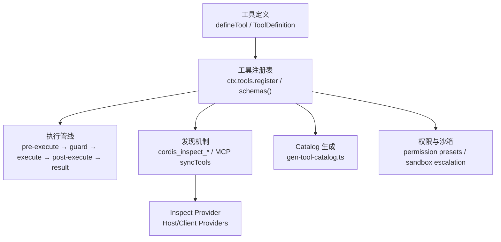
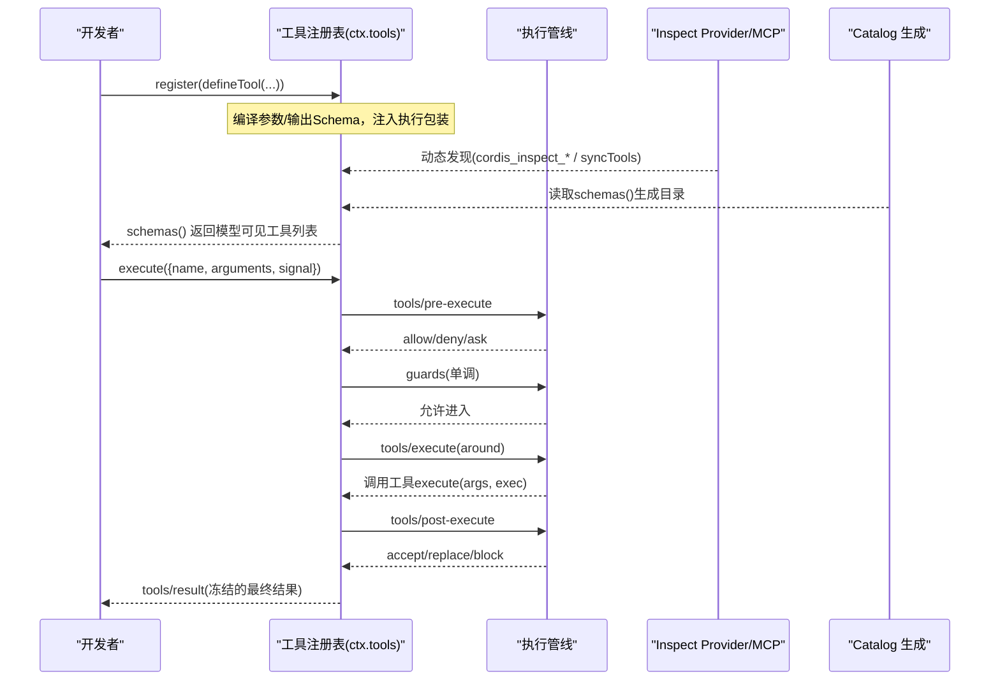
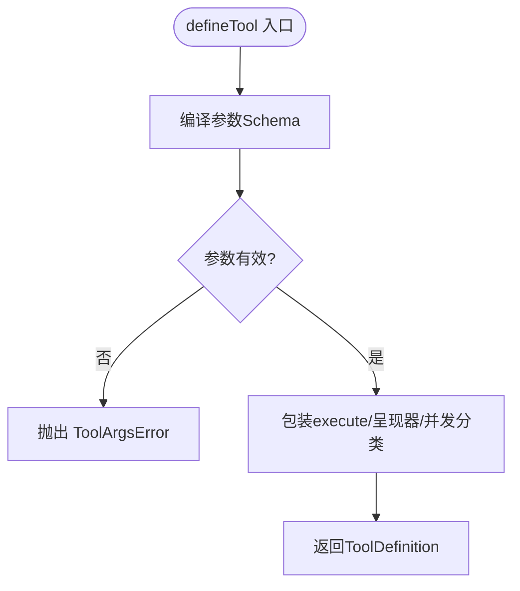
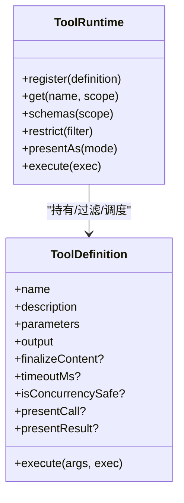
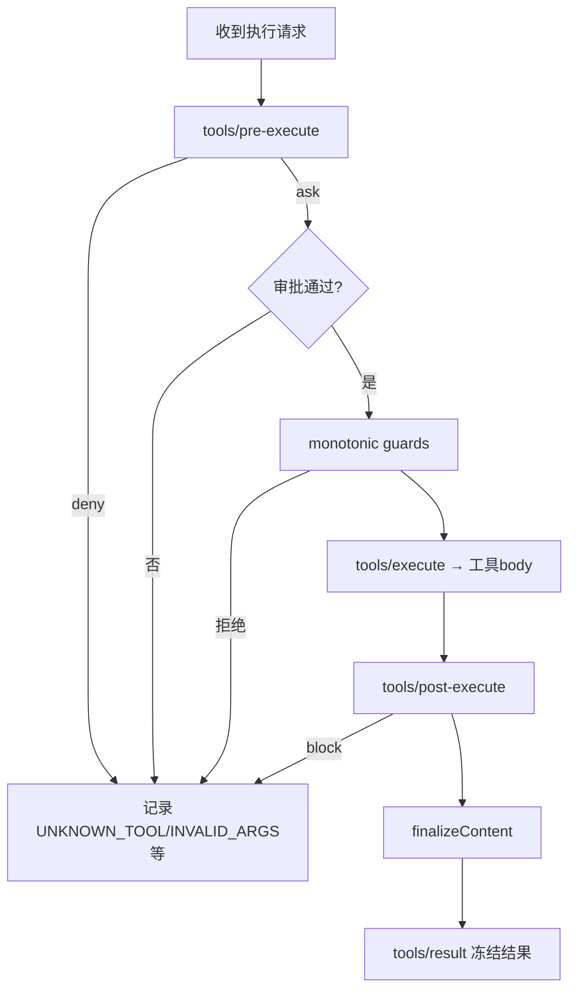
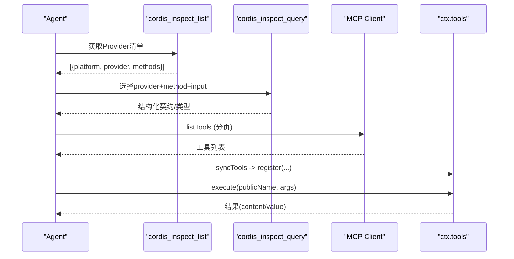
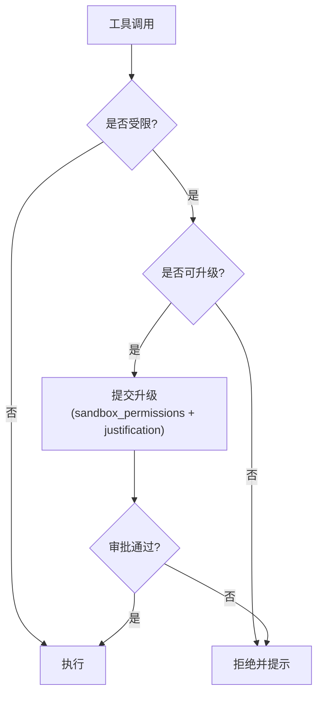
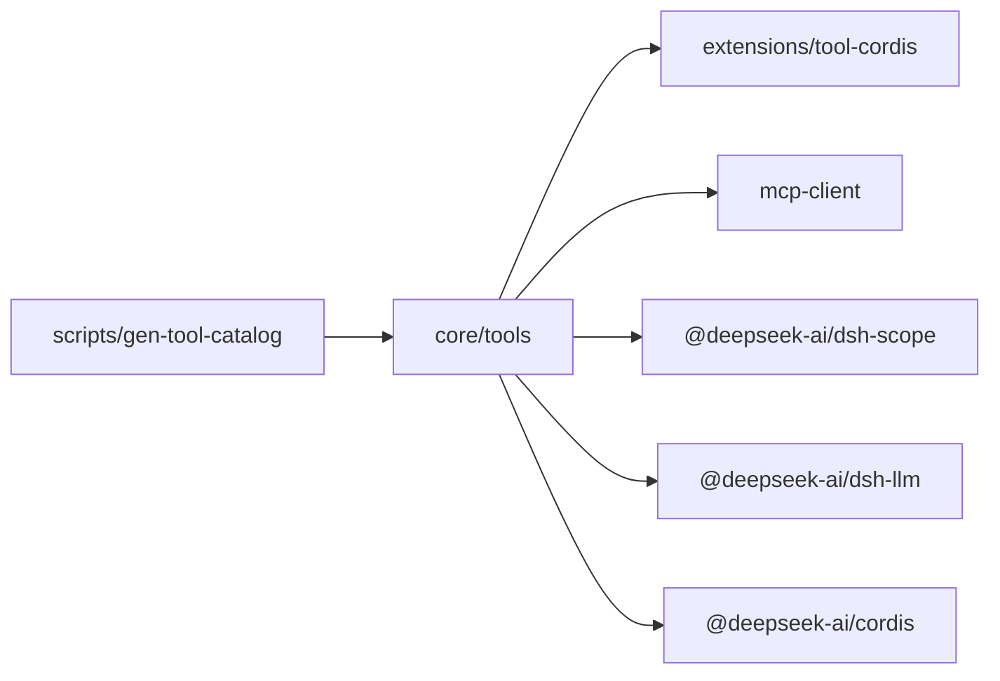

# 工具注册与发现

<cite>
**本文引用的文件**
- [packages/core/tools/src/index.ts](file://packages/core/tools/src/index.ts)
- [packages/core/tools/src/schema.ts](file://packages/core/tools/src/schema.ts)
- [packages/core/tools/tests/tools.spec.ts](file://packages/core/tools/tests/tools.spec.ts)
- [packages/core/tools/src/testing.ts](file://packages/core/tools/src/testing.ts)
- [packages/extensions/tool-cordis/src/index.ts](file://packages/extensions/tool-cordis/src/index.ts)
- [packages/extensions/tool-cordis/src/providers.ts](file://packages/extensions/tool-cordis/src/providers.ts)
- [packages/extensions/cordis-client-runner/src/client/providers.ts](file://packages/extensions/cordis-client-runner/src/client/providers.ts)
- [packages/mcp/mcp-client/tests/mcp-client.spec.ts](file://packages/mcp/mcp-client/tests/mcp-client.spec.ts)
- [scripts/gen-tool-catalog.ts](file://scripts/gen-tool-catalog.ts)
- [docs/subsystems/tools.md](file://docs/subsystems/tools.md)
- [docs/tool-catalog.md](file://docs/tool-catalog.md)
- [docs/cordis-api/registry.md](file://docs/cordis-api/registry.md)
- [docs/subsystems/permission-presets.md](file://docs/subsystems/permission-presets.md)
- [packages/sandbox/sandbox/src/escalation.ts](file://packages/sandbox/sandbox/src/escalation.ts)
- [packages/fs/tool-fs/src/sandbox.ts](file://packages/fs/tool-fs/src/sandbox.ts)
</cite>

## 目录
1. [简介](#简介)
2. [项目结构](#项目结构)
3. [核心组件](#核心组件)
4. [架构总览](#架构总览)
5. [详细组件分析](#详细组件分析)
6. [依赖关系分析](#依赖关系分析)
7. [性能考量](#性能考量)
8. [故障排查指南](#故障排查指南)
9. [结论](#结论)
10. [附录](#附录)

## 简介
本文件面向“工具注册与发现”机制，系统性说明：
- 工具定义格式、参数验证规则与类型系统
- 工具注册接口与可见性/作用域控制
- 运行时发现机制（Inspect Provider、MCP 同步、Catalog 生成）
- 命名约定、版本管理与依赖声明
- 同步与异步工具实现方式
- 调试与测试方法
- 权限模型与安全边界（沙箱、审批、拒绝提示）

## 项目结构
围绕工具注册与发现的关键位置：
- 工具运行时与管线：packages/core/tools
- 统一 Schema DSL 与 defineTool：packages/core/tools/src/schema.ts
- 动态插件与 Inspect 能力：packages/extensions/tool-cordis
- MCP 工具同步到本地注册表：packages/mcp/mcp-client
- 工具 Catalog 生成与完整性校验：scripts/gen-tool-catalog.ts
- 文档与 API 目录：docs/subsystems/tools.md、docs/tool-catalog.md、docs/cordis-api/registry.md
- 权限与沙箱：docs/subsystems/permission-presets.md、packages/sandbox/sandbox/src/escalation.ts、packages/fs/tool-fs/src/sandbox.ts

图表来源
- [packages/core/tools/src/index.ts:137-200](file://packages/core/tools/src/index.ts#L137-L200)
- [packages/core/tools/src/schema.ts:545-618](file://packages/core/tools/src/schema.ts#L545-L618)
- [packages/extensions/tool-cordis/src/index.ts:60-74](file://packages/extensions/tool-cordis/src/index.ts#L60-L74)
- [packages/extensions/tool-cordis/src/providers.ts:21-53](file://packages/extensions/tool-cordis/src/providers.ts#L21-L53)
- [packages/mcp/mcp-client/tests/mcp-client.spec.ts:193-228](file://packages/mcp/mcp-client/tests/mcp-client.spec.ts#L193-L228)
- [scripts/gen-tool-catalog.ts:568-591](file://scripts/gen-tool-catalog.ts#L568-L591)
- [docs/subsystems/permission-presets.md:1-132](file://docs/subsystems/permission-presets.md#L1-L132)

章节来源
- [docs/subsystems/tools.md:1-721](file://docs/subsystems/tools.md#L1-L721)
- [docs/tool-catalog.md:1-800](file://docs/tool-catalog.md#L1-L800)
- [docs/cordis-api/registry.md:1-153](file://docs/cordis-api/registry.md#L1-L153)

## 核心组件
- 工具定义与 Schema DSL
  - 使用统一的 ValueSchemaSpec/ParameterSchemaSpec 描述参数与输出，编译为标准 JSON Schema，并在运行时严格校验。
  - defineTool 将参数推断、输出推断、执行包装、呈现器软校验与并发安全分类整合为单一入口。
- 工具注册表与执行管线
  - ctx.tools.register 注册工具；schemas() 暴露模型可见的 ToolSchema[]；execute() 走 pre-execute/guard/execute/post-execute/result 全链路。
  - 支持 presentAs 切换展示模式、restrict 限制全局工具可见性、guard 添加单调守卫。
- 发现机制
  - cordis_inspect_list/query/self 提供 Host/Client 平台的能力清单与查询入口。
  - MCP 客户端通过 syncTools 将远端工具同步到本地注册表，并处理分页、重入与名称规范化。
- Catalog 生成与完整性
  - gen-tool-catalog 启动每个 tool-* 包，收集 schemas()，生成模型可见的工具目录，并断言所有 shipped 工具均被登记。

章节来源
- [packages/core/tools/src/schema.ts:98-151](file://packages/core/tools/src/schema.ts#L98-L151)
- [packages/core/tools/src/schema.ts:438-480](file://packages/core/tools/src/schema.ts#L438-L480)
- [packages/core/tools/src/schema.ts:545-618](file://packages/core/tools/src/schema.ts#L545-L618)
- [packages/core/tools/src/index.ts:478-574](file://packages/core/tools/src/index.ts#L478-L574)
- [packages/extensions/tool-cordis/src/index.ts:60-74](file://packages/extensions/tool-cordis/src/index.ts#L60-L74)
- [packages/extensions/tool-cordis/src/providers.ts:21-53](file://packages/extensions/tool-cordis/src/providers.ts#L21-L53)
- [packages/mcp/mcp-client/tests/mcp-client.spec.ts:193-228](file://packages/mcp/mcp-client/tests/mcp-client.spec.ts#L193-L228)
- [scripts/gen-tool-catalog.ts:568-591](file://scripts/gen-tool-catalog.ts#L568-L591)

## 架构总览
工具从“定义→注册→发现→执行→结果”的全生命周期如下：

图表来源
- [packages/core/tools/src/index.ts:137-200](file://packages/core/tools/src/index.ts#L137-L200)
- [packages/core/tools/src/index.ts:478-574](file://packages/core/tools/src/index.ts#L478-L574)
- [packages/extensions/tool-cordis/src/index.ts:60-74](file://packages/extensions/tool-cordis/src/index.ts#L60-L74)
- [packages/mcp/mcp-client/tests/mcp-client.spec.ts:193-228](file://packages/mcp/mcp-client/tests/mcp-client.spec.ts#L193-L228)
- [scripts/gen-tool-catalog.ts:568-591](file://scripts/gen-tool-catalog.ts#L568-L591)

## 详细组件分析

### 工具定义与类型系统
- 参数 Schema
  - ParameterSchemaSpec 是隐式开放对象根，required 以 per-property 形式标注；编译为标准 JSON Schema 后用于运行时校验。
  - valueSchemaSpecToJsonSchema 与 parameterSchemaSpecToJsonSchema 负责将作者 DSL 编译为受控子集。
- 输出 Schema
  - output.schema 必须为受控 JSON Schema；render/presentationMeta 纯函数，用于内容投影与元数据。
- 类型推断
  - InferArgs/S 将 required 映射为非可选键；InferValue 在最多 16 层容器深度内精确推断，超出回退为 JsonValue。
- 运行时校验
  - validateArgs 基于 compiled schema 校验模型传入参数；不匹配抛出 ToolArgsError(INVALID_ARGS)。

图表来源
- [packages/core/tools/src/schema.ts:438-480](file://packages/core/tools/src/schema.ts#L438-L480)
- [packages/core/tools/src/schema.ts:545-618](file://packages/core/tools/src/schema.ts#L545-L618)

章节来源
- [packages/core/tools/src/schema.ts:98-151](file://packages/core/tools/src/schema.ts#L98-L151)
- [packages/core/tools/src/schema.ts:438-480](file://packages/core/tools/src/schema.ts#L438-L480)
- [packages/core/tools/src/schema.ts:545-618](file://packages/core/tools/src/schema.ts#L545-L618)

### 工具注册与可见性
- 注册与查找
  - ctx.tools.register(definition) 注册工具；ctx.tools.get(name, scope?) 按作用域解析可见定义。
  - ctx.tools.schemas(scope?) 仅暴露模型可见字段（name/description/parameters），不包含执行回调。
- 作用域与限制
  - restrict(filter) 对继承链上的全局工具施加 allow/deny 交集过滤；scope-local 注册不受限。
  - presentAs(mode) 切换展示模式，影响模型侧可见能力集合。
- 事件
  - tools/change 在注册/注销或限制变化时广播（非作用域过滤）。

图表来源
- [packages/core/tools/src/index.ts:478-574](file://packages/core/tools/src/index.ts#L478-L574)
- [docs/subsystems/tools.md:9-97](file://docs/subsystems/tools.md#L9-L97)

章节来源
- [packages/core/tools/src/index.ts:478-574](file://packages/core/tools/src/index.ts#L478-L574)
- [docs/subsystems/tools.md:9-97](file://docs/subsystems/tools.md#L9-L97)

### 执行管线与错误处理
- 阶段顺序
  - tools/pre-execute → 单调 guards → tools/execute → tools/post-execute → finalizeContent → tools/result。
- 决策语义
  - pre-execute 可 allow/deny/ask；缺少审批则 ask 转为 deny。
  - post-execute 可 accept/replace value/content 或 block 为错误。
- 错误归一化
  - 未知工具 → UNKNOWN_TOOL；工具抛异常 → 结构化错误；不可打印异常 → 安全文本。
  - 参数非法 → INVALID_ARGS；输出非法 → 结构化错误。

图表来源
- [packages/core/tools/src/index.ts:137-200](file://packages/core/tools/src/index.ts#L137-L200)
- [packages/core/tools/tests/tools.spec.ts:630-665](file://packages/core/tools/tests/tools.spec.ts#L630-L665)

章节来源
- [packages/core/tools/src/index.ts:137-200](file://packages/core/tools/src/index.ts#L137-L200)
- [packages/core/tools/tests/tools.spec.ts:630-665](file://packages/core/tools/tests/tools.spec.ts#L630-L665)

### 发现机制：Inspect Provider 与 MCP
- Inspect Provider
  - Host/Client 各自维护 CordisInspectRegistry，注册 platform 唯一 ID、描述、方法、输入/输出 Schema。
  - cordis_inspect_list 列出可用 Provider；cordis_inspect_query 执行只读查询；cordis_inspect_self 查看当前 Session 的动态对象。
- MCP 同步
  - syncTools 拉取远端工具列表（支持分页），去重/冲突回滚，规范化名称（如 mcp__srv__...），并注册到本地 ctx.tools。
  - 调用时对外暴露公共名，内部转发原始 MCP 名称。

图表来源
- [packages/extensions/tool-cordis/src/index.ts:60-74](file://packages/extensions/tool-cordis/src/index.ts#L60-L74)
- [packages/extensions/tool-cordis/src/providers.ts:21-53](file://packages/extensions/tool-cordis/src/providers.ts#L21-L53)
- [packages/extensions/cordis-client-runner/src/client/providers.ts:134-172](file://packages/extensions/cordis-client-runner/src/client/providers.ts#L134-L172)
- [packages/mcp/mcp-client/tests/mcp-client.spec.ts:193-228](file://packages/mcp/mcp-client/tests/mcp-client.spec.ts#L193-L228)

章节来源
- [packages/extensions/tool-cordis/src/index.ts:60-74](file://packages/extensions/tool-cordis/src/index.ts#L60-L74)
- [packages/extensions/tool-cordis/src/providers.ts:21-53](file://packages/extensions/tool-cordis/src/providers.ts#L21-L53)
- [packages/extensions/cordis-client-runner/src/client/providers.ts:134-172](file://packages/extensions/cordis-client-runner/src/client/providers.ts#L134-L172)
- [packages/mcp/mcp-client/tests/mcp-client.spec.ts:193-228](file://packages/mcp/mcp-client/tests/mcp-client.spec.ts#L193-L228)

### 命名约定、版本管理与依赖声明
- 命名约定
  - 工具名需唯一；MCP 工具经 publicToolName 规范化为稳定公共名（含哈希后缀），内部仍使用原始名称。
- 版本管理
  - 动态插件通过 cordis_define/cordis_run/cordis_stop/cordis_undefine 管理 Plugin/Package 生命周期与版本指针。
- 依赖声明
  - 插件通过 inject 声明所需服务；工具通过 require/writes 在 Catalog 中声明运行期依赖与副作用。

章节来源
- [packages/mcp/mcp-client/tests/mcp-client.spec.ts:102-115](file://packages/mcp/mcp-client/tests/mcp-client.spec.ts#L102-L115)
- [packages/extensions/tool-cordis/src/index.ts:268-498](file://packages/extensions/tool-cordis/src/index.ts#L268-L498)
- [docs/tool-catalog.md:12-42](file://docs/tool-catalog.md#L12-L42)
- [scripts/gen-tool-catalog.ts:135-164](file://scripts/gen-tool-catalog.ts#L135-L164)

### 同步与异步工具实现
- 同步工具
  - 无外部 I/O、快速返回；适合轻量计算或状态查询。
- 异步工具
  - 大多数工具为异步；需遵循取消信号（exec.signal）与超时（timeoutMs）；后台任务可通过 jobs 子系统协作。
- 并发安全
  - isConcurrencySafe 标记可并行执行的调用；未声明或返回 false 视为独占执行。

章节来源
- [docs/subsystems/tools.md:170-253](file://docs/subsystems/tools.md#L170-L253)
- [packages/core/tools/src/schema.ts:499-513](file://packages/core/tools/src/schema.ts#L499-L513)

### 调试与测试方法
- 单元测试
  - 使用 defineContentToolFixture 构造以 content 为 canonical value 的测试工具，便于断言渲染结果。
  - 覆盖注册/注销、重复名、listeners 抛错回滚、未知工具、恶意异常等场景。
- 集成测试
  - 通过 mount 上下文加载插件，调用 ctx.tools.execute 并断言结果与事件。
- 调试技巧
  - 利用 tools/change 监听注册变化；通过 cordis_inspect_* 检查 Provider/工具契约；观察 tools/result 最终冻结结果。

章节来源
- [packages/core/tools/src/testing.ts:1-43](file://packages/core/tools/src/testing.ts#L1-L43)
- [packages/core/tools/tests/tools.spec.ts:1999-2022](file://packages/core/tools/tests/tools.spec.ts#L1999-L2022)
- [packages/core/tools/tests/tools.spec.ts:630-665](file://packages/core/tools/tests/tools.spec.ts#L630-L665)

### 权限模型与安全边界
- 权限预设
  - permissionPresets 将沙箱模式与审批策略打包为预设；set 写入 knob 事件，current/selectFor 推导当前状态。
- 沙箱升级
  - 当文件操作被拒绝时，若组合启用了升级字段，工具会附带标准化拒绝提示与升级指引；升级需同时提供 sandbox_permissions 与 justification，并经 approval 批准。
- 安全边界
  - 工具执行前经过 pre-execute/guard 双重把关；post-execute 可替换/阻断结果；最终结果冻结后持久化。

图表来源
- [docs/subsystems/permission-presets.md:1-132](file://docs/subsystems/permission-presets.md#L1-L132)
- [packages/sandbox/sandbox/src/escalation.ts:33-86](file://packages/sandbox/sandbox/src/escalation.ts#L33-L86)
- [packages/fs/tool-fs/src/sandbox.ts:75-108](file://packages/fs/tool-fs/src/sandbox.ts#L75-L108)

章节来源
- [docs/subsystems/permission-presets.md:1-132](file://docs/subsystems/permission-presets.md#L1-L132)
- [packages/sandbox/sandbox/src/escalation.ts:33-86](file://packages/sandbox/sandbox/src/escalation.ts#L33-L86)
- [packages/fs/tool-fs/src/sandbox.ts:75-108](file://packages/fs/tool-fs/src/sandbox.ts#L75-L108)

## 依赖关系分析
- 模块耦合
  - core/tools 提供基础注册与执行；extensions/tool-cordis 提供动态能力发现；mcp-client 桥接外部工具；scripts/gen-tool-catalog 消费运行时 schemas() 生成文档。
- 外部依赖
  - 依赖 @deepseek-ai/cordis 进行插件与服务注入；依赖 dsh-scope 进行作用域管理；依赖 dsh-llm 提供通用类型与错误。
- 循环依赖
  - 通过分层与接口隔离避免循环；Catalog 生成仅在构建/文档阶段消费运行时产物。

图表来源
- [packages/core/tools/src/index.ts:1-29](file://packages/core/tools/src/index.ts#L1-L29)
- [scripts/gen-tool-catalog.ts:568-591](file://scripts/gen-tool-catalog.ts#L568-L591)

章节来源
- [packages/core/tools/src/index.ts:1-29](file://packages/core/tools/src/index.ts#L1-L29)
- [scripts/gen-tool-catalog.ts:568-591](file://scripts/gen-tool-catalog.ts#L568-L591)

## 性能考量
- 参数与输出 Schema 编译在定义时完成，执行路径仅做轻量校验。
- 并发安全由 isConcurrencySafe 静态分类，减少锁竞争。
- 长耗时工具应设置 timeoutMs 并正确响应 exec.signal，避免阻塞。
- Catalog 生成仅在构建/文档阶段触发，不影响运行时。

[本节为通用指导，无需特定文件引用]

## 故障排查指南
- 常见错误
  - 未知工具：检查名称与作用域可见性，确认未被 restrict 隐藏。
  - 参数无效：核对 parameters 中的 required 与类型约束；查看 ToolArgsError 的 violations。
  - 输出无效：确保 output.render 返回符合 schema 的内容；必要时在 finalizeContent 中裁剪。
  - MCP 同步失败：检查分页 nextCursor 处理与名称规范化逻辑。
- 定位手段
  - 订阅 tools/change 与 tools/result 观察注册与结果。
  - 使用 cordis_inspect_* 检查 Provider 方法与契约。
  - 通过 Catalog 生成器校验 shipped 工具是否遗漏。

章节来源
- [packages/core/tools/tests/tools.spec.ts:630-665](file://packages/core/tools/tests/tools.spec.ts#L630-L665)
- [packages/core/tools/tests/tools.spec.ts:1999-2022](file://packages/core/tools/tests/tools.spec.ts#L1999-L2022)
- [packages/mcp/mcp-client/tests/mcp-client.spec.ts:193-228](file://packages/mcp/mcp-client/tests/mcp-client.spec.ts#L193-L228)
- [scripts/gen-tool-catalog.ts:568-591](file://scripts/gen-tool-catalog.ts#L568-L591)

## 结论
该机制通过统一的 Schema DSL、严格的运行时校验、可扩展的执行管线与多源发现（Inspect/MCP/Catalog），实现了安全、可观测、可演进的“工具注册与发现”。配合权限预设与沙箱升级，既能保障最小权限原则，又能在必要时提供可控的扩展路径。建议在新工具开发中优先采用 defineTool、显式声明输出 schema、合理设置 timeoutMs 与 isConcurrencySafe，并通过 Catalog 与测试用例保证契约稳定性。

[本节为总结，无需特定文件引用]

## 附录
- 参考文档
  - 工具子系统文档：docs/subsystems/tools.md
  - 工具目录（模型可见）：docs/tool-catalog.md
  - Cordis 注册中心 API：docs/cordis-api/registry.md
  - 权限预设：docs/subsystems/permission-presets.md

[本节为索引，无需特定文件引用]