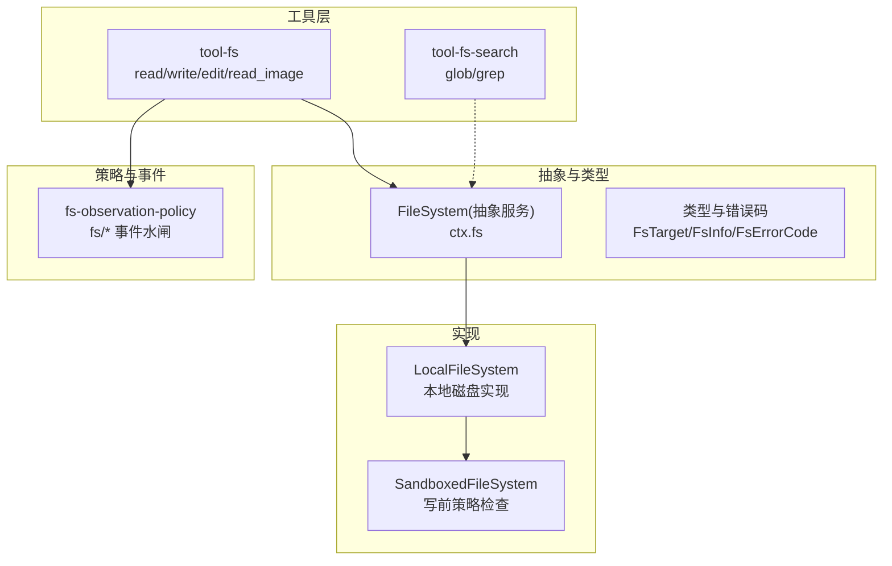
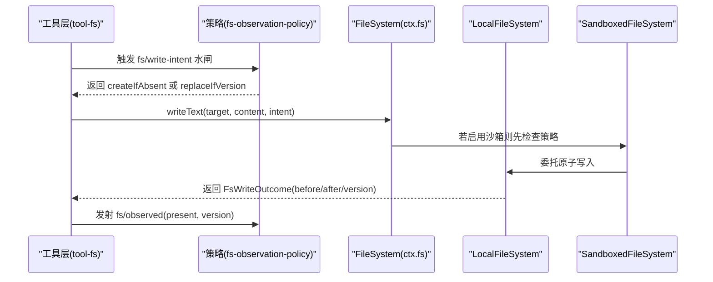
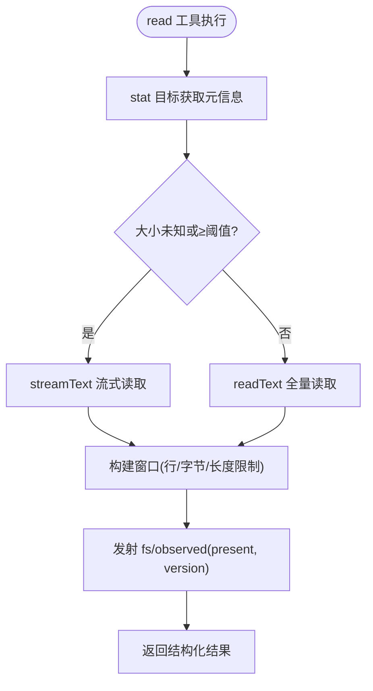
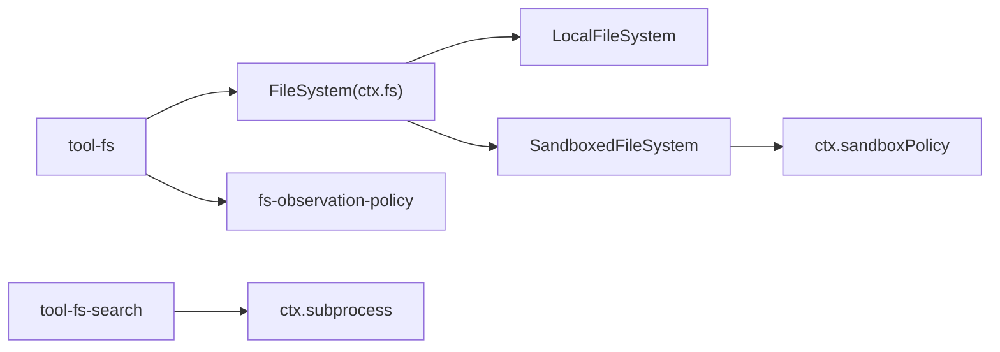

# 文件系统工具

<cite>
**本文引用的文件**
- [packages/fs/fs/src/index.ts](file://packages/fs/fs/src/index.ts)
- [packages/fs/fs/src/types.ts](file://packages/fs/fs/src/types.ts)
- [packages/fs/fs-local/src/index.ts](file://packages/fs/fs-local/src/index.ts)
- [packages/fs/fs-sandbox/src/index.ts](file://packages/fs/fs-sandbox/src/index.ts)
- [packages/fs/tool-fs/src/index.ts](file://packages/fs/tool-fs/src/index.ts)
- [packages/fs/tool-fs/src/read.ts](file://packages/fs/tool-fs/src/read.ts)
- [packages/fs/tool-fs/src/write.ts](file://packages/fs/tool-fs/src/write.ts)
- [packages/fs/tool-fs/src/error.ts](file://packages/fs/tool-fs/src/error.ts)
- [packages/fs/fs-observation-policy/src/index.ts](file://packages/fs/fs-observation-policy/src/index.ts)
- [packages/fs/tool-fs-search/src/index.ts](file://packages/fs/tool-fs-search/src/index.ts)
- [docs/subsystems/filesystem.md](file://docs/subsystems/filesystem.md)
- [docs/subsystems/sandbox.md](file://docs/subsystems/sandbox.md)
</cite>

## 目录
1. [简介](#简介)
2. [项目结构](#项目结构)
3. [核心组件](#核心组件)
4. [架构总览](#架构总览)
5. [详细组件分析](#详细组件分析)
6. [依赖关系分析](#依赖关系分析)
7. [性能考虑](#性能考虑)
8. [故障排查指南](#故障排查指南)
9. [结论](#结论)
10. [附录：API 参考与使用示例](#附录api-参考与使用示例)

## 简介
本文件为“文件系统工具”的完整 API 文档，覆盖文件读取、写入、编辑（替换）、删除/移动（通过重命名实现）、目录浏览、文件搜索、路径操作、权限控制、沙箱限制、访问策略、错误处理与重试机制、大文件流式读写与性能优化技巧，以及文件变更监听与事件通知机制。文档基于仓库中的文件系统能力抽象、本地实现、沙箱实现、模型侧工具、观察策略与搜索工具进行系统化说明。

## 项目结构
文件系统能力由多个包协作组成：
- 抽象服务定义与类型：dsh-fs（ctx.fs）
- 本地实现：dsh-fs-local（LocalFileSystem）
- 沙箱实现：dsh-fs-sandbox（SandboxedFileSystem，继承本地实现并增加写前检查）
- 模型侧工具：dsh-tool-fs（read/write/edit/read_image）
- 观察策略插件：dsh-fs-observation-policy（fs/* 事件水闸与记录）
- 搜索工具：dsh-tool-fs-search（glob/grep，基于 ripgrep）

图表来源
- [packages/fs/fs/src/index.ts:86-249](file://packages/fs/fs/src/index.ts#L86-L249)
- [packages/fs/fs-local/src/index.ts:64-266](file://packages/fs/fs-local/src/index.ts#L64-L266)
- [packages/fs/fs-sandbox/src/index.ts:59-149](file://packages/fs/fs-sandbox/src/index.ts#L59-L149)
- [packages/fs/tool-fs/src/index.ts:54-79](file://packages/fs/tool-fs/src/index.ts#L54-L79)
- [packages/fs/fs-observation-policy/src/index.ts:106-130](file://packages/fs/fs-observation-policy/src/index.ts#L106-L130)
- [packages/fs/tool-fs-search/src/index.ts:127-160](file://packages/fs/tool-fs-search/src/index.ts#L127-L160)

章节来源
- [docs/subsystems/filesystem.md:1-10](file://docs/subsystems/filesystem.md#L1-L10)

## 核心组件
- FileSystem（抽象服务）：提供 resolve/processPath/fileUrl/contains/stat/lstat/readText/streamText/readBytes/listDir/writeText/editText 等原子能力；支持可选的沙箱模式声明。
- LocalFileSystem：基于真实文件系统实现，包含按 targetKey 的并发锁、原子写入、行尾归一化、版本令牌生成等。
- SandboxedFileSystem：在写操作前按 per-call 策略校验目标路径是否可写（read-only/workspace-write/danger-full-access），拒绝时抛出 FS_SANDBOX_DENIED。
- tool-fs：注册 read/write/edit/read_image 工具，负责参数校验、窗口化读取、流式读取、结果渲染、观测事件发射与错误修复提示。
- fs-observation-policy：通过 fs/write-intent、fs/edit-intent 单槽水闸决定写意图（createIfAbsent/replaceIfVersion）与编辑版本守卫；通过 fs/observed 记录权威存在/不存在观测。
- tool-fs-search：注册 glob/grep 工具，基于 ripgrep 执行搜索，提供结果保留、溢出保护、超时与优雅终止等。

章节来源
- [packages/fs/fs/src/index.ts:86-249](file://packages/fs/fs/src/index.ts#L86-L249)
- [packages/fs/fs-local/src/index.ts:64-266](file://packages/fs/fs-local/src/index.ts#L64-L266)
- [packages/fs/fs-sandbox/src/index.ts:59-149](file://packages/fs/fs-sandbox/src/index.ts#L59-L149)
- [packages/fs/tool-fs/src/index.ts:54-79](file://packages/fs/tool-fs/src/index.ts#L54-L79)
- [packages/fs/fs-observation-policy/src/index.ts:106-130](file://packages/fs/fs-observation-policy/src/index.ts#L106-L130)
- [packages/fs/tool-fs-search/src/index.ts:127-160](file://packages/fs/tool-fs-search/src/index.ts#L127-L160)

## 架构总览
文件系统能力以“抽象服务 + 多后端实现 + 工具层 + 策略事件”的方式解耦。工具层不关心具体后端，策略插件仅通过事件参与决策，读/写/编辑的原子性与一致性由后端保证。

图表来源
- [packages/fs/tool-fs/src/write.ts:102-128](file://packages/fs/tool-fs/src/write.ts#L102-L128)
- [packages/fs/fs-observation-policy/src/index.ts:116-129](file://packages/fs/fs-observation-policy/src/index.ts#L116-L129)
- [packages/fs/fs-sandbox/src/index.ts:84-113](file://packages/fs/fs-sandbox/src/index.ts#L84-L113)
- [packages/fs/fs-local/src/index.ts:166-219](file://packages/fs/fs-local/src/index.ts#L166-L219)

## 详细组件分析

### 抽象服务 FileSystem（ctx.fs）
- 目标与元数据：resolve 将用户路径解析为稳定目标 FsTarget；stat/lstat 提供元信息（type/version/size）；processPath/fileUrl/contains 用于跨能力坐标与包含性判断。
- 读取：readText 全量文本；streamText 流式文本（后端负责跨块 UTF-8 解码与二进制拒绝）；readBytes 带 maxBytes 上限的原始字节读取，超限时直接失败而非截断。
- 目录：listDir 返回直接子项（名称、类型、目标、轻量元信息），不读取内容。
- 写入与编辑：writeText 原子创建或替换；editText 原子字面量替换（匹配、行尾处理、版本守卫、原子发布在同一临界区）。
- 沙箱模式：sandboxMode 暴露后端默认约束，供工具层决定是否展示升级字段。

章节来源
- [packages/fs/fs/src/index.ts:107-249](file://packages/fs/fs/src/index.ts#L107-L249)
- [packages/fs/fs/src/types.ts:11-168](file://packages/fs/fs/src/types.ts#L11-L168)

### 本地实现 LocalFileSystem
- 并发安全：按 targetKey 串行化写/编辑，避免竞态导致的不一致。
- 原子写入：先探测现有文件与类型，必要时捕获 before 作为 diff 基线，再原子写入，最后 probe 得到新版本。
- 编辑流程：先做版本守卫（缺失或版本不一致报 FS_STALE_VERSION），再读取原文、应用字面量替换、恢复行尾、原子写入。
- 路径与包含性：processPath 返回进程可打开的绝对路径；contains 基于相对路径与平台分隔符判定从属关系。

章节来源
- [packages/fs/fs-local/src/index.ts:90-164](file://packages/fs/fs-local/src/index.ts#L90-L164)
- [packages/fs/fs-local/src/index.ts:166-262](file://packages/fs/fs-local/src/index.ts#L166-L262)

### 沙箱实现 SandboxedFileSystem
- 写前策略检查：根据 per-call 策略（read-only/workspace-write/danger-full-access）对目标进行实时规范化与包含性检查，拒绝时抛出 FS_SANDBOX_DENIED。
- 继承本地实现：所有存储细节（解析、统计、流式读取、原子写/编辑）均复用本地实现，仅叠加策略门控。

章节来源
- [packages/fs/fs-sandbox/src/index.ts:59-149](file://packages/fs/fs-sandbox/src/index.ts#L59-L149)
- [docs/subsystems/sandbox.md:9-28](file://docs/subsystems/sandbox.md#L9-L28)

### 模型侧工具 tool-fs（read/write/edit/read_image）
- read：一次 stat 路由到 streamText 或 readText，构建窗口化结果（行号、偏移、总量、字节截断标记），发射 fs/observed(present)。
- write：解析参数后，先解析 per-call 沙箱策略，再触发 fs/write-intent 水闸，调用 ctx.fs.writeText，捕获错误并附加可读修复建议，最后发射 fs/observed(present)。
- edit：类似 write，但触发 fs/edit-intent 水闸，获取版本守卫后调用 ctx.fs.editText。
- read_image：在挂载附件存储时注册，受条件注入控制。

图表来源
- [packages/fs/tool-fs/src/read.ts:136-163](file://packages/fs/tool-fs/src/read.ts#L136-L163)

章节来源
- [packages/fs/tool-fs/src/index.ts:54-79](file://packages/fs/tool-fs/src/index.ts#L54-L79)
- [packages/fs/tool-fs/src/read.ts:69-210](file://packages/fs/tool-fs/src/read.ts#L69-L210)
- [packages/fs/tool-fs/src/write.ts:62-151](file://packages/fs/tool-fs/src/write.ts#L62-L151)

### 观察策略 fs-observation-policy
- 单槽水闸：fs/write-intent 返回 createIfAbsent 或 replaceIfVersion；fs/edit-intent 返回版本守卫或拒绝（未观测/不存在）。
- 观测记录：fs/observed 同步记录 present/absent，键为 session 级 WeakMap，HMR 安全释放。
- 无 I/O：策略层只做状态记录与决策，不触碰文件系统。

章节来源
- [packages/fs/fs-observation-policy/src/index.ts:21-95](file://packages/fs/fs-observation-policy/src/index.ts#L21-L95)
- [packages/fs/fs-observation-policy/src/index.ts:106-130](file://packages/fs/fs-observation-policy/src/index.ts#L106-L130)

### 搜索工具 tool-fs-search（glob/grep）
- 基于 ripgrep 的子进程执行，独立于 ctx.fs；工具层负责参数校验、命令构造、结果保留与溢出保护、超时与优雅终止。
- 配置项包括最大结果数、匹配数、行预览字节、元数据大小、原始输出大小、graceMs、stderr 保留与超时预算。

章节来源
- [packages/fs/tool-fs-search/src/index.ts:1-27](file://packages/fs/tool-fs-search/src/index.ts#L1-L27)
- [packages/fs/tool-fs-search/src/index.ts:127-160](file://packages/fs/tool-fs-search/src/index.ts#L127-L160)

## 依赖关系分析
- tool-fs 依赖 ctx.fs 与系统提示；通过 ctx.waterfall('fs/write-intent'/'fs/edit-intent') 与策略插件交互；通过 ctx.emit('fs/observed') 记录观测。
- fs-observation-policy 不注入服务，仅订阅 fs/* 事件，维护 WeakMap 观测表。
- SandboxedFileSystem 依赖 ctx.sandboxPolicy 解析 per-call 策略，并在写前检查目标路径。
- tool-fs-search 注入 subprocess，不依赖 ctx.fs。

图表来源
- [packages/fs/tool-fs/src/index.ts:21-23](file://packages/fs/tool-fs/src/index.ts#L21-L23)
- [packages/fs/fs-observation-policy/src/index.ts:100-106](file://packages/fs/fs-observation-policy/src/index.ts#L100-L106)
- [packages/fs/fs-sandbox/src/index.ts:59-66](file://packages/fs/fs-sandbox/src/index.ts#L59-L66)
- [packages/fs/tool-fs-search/src/index.ts:69-71](file://packages/fs/tool-fs-search/src/index.ts#L69-L71)

章节来源
- [packages/fs/tool-fs/src/index.ts:21-23](file://packages/fs/tool-fs/src/index.ts#L21-L23)
- [packages/fs/fs-observation-policy/src/index.ts:100-106](file://packages/fs/fs-observation-policy/src/index.ts#L100-L106)
- [packages/fs/fs-sandbox/src/index.ts:59-66](file://packages/fs/fs-sandbox/src/index.ts#L59-L66)
- [packages/fs/tool-fs-search/src/index.ts:69-71](file://packages/fs/tool-fs-search/src/index.ts#L69-L71)

## 性能考虑
- 大文件读取：当 size 未知或大于阈值时走 streamText，避免整文件内存占用；窗口化输出同时限制行数、每行字符数与总字节数。
- 原子写入：本地实现按 targetKey 串行化写/编辑，减少竞争；before/after 采用 LF 归一化，便于差异计算。
- 搜索工具：对 glob/grep 设置结果与元数据上限，防止超大输出；通过 graceMs 与超时预算优雅终止子进程。
- 无超时语义：read/write/edit 本身不提供 timeoutMs，取消通过 exec.signal 传播至 syscall 边界。

章节来源
- [packages/fs/tool-fs/src/read.ts:16-22](file://packages/fs/tool-fs/src/read.ts#L16-L22)
- [packages/fs/tool-fs/src/read.ts:136-163](file://packages/fs/tool-fs/src/read.ts#L136-L163)
- [packages/fs/fs-local/src/index.ts:90-104](file://packages/fs/fs-local/src/index.ts#L90-L104)
- [packages/fs/tool-fs-search/src/index.ts:72-107](file://packages/fs/tool-fs-search/src/index.ts#L72-L107)
- [docs/subsystems/filesystem.md:272-275](file://docs/subsystems/filesystem.md#L272-L275)

## 故障排查指南
- 常见错误码：FS_NOT_FOUND、FS_NOT_DIRECTORY、FS_NOT_TEXT、FS_NOT_REGULAR_FILE、FS_TOO_LARGE、FS_PERMISSION_DENIED、FS_SANDBOX_DENIED、FS_IO_ERROR、FS_STALE_VERSION、FS_NOT_OBSERVED、FS_AMBIGUOUS_EDIT、FS_EDIT_NOT_FOUND、FS_ABORTED。
- 沙箱拒绝：FS_SANDBOX_DENIED 表示策略拒绝（read-only 或 workspace-write 下路径不在允许根），工具层会映射为模型友好的提示。
- 版本冲突：FS_STALE_VERSION 表示文件自上次观测后已变化，应重新读取后再重试。
- 未观测写/编辑：FS_NOT_OBSERVED 表示当前会话未对该目标进行过权威观测，需先读取再写/编辑。
- 错误修复提示：tool-fs 对特定错误追加可读修复建议（如“re-read the file, then retry”），保持机器码不变以便上层路由。

章节来源
- [packages/fs/fs/src/types.ts:170-204](file://packages/fs/fs/src/types.ts#L170-L204)
- [packages/fs/fs-sandbox/src/index.ts:126-149](file://packages/fs/fs-sandbox/src/index.ts#L126-L149)
- [packages/fs/tool-fs/src/error.ts:13-34](file://packages/fs/tool-fs/src/error.ts#L13-L34)

## 结论
该文件系统工具以清晰的抽象服务、稳健的本地实现、可插拔的沙箱策略与事件驱动的观察机制，提供了高内聚、低耦合的文件操作能力。工具层专注于模型友好界面与窗口化/流式处理，策略层专注权限与新鲜度控制，后端实现专注原子性与一致性。配合搜索工具，形成完整的文件发现与操作闭环。

## 附录：API 参考与使用示例

### 文件读取（read）
- 行为：stat 路由到 streamText 或 readText；构建窗口化结果；发射 fs/observed(present)。
- 配置：readLimit、readMaxLineLength、readMaxBytes、readStreamMinSize。
- 使用要点：大文件优先流式；注意 offset/limit 为正整数；结果包含 totalLines 与可能的 truncatedByBytes。

章节来源
- [packages/fs/tool-fs/src/read.ts:69-210](file://packages/fs/tool-fs/src/read.ts#L69-L210)
- [packages/fs/tool-fs/src/index.ts:24-41](file://packages/fs/tool-fs/src/index.ts#L24-L41)

### 文件写入（write）
- 行为：解析 per-call 沙箱策略 → 触发 fs/write-intent → 调用 ctx.fs.writeText → 发射 fs/observed(present)。
- 意图：createIfAbsent（不存在则创建，存在则拒绝）或 replaceIfVersion（版本匹配才替换）。
- 使用要点：未提供意图则为无条件覆盖；注意沙箱模式与 workspaceRoot；错误会被修复提示。

章节来源
- [packages/fs/tool-fs/src/write.ts:62-151](file://packages/fs/tool-fs/src/write.ts#L62-L151)
- [packages/fs/fs-observation-policy/src/index.ts:61-71](file://packages/fs/fs-observation-policy/src/index.ts#L61-L71)

### 文件编辑（edit）
- 行为：触发 fs/edit-intent 获取版本守卫 → 调用 ctx.fs.editText 原子替换 → 返回 before/after/version。
- 使用要点：未观测或不存在将拒绝；版本不一致报 FS_STALE_VERSION；适合精准替换场景。

章节来源
- [packages/fs/fs/src/index.ts:230-249](file://packages/fs/fs/src/index.ts#L230-L249)
- [packages/fs/fs-observation-policy/src/index.ts:73-88](file://packages/fs/fs-observation-policy/src/index.ts#L73-L88)

### 目录浏览（listDir）
- 行为：返回直接子项的名称、类型、目标与轻量元信息；不读取内容；顺序稳定。
- 使用要点：可用于快速枚举与后续逐个 stat/read。

章节来源
- [packages/fs/fs/src/index.ts:201-208](file://packages/fs/fs/src/index.ts#L201-L208)
- [packages/fs/fs/src/types.ts:100-115](file://packages/fs/fs/src/types.ts#L100-L115)

### 文件搜索（glob/grep）
- 行为：基于 ripgrep 的子进程执行；提供结果与元数据上限；支持超时与优雅终止。
- 使用要点：glob 用于路径发现；grep 用于内容匹配；注意 rawOutputMaxBytes 与 stderrMaxBytes。

章节来源
- [packages/fs/tool-fs-search/src/index.ts:1-27](file://packages/fs/tool-fs-search/src/index.ts#L1-L27)
- [packages/fs/tool-fs-search/src/index.ts:127-160](file://packages/fs/tool-fs-search/src/index.ts#L127-L160)

### 路径操作（processPath/fileUrl/contains）
- processPath：返回进程可打开的绝对路径。
- fileUrl：返回 canonical file: URI。
- contains：测试 child 是否为 parent 或其后代。

章节来源
- [packages/fs/fs/src/index.ts:118-144](file://packages/fs/fs/src/index.ts#L118-L144)

### 权限控制与沙箱限制
- 模式：read-only（禁止写）、workspace-write（工作区与临时区可写）、danger-full-access（绕过限制）。
- 策略解析：per-call 解析，结合 session cwd 与部署默认；工具层据此决定是否展示升级字段。
- 拒绝处理：FS_SANDBOX_DENIED，工具层映射为模型友好提示。

章节来源
- [docs/subsystems/sandbox.md:9-28](file://docs/subsystems/sandbox.md#L9-L28)
- [packages/fs/fs-sandbox/src/index.ts:59-149](file://packages/fs/fs-sandbox/src/index.ts#L59-L149)

### 文件变更监听与事件通知
- 事件：fs/write-intent、fs/edit-intent（单槽水闸）；fs/observed（记录 present/absent）。
- 策略：fs-observation-policy 通过事件决定写意图与编辑守卫，并记录权威观测；无 I/O。
- 使用要点：策略插件必须同步且无副作用；观测不影响已提交的成功写入。

章节来源
- [packages/fs/fs/src/index.ts:44-77](file://packages/fs/fs/src/index.ts#L44-L77)
- [packages/fs/fs-observation-policy/src/index.ts:106-130](file://packages/fs/fs-observation-policy/src/index.ts#L106-L130)

### 错误处理与重试机制
- 错误码：统一 FsErrorCode，便于上层分支处理。
- 修复建议：对 FS_STALE_VERSION/FS_NOT_OBSERVED 追加可读修复提示。
- 重试策略：遇到版本冲突或未观测错误时，先 re-read 再重试；沙箱拒绝需调整策略或升级权限。

章节来源
- [packages/fs/fs/src/types.ts:170-204](file://packages/fs/fs/src/types.ts#L170-L204)
- [packages/fs/tool-fs/src/error.ts:13-34](file://packages/fs/tool-fs/src/error.ts#L13-L34)

### 最佳实践
- 大文件：优先使用 streamText 与窗口化读取；合理设置 readStreamMinSize 与 readMaxBytes。
- 原子更新：使用 editText 进行精准替换；需要全新覆盖时使用 write 并提供合适意图。
- 沙箱：在受限环境中明确 workspaceRoot 与 mode；遇到 FS_SANDBOX_DENIED 时调整策略或申请升级。
- 搜索：为 glob/grep 设置合理的上限与超时，避免资源耗尽。
- 事件：确保策略插件同步且无副作用；利用 fs/observed 维持一致性。