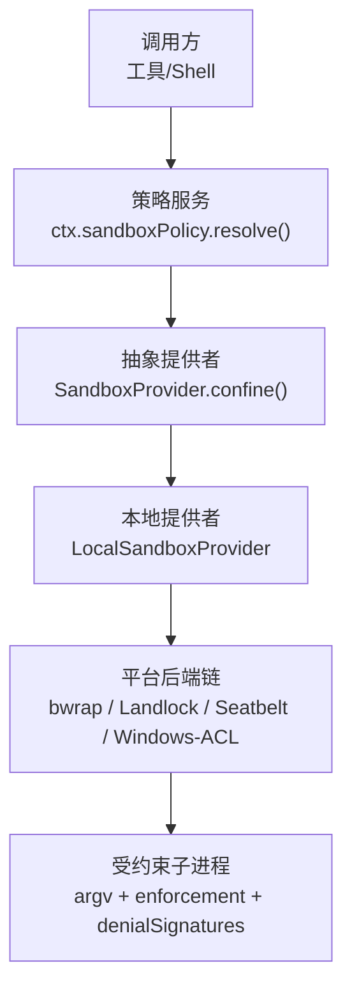
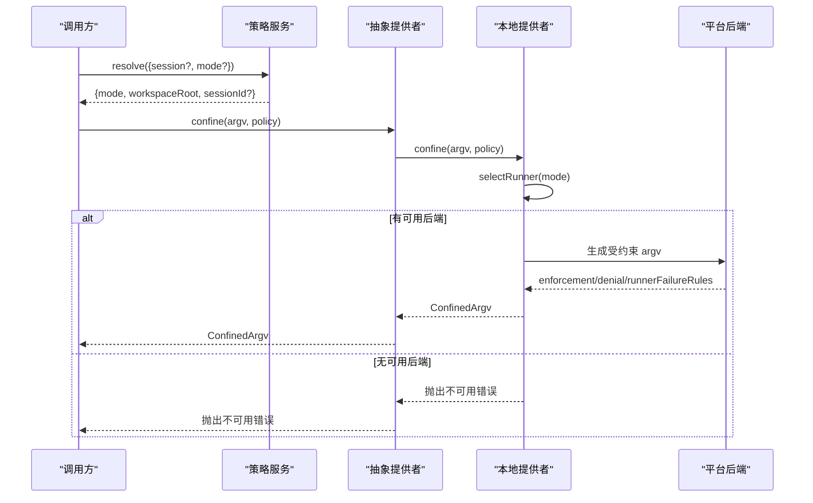
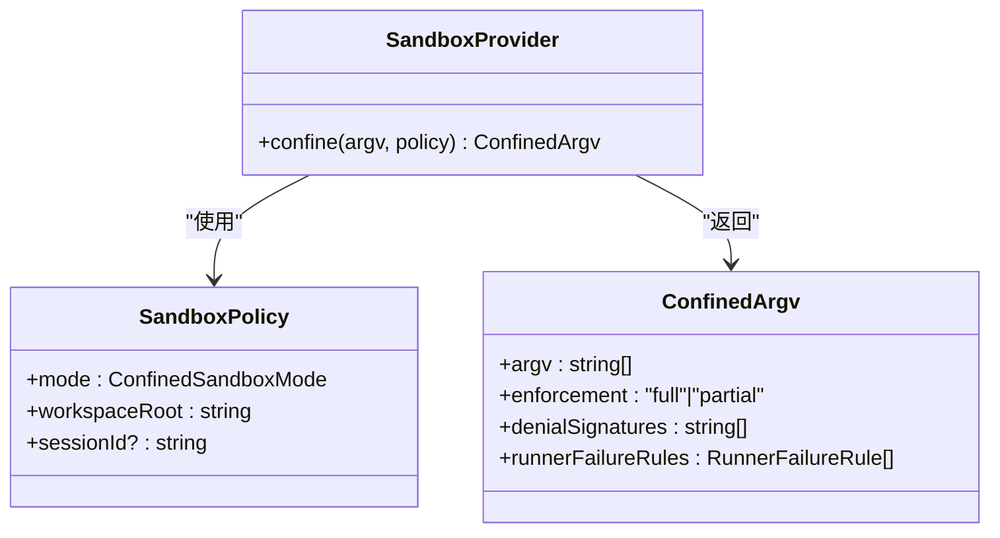
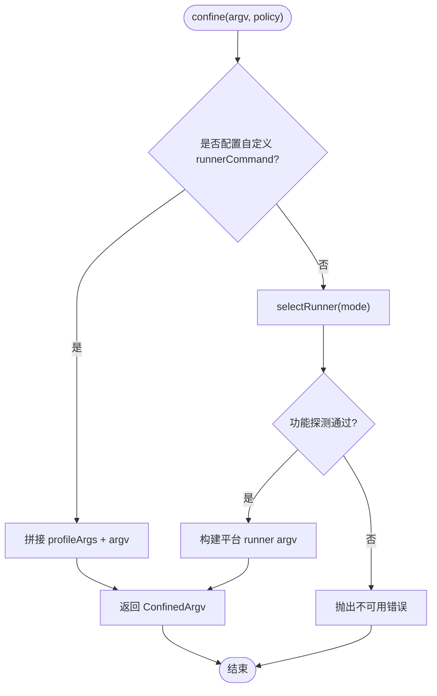
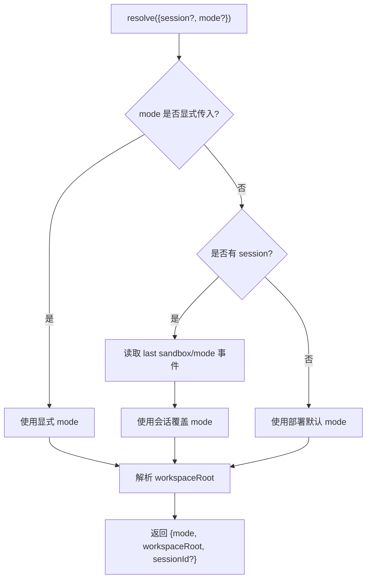
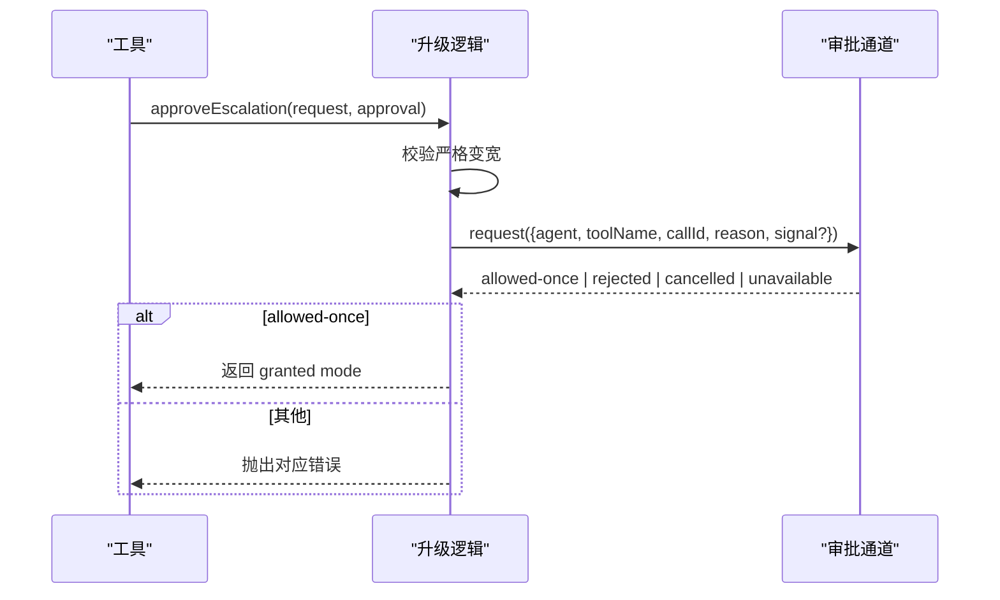
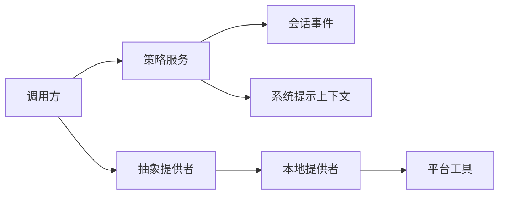

# 沙箱工具

<cite>
**本文引用的文件**
- [packages/sandbox/sandbox/src/index.ts](file://packages/sandbox/sandbox/src/index.ts)
- [packages/sandbox/sandbox-policy/src/index.ts](file://packages/sandbox/sandbox-policy/src/index.ts)
- [packages/sandbox/sandbox-policy/src/session-mode.ts](file://packages/sandbox/sandbox-policy/src/session-mode.ts)
- [packages/sandbox/sandbox-local/src/index.ts](file://packages/sandbox/sandbox-local/src/index.ts)
- [docs/subsystems/sandbox.md](file://docs/subsystems/sandbox.md)
- [packages/sandbox/sandbox/src/escalation.ts](file://packages/sandbox/sandbox/src/escalation.ts)
</cite>

## 目录
1. [简介](#简介)
2. [项目结构](#项目结构)
3. [核心组件](#核心组件)
4. [架构总览](#架构总览)
5. [详细组件分析](#详细组件分析)
6. [依赖关系分析](#依赖关系分析)
7. [性能与可靠性](#性能与可靠性)
8. [故障排查指南](#故障排查指南)
9. [结论](#结论)
10. [附录：API 参考](#附录api-参考)

## 简介
本文件为“沙箱工具”的完整 API 文档，覆盖沙箱创建、配置与管理接口；资源限制、网络访问控制与文件系统隔离策略；安全策略、权限模型与访问控制；生命周期管理与状态监控；跨进程通信、数据共享与状态同步；性能监控、故障恢复与资源清理；以及安全最佳实践与常见问题解答。

该沙箱系统通过抽象服务将“同进程/同世界”的子进程执行包裹在基于主机路径的文件效果策略中，屏蔽平台差异（Linux bwrap/Landlock、macOS Seatbelt、Windows ACL 受限令牌），并提供统一的策略解析、会话级模式切换与升级审批流程。

## 项目结构
- 抽象层：定义沙箱提供者抽象、策略类型、错误码与升级词汇表
- 策略层：集中管理部署默认模式、工作区根目录与会话级模式覆盖
- 本地实现：按平台选择并探测可用后端，生成受约束的 argv 并报告执行完整性
- 会话模式：以事件日志作为唯一事实源，提供读写路径与折叠计算

图表来源
- [packages/sandbox/sandbox/src/index.ts:158-176](file://packages/sandbox/sandbox/src/index.ts#L158-L176)
- [packages/sandbox/sandbox-policy/src/index.ts:135-142](file://packages/sandbox/sandbox-policy/src/index.ts#L135-L142)
- [packages/sandbox/sandbox-local/src/index.ts:316-333](file://packages/sandbox/sandbox-local/src/index.ts#L316-L333)

章节来源
- [docs/subsystems/sandbox.md:1-219](file://docs/subsystems/sandbox.md#L1-L219)
- [packages/sandbox/sandbox/src/index.ts:1-179](file://packages/sandbox/sandbox/src/index.ts#L1-L179)
- [packages/sandbox/sandbox-policy/src/index.ts:1-155](file://packages/sandbox/sandbox-policy/src/index.ts#L1-L155)
- [packages/sandbox/sandbox-local/src/index.ts:1-568](file://packages/sandbox/sandbox-local/src/index.ts#L1-L568)

## 核心组件
- SandboxProvider（抽象）：定义 confine(argv, policy) 契约，要求返回受约束的 argv 或关闭失败，禁止静默放行
- LocalSandboxProvider（本地实现）：平台链选择与功能探测，生成 argv，附带 enforcement、denialSignatures、runnerFailureRules
- SandboxPolicyService（策略服务）：解析 per-call 策略（mode/workspaceRoot/sessionId），注入上下文消息，支持会话模式覆盖
- Session Mode（会话模式）：以 session 事件为持久化存储，提供 effectiveSandboxMode 与 setSandboxMode
- Escalation（升级机制）：严格变宽校验、审批通道、统一拒绝提示与一次性授权

章节来源
- [packages/sandbox/sandbox/src/index.ts:23-176](file://packages/sandbox/sandbox/src/index.ts#L23-L176)
- [packages/sandbox/sandbox-local/src/index.ts:250-333](file://packages/sandbox/sandbox-local/src/index.ts#L250-L333)
- [packages/sandbox/sandbox-policy/src/index.ts:91-151](file://packages/sandbox/sandbox-policy/src/index.ts#L91-L151)
- [packages/sandbox/sandbox-policy/src/session-mode.ts:1-72](file://packages/sandbox/sandbox-policy/src/session-mode.ts#L1-L72)
- [packages/sandbox/sandbox/src/escalation.ts:22-190](file://packages/sandbox/sandbox/src/escalation.ts#L22-L190)

## 架构总览
沙箱由“策略—提供者—后端”三层构成：
- 策略层决定 mode 与 workspaceRoot，附加 sessionId 给后端做会话级隔离
- 抽象提供者对外暴露 confine，内部委托具体后端实现
- 本地提供者根据平台选择 runner 链，进行功能探测并缓存结果，输出 ConfinedArgv

图表来源
- [packages/sandbox/sandbox-policy/src/index.ts:135-142](file://packages/sandbox/sandbox-policy/src/index.ts#L135-L142)
- [packages/sandbox/sandbox/src/index.ts:158-176](file://packages/sandbox/sandbox/src/index.ts#L158-L176)
- [packages/sandbox/sandbox-local/src/index.ts:316-333](file://packages/sandbox/sandbox-local/src/index.ts#L316-L333)
- [packages/sandbox/sandbox-local/src/index.ts:492-539](file://packages/sandbox/sandbox-local/src/index.ts#L492-L539)

## 详细组件分析

### 抽象沙箱提供者（SandboxProvider）
- 职责：定义 confine(argv, policy) 抽象方法，保证返回受约束 argv 或关闭失败
- 关键类型：
  - SandboxMode：read-only | workspace-write | danger-full-access
  - SandboxPolicy：包含 mode、workspaceRoot、可选 sessionId
  - ConfinedArgv：返回 argv、enforcement、denialSignatures、runnerFailureRules
  - SandboxUnavailableError：当无可用的后端时抛出，携带结构化错误码

图表来源
- [packages/sandbox/sandbox/src/index.ts:23-176](file://packages/sandbox/sandbox/src/index.ts#L23-L176)

章节来源
- [packages/sandbox/sandbox/src/index.ts:23-176](file://packages/sandbox/sandbox/src/index.ts#L23-L176)

### 本地沙箱提供者（LocalSandboxProvider）
- 职责：平台链选择与功能探测，生成受约束 argv，附带执行完整性与诊断信息
- 平台链：
  - Linux：优先 bwrap，其次 Landlock
  - macOS：Seatbelt
  - Windows：ACL 受限令牌 runner
- 功能探测：对候选 runner 进行功能性测试，缓存结果
- 资源清理：Windows ACL 临时能力在 provider dispose 时撤销并清理临时目录

图表来源
- [packages/sandbox/sandbox-local/src/index.ts:316-333](file://packages/sandbox/sandbox-local/src/index.ts#L316-L333)
- [packages/sandbox/sandbox-local/src/index.ts:492-539](file://packages/sandbox/sandbox-local/src/index.ts#L492-L539)

章节来源
- [packages/sandbox/sandbox-local/src/index.ts:1-568](file://packages/sandbox/sandbox-local/src/index.ts#L1-L568)

### 策略服务（SandboxPolicyService）
- 职责：解析 per-call 策略（mode/workspaceRoot/sessionId），注入上下文消息，支持会话模式覆盖
- 优先级：显式 mode > 会话覆盖 > 部署默认
- 工作区根：从会话 cwd 解析绝对路径，无会话时使用配置的 fallback root
- 上下文消息：将当前策略渲染为模型可见的策略上下文

图表来源
- [packages/sandbox/sandbox-policy/src/index.ts:135-142](file://packages/sandbox/sandbox-policy/src/index.ts#L135-L142)
- [packages/sandbox/sandbox-policy/src/session-mode.ts:52-58](file://packages/sandbox/sandbox-policy/src/session-mode.ts#L52-L58)

章节来源
- [packages/sandbox/sandbox-policy/src/index.ts:60-151](file://packages/sandbox/sandbox-policy/src/index.ts#L60-L151)
- [packages/sandbox/sandbox-policy/src/session-mode.ts:1-72](file://packages/sandbox/sandbox-policy/src/session-mode.ts#L1-L72)

### 会话模式（Session Mode）
- 存储：以 session 事件日志为唯一事实源，last event 即为有效覆盖
- 写入：setSandboxMode 追加一个 sandbox/mode 事件
- 读取：effectiveSandboxMode 从后向前扫描事件获取最新模式

章节来源
- [packages/sandbox/sandbox-policy/src/session-mode.ts:1-72](file://packages/sandbox/sandbox-policy/src/session-mode.ts#L1-L72)

### 升级机制（Escalation）
- 严格变宽：仅允许向更宽的模式升级（read-only → workspace-write → danger-full-access）
- 审批通道：approveEscalation 在执行业务前请求用户批准，返回一次性授权
- 拒绝提示：统一标记与提示行，指导重试与升级

图表来源
- [packages/sandbox/sandbox/src/escalation.ts:157-189](file://packages/sandbox/sandbox/src/escalation.ts#L157-L189)

章节来源
- [packages/sandbox/sandbox/src/escalation.ts:22-190](file://packages/sandbox/sandbox/src/escalation.ts#L22-L190)

## 依赖关系分析
- 策略服务依赖会话事件与系统提示上下文
- 本地提供者依赖平台工具（bwrap、sandbox-exec、landlock-run、Windows ACL runner）
- 抽象提供者被所有消费者通过 ctx.sandbox 使用
- 会话模式与策略服务共同维护 per-session 策略事实

图表来源
- [packages/sandbox/sandbox-policy/src/index.ts:112-124](file://packages/sandbox/sandbox-policy/src/index.ts#L112-L124)
- [packages/sandbox/sandbox-local/src/index.ts:250-333](file://packages/sandbox/sandbox-local/src/index.ts#L250-L333)

章节来源
- [packages/sandbox/sandbox/src/index.ts:146-176](file://packages/sandbox/sandbox/src/index.ts#L146-L176)
- [packages/sandbox/sandbox-policy/src/index.ts:1-155](file://packages/sandbox/sandbox-policy/src/index.ts#L1-L155)
- [packages/sandbox/sandbox-local/src/index.ts:1-568](file://packages/sandbox/sandbox-local/src/index.ts#L1-L568)

## 性能与可靠性
- 功能探测缓存：平台链选择结果在 provider 生命周期内缓存，避免重复探测
- 最小化开销：仅首次需要时进行 runner 探测；单候选平台直接选择
- 资源清理：Windows ACL 临时能力在 provider dispose 时撤销并清理临时目录，避免泄漏
- 关闭失败容忍：清理失败记录警告但不中断 Cordis 销毁流程

章节来源
- [packages/sandbox/sandbox-local/src/index.ts:264-303](file://packages/sandbox/sandbox-local/src/index.ts#L264-L303)
- [packages/sandbox/sandbox-local/src/index.ts:445-477](file://packages/sandbox/sandbox-local/src/index.ts#L445-L477)

## 故障排查指南
- 不可用后端：当无可用的后端时，confine 会抛出 SANDBOX_UNAVAILABLE；检查平台工具是否安装且可用
- 部分执行：某些后端可能报告 partial enforcement（如旧版 Landlock ABI、Windows ACL 的 Everyone/hard-link 边界）
- 运行器失败：通过 runnerFailureRules 区分“运行器失败”和“命令被拒绝”，前者属于基础设施问题
- 拒绝诊断：denialSignatures 提供后端特定的拒绝特征串，用于识别内核拒绝原因

章节来源
- [packages/sandbox/sandbox/src/index.ts:118-144](file://packages/sandbox/sandbox/src/index.ts#L118-L144)
- [packages/sandbox/sandbox-local/src/index.ts:200-240](file://packages/sandbox/sandbox-local/src/index.ts#L200-L240)
- [docs/subsystems/sandbox.md:96-157](file://docs/subsystems/sandbox.md#L96-L157)

## 结论
沙箱工具通过抽象提供者、策略服务与本地实现的解耦设计，实现了跨平台的进程级文件效果隔离。其策略解析与会话模式覆盖提供了灵活的安全策略管理；升级机制确保在必要时可经审批获得更宽权限；本地实现负责平台适配与资源清理。整体架构在保证安全性的同时兼顾了性能与可维护性。

## 附录：API 参考

### 策略服务
- resolve(request): 解析 per-call 策略，返回 {mode, workspaceRoot, sessionId?}
- overrideOf(session): 读取会话覆盖模式（不应用部署默认）

章节来源
- [packages/sandbox/sandbox-policy/src/index.ts:135-151](file://packages/sandbox/sandbox-policy/src/index.ts#L135-L151)

### 抽象提供者
- confine(argv, policy): 返回 ConfinedArgv 或抛出不可用错误

章节来源
- [packages/sandbox/sandbox/src/index.ts:158-176](file://packages/sandbox/sandbox/src/index.ts#L158-L176)

### 本地提供者
- 配置项：
  - runnerCommand: 自定义 runner argv（非空时跳过平台链选择）
  - runnerFailureSignatures: 自定义 runner 失败特征串（需与 runnerCommand 配对）
  - probeTimeoutMs: 功能探测超时（毫秒）

章节来源
- [packages/sandbox/sandbox-local/src/index.ts:43-65](file://packages/sandbox/sandbox-local/src/index.ts#L43-L65)
- [packages/sandbox/sandbox-local/src/index.ts:250-295](file://packages/sandbox/sandbox-local/src/index.ts#L250-L295)

### 会话模式
- setSandboxMode(session, mode): 追加 sandbox/mode 事件
- effectiveSandboxMode(events): 从事件日志获取最新模式

章节来源
- [packages/sandbox/sandbox-policy/src/session-mode.ts:41-72](file://packages/sandbox/sandbox-policy/src/session-mode.ts#L41-L72)

### 升级机制
- approveEscalation(request, approval): 在执行业务前完成严格变宽校验与审批，返回一次性授权模式或抛出错误
- ESCALATION_TARGETS: 允许的升级目标模式集合
- WIDER_MODES: 严格变宽映射表

章节来源
- [packages/sandbox/sandbox/src/escalation.ts:22-190](file://packages/sandbox/sandbox/src/escalation.ts#L22-L190)