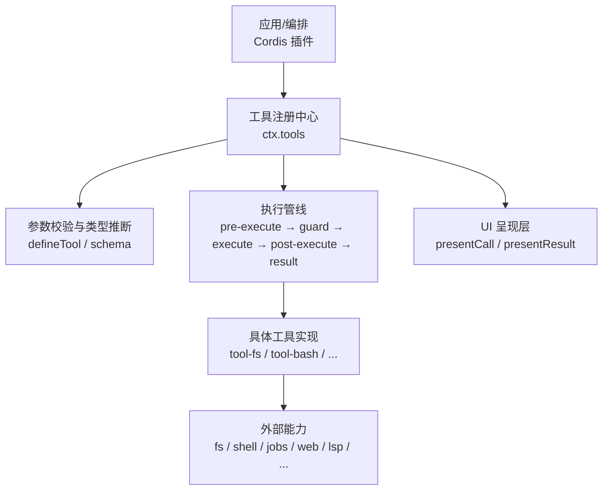
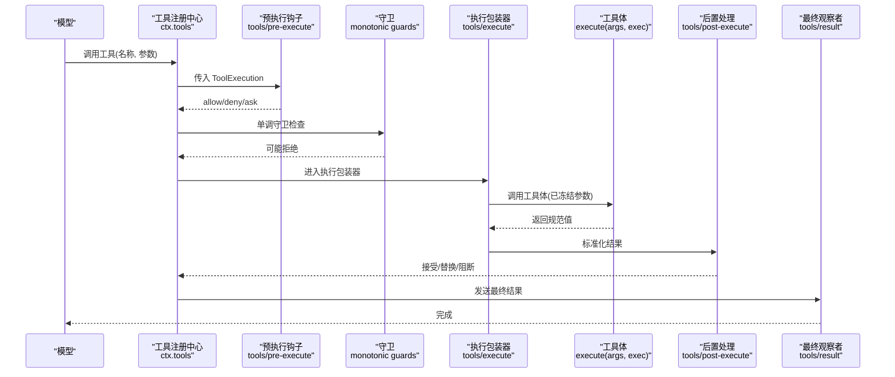
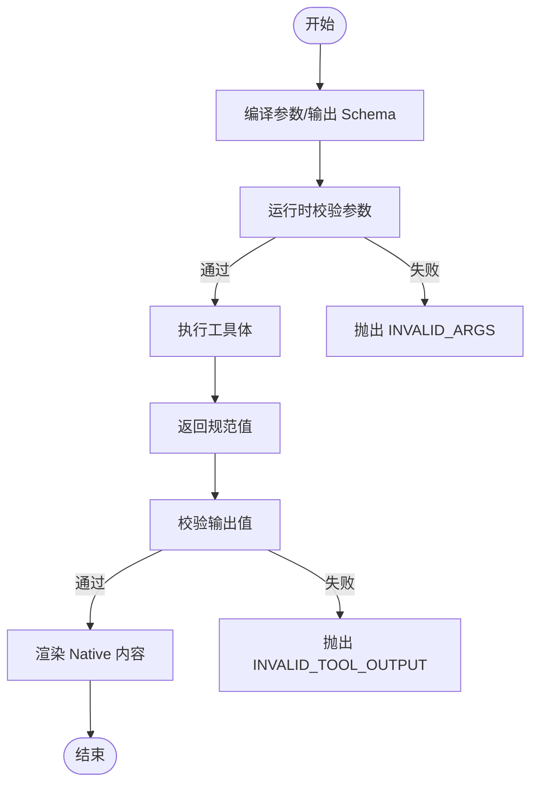
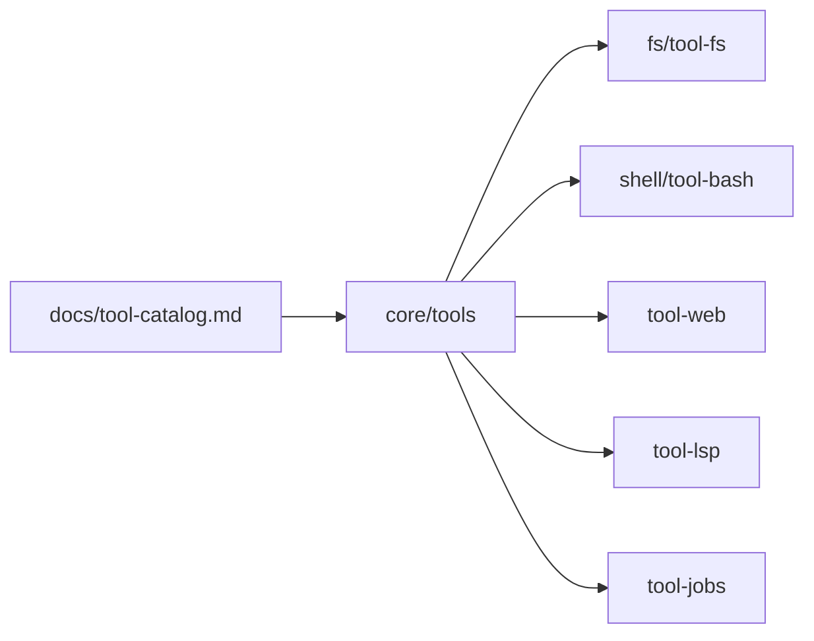

# 自定义工具开发

<cite>
**本文引用的文件**   
- [docs/cookbook/adding-a-tool.md](file://docs/cookbook/adding-a-tool.md)
- [docs/subsystems/tools.md](file://docs/subsystems/tools.md)
- [docs/tool-catalog.md](file://docs/tool-catalog.md)
- [docs/testing.md](file://docs/testing.md)
- [packages/core/tools/src/schema.ts](file://packages/core/tools/src/schema.ts)
- [packages/core/tools/src/index.ts](file://packages/core/tools/src/index.ts)
- [packages/fs/tool-fs/src/index.ts](file://packages/fs/tool-fs/src/index.ts)
- [packages/shell/tool-bash/src/index.ts](file://packages/shell/tool-bash/src/index.ts)
</cite>

## 目录
1. [简介](#简介)
2. [项目结构](#项目结构)
3. [核心组件](#核心组件)
4. [架构总览](#架构总览)
5. [详细组件分析](#详细组件分析)
6. [依赖关系分析](#依赖关系分析)
7. [性能与内存管理](#性能与内存管理)
8. [错误处理与调试](#错误处理与调试)
9. [测试策略](#测试策略)
10. [打包、发布与版本管理](#打包发布与版本管理)
11. [文档生成与API参考](#文档生成与api参考)
12. [结论](#结论)

## 简介
本指南面向希望在本仓库中开发“模型可见”的自定义工具的工程师。内容覆盖：
- 工具开发框架与接口规范（参数校验、返回值类型、执行上下文）
- 工具定义文件与UI呈现约定
- 单元测试、集成测试与端到端测试方法
- 工具打包、发布与版本管理流程
- 文档生成、API参考与示例代码
- 性能优化、内存管理与错误处理最佳实践
- 调试工具、日志分析与故障排查技巧

## 项目结构
仓库采用多包工作区组织，工具相关能力集中在 core/tools 子系统，并提供多个生产级工具实现作为参考：
- 工具框架与执行管线：packages/core/tools
- 文件系统工具套件：packages/fs/tool-fs
- Shell 工具（bash/pwsh）：packages/shell/tool-bash, tool-pwsh
- 工具目录与契约文档：docs/subsystems/tools.md, docs/tool-catalog.md
- 工具作者指南：docs/cookbook/adding-a-tool.md
- 测试策略与分层：docs/testing.md

图表来源
- [packages/core/tools/src/index.ts:137-200](file://packages/core/tools/src/index.ts#L137-L200)
- [packages/core/tools/src/schema.ts:482-618](file://packages/core/tools/src/schema.ts#L482-L618)
- [packages/fs/tool-fs/src/index.ts:53-79](file://packages/fs/tool-fs/src/index.ts#L53-L79)
- [packages/shell/tool-bash/src/index.ts:190-200](file://packages/shell/tool-bash/src/index.ts#L190-L200)

章节来源
- [docs/subsystems/tools.md:9-96](file://docs/subsystems/tools.md#L9-L96)
- [docs/cookbook/adding-a-tool.md:7-66](file://docs/cookbook/adding-a-tool.md#L7-L66)

## 核心组件
- 工具定义 DSL 与类型推断：通过 defineTool 声明 name、description、parameters、output.schema/output.render/output.presentationMeta，以及可选的 timeoutMs、isConcurrencySafe、finalizeContent、presentCall、presentResult。
- 统一 JSON Schema 子集：ValueSchemaSpec 支持 string/number/integer/boolean/null/array/object/json/oneOf；参数根为隐式开放对象，required 标注在属性上。
- 执行管线：tools/pre-ex允许/拒绝/询问 → 单调守卫 → tools/execute 环绕（可替换信号）→ tools/post-execute 接受/替换/阻断 → finalizeContent → tools/result 观察。
- UI 呈现：presentCall/presentResult 返回中性 card-tagged 意图（generic/terminal/diff/search/read/web），由宿主/客户端映射到具体视图。

章节来源
- [packages/core/tools/src/schema.ts:84-176](file://packages/core/tools/src/schema.ts#L84-L176)
- [packages/core/tools/src/schema.ts:432-618](file://packages/core/tools/src/schema.ts#L432-L618)
- [docs/subsystems/tools.md:170-405](file://docs/subsystems/tools.md#L170-L405)
- [docs/subsystems/tools.md:459-468](file://docs/subsystems/tools.md#L459-L468)

## 架构总览
下图展示了从模型请求到工具执行的完整链路，包括参数校验、执行策略、结果规范化与持久化。

图表来源
- [packages/core/tools/src/index.ts:137-200](file://packages/core/tools/src/index.ts#L137-L200)
- [docs/subsystems/tools.md:170-405](file://docs/subsystems/tools.md#L170-L405)

## 详细组件分析

### 工具定义与参数校验
- defineTool 将 author-facing ValueSchemaSpec 编译为受支持的 JSON Schema 子集，并在执行前对模型生成的 arguments 进行严格校验，不匹配则抛出结构化错误。
- 输出 schema 同样被编译并校验，确保 execute 返回的值与 output.schema 一致。
- 类型推断：InferArgs/InferValue 提供强类型参数与返回值推导，便于 IDE 提示与静态检查。

图表来源
- [packages/core/tools/src/schema.ts:432-618](file://packages/core/tools/src/schema.ts#L432-L618)
- [docs/subsystems/tools.md:98-152](file://docs/subsystems/tools.md#L98-L152)

章节来源
- [packages/core/tools/src/schema.ts:84-176](file://packages/core/tools/src/schema.ts#L84-L176)
- [packages/core/tools/src/schema.ts:432-618](file://packages/core/tools/src/schema.ts#L432-L618)

### 执行上下文与生命周期
- ToolRunContext 提供 deferContext/concludeTurn 等能力，用于嵌套调度或标记本轮终止。
- 执行身份 token、rootCallId、signal 等字段在执行期间不可变，保证审计与回放一致性。
- 超时与并发：timeoutMs 为协作式预算；isConcurrencySafe 可声明并行安全。

章节来源
- [docs/subsystems/tools.md:170-254](file://docs/subsystems/tools.md#L170-L254)
- [docs/subsystems/tools.md:283-313](file://docs/subsystems/tools.md#L283-L313)

### UI 呈现与卡片协议
- presentCall/presentResult 返回中性 card-tagged 意图，如 generic/terminal/diff/search/read/web，由宿主/客户端渲染。
- 呈现函数必须纯且无副作用，以支持实时流与回放。

章节来源
- [docs/subsystems/tools.md:459-468](file://docs/subsystems/tools.md#L459-L468)
- [docs/cookbook/adding-a-tool.md:67-90](file://docs/cookbook/adding-a-tool.md#L67-L90)

### 参考实现：文件系统工具
- tool-fs 提供 read/write/edit/read_image，封装了读取窗口、截断、沙箱控制器与事件观测。
- 通过 ctx.fs 抽象文件系统后端，保持工具与具体实现解耦。

章节来源
- [packages/fs/tool-fs/src/index.ts:1-80](file://packages/fs/tool-fs/src/index.ts#L1-L80)

### 参考实现：Shell 工具（bash）
- tool-bash 消费 ctx.shell 能力，支持前台命令与后台任务（通过 ctx.jobs）。
- 提供终端卡片呈现、退出码解析、沙箱策略与升级路径说明。

章节来源
- [packages/shell/tool-bash/src/index.ts:1-200](file://packages/shell/tool-bash/src/index.ts#L1-L200)

## 依赖关系分析
- 工具包依赖 Cordis Context 与各类服务 seam（fs/shell/jobs/web/lsp 等）。
- 工具注册中心暴露 hooks/events，供策略与扩展点接入。
- 工具目录由脚本动态生成，确保 shipped 工具均有文档。

图表来源
- [docs/tool-catalog.md:12-42](file://docs/tool-catalog.md#L12-L42)
- [packages/core/tools/src/index.ts:137-200](file://packages/core/tools/src/index.ts#L137-L200)

章节来源
- [docs/tool-catalog.md:12-42](file://docs/tool-catalog.md#L12-L42)

## 性能与内存管理
- 大输出截断与溢出：read/grep/glob 等工具有内建上限，避免内存爆炸；超长输出保存到 spillStore，返回定位符以便后续读取。
- 流式读取：tool-fs 对大文件启用行/字节级流式读取，降低峰值内存。
- 协作取消：所有异步工作需监听 exec.signal，及时中止，避免资源泄漏。
- 并发控制：isConcurrencySafe 仅当确认为纯读/幂等时才开启，避免竞争条件。

章节来源
- [docs/tool-catalog.md:21-42](file://docs/tool-catalog.md#L21-L42)
- [packages/fs/tool-fs/src/index.ts:24-41](file://packages/fs/tool-fs/src/index.ts#L24-L41)
- [docs/subsystems/tools.md:53-74](file://docs/subsystems/tools.md#L53-L74)

## 错误处理与调试
- 参数与输出校验失败会抛出结构化错误（INVALID_ARGS/INVALID_TOOL_OUTPUT），统一走工具错误路径。
- 执行失败会被捕获并转为 isError 结果，保留人类可读消息与内部信息。
- 使用 finalizeContent 做最后的内容边界控制，不影响 value/meta 的正确性。
- 调试建议：
  - 通过 tools/result 观察最终冻结结果，定位问题阶段。
  - 使用 tools/code-dispatch-log 调整 run_code 子调度的日志副本。
  - 结合会话回放与快照测试，复现问题。

章节来源
- [docs/subsystems/tools.md:327-405](file://docs/subsystems/tools.md#L327-L405)
- [packages/core/tools/src/index.ts:177-197](file://packages/core/tools/src/index.ts#L177-L197)

## 测试策略
仓库按层级组织测试：
- 单元：vitest 针对包与脚本，关注边缘情况、错误路径、事件顺序、并发竞态与回归用例。
- 覆盖率门控：对 src 逐文件 100% 行覆盖，未覆盖行常为应删除的死代码。
- 真实 API e2e：带密钥测试，自跳过保障无密钥 CI 绿色。
- 快照：关键行为与传输契约的键无关快照，ACP/headless/web GUI 各有专属场景。
- 浏览器快照：Chromium 回放对比，CI 强制只读模式。

实践要点：
- 优先使用真实实现而非 mock，仅在昂贵/非确定性边界使用 mock。
- 桥接工具调用测试使用脚本化 mock 模型 + 真实工具/执行器。
- 每个非平凡变更需补充快照场景，确保可回放与可验证。

章节来源
- [docs/testing.md:7-50](file://docs/testing.md#L7-L50)

## 打包、发布与版本管理
- 工具以 Cordis 插件形式组织，遵循 packages/*/tool-* 命名约定。
- 工具目录由脚本生成并校验完整性，新增工具需在引导清单中登记，否则构建失败。
- 发布流程：
  - 更新 package.json 版本与变更日志。
  - 运行文档生成与校验（工具目录、Cordis 目录）。
  - 提交 PR，触发 CI（单元/覆盖率/e2e/快照）。
  - 合并后由发布脚本构建并发布至 npm。
- 版本兼容性：
  - 工具对外暴露的 schema 与事件契约需保持稳定；破坏性变更需配合迁移与兼容层。
  - 通过 ToolRestriction 与 scoped registration 控制可见性与继承。

章节来源
- [docs/tool-catalog.md:1-10](file://docs/tool-catalog.md#L1-L10)
- [docs/subsystems/tools.md:153-168](file://docs/subsystems/tools.md#L153-L168)

## 文档生成与API参考
- 工具目录自动生成：gen-tool-catalog 启动每个工具插件并读取 schemas()，确保文档与运行时一致。
- Cordis API 目录：gen-cordis-catalog 从源码 AST 生成，包含 ctx.tools 方法与事件。
- 文档同步：doc-sync 任务校验目录新鲜度，缺失或过期将报错。
- 示例代码：
  - 最小工具形态与规则见 adding-a-tool.md。
  - 参考实现：tool-fs、tool-bash 展示参数校验、输出渲染、UI 呈现与错误处理。

章节来源
- [docs/tool-catalog.md:1-10](file://docs/tool-catalog.md#L1-L10)
- [docs/subsystems/tools.md:470-721](file://docs/subsystems/tools.md#L470-L721)
- [docs/cookbook/adding-a-tool.md:7-66](file://docs/cookbook/adding-a-tool.md#L7-L66)

## 结论
本指南基于仓库中的工具框架与参考实现，提供了从零到一开发自定义工具的完整路径：明确接口规范、严格参数与输出校验、利用执行管线与呈现协议、编写分层测试、自动化文档与发布流程，并结合性能与错误处理最佳实践。建议在实际开发中：
- 始终使用 defineTool 与统一 schema，确保类型与运行时一致性。
- 将策略与沙箱放在 pre-execute/guard/executor 层，工具体保持专注。
- 用快照与 e2e 守护契约，用覆盖率发现死代码。
- 借助工具目录与 Cordis 目录生成机制，保持文档与代码同步。