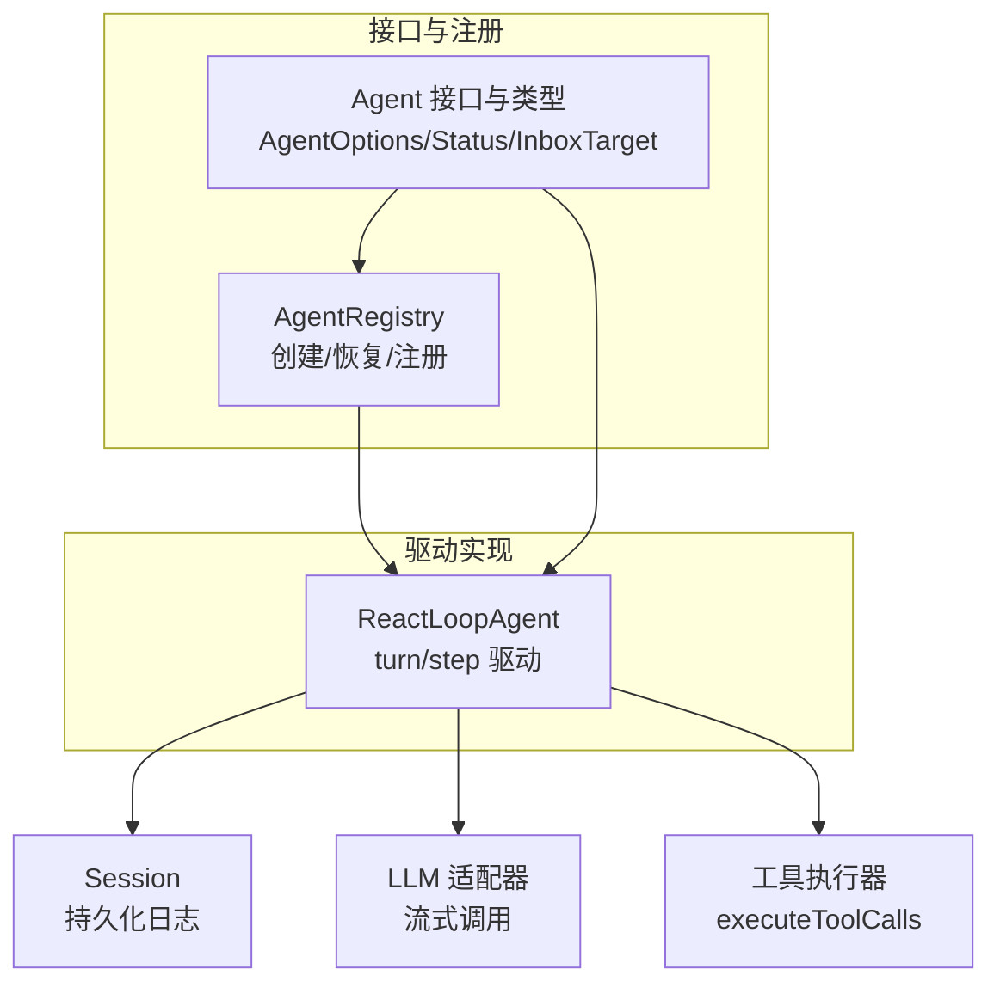
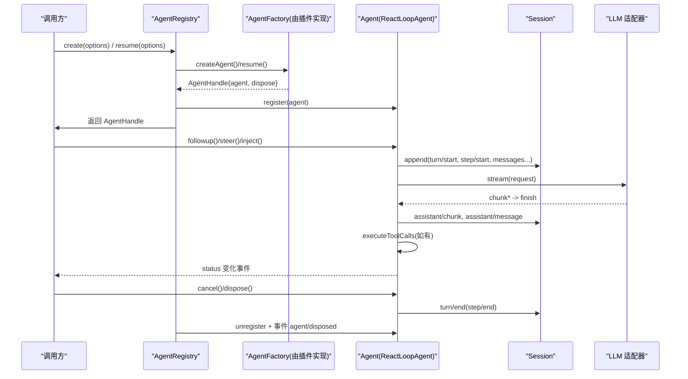
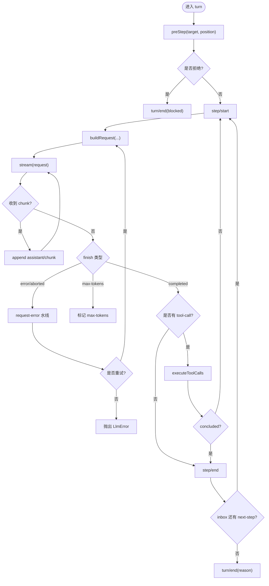

# Agent API

<cite>
**本文引用的文件**
- [packages/core/agent/src/index.ts](file://packages/core/agent/src/index.ts)
- [packages/core/agent/src/runtime-types.ts](file://packages/core/agent/src/runtime-types.ts)
- [packages/core/agent/src/types.ts](file://packages/core/agent/src/types.ts)
- [packages/core/agent-loop/src/agent.ts](file://packages/core/agent-loop/src/agent.ts)
</cite>

## 目录
1. [简介](#简介)
2. [项目结构](#项目结构)
3. [核心组件](#核心组件)
4. [架构总览](#架构总览)
5. [详细组件分析](#详细组件分析)
6. [依赖关系分析](#依赖关系分析)
7. [性能考量](#性能考量)
8. [故障排查指南](#故障排查指南)
9. [结论](#结论)
10. [附录：类型与使用示例](#附录类型与使用示例)

## 简介
本文件系统化文档化 Agent API，覆盖 Agent 的创建、配置、生命周期管理、上下文传播与事件处理机制，并提供完整的 TypeScript 类型定义说明与最佳实践。重点包括：
- Agent 注册、启动、停止与销毁流程
- Agent 类方法签名、参数类型与返回值
- 请求构建、错误重试、工具调用与步骤边界
- 上下文传播（发起者作用域）与事件水线（waterfall）扩展点
- 配置选项与常见陷阱

## 项目结构
Agent API 由两部分组成：
- 接口与注册中心：位于 packages/core/agent，提供 Agent 公共类型、注册表、工厂委托、上下文注入与事件分发。
- 驱动实现：位于 packages/core/agent-loop，提供基于会话日志的轮询驱动 ReactLoopAgent，负责 turn/step 推进、LLM 调用、工具执行与状态机流转。



图表来源
- [packages/core/agent/src/index.ts:256-430](file://packages/core/agent/src/index.ts#L256-L430)
- [packages/core/agent/src/runtime-types.ts:23-144](file://packages/core/agent/src/runtime-types.ts#L23-L144)
- [packages/core/agent-loop/src/agent.ts:64-497](file://packages/core/agent-loop/src/agent.ts#L64-L497)

章节来源
- [packages/core/agent/src/index.ts:256-430](file://packages/core/agent/src/index.ts#L256-L430)
- [packages/core/agent/src/runtime-types.ts:23-144](file://packages/core/agent/src/runtime-types.ts#L23-L144)
- [packages/core/agent-loop/src/agent.ts:64-497](file://packages/core/agent-loop/src/agent.ts#L64-L497)

## 核心组件
- AgentRegistry：Agent 服务，负责工厂注册、创建/恢复、注册/注销、查找、列出与根节点枚举；维护发起者作用域以支持跨异步边界的因果归属。
- Agent 接口：对外暴露的运行时句柄，包含 id、options、session、inbox、status、ctx，以及 send/followup/steer/inject/cancel/runMaintenance/whenIdle 等方法。
- ReactLoopAgent：具体驱动，实现 Agent 接口，维护 idle/maintenance/running 三态，驱动 turn/step 循环，组装请求、流式消费、工具调用与错误处理。

章节来源
- [packages/core/agent/src/index.ts:256-430](file://packages/core/agent/src/index.ts#L256-L430)
- [packages/core/agent/src/runtime-types.ts:23-144](file://packages/core/agent/src/runtime-types.ts#L23-L144)
- [packages/core/agent-loop/src/agent.ts:64-497](file://packages/core/agent-loop/src/agent.ts#L64-L497)

## 架构总览
Agent 的生命周期围绕“创建/恢复 -> 注册 -> 启动 -> 运行 -> 停止/销毁”展开。创建时通过 AgentRegistry.create/resume 委托给已注册的 AgentFactory；成功后进入注册阶段 announce，随后启动驱动并进入运行态；停止通过 cancel/dispose 触发清理与注销。



图表来源
- [packages/core/agent/src/index.ts:405-430](file://packages/core/agent/src/index.ts#L405-L430)
- [packages/core/agent/src/index.ts:450-576](file://packages/core/agent/src/index.ts#L450-L576)
- [packages/core/agent-loop/src/agent.ts:246-330](file://packages/core/agent-loop/src/agent.ts#L246-L330)
- [packages/core/agent-loop/src/agent.ts:332-401](file://packages/core/agent-loop/src/agent.ts#L332-L401)

## 详细组件分析

### AgentRegistry（注册与生命周期）
- 关键职责
  - setFactory：注册 AgentFactory，限制单次注册，返回 effect 清理函数。
  - create/resume：将调用委托给工厂，透传 ownerCtx 以绑定所有权与作用域。
  - register/enter/announce：插入 Agent、声明式发布 agent/created，并在卸载时配对 emit agent/disposed。
  - get/list/roots：查询当前活跃 Agent。
  - withInitiator/withoutInitiator/currentInitiator/requireInitiator：维护发起者作用域，用于跨异步边界的因果归属。
- 重要行为
  - 创建/恢复过程在 setup 完成且 commit 后，再顺序发出 session/agent 创建通知，最后启动驱动。
  - 注销遵循 ordered lifecycle：先等待驱动收敛，再移除注册并派发 disposed。

章节来源
- [packages/core/agent/src/index.ts:256-430](file://packages/core/agent/src/index.ts#L256-L430)
- [packages/core/agent/src/index.ts:450-576](file://packages/core/agent/src/index.ts#L450-L576)
- [packages/core/agent/src/index.ts:619-685](file://packages/core/agent/src/index.ts#L619-L685)

### Agent 接口与类型（运行时契约）
- AgentOptions：provider、model、maxTokens。
- AgentStatus：idle | running。
- InboxTarget：next-turn | next-step。
- Agent 方法
  - send(message, target, wakeup)：投递到指定队列并可唤醒驱动。
  - followup(message)：追加下一 turn 的消息并唤醒。
  - steer(message)：投递到 next-step 并唤醒。
  - inject(message)：非唤醒地注入下一步上下文。
  - cancel(cause, options)：中止活动并清空或保留待处理消息。
  - runMaintenance(task)：在 idle 阶段执行维护任务，期间保持 status=idle。
  - whenIdle()：等待所有活动收敛。
- 事件扩展点（waterfall/serial/emit）
  - agent/pre-step：可拒绝或替换进入 step 的消息。
  - agent/request：可替换冻结后的请求配置。
  - agent/request-error：可返回 {kind:'retry'} 进行重试。
  - agent/turn-stopping：turn 即将关闭时的串行钩子。
  - agent/status、agent/inbox/*、agent/error 等事件。

章节来源
- [packages/core/agent/src/runtime-types.ts:23-144](file://packages/core/agent/src/runtime-types.ts#L23-L144)
- [packages/core/agent/src/runtime-types.ts:146-291](file://packages/core/agent/src/runtime-types.ts#L146-L291)
- [packages/core/agent/src/types.ts:9-27](file://packages/core/agent/src/types.ts#L9-L27)

### ReactLoopAgent（驱动实现）
- 状态机
  - idle：无活动。
  - maintenance：执行维护任务，不改变对外 status。
  - running：驱动 turn/step 循环，status=running。
- 关键流程
  - wakeDriver：从 idle 转入 running，设置 abortController 并启动 kick。
  - turn：打开 turn/start，循环 preStep -> step，记录 step/start/end，最终写入 turn/end。
  - step：构建请求、流式读取、拼接 assistant 消息、处理工具调用与 max-tokens 粘性终止。
  - buildRequest：合并持久化 header、用户配置、系统提示与工具集，必要时记录 request/header/context。
  - 错误处理：统一上报 agent/error，并将失败归一化为 LlmError 或 UNKNOWN 代码。
- 上下文传播
  - 通过 loopCtx.agents.withInitiator(this, () => this.kick()) 建立发起者作用域，确保下游回调能追溯因果。



图表来源
- [packages/core/agent-loop/src/agent.ts:246-330](file://packages/core/agent-loop/src/agent.ts#L246-L330)
- [packages/core/agent-loop/src/agent.ts:332-401](file://packages/core/agent-loop/src/agent.ts#L332-L401)
- [packages/core/agent-loop/src/agent.ts:407-495](file://packages/core/agent-loop/src/agent.ts#L407-L495)

章节来源
- [packages/core/agent-loop/src/agent.ts:64-497](file://packages/core/agent-loop/src/agent.ts#L64-L497)

## 依赖关系分析
- AgentRegistry 依赖 Cordis 上下文与服务机制，注入 Typert 查找与上下文映射，并通过 effect 管理生命周期。
- ReactLoopAgent 依赖 Session、SystemPrompt、LLM 适配器、Scope 与 Inbox，组合生成请求并驱动工具执行。
- 事件系统贯穿 Agent 生命周期：创建/销毁、状态切换、入队/出队、请求错误、turn 关闭等。

```mermaid
classDiagram
class AgentRegistry {
+create(options) Promise~AgentHandle~
+resume(options) Promise~AgentHandle~
+register(agent) () => void
+get(id) Agent?
+list() Agent[]
+roots() Agent[]
+withInitiator(agent, op) T
+withoutInitiator(op) T
+currentInitiator() Agent?
+requireInitiator() Agent
}
class Agent {
+id : SessionId
+options : AgentOptions
+session : Session
+inbox : Inbox
+status : AgentStatus
+ctx : Context
+send(message, target, wakeup) : void
+followup(message) : void
+steer(message) : void
+inject(message) : void
+cancel(cause, options?) : void
+runMaintenance(task) : Promise<T>
+whenIdle() : Promise<void>
}
class ReactLoopAgent {
-phase : Phase
-kick() : Promise<void>
-turn() : Promise<boolean>
-step(assembly) : Promise<StepEndReason?>
-buildRequest(...) : Promise<{request, preparedCall?}>
}
AgentRegistry --> Agent : "创建/注册/查询"
ReactLoopAgent ..|> Agent : "实现"
```

图表来源
- [packages/core/agent/src/index.ts:256-430](file://packages/core/agent/src/index.ts#L256-L430)
- [packages/core/agent/src/runtime-types.ts:23-144](file://packages/core/agent/src/runtime-types.ts#L23-L144)
- [packages/core/agent-loop/src/agent.ts:64-497](file://packages/core/agent-loop/src/agent.ts#L64-L497)

章节来源
- [packages/core/agent/src/index.ts:256-430](file://packages/core/agent/src/index.ts#L256-L430)
- [packages/core/agent/src/runtime-types.ts:23-144](file://packages/core/agent/src/runtime-types.ts#L23-L144)
- [packages/core/agent-loop/src/agent.ts:64-497](file://packages/core/agent-loop/src/agent.ts#L64-L497)

## 性能考量
- 热路径零分配：事件分派器在构造时融合，避免热点分配。
- 流式处理：LLM 响应以 chunk 流式追加，降低内存峰值。
- 粘性终止：max-tokens 一旦触发，后续正常完成的 step 不会降级 turn 结果。
- 请求头缓存与变更检测：仅在初始或变更时记录 request/header，减少日志开销。
- 维护任务隔离：runMaintenance 在 idle 阶段执行，不影响主循环吞吐。

[本节为通用指导，无需特定文件引用]

## 故障排查指南
- 常见错误
  - 未注册工厂：调用 create/resume 前需通过 setFactory 注册实现。
  - 无发起者：在非发起者作用域内 requireInitiator 会抛错。
  - 重复注册：同一 id 的 Agent 不可重复注册。
  - 请求缺少 provider/model：需在 AgentOptions 或 agent/request 水线中提供。
- 错误上报
  - 所有失败均通过 agent/error 事件上报；LLM 错误携带结构化 failure，其他错误归一化为 UNKNOWN。
- 调试建议
  - 监听 agent/status、agent/inbox/*、agent/request、agent/request-error 定位问题。
  - 使用 whenIdle 等待收敛后再做断言或清理。

章节来源
- [packages/core/agent/src/index.ts:216-219](file://packages/core/agent/src/index.ts#L216-L219)
- [packages/core/agent/src/index.ts:322-326](file://packages/core/agent/src/index.ts#L322-L326)
- [packages/core/agent/src/index.ts:474-483](file://packages/core/agent/src/index.ts#L474-L483)
- [packages/core/agent-loop/src/agent.ts:438-445](file://packages/core/agent-loop/src/agent.ts#L438-L445)
- [packages/core/agent-loop/src/agent.ts:302-316](file://packages/core/agent-loop/src/agent.ts#L302-L316)

## 结论
Agent API 通过清晰的接口与注册中心解耦了驱动实现，提供了强大的扩展点（waterfall/serial）与完善的生命周期管理。结合会话日志与流式 LLM 调用，实现了高可靠、可观测、可扩展的 Agent 运行时。推荐在生产环境中充分利用事件与上下文传播能力，配合严格的错误处理与资源清理策略。

[本节为总结性内容，无需特定文件引用]

## 附录：类型与使用示例

### TypeScript 类型定义（摘要）
- AgentOptions
  - provider?: string
  - model?: string
  - maxTokens?: number
- AgentStatus: 'idle' | 'running'
- InboxTarget: 'next-turn' | 'next-step'
- Agent
  - id: SessionId
  - options: AgentOptions
  - session: Session
  - inbox: Inbox
  - status: AgentStatus
  - ctx: Context
  - send(message, target, wakeup): void
  - followup(message): void
  - steer(message): void
  - inject(message): void
  - cancel(cause, options?): void
  - runMaintenance(task): Promise<T>
  - whenIdle(): Promise<void>
- AgentRegistry
  - setFactory(factory): () => void
  - create(options): Promise<AgentHandle>
  - resume(options): Promise<AgentHandle>
  - register(agent): () => void
  - get(id): Agent?
  - list(): Agent[]
  - roots(): Agent[]
  - withInitiator(agent, operation): T
  - withoutInitiator(operation): T
  - currentInitiator(): Agent?
  - requireInitiator(): Agent

章节来源
- [packages/core/agent/src/runtime-types.ts:23-144](file://packages/core/agent/src/runtime-types.ts#L23-L144)
- [packages/core/agent/src/index.ts:256-430](file://packages/core/agent/src/index.ts#L256-L430)

### 使用示例（步骤级说明）
- 创建 Agent
  - 通过 ctx.agents.setFactory 注册工厂（由插件提供）。
  - 调用 ctx.agents.create({ sessionId, agentOptions?, seed?, setup?, signal? }) 获取 AgentHandle。
  - 使用 handle.agent 发送消息并驱动运行。
- 恢复 Agent
  - 调用 ctx.agents.resume({ resumeSessionId, agentOptions?, setup?, signal? }) 加载持久化会话并恢复。
- 发送消息
  - followup：追加下一 turn 并唤醒。
  - steer：投递到 next-step 并唤醒。
  - inject：非唤醒地注入上下文。
- 取消与维护
  - cancel：中止当前活动，可选择保留待处理消息。
  - runMaintenance：在 idle 阶段执行维护任务。
  - whenIdle：等待所有活动收敛。
- 扩展点
  - agent/pre-step：拒绝或替换进入 step 的消息。
  - agent/request：替换冻结的请求配置。
  - agent/request-error：返回 {kind:'retry'} 进行重试。
  - agent/turn-stopping：在 turn 关闭前执行收尾逻辑。

章节来源
- [packages/core/agent/src/index.ts:405-430](file://packages/core/agent/src/index.ts#L405-L430)
- [packages/core/agent/src/runtime-types.ts:146-291](file://packages/core/agent/src/runtime-types.ts#L146-L291)
- [packages/core/agent-loop/src/agent.ts:113-162](file://packages/core/agent-loop/src/agent.ts#L113-L162)