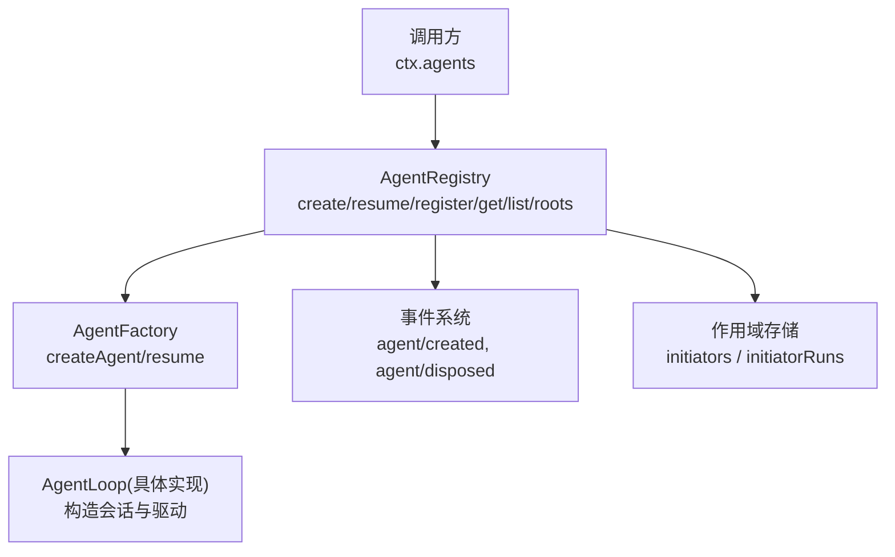
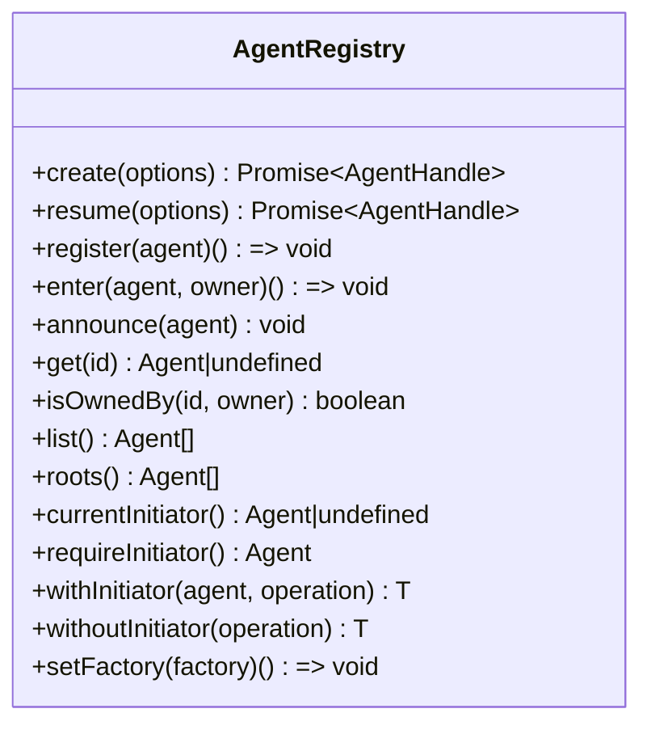
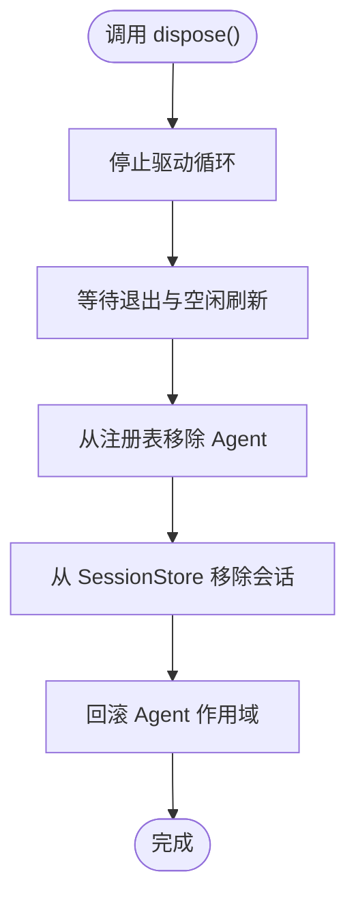
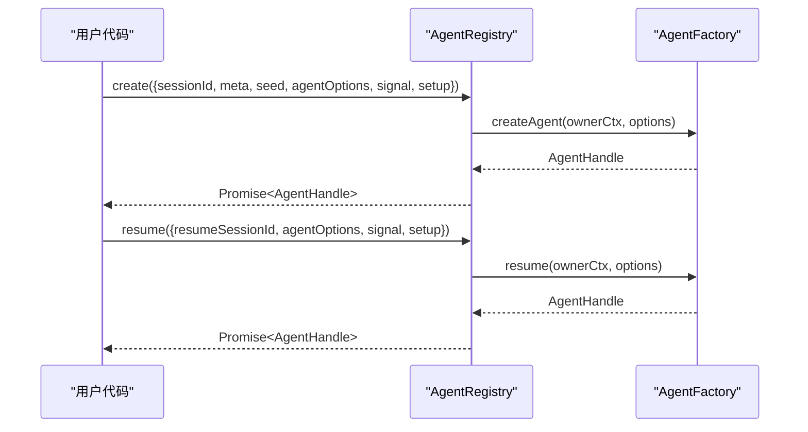
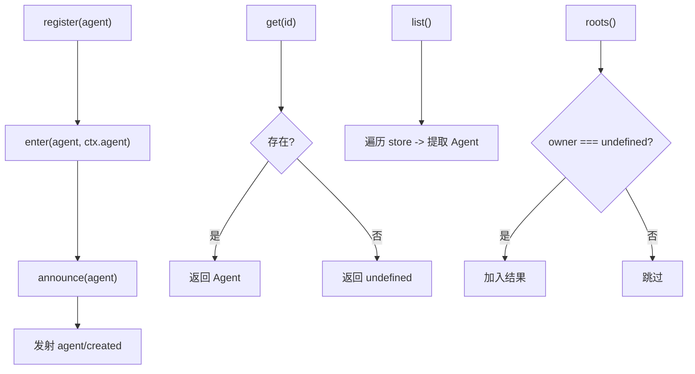
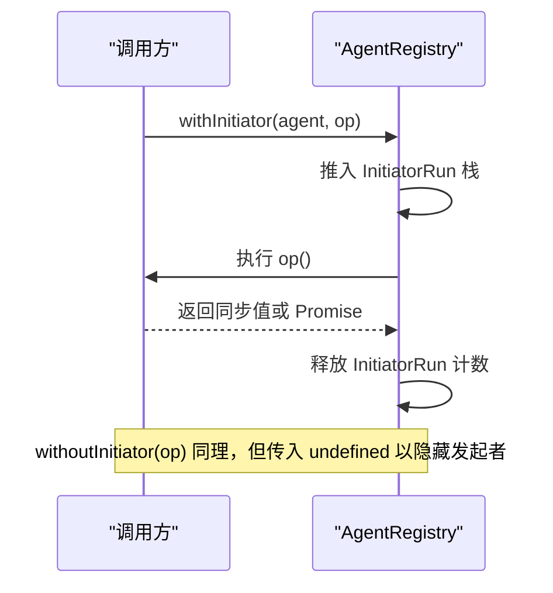
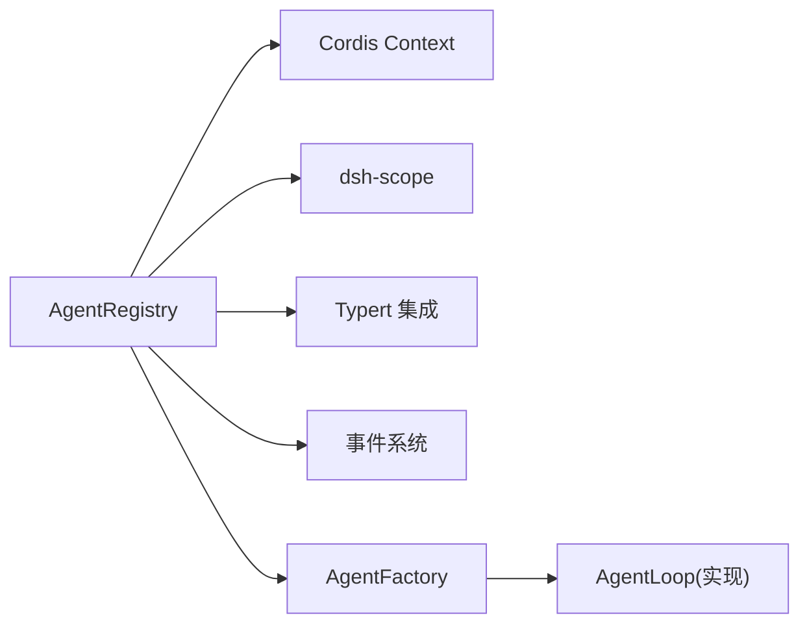

# Agent 管理 API

<cite>
**本文引用的文件**
- [packages/core/agent/src/index.ts](file://packages/core/agent/src/index.ts)
- [packages/core/agent/src/runtime-types.ts](file://packages/core/agent/src/runtime-types.ts)
- [packages/core/agent/src/types.ts](file://packages/core/agent/src/types.ts)
- [packages/core/agent/README.md](file://packages/core/agent/README.md)
- [docs/subsystems/core.md](file://docs/subsystems/core.md)
- [packages/core/agent/tests/agent.spec.ts](file://packages/core/agent/tests/agent.spec.ts)
- [packages/core/agent/tests/agent-initiator.spec.ts](file://packages/core/agent/tests/agent-initiator.spec.ts)
</cite>

## 目录
1. [简介](#简介)
2. [项目结构](#项目结构)
3. [核心组件](#核心组件)
4. [架构总览](#架构总览)
5. [详细组件分析](#详细组件分析)
6. [依赖关系分析](#依赖关系分析)
7. [性能与并发特性](#性能与并发特性)
8. [故障排查指南](#故障排查指南)
9. [结论](#结论)
10. [附录：类型定义速查](#附录类型定义速查)

## 简介
本文件面向使用 Agent 管理能力的开发者，聚焦 AgentRegistry 类的核心职责：Agent 的创建、注册、查找、生命周期管理与发起者作用域。文档覆盖 create()、resume()、register()、get()、list()、roots() 等关键方法，解释 AgentHandle.dispose() 的资源清理语义，说明 withInitiator() 与 withoutInitiator() 的作用域机制，并提供完整的 TypeScript 类型定义、错误处理策略、并发安全保证以及最佳实践示例路径。

## 项目结构
Agent 管理相关代码位于 packages/core/agent 包中，对外暴露 AgentRegistry 服务（ctx.agents），并通过 AgentFactory 将“创建/恢复”的具体实现解耦到 agent-loop 插件。类型定义与运行时事件契约在 runtime-types.ts 与 types.ts 中声明，测试用例覆盖注册表行为与作用域隔离。



图表来源
- [packages/core/agent/src/index.ts:256-430](file://packages/core/agent/src/index.ts#L256-L430)
- [packages/core/agent/src/index.ts:450-576](file://packages/core/agent/src/index.ts#L450-L576)
- [docs/subsystems/core.md:559-721](file://docs/subsystems/core.md#L559-L721)

章节来源
- [packages/core/agent/src/index.ts:256-430](file://packages/core/agent/src/index.ts#L256-L430)
- [packages/core/agent/README.md:9-45](file://packages/core/agent/README.md#L9-L45)

## 核心组件
- AgentRegistry：进程内 Agent 注册表与发起者作用域载体，提供创建、恢复、注册、查询、列举与根节点筛选能力。
- AgentFactory：由 agent-loop 插件实现的工厂接口，封装 createAgent/resume 的实际构建流程。
- AgentHandle：拥有 Agent 实例及其 dispose() 能力的句柄，作为消费侧能力对象控制资源释放。
- Agent：公开的运行期代理接口，包含状态、会话、消息通道、取消与空闲等待等能力。
- 作用域工具：withInitiator()/withoutInitiator() 用于在同一进程中为异步链路注入或屏蔽发起者 Agent。

章节来源
- [packages/core/agent/src/index.ts:158-214](file://packages/core/agent/src/index.ts#L158-L214)
- [packages/core/agent/src/runtime-types.ts:23-144](file://packages/core/agent/src/runtime-types.ts#L23-L144)
- [packages/core/agent/README.md:9-45](file://packages/core/agent/README.md#L9-L45)

## 架构总览
AgentRegistry 通过 setFactory() 绑定 AgentFactory，从而将“创建/恢复”逻辑委托给 agent-loop 插件。create() 与 resume() 会重追踪调用上下文，确保所有权归属调用方 fiber；内部使用 enter()/announce() 完成有序的生命周期发布，并保证并发同 ID 创建的互斥。注册表维护一个 Map 存储每个 Agent 的条目，支持 get()/list()/roots() 等查询。同时，AgentRegistry 维护基于 AsyncLocalStorage 的发起者作用域链，支持 currentInitiator()/requireInitiator()/withInitiator()/withoutInitiator()。

```mermaid
sequenceDiagram
participant Caller as "调用方"
participant Reg as "AgentRegistry"
participant Fac as "AgentFactory"
participant Loop as "AgentLoop(实现)"
participant Store as "注册表Map"
participant Events as "事件系统"
Caller->>Reg : create(options)
Reg->>Fac : createAgent(ownerCtx, options)
Fac->>Loop : 构造会话与Agent
Loop-->>Fac : AgentHandle
Fac->>Reg : enter(agent, owner)
Reg->>Store : 插入条目(未公告)
Fac->>Reg : announce(agent)
Reg->>Events : 发射 agent/created
Fac-->>Caller : Promise<AgentHandle>
Caller->>Reg : register(alreadyConstructed)
Reg->>Store : 插入条目
Reg->>Events : 发射 agent/created
```

图表来源
- [packages/core/agent/src/index.ts:405-430](file://packages/core/agent/src/index.ts#L405-L430)
- [packages/core/agent/src/index.ts:450-576](file://packages/core/agent/src/index.ts#L450-L576)
- [docs/subsystems/core.md:611-643](file://docs/subsystems/core.md#L611-L643)

## 详细组件分析

### AgentRegistry 类
- 职责：维护 live Agent 集合、代理创建/恢复、管理进程内发起者作用域、发射 agent/* 事件。
- 关键方法：
  - create(options): 通过已注册的工厂创建新 Agent 与 Session，执行可选 setup，进入并发布后返回 AgentHandle。
  - resume(options): 加载持久化 Session 并恢复 Agent，同样执行可选 setup 并发布。
  - register(agent): 记录已构造的 Agent，立即公告并返回 effect 作用域的 disposer。
  - enter(agent, owner): 高级有序生命周期原语，先插入不公告，再配合 announce() 完成发布。
  - announce(agent): 仅对已通过 enter() 插入的 Agent 公告一次，发射 agent/created。
  - get(id)/list()/roots(): 查询单个、全部或顶层 Agent。
  - isOwnedBy(id, owner): 判断某 Agent 是否由指定父 Agent 的作用域创建。
  - withInitiator()/withoutInitiator(): 设置或清除进程内发起者作用域边界。
  - setFactory(factory): 绑定创建工厂，仅允许一次注册，卸载时清空。



图表来源
- [packages/core/agent/src/index.ts:256-707](file://packages/core/agent/src/index.ts#L256-L707)

章节来源
- [packages/core/agent/src/index.ts:256-707](file://packages/core/agent/src/index.ts#L256-L707)
- [packages/core/agent/README.md:9-45](file://packages/core/agent/README.md#L9-L45)
- [docs/subsystems/core.md:559-721](file://docs/subsystems/core.md#L559-L721)

### AgentHandle 接口与资源清理
- 语义：持有 Agent 实例与 dispose() 能力。dispose() 停止循环、等待退出、注销 Agent、移除 Session、回滚作用域。
- 所有权：消费者持有的 handle 是能力对象；仅持有裸 Agent 无法销毁它。结构性所有者包括调用方 fiber 与工厂提供者。
- 最佳实践：始终保存 create/resume 返回的 handle，并在不再需要时调用 dispose()；或使用框架 effect 自动回收。



图表来源
- [packages/core/agent/src/index.ts:158-175](file://packages/core/agent/src/index.ts#L158-L175)
- [packages/core/agent/README.md:41-45](file://packages/core/agent/README.md#L41-L45)

章节来源
- [packages/core/agent/src/index.ts:158-175](file://packages/core/agent/src/index.ts#L158-L175)
- [packages/core/agent/README.md:41-45](file://packages/core/agent/README.md#L41-L45)

### 创建与恢复流程
- create(options):
  - 参数：sessionId、meta、seed、agentOptions、signal、setup。
  - 行为：委托工厂创建会话与 Agent，执行 setup（可返回 commit），进入注册表并发布，启动驱动，返回 handle。
  - 并发：同一 sessionId 并发创建不被支持，仅一个能进入；其余回滚私有范围与会话。
- resume(options):
  - 参数：resumeSessionId、agentOptions、signal、setup。
  - 行为：加载持久化会话，建立新的 unpublished scope，执行 setup，发布并启动驱动，返回 handle。
- 工厂要求：未注册工厂时 create/resume 抛出错误。



图表来源
- [packages/core/agent/src/index.ts:405-430](file://packages/core/agent/src/index.ts#L405-L430)
- [docs/subsystems/core.md:625-643](file://docs/subsystems/core.md#L625-L643)

章节来源
- [packages/core/agent/src/index.ts:73-156](file://packages/core/agent/src/index.ts#L73-L156)
- [packages/core/agent/src/index.ts:405-430](file://packages/core/agent/src/index.ts#L405-L430)
- [docs/subsystems/core.md:625-643](file://docs/subsystems/core.md#L625-L643)

### 注册与查询
- register(agent): 记录已构造的 Agent，立即公告，返回 effect 作用域的 disposer。
- get(id): 按 id 获取当前活着的 Agent，不存在返回 undefined。
- list(): 返回所有活着的 Agent（注册顺序）。
- roots(): 返回顶层 Agent（无 owning agent 上下文）。
- isOwnedBy(id, owner): 判断某个 Agent 是否由指定父 Agent 的作用域创建。



图表来源
- [packages/core/agent/src/index.ts:450-517](file://packages/core/agent/src/index.ts#L450-L517)
- [packages/core/agent/src/index.ts:578-617](file://packages/core/agent/src/index.ts#L578-L617)

章节来源
- [packages/core/agent/src/index.ts:450-617](file://packages/core/agent/src/index.ts#L450-L617)
- [packages/core/agent/tests/agent.spec.ts:178-219](file://packages/core/agent/tests/agent.spec.ts#L178-L219)

### 作用域管理：withInitiator() 与 withoutInitiator()
- currentInitiator(): 读取当前继承的发起者 Agent，若无则返回 undefined。
- requireInitiator(): 必须存在发起者，否则抛错。
- withInitiator(agent, operation): 以指定 Agent 为发起者运行操作，保持返回值类型与值。
- withoutInitiator(operation): 隐藏继承的发起者，适用于后台任务、定时器、导出器等不应继承首 Agent 的场景。
- 作用域清理：关闭阶段拒绝新边界，等待返回 Promise 边界结束，然后禁用底层存储；嵌套卸载不会等待自身边界。



图表来源
- [packages/core/agent/src/index.ts:300-358](file://packages/core/agent/src/index.ts#L300-L358)
- [packages/core/agent/src/index.ts:619-703](file://packages/core/agent/src/index.ts#L619-L703)
- [packages/core/agent/tests/agent-initiator.spec.ts:100-163](file://packages/core/agent/tests/agent-initiator.spec.ts#L100-L163)

章节来源
- [packages/core/agent/src/index.ts:300-358](file://packages/core/agent/src/index.ts#L300-L358)
- [packages/core/agent/src/index.ts:619-703](file://packages/core/agent/src/index.ts#L619-L703)
- [packages/core/agent/tests/agent-initiator.spec.ts:100-163](file://packages/core/agent/tests/agent-initiator.spec.ts#L100-L163)

### 错误处理策略
- 未注册工厂：create/resume 抛出“no agent factory registered”。
- 重复注册：register/enter 对相同 id 抛错。
- 身份不一致：enter 校验 agent.id 与 session.id 一致，否则抛错。
- 重复公告：announce 对已公告或正在公告的 Agent 抛错。
- 作用域不可用：在 disposed 状态下访问发起者作用域抛错。
- 监听器异常：agent/created 与 agent/disposed 的监听器异常被捕获并记录日志，不影响主流程。

章节来源
- [packages/core/agent/src/index.ts:216-219](file://packages/core/agent/src/index.ts#L216-L219)
- [packages/core/agent/src/index.ts:474-576](file://packages/core/agent/src/index.ts#L474-L576)
- [packages/core/agent/src/index.ts:683-685](file://packages/core/agent/src/index.ts#L683-L685)
- [packages/core/agent/tests/agent.spec.ts:190-231](file://packages/core/agent/tests/agent.spec.ts#L190-L231)

### 并发安全保证
- 同 ID 并发创建不支持：多个操作可同时准备，但仅一个能进入注册表；失败方回滚其私有范围与会话。
- 有序发布：enter() 插入后 announce() 才公告，避免观察者看到部分配置。
- 作用域隔离：withInitiator() 使用 AsyncLocalStorage 维护每调用链的发起者，并发互不干扰。
- 幂等与防重入：announce 标记 announcing/announced，防止重复公告；detach 检查 entry 身份，避免陈旧能力删除后续替换。

章节来源
- [packages/core/agent/src/index.ts:474-576](file://packages/core/agent/src/index.ts#L474-L576)
- [packages/core/agent/src/index.ts:619-703](file://packages/core/agent/src/index.ts#L619-L703)
- [packages/core/agent/README.md:41-45](file://packages/core/agent/README.md#L41-L45)

## 依赖关系分析
- AgentRegistry 依赖 Cordis Context、Scope、Typert 集成与 AsyncLocalStorage。
- 通过 AgentFactory 抽象出具体驱动实现，降低耦合。
- 事件系统用于生命周期通知与扩展点拦截。
- 类型系统通过 runtime-types.ts 与 types.ts 声明 Agent、AgentOptions、InboxTarget、事件映射等。



图表来源
- [packages/core/agent/src/index.ts:8-23](file://packages/core/agent/src/index.ts#L8-L23)
- [packages/core/agent/src/index.ts:256-298](file://packages/core/agent/src/index.ts#L256-L298)
- [packages/core/agent/src/runtime-types.ts:8-15](file://packages/core/agent/src/runtime-types.ts#L8-L15)

章节来源
- [packages/core/agent/src/index.ts:8-23](file://packages/core/agent/src/index.ts#L8-L23)
- [packages/core/agent/src/runtime-types.ts:8-15](file://packages/core/agent/src/runtime-types.ts#L8-L15)

## 性能与并发特性
- 注册表查询 O(1) 平均复杂度（Map），列举 O(n)。
- 作用域切换为本地存储压栈/出栈，开销低。
- 并发创建限制在同 ID 上，减少竞争；失败快速回滚。
- 事件分发采用批量与模式（emit/waterfall/serial）控制成本与顺序。

[本节为通用指导，无需特定文件引用]

## 故障排查指南
- “no agent factory registered”：确认已调用 setFactory() 并正确安装 agent-loop 插件。
- “already registered”：检查是否存在重复 sessionId 或重复 register/enter。
- “agent id does not match session id”：确保 agent.id 与 agent.session.id 一致。
- “already announced”：避免对同一 Agent 多次 announce。
- “no initiating agent is active”：在 requireInitiator() 前确保处于 withInitiator() 作用域。
- 监听器异常：查看日志中的 rejected/thrown 提示，定位具体监听器。

章节来源
- [packages/core/agent/src/index.ts:216-219](file://packages/core/agent/src/index.ts#L216-L219)
- [packages/core/agent/src/index.ts:474-576](file://packages/core/agent/src/index.ts#L474-L576)
- [packages/core/agent/tests/agent.spec.ts:190-231](file://packages/core/agent/tests/agent.spec.ts#L190-L231)

## 结论
AgentRegistry 提供了稳定、可扩展且并发安全的 Agent 管理能力。通过工厂抽象、有序发布与作用域隔离，既满足复杂生命周期需求，又保持清晰的错误处理与资源清理策略。建议在生产环境中严格遵循 create/resume 返回的 AgentHandle 进行资源管理，并使用 withInitiator()/withoutInitiator() 明确进程内因果归属。

[本节为总结性内容，无需特定文件引用]

## 附录：类型定义速查
- AgentOptions：provider、model、maxTokens。
- CreateAgentOptions：sessionId、meta、seed、agentOptions、signal、setup。
- ResumeAgentOptions：resumeSessionId、agentOptions、signal、setup。
- AgentHandle：agent、dispose()。
- Agent：id、options、session、inbox、status、ctx、cancel()、whenIdle()、runMaintenance()、send()、followup()、steer()、inject()。
- InboxTarget：'next-turn' | 'next-step'。
- 事件映射：agent/created、agent/disposed、agent/status、agent/inbox/*、agent/session-start、agent/pre-step、agent/request、agent/request-error、agent/turn-stopping、agent/error。

章节来源
- [packages/core/agent/src/runtime-types.ts:23-144](file://packages/core/agent/src/runtime-types.ts#L23-L144)
- [packages/core/agent/src/types.ts:9-27](file://packages/core/agent/src/types.ts#L9-L27)
- [packages/core/agent/src/index.ts:73-175](file://packages/core/agent/src/index.ts#L73-L175)