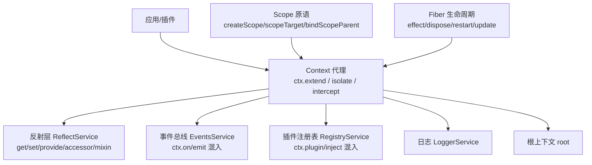
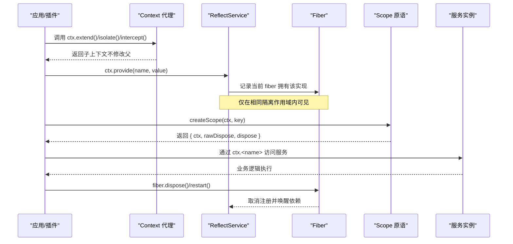
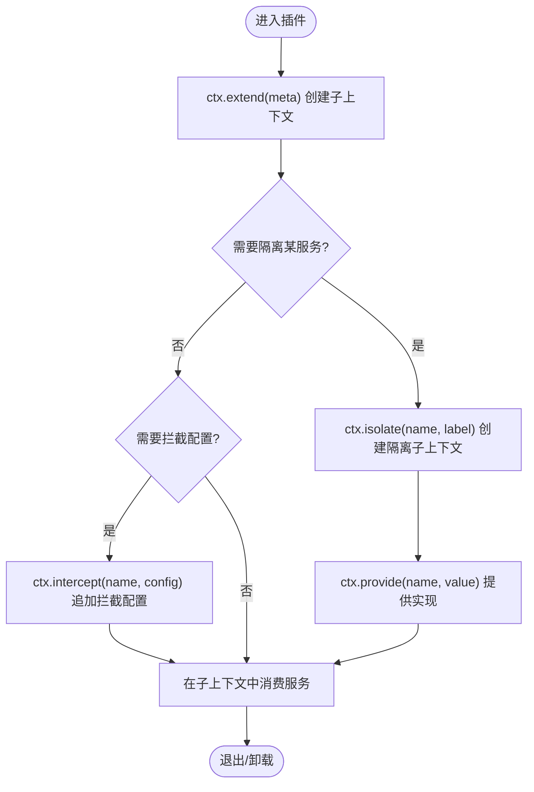
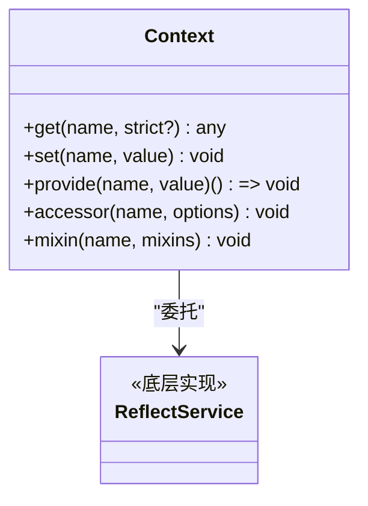
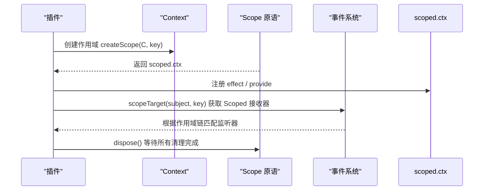
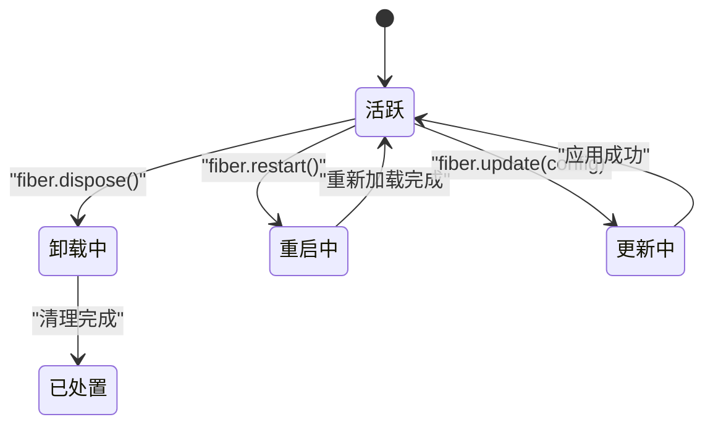

# Context API

<cite>
**本文引用的文件**
- [上下文文档（英文）](file://docs/cordis-api/context.md)
- [上下文文档（中文）](file://docs/cordis-api/context.zh.md)
- [作用域注册文档（英文）](file://docs/subsystems/scope.md)
- [作用域注册文档（中文）](file://docs/subsystems/scope.zh.md)
- [Fiber 文档（英文）](file://docs/cordis-api/fiber.md)
- [服务文档（英文）](file://docs/cordis-api/service.md)
- [作用域原语实现](file://packages/core/scope/src/index.ts)
- [插件改名说明（英文）](file://docs/rescope.md)
- [插件改名说明（中文）](file://docs/rescope.zh.md)
</cite>

## 目录
1. [简介](#简介)
2. [项目结构](#项目结构)
3. [核心组件](#核心组件)
4. [架构总览](#架构总览)
5. [详细组件分析](#详细组件分析)
6. [依赖关系分析](#依赖关系分析)
7. [性能考量](#性能考量)
8. [故障排查指南](#故障排查指南)
9. [结论](#结论)
10. [附录](#附录)

## 简介
本文件系统化文档化 Context API，覆盖上下文的创建、传递与访问；作用域（Scope）的概念与使用模式；上下文继承、隔离与合并机制；配置与最佳实践；完整的 TypeScript 类型定义与使用示例；上下文生命周期与内存管理；以及如何在不同组件间安全地共享状态与数据。

Context 是 Cordis 的核心对象：所有服务、事件和生命周期 API 都通过 ctx 访问。上下文是一个代理：普通属性读取通过服务解析器进行，而 extend()、isolate() 与 intercept() 会创建有作用域的子上下文，且不修改父上下文。

**章节来源**
- [上下文文档（英文）:1-12](file://docs/cordis-api/context.md#L1-L12)
- [上下文文档（中文）:4-14](file://docs/cordis-api/context.zh.md#L4-L14)

## 项目结构
- 文档层：docs/cordis-api/* 提供 Context、Service、Fiber 等 API 的权威说明；docs/subsystems/scope.* 描述作用域注册的原语与语义。
- 实现层：packages/core/scope/src/index.ts 提供 createScope、scopeTarget、bindScopeParent 等能力，配合 Cordis 的 Context/Fiber/Service 完成“可见性 + 生命周期所有权”的统一抽象。
- 发布层：vendor/cordis 以 @deepseek-ai/cordis 发布，导入路径需遵循改名映射。



**图表来源**
- [上下文文档（英文）:14-163](file://docs/cordis-api/context.md#L14-L163)
- [作用域原语实现:1-205](file://packages/core/scope/src/index.ts#L1-L205)
- [Fiber 文档（英文）:8-111](file://docs/cordis-api/fiber.md#L8-L111)

**章节来源**
- [插件改名说明（英文）:7-21](file://docs/rescope.md#L7-L21)
- [插件改名说明（中文）:7-21](file://docs/rescope.zh.md#L7-L21)

## 核心组件
- Context 代理与元数据扩展
  - ctx.extend(meta?)：在当前作用域之上创建子上下文，meta 自有属性遮蔽继承属性，不修改父上下文。
  - ctx.isolate(name, label?)：为指定服务 name 创建独立的作用域标签，可在子上下文内提供不同实现而不影响父作用域；相同 label 可加入同一作用域。
  - ctx.intercept(name, config)：为在此上下文之下启动的插件添加服务专属拦截配置，按祖先优先顺序合并。
- 服务存储与混入
  - ctx.get(name, strict?)：无需注入即可读取服务，strict=true 时仅返回提供方 fiber 当前活动的实现。
  - ctx.set(name, value)：覆盖已提供服务的值，仅允许提供方 fiber 设置。
  - ctx.provide(name, value)：注册由当前 fiber 拥有的服务实现；fiber 卸载或 disposer 运行后取消注册并唤醒依赖方。
  - ctx.accessor(name, options)：定义计算型上下文属性（get/set 钩子），随 fiber 卸载移除。
  - ctx.mixin(name, mixins)：将服务成员直接暴露到 ctx，方法自动绑定到源服务，随 fiber 卸载移除。
- 静态成员与品牌
  - Context.effect/filter/isolate/intercept 等 symbol 键用于内部机制。
  - Context.is(value)：跨 realm 与多副本识别上下文代理/原型。

**章节来源**
- [上下文文档（英文）:14-163](file://docs/cordis-api/context.md#L14-L163)
- [上下文文档（中文）:16-164](file://docs/cordis-api/context.zh.md#L16-L164)

## 架构总览
下图展示 Context 在插件加载、服务提供与作用域路由中的协作关系。



**图表来源**
- [上下文文档（英文）:14-163](file://docs/cordis-api/context.md#L14-L163)
- [作用域原语实现:129-147](file://packages/core/scope/src/index.ts#L129-L147)
- [Fiber 文档（英文）:102-111](file://docs/cordis-api/fiber.md#L102-L111)

## 详细组件分析

### 上下文创建与作用域控制
- 继承与元数据叠加
  - 使用 ctx.extend(meta) 创建子上下文，meta 自有属性遮蔽继承属性，适合携带请求级、会话级元数据。
- 服务隔离
  - 使用 ctx.isolate(name, label?) 为特定服务建立独立作用域，支持同 label 的多上下文加入同一作用域，便于测试替换或多租户隔离。
- 配置拦截
  - 使用 ctx.intercept(name, config) 为下游插件注入服务配置片段，按祖先优先合并，避免全局污染。



**图表来源**
- [上下文文档（英文）:14-96](file://docs/cordis-api/context.md#L14-L96)
- [上下文文档（中文）:16-98](file://docs/cordis-api/context.zh.md#L16-L98)

**章节来源**
- [上下文文档（英文）:14-96](file://docs/cordis-api/context.md#L14-L96)
- [上下文文档（中文）:16-98](file://docs/cordis-api/context.zh.md#L16-L98)

### 服务提供、访问与混入
- 提供与覆盖
  - ctx.provide(name, value) 注册由当前 fiber 拥有的服务实现；ctx.set(name, value) 仅允许提供方覆盖。
- 读取策略
  - ctx.get(name, strict?) 非注入式读取；strict=true 时要求提供方 fiber 处于活动状态。
- 动态属性与便捷访问
  - ctx.accessor(name, options) 定义 get/set 钩子；ctx.mixin(name, mixins) 将服务成员直接暴露到 ctx。



**图表来源**
- [上下文文档（英文）:237-365](file://docs/cordis-api/context.md#L237-L365)
- [上下文文档（中文）:237-367](file://docs/cordis-api/context.zh.md#L237-L367)

**章节来源**
- [上下文文档（英文）:237-365](file://docs/cordis-api/context.md#L237-L365)
- [上下文文档（中文）:237-367](file://docs/cordis-api/context.zh.md#L237-L367)

### 作用域（Scope）概念与使用模式
- 身份与载体
  - ScopeKey 是不透明标识；Scoped<T> 是编译期品牌标记的事件接收器载体。
- 拥有所有权的注册上下文
  - createScope(ctx, key, options) 返回 { ctx, rawDispose, dispose }，ctx 用于在该作用域内进行注册，dispose 提供幂等的停稳边界。
- 作用域链与事件路由
  - bindScopeParent(key, parent) 建立父子作用域关系；scopeTarget(base, key) 构建带过滤的路由载体，使祖先监听器能收到后代作用域的事件。



**图表来源**
- [作用域原语实现:129-185](file://packages/core/scope/src/index.ts#L129-L185)
- [作用域注册文档（英文）:29-57](file://docs/subsystems/scope.md#L29-L57)
- [作用域注册文档（中文）:29-57](file://docs/subsystems/scope.zh.md#L29-L57)

**章节来源**
- [作用域原语实现:1-205](file://packages/core/scope/src/index.ts#L1-L205)
- [作用域注册文档（英文）:1-60](file://docs/subsystems/scope.md#L1-L60)
- [作用域注册文档（中文）:1-60](file://docs/subsystems/scope.zh.md#L1-L60)

### 上下文生命周期与内存管理
- Fiber 生命周期
  - ctx.fiber 指向当前插件运行时实例；effect() 注册的清理函数在 fiber 卸载或显式调用 disposer 时按逆序执行。
  - fiber.dispose() 卸载插件并等待清理完成；fiber.restart() 立即用当前配置重启；fiber.update(config) 验证并应用新配置后重启。
- 作用域停稳
  - Scope.dispose() 保证所有作用域内注册的清理完成；rawDispose 保留精确 disposer 身份以便有序复合 effect 嵌套。
- 内存与可见性
  - 服务实现仅在相同隔离作用域内可见；fiber 卸载后取消注册并唤醒依赖方，避免悬挂引用。



**图表来源**
- [Fiber 文档（英文）:8-111](file://docs/cordis-api/fiber.md#L8-L111)
- [作用域原语实现:114-147](file://packages/core/scope/src/index.ts#L114-L147)

**章节来源**
- [Fiber 文档（英文）:8-111](file://docs/cordis-api/fiber.md#L8-L111)
- [作用域原语实现:114-147](file://packages/core/scope/src/index.ts#L114-L147)

### TypeScript 类型定义与使用示例
- 关键类型
  - Context：上下文代理，提供 get/set/provide/accessor/mixin 等方法，以及 extend/isolate/intercept。
  - Service：服务基类，通过 static symbols 暴露 init/check/config/invoke/extend/tracker/resolveConfig。
  - Scope：{ ctx, rawDispose, dispose }，用于作用域注册与停稳。
  - Scoped<T>：编译期品牌标记的事件接收器载体。
  - ScopeKey：不透明标识。
- 使用示例（路径指引）
  - 创建作用域与事件路由：[作用域原语实现:129-185](file://packages/core/scope/src/index.ts#L129-L185)
  - 在服务中声明拦截配置类型：[服务文档（英文）:49-103](file://docs/cordis-api/service.md#L49-L103)
  - 在插件中注册 effect 并管理清理：[Fiber 文档（英文）:8-36](file://docs/cordis-api/fiber.md#L8-L36)

**章节来源**
- [作用域原语实现:1-205](file://packages/core/scope/src/index.ts#L1-L205)
- [服务文档（英文）:14-103](file://docs/cordis-api/service.md#L14-L103)
- [Fiber 文档（英文）:8-36](file://docs/cordis-api/fiber.md#L8-L36)

### 在不同组件间安全地共享状态和数据
- 通过 ctx.provide 在 fiber 作用域内提供状态，确保仅在相同隔离作用域内可见。
- 使用 ctx.isolate 为敏感或可替换的服务建立隔离作用域，避免相互干扰。
- 使用 ctx.intercept 注入局部配置，避免全局污染。
- 使用 Scope 将一组相关注册与清理绑定到同一生命周期，通过 dispose 统一停稳。

**章节来源**
- [上下文文档（英文）:14-96](file://docs/cordis-api/context.md#L14-L96)
- [作用域原语实现:129-185](file://packages/core/scope/src/index.ts#L129-L185)

## 依赖关系分析
- Context 依赖 ReflectService 实现服务存取与元数据管理。
- Context 混入 EventsService 与 RegistryService，提供 on/emit、plugin/inject 等便捷 API。
- Scope 原语基于 Context 与 Fiber，封装“可见性 + 生命周期所有权”。
- 发布命名通过 rescope 映射到 @deepseek-ai/cordis，导入时需使用重命名后的包名。

```mermaid
graph LR
Ctx["Context"] --> Ref["ReflectService"]
Ctx --> Ev["EventsService"]
Ctx --> Reg["RegistryService"]
Scope["Scope 原语"] --> Ctx
Scope --> Fib["Fiber"]
Import["模块导入"] --> |@deepseek-ai/cordis| Ctx
```

**图表来源**
- [上下文文档（英文）:120-163](file://docs/cordis-api/context.md#L120-L163)
- [插件改名说明（英文）:7-21](file://docs/rescope.md#L7-L21)

**章节来源**
- [上下文文档（英文）:120-163](file://docs/cordis-api/context.md#L120-L163)
- [插件改名说明（英文）:7-21](file://docs/rescope.md#L7-L21)

## 性能考量
- 作用域查找与事件路由
  - scopeTarget 的过滤器沿作用域链向上匹配，应避免过深的嵌套层级，减少遍历开销。
- 服务解析
  - ctx.get(strict=true) 会校验提供方 fiber 活动状态，频繁读取建议缓存结果或在更高层聚合。
- 清理与停稳
  - 大量异步清理可能延长 fiber 卸载时间，尽量将长耗时清理放入后台任务并在 dispose 中 await 完成点。

[本节为通用指导，不直接分析具体文件]

## 故障排查指南
- INACTIVE_EFFECT
  - 在已处置的 fiber 上注册 effect 会抛出此错误。检查是否在 fiber 卸载后仍尝试注册或访问。
- 重复提供同名服务
  - 在同一作用域重复 provide 同名服务会抛错。确认是否误用 isolate 或未正确划分作用域。
- 作用域循环
  - bindScopeParent 会拒绝形成环的父子关系。检查作用域链是否正确构建。
- 配置验证失败
  - fiber.update 或插件启动时的配置校验失败会抛出 ValidationError。核对 schema 与传入配置。

**章节来源**
- [Fiber 文档（英文）:331-355](file://docs/cordis-api/fiber.md#L331-L355)
- [作用域原语实现:53-82](file://packages/core/scope/src/index.ts#L53-L82)

## 结论
Context API 提供了强大的上下文代理能力，结合 extend/isolate/intercept 可实现细粒度的作用域控制与配置隔离；配合 Scope 原语可将“可见性”与“生命周期所有权”统一起来，确保资源安全释放与事件路由的正确性。在实践中，应合理划分作用域、谨慎使用严格模式读取、并通过 fiber 的生命周期管理清理流程，以获得稳定且高性能的系统行为。

[本节为总结，不直接分析具体文件]

## 附录
- 导入路径变更
  - 从 'cordis' 改为 '@deepseek-ai/cordis'，详见改名映射。
- 参考路径
  - 上下文 API：[上下文文档（英文）:1-365](file://docs/cordis-api/context.md#L1-L365)
  - 作用域原语：[作用域原语实现:1-205](file://packages/core/scope/src/index.ts#L1-L205)
  - Fiber 生命周期：[Fiber 文档（英文）:8-376](file://docs/cordis-api/fiber.md#L8-L376)
  - 服务基类：[服务文档（英文）:1-103](file://docs/cordis-api/service.md#L1-L103)

**章节来源**
- [插件改名说明（英文）:33-41](file://docs/rescope.md#L33-L41)
- [插件改名说明（中文）:33-41](file://docs/rescope.zh.md#L33-L41)