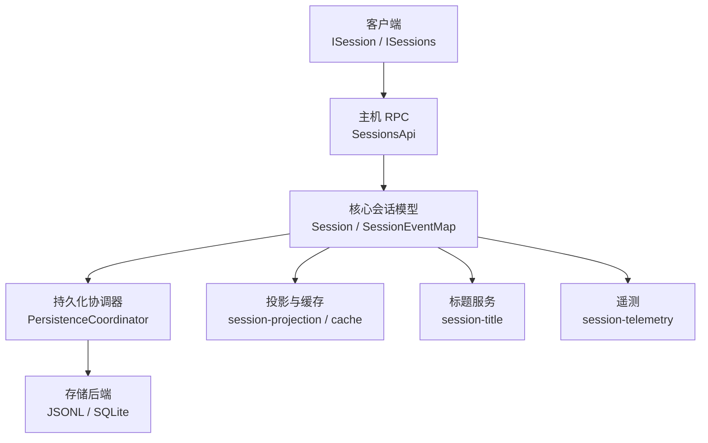
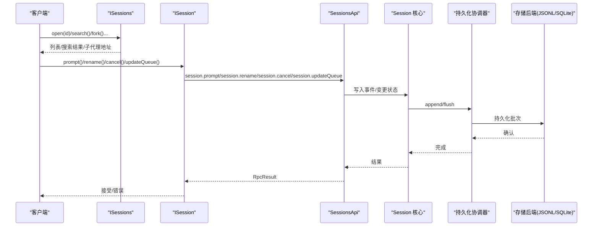
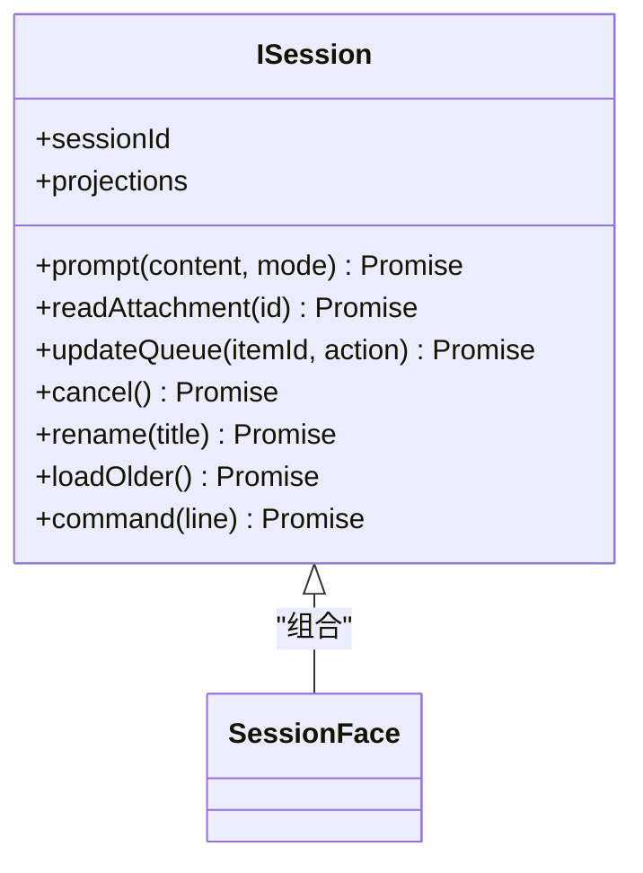
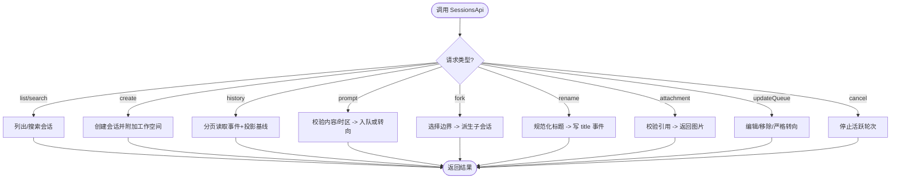
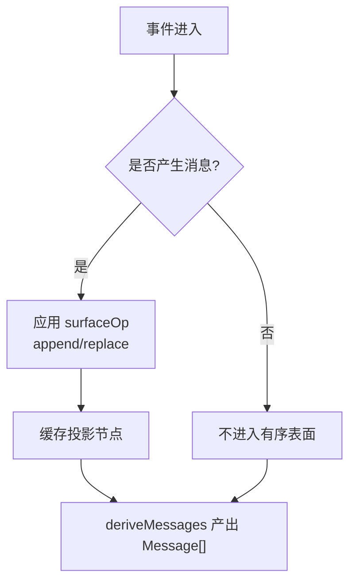
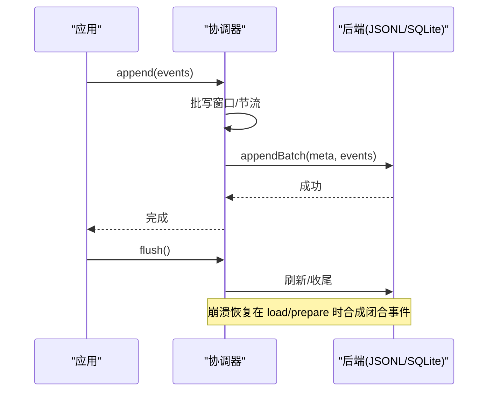
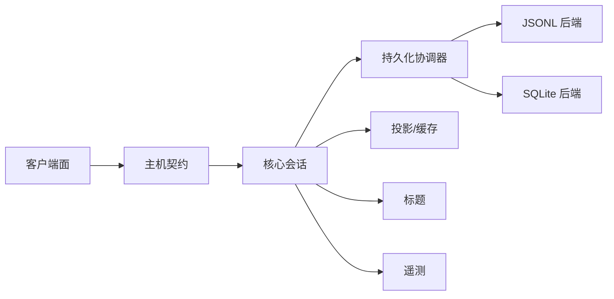

# 会话 API

<cite>
**本文引用的文件**
- [packages/client/runtime/src/client/contract/session.ts](file://packages/client/runtime/src/client/contract/session.ts)
- [packages/client/runtime/src/client/contract/sessions.ts](file://packages/client/runtime/src/client/contract/sessions.ts)
- [packages/host/apiproxy/src/api/sessions.ts](file://packages/host/apiproxy/src/api/sessions.ts)
- [docs/subsystems/session.md](file://docs/subsystems/session.md)
- [docs/subsystems/session-query.md](file://docs/subsystems/session-query.md)
- [packages/session/README.md](file://packages/session/README.md)
- [packages/session/session-persistence/README.md](file://packages/session/session-persistence/README.md)
- [packages/session/session-checkpoint-policy/README.md](file://packages/session/session-checkpoint-policy/README.md)
- [packages/session/session-persistence-jsonl/README.md](file://packages/session/session-persistence-jsonl/README.md)
</cite>

## 目录
1. [简介](#简介)
2. [项目结构](#项目结构)
3. [核心组件](#核心组件)
4. [架构总览](#架构总览)
5. [详细组件分析](#详细组件分析)
6. [依赖关系分析](#依赖关系分析)
7. [性能考虑](#性能考虑)
8. [故障排查指南](#故障排查指南)
9. [结论](#结论)
10. [附录](#附录)

## 简介
本文件系统化文档化 Session API，覆盖会话的创建、查询与管理接口；详细说明 ISession/SessionFace 的方法签名、参数类型与返回值；阐述会话状态管理、事件记录与持久化机制；解释会话分片、压缩与恢复能力；提供会话配置选项与性能优化建议；给出完整的 TypeScript 类型定义与使用示例；并说明会话生命周期与错误处理策略，展示如何正确使用会话进行消息存储与检索。

## 项目结构
会话子系统由“客户端对外面”、“主机 RPC 契约”、“核心事件模型”、“持久化与投影”等层次组成：
- 客户端对外面：ISession/SessionFace（行为动词 + 可观察快照）与 ISessions（会话服务）。
- 主机 RPC 契约：SessionsApi（list/create/history/prompt/fork/rename/cancel/updateQueue/attachment/models/selectModel/search）。
- 核心事件模型：SessionEventMap、SurfaceOp、SessionSurface、deriveMessages 等。
- 持久化与投影：session-persistence（抽象服务）、JSONL/SQLite 后端、checkpoint policy、projection/cache/title/telemetry。

图表来源
- [packages/client/runtime/src/client/contract/session.ts:1-90](file://packages/client/runtime/src/client/contract/session.ts#L1-L90)
- [packages/client/runtime/src/client/contract/sessions.ts:1-131](file://packages/client/runtime/src/client/contract/sessions.ts#L1-L131)
- [packages/host/apiproxy/src/api/sessions.ts:231-374](file://packages/host/apiproxy/src/api/sessions.ts#L231-L374)
- [docs/subsystems/session.md:9-127](file://docs/subsystems/session.md#L9-L127)
- [packages/session/session-persistence/README.md:9-44](file://packages/session/session-persistence/README.md#L9-L44)

章节来源
- [packages/client/runtime/src/client/contract/session.ts:1-90](file://packages/client/runtime/src/client/contract/session.ts#L1-L90)
- [packages/client/runtime/src/client/contract/sessions.ts:1-131](file://packages/client/runtime/src/client/contract/sessions.ts#L1-L131)
- [packages/host/apiproxy/src/api/sessions.ts:231-374](file://packages/host/apiproxy/src/api/sessions.ts#L231-L374)
- [docs/subsystems/session.md:9-127](file://docs/subsystems/session.md#L9-L127)
- [packages/session/README.md:7-52](file://packages/session/README.md#L7-L52)

## 核心组件
- ISession（会话行为面）
  - sessionId：会话标识
  - projections：按 key 暴露的可观察投影值
  - prompt(content, mode)：发送提示，mode 为 queue 或 steer
  - readAttachment(attachmentId)：读取已引用图片数据
  - updateQueue(itemId, action)：编辑/移除/严格转向待处理队列项
  - cancel()：取消当前轮次
  - rename(title)：重命名会话
  - loadOlder()：加载更早历史
  - command(line)：执行斜杠命令
- SessionFace = ISession & ObservableSnapshot<ConversationSnapshot>
- ISessions（会话服务）
  - list/currentProvideInfo/searchResultLimit/open/openSubagent/subagentAddress/setSubagentCatalogOpen/refreshSubagents/noteAgentPreset/clear/search/fork/provide/scope/scopeOf/sessionOf/binding

章节来源
- [packages/client/runtime/src/client/contract/session.ts:18-90](file://packages/client/runtime/src/client/contract/session.ts#L18-L90)
- [packages/client/runtime/src/client/contract/sessions.ts:25-131](file://packages/client/runtime/src/client/contract/sessions.ts#L25-L131)

## 架构总览
下图展示了从客户端到主机、再到核心会话与持久化的调用链路与数据流。

图表来源
- [packages/client/runtime/src/client/contract/session.ts:30-82](file://packages/client/runtime/src/client/contract/session.ts#L30-L82)
- [packages/host/apiproxy/src/api/sessions.ts:231-374](file://packages/host/apiproxy/src/api/sessions.ts#L231-L374)
- [packages/session/session-persistence/README.md:9-44](file://packages/session/session-persistence/README.md#L9-L44)

## 详细组件分析

### 客户端会话面：ISession 与 SessionFace
- 方法语义
  - prompt：将内容以 queue 追加或 steer 中断模式提交；返回接受或业务错误
  - readAttachment：通过会话日志中的 attachmentId 获取图片引用与字节
  - updateQueue：对仍在队列中的条目执行 edit/remove/steer
  - cancel：终止当前运行轮次，保留待处理工作
  - rename：持久化用户标题，阻止自动再生成
  - loadOlder：向后扩展历史窗口
  - command：在当前会话中执行斜杠命令
- 可观察快照：SessionFace 同时承载 ConversationSnapshot 的可观察快照，供渲染层订阅

图表来源
- [packages/client/runtime/src/client/contract/session.ts:18-90](file://packages/client/runtime/src/client/contract/session.ts#L18-L90)

章节来源
- [packages/client/runtime/src/client/contract/session.ts:18-90](file://packages/client/runtime/src/client/contract/session.ts#L18-L90)

### 会话服务：ISessions
- 列表与选择：list、open、clear
- 子代理：openSubagent、subagentAddress、setSubagentCatalogOpen、refreshSubagents
- 搜索：search(query, signal)
- 派生：fork({ sessionId, atSeq?, increaseTitle? })
- 扩展：provide(descriptor)、scope/scopeOf/sessionOf/binding
- 元信息：currentProvideInfo、searchResultLimit、noteAgentPreset

章节来源
- [packages/client/runtime/src/client/contract/sessions.ts:25-131](file://packages/client/runtime/src/client/contract/sessions.ts#L25-L131)

### 主机 RPC 契约：SessionsApi
- 列表与搜索：list、search
- 创建与会话操作：create、history、models、selectModel、rename、prompt、attachment、updateQueue、cancel、fork
- 关键约束
  - history 分页对齐消息边界，尾部页携带进行中部分与可选投影基线
  - prompt 支持文本与临时图片，浏览器会附带时区
  - fork 基于已完成的前缀切分，继承 cwd、模型目标与 lineage
  - rename 生成 user 源 title 事件，空标题拒绝

图表来源
- [packages/host/apiproxy/src/api/sessions.ts:231-374](file://packages/host/apiproxy/src/api/sessions.ts#L231-L374)

章节来源
- [packages/host/apiproxy/src/api/sessions.ts:231-374](file://packages/host/apiproxy/src/api/sessions.ts#L231-L374)

### 核心事件模型与消息推导
- 事件词汇：turn/start/end、step/start/end、user/message、assistant/chunk、assistant/message、tool/call/result、todo/write、request/header/context、session/end-seed
- 表面操作：append 与 replace（用于压缩替换）
- 消息推导：deriveMessages/deriveEventMessage，跳过 chunk，仅保留最终消息与工具结果
- 首活序列：firstLiveSeq 与 session/end-seed 标记种子与实时写入边界

图表来源
- [docs/subsystems/session.md:9-127](file://docs/subsystems/session.md#L9-L127)
- [docs/subsystems/session.md:251-357](file://docs/subsystems/session.md#L251-L357)
- [docs/subsystems/session.md:359-519](file://docs/subsystems/session.md#L359-L519)

章节来源
- [docs/subsystems/session.md:9-127](file://docs/subsystems/session.md#L9-L127)
- [docs/subsystems/session.md:251-357](file://docs/subsystems/session.md#L251-L357)
- [docs/subsystems/session.md:359-519](file://docs/subsystems/session.md#L359-L519)

### 持久化、分片、压缩与恢复
- 抽象服务：ctx.sessionPersistence（create/append/load/inspect/readFrom/list/listSnapshots/locate/readRaw）
- 协调器：PersistenceCoordinator 负责批写、冷恢复、修订号、惰性物化、会话采用与优雅关闭
- JSONL 后端：root、packChunks、compression、preparedSessionCacheSize、writeBatchMaxDelayMs
- SQLite 后端：seek 能力、事务与索引
- 检查点策略：在模型请求前、顶级工具执行前、每步 pre-step 边界做语义检查点
- 恢复策略：崩溃后合成 tool/result/step/end/turn/end 闭合，保持日志平衡与可重放

图表来源
- [packages/session/session-persistence/README.md:9-44](file://packages/session/session-persistence/README.md#L9-L44)
- [packages/session/session-persistence-jsonl/README.md:70-78](file://packages/session/session-persistence-jsonl/README.md#L70-L78)
- [packages/session/session-checkpoint-policy/README.md:1-46](file://packages/session/session-checkpoint-policy/README.md#L1-L46)

章节来源
- [packages/session/session-persistence/README.md:9-44](file://packages/session/session-persistence/README.md#L9-L44)
- [packages/session/session-persistence-jsonl/README.md:70-78](file://packages/session/session-persistence-jsonl/README.md#L70-L78)
- [packages/session/session-checkpoint-policy/README.md:1-46](file://packages/session/session-checkpoint-policy/README.md#L1-L46)

### 查询与检索
- 逻辑记录：SessionRecord、SessionEventRecord、SessionLogSnapshot、SessionSurfaceSnapshot
- 过滤器：会话级与事件级 AND/OR 组合，text 为语义文本字面量扫描
- 全文检索：跨会话 searchSessions、单会话 searchEvents，游标分页
- 血缘与追踪：traceSession、traceEvent
- 窗口读取：readEvent(seq, before, after)

章节来源
- [docs/subsystems/session-query.md:9-141](file://docs/subsystems/session-query.md#L9-L141)
- [docs/subsystems/session-query.md:143-218](file://docs/subsystems/session-query.md#L143-L218)
- [docs/subsystems/session-query.md:220-331](file://docs/subsystems/session-query.md#L220-L331)
- [docs/subsystems/session-query.md:259-331](file://docs/subsystems/session-query.md#L259-L331)

### 会话配置选项与性能优化建议
- JSONL 后端配置
  - root：根目录
  - packChunks：是否打包块
  - compression：压缩策略（none/zstd 等）
  - preparedSessionCacheSize：准备态会话缓存大小
  - writeBatchMaxDelayMs：批写最大延迟
- 性能建议
  - 合理设置 writeBatchMaxDelayMs 以平衡吞吐与延迟
  - 启用压缩减少 I/O，但注意不可直接行读
  - 使用 preparedSessionCacheSize 降低冷启动开销
  - 利用 seek 能力后端（SQLite）进行 readFrom 高效增量读取
  - 避免频繁小批量 append，合并为批次提升吞吐
  - 投影缓存减少重复计算

章节来源
- [packages/session/session-persistence-jsonl/README.md:70-78](file://packages/session/session-persistence-jsonl/README.md#L70-L78)
- [packages/session/session-persistence/README.md:9-44](file://packages/session/session-persistence/README.md#L9-L44)

### TypeScript 类型定义与使用示例
- 类型定义位置
  - 客户端面：ISession、SessionFace、ISessions
  - 主机契约：SessionsApi、PromptContentPart、QueueAction、HistoryEntry、SessionProjectionsBlock、SessionSummary、SessionSearchItem、SessionModels 等
  - 核心事件：SessionEventMap、SurfaceOp、SessionSurface、TurnEndReasonMap 等
  - 查询：SessionRecord、SessionEventRecord、SessionSearchRequest、SessionEventSearchRequest、SessionSearchPage、SessionLineageTrace 等
- 使用示例（路径指引）
  - 创建会话：参考主机 create 方法与客户端 open/fork
  - 发送消息：参考 ISession.prompt 与 SessionsApi.prompt
  - 读取历史：参考 SessionsApi.history 与 deriveMessages
  - 附件读取：参考 ISession.readAttachment 与 SessionsApi.attachment
  - 队列操作：参考 ISession.updateQueue 与 QueueAction
  - 取消与重命名：参考 ISession.cancel/rename
  - 查询与搜索：参考 ISessions.search 与 ctx.sessionQuery.*

章节来源
- [packages/client/runtime/src/client/contract/session.ts:18-90](file://packages/client/runtime/src/client/contract/session.ts#L18-L90)
- [packages/client/runtime/src/client/contract/sessions.ts:25-131](file://packages/client/runtime/src/client/contract/sessions.ts#L25-L131)
- [packages/host/apiproxy/src/api/sessions.ts:86-374](file://packages/host/apiproxy/src/api/sessions.ts#L86-L374)
- [docs/subsystems/session.md:9-127](file://docs/subsystems/session.md#L9-L127)
- [docs/subsystems/session-query.md:9-141](file://docs/subsystems/session-query.md#L9-L141)

## 依赖关系分析
- 客户端面依赖主机 RPC 契约，通过 ISessions 暴露统一入口
- 主机契约映射到核心会话模型的事件与表面操作
- 持久化协调器解耦后端实现，JSONL/SQLite 共享一致的生命周期与恢复语义
- 投影、标题、遥测作为横切能力挂载于会话之上

图表来源
- [packages/client/runtime/src/client/contract/session.ts:18-90](file://packages/client/runtime/src/client/contract/session.ts#L18-L90)
- [packages/host/apiproxy/src/api/sessions.ts:231-374](file://packages/host/apiproxy/src/api/sessions.ts#L231-L374)
- [packages/session/session-persistence/README.md:9-44](file://packages/session/session-persistence/README.md#L9-L44)

章节来源
- [packages/client/runtime/src/client/contract/session.ts:18-90](file://packages/client/runtime/src/client/contract/session.ts#L18-L90)
- [packages/host/apiproxy/src/api/sessions.ts:231-374](file://packages/host/apiproxy/src/api/sessions.ts#L231-L374)
- [packages/session/session-persistence/README.md:9-44](file://packages/session/session-persistence/README.md#L9-L44)

## 性能考虑
- 批写与节流：writeBatchMaxDelayMs 控制批写窗口，避免过度同步阻塞
- 压缩与分片：packChunks/compression 降低 I/O 与磁盘占用，但需配合后端加载
- 缓存：preparedSessionCacheSize 加速冷启动与恢复
- 增量读取：readFrom 结合 seek 后端减少不必要解析
- 投影缓存：减少重复折叠成本
- 搜索：使用游标分页与过滤条件限制范围

[本节为通用指导，无需特定文件来源]

## 故障排查指南
- 常见错误分类
  - 会话查询错误：SESSION_QUERY_* 系列（无效配置/游标/过滤/限制/查询/血缘/表面/窗口/持久化失败/搜索禁用/会话不存在/陈旧游标/源冲突）
  - 持久化错误：格式不支持、损坏、非 JSON 可序列化数据
  - 运行时错误：agent-busy（子代理繁忙）、command-error/unknown-command（命令错误）
- 定位步骤
  - 检查 SessionsApi 返回码与 RpcResult
  - 查看持久化协调器日志与后端异常
  - 验证事件连续性 seq 与 surfaceOp 合法性
  - 使用 traceEvent/readEvent 获取上下文窗口
  - 通过 listSnapshots 检查存储拓扑与版本

章节来源
- [docs/subsystems/session-query.md:333-357](file://docs/subsystems/session-query.md#L333-L357)
- [packages/session/session-persistence/README.md:25-44](file://packages/session/session-persistence/README.md#L25-L44)
- [packages/host/apiproxy/src/api/sessions.ts:231-374](file://packages/host/apiproxy/src/api/sessions.ts#L231-L374)

## 结论
Session API 以事件溯源为核心，通过清晰的客户端面与主机契约，结合健壮的持久化、投影与查询能力，提供了高可靠、可扩展的会话管理能力。借助检查点策略与恢复机制，系统在崩溃场景下仍能保持一致性与可重放性。合理配置后端与批写策略，可显著提升吞吐与响应时间。

[本节为总结性内容，无需特定文件来源]

## 附录
- 术语
  - 会话：事件溯源的有界对话上下文
  - 表面：有序的消息视图，受 surfaceOp 控制
  - 投影：从日志派生的当前状态
  - 检查点：语义边界上的持久化屏障
- 参考路径
  - 客户端面：packages/client/runtime/src/client/contract/session.ts
  - 会话服务：packages/client/runtime/src/client/contract/sessions.ts
  - 主机契约：packages/host/apiproxy/src/api/sessions.ts
  - 核心事件：docs/subsystems/session.md
  - 查询能力：docs/subsystems/session-query.md
  - 持久化：packages/session/session-persistence/README.md
  - JSONL 后端：packages/session/session-persistence-jsonl/README.md
  - 检查点策略：packages/session/session-checkpoint-policy/README.md

[本节为补充信息，无需特定文件来源]