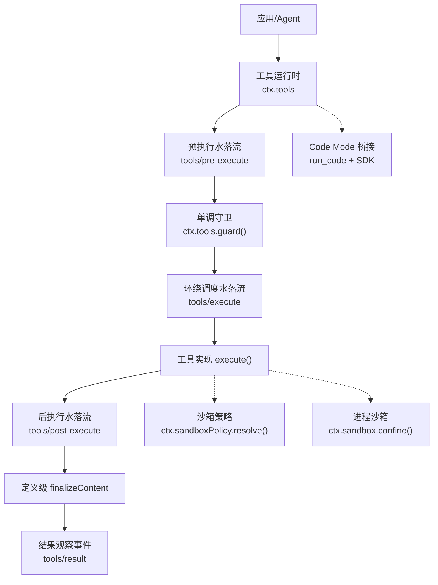
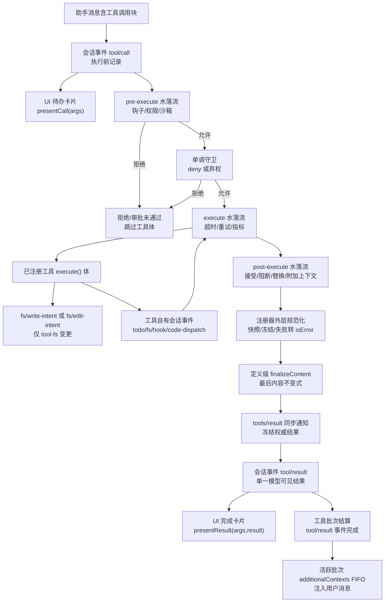
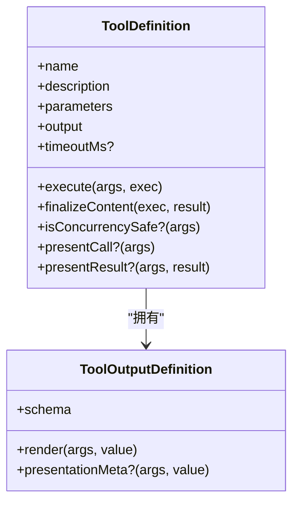
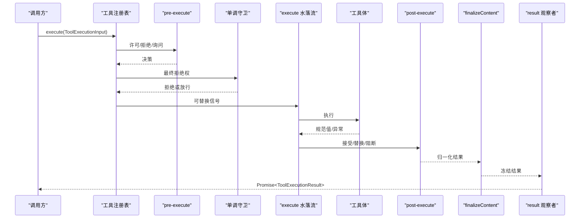
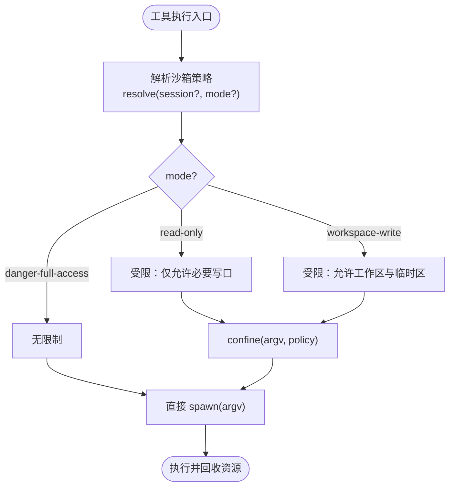
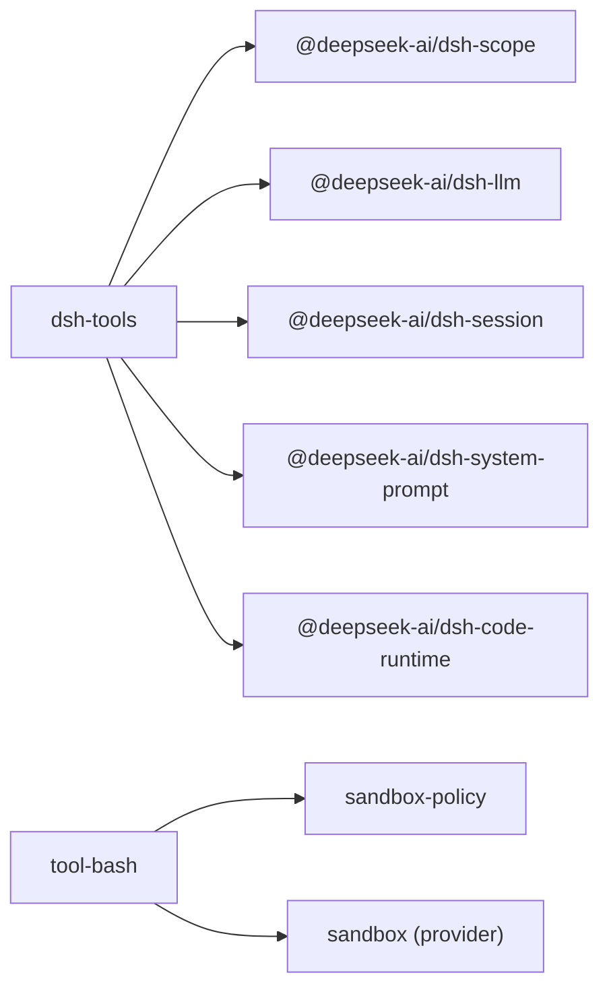

# 工具 API

<cite>
**本文引用的文件**
- [packages/core/tools/src/index.ts](file://packages/core/tools/src/index.ts)
- [packages/core/tools/src/schema.ts](file://packages/core/tools/src/schema.ts)
- [packages/core/tools/README.md](file://packages/core/tools/README.md)
- [docs/subsystems/tools.md](file://docs/subsystems/tools.md)
- [docs/tool-catalog.md](file://docs/tool-catalog.md)
- [docs/tool-execution-pipeline.md](file://docs/tool-execution-pipeline.md)
- [docs/cookbook/adding-a-tool.md](file://docs/cookbook/adding-a-tool.md)
- [docs/subsystems/sandbox.md](file://docs/subsystems/sandbox.md)
- [packages/shell/tool-bash/src/index.ts](file://packages/shell/tool-bash/src/index.ts)
- [packages/sandbox/sandbox-policy/src/index.ts](file://packages/sandbox/sandbox-policy/src/index.ts)
- [packages/core/tools/src/types.ts](file://packages/core/tools/src/types.ts)
</cite>

## 目录
1. [简介](#简介)
2. [项目结构](#项目结构)
3. [核心组件](#核心组件)
4. [架构总览](#架构总览)
5. [详细组件分析](#详细组件分析)
6. [依赖关系分析](#依赖关系分析)
7. [性能与并发](#性能与并发)
8. [故障排查指南](#故障排查指南)
9. [结论](#结论)
10. [附录：类型定义与使用示例](#附录类型定义与使用示例)

## 简介
本文件系统化文档化 Tool API，覆盖工具的注册、调用、执行流水线、参数与返回类型、权限控制、沙箱执行、错误处理、发现加载缓存策略、生命周期与资源管理，以及自定义工具开发与集成现有工具的实践。内容基于仓库中工具子系统源码与官方文档生成，确保准确可追溯。

## 项目结构
工具系统以 packages/core/tools 为核心，提供工具注册表、执行流水线、类型化 Schema DSL、UI 呈现词汇以及与 Code Mode 的桥接；shell 工具（bash/pwsh）通过 ctx.sandboxPolicy 与 ctx.sandbox 接入进程级沙箱；文档位于 docs 下，包含子系统说明、执行流水线图、工具目录与作者指南。

图表来源
- [packages/core/tools/src/index.ts:137-200](file://packages/core/tools/src/index.ts#L137-L200)
- [docs/tool-execution-pipeline.md:8-58](file://docs/tool-execution-pipeline.md#L8-L58)
- [packages/shell/tool-bash/src/index.ts:190-200](file://packages/shell/tool-bash/src/index.ts#L190-L200)
- [packages/sandbox/sandbox-policy/src/index.ts:135-142](file://packages/sandbox/sandbox-policy/src/index.ts#L135-L142)

章节来源
- [packages/core/tools/README.md:7-39](file://packages/core/tools/README.md#L7-L39)
- [docs/subsystems/tools.md:9-151](file://docs/subsystems/tools.md#L9-L151)

## 核心组件
- 工具定义与注册
  - ToolDefinition：包含模型可见的 ToolSchema、强制的输出契约 output、execute 执行函数、可选 finalizeContent、timeoutMs、isConcurrencySafe、presentCall/presentResult。
  - defineTool：统一参数与输出 Schema DSL，自动校验参数、推断返回类型、编译为 JSON Schema。
- 执行流水线
  - tools/pre-execute：允许/拒绝/询问（ask→approval）。
  - 单调守卫：ctx.tools.guard()，最终不可逆拒绝。
  - tools/execute：超时、重试、指标等环绕调度。
  - tools/post-execute：接受/替换/阻断/附加上下文。
  - finalizeContent：定义级最后的内容不变式。
  - tools/result：只读观察冻结的最终结果。
- 模式与可见性
  - presentAs：按 Agent 选择 native/code/both 展示。
  - restrict：作用域内 allow/deny 过滤全局工具。
  - schemas/get：按作用域投影/查询可见工具。
- Code Mode
  - run_code 保留传输，生成语言 SDK（TypeScript/Python），子调用重入完整流水线并关联父执行。
- UI 呈现
  - presentCall/presentResult 返回中性 card 标签视图，供宿主渲染。

章节来源
- [docs/subsystems/tools.md:9-151](file://docs/subsystems/tools.md#L9-L151)
- [packages/core/tools/README.md:7-60](file://packages/core/tools/README.md#L7-L60)
- [packages/core/tools/src/index.ts:137-200](file://packages/core/tools/src/index.ts#L137-L200)

## 架构总览
工具执行从会话事件 tool/call 开始，经 UI 待办卡片、预执行策略、守卫、环绕调度、工具体、FS 意图门、自有事件、后执行策略、规范化、finalizeContent、结果事件，到 UI 完成卡片与批结算。

图表来源
- [docs/tool-execution-pipeline.md:8-58](file://docs/tool-execution-pipeline.md#L8-L58)

章节来源
- [docs/tool-execution-pipeline.md:1-63](file://docs/tool-execution-pipeline.md#L1-L63)

## 详细组件分析

### 工具定义与 Schema DSL
- 参数 Schema：ParameterSchemaSpec 为隐式开放对象根，属性标记 required 表示必填；支持 string/number/integer/boolean/null/array/object/json/oneOf。
- 输出 Schema：ValueSchemaSpec 支持任意 JSON 根；defineTool 将输出 schema 编译为受控原始 JSON Schema 子集。
- 类型推断：InferArgs/P InferValue 在 16 层容器深度内保持精确类型，超出回退 JsonValue。
- 校验：参数不匹配抛出 ToolArgsError（INVALID_ARGS）；输出无效抛出 ToolOutputError（INVALID_TOOL_OUTPUT）。

图表来源
- [docs/subsystems/tools.md:9-96](file://docs/subsystems/tools.md#L9-L96)
- [packages/core/tools/src/schema.ts:1-176](file://packages/core/tools/src/schema.ts#L1-L176)

章节来源
- [packages/core/tools/src/schema.ts:1-200](file://packages/core/tools/src/schema.ts#L1-L200)
- [docs/subsystems/tools.md:98-151](file://docs/subsystems/tools.md#L98-L151)

### 执行流水线与决策
- pre-execute：allow/deny/ask；缺少审批服务时 ask 降级为 deny。
- 单调守卫：返回字符串即拒绝，无法被后续监听器撤销。
- execute：可替换信号但不可移除；注册器在调用前重新融合原始 caller signal。
- post-execute：accept（替换 content 或 value）、block（转为 isError）、附加上下文。
- finalizeContent：对每个归一化结果恰好调用一次，仅能替换 content。
- result：只读观察冻结结果。

图表来源
- [packages/core/tools/src/index.ts:137-200](file://packages/core/tools/src/index.ts#L137-L200)
- [docs/subsystems/tools.md:170-404](file://docs/subsystems/tools.md#L170-L404)

章节来源
- [docs/subsystems/tools.md:170-404](file://docs/subsystems/tools.md#L170-L404)
- [packages/core/tools/README.md:33-60](file://packages/core/tools/README.md#L33-L60)

### 权限控制与作用域
- presentAs：按 Agent 切换 native/code/both 展示，不影响 schemas 集合。
- restrict：作用域内 allow/deny 过滤全局工具，多个限制相交；本地注册不受影响。
- get/schemas：按作用域解析可见工具与模型可见 Schema 列表。

章节来源
- [packages/core/tools/README.md:18-27](file://packages/core/tools/README.md#L18-L27)
- [docs/subsystems/tools.md:478-574](file://docs/subsystems/tools.md#L478-L574)

### 沙箱执行与文件系统边界
- 沙箱模式：read-only / workspace-write / danger-full-access；workspace-write 允许工作区与后端临时区写入。
- 每调用策略：SandboxPolicyService.resolve(session?, mode?) 决定 mode 与 workspaceRoot。
- 进程封装：ctx.sandbox.confine(argv, policy) 返回 ConfinedArgv（argv、enforcement、denialSignatures、runnerFailureRules）。
- bash/pwsh 工具：读取默认模式并通过 sandboxPolicy 解析每调用策略，必要时注入到执行规格。

图表来源
- [docs/subsystems/sandbox.md:9-94](file://docs/subsystems/sandbox.md#L9-L94)
- [packages/shell/tool-bash/src/index.ts:190-200](file://packages/shell/tool-bash/src/index.ts#L190-L200)
- [packages/sandbox/sandbox-policy/src/index.ts:135-142](file://packages/sandbox/sandbox-policy/src/index.ts#L135-L142)

章节来源
- [docs/subsystems/sandbox.md:9-157](file://docs/subsystems/sandbox.md#L9-L157)
- [packages/shell/tool-bash/src/index.ts:190-200](file://packages/shell/tool-bash/src/index.ts#L190-L200)

### 错误处理与取消
- 取消：exec.signal 必须被尊重；before dispatch 取消为 ABORTED_BEFORE_DISPATCH；after 成功结果可替换为 ABORTED。
- 结构化错误：ToolFailure.info 携带 name/code；未知工具映射 UNKNOWN_TOOL。
- 健壮性：注册器捕获 throw、序列化失败、渲染失败，统一为 isError 结果。

章节来源
- [packages/core/tools/src/index.ts:471-486](file://packages/core/tools/src/index.ts#L471-L486)
- [packages/core/tools/tests/tools.spec.ts:630-665](file://packages/core/tools/tests/tools.spec.ts#L630-L665)
- [packages/core/tools/README.md:33-39](file://packages/core/tools/README.md#L33-L39)

### 发现、加载与缓存策略
- 发现：插件通过 ctx.tools.register 声明；schemas(scope) 按作用域投影模型可见字段。
- 加载：effect-based 注册，fiber 销毁即注销；重复名称在同一层抛错。
- 缓存：schemas 与 SDK 文本确定性生成；KV Cache 前缀稳定，注册/限制变化会失效。

章节来源
- [packages/core/tools/README.md:18-27](file://packages/core/tools/README.md#L18-L27)
- [packages/core/tools/README.md:131-175](file://packages/core/tools/README.md#L131-L175)

### 生命周期与资源管理
- 工具体需遵守 quiescence：异步工作需在 cancel 时停止并清理。
- Code Mode 子调用：提交有序启动，并发安全调用可重叠至 maxParallelSubCalls；exclusive 调用形成屏障；运行结束时先中止再排空队列，确保所有 tool/code-dispatch 事件在 turn 内落地。
- 背景任务：通过 ctx.jobs.start 注册，返回句柄；cancel/done/readOutput 由生产者实现。

章节来源
- [packages/core/tools/README.md:116-129](file://packages/core/tools/README.md#L116-L129)
- [docs/cookbook/adding-a-tool.md:51-66](file://docs/cookbook/adding-a-tool.md#L51-L66)

### 自定义工具开发指南与最佳实践
- 最小形态：使用 defineTool 声明 name/description/parameters/output.execute；参数自动校验，返回值必须符合 output.schema。
- 规则：
  - 参数已校验，仍需业务约束检查。
  - 定义只读借用，不要修改回调或 schema。
  - 执行身份受保护，args 视为只读。
  - 返回规范 JSON 值，不在 body 返回内容块。
  - 抛错或非法返回走 isError 路径。
  - 尊重 exec.signal。
  - 使用 presentationMeta 持久化 UI 元数据。
  - 使用 exec.agent 做异步通知。
- UI 呈现：pure 的 presentCall/presentResult，避免副作用；遵循 card 词汇。

章节来源
- [docs/cookbook/adding-a-tool.md:7-95](file://docs/cookbook/adding-a-tool.md#L7-L95)
- [packages/core/tools/src/schema.ts:1-200](file://packages/core/tools/src/schema.ts#L1-L200)

### 集成现有工具
- 查看工具目录：docs/tool-catalog.md 列出 shipped 工具包与模型可见名、依赖、写入影响与备注。
- 典型集成：bash/pwsh 通过 ctx.shell 与 ctx.sandboxPolicy；fs 工具通过 ctx.fs；web/lsp/goal/skill 等通过对应 ctx.* 服务。

章节来源
- [docs/tool-catalog.md:12-41](file://docs/tool-catalog.md#L12-L41)

## 依赖关系分析
- 工具注册表依赖：
  - 类型与错误：@deepseek-ai/dsh-llm
  - 作用域：@deepseek-ai/dsh-scope
  - 会话快照：@deepseek-ai/dsh-session
  - 代码运行时：@deepseek-ai/dsh-code-runtime
  - 系统提示：@deepseek-ai/dsh-system-prompt
  - 用户审批：@deepseek-ai/dsh-user-approval（可选）
- 沙箱依赖：
  - 策略服务：sandbox-policy
  - 提供者：sandbox-local（bwrap/Landlock/Seatbelt/ACL）
  - 消费者：bash-sandbox/pwsh-sandbox

图表来源
- [packages/core/tools/src/index.ts:7-28](file://packages/core/tools/src/index.ts#L7-L28)
- [packages/shell/tool-bash/src/index.ts:190-200](file://packages/shell/tool-bash/src/index.ts#L190-L200)

章节来源
- [packages/core/tools/src/index.ts:1-28](file://packages/core/tools/src/index.ts#L1-L28)

## 性能与并发
- 并行执行：连续 parallel 调用进入有界滚动池；exclusive 调用作为顺序屏障。
- Code Mode 子调用：提交顺序启动，并发安全调用最多重叠至 maxParallelSubCalls（默认 10）；exclusive 独占并阻塞后续。
- 中间值：绑定调用中间值跨进程且无字节上限；仅 outer run_code 结果受 worker 配置限制。
- KV 缓存：前缀稳定，注册/限制变化会失效。

章节来源
- [packages/core/tools/README.md:127-130](file://packages/core/tools/README.md#L127-L130)
- [packages/core/tools/README.md:116-129](file://packages/core/tools/README.md#L116-L129)
- [packages/core/tools/README.md:131-175](file://packages/core/tools/README.md#L131-L175)

## 故障排查指南
- 未知工具：UNKNOWN_TOOL；检查工具是否注册、作用域是否可见、是否被 restrict 隐藏。
- 参数错误：INVALID_ARGS；核对 parameters 与传入 arguments。
- 输出错误：INVALID_TOOL_OUTPUT；核对 output.schema 与返回值。
- 沙箱拒绝：检查 sandboxPolicy.mode/workspaceRoot 与后端 enforcement；区分 runner failure 与 denial signature。
- 取消：确认 exec.signal 传播；before/after 取消码不同。
- Code Mode 失败：CodeRunFailedError；查看 captured logs 与子调用 tool/code-dispatch 事件。

章节来源
- [packages/core/tools/tests/tools.spec.ts:630-665](file://packages/core/tools/tests/tools.spec.ts#L630-L665)
- [docs/subsystems/sandbox.md:152-157](file://docs/subsystems/sandbox.md#L152-L157)
- [packages/core/tools/README.md:33-39](file://packages/core/tools/README.md#L33-L39)

## 结论
Tool API 提供了统一的工具定义、严格的参数与输出校验、可扩展的执行流水线、作用域化的权限控制、进程级沙箱保障、健壮的取消与错误处理，以及面向 UI 的中性呈现协议。借助 Code Mode 与 SDK 生成，工具可在原生与代码两种模式下无缝复用。遵循本文档的最佳实践，可高效构建可维护、可观测、可审计的工具生态。

## 附录：类型定义与使用示例

### TypeScript 类型要点（节选）
- ToolDefinition：name/description/parameters/output/execute/finalizeContent/timeoutMs/isConcurrencySafe/presentCall/presentResult。
- ToolExecutionInput：callId/name/arguments/signal/agent?/parent?。
- ToolExecution：readonly 扩展，含 token/rootCallId。
- ToolExecutionResult：success/failure 判别联合。
- 事件：tool/code-dispatch-start、tool/code-dispatch（Code Mode 子调用日志）。

章节来源
- [docs/subsystems/tools.md:170-368](file://docs/subsystems/tools.md#L170-L368)
- [packages/core/tools/src/types.ts:1-59](file://packages/core/tools/src/types.ts#L1-L59)

### 使用示例（路径引用）
- 最小工具实现与规则：[docs/cookbook/adding-a-tool.md:7-95](file://docs/cookbook/adding-a-tool.md#L7-L95)
- 工具注册与执行接口：[packages/core/tools/README.md:7-60](file://packages/core/tools/README.md#L7-L60)
- 执行流水线与事件：[docs/tool-execution-pipeline.md:8-58](file://docs/tool-execution-pipeline.md#L8-L58)
- 沙箱策略与 bash 集成：[packages/shell/tool-bash/src/index.ts:190-200](file://packages/shell/tool-bash/src/index.ts#L190-L200), [docs/subsystems/sandbox.md:9-94](file://docs/subsystems/sandbox.md#L9-L94)
- 工具目录与 shipped 工具：[docs/tool-catalog.md:12-41](file://docs/tool-catalog.md#L12-L41)