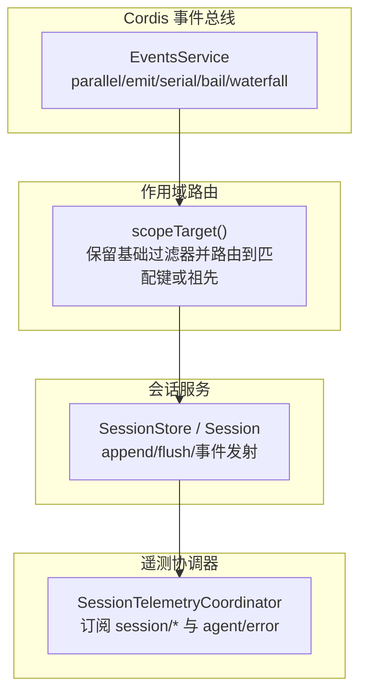
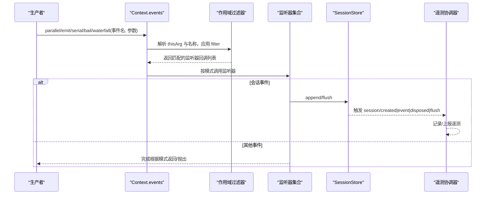
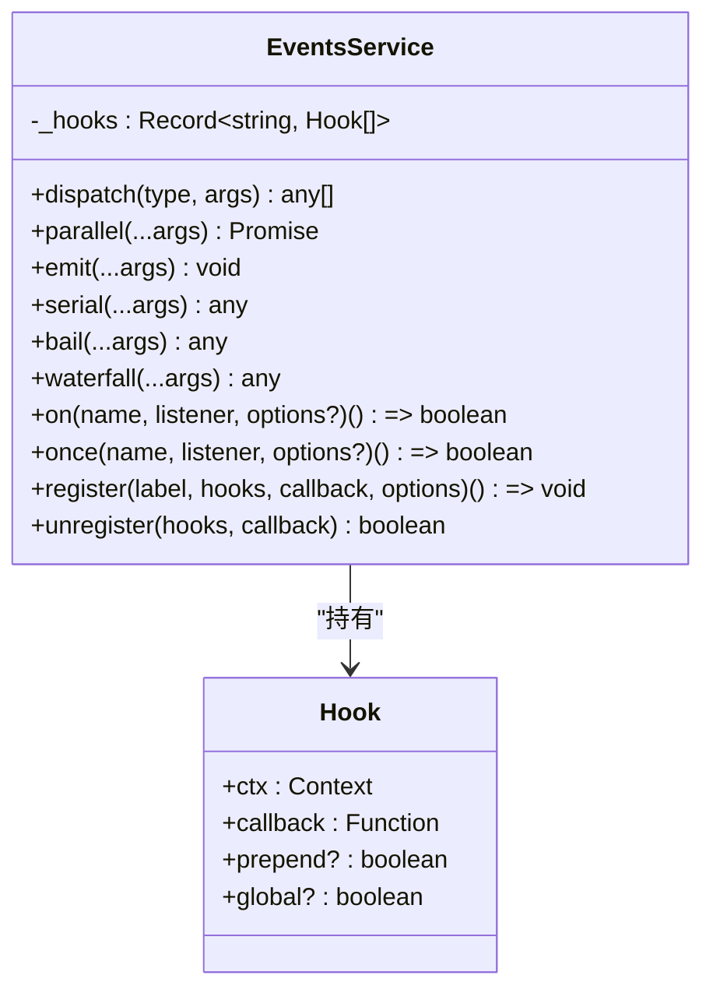
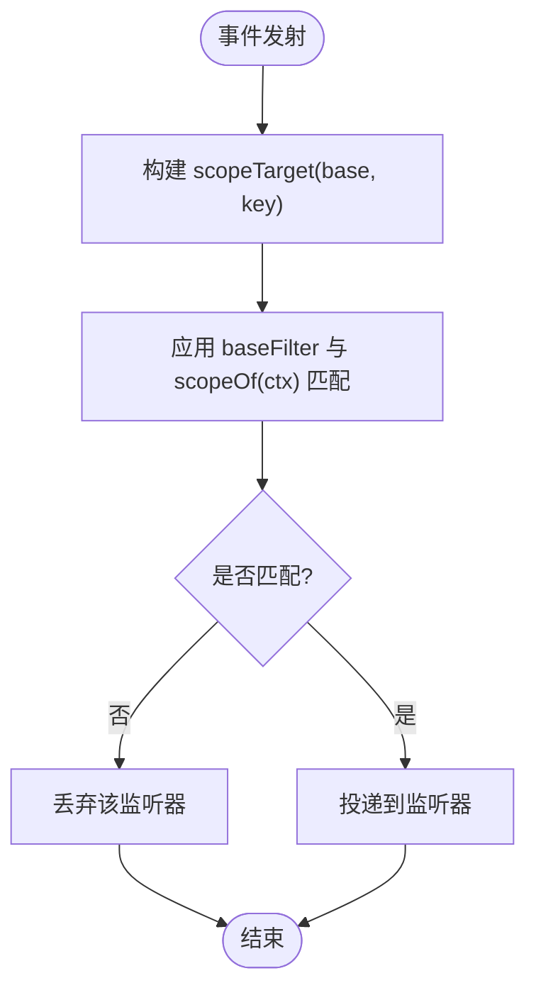
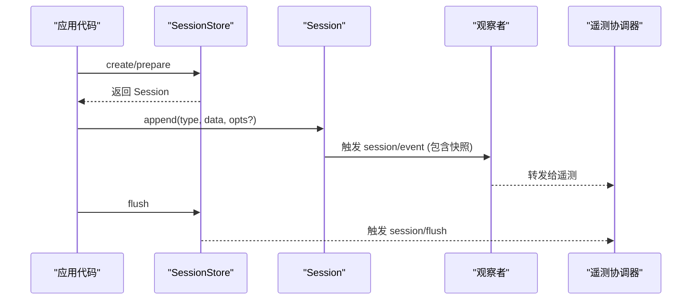
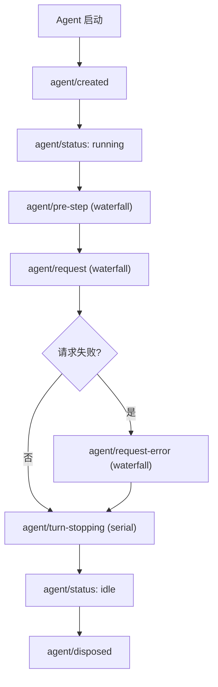
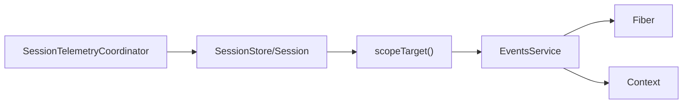

# 事件系统 API

<cite>
**本文引用的文件**
- [vendor/cordis/src/events.ts](file://vendor/cordis/src/events.ts)
- [docs/cordis-api/events.md](file://docs/cordis-api/events.md)
- [packages/core/agent/src/runtime-types.ts](file://packages/core/agent/src/runtime-types.ts)
- [packages/core/session/src/index.ts](file://packages/core/session/src/index.ts)
- [packages/core/scope/src/index.ts](file://packages/core/scope/src/index.ts)
- [docs/event-producer-consumer.md](file://docs/event-producer-consumer.md)
- [packages/session/session-telemetry/src/coordinator.ts](file://packages/session/session-telemetry/src/coordinator.ts)
- [packages/extensions/tool-cordis/src/api-catalog.ts](file://packages/extensions/tool-cordis/src/api-catalog.ts)
- [packages/settings/settings/tests/settings.spec.ts](file://packages/settings/settings/tests/settings.spec.ts)
- [packages/api/gateway/tests/gateway.client.spec.ts](file://packages/api/gateway/tests/gateway.client.spec.ts)
- [packages/storage/storage-domain/src/events.ts](file://packages/storage/storage-domain/src/events.ts)
</cite>

## 目录
1. [简介](#简介)
2. [项目结构](#项目结构)
3. [核心组件](#核心组件)
4. [架构总览](#架构总览)
5. [详细组件分析](#详细组件分析)
6. [依赖关系分析](#依赖关系分析)
7. [性能考量](#性能考量)
8. [故障排除指南](#故障排除指南)
9. [结论](#结论)
10. [附录：类型与示例](#附录类型与示例)

## 简介
本文件系统化说明 Harness 的事件系统 API，覆盖发布订阅模式、类型安全的事件定义、监听器注册与作用域隔离、事件过滤与优先级控制、错误处理与性能优化策略。文档同时梳理内置事件（如 agent/created、agent/disposed、session 相关事件等），并提供调试工具、监控指标与故障排除指引，帮助读者以 TypeScript 类型安全的方式设计和使用事件驱动架构，包括异步事件处理、错误边界与内存泄漏防护。

## 项目结构
事件系统由 Cordis 事件总线提供基础能力，各子系统通过扩展 Context.Events 接口声明类型安全的事件，并通过 ctx.on/once 注册监听器。作用域机制将事件路由到特定上下文（如 agent、session）的监听器，避免跨作用域的误触达。会话服务在事件落盘前进行严格校验与冻结，确保持久化数据一致性。遥测协调器订阅 session 生命周期事件，实现可观测性。

图表来源
- [vendor/cordis/src/events.ts:131-319](file://vendor/cordis/src/events.ts#L131-L319)
- [packages/core/scope/src/index.ts:158-185](file://packages/core/scope/src/index.ts#L158-L185)
- [packages/core/session/src/index.ts:37-86](file://packages/core/session/src/index.ts#L37-L86)
- [packages/session/session-telemetry/src/coordinator.ts:69-103](file://packages/session/session-telemetry/src/coordinator.ts#L69-L103)

章节来源
- [vendor/cordis/src/events.ts:131-319](file://vendor/cordis/src/events.ts#L131-L319)
- [packages/core/scope/src/index.ts:158-185](file://packages/core/scope/src/index.ts#L158-L185)
- [packages/core/session/src/index.ts:37-86](file://packages/core/session/src/index.ts#L37-L86)
- [packages/session/session-telemetry/src/coordinator.ts:69-103](file://packages/session/session-telemetry/src/coordinator.ts#L69-L103)

## 核心组件
- 事件分发模式：emit、parallel、serial、bail、waterfall，分别对应同步广播、并发等待、顺序直到提前返回、同步提前返回、链式 next 组合。
- 监听器注册：ctx.on(ctx.once) 将监听器绑定到当前 fiber，支持 prepend 与 global 选项；内部通过 internal/listener 钩子拦截注册行为。
- 作用域隔离：通过 scopeTarget 构建带过滤器的载体，使事件仅投递到相同作用域或其祖先作用域的监听器，未标记监听器保持全局可见。
- 会话事件：session/created、session/disposed、session/event、session/flush 等，配合严格的 append 校验与深冻结，保证持久化一致性与不可变性。
- 遥测集成：SessionTelemetryCoordinator 订阅 session 生命周期与 agent 错误事件，实现采集与上报。

章节来源
- [docs/cordis-api/events.md:8-187](file://docs/cordis-api/events.md#L8-L187)
- [vendor/cordis/src/events.ts:131-319](file://vendor/cordis/src/events.ts#L131-L319)
- [packages/core/scope/src/index.ts:158-185](file://packages/core/scope/src/index.ts#L158-L185)
- [packages/core/session/src/index.ts:37-86](file://packages/core/session/src/index.ts#L37-L86)
- [packages/session/session-telemetry/src/coordinator.ts:69-103](file://packages/session/session-telemetry/src/coordinator.ts#L69-L103)

## 架构总览
下图展示从事件发射到监听器执行、作用域过滤、会话持久化与遥测采集的整体流程。

图表来源
- [vendor/cordis/src/events.ts:165-243](file://vendor/cordis/src/events.ts#L165-L243)
- [packages/core/scope/src/index.ts:158-185](file://packages/core/scope/src/index.ts#L158-L185)
- [packages/core/session/src/index.ts:604-655](file://packages/core/session/src/index.ts#L604-L655)
- [packages/session/session-telemetry/src/coordinator.ts:69-103](file://packages/session/session-telemetry/src/coordinator.ts#L69-L103)

## 详细组件分析

### 事件总线 EventsService
- 职责：维护监听器表 _hooks，提供多种分发模式；通过 internal/update 注入更新链路；internal/listener 允许拦截注册；internal/dispatch 暴露诊断点。
- 关键方法：
  - dispatch：提取 thisArg 与事件名，应用 filter，返回绑定的回调列表。
  - parallel/emit/serial/bail/waterfall：不同调度语义。
  - on/once：注册监听器到当前 fiber effect，自动随 fiber 释放。
  - register/unregister：管理 Hook 数组与移除。
- 类型安全：通过扩展 Context.Events 接口约束事件名与签名。

图表来源
- [vendor/cordis/src/events.ts:119-319](file://vendor/cordis/src/events.ts#L119-L319)

章节来源
- [vendor/cordis/src/events.ts:131-319](file://vendor/cordis/src/events.ts#L131-L319)

### 作用域隔离与事件过滤
- scopeTarget：封装一个对象，保留基础过滤器，并将事件路由到与 key 匹配的作用域或其祖先作用域的监听器；未标记监听器仍全局接收。
- 效果：同一事件可在不同作用域内被隔离投递，避免跨 agent/session 的误触达；同时允许父作用域观察子作用域事件。

图表来源
- [packages/core/scope/src/index.ts:158-185](file://packages/core/scope/src/index.ts#L158-L185)

章节来源
- [packages/core/scope/src/index.ts:158-185](file://packages/core/scope/src/index.ts#L158-L185)

### 会话事件与持久化
- 事件：session/created、session/disposed、session/event、session/flush。
- 特性：
  - append 路径对 data 与 surface metadata 进行 JSON 序列化校验与深冻结，保证不可变与可持久化。
  - 观察者失败被捕获并记录，不阻塞后续监听器。
  - flush 为并行提示，后端无需等待其完成即可继续。
- 遥测：协调器订阅 session 生命周期与 agent 错误事件，实现采集与上报。

图表来源
- [packages/core/session/src/index.ts:37-86](file://packages/core/session/src/index.ts#L37-L86)
- [packages/core/session/src/index.ts:604-655](file://packages/core/session/src/index.ts#L604-L655)
- [packages/session/session-telemetry/src/coordinator.ts:69-103](file://packages/session/session-telemetry/src/coordinator.ts#L69-L103)

章节来源
- [packages/core/session/src/index.ts:37-86](file://packages/core/session/src/index.ts#L37-L86)
- [packages/core/session/src/index.ts:604-655](file://packages/core/session/src/index.ts#L604-L655)
- [packages/session/session-telemetry/src/coordinator.ts:69-103](file://packages/session/session-telemetry/src/coordinator.ts#L69-L103)

### Agent 事件与扩展点
- 生命周期：agent/created、agent/disposed、agent/status、agent/inbox/*、agent/session-start。
- 扩展点：agent/pre-step、agent/request、agent/request-error、agent/turn-stopping。
- 错误通知：agent/error。
- 这些事件均通过 Scoped<Agent> 进行作用域过滤，确保仅目标 agent 的监听器收到。

图表来源
- [packages/core/agent/src/runtime-types.ts:146-291](file://packages/core/agent/src/runtime-types.ts#L146-L291)

章节来源
- [packages/core/agent/src/runtime-types.ts:146-291](file://packages/core/agent/src/runtime-types.ts#L146-L291)

### 事件调试与监控
- 内部诊断：internal/dispatch 在非 internal 事件分发时触发，可用于审计事件流。
- 遥测：SessionTelemetryCoordinator 订阅 session/created、session/disposed、session/event、session/flush 与 agent/error，实现采集与上报。
- 客户端隔离：远程事件分发中，单个监听器抛错不会中断其余监听器，错误被捕获并记录。

章节来源
- [vendor/cordis/src/events.ts:165-175](file://vendor/cordis/src/events.ts#L165-L175)
- [packages/session/session-telemetry/src/coordinator.ts:69-103](file://packages/session/session-telemetry/src/coordinator.ts#L69-L103)
- [packages/api/gateway/tests/gateway.client.spec.ts:741-764](file://packages/api/gateway/tests/gateway.client.spec.ts#L741-L764)

## 依赖关系分析
- 事件总线依赖 Fiber 与 Context，监听器随 fiber 生命周期自动释放，避免内存泄漏。
- 作用域模块提供 scopeTarget，用于构建带过滤器的派发载体。
- 会话服务依赖作用域与类型协议，确保事件结构与表面操作正确。
- 遥测协调器依赖会话事件与 agent 错误事件，形成可观测闭环。

图表来源
- [vendor/cordis/src/events.ts:131-319](file://vendor/cordis/src/events.ts#L131-L319)
- [packages/core/scope/src/index.ts:158-185](file://packages/core/scope/src/index.ts#L158-L185)
- [packages/core/session/src/index.ts:37-86](file://packages/core/session/src/index.ts#L37-L86)
- [packages/session/session-telemetry/src/coordinator.ts:69-103](file://packages/session/session-telemetry/src/coordinator.ts#L69-L103)

章节来源
- [vendor/cordis/src/events.ts:131-319](file://vendor/cordis/src/events.ts#L131-L319)
- [packages/core/scope/src/index.ts:158-185](file://packages/core/scope/src/index.ts#L158-L185)
- [packages/core/session/src/index.ts:37-86](file://packages/core/session/src/index.ts#L37-L86)
- [packages/session/session-telemetry/src/coordinator.ts:69-103](file://packages/session/session-telemetry/src/coordinator.ts#L69-L103)

## 性能考量
- 选择合适分发模式：
  - emit：轻量同步广播，适合无副作用或副作用已独立处理的场景。
  - parallel：并发等待所有监听器，适合 I/O 密集型且需整体完成的场景。
  - serial/bail：顺序执行，遇到提前返回值即停止，适合短路逻辑。
  - waterfall：链式 next 组合，适合拦截与改写流程。
- 作用域过滤减少无关监听器调用，降低开销。
- 会话 append 路径避免阻塞 I/O，持久化插件异步缓冲；flush 作为提示，不等待后端完成。
- 深冻结与快照在 append 时一次性完成，避免重复拷贝与运行时变异风险。

[本节为通用指导，不直接分析具体文件]

## 故障排除指南
- 监听器异常隔离：
  - 会话观察者失败会被捕获并记录，不影响后续监听器与追加提交。
  - 设置项更新事件中，异步监听器拒绝也会被捕获，不会中断其他监听器。
  - 客户端远程事件分发中，单个监听器抛错不会影响其余监听器。
- 常见排查步骤：
  - 使用 internal/dispatch 审计事件流，确认事件名、thisArg 与参数。
  - 检查作用域 key 是否正确，确保监听器位于期望的作用域或祖先作用域。
  - 对于遥测问题，确认协调器已订阅相应事件，并在 fiber 生命周期内有效。
  - 若出现内存泄漏，确认监听器通过 ctx.on/once 注册并随 fiber 释放，避免手动残留引用。

章节来源
- [packages/core/session/src/index.ts:381-399](file://packages/core/session/src/index.ts#L381-L399)
- [packages/settings/settings/tests/settings.spec.ts:655-672](file://packages/settings/settings/tests/settings.spec.ts#L655-L672)
- [packages/api/gateway/tests/gateway.client.spec.ts:741-764](file://packages/api/gateway/tests/gateway.client.spec.ts#L741-L764)
- [vendor/cordis/src/events.ts:165-175](file://vendor/cordis/src/events.ts#L165-L175)

## 结论
Harness 的事件系统以 Cordis 事件总线为核心，结合作用域隔离、类型安全的事件定义与严格的会话持久化校验，提供了高内聚、低耦合、可扩展的事件驱动架构。通过合理选择分发模式、利用作用域过滤与 fiber 生命周期管理，可实现高性能、可观测且健壮的异步事件处理。内置的 agent 与 session 事件覆盖了核心生命周期与扩展点，遥测协调器提供监控与排障能力。遵循本文的最佳实践，可有效避免内存泄漏与错误扩散，提升系统的稳定性与可维护性。

[本节为总结，不直接分析具体文件]

## 附录：类型与示例
- 事件类型定义位置：
  - 事件总线与分发模式：[vendor/cordis/src/events.ts:24-32](file://vendor/cordis/src/events.ts#L24-L32)
  - 事件选项与 Hook：[vendor/cordis/src/events.ts:111-123](file://vendor/cordis/src/events.ts#L111-L123)
  - Agent 事件：[packages/core/agent/src/runtime-types.ts:146-291](file://packages/core/agent/src/runtime-types.ts#L146-L291)
  - Session 事件：[packages/core/session/src/index.ts:37-86](file://packages/core/session/src/index.ts#L37-L86)
  - 存储域事件：[packages/storage/storage-domain/src/events.ts](file://packages/storage/storage-domain/src/events.ts)
- 事件目录与查询：
  - 事件目录生成与查询接口：[packages/extensions/tool-cordis/src/api-catalog.ts:2158-2178](file://packages/extensions/tool-cordis/src/api-catalog.ts#L2158-L2178)
  - 事件目录查询函数：[packages/extensions/tool-cordis/src/api-catalog.ts:4719-4751](file://packages/extensions/tool-cordis/src/api-catalog.ts#L4719-L4751)
- 使用示例（路径指引）：
  - 并发分发与监听器注册：[docs/cordis-api/events.md:8-187](file://docs/cordis-api/events.md#L8-L187)
  - 作用域路由与过滤：[packages/core/scope/src/index.ts:158-185](file://packages/core/scope/src/index.ts#L158-L185)
  - 会话事件追加与观察者：[packages/core/session/src/index.ts:604-655](file://packages/core/session/src/index.ts#L604-L655)
  - 遥测协调器订阅：[packages/session/session-telemetry/src/coordinator.ts:69-103](file://packages/session/session-telemetry/src/coordinator.ts#L69-L103)
  - 事件生产者/消费者矩阵：[docs/event-producer-consumer.md:8-76](file://docs/event-producer-consumer.md#L8-L76)

[本节为类型与示例索引，不直接分析具体文件]