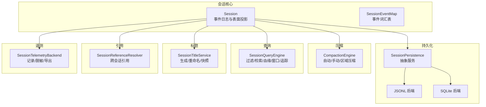
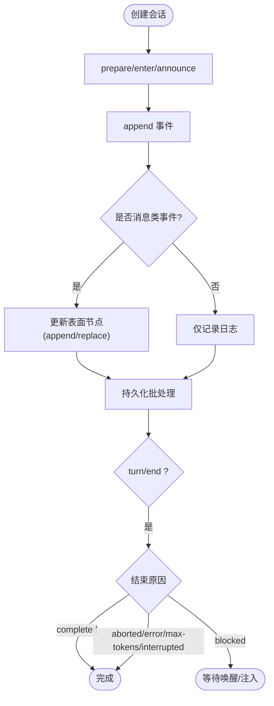
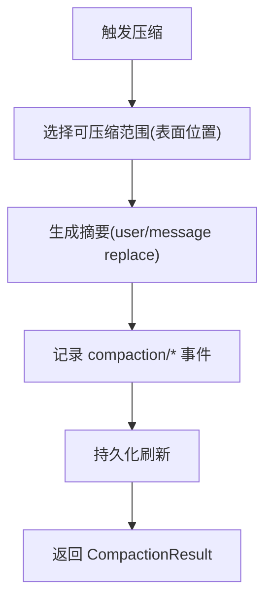
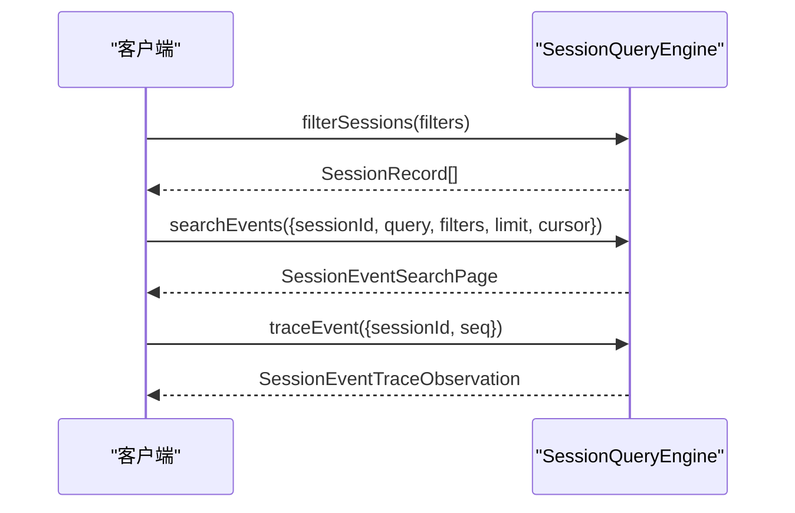
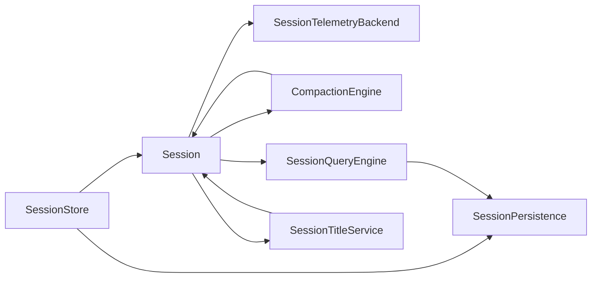

# 会话管理 API

<cite>
**本文引用的文件**
- [session.md](file://docs/subsystems/session.md)
- [persistence.md](file://docs/subsystems/persistence.md)
- [compaction.md](file://docs/subsystems/compaction.md)
- [session-query.md](file://docs/subsystems/session-query.md)
- [session-title.md](file://docs/subsystems/session-title.md)
- [session-reference.md](file://docs/subsystems/session-reference.md)
- [session-telemetry.md](file://docs/subsystems/session-telemetry.md)
</cite>

## 目录
1. [简介](#简介)
2. [项目结构](#项目结构)
3. [核心组件](#核心组件)
4. [架构总览](#架构总览)
5. [详细组件分析](#详细组件分析)
6. [依赖关系分析](#依赖关系分析)
7. [性能考量](#性能考量)
8. [故障排查指南](#故障排查指南)
9. [结论](#结论)
10. [附录：类型与示例](#附录类型与示例)

## 简介
本文件面向需要理解并集成“会话管理”能力的开发者，系统化说明会话的生命周期（创建、状态跟踪、持久化与恢复）、存储接口、事件监听、历史消息管理与压缩策略、配置选项、元数据与权限控制、查询与批量操作、性能优化技巧，以及 TypeScript 类型定义与实际使用示例。同时解释会话与 Agent 的关联关系和数据一致性保证。

## 项目结构
围绕会话的核心由多个子系统组成：
- 会话模型与事件日志：Session、SessionEvent、Surface 投影
- 持久化：SessionPersistence（JSONL/SQLite 后端）
- 压缩：Compaction（自动/手动/区域压缩）
- 查询：SessionQueryEngine（过滤、全文检索、血缘、窗口读取、事件追踪）
- 标题：SessionTitleService（可插拔生成器、用户重命名、持久快照）
- 引用：SessionReferenceResolver（跨会话引用与上下文准备）
- 遥测：SessionTelemetryBackend（记录导出、脱敏瀑布流）



图表来源
- [session.md:1-800](file://docs/subsystems/session.md#L1-L800)
- [persistence.md:1-386](file://docs/subsystems/persistence.md#L1-L386)
- [compaction.md:1-239](file://docs/subsystems/compaction.md#L1-L239)
- [session-query.md:1-496](file://docs/subsystems/session-query.md#L1-L496)
- [session-title.md:1-205](file://docs/subsystems/session-title.md#L1-L205)
- [session-reference.md:1-109](file://docs/subsystems/session-reference.md#L1-L109)
- [session-telemetry.md:1-195](file://docs/subsystems/session-telemetry.md#L1-L195)

章节来源
- [session.md:1-800](file://docs/subsystems/session.md#L1-L800)
- [persistence.md:1-386](file://docs/subsystems/persistence.md#L1-L386)

## 核心组件
- Session：追加式事件日志，维护有序“表面”投影，提供 deriveMessages() 等派生能力
- SessionStore：会话创建、进入、公告、刷新、分叉、列举等生命周期管理
- SessionPersistence：持久化抽象，支持 JSONL/SQLite 两种后端，负责落盘、恢复、冷启动修复
- CompactionEngine：压缩引擎，支持压力触发、上下文溢出、手动与区域压缩
- SessionQueryEngine：会话与事件的过滤、全文检索、血缘追踪、窗口读取、事件溯源
- SessionTitleService：会话标题生成、用户重命名、快照读取
- SessionReferenceResolver：跨会话引用解析与上下文准备
- SessionTelemetryBackend：会话遥测记录、脱敏、导出

章节来源
- [session.md:359-519](file://docs/subsystems/session.md#L359-L519)
- [persistence.md:231-386](file://docs/subsystems/persistence.md#L231-L386)
- [compaction.md:60-239](file://docs/subsystems/compaction.md#L60-L239)
- [session-query.md:9-496](file://docs/subsystems/session-query.md#L9-L496)
- [session-title.md:9-205](file://docs/subsystems/session-title.md#L9-L205)
- [session-reference.md:9-109](file://docs/subsystems/session-reference.md#L9-L109)
- [session-telemetry.md:9-195](file://docs/subsystems/session-telemetry.md#L9-L195)

## 架构总览
会话以事件为单一事实源，所有消息历史均从事件日志推导；持久化层确保事件连续、无损且可恢复；压缩在必要时替换表面节点以降低上下文体积；查询层提供跨会话与单会话的检索、血缘与窗口读取；标题与引用扩展了会话的展示与关联能力；遥测将关键事件导出到外部系统。

```mermaid
sequenceDiagram
participant App as "应用/Agent"
participant Store as "SessionStore"
participant Sess as "Session"
participant Pers as "SessionPersistence"
participant Back as "后端(JSONL/SQLite)"
participant Query as "SessionQueryEngine"
participant Compact as "CompactionEngine"
participant Title as "SessionTitleService"
participant Telem as "SessionTelemetryBackend"
App->>Store : create(id, {seed, meta})
Store-->>App : Session
App->>Sess : append(type, data, opts?)
Sess->>Telem : emit(记录)
Sess->>Pers : append(events)
Pers->>Back : 写入批次
Note over Sess,Pers : 同步通知 + 异步批处理
App->>Query : filterSessions()/searchEvents()
App->>Compact : compactIfNeeded()/compactNow()
Compact->>Sess : 插入摘要(user/message replace)
App->>Title : get()/refresh()/rename()
```

图表来源
- [session.md:617-745](file://docs/subsystems/session.md#L617-L745)
- [persistence.md:248-380](file://docs/subsystems/persistence.md#L248-L380)
- [compaction.md:128-195](file://docs/subsystems/compaction.md#L128-L195)
- [session-query.md:367-490](file://docs/subsystems/session-query.md#L367-L490)
- [session-title.md:156-203](file://docs/subsystems/session-title.md#L156-L203)
- [session-telemetry.md:136-157](file://docs/subsystems/session-telemetry.md#L136-L157)

## 详细组件分析

### 会话生命周期与状态跟踪
- 创建与会话头：通过 SessionStore.create/prepare/enter/announce 完成创建、注册与公告；SessionHeader 携带版本、ID、创建时间、工作目录、父会话、种子长度、代理预设等元数据
- 事件日志与表面：Session.append 追加事件；surface 维护有序的消息节点，支持 append 与 replace 两种插入方式
- 轮次与步骤：turn/start、turn/end、step/start、step/end 标记执行边界；turn/end 包含结束原因（completed、aborted、blocked、error、max-tokens、interrupted）
- 首活序列：firstLiveSeq 标识当前进程首次写入位置；session/end-seed 作为持久化的种子边界标记
- 请求头与路由上下文：request/header 与 request/context 记录调用配置、系统提示、工具模式与容量信息



图表来源
- [session.md:359-519](file://docs/subsystems/session.md#L359-L519)
- [session.md:540-589](file://docs/subsystems/session.md#L540-L589)
- [session.md:617-745](file://docs/subsystems/session.md#L617-L745)

章节来源
- [session.md:359-519](file://docs/subsystems/session.md#L359-L519)
- [session.md:540-589](file://docs/subsystems/session.md#L540-L589)
- [session.md:617-745](file://docs/subsystems/session.md#L617-L745)

### 持久化与恢复机制
- 持久化抽象：SessionPersistence 提供 locate/create/append/prepare/load/inspect/readFrom/list/listSnapshots
- 后端实现：JSONL（每会话独立文件，压缩帧或原始行）与 SQLite（按事件字段映射的行）
- 刷新检查点：session/event 同步通知，后台批处理；session/flush 作为顺序与错误观察的检查点
- 崩溃恢复：冷加载时若发现未闭合的 turn/start，会合成 turn/end{kind:'interrupted'} 保持平衡；不截断已持久化事件
- 格式拒绝：未知版本或损坏的事件会被拒绝，避免静默降级
- 原始工件：readRaw 返回后端原始文本（如 JSONL），保留物理编码细节

```mermaid
sequenceDiagram
participant Loop as "循环/驱动"
participant Store as "SessionStore"
participant Pers as "SessionPersistence"
participant Backend as "后端"
Loop->>Store : flush(session)
Store->>Pers : append(events)
Pers->>Backend : 写入批次
Backend-->>Pers : 成功/失败
Pers-->>Store : 成功/失败
Note over Loop,Backend : 批处理窗口与重试策略
```

图表来源
- [persistence.md:9-20](file://docs/subsystems/persistence.md#L9-L20)
- [persistence.md:231-380](file://docs/subsystems/persistence.md#L231-L380)

章节来源
- [persistence.md:9-20](file://docs/subsystems/persistence.md#L9-L20)
- [persistence.md:231-380](file://docs/subsystems/persistence.md#L231-L380)

### 历史消息管理与压缩策略
- 历史推导：deriveMessages() 基于 surface 节点投影，跳过 chunk 与结构事件，空内容 assistant/message 不计入
- 压缩事件：compaction/start、compaction/summary、compaction/end 记录锁、摘要、影子范围与 token 估算
- 压缩触发：pressure（压力）、context-overflow（上下文溢出）、manual（手动）、region（区域）
- 结果对象：CompactionResult 包含 compactionId、start/summary/end seq、summary 内容块、shadowedRange/shadowedSeqs/shadowedTokenCount
- 工具结果剪枝：可选 ToolResultPruner 对过长的工具输出进行 head/middle/tail 裁剪，减少 Unicode 码点占用



图表来源
- [compaction.md:9-23](file://docs/subsystems/compaction.md#L9-L23)
- [compaction.md:25-89](file://docs/subsystems/compaction.md#L25-L89)
- [compaction.md:128-195](file://docs/subsystems/compaction.md#L128-L195)

章节来源
- [compaction.md:9-23](file://docs/subsystems/compaction.md#L9-L23)
- [compaction.md:25-89](file://docs/subsystems/compaction.md#L25-L89)
- [compaction.md:128-195](file://docs/subsystems/compaction.md#L128-L195)

### 会话查询 API、批量操作与性能优化
- 逻辑记录：SessionRecord、SessionEventRecord、SessionLogSnapshot、SessionSurfaceSnapshot、SessionTitleObservation
- 过滤器：会话级（id、cwd、created-at、parent、availability）与事件级（seq、time、type、surface、text）
- 全文检索：searchSessions（跨会话分组）、searchEvents（单会话内搜索），支持游标分页
- 血缘追踪：traceSession 返回祖先与后代树
- 窗口读取：readEvent 获取目标事件及前后上下文
- 事件追踪：traceEvent 返回直接替换链、源事件与被替代事件
- 性能建议：
  - 使用 listSnapshots 做轻量变更检测
  - 优先使用 filterSessions/filterEvents 进行精确过滤
  - 利用 cursor 分页避免全量拉取
  - 结合 session/flush 控制持久化时机



图表来源
- [session-query.md:9-141](file://docs/subsystems/session-query.md#L9-L141)
- [session-query.md:143-218](file://docs/subsystems/session-query.md#L143-L218)
- [session-query.md:259-331](file://docs/subsystems/session-query.md#L259-L331)
- [session-query.md:367-490](file://docs/subsystems/session-query.md#L367-L490)

章节来源
- [session-query.md:9-141](file://docs/subsystems/session-query.md#L9-L141)
- [session-query.md:143-218](file://docs/subsystems/session-query.md#L143-L218)
- [session-query.md:259-331](file://docs/subsystems/session-query.md#L259-L331)
- [session-query.md:367-490](file://docs/subsystems/session-query.md#L367-L490)

### 会话配置选项、元数据管理与权限控制
- 会话头元数据：version、id、createdAt、cwd、parentSession、seedLength、origin、delegationDepth、agentPreset
- 创建选项：CreateSessionOptions/PrepareSessionOptions/RestoredSessionOptions 支持种子与元数据传入
- 权限与范围：session/created 与 session/disposed 支持作用域过滤（agent-scoped listeners）
- 标题权限：用户重命名会固定标题，阻止后续自动生成；provider 生成需遵循字节限制与来源校验
- 遥测披露：SessionTelemetrySharingStatus 暴露共享策略（full/feedback-only/disabled）

章节来源
- [persistence.md:41-125](file://docs/subsystems/persistence.md#L41-L125)
- [session.md:751-800](file://docs/subsystems/session.md#L751-L800)
- [session-title.md:9-146](file://docs/subsystems/session-title.md#L9-L146)
- [session-telemetry.md:59-72](file://docs/subsystems/session-telemetry.md#L59-L72)

### 事件监听器注册与历史消息管理
- 事件发布：Session.append 同步通知观察者；持久化插件异步缓冲
- 会话事件：session/created、session/disposed 用于生命周期公告
- 历史投影：deriveMessages() 缓存每个表面节点一次，重写时重建；非表面事件不影响消息历史
- 工具调用配对：compaction 前后可用 toolPairingBalancedBefore/After 校验工具调用/结果配对完整性

章节来源
- [session.md:359-519](file://docs/subsystems/session.md#L359-L519)
- [session.md:751-800](file://docs/subsystems/session.md#L751-L800)
- [compaction.md:84-89](file://docs/subsystems/compaction.md#L84-L89)

### 会话与 Agent 的关联关系与数据一致性
- 会话归属：SessionStore 创建的会话属于调用 fiber；fiber 销毁时停止事件通知并从 store 移除
- Agent 组合：agentPreset 决定会话的工具与提示，恢复时需保持一致性
- 一致性保证：
  - 事件连续性：seq 必须连续，不可丢弃
  - 表面契约：replace 必须覆盖完整影子范围，sourceEventSeqs 需一致
  - 崩溃恢复：合成 interrupted 关闭孤儿 turn，不改变已持久化事件
  - 查询原子性：readSurface/readTitleSnapshots 在同一观测下返回一致视图

章节来源
- [session.md:617-745](file://docs/subsystems/session.md#L617-L745)
- [persistence.md:13-20](file://docs/subsystems/persistence.md#L13-L20)
- [session-query.md:333-357](file://docs/subsystems/session-query.md#L333-L357)

## 依赖关系分析
- Session 依赖 SessionStore 进行生命周期管理
- SessionStore 依赖 SessionPersistence 进行持久化
- CompactionEngine 依赖 Session 与 LLM（摘要生成）
- SessionQueryEngine 依赖 Session 与持久化后端（SQLite 提供全文索引）
- SessionTitleService 依赖 Session 与可选 LLM provider
- SessionReferenceResolver 依赖 SessionQueryEngine 与 SessionTitleService
- SessionTelemetryBackend 依赖 Session 事件流与外部导出 SDK



图表来源
- [session.md:617-745](file://docs/subsystems/session.md#L617-L745)
- [persistence.md:231-380](file://docs/subsystems/persistence.md#L231-L380)
- [compaction.md:128-195](file://docs/subsystems/compaction.md#L128-L195)
- [session-query.md:367-490](file://docs/subsystems/session-query.md#L367-L490)
- [session-title.md:156-203](file://docs/subsystems/session-title.md#L156-L203)
- [session-telemetry.md:136-157](file://docs/subsystems/session-telemetry.md#L136-L157)

章节来源
- [session.md:617-745](file://docs/subsystems/session.md#L617-L745)
- [persistence.md:231-380](file://docs/subsystems/persistence.md#L231-L380)
- [compaction.md:128-195](file://docs/subsystems/compaction.md#L128-L195)
- [session-query.md:367-490](file://docs/subsystems/session-query.md#L367-L490)
- [session-title.md:156-203](file://docs/subsystems/session-title.md#L156-L203)
- [session-telemetry.md:136-157](file://docs/subsystems/session-telemetry.md#L136-L157)

## 性能考量
- 批处理与刷新：session/event 同步通知，后台批处理；使用 session/flush 控制检查点
- 压缩：在压力或溢出时自动压缩，减少上下文体积；工具结果剪枝降低文本大小
- 查询优化：使用 listSnapshots 检测变更；filterSessions/filterEvents 精确过滤；cursor 分页
- 缓存：deriveMessages 缓存表面节点投影；title 折叠与 surface 快照在同一观测下保持一致
- 后端选择：JSONL 适合逐会话归档；SQLite 适合集中索引与全文检索

[本节为通用指导，无需特定文件来源]

## 故障排查指南
- 格式拒绝：当后端无法忠实解读日志时会抛出 SessionFormatUnsupportedError，需升级 harness 或回退版本
- 崩溃恢复：冷加载检测到未闭合 turn 会合成 interrupted；确认 persisted 与 live 状态
- 查询错误：区分 SESSION_QUERY_* 错误码，定位无效配置、缺失目标、索引失败、游标过期等
- 压缩失败：ManualCompactionErrorCode 分类 busy/cancelled/changed/summary/commit/persistence，根据阶段定位问题
- 标题异常：用户重命名后自动生成被抑制；provider 生成需满足字节限制与来源校验

章节来源
- [persistence.md:92-99](file://docs/subsystems/persistence.md#L92-L99)
- [session-query.md:333-357](file://docs/subsystems/session-query.md#L333-L357)
- [compaction.md:71-89](file://docs/subsystems/compaction.md#L71-L89)
- [session-title.md:156-203](file://docs/subsystems/session-title.md#L156-L203)

## 结论
会话管理以事件日志为核心，通过持久化、压缩、查询、标题、引用与遥测形成完整闭环。其设计强调：
- 单一事实源与可重现的历史推导
- 强一致性的表面与事件契约
- 可扩展的后端与能力缝（compaction、title、telemetry）
- 面向生产环境的崩溃恢复与性能优化

[本节为总结，无需特定文件来源]

## 附录：类型与示例

### TypeScript 类型定义（路径参考）
- 会话事件与表面：
  - [SessionEventMap:9-125](file://docs/subsystems/session.md#L9-L125)
  - [SessionEvent:194-247](file://docs/subsystems/session.md#L194-L247)
  - [SurfaceEventType/SurfaceOp/SurfaceIntent:255-313](file://docs/subsystems/session.md#L255-L313)
  - [SessionSurface/FoldReplacement/FoldResult:315-357](file://docs/subsystems/session.md#L315-L357)
- 会话 API：
  - [Session 类方法:359-519](file://docs/subsystems/session.md#L359-L519)
  - [SessionStore 方法:617-745](file://docs/subsystems/session.md#L617-L745)
- 持久化：
  - [SessionHeader/CreateSessionOptions:41-125](file://docs/subsystems/persistence.md#L41-L125)
  - [SessionPersistence 抽象:231-380](file://docs/subsystems/persistence.md#L231-L380)
- 压缩：
  - [CompactionResult/Trigger:25-89](file://docs/subsystems/compaction.md#L25-L89)
  - [CompactionEngine 抽象:128-195](file://docs/subsystems/compaction.md#L128-L195)
- 查询：
  - [SessionRecord/EventRecord/Snapshot:9-101](file://docs/subsystems/session-query.md#L9-L101)
  - [过滤器与文档:103-141](file://docs/subsystems/session-query.md#L103-L141)
  - [全文检索与分页:143-218](file://docs/subsystems/session-query.md#L143-L218)
  - [血缘与窗口/追踪:220-331](file://docs/subsystems/session-query.md#L220-L331)
  - [SessionQueryEngine 抽象:367-490](file://docs/subsystems/session-query.md#L367-L490)
- 标题：
  - [SessionTitleProvider/Request/Result:87-146](file://docs/subsystems/session-title.md#L87-L146)
  - [SessionTitleService 抽象:156-203](file://docs/subsystems/session-title.md#L156-L203)
- 引用：
  - [SessionReferenceInput/Candidate/PreparedMessage:9-51](file://docs/subsystems/session-reference.md#L9-L51)
  - [SessionReferenceResolver 抽象:77-103](file://docs/subsystems/session-reference.md#L77-L103)
- 遥测：
  - [SessionTelemetryRecord/Severity:9-57](file://docs/subsystems/session-telemetry.md#L9-L57)
  - [SessionTelemetryBackend 抽象:136-157](file://docs/subsystems/session-telemetry.md#L136-L157)

### 实际使用示例（流程指引）
- 创建与会话公告：
  - 使用 ctx.sessions.create(id, { seed, meta }) 创建会话并进入 store
  - 通过 announce(session) 发出 session/created 事件
  - 参考：[SessionStore.create/announce:617-745](file://docs/subsystems/session.md#L617-L745)
- 追加事件与持久化：
  - 使用 session.append(type, data, opts?) 追加事件
  - 使用 ctx.sessions.flush(session) 触发持久化检查点
  - 参考：[Session.append:359-519](file://docs/subsystems/session.md#L359-L519)、[SessionStore.flush:617-745](file://docs/subsystems/session.md#L617-L745)
- 查询会话与事件：
  - 使用 ctx.sessionQuery.filterSessions(filters) 列出匹配会话
  - 使用 ctx.sessionQuery.searchEvents(request) 进行全文检索
  - 使用 ctx.sessionQuery.traceEvent(request) 获取事件关系
  - 参考：[SessionQueryEngine:367-490](file://docs/subsystems/session-query.md#L367-L490)
- 压缩历史：
  - 自动：ctx.compaction.compactIfNeeded(agent, trigger, signal)
  - 手动：ctx.compaction.compactNow(agent, signal, commandId)
  - 区域：ctx.compaction.compactRegion(start, end, agent, signal)
  - 参考：[CompactionEngine:128-195](file://docs/subsystems/compaction.md#L128-L195)
- 标题管理：
  - 读取：ctx.sessionTitle.get(session)
  - 刷新：ctx.sessionTitle.refresh(session, signal)
  - 重命名：ctx.sessionTitle.rename(session, title)
  - 参考：[SessionTitleService:156-203](file://docs/subsystems/session-title.md#L156-L203)
- 跨会话引用：
  - 候选列表：ctx.sessionReferenceResolver.listCandidates(agent, query, limit, signal)
  - 准备上下文：ctx.sessionReferenceResolver.prepare(agent, content, references, signal)
  - 参考：[SessionReferenceResolver:77-103](file://docs/subsystems/session-reference.md#L77-L103)
- 遥测记录：
  - 挂载后端：ctx.sessionTelemetry.emit(record)
  - 脱敏：通过 session-telemetry/record 瀑布流转换
  - 参考：[SessionTelemetryBackend:136-157](file://docs/subsystems/session-telemetry.md#L136-L157)

[本节为流程指引，具体代码片段请参考对应类型与 API 文档路径]