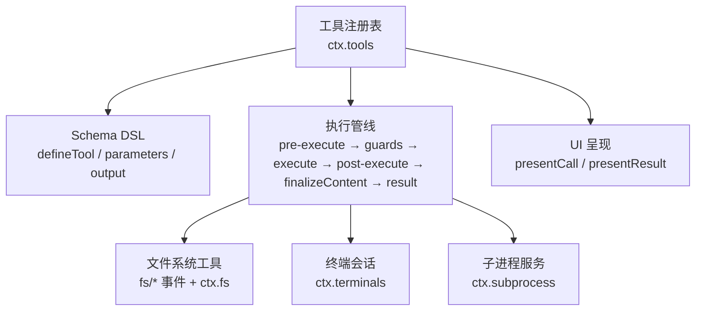
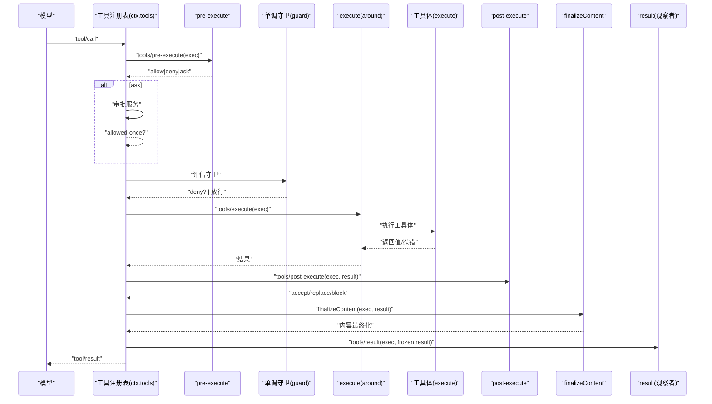
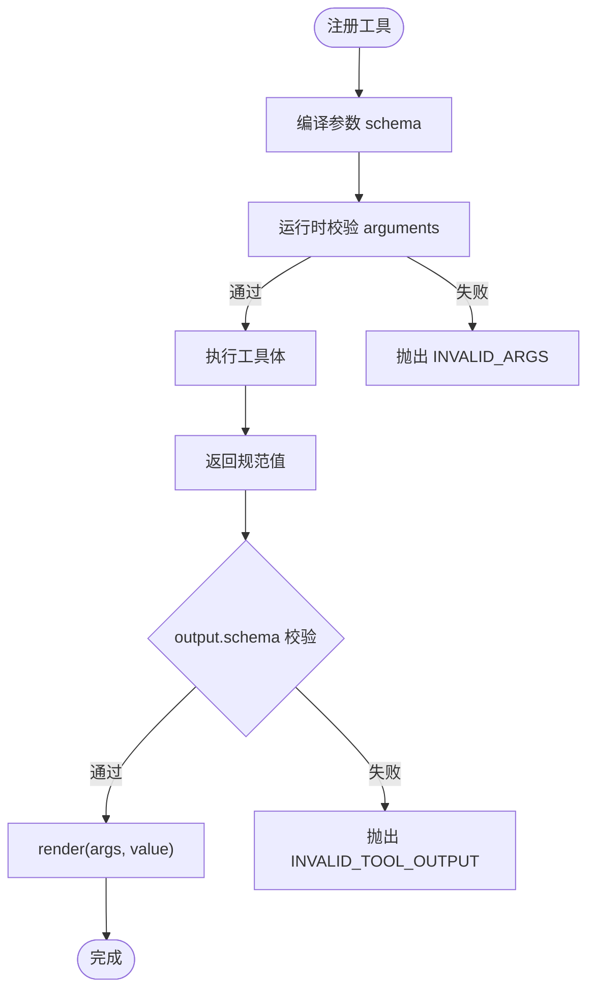
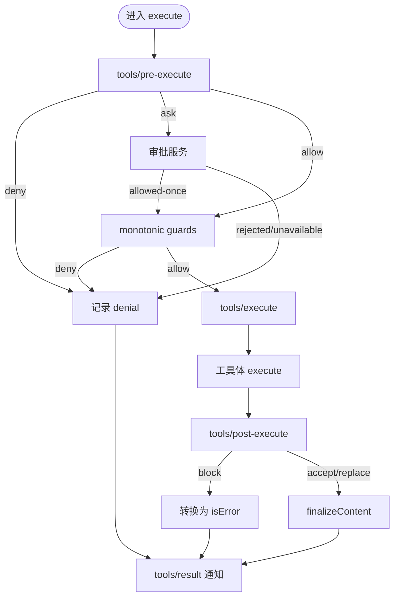
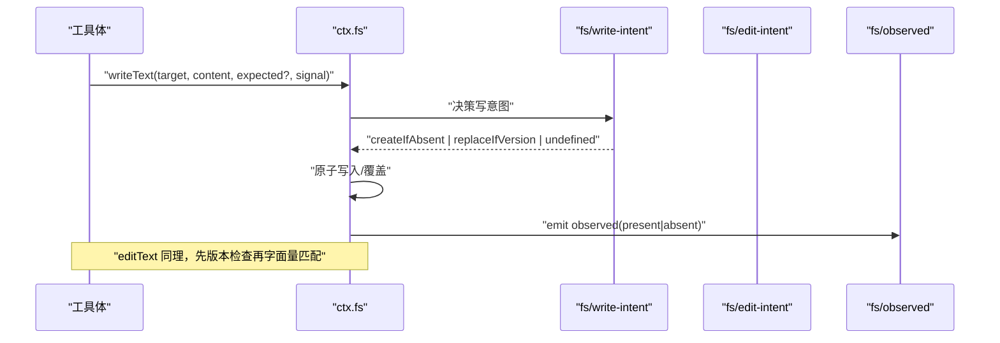
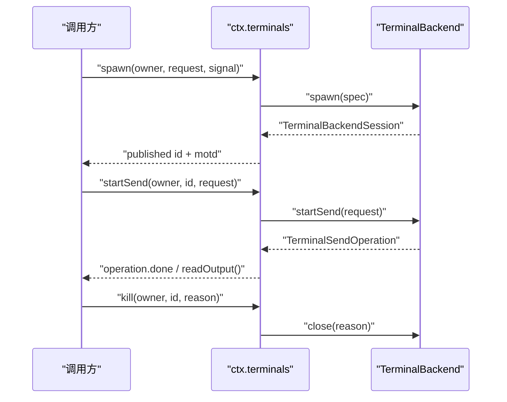
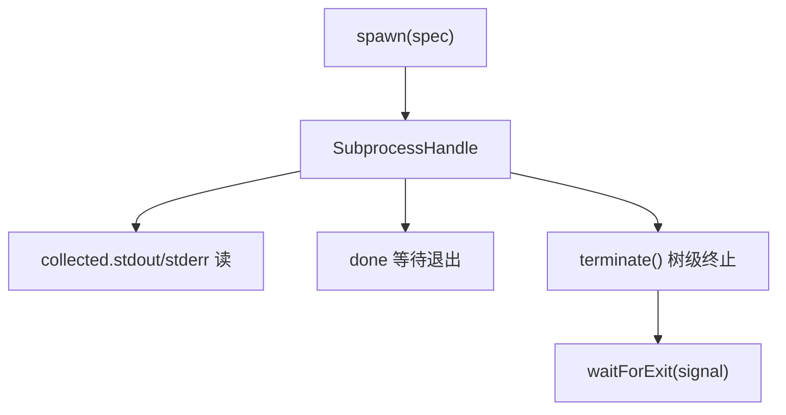
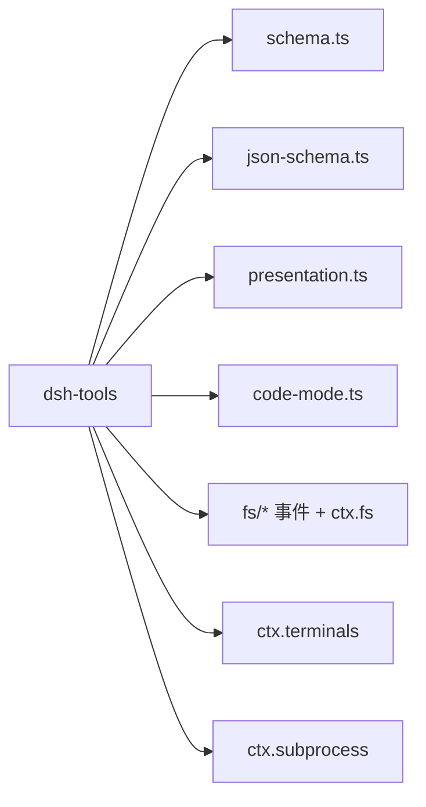

# 工具系统 API

<cite>
**本文引用的文件**
- [packages/core/tools/src/index.ts](file://packages/core/tools/src/index.ts)
- [packages/core/tools/src/schema.ts](file://packages/core/tools/src/schema.ts)
- [packages/core/tools/src/presentation.ts](file://packages/core/tools/src/presentation.ts)
- [packages/core/tools/src/json-schema.ts](file://packages/core/tools/src/json-schema.ts)
- [packages/core/tools/src/code-mode.ts](file://packages/core/tools/src/code-mode.ts)
- [docs/subsystems/tools.md](file://docs/subsystems/tools.md)
- [docs/tool-execution-pipeline.md](file://docs/tool-execution-pipeline.md)
- [docs/cookbook/adding-a-tool.md](file://docs/cookbook/adding-a-tool.md)
- [docs/subsystems/filesystem.md](file://docs/subsystems/filesystem.md)
- [docs/subsystems/terminal.md](file://docs/subsystems/terminal.md)
- [docs/subsystems/subprocess.md](file://docs/subsystems/subprocess.md)
</cite>

## 目录
1. [简介](#简介)
2. [项目结构](#项目结构)
3. [核心组件](#核心组件)
4. [架构总览](#架构总览)
5. [详细组件分析](#详细组件分析)
6. [依赖关系分析](#依赖关系分析)
7. [性能与资源管理](#性能与资源管理)
8. [故障排查指南](#故障排查指南)
9. [结论](#结论)
10. [附录：类型定义与示例路径](#附录类型定义与示例路径)

## 简介
本文件系统性说明工具系统的注册机制、执行管道、权限控制、参数验证、返回值处理、错误传播，以及内置工具（文件系统、终端、子进程）的使用方法。同时提供自定义工具开发指南、异步处理、超时控制、资源管理与调试技巧，并给出完整的 TypeScript 类型定义与实际代码示例的路径引用。

## 项目结构
工具系统由核心包 dsh-tools 提供注册表、Schema DSL、执行管线与 UI 呈现词汇；文件系统、终端、子进程作为能力 seam 通过事件与服务集成到工具调用中。

图表来源
- [packages/core/tools/src/index.ts:137-200](file://packages/core/tools/src/index.ts#L137-L200)
- [docs/subsystems/tools.md:170-404](file://docs/subsystems/tools.md#L170-L404)

章节来源
- [docs/subsystems/tools.md:1-12](file://docs/subsystems/tools.md#L1-L12)
- [packages/core/tools/src/index.ts:1-107](file://packages/core/tools/src/index.ts#L1-L107)

## 核心组件
- 工具定义与注册
  - ToolDefinition：包含面向模型的 ToolSchema、必需的 output 声明、execute、可选 finalizeContent、timeoutMs、isConcurrencySafe、presentCall/presentResult。
  - defineTool：将参数 schema 与输出 schema 绑定，自动校验参数、推导返回类型、约束 render/presentationMeta。
- 执行管线
  - tools/pre-execute：允许/拒绝/询问（ask）。
  - 单调守卫（guard）：最终不可逆的拒绝。
  - tools/execute：环绕分派（超时、重试、指标）。
  - tools/post-execute：接受/替换内容或值/阻断/附加上下文。
  - finalizeContent：工具定义的最后一次内容转换。
  - tools/result：不可变权威结果观察点。
- 权限与可见性
  - ToolRestriction：按作用域对全局工具进行 allow/deny 过滤。
  - schemas()：仅暴露模型可见字段（白名单），不泄露执行与展示回调。
- 参数与输出 Schema
  - ValueSchemaSpec 统一描述参数与输出根类型，支持 oneOf、enum、const、object/array/scalar/null/json。
  - assertSupportedJsonSchema/validateJsonSchemaValue：强制原始 JSON Schema 子集。
- UI 呈现
  - ToolCallView/ToolResultView：中性卡片词汇（generic/terminal/diff/search/read/web），供宿主映射到具体 UI。

章节来源
- [docs/subsystems/tools.md:9-151](file://docs/subsystems/tools.md#L9-L151)
- [docs/subsystems/tools.md:153-172](file://docs/subsystems/tools.md#L153-L172)
- [docs/subsystems/tools.md:406-467](file://docs/subsystems/tools.md#L406-L467)
- [packages/core/tools/src/schema.ts:1-200](file://packages/core/tools/src/schema.ts#L1-L200)
- [packages/core/tools/src/json-schema.ts:1-200](file://packages/core/tools/src/json-schema.ts#L1-L200)
- [packages/core/tools/src/presentation.ts:1-200](file://packages/core/tools/src/presentation.ts#L1-L200)

## 架构总览
工具调用的端到端流程如下：

图表来源
- [docs/tool-execution-pipeline.md:8-60](file://docs/tool-execution-pipeline.md#L8-L60)
- [packages/core/tools/src/index.ts:137-200](file://packages/core/tools/src/index.ts#L137-L200)
- [docs/subsystems/tools.md:170-404](file://docs/subsystems/tools.md#L170-L404)

章节来源
- [docs/tool-execution-pipeline.md:1-63](file://docs/tool-execution-pipeline.md#L1-L63)
- [docs/subsystems/tools.md:170-404](file://docs/subsystems/tools.md#L170-L404)

## 详细组件分析

### 工具注册与 Schema 推导
- defineTool 将参数 schema 编译为运行时校验器，并将 output.schema 用于返回值校验与渲染。
- InferArgs/InferValue 在 16 层容器内保持精确类型推断，超出回退到 JsonValue。
- 参数不匹配抛出 ToolArgsError（INVALID_ARGS）；输出无效抛出 ToolOutputError（INVALID_TOOL_OUTPUT）。

图表来源
- [packages/core/tools/src/schema.ts:1-200](file://packages/core/tools/src/schema.ts#L1-L200)
- [docs/subsystems/tools.md:98-151](file://docs/subsystems/tools.md#L98-L151)

章节来源
- [packages/core/tools/src/schema.ts:1-200](file://packages/core/tools/src/schema.ts#L1-L200)
- [docs/subsystems/tools.md:98-151](file://docs/subsystems/tools.md#L98-L151)

### 执行管道与权限控制
- pre-execute：可重排的 allow/deny/ask 水线；缺失审批通道时 ask 转为 deny。
- guard：单调守卫，只能拒绝不能恢复允许。
- execute：可替换 exec.signal 以施加超时/重试；注册表会融合原始 caller signal。
- post-execute：可替换 content/value、阻断（block）、附加 additionalContexts。
- finalizeContent：最后一次纯内容转换，必须无副作用且不抛错。
- result：不可变权威结果，供审计与观测。

图表来源
- [docs/subsystems/tools.md:170-404](file://docs/subsystems/tools.md#L170-L404)
- [packages/core/tools/src/index.ts:137-200](file://packages/core/tools/src/index.ts#L137-L200)

章节来源
- [docs/subsystems/tools.md:170-404](file://docs/subsystems/tools.md#L170-L404)
- [packages/core/tools/src/index.ts:137-200](file://packages/core/tools/src/index.ts#L137-L200)

### 文件系统工具（read/write/edit/grep/glob）
- 抽象接口：FileSystem（ctx.fs）提供 resolve/stat/lstat/readText/streamText/readBytes/listDir/writeText/editText。
- 写意图水线：fs/write-intent、fs/edit-intent 决定 createIfAbsent 或 replaceIfVersion 等策略。
- 观察记录：fs/observed 记录 present/absent 状态，驱动后续写/编辑授权。
- 错误码：FS_NOT_FOUND、FS_STALE_VERSION、FS_PERMISSION_DENIED、FS_SANDBOX_DENIED 等。
- 无 timeoutMs：文件系统操作不声明超时，取消通过信号尽力而为。

图表来源
- [docs/subsystems/filesystem.md:114-278](file://docs/subsystems/filesystem.md#L114-L278)
- [docs/subsystems/filesystem.md:280-496](file://docs/subsystems/filesystem.md#L280-L496)

章节来源
- [docs/subsystems/filesystem.md:1-278](file://docs/subsystems/filesystem.md#L1-L278)
- [docs/subsystems/filesystem.md:280-496](file://docs/subsystems/filesystem.md#L280-L496)

### 终端工具（持久 PTY 会话）
- 后端注册：TerminalBackend 提供 spawn，生命周期由 TerminalSessionService 管理。
- 发送与读取：startSend 返回 TerminalSendOperation，read 分页读取滚动缓冲。
- 信号与关闭：signal 发送 POSIX 信号；kill 等待清理达到静默。
- 所有权：以 Agent 为键，跨插件重载保持会话存活。

图表来源
- [docs/subsystems/terminal.md:25-91](file://docs/subsystems/terminal.md#L25-L91)
- [docs/subsystems/terminal.md:97-185](file://docs/subsystems/terminal.md#L97-L185)

章节来源
- [docs/subsystems/terminal.md:1-185](file://docs/subsystems/terminal.md#L1-L185)

### 子进程管理（spawn/collect/terminate）
- 环境隔离：DSH_* 命名空间受控，scrubbedParentEnv 清洗凭据。
- stdio 模式：stdin 可为 ignore/pipe/{data}；stdout/stderr 可为 pipe/inherit/collect。
- 句柄：handle.collected 提供偏移式增量读取；done 报告退出事实；terminate 树级终止（SIGTERM→grace→SIGKILL）。
- 终端原语：spawnTerminal 分配真实终端，负责前台进程组与信号。

图表来源
- [docs/subsystems/subprocess.md:13-131](file://docs/subsystems/subprocess.md#L13-L131)
- [docs/subsystems/subprocess.md:132-249](file://docs/subsystems/subprocess.md#L132-L249)
- [docs/subsystems/subprocess.md:251-325](file://docs/subsystems/subprocess.md#L251-L325)

章节来源
- [docs/subsystems/subprocess.md:1-325](file://docs/subsystems/subprocess.md#L1-L325)

### Code Mode 与 run_code
- 保留名称 run_code 作为唯一可直接调用的工具，其他工具需通过 SDK 在程序内调用。
- 子调度日志：tools/code-dispatch-log 可替换持久日志副本中的内容（不影响程序值与模型可见结果）。

章节来源
- [packages/core/tools/src/index.ts:30-63](file://packages/core/tools/src/index.ts#L30-L63)
- [packages/core/tools/src/code-mode.ts:1-200](file://packages/core/tools/src/code-mode.ts#L1-L200)

## 依赖关系分析
- 工具注册表依赖：
  - Schema DSL（schema.ts）与 JSON Schema 校验（json-schema.ts）。
  - 呈现词汇（presentation.ts）。
  - Code Mode 集成（code-mode.ts）。
  - 作用域与事件（@deepseek-ai/dsh-scope、@deepseek-ai/cordis）。
- 能力集成：
  - 文件系统：fs/* 事件与 ctx.fs。
  - 终端：ctx.terminals。
  - 子进程：ctx.subprocess。

图表来源
- [packages/core/tools/src/index.ts:1-107](file://packages/core/tools/src/index.ts#L1-L107)
- [docs/subsystems/tools.md:1-12](file://docs/subsystems/tools.md#L1-L12)

章节来源
- [packages/core/tools/src/index.ts:1-107](file://packages/core/tools/src/index.ts#L1-L107)
- [docs/subsystems/tools.md:1-12](file://docs/subsystems/tools.md#L1-L12)

## 性能与资源管理
- 并发与独占
  - isConcurrencySafe：纯同步分类器，true 才加入并行组；未声明或非 true 视为独占。
  - 执行模式：parallel/exclusive 由注册表根据分类器决定。
- 超时与取消
  - timeoutMs：协作式超时预算，由 @deepseek-ai/dsh-tool-call-timeout-policy 在 tools/execute 包装实现。
  - exec.signal：所有长任务必须监听并在中止时尽快到达静默。
- 资源清理
  - 子进程：terminate 树级终止，waitForExit 等待整棵进程树退出。
  - 终端：kill 等待后端清理达到静默。
  - 文件系统：无 timeoutMs，取消尽力而为；写/编辑原子提交。
- 内存与流
  - 子进程 collect 模式支持 spill 文件，避免无限缓冲。
  - 文件系统大文件使用 streamText/readBytes 带上限。

章节来源
- [docs/subsystems/tools.md:53-74](file://docs/subsystems/tools.md#L53-L74)
- [docs/subsystems/tools.md:170-254](file://docs/subsystems/tools.md#L170-L254)
- [docs/subsystems/subprocess.md:132-249](file://docs/subsystems/subprocess.md#L132-L249)
- [docs/subsystems/filesystem.md:272-278](file://docs/subsystems/filesystem.md#L272-L278)

## 故障排查指南
- 常见错误
  - 参数不合法：ToolArgsError（INVALID_ARGS）。
  - 输出不合法：ToolOutputError（INVALID_TOOL_OUTPUT）。
  - 未知工具：UNKNOWN_TOOL（不可见或未注册）。
  - 文件系统：FS_NOT_FOUND、FS_STALE_VERSION、FS_PERMISSION_DENIED、FS_SANDBOX_DENIED、FS_TOO_LARGE 等。
- 定位步骤
  - 检查 tools/pre-execute 是否 deny/ask 未获批。
  - 检查 monotonic guards 是否拒绝。
  - 检查 tools/post-execute 是否 block 或替换了值/内容。
  - 检查 finalizeContent 是否产生非 JSON 安全内容。
  - 查看 tools/result 的不可变结果与 meta。
- 调试技巧
  - 在 tools/execute 包装中添加指标与耗时。
  - 在 tools/post-execute 中打印 normalized result（注意不要泄露敏感信息）。
  - 使用 Code Mode 的 tools/code-dispatch-log 调整持久日志副本。

章节来源
- [docs/subsystems/tools.md:149-151](file://docs/subsystems/tools.md#L149-L151)
- [docs/subsystems/tools.md:376-404](file://docs/subsystems/tools.md#L376-L404)
- [docs/subsystems/filesystem.md:244-278](file://docs/subsystems/filesystem.md#L244-L278)
- [packages/core/tools/src/index.ts:137-200](file://packages/core/tools/src/index.ts#L137-L200)

## 结论
工具系统通过统一的 Schema DSL、严格的执行管道与可扩展的水线机制，实现了安全的工具注册、权限控制、参数验证与结果规范化。文件系统、终端与子进程作为能力 seam 通过事件与服务无缝集成。遵循本文档的契约与最佳实践，可以构建高性能、可观测、可维护的工具生态。

## 附录：类型定义与示例路径
- 类型定义
  - 工具定义与执行类型：[packages/core/tools/src/index.ts:137-200](file://packages/core/tools/src/index.ts#L137-L200)
  - Schema DSL 与推断：[packages/core/tools/src/schema.ts:1-200](file://packages/core/tools/src/schema.ts#L1-L200)
  - JSON Schema 子集校验：[packages/core/tools/src/json-schema.ts:1-200](file://packages/core/tools/src/json-schema.ts#L1-L200)
  - UI 呈现词汇：[packages/core/tools/src/presentation.ts:1-200](file://packages/core/tools/src/presentation.ts#L1-L200)
- 示例与教程
  - 最小工具示例与规则：[docs/cookbook/adding-a-tool.md:7-66](file://docs/cookbook/adding-a-tool.md#L7-L66)
  - 执行管道图与说明：[docs/tool-execution-pipeline.md:8-60](file://docs/tool-execution-pipeline.md#L8-L60)
  - 文件系统工具契约与事件：[docs/subsystems/filesystem.md:114-278](file://docs/subsystems/filesystem.md#L114-L278)
  - 终端会话服务 API：[docs/subsystems/terminal.md:97-185](file://docs/subsystems/terminal.md#L97-L185)
  - 子进程服务 API：[docs/subsystems/subprocess.md:251-325](file://docs/subsystems/subprocess.md#L251-L325)