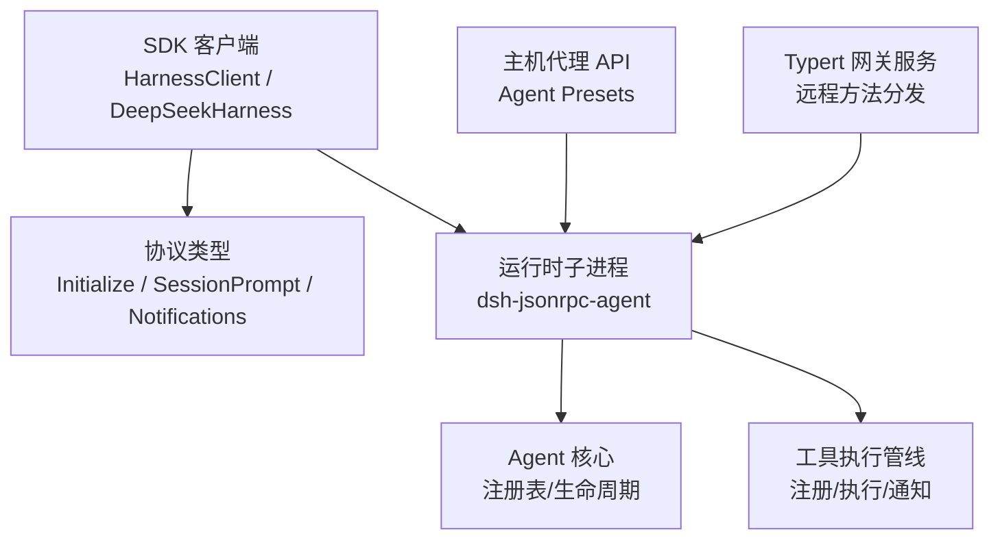
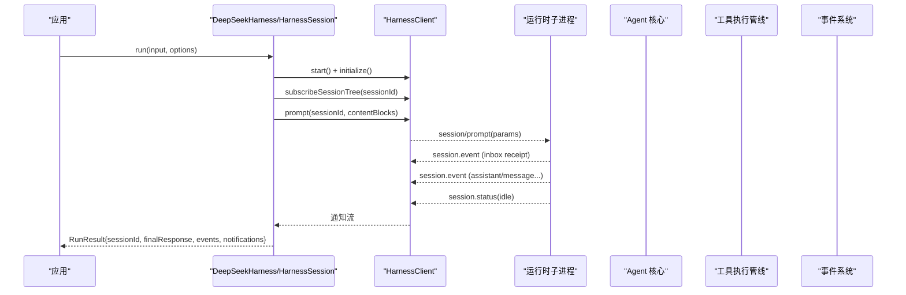
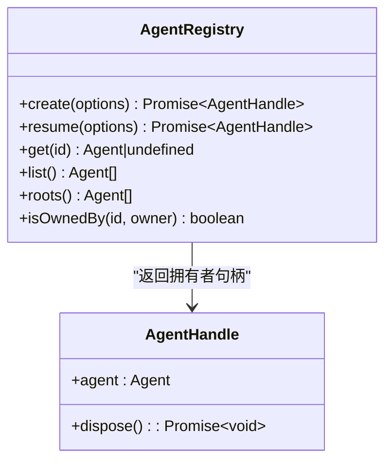
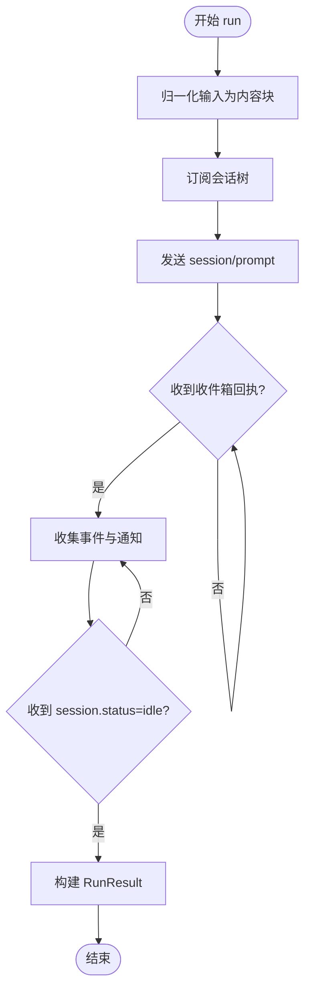
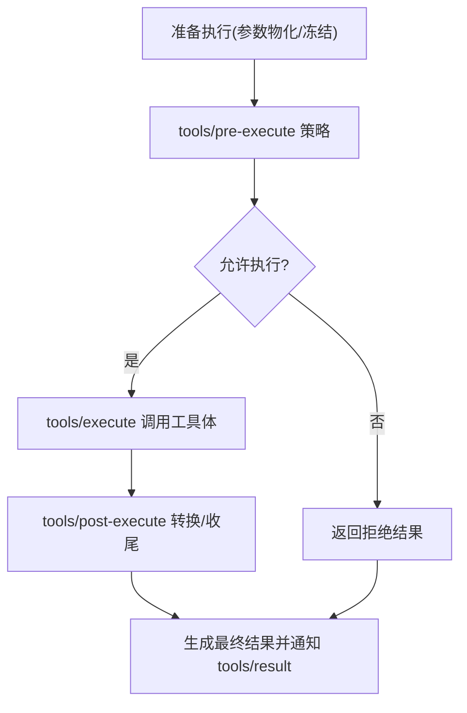
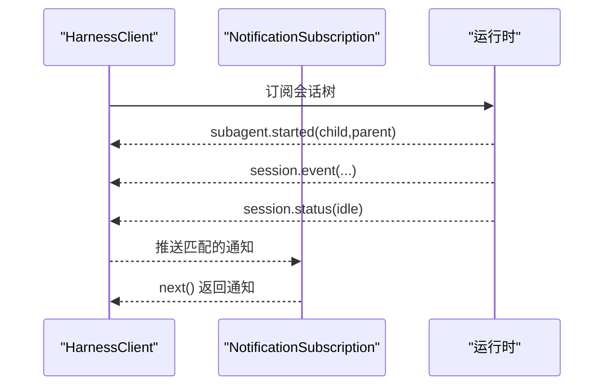
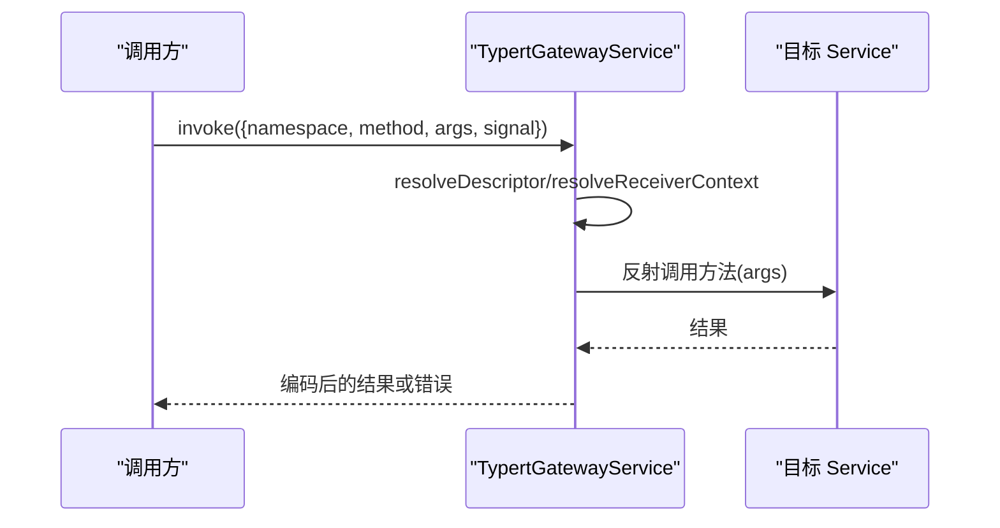
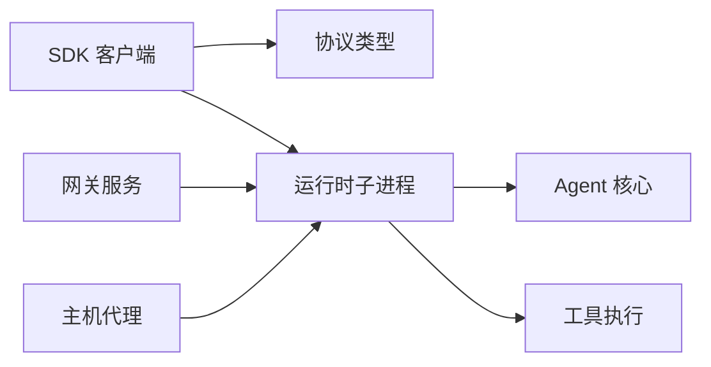

# 核心 API

<cite>
**本文引用的文件**
- [packages/sdk/client/src/index.ts](file://packages/sdk/client/src/index.ts)
- [packages/sdk/client/src/api.ts](file://packages/sdk/client/src/api.ts)
- [packages/sdk/client/src/client.ts](file://packages/sdk/client/src/client.ts)
- [packages/sdk/client/src/types.ts](file://packages/sdk/client/src/types.ts)
- [packages/sdk/protocol/src/types.ts](file://packages/sdk/protocol/src/types.ts)
- [packages/api/gateway/src/index.ts](file://packages/api/gateway/src/index.ts)
- [packages/core/agent/src/index.ts](file://packages/core/agent/src/index.ts)
- [packages/core/tools/src/index.ts](file://packages/core/tools/src/index.ts)
- [packages/host/apiproxy/src/api/agent-presets.ts](file://packages/host/apiproxy/src/api/agent-presets.ts)
</cite>

## 目录
1. [简介](#简介)
2. [项目结构](#项目结构)
3. [核心组件](#核心组件)
4. [架构总览](#架构总览)
5. [详细组件分析](#详细组件分析)
6. [依赖关系分析](#依赖关系分析)
7. [性能与并发](#性能与并发)
8. [故障排查指南](#故障排查指南)
9. [结论](#结论)
10. [附录：类型与示例](#附录类型与示例)

## 简介
本文件面向 DeepSeek Harness 的核心 API，聚焦以下能力：
- Agent 管理：创建、恢复、注册、生命周期事件与所有权。
- 会话管理：通过 SDK 客户端发起一轮对话（prompt），订阅会话树事件，等待空闲状态完成。
- 工具注册与执行：工具定义、参数校验、策略管道、执行结果与通知。
- 事件系统：JSON-RPC 通知、会话事件、子代理生命周期事件。
- 网关服务：Typert Gateway 对远程方法调用的路由、参数解码、上下文解析与错误分类。

文档提供接口参数、返回值、错误处理、最佳实践、生命周期与并发模型，并给出 TypeScript 类型路径与使用示例路径。

## 项目结构
DeepSeek Harness 的“核心 API”由多个包协作构成：
- SDK 客户端层：封装进程启动、JSON-RPC 协议、会话轮次与事件订阅。
- 协议层：定义 initialize、session/prompt、shutdown 请求/结果与通知类型。
- 网关层：基于 Typert 的服务发现、参数解码、上下文注入与 RPC 拦截。
- 核心 Agent/工具：Agent 注册表、工具注册与执行管线、事件发布。
- 主机代理：Agent 预设等高层域 API。

图表来源
- [packages/sdk/client/src/client.ts:184-474](file://packages/sdk/client/src/client.ts#L184-L474)
- [packages/sdk/protocol/src/types.ts:15-105](file://packages/sdk/protocol/src/types.ts#L15-L105)
- [packages/core/agent/src/index.ts:1-200](file://packages/core/agent/src/index.ts#L1-L200)
- [packages/core/tools/src/index.ts:221-394](file://packages/core/tools/src/index.ts#L221-L394)
- [packages/host/apiproxy/src/api/agent-presets.ts:15-116](file://packages/host/apiproxy/src/api/agent-presets.ts#L15-L116)
- [packages/api/gateway/src/index.ts:90-184](file://packages/api/gateway/src/index.ts#L90-L184)

章节来源
- [packages/sdk/client/src/index.ts:1-30](file://packages/sdk/client/src/index.ts#L1-L30)
- [packages/sdk/client/src/types.ts:22-71](file://packages/sdk/client/src/types.ts#L22-L71)
- [packages/sdk/protocol/src/types.ts:15-105](file://packages/sdk/protocol/src/types.ts#L15-L105)

## 核心组件
- SDK 客户端
  - HarnessClient：进程级 JSON-RPC 客户端，负责启动子进程、建立传输、发送请求、订阅通知、优雅关闭。
  - DeepSeekHarness：高级封装，维护一个运行时的多会话能力；提供 run() 一次 prompt 直到空闲。
  - HarnessSession：会话句柄，封装 run(input, options) 的事件收集与最终响应提取。
- 协议类型
  - InitializeParams/Result、SessionPromptParams/Result、各类通知（session.event、session.status、subagent.*）。
- 网关服务
  - TypertGatewayService：按命名空间/方法名分发到具体 Service 方法，进行参数解码、上下文解析、调用与结果编码。
- Agent 核心
  - AgentRegistry：创建/恢复 Agent、注册/列举/查找、生命周期事件、所有权追踪。
- 工具执行
  - ToolDefinition.execute：带信号取消、策略管道、结果规范化与通知。
- 主机代理
  - AgentPresetsApi：列出/选择/读取/复制/打开/删除 Agent 预设。

章节来源
- [packages/sdk/client/src/api.ts:22-195](file://packages/sdk/client/src/api.ts#L22-L195)
- [packages/sdk/client/src/client.ts:184-474](file://packages/sdk/client/src/client.ts#L184-L474)
- [packages/sdk/protocol/src/types.ts:15-105](file://packages/sdk/protocol/src/types.ts#L15-L105)
- [packages/api/gateway/src/index.ts:90-184](file://packages/api/gateway/src/index.ts#L90-L184)
- [packages/core/agent/src/index.ts:1-200](file://packages/core/agent/src/index.ts#L1-L200)
- [packages/core/tools/src/index.ts:221-394](file://packages/core/tools/src/index.ts#L221-L394)
- [packages/host/apiproxy/src/api/agent-presets.ts:15-116](file://packages/host/apiproxy/src/api/agent-presets.ts#L15-L116)

## 架构总览
下图展示从调用方到运行时、再到 Agent/工具与事件的完整链路。

图表来源
- [packages/sdk/client/src/api.ts:146-195](file://packages/sdk/client/src/api.ts#L146-L195)
- [packages/sdk/client/src/client.ts:268-333](file://packages/sdk/client/src/client.ts#L268-L333)
- [packages/sdk/protocol/src/types.ts:15-105](file://packages/sdk/protocol/src/types.ts#L15-L105)

## 详细组件分析

### Agent 管理 API
- 能力概览
  - 创建 Agent：通过工厂在指定 sessionId 上创建，支持 seed 历史、元数据、setup 组合与可选取消信号。
  - 恢复 Agent：从持久化会话恢复，加载后进入 setup 再发布。
  - 注册/列举/查找：集中式注册表维护所有活体 Agent，支持 roots 列表与 isOwnedBy 检查。
  - 生命周期：agent/created、agent/session-start、agent/disposed 等事件，保证有序发布与回滚一致性。
- 关键类型与入口
  - CreateAgentOptions、ResumeAgentOptions、AgentHandle、AgentRegistry 方法。
- 错误与边界
  - 创建失败会回滚未发布的会话/Agent，确保观察者不会看到半配置状态。
  - 所有者释放会停止循环、注销 Agent、移除会话、解绑作用域。
- 并发与取消
  - 创建/恢复可接受 AbortSignal；setup 阶段抛错或释放会撤销发布。
- 最佳实践
  - 始终持有 AgentHandle 并在不再需要时 dispose。
  - 使用 roots()/list() 做审计或监控，避免直接依赖内部实现。
  - 通过 agent/created 与 agent/session-start 作为首次注入点。

图表来源
- [packages/core/agent/src/index.ts:1-200](file://packages/core/agent/src/index.ts#L1-L200)
- [packages/core/agent/src/index.ts:578-617](file://packages/core/agent/src/index.ts#L578-L617)

章节来源
- [packages/core/agent/src/index.ts:1-200](file://packages/core/agent/src/index.ts#L1-L200)
- [packages/core/agent/src/index.ts:578-617](file://packages/core/agent/src/index.ts#L578-L617)

### 会话管理 API（SDK）
- 能力概览
  - DeepSeekHarness：管理一个运行时子进程，支持多次会话复用；start() 懒启动并完成 initialize。
  - HarnessSession.run：发送 prompt，订阅会话树事件，直至收到 idle 状态，返回 RunResult。
  - 输入归一化：字符串自动转为文本块；内容块透传。
  - 最终响应：从 assistant/message 中提取拼接文本。
- 关键类型与入口
  - DeepSeekHarnessOptions、RunOptions、RunResult、ContentBlock。
- 错误与边界
  - 握手失败会回收子进程并替换新 client；close() 幂等且终态。
  - 协议违规抛出 SdkProtocolError；传输关闭抛出 TransportClosedError；超时抛出 RequestTimeoutError。
- 并发与取消
  - 每个 run 独立订阅会话树；通知过滤基于父/子关系，避免跨会话干扰。
- 最佳实践
  - 使用 await using 或显式 close 确保子进程回收。
  - 为长任务设置 requestTimeoutMs；必要时捕获并记录 stderr tail。
  - 通过 onNotification 自定义观测，注意顺序与去重。

图表来源
- [packages/sdk/client/src/api.ts:146-195](file://packages/sdk/client/src/api.ts#L146-L195)
- [packages/sdk/client/src/api.ts:202-247](file://packages/sdk/client/src/api.ts#L202-L247)
- [packages/sdk/client/src/client.ts:361-372](file://packages/sdk/client/src/client.ts#L361-L372)

章节来源
- [packages/sdk/client/src/api.ts:22-195](file://packages/sdk/client/src/api.ts#L22-L195)
- [packages/sdk/client/src/types.ts:22-71](file://packages/sdk/client/src/types.ts#L22-L71)
- [packages/sdk/client/src/client.ts:184-474](file://packages/sdk/client/src/client.ts#L184-L474)

### 工具注册与执行 API
- 能力概览
  - ToolDefinition：声明 schema、output、execute 函数与可选的内容转换回调。
  - 执行管线：pre-execute → execute → post-execute → result 通知；参数物化冻结、拒绝非 JSON。
  - 取消传播：exec.signal 贯穿整个执行链；取消发生在调度前标记 ABORTED_BEFORE_DISPATCH，否则 ABORTED。
  - 结果规范化：统一为 lossless-JSON 快照，供最终观察者消费。
- 关键类型与入口
  - ToolExecution、ToolDispatchExecution、ToolExecutionResult、execute(exec)。
- 错误与边界
  - 未知工具返回 UNKNOWN_TOOL；工具异常被捕获并物化为错误结果。
  - 不可见工具或策略拒绝会在管线中体现。
- 并发与取消
  - 注册表保留调用方取消信号；around-dispatch 可替换 signal 但不可移除。
- 最佳实践
  - execute 必须观察或转发 exec.signal，并在自有工作完成后 settle。
  - 输出严格遵循 output.schema，避免额外字段泄露。
  - 利用 post-execute 做最终内容转换，保持幂等与无副作用。

图表来源
- [packages/core/tools/src/index.ts:221-394](file://packages/core/tools/src/index.ts#L221-L394)
- [packages/core/tools/src/index.ts:1328-1599](file://packages/core/tools/src/index.ts#L1328-L1599)

章节来源
- [packages/core/tools/src/index.ts:221-394](file://packages/core/tools/src/index.ts#L221-L394)
- [packages/core/tools/src/index.ts:1328-1599](file://packages/core/tools/src/index.ts#L1328-L1599)

### 事件系统 API
- 能力概览
  - 通知类型：session.event、session.status、subagent.started、subagent.finished。
  - 订阅方式：subscribe(filter) 与 subscribeSessionTree(sessionId) 按会话树过滤。
  - 事件采集：run() 内收集 session.event 并提取 finalResponse；同时暴露原始 notifications。
- 关键类型与入口
  - HarnessSdkNotificationMap、SessionEventNotification、SessionStatusNotification、SubagentStarted/FinishedNotification。
- 错误与边界
  - 协议违规（如缺少必需字段）抛出 SdkProtocolError。
  - 传输关闭或进程退出导致订阅 next() 立即拒绝。
- 最佳实践
  - 使用 subscribeSessionTree 仅关注目标会话及其子代理，减少无关事件处理开销。
  - 对 session.status=idle 作为一轮完成的稳定标志。
  - 在 finally 中关闭订阅，避免资源泄漏。

图表来源
- [packages/sdk/protocol/src/types.ts:50-98](file://packages/sdk/protocol/src/types.ts#L50-L98)
- [packages/sdk/client/src/client.ts:342-372](file://packages/sdk/client/src/client.ts#L342-L372)
- [packages/sdk/client/src/api.ts:146-195](file://packages/sdk/client/src/api.ts#L146-L195)

章节来源
- [packages/sdk/protocol/src/types.ts:50-98](file://packages/sdk/protocol/src/types.ts#L50-L98)
- [packages/sdk/client/src/client.ts:342-372](file://packages/sdk/client/src/client.ts#L342-L372)
- [packages/sdk/client/src/api.ts:146-195](file://packages/sdk/client/src/api.ts#L146-L195)

### 网关服务（Typert Gateway）
- 能力概览
  - 端点解析：namespace/method 映射到具体 Service 方法，支持严格定义或 SRC 标记推导。
  - 参数解码：支持 lookup 与 json 两种来源，严格模式走 schema 校验。
  - 上下文注入：根据 context provider 解析宿主上下文，支持 wire 类型匹配。
  - 错误分类：service-unavailable、method-unavailable、arguments-invalid、context-failed、lookup-failed 等。
- 关键类型与入口
  - InvokeRemoteRequest、TypertGatewayErrorCode、TypertGatewayService.invoke。
- 并发与取消
  - 支持最后一个参数 signal 用于取消；取消后包装 RemoteInvocationCancelled。
- 最佳实践
  - 明确声明返回值模式（strict/src-json），避免隐式 undefined 歧义。
  - 对 lookup/context 参数提供稳定 provider 与 wire 类型，防止 mismatch。
  - 将业务错误与网关错误区分，便于上层重试与降级。

图表来源
- [packages/api/gateway/src/index.ts:145-184](file://packages/api/gateway/src/index.ts#L145-L184)
- [packages/api/gateway/src/index.ts:224-357](file://packages/api/gateway/src/index.ts#L224-L357)
- [packages/api/gateway/src/index.ts:407-468](file://packages/api/gateway/src/index.ts#L407-L468)

章节来源
- [packages/api/gateway/src/index.ts:90-184](file://packages/api/gateway/src/index.ts#L90-L184)
- [packages/api/gateway/src/index.ts:224-357](file://packages/api/gateway/src/index.ts#L224-L357)
- [packages/api/gateway/src/index.ts:407-468](file://packages/api/gateway/src/index.ts#L407-L468)

### 主机代理（Agent 预设）
- 能力概览
  - list：列出部署提供的预设，包含 trust、isDefault、broken 原因等。
  - select：在未开始对话的空白会话中选择不同预设。
  - read/copy/openDocument/remove：受限的只读与本地作者操作。
- 关键类型与入口
  - AgentPresetEntry、AgentPresetsApi。
- 错误与边界
  - 一旦会话开始，select 会被锁定以避免工具集不一致。
  - 仅允许用户 authored 预设的编辑与删除。
- 最佳实践
  - 界面层依据 trust 与 broken 提示用户，避免选择不可用预设。
  - openDocument 仅在 hasDocument=true 时调用，否则回退显示路径。

章节来源
- [packages/host/apiproxy/src/api/agent-presets.ts:15-116](file://packages/host/apiproxy/src/api/agent-presets.ts#L15-L116)

## 依赖关系分析
- SDK 客户端依赖协议类型，驱动运行时子进程；运行时内部承载 Agent 与工具执行。
- 网关服务通过 Cordis 服务发现与 Typert 定义，将外部 RPC 请求路由到内部 Service。
- Agent 与工具子系统通过事件系统进行松耦合通信。
- 主机代理提供高层域 API，屏蔽底层实现细节。

图表来源
- [packages/sdk/client/src/client.ts:184-474](file://packages/sdk/client/src/client.ts#L184-L474)
- [packages/sdk/protocol/src/types.ts:15-105](file://packages/sdk/protocol/src/types.ts#L15-L105)
- [packages/api/gateway/src/index.ts:90-184](file://packages/api/gateway/src/index.ts#L90-L184)

章节来源
- [packages/sdk/client/src/client.ts:184-474](file://packages/sdk/client/src/client.ts#L184-L474)
- [packages/sdk/protocol/src/types.ts:15-105](file://packages/sdk/protocol/src/types.ts#L15-L105)
- [packages/api/gateway/src/index.ts:90-184](file://packages/api/gateway/src/index.ts#L90-L184)

## 性能与并发
- 子进程与传输
  - 懒启动与复用：DeepSeekHarness.start() 缓存初始化结果，避免重复握手。
  - 请求超时：requestTimeoutMs 控制单次请求等待；超时后仍可能服务端继续运行，需配合关闭流程。
  - 优雅关闭：先尝试 shutdown，再 EOF→SIGTERM→SIGKILL 阶梯终止，保障资源清理。
- 事件与订阅
  - 会话树订阅：按父子关系过滤，降低无关事件处理成本。
  - 通知队列：已投递通知可 tryNext 快速消费；关闭订阅会丢弃队列并拒绝后续等待。
- 工具执行
  - 参数物化与冻结：减少共享可变状态带来的竞争条件。
  - 取消融合：around-dispatch 可替换 signal，但最终与调用方信号融合，避免悬挂任务。
- 建议
  - 合理设置 requestTimeoutMs 与 shutdownTimeoutMs，避免长时间阻塞。
  - 在高频场景下复用 HarnessSession，减少会话创建开销。
  - 对工具执行设置合理的超时与取消策略，避免资源泄漏。

[本节为通用指导，不直接分析具体文件]

## 故障排查指南
- 常见错误类型
  - TransportClosedError：子进程退出、stdio 关闭或无法启动；错误消息包含 exit code 与 stderr tail。
  - RequestTimeoutError：请求超过 requestTimeoutMs；需检查服务端是否卡住或资源不足。
  - SdkProtocolError：协议违规（如 initialize 返回缺失 serverInfo、session/prompt 返回缺少 messageId）。
  - TypertGatewayError：网关层错误，包含 code、endpoint、field，便于定位问题。
- 诊断步骤
  - 捕获 TransportClosedError 并打印 stderr tail，结合子进程日志定位崩溃原因。
  - 对 RequestTimeoutError，增加超时阈值或优化服务端逻辑；必要时重启子进程。
  - 对 SdkProtocolError，检查运行时版本与协议兼容性，确保双方类型一致。
  - 对网关错误，检查 endpoint 是否存在、参数是否匹配、lookup/context provider 是否可用。
- 资源清理
  - 始终调用 HarnessClient.close() 或 DeepSeekHarness.close()，确保子进程回收。
  - 及时关闭 NotificationSubscription，避免内存泄漏。
  - 工具执行中遵守 cancel 语义，尽快释放 I/O 与锁。

章节来源
- [packages/sdk/client/src/client.ts:38-65](file://packages/sdk/client/src/client.ts#L38-L65)
- [packages/sdk/client/src/client.ts:301-333](file://packages/sdk/client/src/client.ts#L301-L333)
- [packages/sdk/client/src/client.ts:375-401](file://packages/sdk/client/src/client.ts#L375-L401)
- [packages/api/gateway/src/index.ts:43-83](file://packages/api/gateway/src/index.ts#L43-L83)
- [packages/api/gateway/src/index.ts:471-489](file://packages/api/gateway/src/index.ts#L471-L489)

## 结论
DeepSeek Harness 的核心 API 以 SDK 客户端为中心，通过稳定的 JSON-RPC 协议与运行时交互，提供健壮的 Agent 管理、会话轮次、工具执行与事件系统。网关服务进一步将外部请求安全地路由到内部服务，具备严格的参数解码与上下文注入。通过完善的错误分类、取消传播与资源清理机制，开发者可以构建高可靠、可扩展的智能体应用。

[本节为总结性内容，不直接分析具体文件]

## 附录：类型与示例
- TypeScript 类型路径
  - 客户端选项与结果：packages/sdk/client/src/types.ts
  - 协议类型：packages/sdk/protocol/src/types.ts
  - 网关错误与请求：packages/api/gateway/src/index.ts
  - Agent 创建/恢复选项：packages/core/agent/src/index.ts
  - 工具执行上下文：packages/core/tools/src/index.ts
  - 主机代理 API：packages/host/apiproxy/src/api/agent-presets.ts
- 使用示例路径
  - 高级 API 用法（DeepSeekHarness/HarnessSession）：packages/sdk/client/src/api.ts
  - 低层 JSON-RPC 客户端（HarnessClient）：packages/sdk/client/src/client.ts
  - 工具执行管线与不变量：packages/core/tools/src/index.ts
  - 网关服务调用流程：packages/api/gateway/src/index.ts
  - Agent 预设 API 调用：packages/host/apiproxy/src/api/agent-presets.ts

[本节为索引与指引，不直接分析具体文件]