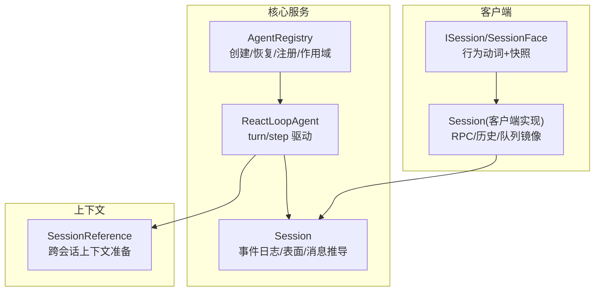
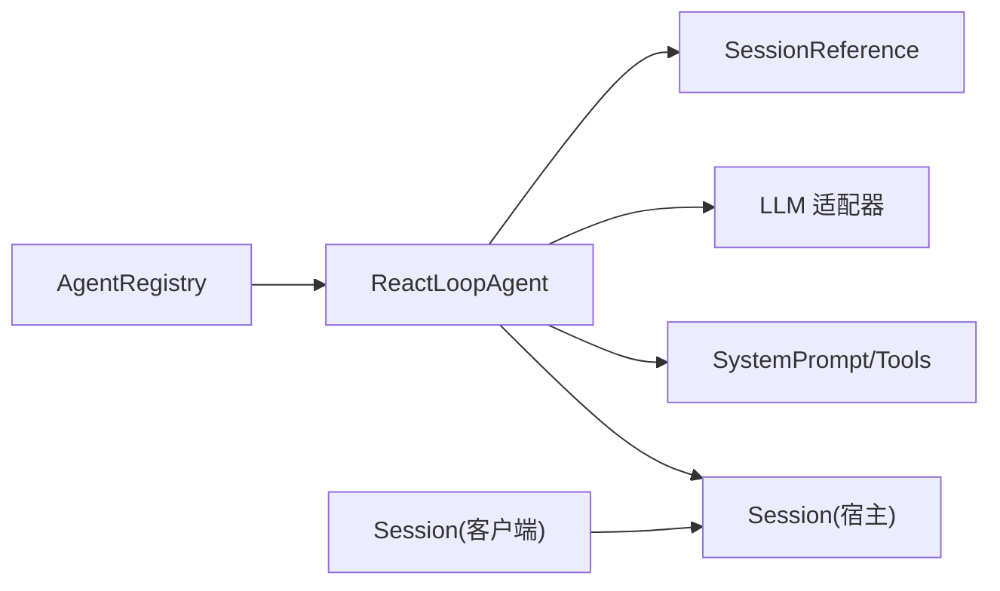

# 核心 API

<cite>
**本文引用的文件**
- [packages/core/agent/src/index.ts](file://packages/core/agent/src/index.ts)
- [packages/core/agent/src/types.ts](file://packages/core/agent/src/types.ts)
- [packages/core/agent-loop/src/agent.ts](file://packages/core/agent-loop/src/agent.ts)
- [packages/core/session/src/types.ts](file://packages/core/session/src/types.ts)
- [packages/core/session/src/index.ts](file://packages/core/session/src/index.ts)
- [packages/client/runtime/src/client/contract/session.ts](file://packages/client/runtime/src/client/contract/session.ts)
- [packages/client/runtime/src/client/sessions/session.ts](file://packages/client/runtime/src/client/sessions/session.ts)
- [packages/context/session-reference/src/types.ts](file://packages/context/session-reference/src/types.ts)
</cite>

## 目录
1. [简介](#简介)
2. [项目结构](#项目结构)
3. [核心组件](#核心组件)
4. [架构总览](#架构总览)
5. [详细组件分析](#详细组件分析)
6. [依赖关系分析](#依赖关系分析)
7. [性能考虑](#性能考虑)
8. [故障排查指南](#故障排查指南)
9. [结论](#结论)
10. [附录：类型与示例](#附录类型与示例)

## 简介
本文件面向需要集成或扩展 DeepSeek Harness 的开发者，系统化文档化 Agent、Session、Context 等核心服务的公共接口。内容涵盖类定义、方法签名、参数类型与返回值、完整 TypeScript 类型说明、调用顺序与依赖关系、错误处理与异常类型、性能与内存管理建议，以及可复用的使用示例路径。

## 项目结构
围绕“会话驱动”的核心由以下模块组成：
- 会话（Session）：事件溯源的不可变日志、有序表面（surface）、消息推导、请求头折叠与上下文元数据。
- Agent：注册表、生命周期、创建/恢复工厂、发起者作用域、事件分发与收件箱。
- Agent 循环（Agent Loop）：将 Session 事件流驱动为 turn/step 边界，组装系统提示、构建 LLM 请求、执行工具调用、维护状态机。
- 客户端会话（Client Session）：对外暴露的行为动词（prompt/cancel/rename/command/loadOlder/readAttachment），以及快照订阅。
- 会话引用（Session Reference）：跨会话上下文准备与投影。



图表来源
- [packages/core/agent/src/index.ts:256-704](file://packages/core/agent/src/index.ts#L256-L704)
- [packages/core/agent-loop/src/agent.ts:64-497](file://packages/core/agent-loop/src/agent.ts#L64-L497)
- [packages/core/session/src/index.ts:425-758](file://packages/core/session/src/index.ts#L425-L758)
- [packages/client/runtime/src/client/contract/session.ts:18-89](file://packages/client/runtime/src/client/contract/session.ts#L18-L89)
- [packages/client/runtime/src/client/sessions/session.ts:65-800](file://packages/client/runtime/src/client/sessions/session.ts#L65-L800)
- [packages/context/session-reference/src/types.ts:1-67](file://packages/context/session-reference/src/types.ts#L1-L67)

章节来源
- [packages/core/agent/src/index.ts:256-704](file://packages/core/agent/src/index.ts#L256-L704)
- [packages/core/agent-loop/src/agent.ts:64-497](file://packages/core/agent-loop/src/agent.ts#L64-L497)
- [packages/core/session/src/index.ts:425-758](file://packages/core/session/src/index.ts#L425-L758)
- [packages/client/runtime/src/client/contract/session.ts:18-89](file://packages/client/runtime/src/client/contract/session.ts#L18-L89)
- [packages/client/runtime/src/client/sessions/session.ts:65-800](file://packages/client/runtime/src/client/sessions/session.ts#L65-L800)
- [packages/context/session-reference/src/types.ts:1-67](file://packages/context/session-reference/src/types.ts#L1-L67)

## 核心组件
- AgentRegistry：进程内 Agent 注册表与作用域，提供 create/resume/register/get/list/roots 等方法，维护创建者与拥有者关系，支持 withInitiator/withoutInitiator 的作用域传播。
- ReactLoopAgent：实现 Agent 接口的驱动，负责 turn/step 边界、系统提示组装、LLM 请求构建、流式响应消费、工具调用执行、取消与保活。
- Session：事件溯源会话，提供 append、deriveMessages、requestHeader/requestContext、surface 等能力；保证事件不可变、JSON 可序列化、序列连续。
- ISession/SessionFace（客户端）：对外暴露 prompt/cancel/rename/command/loadOlder/readAttachment 等行为动词，并作为 ObservableSnapshot 的读取面。
- SessionReference：跨会话上下文的候选、输入与准备结果类型，用于 recall 形式的上下文注入。

章节来源
- [packages/core/agent/src/index.ts:256-704](file://packages/core/agent/src/index.ts#L256-L704)
- [packages/core/agent-loop/src/agent.ts:64-497](file://packages/core/agent-loop/src/agent.ts#L64-L497)
- [packages/core/session/src/index.ts:425-758](file://packages/core/session/src/index.ts#L425-L758)
- [packages/client/runtime/src/client/contract/session.ts:18-89](file://packages/client/runtime/src/client/contract/session.ts#L18-L89)
- [packages/context/session-reference/src/types.ts:1-67](file://packages/context/session-reference/src/types.ts#L1-L67)

## 架构总览
下图展示了从客户端到宿主 Agent 驱动的端到端调用链：客户端通过 ISession 发送指令，进入 Host 侧 Session 层，再由 AgentRegistry 创建的 ReactLoopAgent 驱动 turn/step，最终与 LLM 适配器交互。

```mermaid
sequenceDiagram
participant UI as "客户端"
participant IFace as "ISession/SessionFace"
participant SessC as "Session(客户端)"
participant Reg as "AgentRegistry"
participant Loop as "ReactLoopAgent"
participant SessH as "Session(宿主)"
participant LLM as "LLM 适配器"
UI->>IFace : prompt(content, mode)
IFace->>SessC : prompt(...)
SessC->>SessH : sessions.prompt / subagents.prompt
Note over SessH,LLM : 宿主侧写入 session/event，驱动 turn/step
SessH-->>Loop : 事件驱动 turn/start -> step/start
Loop->>LLM : stream(request)
LLM-->>Loop : chunk* -> finish
Loop->>SessH : assistant/chunk, assistant/message
Loop-->>UI : 通过会话投影/快照更新
```

图表来源
- [packages/client/runtime/src/client/contract/session.ts:30-82](file://packages/client/runtime/src/client/contract/session.ts#L30-L82)
- [packages/client/runtime/src/client/sessions/session.ts:190-362](file://packages/client/runtime/src/client/sessions/session.ts#L190-L362)
- [packages/core/agent-loop/src/agent.ts:246-400](file://packages/core/agent-loop/src/agent.ts#L246-L400)
- [packages/core/session/src/index.ts:604-758](file://packages/core/session/src/index.ts#L604-L758)

## 详细组件分析

### AgentRegistry（Agent 注册与作用域）
- 职责
  - 注册/发现 Agent 工厂，创建或恢复 Agent。
  - 维护 Agent 生命周期（enter/announce/dispose）。
  - 提供 withInitiator/withoutInitiator 建立进程内因果归属。
  - 暴露 get/list/roots/isOwnedBy 查询。
- 关键方法
  - create(options): Promise<AgentHandle>
  - resume(options): Promise<AgentHandle>
  - register(agent): () => void
  - enter(agent, owner): () => void
  - announce(agent): void
  - currentInitiator(): Agent | undefined
  - requireInitiator(): Agent
  - withInitiator(agent, op): T
  - withoutInitiator(op): T
  - get(id): Agent | undefined
  - list(): Agent[]
  - roots(): Agent[]
- 类型要点
  - CreateAgentOptions/ResumeAgentOptions：包含 sessionId/meta/seed/agentOptions/setup/signal。
  - AgentFactory：createAgent/resume。
  - AgentHandle：{ agent, dispose }。
- 错误与异常
  - 未注册工厂时抛出错误。
  - 重复注册相同 id 的 Agent 会拒绝。
  - 在关闭/已释放的作用域中调用 will throw。
- 最佳实践
  - 使用 setup 进行插件级装配，commit 在发布前做最终校验。
  - 通过 withInitiator 包裹异步链路以保留因果归属。
  - 使用 roots() 仅对顶层 Agent 做资源清理。

章节来源
- [packages/core/agent/src/index.ts:80-214](file://packages/core/agent/src/index.ts#L80-L214)
- [packages/core/agent/src/index.ts:256-704](file://packages/core/agent/src/index.ts#L256-L704)

### ReactLoopAgent（Agent 驱动）
- 职责
  - 驱动单个 Session 的 turn/step 边界。
  - 组装系统提示与上下文，构建 LLM 请求，消费流式响应。
  - 执行模型请求的工具调用，维护收件箱（Inbox）与唤醒。
  - 处理取消、错误、最大 token 限制等终止条件。
- 关键方法
  - send(message, target, wakeup): void
  - followup(input): void
  - steer(input): void
  - inject(input): void
  - cancel(cause, options?): void
  - runMaintenance(job): Promise<T>
  - whenIdle(): Promise<void>
  - status: 'idle' | 'running'
- 内部流程
  - turn：打开 turn/start，循环 preStep -> step -> 结束原因判定。
  - step：buildRequest -> stream -> 累积 assistant/chunk -> 生成 assistant/message -> 若含 tool-call 则执行工具调用。
  - 错误：统一包装为 LlmError 或 UNKNOWN 结构化失败。
- 类型要点
  - InboxTarget: 'next-turn' | 'next-step'
  - TurnEndReasonMap：completed/aborted/blocked/error/max-tokens/interrupted
  - EpochHeader/RequestContext：请求头与路由元数据
- 最佳实践
  - 使用 followup/steer/inject 控制消息投递目标与是否唤醒。
  - 通过 runMaintenance 执行不阻塞主循环的后台任务。
  - 监听 agent/status、agent/error 等事件进行观测。

章节来源
- [packages/core/agent-loop/src/agent.ts:64-497](file://packages/core/agent-loop/src/agent.ts#L64-L497)
- [packages/core/agent/src/types.ts:1-28](file://packages/core/agent/src/types.ts#L1-L28)
- [packages/core/session/src/types.ts:142-229](file://packages/core/session/src/types.ts#L142-L229)

### Session（事件溯源与会话）
- 职责
  - 维护不可变的事件日志与有序表面（surface）。
  - 提供 append、deriveMessages、requestHeader/requestContext 等能力。
  - 保证事件 JSON 可序列化、序列连续、表面操作合法。
- 关键方法
  - static create(id, seed?, header?): Session
  - static fromRestore(id, seed, header): Session
  - append(type, data, opts?): SessionEvent
  - deriveMessages(): Message[]
  - requestHeader(): EpochHeader | undefined
  - requestContext(): RequestContext | undefined
  - surface: SessionSurface
  - events: readonly SessionEvent[]
  - seq: number
- 类型要点
  - SessionEventMap：turn/start/end、step/start/end、user/message、assistant/chunk/message、tool/call/result、todo/write、request/header/context、session/end-seed。
  - SurfaceEventType：user/message、assistant/message、tool/result
  - SurfaceOp：append | { op:'replace', start, end }
  - SurfaceIntent：surfaceOp + sourceEventSeqs
- 错误与异常
  - 非 JSON 可序列化数据、非法表面操作、重复追加重入、版本不兼容等会抛出错误。
- 最佳实践
  - 所有消息型事件必须携带 SurfaceIntent。
  - 使用 deriveMessages 获取模型可见的历史消息。
  - 通过 requestHeader/requestContext 追踪请求配置与路由变化。

章节来源
- [packages/core/session/src/types.ts:21-437](file://packages/core/session/src/types.ts#L21-L437)
- [packages/core/session/src/index.ts:425-758](file://packages/core/session/src/index.ts#L425-L758)

### ISession/SessionFace（客户端会话）
- 职责
  - 向外部暴露会话行为动词与只读快照。
- 关键方法
  - prompt(content, mode): Promise<RpcResult<{ accepted: true }>>
  - readAttachment(attachmentId): Promise<RpcResult<{ attachment, data }>>
  - updateQueue(itemId, action): Promise<RpcResult<{ accepted: true }>>
  - cancel(): Promise<RpcResult<{ accepted: true }>>
  - rename(title): Promise<RpcResult<{ title, seq }>>
  - loadOlder(): Promise<void>
  - command(line): Promise<RemoteResult<{ matched: boolean }>>
- 类型要点
  - ProjectionsFace：faceOf(key) 返回可观察投影值。
  - SessionFace = ISession & ObservableSnapshot<ConversationSnapshot>
- 最佳实践
  - 使用 queue/steer 模式控制插入位置与中断行为。
  - 通过 projections.faceOf 订阅投影值变更。
  - 处理 RpcResult 的 ok:false 分支，避免吞错。

章节来源
- [packages/client/runtime/src/client/contract/session.ts:18-89](file://packages/client/runtime/src/client/contract/session.ts#L18-L89)

### Session（客户端实现）
- 职责
  - 维护事件窗口、派生对话状态、Observable 快照。
  - 处理历史分页、连接重建、子代理地址切换、待处理交互（审批/问答）。
- 关键方法
  - open()/resync()/loadOlder()
  - handleMuxEnvelope(rpcId, frame)
  - handleRunning(running)
  - configureSubagent(address, parentAvailable?)
  - handleBlank(blank)/handleRemoved()/handleAgentError(msg)
- 最佳实践
  - 首次 prompt 成功后才认为会话“参与”（blankBit 翻转）。
  - 连接断开后调用 resync 重建窗口。
  - 子代理模式下注意图片输入与中断的限制。

章节来源
- [packages/client/runtime/src/client/sessions/session.ts:65-800](file://packages/client/runtime/src/client/sessions/session.ts#L65-L800)

### SessionReference（跨会话上下文）
- 职责
  - 描述跨会话引用的源、候选、输入与准备后的消息内容。
- 类型要点
  - SessionReferenceSource：recall 形式，包含 capturedThroughSeq、compacted、original/retained/omitted 计数等。
  - SessionReferenceInput：sessionId + label。
  - SessionReferenceCandidate：label/cwd/createdAt。
  - PreparedReferencedMessage：content + additionalContext。
  - ReferencedConversationItem：role/text。
- 最佳实践
  - 在系统提示或上下文组装阶段引入 recall 上下文，减少冗余信息。
  - 关注 truncated/omittedBytes 等指标评估上下文质量。

章节来源
- [packages/context/session-reference/src/types.ts:1-67](file://packages/context/session-reference/src/types.ts#L1-L67)

## 依赖关系分析
- AgentRegistry 依赖 Cordis Context 与 Typert 协议，提供 Agent 工厂委托与生命周期管理。
- ReactLoopAgent 依赖 Session、System Prompt、LLM 适配器、Scope、Inbox 等，驱动 turn/step。
- Session 是核心数据载体，被 Agent 循环与客户端会话共同消费。
- 客户端 Session 通过 RPC 与宿主 Session 通信，并维护本地窗口与投影。
- SessionReference 作为上下文增强项，供系统提示或上下文组装使用。



图表来源
- [packages/core/agent/src/index.ts:256-704](file://packages/core/agent/src/index.ts#L256-L704)
- [packages/core/agent-loop/src/agent.ts:64-497](file://packages/core/agent-loop/src/agent.ts#L64-L497)
- [packages/core/session/src/index.ts:425-758](file://packages/core/session/src/index.ts#L425-L758)
- [packages/client/runtime/src/client/sessions/session.ts:65-800](file://packages/client/runtime/src/client/sessions/session.ts#L65-L800)
- [packages/context/session-reference/src/types.ts:1-67](file://packages/context/session-reference/src/types.ts#L1-L67)

章节来源
- [packages/core/agent/src/index.ts:256-704](file://packages/core/agent/src/index.ts#L256-L704)
- [packages/core/agent-loop/src/agent.ts:64-497](file://packages/core/agent-loop/src/agent.ts#L64-L497)
- [packages/core/session/src/index.ts:425-758](file://packages/core/session/src/index.ts#L425-L758)
- [packages/client/runtime/src/client/sessions/session.ts:65-800](file://packages/client/runtime/src/client/sessions/session.ts#L65-L800)
- [packages/context/session-reference/src/types.ts:1-67](file://packages/context/session-reference/src/types.ts#L1-L67)

## 性能考虑
- 事件与消息推导缓存
  - Session.deriveMessages 按 surface 节点增量计算，避免全量重建。
  - requestHeader/requestContext 采用折叠缓存，O(新事件) 增量更新。
- 流式响应
  - 使用 BlockAssembler 累积块，减少中间对象分配。
  - assistant/chunk 直接追加，assistant/message 延迟合成。
- 内存管理
  - 事件数据深冻结，避免拷贝与意外修改。
  - 客户端 Session 维护事件窗口与 liveBuffer，断连时 gap repair 拉取尾部页，避免全量重放。
- 取消与保活
  - AbortController 贯穿 turn/step，及时中止 I/O 与模型调用。
  - runMaintenance 隔离后台任务，避免阻塞主循环。

[本节为通用性能指导，无需特定文件来源]

## 故障排查指南
- 常见错误
  - 未注册 Agent 工厂：检查 setFactory 是否被调用。
  - 重复注册 Agent：确保同一 id 仅注册一次。
  - 非 JSON 可序列化数据：确保 event.data 与 surface metadata 可序列化。
  - 非法表面操作：确保 surfaceOp/sourceEventSeqs 符合契约。
  - 子代理限制：one-shot 子代理不支持 prompt/cancel，且图片输入受限。
- 定位步骤
  - 监听 session/event、agent/status、agent/error 等事件。
  - 检查 request.header 与 request.context 的变化。
  - 查看客户端 Session.openState/openError/promptError。
  - 对于断连场景，确认 resync 是否成功重建窗口。
- 恢复策略
  - 使用 resume 加载持久化会话。
  - 通过 loadOlder 拉取更早历史。
  - 对工具调用失败，利用 request-error 水线进行重试或降级。

章节来源
- [packages/core/agent/src/index.ts:216-220](file://packages/core/agent/src/index.ts#L216-L220)
- [packages/core/session/src/index.ts:599-655](file://packages/core/session/src/index.ts#L599-L655)
- [packages/client/runtime/src/client/sessions/session.ts:190-362](file://packages/client/runtime/src/client/sessions/session.ts#L190-L362)
- [packages/core/agent-loop/src/agent.ts:332-400](file://packages/core/agent-loop/src/agent.ts#L332-L400)

## 结论
本仓库的核心 API 围绕“事件溯源会话 + Agent 驱动”展开：Session 提供不可变日志与消息推导，AgentRegistry 管理 Agent 生命周期与作用域，ReactLoopAgent 将事件转化为 turn/step 的执行流，客户端 Session 暴露简洁的行为动词与快照。遵循类型契约、正确设置 SurfaceIntent、合理使用取消与缓存，可获得稳定、高性能且易排错的集成体验。

[本节为总结性内容，无需特定文件来源]

## 附录：类型与示例

### 类型速查
- AgentRegistry
  - create(options): Promise<AgentHandle>
  - resume(options): Promise<AgentHandle>
  - register(agent): () => void
  - enter(agent, owner): () => void
  - announce(agent): void
  - currentInitiator(): Agent | undefined
  - requireInitiator(): Agent
  - withInitiator(agent, op): T
  - withoutInitiator(op): T
  - get(id): Agent | undefined
  - list(): Agent[]
  - roots(): Agent[]
- ReactLoopAgent
  - send(message, target, wakeup): void
  - followup(input): void
  - steer(input): void
  - inject(input): void
  - cancel(cause, options?): void
  - runMaintenance(job): Promise<T>
  - whenIdle(): Promise<void>
  - status: 'idle' | 'running'
- Session
  - static create(id, seed?, header?): Session
  - static fromRestore(id, seed, header): Session
  - append(type, data, opts?): SessionEvent
  - deriveMessages(): Message[]
  - requestHeader(): EpochHeader | undefined
  - requestContext(): RequestContext | undefined
  - surface: SessionSurface
  - events: readonly SessionEvent[]
  - seq: number
- ISession/SessionFace
  - prompt(content, mode): Promise<RpcResult<{ accepted: true }>>
  - readAttachment(attachmentId): Promise<RpcResult<{ attachment, data }>>
  - updateQueue(itemId, action): Promise<RpcResult<{ accepted: true }>>
  - cancel(): Promise<RpcResult<{ accepted: true }>>
  - rename(title): Promise<RpcResult<{ title, seq }>>
  - loadOlder(): Promise<void>
  - command(line): Promise<RemoteResult<{ matched: boolean }>>

章节来源
- [packages/core/agent/src/index.ts:80-214](file://packages/core/agent/src/index.ts#L80-L214)
- [packages/core/agent/src/index.ts:256-704](file://packages/core/agent/src/index.ts#L256-L704)
- [packages/core/agent-loop/src/agent.ts:64-497](file://packages/core/agent-loop/src/agent.ts#L64-L497)
- [packages/core/session/src/index.ts:425-758](file://packages/core/session/src/index.ts#L425-L758)
- [packages/client/runtime/src/client/contract/session.ts:18-89](file://packages/client/runtime/src/client/contract/session.ts#L18-L89)

### 使用示例（路径指引）
- 创建并启动 Agent
  - 参考：[packages/core/agent/src/index.ts:405-430](file://packages/core/agent/src/index.ts#L405-L430)
- 驱动 turn/step 与工具调用
  - 参考：[packages/core/agent-loop/src/agent.ts:246-400](file://packages/core/agent-loop/src/agent.ts#L246-L400)
- 写入会话事件与推导消息
  - 参考：[packages/core/session/src/index.ts:604-758](file://packages/core/session/src/index.ts#L604-L758)
- 客户端发送提示与取消
  - 参考：[packages/client/runtime/src/client/sessions/session.ts:190-362](file://packages/client/runtime/src/client/sessions/session.ts#L190-L362)
- 跨会话上下文注入
  - 参考：[packages/context/session-reference/src/types.ts:1-67](file://packages/context/session-reference/src/types.ts#L1-L67)

[本节为示例路径指引，不包含具体代码内容]