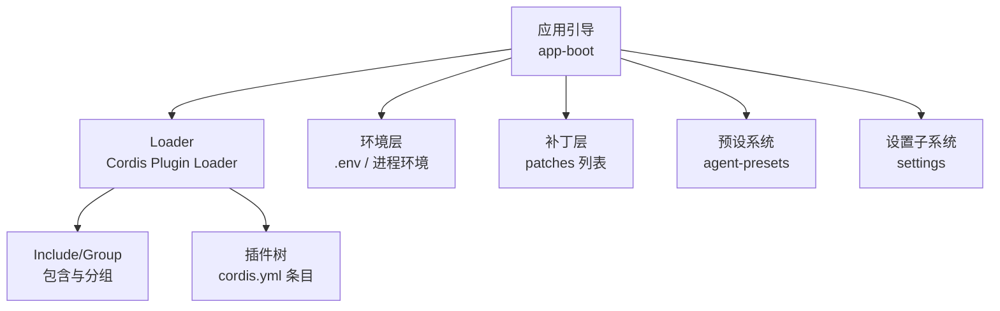
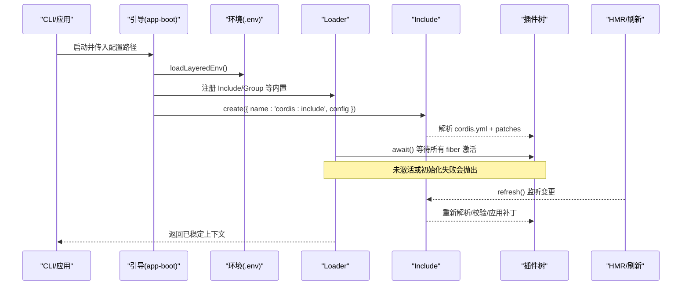
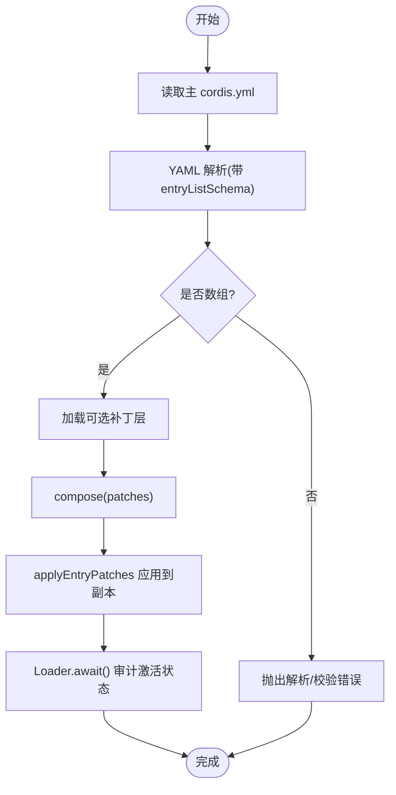
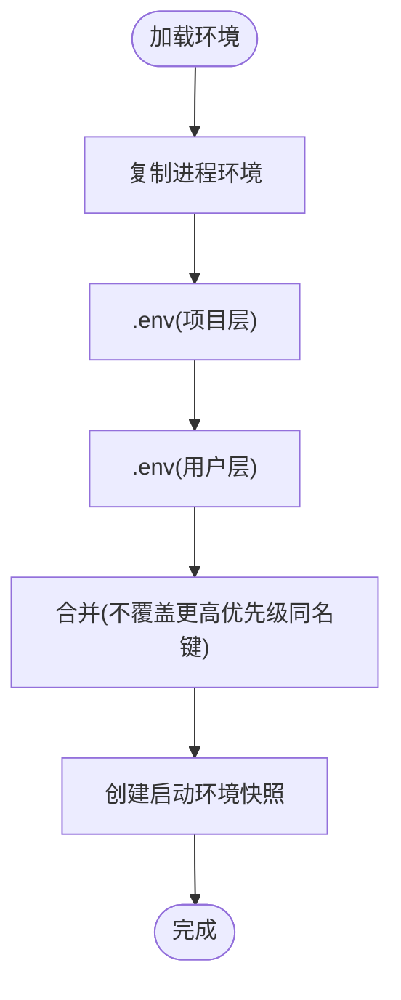
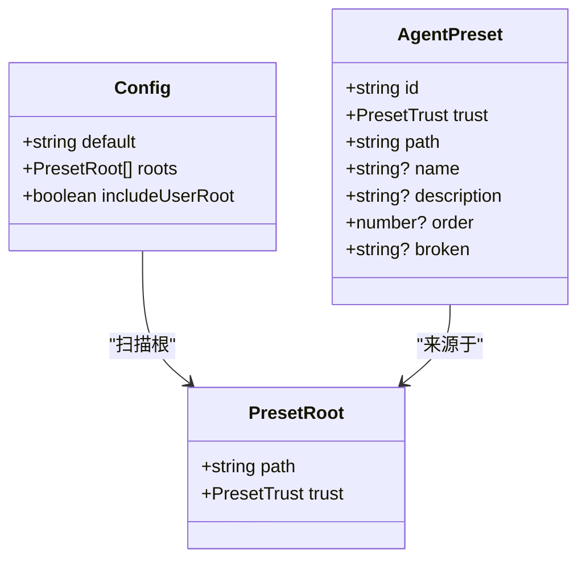
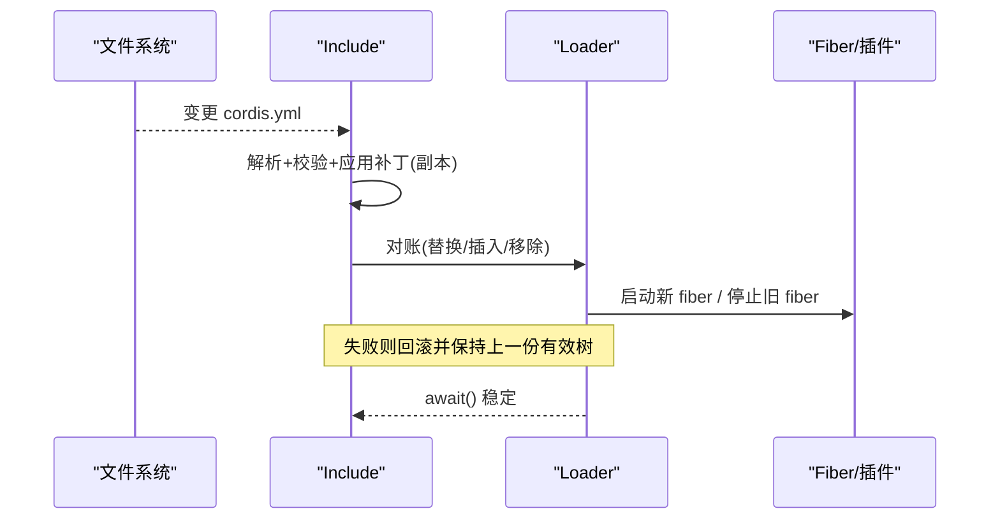
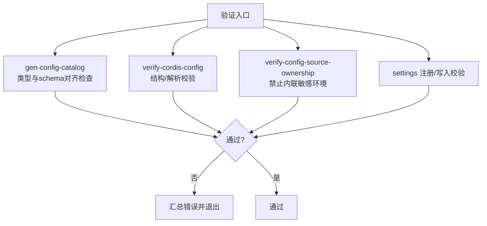
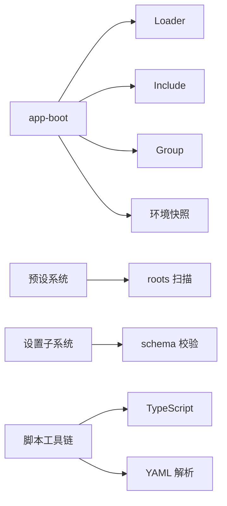

# 配置 API

<cite>
**本文引用的文件**
- [packages/boot/app-boot/src/index.ts](file://packages/boot/app-boot/src/index.ts)
- [apps/cli/config/agent-presets/standard/preset.yml](file://apps/cli/config/agent-presets/standard/preset.yml)
- [examples/acp-agent/cordis.yml](file://examples/acp-agent/cordis.yml)
- [scripts/gen-config-catalog.ts](file://scripts/gen-config-catalog.ts)
- [scripts/verify-cordis-config.ts](file://scripts/verify-cordis-config.ts)
- [scripts/verify-config-source-ownership.ts](file://scripts/verify-config-source-ownership.ts)
- [packages/settings/settings-file/src/index.ts](file://packages/settings/settings-file/src/index.ts)
- [docs/subsystems/settings.md](file://docs/subsystems/settings.md)
- [packages/preset/agent-presets/src/preset.ts](file://packages/preset/agent-presets/src/preset.ts)
- [packages/boot/app-boot/tests/config-reload.spec.ts](file://packages/boot/app-boot/tests/config-reload.spec.ts)
- [packages/boot/app-boot/tests/user-patches.spec.ts](file://packages/boot/app-boot/tests/user-patches.spec.ts)
- [packages/boot/app-boot/tests/app-boot.spec.ts](file://packages/boot/app-boot/tests/app-boot.spec.ts)
</cite>

## 目录
1. [简介](#简介)
2. [项目结构](#项目结构)
3. [核心组件](#核心组件)
4. [架构总览](#架构总览)
5. [详细组件分析](#详细组件分析)
6. [依赖关系分析](#依赖关系分析)
7. [性能考虑](#性能考虑)
8. [故障排查指南](#故障排查指南)
9. [结论](#结论)
10. [附录：配置示例与模板](#附录配置示例与模板)

## 简介
本文件为 DeepSeek Harness 配置系统的完整 API 文档，覆盖配置的加载、合并、验证、预设管理、动态更新与热重载、安全与权限控制、错误处理以及最佳实践。系统以 Cordis Loader 为核心，通过 YAML 配置文件（cordis.yml）声明插件树，结合环境变量、用户补丁层与预设机制，实现可组合、可观测、可热更新的运行时配置。

## 项目结构
- 启动与引导
  - 应用引导入口负责解析配置路径、加载 .env、安装 Loader 守卫、注入 Include/Group 等内置能力，并驱动 Loader 直到整棵树稳定。
- 配置文件
  - cordis.yml：根级数组，每个元素是一个 Loader Entry（id/name/config）。
  - 可选补丁层：用户或部署层的 patches 列表，按顺序叠加。
- 预设
  - agent-presets：扫描根目录下的 preset 子目录，提供默认与可选择的 Agent 组合。
- 设置（Settings）
  - settings 子系统提供命名空间化的用户设置，支持 schema 校验、持久化、监听与热更新。
- 工具与校验
  - 生成配置目录（config catalog）、校验 cordis 配置、校验配置来源所有权（禁止在 shipped 配置中内联敏感环境变量）。

图表来源
- [packages/boot/app-boot/src/index.ts:1-200](file://packages/boot/app-boot/src/index.ts#L1-L200)
- [packages/boot/app-boot/src/index.ts:727-746](file://packages/boot/app-boot/src/index.ts#L727-L746)
- [packages/preset/agent-presets/src/preset.ts:51-62](file://packages/preset/agent-presets/src/preset.ts#L51-L62)
- [docs/subsystems/settings.md:1-60](file://docs/subsystems/settings.md#L1-L60)

章节来源
- [packages/boot/app-boot/src/index.ts:1-200](file://packages/boot/app-boot/src/index.ts#L1-L200)
- [packages/boot/app-boot/src/index.ts:727-746](file://packages/boot/app-boot/src/index.ts#L727-L746)

## 核心组件
- 引导与环境加载
  - 解析配置路径（回放模式替换文件名）。
  - 分层加载 .env（项目层 > 用户层），拒绝“仅允许进程继承”的变量名。
  - 安装 Loader 失败即报错守卫，确保启动期问题显式暴露。
- 配置加载与合并
  - 使用 Include 读取主 cordis.yml，支持 patches 列表进行覆盖与插入。
  - 支持 !!js 表达式在配置中引用上下文（如 process.env、ctx.get(...)）。
- 预设管理
  - 扫描 roots 下的 preset 目录，维护 trust（system/user）与排序 order。
  - 支持默认预设与用户预设根的追加策略。
- 设置（Settings）
  - 命名空间注册、schema 校验、base/base+user 三层合并、持久化与监听。
  - 支持路径级操作（set/unset）与冲突检测（revision）。
- 校验与生成
  - 生成配置目录（从源码类型与 schema 提取声明）。
  - 校验 cordis 配置结构与插件解析。
  - 校验 shipped 配置不得内联敏感环境变量。

章节来源
- [packages/boot/app-boot/src/index.ts:61-90](file://packages/boot/app-boot/src/index.ts#L61-L90)
- [packages/boot/app-boot/src/index.ts:119-198](file://packages/boot/app-boot/src/index.ts#L119-L198)
- [packages/boot/app-boot/src/index.ts:267-287](file://packages/boot/app-boot/src/index.ts#L267-L287)
- [packages/preset/agent-presets/src/preset.ts:51-62](file://packages/preset/agent-presets/src/preset.ts#L51-L62)
- [docs/subsystems/settings.md:18-60](file://docs/subsystems/settings.md#L18-L60)
- [scripts/gen-config-catalog.ts:1-20](file://scripts/gen-config-catalog.ts#L1-L20)
- [scripts/verify-cordis-config.ts:69-99](file://scripts/verify-cordis-config.ts#L69-L99)
- [scripts/verify-config-source-ownership.ts:25-56](file://scripts/verify-config-source-ownership.ts#L25-L56)

## 架构总览
下图展示从引导到最终插件树稳定的关键流程，包括环境加载、Include 解析、补丁应用、HMR 刷新与审计。

图表来源
- [packages/boot/app-boot/src/index.ts:177-198](file://packages/boot/app-boot/src/index.ts#L177-L198)
- [packages/boot/app-boot/src/index.ts:727-746](file://packages/boot/app-boot/src/index.ts#L727-L746)
- [packages/boot/app-boot/tests/config-reload.spec.ts:61-85](file://packages/boot/app-boot/tests/config-reload.spec.ts#L61-L85)

## 详细组件分析

### 配置加载与合并（cordis.yml 与补丁层）
- 入口函数 boot 将 Include 作为内置挂载，读取主 cordis.yml，并将可选补丁层 compose 后应用到 Include 的配置中。
- 补丁层支持 id-targeted 覆盖与 insert 插入；匹配不到行的补丁会通过 warn 报告。
- 支持 !!js 表达式，可在 Include 的 patches 行内引用 ctx 或 process.env。

图表来源
- [packages/boot/app-boot/src/index.ts:367-397](file://packages/boot/app-boot/src/index.ts#L367-L397)
- [packages/boot/app-boot/src/index.ts:267-287](file://packages/boot/app-boot/src/index.ts#L267-L287)
- [packages/boot/app-boot/tests/user-patches.spec.ts:112-143](file://packages/boot/app-boot/tests/user-patches.spec.ts#L112-L143)

章节来源
- [packages/boot/app-boot/src/index.ts:367-397](file://packages/boot/app-boot/src/index.ts#L367-L397)
- [packages/boot/app-boot/src/index.ts:267-287](file://packages/boot/app-boot/src/index.ts#L267-L287)
- [packages/boot/app-boot/tests/user-patches.spec.ts:112-143](file://packages/boot/app-boot/tests/user-patches.spec.ts#L112-L143)

### 环境变量与 .env 分层
- 分层顺序：进程继承 > 项目 .env > 用户 .env（Harness home）。
- 严格白名单：某些变量名仅允许来自进程继承，禁止在 .env 中设置（例如 PATH、NODE_*、SSL_*、代理相关等）。
- 解析时先校验再应用，避免部分生效导致的不一致。

图表来源
- [packages/boot/app-boot/src/index.ts:119-198](file://packages/boot/app-boot/src/index.ts#L119-L198)

章节来源
- [packages/boot/app-boot/src/index.ts:119-198](file://packages/boot/app-boot/src/index.ts#L119-L198)

### 预设配置管理与继承
- 预设由目录构成，id 受限于安全字符集；trust 标记 system/user。
- 配置项 default 指定默认预设；roots 定义扫描根及信任级别；includeUserRoot 决定是否追加用户预设根。
- 预设元数据（name/description/order）用于 UI 展示与排序。

图表来源
- [packages/preset/agent-presets/src/preset.ts:20-49](file://packages/preset/agent-presets/src/preset.ts#L20-L49)
- [packages/preset/agent-presets/src/preset.ts:51-62](file://packages/preset/agent-presets/src/preset.ts#L51-L62)

章节来源
- [packages/preset/agent-presets/src/preset.ts:20-49](file://packages/preset/agent-presets/src/preset.ts#L20-L49)
- [packages/preset/agent-presets/src/preset.ts:51-62](file://packages/preset/agent-presets/src/preset.ts#L51-L62)
- [apps/cli/config/agent-presets/standard/preset.yml:1-4](file://apps/cli/config/agent-presets/standard/preset.yml#L1-L4)

### 动态配置更新与热重载
- Include.refresh() 支持对 cordis.yml 的实时监听与串行化刷新；失败不会破坏上一份有效树。
- Loader 支持 entry.update() 动态替换插件名称或配置，并在替换前导入新模块，成功后才提交。
- HMR 收容刷新 rejection，并通过事件广播失败；观察者记录但不阻塞后续刷新。

图表来源
- [packages/boot/app-boot/tests/config-reload.spec.ts:61-104](file://packages/boot/app-boot/tests/config-reload.spec.ts#L61-L104)
- [packages/boot/app-boot/tests/config-reload.spec.ts:282-309](file://packages/boot/app-boot/tests/config-reload.spec.ts#L282-L309)

章节来源
- [packages/boot/app-boot/tests/config-reload.spec.ts:61-104](file://packages/boot/app-boot/tests/config-reload.spec.ts#L61-L104)
- [packages/boot/app-boot/tests/config-reload.spec.ts:282-309](file://packages/boot/app-boot/tests/config-reload.spec.ts#L282-L309)

### 配置验证规则与错误处理
- 配置 schema 与类型一致性：生成器强制 schema 校验的键必须在配置类型中声明，否则硬错误。
- cordis 配置校验：根必须为数组，每个 entry 需满足元数据约束，插件包解析需正确。
- 来源所有权校验：shipped 配置不得内联敏感环境变量，必须通过 credentials/环境快照通道获取。
- 设置子系统：注册时若已有存储值非法，直接拒绝注册；写入时 validate 失败拒绝持久化。

图表来源
- [scripts/gen-config-catalog.ts:756-767](file://scripts/gen-config-catalog.ts#L756-L767)
- [scripts/verify-cordis-config.ts:69-99](file://scripts/verify-cordis-config.ts#L69-L99)
- [scripts/verify-config-source-ownership.ts:25-56](file://scripts/verify-config-source-ownership.ts#L25-L56)
- [docs/subsystems/settings.md:18-60](file://docs/subsystems/settings.md#L18-L60)

章节来源
- [scripts/gen-config-catalog.ts:756-767](file://scripts/gen-config-catalog.ts#L756-L767)
- [scripts/verify-cordis-config.ts:69-99](file://scripts/verify-cordis-config.ts#L69-L99)
- [scripts/verify-config-source-ownership.ts:25-56](file://scripts/verify-config-source-ownership.ts#L25-L56)
- [docs/subsystems/settings.md:18-60](file://docs/subsystems/settings.md#L18-L60)

### 安全性与权限控制
- 环境变量保护：BOOTSTRAP_NAMES/PREFIXES 阻止 .env 覆盖关键进程/网络/解释器变量。
- 沙箱与权限模式：通过 sandbox-policy 与 approval 策略控制危险能力（如全量访问 vs 工作区写入）。
- 设置机密字段：settings 支持 role('secret') 字段，描述时可选择脱敏，传输面必须脱敏。
- 预设信任：system 与 user 预设区分信任等级，用户预设具有 shell 级别的信任。

章节来源
- [packages/boot/app-boot/src/index.ts:92-128](file://packages/boot/app-boot/src/index.ts#L92-L128)
- [examples/acp-agent/cordis.yml:18-46](file://examples/acp-agent/cordis.yml#L18-L46)
- [docs/subsystems/settings.md:96-153](file://docs/subsystems/settings.md#L96-L153)
- [packages/preset/agent-presets/src/preset.ts:3-8](file://packages/preset/agent-presets/src/preset.ts#L3-L8)

### 配置示例与模板
- 最小可用 cordis.yml：一个 leaf 插件条目，id/name 必填，config 可选。
- 复杂示例：ACP 自动化服务配置，包含 LLM、沙箱、审批、工具、工作流等。
- 预设元数据：name/description/order 用于 UI 展示与排序。

章节来源
- [examples/acp-agent/cordis.yml:1-193](file://examples/acp-agent/cordis.yml#L1-L193)
- [apps/cli/config/agent-presets/standard/preset.yml:1-4](file://apps/cli/config/agent-presets/standard/preset.yml#L1-L4)

## 依赖关系分析
- app-boot 依赖 Cordis Loader、Include、Group、环境路径解析、启动环境快照。
- 预设系统依赖 roots 扫描与 trust 模型。
- settings 子系统提供命名空间注册、schema 校验、持久化与事件。
- 脚本工具链依赖 TypeScript 与 YAML 解析，保证配置与类型一致。

图表来源
- [packages/boot/app-boot/src/index.ts:1-200](file://packages/boot/app-boot/src/index.ts#L1-L200)
- [packages/preset/agent-presets/src/preset.ts:51-62](file://packages/preset/agent-presets/src/preset.ts#L51-L62)
- [docs/subsystems/settings.md:18-60](file://docs/subsystems/settings.md#L18-L60)
- [scripts/gen-config-catalog.ts:1-20](file://scripts/gen-config-catalog.ts#L1-L20)

章节来源
- [packages/boot/app-boot/src/index.ts:1-200](file://packages/boot/app-boot/src/index.ts#L1-L200)
- [packages/preset/agent-presets/src/preset.ts:51-62](file://packages/preset/agent-presets/src/preset.ts#L51-L62)
- [docs/subsystems/settings.md:18-60](file://docs/subsystems/settings.md#L18-L60)
- [scripts/gen-config-catalog.ts:1-20](file://scripts/gen-config-catalog.ts#L1-L20)

## 性能考虑
- Include.refresh() 串行化刷新，避免并发竞争；失败不破坏上一份有效树。
- Loader.await() 等待所有 fiber 激活，减少不稳定状态对外暴露。
- 设置更新序列化，避免并发写导致的竞态；deep-freeze 保证只读快照。
- 大文件与高吞吐场景建议合理设置超时与内存限制（如 bash 输出上限、代码运行 worker 预算）。

章节来源
- [packages/boot/app-boot/tests/config-reload.spec.ts:61-104](file://packages/boot/app-boot/tests/config-reload.spec.ts#L61-L104)
- [docs/subsystems/settings.md:60-95](file://docs/subsystems/settings.md#L60-L95)

## 故障排查指南
- 配置解析失败：检查 cordis.yml 是否为数组、语法是否正确；空文件会被视为无效。
- 补丁未生效：确认补丁 id 匹配；未匹配的补丁会 warn；检查 patches 层级顺序。
- 环境变量被拒绝：确认未在内置白名单变量中使用 .env；如需设置请通过进程环境导出。
- 预设未找到：检查 default 是否存在于 roots；用户预设根是否启用 includeUserRoot。
- 设置写入失败：检查 schema 与 validate；使用 expectedRevision 避免并发冲突。

章节来源
- [packages/boot/app-boot/tests/config-reload.spec.ts:61-85](file://packages/boot/app-boot/tests/config-reload.spec.ts#L61-L85)
- [packages/boot/app-boot/tests/app-boot.spec.ts:528-559](file://packages/boot/app-boot/tests/app-boot.spec.ts#L528-L559)
- [packages/settings/settings-file/src/index.ts:271-295](file://packages/settings/settings-file/src/index.ts#L271-L295)
- [packages/preset/agent-presets/src/preset.ts:64-80](file://packages/preset/agent-presets/src/preset.ts#L64-L80)

## 结论
DeepSeek Harness 的配置系统以 Loader 为中心，结合分层环境、补丁层与预设机制，提供了强大的组合与扩展能力。通过严格的校验与安全的权限控制，系统在保持灵活性的同时确保了稳定性与安全性。动态更新与热重载使得配置变更可即时生效且具备回滚能力。遵循本文的最佳实践与示例，可以高效构建可维护、可扩展的部署配置。

## 附录：配置示例与模板
- 基础 cordis.yml 片段：包含一个 leaf 插件条目。
- ACP 示例：涵盖 LLM、沙箱、审批、工具与工作流的完整配置。
- 预设元数据：name/description/order 用于 UI 展示与排序。

章节来源
- [examples/acp-agent/cordis.yml:1-193](file://examples/acp-agent/cordis.yml#L1-L193)
- [apps/cli/config/agent-presets/standard/preset.yml:1-4](file://apps/cli/config/agent-presets/standard/preset.yml#L1-L4)