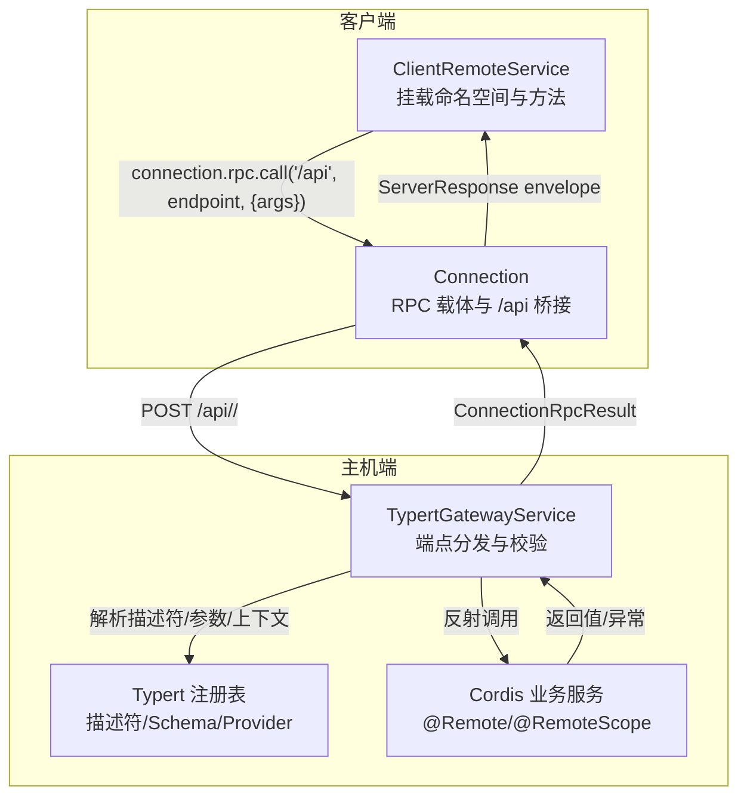
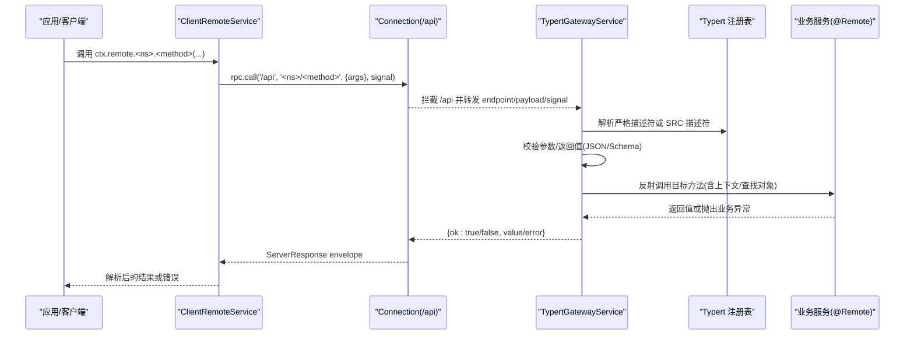
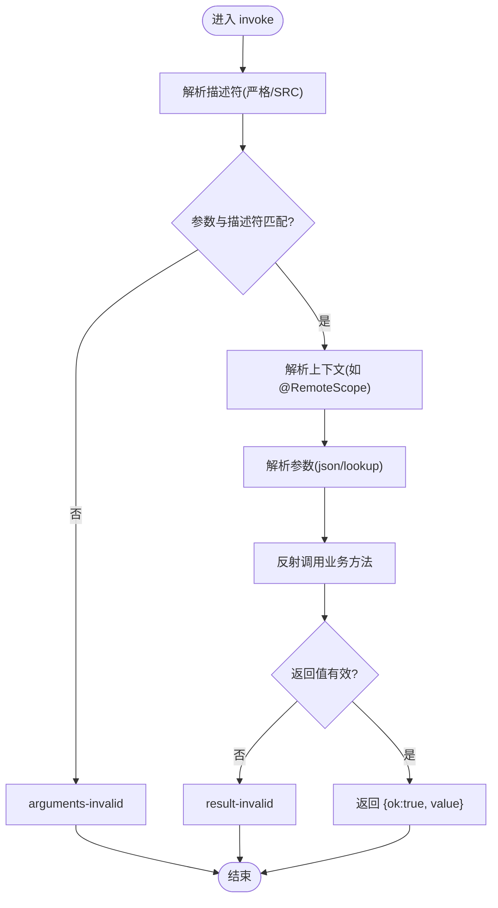
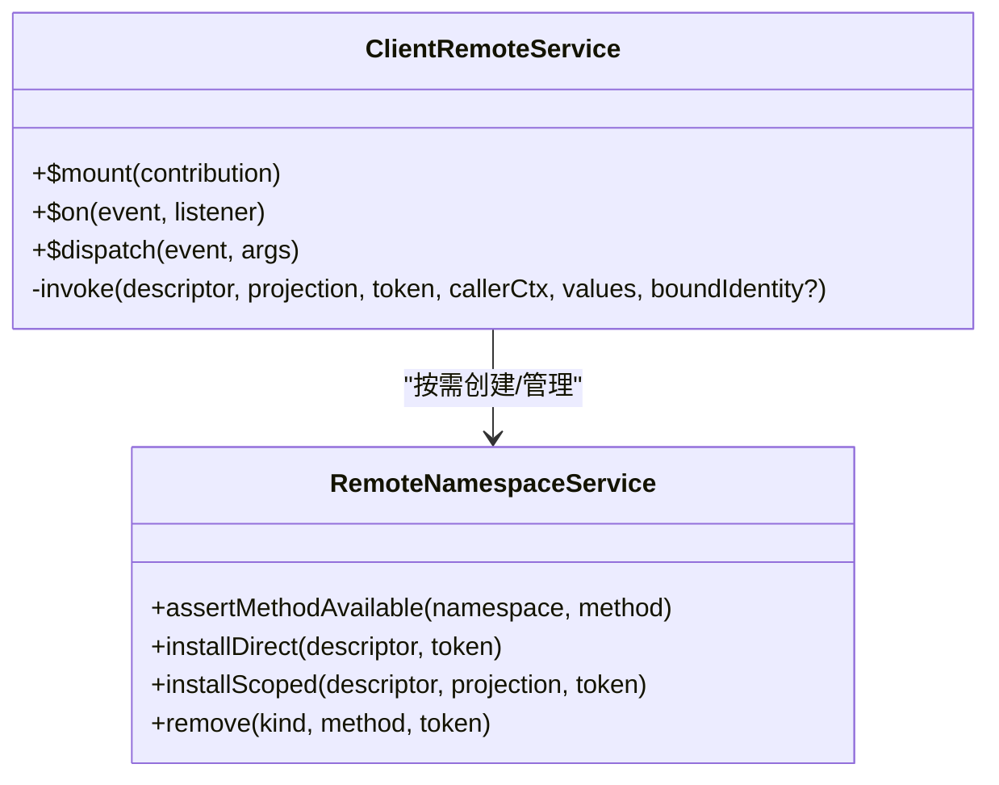
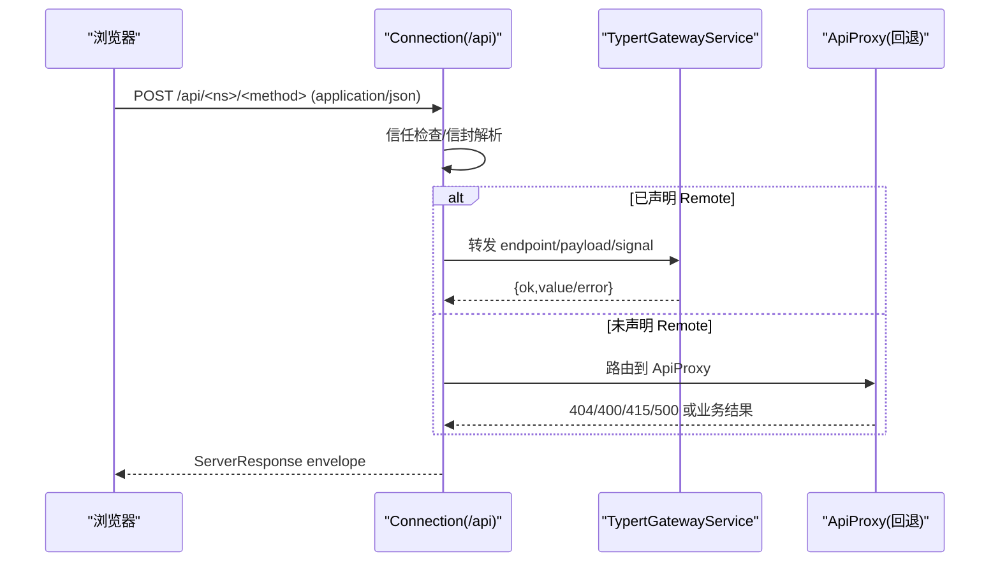
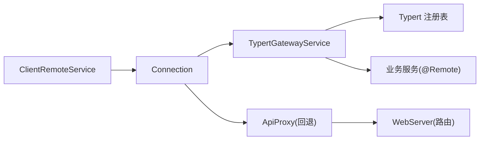

# API 网关

<cite>
**本文引用的文件**
- [packages/api/gateway/src/index.ts](file://packages/api/gateway/src/index.ts)
- [packages/api/gateway/src/types.ts](file://packages/api/gateway/src/types.ts)
- [packages/api/gateway/src/client/index.ts](file://packages/api/gateway/src/client/index.ts)
- [packages/client/connection/src/index.ts](file://packages/client/connection/src/index.ts)
- [packages/client/connection/src/rpc-host.ts](file://packages/client/connection/src/rpc-host.ts)
- [packages/host/apiproxy/src/fetch/handler.ts](file://packages/host/apiproxy/src/fetch/handler.ts)
- [docs/api-gateway.md](file://docs/api-gateway.md)
- [docs/subsystems/web-server.md](file://docs/subsystems/web-server.md)
</cite>

## 目录
1. [简介](#简介)
2. [项目结构](#项目结构)
3. [核心组件](#核心组件)
4. [架构总览](#架构总览)
5. [详细组件分析](#详细组件分析)
6. [依赖关系分析](#依赖关系分析)
7. [性能与扩展性](#性能与扩展性)
8. [故障排查指南](#故障排查指南)
9. [结论](#结论)
10. [附录](#附录)

## 简介
本文件为 Typert API 网关的权威参考，覆盖 RESTful 风格的 HTTP 桥接、JSON-RPC 消息格式、认证与授权边界、请求路由与中间件处理流程、版本管理与向后兼容策略、错误处理标准与响应格式、限流与防抖机制现状、客户端集成方式以及测试与调试方法。该网关通过严格的构建期生成契约（Host 与 Client）与运行时分发器，将业务服务暴露为远程方法，并通过 Connection 提供的 `/api` 通道进行跨进程/跨边界的调用。

## 项目结构
API 网关由“严格生成 + 运行时分发”两部分组成：
- 共享协议与装饰器：定义 Remote 标记、查找映射、上下文绑定、编解码器类型等。
- 构建期生成：从 Host 侧 ts.Program 中抽取签名、参数、返回值、查找键与上下文信息，产出 Host 反射描述与 Client 端可挂载的贡献。
- 主机端分发：TypertGatewayService 注册到 Connection 的 `/api` 拦截器，负责解析端点、校验参数、解析对象或上下文、调用 Cordis Service、校验返回值并返回统一结果。
- 客户端装配：ClientRemoteService 接收生成的贡献，动态安装命名空间与服务方法，发起 RPC 调用并解析返回值。
- 传输层：Connection 提供 RPC 载体、请求关联、信任边界、取消信号、响应信封，以及 `/api` 的 HTTP 桥接。

图示来源
- [packages/api/gateway/src/index.ts:90-112](file://packages/api/gateway/src/index.ts#L90-L112)
- [packages/api/gateway/src/client/index.ts:327-415](file://packages/api/gateway/src/client/index.ts#L327-L415)
- [packages/client/connection/src/index.ts:121-145](file://packages/client/connection/src/index.ts#L121-L145)

章节来源
- [docs/api-gateway.md:80-128](file://docs/api-gateway.md#L80-L128)
- [packages/api/gateway/src/index.ts:90-112](file://packages/api/gateway/src/index.ts#L90-L112)
- [packages/api/gateway/src/client/index.ts:327-415](file://packages/api/gateway/src/client/index.ts#L327-L415)
- [packages/client/connection/src/index.ts:121-145](file://packages/client/connection/src/index.ts#L121-L145)

## 核心组件
- TypertGatewayService（主机端）
  - 职责：注册到 Connection 的 `/api` 拦截器；根据端点解析严格描述符或 SRC 弱描述符；校验参数与返回值；解析查找对象或上下文；调用业务方法；统一错误封装。
  - 关键行为：claimsEndpoint 判定是否接管端点；invoke 执行完整生命周期；resolveDescriptor/resolveSrcDescriptor 选择强/弱契约；resolveReceiverContext/resolveParameter 解析上下文与参数；decode/assertJsonValue 做边界校验。
- ClientRemoteService（客户端）
  - 职责：挂载生成的贡献；按命名空间组织方法；支持直接调用与基于上下文的范围调用；组装 args 并调用 connection.rpc.call；解析返回值与错误。
  - 关键行为：$mount 安装贡献；installDirect/installScoped 安装方法；invoke 组装参数、合并取消信号、发起 RPC；parse 使用严格 Schema 校验。
- Connection（传输层）
  - 职责：提供 RPC 载体、请求关联、信任检查、取消传播、响应信封；在浏览器侧对 `/api` 实施可信主机白名单与媒体类型限制。
  - 关键行为：createSharedFetchHandler 暴露 `/api`；rpc-host 解析 client-request 信封并转发给上层处理器；错误以 ServerResponse 形式返回。

章节来源
- [packages/api/gateway/src/index.ts:90-184](file://packages/api/gateway/src/index.ts#L90-L184)
- [packages/api/gateway/src/index.ts:186-222](file://packages/api/gateway/src/index.ts#L186-L222)
- [packages/api/gateway/src/index.ts:224-468](file://packages/api/gateway/src/index.ts#L224-L468)
- [packages/api/gateway/src/index.ts:471-489](file://packages/api/gateway/src/index.ts#L471-L489)
- [packages/api/gateway/src/client/index.ts:72-108](file://packages/api/gateway/src/client/index.ts#L72-L108)
- [packages/api/gateway/src/client/index.ts:327-415](file://packages/api/gateway/src/client/index.ts#L327-L415)
- [packages/client/connection/src/index.ts:121-145](file://packages/client/connection/src/index.ts#L121-L145)
- [packages/client/connection/src/rpc-host.ts:160-198](file://packages/client/connection/src/rpc-host.ts#L160-L198)

## 架构总览
API 网关采用“严格契约 + 运行时分发”的分层设计：
- 构建期：从 Host 代码中抽取 Remote 方法的签名、参数、返回值、查找键与上下文绑定，生成强类型描述符与 Schema。
- 运行期：客户端通过连接发起 RPC，主机端网关依据描述符进行参数校验、对象/上下文解析、业务调用与返回值校验。
- 传输层：Connection 负责跨进程/浏览器的 RPC 承载、信任边界与信封格式；API Proxy 作为未声明 Remote 的方法回退路径。

图示来源
- [packages/api/gateway/src/client/index.ts:327-415](file://packages/api/gateway/src/client/index.ts#L327-L415)
- [packages/api/gateway/src/index.ts:186-222](file://packages/api/gateway/src/index.ts#L186-L222)
- [packages/client/connection/src/index.ts:121-145](file://packages/client/connection/src/index.ts#L121-L145)

## 详细组件分析

### 主机端网关：TypertGatewayService
- 端点声明与接管
  - claimsEndpoint 仅接管两段式端点且存在严格描述符或 SRC 标记。
  - 通过 Connection 的 intercept('/api', ...) 注册分发逻辑。
- 调用生命周期
  - resolveDescriptor：优先取严格描述符；若被撤回则拒绝降级为 SRC。
  - assertExactArguments：强制 args 字段与描述符一致，允许 JSON 可选字段与 SRC 宽松模式。
  - resolveReceiverContext：按 @RemoteScope 解析上下文身份。
  - resolveParameter：按 lookup/json 源解析参数，校验 provider 匹配与可用性。
  - 调用与返回值：反射调用实现方法，必要时注入 AbortSignal；对返回值执行 decode 与 JSON 安全校验。
- 错误处理
  - 统一包装为 TypertGatewayError，包含稳定 code、endpoint、field 与 cause。
  - 将取消、查找失败、内部错误分类映射为 ConnectionRpcResult。

图示来源
- [packages/api/gateway/src/index.ts:145-184](file://packages/api/gateway/src/index.ts#L145-L184)
- [packages/api/gateway/src/index.ts:224-468](file://packages/api/gateway/src/index.ts#L224-L468)
- [packages/api/gateway/src/index.ts:586-638](file://packages/api/gateway/src/index.ts#L586-L638)

章节来源
- [packages/api/gateway/src/index.ts:90-184](file://packages/api/gateway/src/index.ts#L90-L184)
- [packages/api/gateway/src/index.ts:186-222](file://packages/api/gateway/src/index.ts#L186-L222)
- [packages/api/gateway/src/index.ts:224-468](file://packages/api/gateway/src/index.ts#L224-L468)
- [packages/api/gateway/src/index.ts:471-489](file://packages/api/gateway/src/index.ts#L471-L489)
- [packages/api/gateway/src/index.ts:586-638](file://packages/api/gateway/src/index.ts#L586-L638)

### 客户端装配：ClientRemoteService
- 贡献挂载
  - $mount 接收生成的 TypertRemoteContribution，校验重复与冲突，按命名空间懒加载子服务。
  - installDirect/installScoped 分别安装直接调用与基于上下文的范围调用。
- 调用与取消
  - invoke 组装 args，合并 caller 提供的 AbortSignal 与命名空间级取消信号。
  - 通过 connection.rpc.call('/api', endpoint, {args}, signal) 发起调用。
- 返回值解析
  - 使用严格 Schema 解析返回值；失败时返回 {ok:false, error}。

图示来源
- [packages/api/gateway/src/client/index.ts:72-108](file://packages/api/gateway/src/client/index.ts#L72-L108)
- [packages/api/gateway/src/client/index.ts:174-236](file://packages/api/gateway/src/client/index.ts#L174-L236)
- [packages/api/gateway/src/client/index.ts:327-415](file://packages/api/gateway/src/client/index.ts#L327-L415)
- [packages/api/gateway/src/client/index.ts:425-505](file://packages/api/gateway/src/client/index.ts#L425-L505)

章节来源
- [packages/api/gateway/src/client/index.ts:72-108](file://packages/api/gateway/src/client/index.ts#L72-L108)
- [packages/api/gateway/src/client/index.ts:174-236](file://packages/api/gateway/src/client/index.ts#L174-L236)
- [packages/api/gateway/src/client/index.ts:327-415](file://packages/api/gateway/src/client/index.ts#L327-L415)
- [packages/api/gateway/src/client/index.ts:425-505](file://packages/api/gateway/src/client/index.ts#L425-L505)

### 传输层与 HTTP 桥接
- Connection 在浏览器侧对 `/api` 启用信任检查（DNS 重绑定与跨站防护），并将请求转发给上层处理器。
- rpc-host 解析 client-request 信封，校验 method 与 endpoint 一致性，调用 handler 并返回统一信封。
- API Proxy 的 fetch handler 提供非 Remote 方法的回退路径，限定 POST 与 application/json，未知路径返回 404，非 JSON 返回 400/415，实现崩溃返回 500。

图示来源
- [packages/client/connection/src/index.ts:121-145](file://packages/client/connection/src/index.ts#L121-L145)
- [packages/client/connection/src/rpc-host.ts:160-198](file://packages/client/connection/src/rpc-host.ts#L160-L198)
- [packages/host/apiproxy/src/fetch/handler.ts:243-318](file://packages/host/apiproxy/src/fetch/handler.ts#L243-L318)

章节来源
- [packages/client/connection/src/index.ts:121-145](file://packages/client/connection/src/index.ts#L121-L145)
- [packages/client/connection/src/rpc-host.ts:160-198](file://packages/client/connection/src/rpc-host.ts#L160-L198)
- [packages/host/apiproxy/src/fetch/handler.ts:243-318](file://packages/host/apiproxy/src/fetch/handler.ts#L243-L318)

### 认证与授权
- 信任边界
  - Connection 对 `/api` 启用 trustedHosts 白名单，禁止非受信主机访问写操作；特权方法进一步限制为环回。
- API 密钥
  - 网关本身不直接鉴权业务资源；业务包可通过查找提供者（如 agent/session）实现冷启动恢复、归属校验与权限控制。
  - LLM 适配层示例展示了 harnessApiKeyAuth 的用法，但网关层仍依赖 Connection 的信任检查与业务层的查找策略。
- 建议实践
  - 所有敏感端点应通过 @RemoteScope 绑定上下文，确保身份与权限在服务内校验。
  - 对外暴露的 Remote 方法应避免直接透传敏感对象，仅传递最小必要标识。

章节来源
- [packages/client/connection/src/index.ts:121-145](file://packages/client/connection/src/index.ts#L121-L145)
- [packages/api/gateway/src/index.ts:104-112](file://packages/api/gateway/src/index.ts#L104-L112)
- [packages/api/gateway/src/index.ts:359-405](file://packages/api/gateway/src/index.ts#L359-L405)

### 请求路由与中间件处理流程
- 路由规则
  - 仅两段式端点（namespace/method）且存在严格描述符或 SRC 标记的请求由网关接管。
  - 未声明端点回退至 API Proxy，遵循其路由表与 schema 校验。
- 中间件链
  - Connection 先执行信任检查与信封解析，再交由网关或代理处理。
  - 网关内部依次执行：描述符解析 → 参数校验 → 上下文/查找解析 → 业务调用 → 返回值校验。

章节来源
- [packages/api/gateway/src/index.ts:114-137](file://packages/api/gateway/src/index.ts#L114-L137)
- [packages/api/gateway/src/index.ts:145-184](file://packages/api/gateway/src/index.ts#L145-L184)
- [packages/host/apiproxy/src/fetch/handler.ts:243-318](file://packages/host/apiproxy/src/fetch/handler.ts#L243-L318)

### API 版本管理与向后兼容性
- 版本策略
  - 通过 namespace 区分不同版本的 Remote 服务；新增能力以新命名空间发布，旧命名空间保持兼容。
  - 构建期严格契约保证客户端与服务端类型一致；变更签名需重新生成并升级客户端。
- 向后兼容
  - 服务端可在同一命名空间内增加可选参数（严格模式下需显式声明接受 undefined）。
  - 移除或变更现有端点需通过废弃策略与迁移期双端共存，避免破坏既有调用。

章节来源
- [docs/api-gateway.md:95-118](file://docs/api-gateway.md#L95-L118)
- [packages/api/gateway/src/index.ts:586-638](file://packages/api/gateway/src/index.ts#L586-L638)

### 错误处理标准与响应格式
- 错误分类
  - 网关错误码：ambiguous-endpoint、arguments-invalid、binding-invalid、context-failed、context-not-found、context-unavailable、definition-unavailable、input-invalid、invocation-unavailable、lookup-failed、lookup-not-found、lookup-unavailable、method-unavailable、provider-mismatch、result-invalid、service-unavailable、signature-invalid。
- 响应格式
  - Connection 统一返回 ServerResponse envelope：{type:'server-response', rpcId, result:{ok:true/false, value/error}}。
  - 业务错误以 ok:false 携带结构化 error；传输层错误（400/404/415/500）用于非业务问题。

章节来源
- [packages/api/gateway/src/types.ts:18-37](file://packages/api/gateway/src/types.ts#L18-L37)
- [packages/client/connection/src/rpc-host.ts:190-218](file://packages/client/connection/src/rpc-host.ts#L190-L218)
- [packages/host/apiproxy/src/fetch/handler.ts:157-191](file://packages/host/apiproxy/src/fetch/handler.ts#L157-L191)

### 限流与防抖机制
- 现状
  - 当前仓库未在网关层内置通用限流/防抖中间件；如需限流应在接入层（如 WebServer 插件或外部网关）实现。
- 建议
  - 在 WebServer 注册专用路由前加入限流中间件，基于 IP/用户/端点进行速率限制。
  - 对长耗时或幂等接口可使用客户端侧防抖与重试退避策略。

[本节为通用指导，不直接分析具体文件]

### 客户端集成示例与 SDK 使用方法
- 客户端集成
  - 通过 apply(ctx) 安装 ClientRemoteService，然后使用 ctx.remote.<namespace>.<method>() 调用。
  - 使用 $mount 挂载业务包贡献，自动暴露命名空间与方法。
- SDK 使用
  - Python SDK 通过独立运行时与 API 交互；TypeScript 客户端通过 Connection 与网关通信。
  - 建议在业务层封装常用调用，统一处理错误与取消。

章节来源
- [packages/api/gateway/src/client/index.ts:72-108](file://packages/api/gateway/src/client/index.ts#L72-L108)
- [packages/api/gateway/src/client/index.ts:327-415](file://packages/api/gateway/src/client/index.ts#L327-L415)

### API 测试与调试工具
- 单元测试
  - 网关提供 host.spec 与 client.spec 用例，验证描述符解析、参数校验、上下文解析与返回值校验。
- 端到端测试
  - 通过 Connection 的 fakeHttpServer 模拟 HTTP 请求，断言路由、信任检查与响应信封。
- 调试建议
  - 使用开发模式（dsh web + dev:web）观察客户端与宿主端的生成产物与调用链路。
  - 关注 src 回退路径下的弱契约限制，确保生产构建使用严格描述符。

章节来源
- [packages/api/gateway/tests/gateway.host.spec.ts](file://packages/api/gateway/tests/gateway.host.spec.ts)
- [packages/api/gateway/tests/gateway.client.spec.ts](file://packages/api/gateway/tests/gateway.client.spec.ts)
- [docs/api-gateway.md:139-157](file://docs/api-gateway.md#L139-L157)

## 依赖关系分析
- 组件耦合
  - 网关依赖 Connection 的 RPC 载体与 Trust Fence；客户端依赖 Connection 的 call 方法与生成的贡献。
  - 业务服务通过 @Remote/@RemoteScope 暴露方法，并由网关反射调用。
- 外部依赖
  - WebServer 提供 HTTP 服务器与路由注册；API Proxy 提供未声明端点的回退路径。
- 潜在循环
  - 网关与客户端分离构建，避免相互导入；通过 Connection 解耦传输层。

图示来源
- [packages/api/gateway/src/client/index.ts:327-415](file://packages/api/gateway/src/client/index.ts#L327-L415)
- [packages/api/gateway/src/index.ts:104-112](file://packages/api/gateway/src/index.ts#L104-L112)
- [packages/host/apiproxy/src/fetch/handler.ts:243-318](file://packages/host/apiproxy/src/fetch/handler.ts#L243-L318)
- [docs/subsystems/web-server.md:9-27](file://docs/subsystems/web-server.md#L9-L27)

章节来源
- [packages/api/gateway/src/index.ts:104-112](file://packages/api/gateway/src/index.ts#L104-L112)
- [packages/api/gateway/src/client/index.ts:327-415](file://packages/api/gateway/src/client/index.ts#L327-L415)
- [packages/host/apiproxy/src/fetch/handler.ts:243-318](file://packages/host/apiproxy/src/fetch/handler.ts#L243-L318)
- [docs/subsystems/web-server.md:9-27](file://docs/subsystems/web-server.md#L9-L27)

## 性能与扩展性
- 性能特性
  - 严格描述符减少运行时推断开销；JSON 安全校验防止复杂对象穿越边界。
  - 命名空间懒加载降低内存占用；取消信号及时中断无效调用。
- 扩展点
  - 新增业务服务只需添加 @Remote/@RemoteScope 并参与构建生成。
  - 可在 WebServer 层扩展限流、审计、监控等横切能力。

[本节为通用指导，不直接分析具体文件]

## 故障排查指南
- 常见错误
  - arguments-invalid：参数缺失或多余；检查描述符与调用方传入字段。
  - input-invalid/result-invalid：值不符合 Schema；检查类型与约束。
  - lookup-unavailable/context-unavailable：查找或上下文提供者未注册；检查 Provider 配置。
  - invocation-unavailable：端点未声明或已被撤回；确认构建产物与贡献挂载。
- 调试步骤
  - 确认 Connection 信任列表与媒体类型限制。
  - 检查 API Proxy 回退路径是否误用。
  - 使用开发模式观察生成产物与调用栈。

章节来源
- [packages/api/gateway/src/index.ts:586-638](file://packages/api/gateway/src/index.ts#L586-L638)
- [packages/client/connection/src/rpc-host.ts:160-198](file://packages/client/connection/src/rpc-host.ts#L160-L198)
- [packages/host/apiproxy/src/fetch/handler.ts:243-318](file://packages/host/apiproxy/src/fetch/handler.ts#L243-L318)

## 结论
API 网关通过严格构建期契约与运行时分发器，实现了类型安全、可验证、可扩展的远程方法调用体系。结合 Connection 的信任边界与 API Proxy 的回退路径，系统在保证安全性的同时提供了灵活的扩展能力。建议在生产环境中强化限流与审计，并在业务层完善权限与资源隔离。

[本节为总结，不直接分析具体文件]

## 附录
- 术语
  - Remote：标记业务方法为远程可调用的契约。
  - @RemoteScope：基于上下文的作用域调用。
  - 描述符：构建期生成的方法签名、参数、返回值与编解码器集合。
  - 信封：Connection 统一的请求/响应包装格式。
- 最佳实践
  - 使用严格描述符与 Schema 校验输入输出。
  - 通过上下文与作用域控制权限与资源访问。
  - 合理设计命名空间以支持版本演进。

[本节为概念说明，不直接分析具体文件]