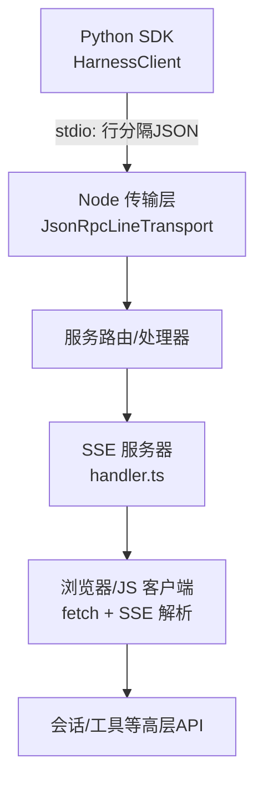
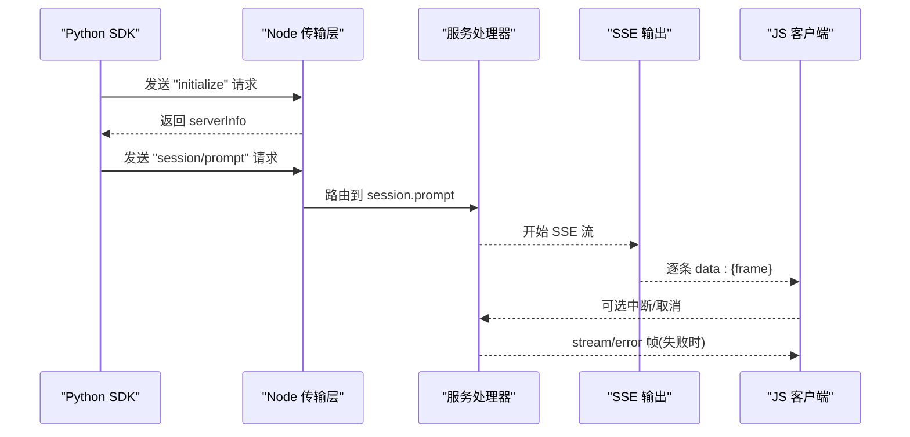
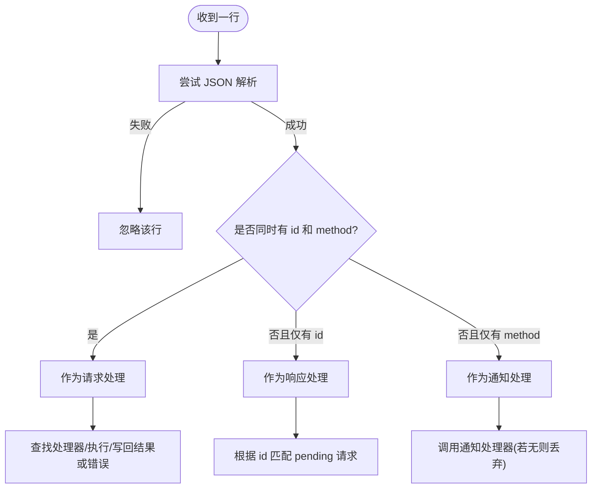
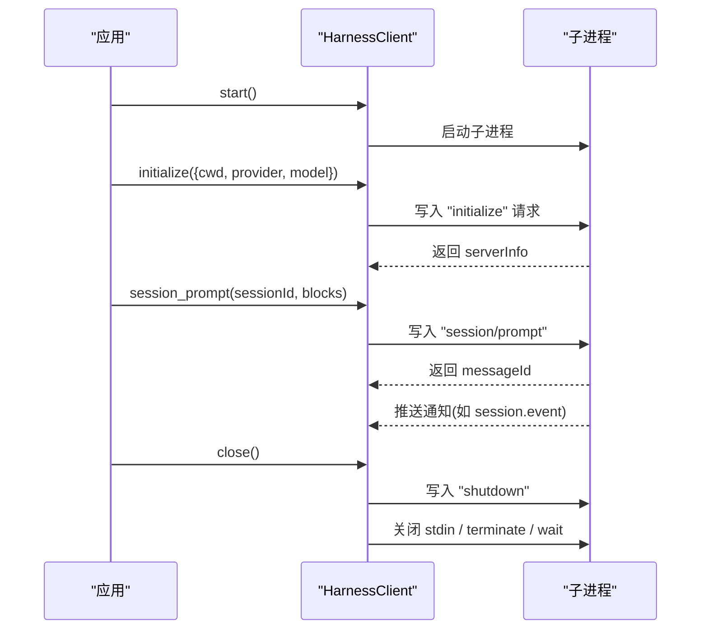
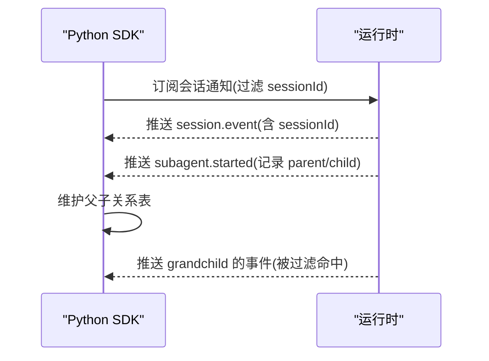
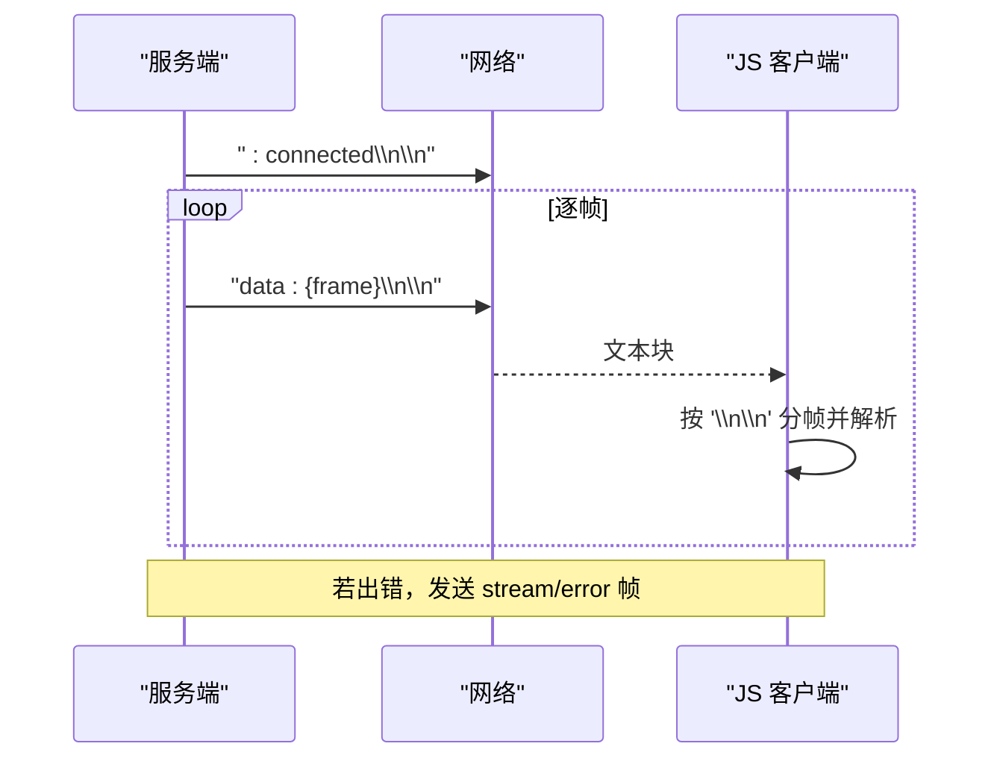
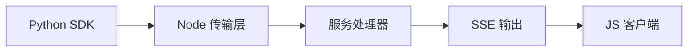

# JSON-RPC 协议

<cite>
**本文引用的文件**
- [packages/sdk/protocol/src/transport.ts](file://packages/sdk/protocol/src/transport.ts)
- [python/sdk/src/deepseek_harness/client.py](file://python/sdk/src/deepseek_harness/client.py)
- [python/sdk/src/deepseek_harness/errors.py](file://python/sdk/src/deepseek_harness/errors.py)
- [python/sdk/src/deepseek_harness/models.py](file://python/sdk/src/deepseek_harness/models.py)
- [examples/jsonrpc-agent/minimal.py](file://examples/jsonrpc-agent/minimal.py)
- [packages/host/apiproxy/src/fetch/handler.ts](file://packages/host/apiproxy/src/fetch/handler.ts)
- [packages/host/apiproxy/src/fetch/client.ts](file://packages/host/apiproxy/src/fetch/client.ts)
- [packages/sdk/client/src/client.ts](file://packages/sdk/client/src/client.ts)
- [packages/client/connection/tests/client-apply.client.spec.ts](file://packages/client/connection/tests/client-apply.client.spec.ts)
- [python/sdk/tests/test_client.py](file://python/sdk/tests/test_client.py)
- [packages/sdk/protocol/README.md](file://packages/sdk/protocol/README.md)
</cite>

## 目录
1. [简介](#简介)
2. [项目结构](#项目结构)
3. [核心组件](#核心组件)
4. [架构总览](#架构总览)
5. [详细组件分析](#详细组件分析)
6. [依赖关系分析](#依赖关系分析)
7. [性能考量](#性能考量)
8. [故障排除指南](#故障排除指南)
9. [结论](#结论)
10. [附录：方法清单与示例](#附录方法清单与示例)

## 简介
本文件系统化说明 DeepSeek Harness 中基于 JSON-RPC 2.0 的通信协议，覆盖消息格式、连接建立与管理、事件系统（订阅/发布/监听）、错误处理与异常传播、异步与流式响应，以及 Python SDK 与 JavaScript 客户端的集成要点。该协议采用“行分隔 JSON”在字节流上承载请求、响应与通知，并通过进程内 stdio 或 HTTP/SSE 通道进行传输。

## 项目结构
围绕 JSON-RPC 的关键实现分布在以下位置：
- 传输层：Node 端基于 Readable/Writable 的行分隔 JSON-RPC 传输器
- Python SDK：通过子进程启动运行时，使用 stdio 收发 JSON-RPC 帧
- 服务端代理：HTTP/SSE 将 RPC 帧封装为 SSE 数据帧，供浏览器/客户端消费
- 客户端：JavaScript 侧通过 fetch 读取 SSE 流，解析并映射到高层 API

图表来源
- [packages/sdk/protocol/src/transport.ts:1-280](file://packages/sdk/protocol/src/transport.ts#L1-L280)
- [packages/host/apiproxy/src/fetch/handler.ts:199-221](file://packages/host/apiproxy/src/fetch/handler.ts#L199-L221)
- [packages/host/apiproxy/src/fetch/client.ts:362-389](file://packages/host/apiproxy/src/fetch/client.ts#L362-L389)

章节来源
- [packages/sdk/protocol/src/transport.ts:1-280](file://packages/sdk/protocol/src/transport.ts#L1-L280)
- [python/sdk/src/deepseek_harness/client.py:1-558](file://python/sdk/src/deepseek_harness/client.py#L1-L558)
- [packages/host/apiproxy/src/fetch/handler.ts:199-221](file://packages/host/apiproxy/src/fetch/handler.ts#L199-L221)
- [packages/host/apiproxy/src/fetch/client.ts:362-389](file://packages/host/apiproxy/src/fetch/client.ts#L362-L389)

## 核心组件
- 行分隔 JSON-RPC 传输器：负责按行读写 JSON-RPC 帧，维护请求-响应匹配、通知分发、错误帧生成与 pending 请求清理
- Python SDK 客户端：管理子进程生命周期、发送 initialize/prompt 等方法调用、接收通知与请求、超时与诊断信息收集
- SSE 桥接：将内部 RPC 帧序列化为 SSE data 帧，支持流式推送与错误帧
- JS 客户端：通过 fetch 读取 SSE 流，按 '\n\n' 分帧，解析并暴露迭代接口

章节来源
- [packages/sdk/protocol/src/transport.ts:56-280](file://packages/sdk/protocol/src/transport.ts#L56-L280)
- [python/sdk/src/deepseek_harness/client.py:37-558](file://python/sdk/src/deepseek_harness/client.py#L37-L558)
- [packages/host/apiproxy/src/fetch/handler.ts:199-221](file://packages/host/apiproxy/src/fetch/handler.ts#L199-L221)
- [packages/host/apiproxy/src/fetch/client.ts:362-389](file://packages/host/apiproxy/src/fetch/client.ts#L362-L389)

## 架构总览
下图展示从 Python SDK 发起调用到服务端处理、再到 SSE 流返回的端到端流程。

图表来源
- [packages/sdk/protocol/src/transport.ts:121-156](file://packages/sdk/protocol/src/transport.ts#L121-L156)
- [packages/host/apiproxy/src/fetch/handler.ts:199-221](file://packages/host/apiproxy/src/fetch/handler.ts#L199-L221)
- [packages/host/apiproxy/src/fetch/client.ts:362-389](file://packages/host/apiproxy/src/fetch/client.ts#L362-L389)

## 详细组件分析

### JSON-RPC 消息格式与传输
- 协议版本：jsonrpc 字段固定为 "2.0"
- 帧类型
  - 请求：包含 id 与 method；params 可为对象或非对象（非对象归一化为空对象）
  - 响应：仅含 id；result 或 error 二选一
  - 通知：仅含 method；无 id；无响应
- 传输编码：每行一个 JSON 对象，以换行符分隔
- 错误码约定
  - 未找到方法：-32601
  - 处理器异常：-32603
- 取消与关闭：支持 AbortSignal 取消请求；关闭会拒绝所有 pending 请求

图表来源
- [packages/sdk/protocol/src/transport.ts:201-238](file://packages/sdk/protocol/src/transport.ts#L201-L238)

章节来源
- [packages/sdk/protocol/src/transport.ts:1-280](file://packages/sdk/protocol/src/transport.ts#L1-L280)

### Python SDK 客户端与连接管理
- 启动运行时：通过子进程启动 bundled runtime，stdin/stdout/stderr 分别用于写入、读取 JSON-RPC 帧与捕获诊断
- 初始化：发送 initialize 方法，校验返回的 serverInfo
- 会话提示：发送 session/prompt，返回 messageId；可附带通知回调与过滤
- 通知与请求：
  - 支持 subscribe_notifications 与 next_notification
  - 支持 session 树级订阅：自动记录 subagent.started 父子关系，过滤后代会话通知
- 关闭：先发送 shutdown，再关闭 stdin，终止进程，清理等待者与线程

图表来源
- [python/sdk/src/deepseek_harness/client.py:63-136](file://python/sdk/src/deepseek_harness/client.py#L63-L136)
- [python/sdk/src/deepseek_harness/client.py:147-178](file://python/sdk/src/deepseek_harness/client.py#L147-L178)
- [python/sdk/src/deepseek_harness/client.py:318-397](file://python/sdk/src/deepseek_harness/client.py#L318-L397)

章节来源
- [python/sdk/src/deepseek_harness/client.py:1-558](file://python/sdk/src/deepseek_harness/client.py#L1-L558)
- [python/sdk/src/deepseek_harness/models.py:1-33](file://python/sdk/src/deepseek_harness/models.py#L1-L33)

### 事件系统：订阅、发布与监听
- Python SDK 侧
  - 通知模型：Notification(method, payload)
  - 订阅：subscribe_notifications(filter?) 返回订阅句柄；next()/drain() 消费
  - 会话树订阅：subscribe_session_notifications(sessionId) 自动跟踪 subagent.started 父子关系，过滤后代会话事件
- Node 侧事件框架（Cordis）提供多种派发模式（emit/parallel/serial/bail/waterfall），用于子系统间解耦通信
- 测试验证了跨订阅保持父子关系的能力

图表来源
- [python/sdk/src/deepseek_harness/client.py:192-205](file://python/sdk/src/deepseek_harness/client.py#L192-L205)
- [python/sdk/src/deepseek_harness/client.py:460-504](file://python/sdk/src/deepseek_harness/client.py#L460-L504)
- [python/sdk/tests/test_client.py:504-528](file://python/sdk/tests/test_client.py#L504-L528)

章节来源
- [python/sdk/src/deepseek_harness/client.py:192-504](file://python/sdk/src/deepseek_harness/client.py#L192-L504)
- [python/sdk/tests/test_client.py:504-528](file://python/sdk/tests/test_client.py#L504-L528)

### 流式响应与 SSE
- 服务端将 RPC 帧序列化为 SSE data 帧，首帧发送连接注释行以表明通道活跃
- 客户端通过 fetch 读取 body，按 '\n\n' 分帧，解析后 yield 给上层
- 中间发生错误时，服务端发送 stream/error 帧，客户端据此上报错误并结束流

图表来源
- [packages/host/apiproxy/src/fetch/handler.ts:199-221](file://packages/host/apiproxy/src/fetch/handler.ts#L199-L221)
- [packages/host/apiproxy/src/fetch/client.ts:362-389](file://packages/host/apiproxy/src/fetch/client.ts#L362-L389)

章节来源
- [packages/host/apiproxy/src/fetch/handler.ts:199-221](file://packages/host/apiproxy/src/fetch/handler.ts#L199-L221)
- [packages/host/apiproxy/src/fetch/client.ts:362-389](file://packages/host/apiproxy/src/fetch/client.ts#L362-L389)

### 错误处理与异常传播
- 传输层
  - 未安装处理器：返回 -32601
  - 处理器抛出异常：返回 -32603，携带错误消息
  - 输入关闭或错误：拒绝所有 pending 请求
- Python SDK
  - 将 JSON-RPC 错误转换为 JsonRpcError(code, message, data)
  - 子进程退出或 stdout 关闭：TransportClosedError，附带退出码与 stderr 尾部
  - 请求超时：TimeoutError，附带诊断信息
- JS 客户端
  - SSE 流中途错误：stream/error 帧，客户端据此抛错并结束迭代

章节来源
- [packages/sdk/protocol/src/transport.ts:226-268](file://packages/sdk/protocol/src/transport.ts#L226-L268)
- [python/sdk/src/deepseek_harness/errors.py:1-23](file://python/sdk/src/deepseek_harness/errors.py#L1-L23)
- [python/sdk/src/deepseek_harness/client.py:399-422](file://python/sdk/src/deepseek_harness/client.py#L399-L422)
- [packages/host/apiproxy/src/fetch/handler.ts:199-221](file://packages/host/apiproxy/src/fetch/handler.ts#L199-L221)

### 异步操作与取消
- Python SDK 请求循环支持 on_notification 与超时控制；超时会收集诊断信息并抛出 TimeoutError
- Node 传输层 request 支持 AbortSignal，取消即移除 pending 并拒绝
- JS 客户端 SSE 读取接受 AbortSignal，取消即停止读取并释放资源

章节来源
- [python/sdk/src/deepseek_harness/client.py:228-296](file://python/sdk/src/deepseek_harness/client.py#L228-L296)
- [packages/sdk/protocol/src/transport.ts:121-156](file://packages/sdk/protocol/src/transport.ts#L121-L156)
- [packages/host/apiproxy/src/fetch/client.ts:362-389](file://packages/host/apiproxy/src/fetch/client.ts#L362-L389)

## 依赖关系分析
- Python SDK 依赖 Node 运行时二进制（bundled runtime），通过 stdio 进行 JSON-RPC 通信
- Node 传输层依赖 Node Stream 与 StringDecoder
- 服务端代理依赖 fetch 与 ReadableStream 构建 SSE 输出
- JS 客户端依赖浏览器 WebSocket/Fetch 能力

图表来源
- [python/sdk/src/deepseek_harness/client.py:63-85](file://python/sdk/src/deepseek_harness/client.py#L63-L85)
- [packages/sdk/protocol/src/transport.ts:1-20](file://packages/sdk/protocol/src/transport.ts#L1-L20)
- [packages/host/apiproxy/src/fetch/handler.ts:199-221](file://packages/host/apiproxy/src/fetch/handler.ts#L199-L221)
- [packages/host/apiproxy/src/fetch/client.ts:362-389](file://packages/host/apiproxy/src/fetch/client.ts#L362-L389)

章节来源
- [python/sdk/src/deepseek_harness/client.py:63-85](file://python/sdk/src/deepseek_harness/client.py#L63-L85)
- [packages/sdk/protocol/src/transport.ts:1-20](file://packages/sdk/protocol/src/transport.ts#L1-L20)
- [packages/host/apiproxy/src/fetch/handler.ts:199-221](file://packages/host/apiproxy/src/fetch/handler.ts#L199-L221)
- [packages/host/apiproxy/src/fetch/client.ts:362-389](file://packages/host/apiproxy/src/fetch/client.ts#L362-L389)

## 性能考量
- 行分隔 JSON 在流式场景下开销低，适合高频小帧
- 传输层对 params 做归一化，避免数组/标量导致的歧义
- SSE 流使用缓冲与分帧策略，单帧解析失败不影响整体流
- Python SDK 使用队列与线程分离读/写路径，降低阻塞风险
- 建议合理设置请求超时与取消信号，避免长尾请求占用资源

[本节为通用指导，不直接分析具体文件]

## 故障排除指南
- 无法建立连接
  - 检查 Python SDK 是否能定位 bundled runtime；必要时设置 runtime_bin 或 bridge_bin
  - 确认子进程已启动且 stdin/stdout 可用
- 方法未找到
  - 服务端未注册对应处理器，将返回 -32601
- 处理器异常
  - 服务端将返回 -32603，携带错误消息
- 子进程崩溃
  - TransportClosedError 会附带退出码与 stderr 尾部，便于定位
- SSE 流异常
  - 服务端会发送 stream/error 帧，客户端据此抛错并结束流
- 调试技巧
  - 启用 stderr 捕获与日志
  - 使用最小示例脚本运行并观察输出

章节来源
- [python/sdk/src/deepseek_harness/client.py:424-455](file://python/sdk/src/deepseek_harness/client.py#L424-L455)
- [python/sdk/src/deepseek_harness/client.py:399-422](file://python/sdk/src/deepseek_harness/client.py#L399-L422)
- [packages/host/apiproxy/src/fetch/handler.ts:199-221](file://packages/host/apiproxy/src/fetch/handler.ts#L199-L221)

## 结论
DeepSeek Harness 的 JSON-RPC 协议以简洁可靠的行分隔 JSON 为基础，结合 Python SDK 的进程管理与 Node 端的流式 SSE 输出，实现了跨语言、跨进程的可靠通信。其错误处理、取消机制与事件系统为复杂工作流提供了坚实基础。遵循本文规范可实现稳定高效的集成。

[本节为总结性内容，不直接分析具体文件]

## 附录：方法清单与示例

### 支持的 JSON-RPC 方法（来自 Python SDK）
- initialize
  - 参数：{ cwd, provider, model, maxTokens? }
  - 返回：{ serverInfo: { name, version } }
- session/prompt
  - 参数：{ sessionId, contentBlocks }
  - 返回：{ messageId }
- shutdown
  - 参数：无
  - 返回：无

章节来源
- [python/sdk/src/deepseek_harness/client.py:117-136](file://python/sdk/src/deepseek_harness/client.py#L117-L136)
- [python/sdk/src/deepseek_harness/client.py:147-155](file://python/sdk/src/deepseek_harness/client.py#L147-L155)
- [python/sdk/src/deepseek_harness/client.py:87-110](file://python/sdk/src/deepseek_harness/client.py#L87-L110)

### Python SDK 集成示例（步骤）
- 安装并导入 deepseek_harness
- 创建 Harness 上下文，传入 provider、model、workspace、session_root、cordis 配置
- 调用 run(prompt, session_id?) 获取最终响应
- 使用 with 语句确保资源正确释放

章节来源
- [examples/jsonrpc-agent/minimal.py:16-39](file://examples/jsonrpc-agent/minimal.py#L16-L39)

### JavaScript 客户端集成（SSE）
- 使用 fetch 打开 SSE 端点
- 读取 body，按 '\n\n' 分帧
- 解析 data 中的帧，处理普通帧与 stream/error 帧
- 使用 AbortController 控制流的生命周期

章节来源
- [packages/host/apiproxy/src/fetch/client.ts:362-389](file://packages/host/apiproxy/src/fetch/client.ts#L362-L389)
- [packages/client/connection/tests/client-apply.client.spec.ts:197-282](file://packages/client/connection/tests/client-apply.client.spec.ts#L197-L282)

### 已知限制
- 无协议版本协商（握手仅携带 serverInfo.version）
- 无 cancel 或 session-close 方法（通过关闭运行时进程中止 turn）
- 服务端→客户端请求为预留能力（当前未使用）

章节来源
- [packages/sdk/protocol/README.md:35-39](file://packages/sdk/protocol/README.md#L35-L39)