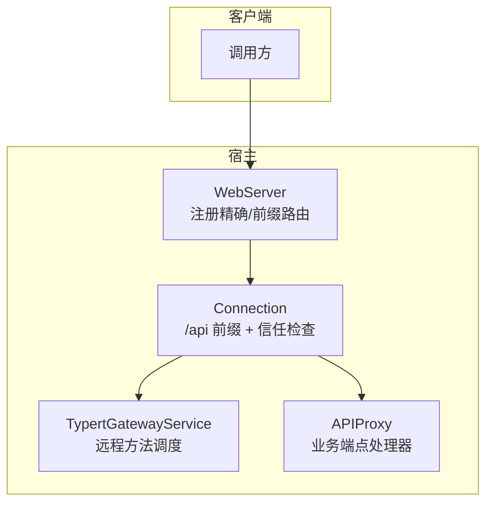
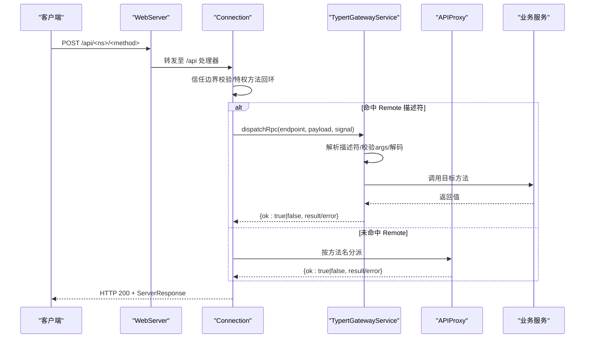
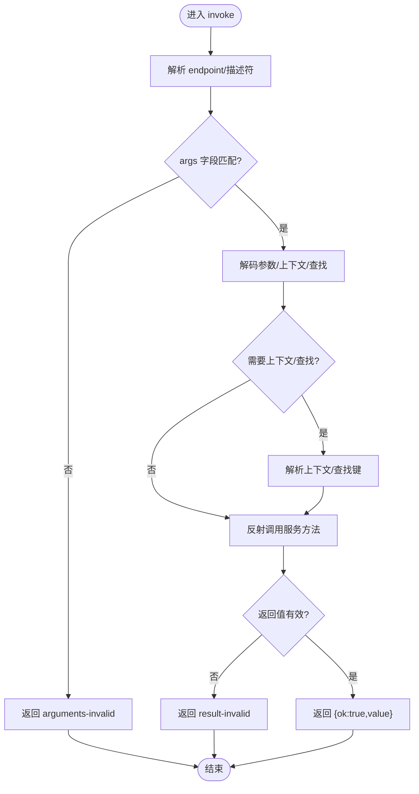
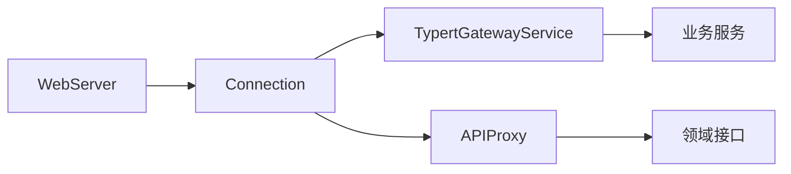

# RESTful API

<cite>
**本文引用的文件**
- [packages/api/gateway/src/index.ts](file://packages/api/gateway/src/index.ts)
- [packages/host/apiproxy/src/api/rpc.ts](file://packages/host/apiproxy/src/api/rpc.ts)
- [packages/host/apiproxy/src/api/agent-presets.ts](file://packages/host/apiproxy/src/api/agent-presets.ts)
- [packages/host/apiproxy/src/api/approvals.ts](file://packages/host/apiproxy/src/api/approvals.ts)
- [packages/client/connection/src/index.ts](file://packages/client/connection/src/index.ts)
- [packages/host/webserver/tests/webserver.spec.ts](file://packages/host/webserver/tests/webserver.spec.ts)
- [packages/host/webserver/src/index.ts](file://packages/host/webserver/src/index.ts)
- [packages/host/apiproxy/src/fetch/handler.ts](file://packages/host/apiproxy/src/fetch/handler.ts)
- [packages/llm/llm-pi-ai/src/provider.ts](file://packages/llm/llm-pi-ai/src/provider.ts)
- [packages/llm/llm/src/index.ts](file://packages/llm/llm/src/index.ts)
- [docs/api-gateway.md](file://docs/api-gateway.md)
</cite>

## 目录
1. [简介](#简介)
2. [项目结构](#项目结构)
3. [核心组件](#核心组件)
4. [架构总览](#架构总览)
5. [详细组件分析](#详细组件分析)
6. [依赖关系分析](#依赖关系分析)
7. [性能考虑](#性能考虑)
8. [故障排查指南](#故障排查指南)
9. [结论](#结论)
10. [附录](#附录)

## 简介
本文件面向通过 HTTP 调用 Harness 内部能力的客户端，系统化说明 RESTful API 的端点、请求与响应格式、认证与授权、错误码与错误体、版本与兼容性策略，以及客户端集成最佳实践。该系统的对外暴露以统一的 /api 前缀承载 RPC 消息，业务方法通过命名空间/方法形式路由到具体服务；同时提供审批回调等专用 POST 路径。所有业务错误统一在 200 状态码下的结构化响应中返回，HTTP 状态仅描述传输层情况（如 404、415、400、500）。

## 项目结构
- 传输与网关
  - WebServer：注册精确或前缀路由，处理 HTTP 请求分发与升级。
  - Connection：为浏览器/宿主环境提供共享 FetchHandler，挂载 /api 前缀，执行信任边界校验与特权方法回环限制。
  - API Gateway：对 /api/<namespace>/<method> 进行强类型解析、参数校验、上下文/查找解析、服务调用与结果校验。
- 代理与契约
  - API Proxy：承载无 Remote 声明的业务端点（如 agent-presets、approvals），使用统一的四象限 RPC 消息模型。
  - RPC 消息模型：定义 ClientRequest/ServerResponse/ServerRequest/ClientResponse、RpcId、RpcResult、错误码与详情映射。
- 认证与密钥
  - LLM 适配器：将已解析的 apiKey 注入下游请求；缺失时由协议层拒绝。
  - 通用密钥校验：对原始密钥做规范化与可用性断言，避免泄露敏感信息。

图表来源
- [packages/host/webserver/src/index.ts:65-101](file://packages/host/webserver/src/index.ts#L65-L101)
- [packages/client/connection/src/index.ts:121-145](file://packages/client/connection/src/index.ts#L121-L145)
- [packages/api/gateway/src/index.ts:90-112](file://packages/api/gateway/src/index.ts#L90-L112)
- [packages/host/apiproxy/src/fetch/handler.ts:1-7](file://packages/host/apiproxy/src/fetch/handler.ts#L1-L7)

章节来源
- [packages/host/webserver/src/index.ts:65-101](file://packages/host/webserver/src/index.ts#L65-L101)
- [packages/client/connection/src/index.ts:121-145](file://packages/client/connection/src/index.ts#L121-L145)
- [packages/api/gateway/src/index.ts:90-112](file://packages/api/gateway/src/index.ts#L90-L112)
- [packages/host/apiproxy/src/fetch/handler.ts:1-7](file://packages/host/apiproxy/src/fetch/handler.ts#L1-L7)

## 核心组件
- 统一 RPC 消息模型
  - 请求/响应信封：ClientRequest/ServerResponse/ServerRequest/ClientResponse，均携带 rpcId 用于关联。
  - 业务结果：RpcResult<T> = { ok: true; value: T } | { ok: false; error: RpcError }。
  - 错误体系：RpcErrorCode 闭联合并 RpcErrorDetailsMap，每个错误码附带结构化 details。
- Typert 网关
  - 拦截 /api 下形如 <namespace>/<method> 的请求，匹配严格生成描述符或 SRC 标记。
  - 校验 args 字段集合、解码输入、解析上下文/查找键、调用服务、校验返回值。
  - 失败时返回统一错误分支，不抛出异常给传输层。
- API 代理
  - 承载非 Remote 的业务端点，如 agent-presets、approvals。
  - 审批回调：POST /api/respond，以 RpcReceipt 作为响应体。
- 传输与信任
  - /api 前缀请求先经信任边界校验（DNS 重绑定/跨站防护），特权方法强制回环。
  - 最大请求体大小可配置，防止超大负载。

章节来源
- [packages/host/apiproxy/src/api/rpc.ts:14-194](file://packages/host/apiproxy/src/api/rpc.ts#L14-L194)
- [packages/api/gateway/src/index.ts:145-222](file://packages/api/gateway/src/index.ts#L145-L222)
- [packages/host/apiproxy/src/api/agent-presets.ts:1-117](file://packages/host/apiproxy/src/api/agent-presets.ts#L1-L117)
- [packages/host/apiproxy/src/api/approvals.ts:1-22](file://packages/host/apiproxy/src/api/approvals.ts#L1-L22)
- [packages/client/connection/src/index.ts:121-145](file://packages/client/connection/src/index.ts#L121-L145)

## 架构总览
下图展示一次典型的 /api/<namespace>/<method> 调用流程：客户端发起 POST，Connection 执行信任检查后交由网关或代理处理，最终返回统一信封。

图表来源
- [packages/client/connection/src/index.ts:121-145](file://packages/client/connection/src/index.ts#L121-L145)
- [packages/api/gateway/src/index.ts:186-222](file://packages/api/gateway/src/index.ts#L186-L222)
- [packages/host/apiproxy/src/fetch/handler.ts:1-7](file://packages/host/apiproxy/src/fetch/handler.ts#L1-L7)

## 详细组件分析

### 统一 RPC 消息与错误模型
- 请求/响应
  - ClientRequest：{ type:'client-request', rpcId, method, payload }
  - ServerResponse：{ type:'server-response', rpcId, result }
  - ServerRequest：{ type:'server-request', rpcId, method, payload }
  - ClientResponse：{ type:'client-response', rpcId, result }
- 业务结果
  - RpcResult<T>：成功 { ok:true, value:T }；失败 { ok:false, error:RpcError }
- 错误码与详情
  - RpcErrorCode 闭合集，对应 RpcErrorDetailsMap 中的 details 结构
  - 常见错误：bad-request、cancelled、session-not-found、model-unavailable、settings-rejected、credential-rejected、internal 等

章节来源
- [packages/host/apiproxy/src/api/rpc.ts:14-194](file://packages/host/apiproxy/src/api/rpc.ts#L14-L194)

### Typert 网关（Remote 方法）
- 端点模式：/api/<namespace>/<method>
- 请求体：仅包含一个纯对象字段 args，字段名与数量必须与描述符一致
- 响应体：200 + ServerResponse，result 为 RpcResult
- 参数解析
  - JSON 参数：直接解码并校验
  - 查找参数：根据 lookup key 解析为宿主对象
  - 上下文参数：根据 Context provider 解析作用域上下文
- 取消支持：最后可选 signal 参数用于协作取消
- 失败分类：service-unavailable、method-unavailable、signature-invalid、arguments-invalid、lookup-unavailable、context-unavailable、binding-invalid 等

图表来源
- [packages/api/gateway/src/index.ts:145-222](file://packages/api/gateway/src/index.ts#L145-L222)
- [packages/api/gateway/src/index.ts:224-468](file://packages/api/gateway/src/index.ts#L224-L468)
- [packages/api/gateway/src/index.ts:586-638](file://packages/api/gateway/src/index.ts#L586-L638)

章节来源
- [packages/api/gateway/src/index.ts:145-222](file://packages/api/gateway/src/index.ts#L145-L222)
- [packages/api/gateway/src/index.ts:224-468](file://packages/api/gateway/src/index.ts#L224-L468)
- [packages/api/gateway/src/index.ts:586-638](file://packages/api/gateway/src/index.ts#L586-L638)

### API 代理端点

#### Agent Presets（智能体预设）
- 端点模式：/api/agentPreset.*（由代理层按方法名路由）
- 常用方法
  - list：列出部署提供的预设清单、是否可编辑、是否可打开文档
  - select：在未开始对话的会话中选择不同预设
  - read：读取某预设的组成文本（受信任主机/回环）
  - copy：从现有预设复制为新本地预设
  - openDocument：打开本地预设目录（若不可用则返回路径）
  - remove：删除本地预设
- 权限与信任
  - 写入类操作需特权通道（回环/可信主机）
- 典型请求/响应
  - 请求：{ rpcId, payload:{...} }
  - 响应：{ rpcId, result:{ ok:true, value:{...} } } 或 { ok:false, error:{code,message,details} }

章节来源
- [packages/host/apiproxy/src/api/agent-presets.ts:1-117](file://packages/host/apiproxy/src/api/agent-presets.ts#L1-L117)
- [packages/host/apiproxy/src/api/rpc.ts:14-194](file://packages/host/apiproxy/src/api/rpc.ts#L14-L194)

#### Approvals（审批回调）
- 端点：POST /api/respond
- 用途：客户端对服务端发起的审批请求进行回复
- 载荷：ApprovalResponsePayload（sessionId、approvalId、outcome）
- 响应：RpcReceipt（accepted:true|false 及原因）
- 注意：审批答案通过独立的 POST 路径提交，而非普通 unary 方法

章节来源
- [packages/host/apiproxy/src/api/approvals.ts:1-22](file://packages/host/apiproxy/src/api/approvals.ts#L1-L22)
- [packages/host/apiproxy/src/api/rpc.ts:14-194](file://packages/host/apiproxy/src/api/rpc.ts#L14-L194)

### 传输层与路由规则
- 路由优先级：精确匹配优先于前缀匹配；最长前缀优先；前缀自身路径也可命中
- 方法处理：路由负责方法选择，未注册的方法返回 405（仅在 fallback 语义下）
- 媒体类型：非 JSON 请求体返回 415；非 JSON 内容返回 400；未知路径返回 404；处理器崩溃返回 500
- 业务错误：始终 200 + ServerResponse.result 中的错误分支

章节来源
- [packages/host/webserver/tests/webserver.spec.ts:99-114](file://packages/host/webserver/tests/webserver.spec.ts#L99-L114)
- [packages/host/apiproxy/src/fetch/handler.ts:1-7](file://packages/host/apiproxy/src/fetch/handler.ts#L1-L7)

### 认证机制与 API 密钥
- 传输级信任
  - /api 前缀请求先经信任边界校验（DNS 重绑定/跨站防护）
  - 特权方法强制回环访问
- 密钥解析与传递
  - 适配器层将已解析的 apiKey 注入下游请求；若未配置则由协议层拒绝
  - 密钥规范化与可用性校验，避免泄露敏感值
- 建议
  - 通过安全渠道配置密钥，避免明文硬编码
  - 最小权限原则：仅暴露必要端点与方法

章节来源
- [packages/client/connection/src/index.ts:121-145](file://packages/client/connection/src/index.ts#L121-L145)
- [packages/llm/llm-pi-ai/src/provider.ts:65-85](file://packages/llm/llm-pi-ai/src/provider.ts#L65-L85)
- [packages/llm/llm/src/index.ts:119-143](file://packages/llm/llm/src/index.ts#L119-L143)

### 版本管理与向后兼容
- 强类型生成管线
  - Host 构建阶段生成严格描述符与 Schema；Client 构建阶段消费这些产物
  - 变更 Remote 签名需重新生成，确保两端契约一致
- 开发模式回退
  - 源码启动时采用 SRC 回退，但客户端仍要求严格编解码器
- 兼容性策略
  - 新增字段应默认可选且向后兼容
  - 移除字段需废弃周期与迁移指引
  - 错误码扩展遵循闭合集约定，新增错误码需配套 details

章节来源
- [docs/api-gateway.md:95-138](file://docs/api-gateway.md#L95-L138)
- [packages/api/gateway/src/index.ts:224-357](file://packages/api/gateway/src/index.ts#L224-L357)

### 客户端集成指南与最佳实践
- 基本调用
  - 构造 ClientRequest，设置唯一 rpcId，指定 method 与 payload
  - POST 到 /api/<method>，接收 ServerResponse
- 错误处理
  - 检查 result.ok，失败时读取 error.code 与 details
  - 区分传输错误（HTTP 状态）与业务错误（200 + error）
- 取消与超时
  - 支持 AbortSignal 取消长耗时调用
- 重试与幂等
  - 对幂等方法实现指数退避重试
  - 对非幂等方法谨慎重试
- 安全
  - 仅向可信主机/回环发起特权调用
  - 不在日志中输出密钥或敏感字段

章节来源
- [packages/host/apiproxy/src/api/rpc.ts:14-194](file://packages/host/apiproxy/src/api/rpc.ts#L14-L194)
- [packages/client/connection/src/index.ts:121-145](file://packages/client/connection/src/index.ts#L121-L145)

## 依赖关系分析
- 组件耦合
  - Connection 依赖 WebServer 的路由能力，并通过拦截器链管理 /api
  - TypertGatewayService 依赖 Cordis 服务注册与 Typert 描述符/Schema
  - APIProxy 依赖 RPC 消息模型与领域接口
- 外部依赖
  - 第三方 LLM 提供商通过适配器接入，密钥由 Harness 注入
- 潜在循环
  - 各层职责清晰，未见循环导入；Host/Client 构建面分离

图表来源
- [packages/host/webserver/src/index.ts:65-101](file://packages/host/webserver/src/index.ts#L65-L101)
- [packages/client/connection/src/index.ts:121-145](file://packages/client/connection/src/index.ts#L121-L145)
- [packages/api/gateway/src/index.ts:90-112](file://packages/api/gateway/src/index.ts#L90-L112)
- [packages/host/apiproxy/src/api/rpc.ts:14-194](file://packages/host/apiproxy/src/api/rpc.ts#L14-L194)

章节来源
- [packages/host/webserver/src/index.ts:65-101](file://packages/host/webserver/src/index.ts#L65-L101)
- [packages/client/connection/src/index.ts:121-145](file://packages/client/connection/src/index.ts#L121-L145)
- [packages/api/gateway/src/index.ts:90-112](file://packages/api/gateway/src/index.ts#L90-L112)
- [packages/host/apiproxy/src/api/rpc.ts:14-194](file://packages/host/apiproxy/src/api/rpc.ts#L14-L194)

## 性能考虑
- 请求体限制：可配置最大请求体大小，避免内存压力
- 描述符缓存：网关按需解析描述符与服务，避免全局缓存带来的不一致
- 取消传播：通过 AbortSignal 及时中断长耗时调用，释放资源
- 序列化约束：严格的 JSON 安全校验，避免复杂对象导致的开销与风险

[本节为通用指导，无需特定文件引用]

## 故障排查指南
- 常见问题定位
  - 404：路径不存在或未注册
  - 415：Content-Type 非 JSON
  - 400：请求体非 JSON 或结构非法
  - 500：处理器崩溃
  - 200 + error：业务错误，查看 code 与 details
- 常见错误码
  - bad-request：参数校验失败
  - cancelled：调用被取消
  - session/model/workspace 相关错误：会话/模型/工作区状态问题
  - settings/credential 相关错误：配置或凭据写入被拒
  - internal：未分类的内部错误
- 调试建议
  - 打印 rpcId 追踪请求链路
  - 检查信任边界与特权方法来源
  - 确认 Remote 描述符与客户端生成代码一致

章节来源
- [packages/host/apiproxy/src/fetch/handler.ts:1-7](file://packages/host/apiproxy/src/fetch/handler.ts#L1-L7)
- [packages/host/apiproxy/src/api/rpc.ts:31-116](file://packages/host/apiproxy/src/api/rpc.ts#L31-L116)
- [packages/api/gateway/src/index.ts:471-489](file://packages/api/gateway/src/index.ts#L471-L489)

## 结论
Harness 的 RESTful API 以统一的 /api 前缀承载 RPC 消息，结合强类型生成的 Typert 网关与灵活的 API 代理，实现了高内聚、低耦合的服务编排。通过严格的信任边界、清晰的错误模型与完善的版本生成管线，既保证了安全性与可维护性，也为客户端提供了稳定可靠的集成体验。

[本节为总结性内容，无需特定文件引用]

## 附录

### 端点速查表
- 通用 Remote 方法
  - URL：/api/<namespace>/<method>
  - 方法：POST
  - 请求体：{ type:'client-request', rpcId, method, payload }
  - 响应体：200 + { type:'server-response', rpcId, result }
- 审批回调
  - URL：/api/respond
  - 方法：POST
  - 请求体：ApprovalResponsePayload
  - 响应体：RpcReceipt

章节来源
- [packages/host/apiproxy/src/api/rpc.ts:14-194](file://packages/host/apiproxy/src/api/rpc.ts#L14-L194)
- [packages/host/apiproxy/src/api/approvals.ts:1-22](file://packages/host/apiproxy/src/api/approvals.ts#L1-L22)

### 错误码与详情示例（节选）
- bad-request：details.issues 为 ZodIssue[]
- cancelled：details 为空
- session-not-found：details.sessionId
- model-unavailable：details.provider, details.model
- settings-rejected：details.ns
- credential-rejected：details.ref
- internal：details 为空

章节来源
- [packages/host/apiproxy/src/api/rpc.ts:31-116](file://packages/host/apiproxy/src/api/rpc.ts#L31-L116)