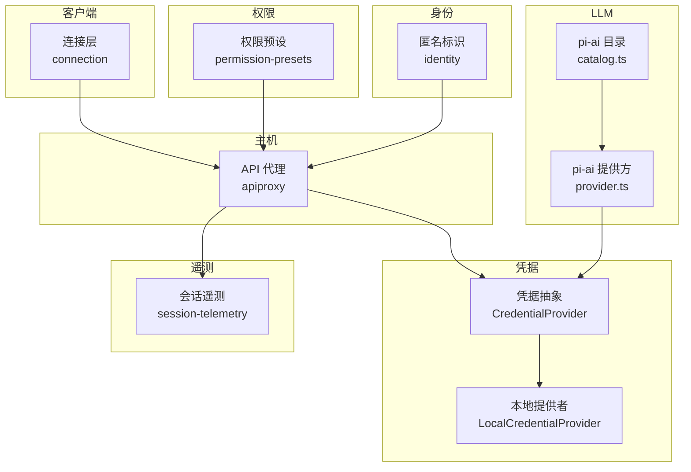
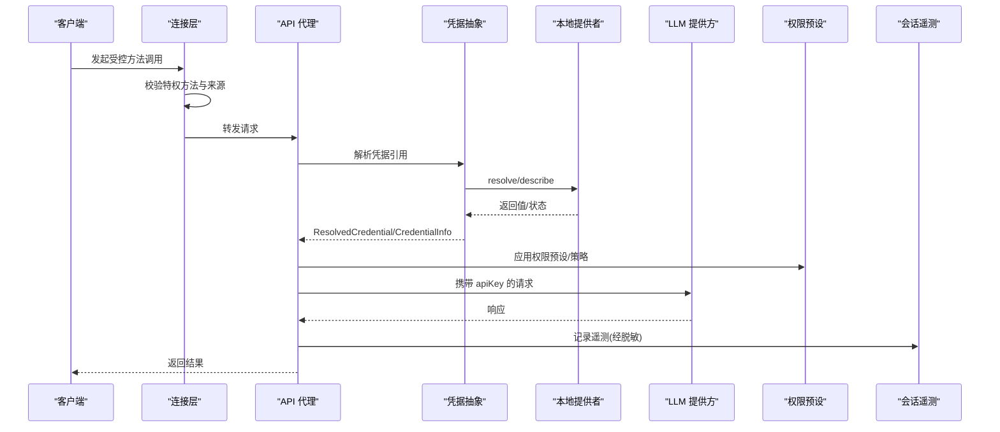
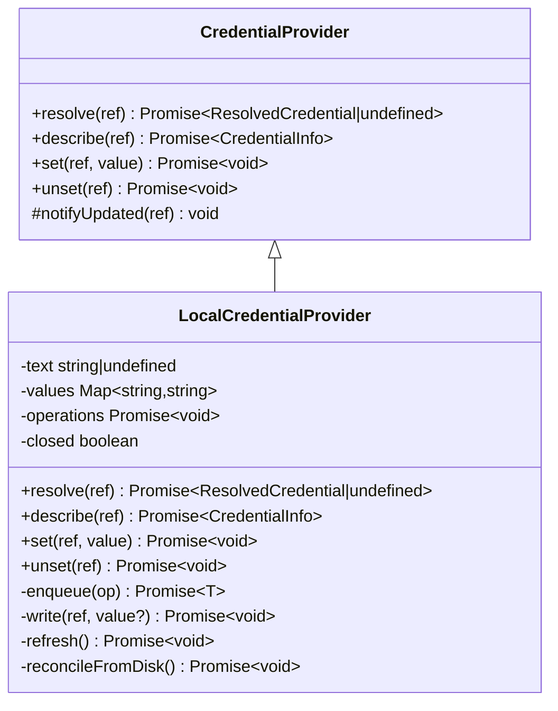
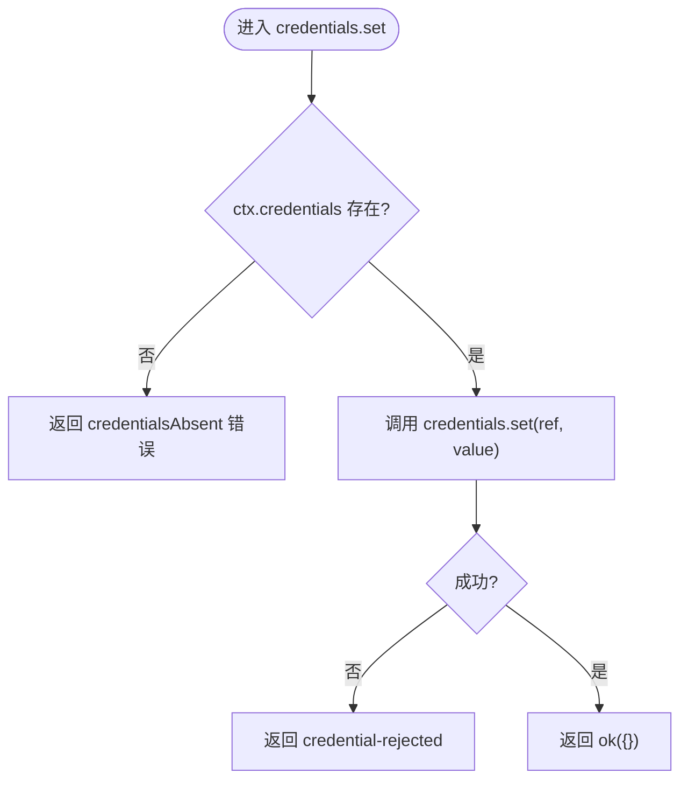
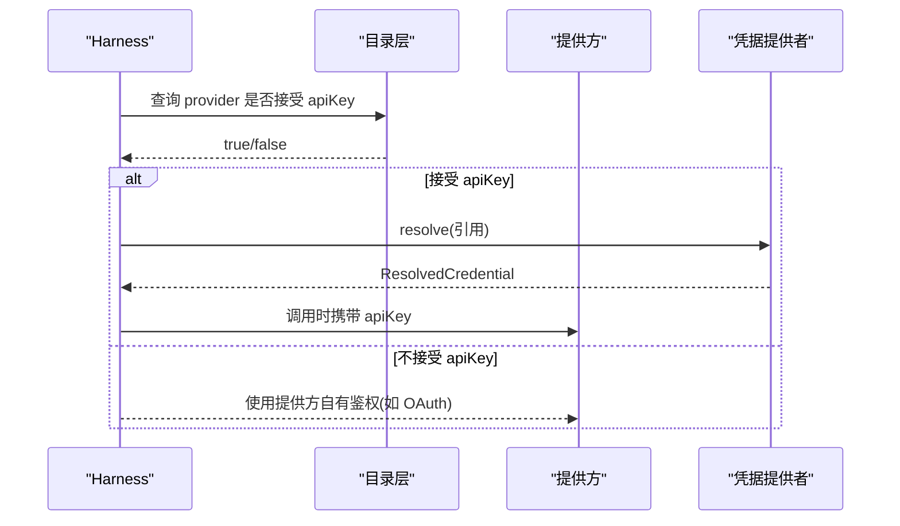
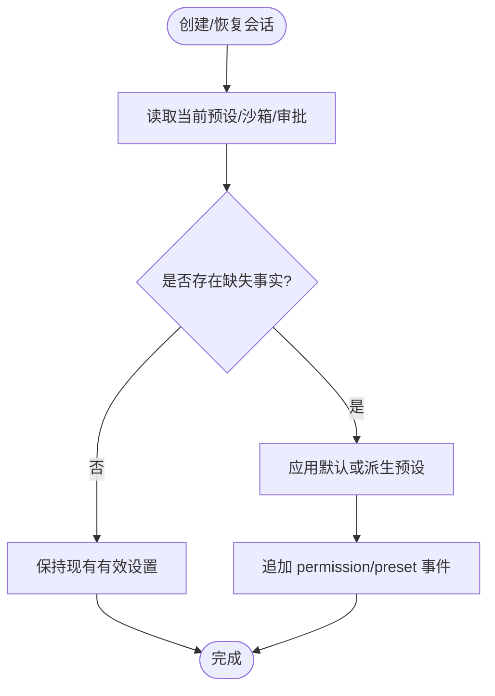
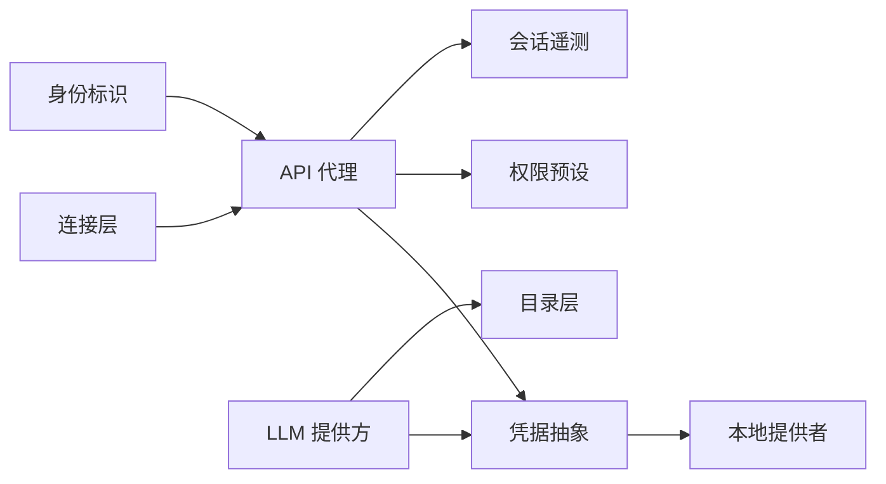

# 认证与授权

<cite>
**本文引用的文件**
- [packages/credentials/credentials/src/index.ts](file://packages/credentials/credentials/src/index.ts)
- [packages/credentials/credentials-local/src/index.ts](file://packages/credentials/credentials-local/src/index.ts)
- [packages/host/apiproxy/src/api-proxy.ts](file://packages/host/apiproxy/src/api-proxy.ts)
- [packages/client/connection/src/index.ts](file://packages/client/connection/src/index.ts)
- [packages/llm/llm-pi-ai/src/provider.ts](file://packages/llm/llm-pi-ai/src/provider.ts)
- [packages/llm/llm-pi-ai/src/catalog.ts](file://packages/llm/llm-pi-ai/src/catalog.ts)
- [packages/interaction/permission-presets/src/index.ts](file://packages/interaction/permission-presets/src/index.ts)
- [packages/identity/README.md](file://packages/identity/README.md)
- [docs/subsystems/session-telemetry.md](file://docs/subsystems/session-telemetry.md)
- [packages/extensions/tool-cordis/src/api-catalog.ts](file://packages/extensions/tool-cordis/src/api-catalog.ts)
</cite>

## 目录
1. [简介](#简介)
2. [项目结构](#项目结构)
3. [核心组件](#核心组件)
4. [架构总览](#架构总览)
5. [详细组件分析](#详细组件分析)
6. [依赖关系分析](#依赖关系分析)
7. [性能与安全考量](#性能与安全考量)
8. [故障排查指南](#故障排查指南)
9. [结论](#结论)
10. [附录](#附录)

## 简介
本文件系统化梳理该仓库中的认证与授权机制，覆盖以下主题：
- API 密钥的生成、管理与验证流程（基于凭据引用与提供者）
- 用户身份标识与会话隔离（匿名标识、会话上下文与作用域）
- 基于角色的访问控制（RBAC）与权限模型（权限预设、沙箱与审批策略）
- 多租户环境下的隔离策略（服务作用域隔离、会话级上下文）
- 令牌刷新与过期处理（以请求级鉴权与凭据热更新为主）
- 安全审计与日志记录（遥测水印、脱敏水线）
- 常见安全威胁防护与修复建议

## 项目结构
围绕认证与授权的代码主要分布在以下包中：
- 凭据抽象与本地实现：credentials、credentials-local
- 主机代理对外暴露凭据能力：host/apiproxy
- 客户端连接层对特权方法的限制：client/connection
- LLM 提供方的 API Key 解析与路由：llm-pi-ai
- 权限预设与执行约束：interaction/permission-presets
- 身份标识：identity
- 会话遥测与脱敏：session-telemetry、tool-cordis

图表来源
- [packages/credentials/credentials/src/index.ts:1-146](file://packages/credentials/credentials/src/index.ts#L1-L146)
- [packages/credentials/credentials-local/src/index.ts:1-497](file://packages/credentials/credentials-local/src/index.ts#L1-L497)
- [packages/host/apiproxy/src/api-proxy.ts:3321-3368](file://packages/host/apiproxy/src/api-proxy.ts#L3321-L3368)
- [packages/client/connection/src/index.ts:69-91](file://packages/client/connection/src/index.ts#L69-L91)
- [packages/llm/llm-pi-ai/src/provider.ts:87-107](file://packages/llm/llm-pi-ai/src/provider.ts#L87-L107)
- [packages/llm/llm-pi-ai/src/catalog.ts:127-162](file://packages/llm/llm-pi-ai/src/catalog.ts#L127-L162)
- [packages/interaction/permission-presets/src/index.ts:185-433](file://packages/interaction/permission-presets/src/index.ts#L185-L433)
- [packages/identity/README.md:1-10](file://packages/identity/README.md#L1-L10)
- [docs/subsystems/session-telemetry.md:167-191](file://docs/subsystems/session-telemetry.md#L167-L191)

章节来源
- [packages/credentials/credentials/src/index.ts:1-146](file://packages/credentials/credentials/src/index.ts#L1-L146)
- [packages/credentials/credentials-local/src/index.ts:1-497](file://packages/credentials/credentials-local/src/index.ts#L1-L497)
- [packages/host/apiproxy/src/api-proxy.ts:3321-3368](file://packages/host/apiproxy/src/api-proxy.ts#L3321-L3368)
- [packages/client/connection/src/index.ts:69-91](file://packages/client/connection/src/index.ts#L69-L91)
- [packages/llm/llm-pi-ai/src/provider.ts:87-107](file://packages/llm/llm-pi-ai/src/provider.ts#L87-L107)
- [packages/llm/llm-pi-ai/src/catalog.ts:127-162](file://packages/llm/llm-pi-ai/src/catalog.ts#L127-L162)
- [packages/interaction/permission-presets/src/index.ts:185-433](file://packages/interaction/permission-presets/src/index.ts#L185-L433)
- [packages/identity/README.md:1-10](file://packages/identity/README.md#L1-L10)
- [docs/subsystems/session-telemetry.md:167-191](file://docs/subsystems/session-telemetry.md#L167-L191)

## 核心组件
- 凭据抽象与服务：定义统一的凭据引用、解析、描述、写入与删除接口，并保证空值即“未配置”的一致性语义。
- 本地凭据提供者：基于 $DSH_HOME/.credentials.yaml 与环境变量分层解析，支持热重载、原子写入与严格权限检查。
- API 代理凭据能力：将凭据操作暴露为可远程调用的能力，包含 describe/set/unset 的安全封装与错误映射。
- 客户端连接层：对特权方法实施回环/同源限制，防止未认证调用读取配置或凭据元信息。
- LLM 提供方鉴权：按提供方声明决定是否接受 API Key；通过 harness 自身 seam 解析请求级 apiKey 并注入。
- 权限预设：组合沙箱模式与审批策略，作为会话级 RBAC 的默认与派生策略。
- 身份标识：跨域共享的匿名标识，用于遥测与反馈关联，不等同于已认证账户。
- 会话遥测：提供出站记录的脱敏水线，确保敏感数据在导出前被清洗。

章节来源
- [packages/credentials/credentials/src/index.ts:1-146](file://packages/credentials/credentials/src/index.ts#L1-L146)
- [packages/credentials/credentials-local/src/index.ts:1-497](file://packages/credentials/credentials-local/src/index.ts#L1-L497)
- [packages/host/apiproxy/src/api-proxy.ts:3321-3368](file://packages/host/apiproxy/src/api-proxy.ts#L3321-L3368)
- [packages/client/connection/src/index.ts:69-91](file://packages/client/connection/src/index.ts#L69-L91)
- [packages/llm/llm-pi-ai/src/provider.ts:87-107](file://packages/llm/llm-pi-ai/src/provider.ts#L87-L107)
- [packages/llm/llm-pi-ai/src/catalog.ts:127-162](file://packages/llm/llm-pi-ai/src/catalog.ts#L127-L162)
- [packages/interaction/permission-presets/src/index.ts:185-433](file://packages/interaction/permission-presets/src/index.ts#L185-L433)
- [packages/identity/README.md:1-10](file://packages/identity/README.md#L1-L10)
- [docs/subsystems/session-telemetry.md:167-191](file://docs/subsystems/session-telemetry.md#L167-L191)

## 架构总览
下图展示了从客户端到主机代理、凭据提供者、LLM 提供方以及权限与遥测的整体交互。

图表来源
- [packages/client/connection/src/index.ts:69-91](file://packages/client/connection/src/index.ts#L69-L91)
- [packages/host/apiproxy/src/api-proxy.ts:3321-3368](file://packages/host/apiproxy/src/api-proxy.ts#L3321-L3368)
- [packages/credentials/credentials/src/index.ts:1-146](file://packages/credentials/credentials/src/index.ts#L1-L146)
- [packages/credentials/credentials-local/src/index.ts:1-497](file://packages/credentials/credentials-local/src/index.ts#L1-L497)
- [packages/llm/llm-pi-ai/src/provider.ts:87-107](file://packages/llm/llm-pi-ai/src/provider.ts#L87-L107)
- [packages/llm/llm-pi-ai/src/catalog.ts:127-162](file://packages/llm/llm-pi-ai/src/catalog.ts#L127-L162)
- [packages/interaction/permission-presets/src/index.ts:185-433](file://packages/interaction/permission-presets/src/index.ts#L185-L433)
- [docs/subsystems/session-telemetry.md:167-191](file://docs/subsystems/session-telemetry.md#L167-L191)

## 详细组件分析

### 凭据抽象与本地提供者
- 抽象层定义了统一接口：resolve（解析）、describe（描述）、set/unset（持久化）、notifyUpdated（变更通知）。
- 本地提供者实现分层解析：进程环境变量 > 管理文件 > 项目 .env > 用户 .env；写操作仅落盘到管理文件，且强制 0600 权限。
- 安全特性：启动时校验文件权限、外部编辑热重载、并发队列串行化、写入前检测是否被环境变量遮蔽。

图表来源
- [packages/credentials/credentials/src/index.ts:1-146](file://packages/credentials/credentials/src/index.ts#L1-L146)
- [packages/credentials/credentials-local/src/index.ts:1-497](file://packages/credentials/credentials-local/src/index.ts#L1-L497)

章节来源
- [packages/credentials/credentials/src/index.ts:1-146](file://packages/credentials/credentials/src/index.ts#L1-L146)
- [packages/credentials/credentials-local/src/index.ts:1-497](file://packages/credentials/credentials-local/src/index.ts#L1-L497)

### API 代理凭据能力
- 暴露 describe/set/unset 三个能力，内部委托给宿主上下文的凭据提供者。
- 当凭据能力缺失时返回明确的错误；写操作失败映射为 credential-rejected。

图表来源
- [packages/host/apiproxy/src/api-proxy.ts:3321-3368](file://packages/host/apiproxy/src/api-proxy.ts#L3321-L3368)

章节来源
- [packages/host/apiproxy/src/api-proxy.ts:3321-3368](file://packages/host/apiproxy/src/api-proxy.ts#L3321-L3368)

### 客户端连接层特权方法限制
- 对可能读取配置或凭据元信息的“特权方法”进行来源限制（即使部署信任主机也仅限回环），避免匿名调用者探测配置平面。
- 明确哪些方法属于受限范围，并将模型发现等高风险操作纳入限制。

章节来源
- [packages/client/connection/src/index.ts:69-91](file://packages/client/connection/src/index.ts#L69-L91)

### LLM 提供方鉴权与 API Key 注入
- 提供方规格包含 namesCredential 字段，指示是否命名了凭据；目录层提供 catalogProviderTakesApiKey 判断提供方是否接受 API Key。
- 请求级 apiKey 由 harness 通过自身 seam 解析后注入，而非在构造期缓存；若提供方无 api-key 方法则拒绝。

图表来源
- [packages/llm/llm-pi-ai/src/provider.ts:87-107](file://packages/llm/llm-pi-ai/src/provider.ts#L87-L107)
- [packages/llm/llm-pi-ai/src/catalog.ts:127-162](file://packages/llm/llm-pi-ai/src/catalog.ts#L127-L162)
- [packages/credentials/credentials/src/index.ts:1-146](file://packages/credentials/credentials/src/index.ts#L1-L146)

章节来源
- [packages/llm/llm-pi-ai/src/provider.ts:87-107](file://packages/llm/llm-pi-ai/src/provider.ts#L87-L107)
- [packages/llm/llm-pi-ai/src/catalog.ts:127-162](file://packages/llm/llm-pi-ai/src/catalog.ts#L127-L162)
- [packages/credentials/credentials/src/index.ts:1-146](file://packages/credentials/credentials/src/index.ts#L1-L146)

### 权限预设与 RBAC
- 权限预设将沙箱模式与审批策略绑定，作为会话级 RBAC 的基础。
- 新建会话时填充缺失的权限事实；已存在的会话保留其有效设置并补齐持久化事实。
- 预设名称与展示逻辑分离，支持“完全访问”等高风险预设的显式确认。

图表来源
- [packages/interaction/permission-presets/src/index.ts:185-433](file://packages/interaction/permission-presets/src/index.ts#L185-L433)

章节来源
- [packages/interaction/permission-presets/src/index.ts:185-433](file://packages/interaction/permission-presets/src/index.ts#L185-L433)

### 身份标识与会话隔离
- 匿名标识用于遥测、反馈与请求关联，不代表已认证账户。
- 通过 Cordis 上下文的作用域隔离（isolate）可实现多租户/多会话的服务作用域隔离，使不同租户或服务实例拥有独立的服务实现与上下文。

章节来源
- [packages/identity/README.md:1-10](file://packages/identity/README.md#L1-L10)
- [docs/cordis-api/context.md:39-68](file://docs/cordis-api/context.md#L39-L68)

### 令牌刷新与过期处理
- 本项目采用“请求级鉴权 + 凭据热更新”的模式：每次操作重新解析凭据引用，变更后立即生效，无需重启。
- 对于需要短期令牌的场景，建议在提供方侧实现刷新与过期处理；harness 侧通过 per-request apiKey 注入配合提供方自有存储/发现机制。

章节来源
- [packages/credentials/credentials/src/index.ts:1-146](file://packages/credentials/credentials/src/index.ts#L1-L146)
- [packages/credentials/credentials-local/src/index.ts:1-497](file://packages/credentials/credentials-local/src/index.ts#L1-L497)
- [packages/llm/llm-pi-ai/src/provider.ts:87-107](file://packages/llm/llm-pi-ai/src/provider.ts#L87-L107)

### 安全审计与日志记录
- 会话遥测提供出站记录的脱敏水线（session-telemetry/record），可在导出前对敏感字段进行清洗。
- 插件可通过挂载监听器叠加规则，最终输出仅影响副本，原始日志不变。

章节来源
- [docs/subsystems/session-telemetry.md:167-191](file://docs/subsystems/session-telemetry.md#L167-L191)
- [packages/extensions/tool-cordis/src/api-catalog.ts:2404-2412](file://packages/extensions/tool-cordis/src/api-catalog.ts#L2404-L2412)

## 依赖关系分析
- 客户端连接层依赖主机代理暴露的能力；主机代理依赖凭据抽象；本地提供者实现具体存储与解析。
- LLM 提供方依赖目录层判断是否接受 API Key，并通过 harness 注入请求级密钥。
- 权限预设与沙箱/审批策略共同构成会话级访问控制。
- 身份标识与遥测贯穿会话生命周期，用于追踪与审计。

图表来源
- [packages/client/connection/src/index.ts:69-91](file://packages/client/connection/src/index.ts#L69-L91)
- [packages/host/apiproxy/src/api-proxy.ts:3321-3368](file://packages/host/apiproxy/src/api-proxy.ts#L3321-L3368)
- [packages/credentials/credentials/src/index.ts:1-146](file://packages/credentials/credentials/src/index.ts#L1-L146)
- [packages/credentials/credentials-local/src/index.ts:1-497](file://packages/credentials/credentials-local/src/index.ts#L1-L497)
- [packages/llm/llm-pi-ai/src/provider.ts:87-107](file://packages/llm/llm-pi-ai/src/provider.ts#L87-L107)
- [packages/llm/llm-pi-ai/src/catalog.ts:127-162](file://packages/llm/llm-pi-ai/src/catalog.ts#L127-L162)
- [packages/interaction/permission-presets/src/index.ts:185-433](file://packages/interaction/permission-presets/src/index.ts#L185-L433)
- [packages/identity/README.md:1-10](file://packages/identity/README.md#L1-L10)
- [docs/subsystems/session-telemetry.md:167-191](file://docs/subsystems/session-telemetry.md#L167-L191)

## 性能与安全考量
- 性能
  - 凭据解析为每操作一次，避免跨操作缓存，确保变更即时生效。
  - 本地提供者使用队列串行化读写与热重载，减少竞争与重复 IO。
  - 遥测记录在捕获路径上同步派发，需避免监听器阻塞。
- 安全
  - 文件权限严格校验（0600），启动与重载时均检查。
  - 环境变量遮蔽保护：禁止向被进程环境遮蔽的键写入，避免“假成功”。
  - 客户端连接层对特权方法限制来源，降低未认证探测风险。
  - 遥测脱敏水线确保敏感数据不出站。

[本节为通用指导，不直接分析具体文件]

## 故障排查指南
- 凭据未配置
  - 现象：resolve 返回 undefined，describe 显示 configured=false。
  - 排查：检查环境变量、.credentials.yaml、.env 层级与键名是否符合 POSIX 标识符。
- 写入被拒绝
  - 现象：set/unset 抛出错误或返回 credential-rejected。
  - 排查：确认未被进程环境变量遮蔽；检查文件权限与磁盘空间；查看监听器异常。
- 提供方未配置
  - 现象：请求被拒绝，提示提供方未配置或缺少 api-key 方法。
  - 排查：确认目录层返回 accepts apiKey；如需 OAuth，需在提供方自有存储中登录。
- 遥测未脱敏
  - 现象：敏感字段出现在后端。
  - 排查：确认已挂载 session-telemetry/record 监听器并正确转换记录。

章节来源
- [packages/credentials/credentials/src/index.ts:1-146](file://packages/credentials/credentials/src/index.ts#L1-L146)
- [packages/credentials/credentials-local/src/index.ts:1-497](file://packages/credentials/credentials-local/src/index.ts#L1-L497)
- [packages/host/apiproxy/src/api-proxy.ts:3321-3368](file://packages/host/apiproxy/src/api-proxy.ts#L3321-L3368)
- [packages/llm/llm-pi-ai/src/catalog.ts:127-162](file://packages/llm/llm-pi-ai/src/catalog.ts#L127-L162)
- [docs/subsystems/session-telemetry.md:167-191](file://docs/subsystems/session-telemetry.md#L167-L191)

## 结论
该仓库通过“凭据引用 + 提供者”解耦了密钥管理与使用，结合请求级鉴权与热更新，实现了灵活而安全的认证流程。权限预设将沙箱与审批策略固化为会话级 RBAC，配合上下文隔离支持多租户。遥测脱敏水线保障审计数据的合规性。整体设计强调最小权限、可观测性与可维护性。

## 附录
- 最佳实践
  - 始终通过凭据引用传递密钥，不在配置中硬编码明文。
  - 使用本地提供者管理密钥文件，并确保 0600 权限。
  - 对高风险预设（如完全访问）启用 GUI 风险门控。
  - 在提供方侧实现令牌刷新与过期处理，并在 harness 侧注入请求级 apiKey。
  - 挂载遥测脱敏规则，避免敏感数据出站。
- 常见威胁与修复
  - 凭据泄露：加强文件权限与环境变量管理，禁用不必要的 describe 暴露。
  - 未授权访问：启用连接层特权方法限制与权限预设。
  - 越权读取配置：限制回环/同源访问，避免匿名探测。
  - 日志泄漏：启用 session-telemetry/record 脱敏规则。

[本节为通用指导，不直接分析具体文件]